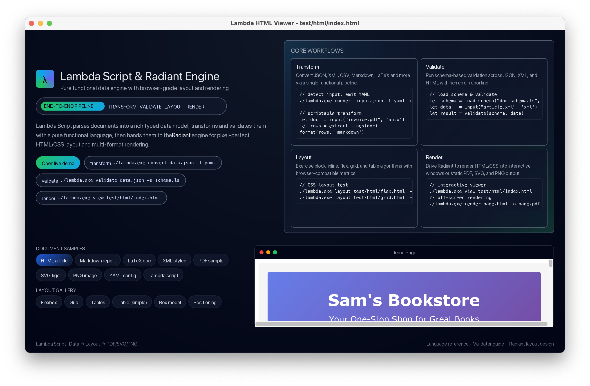
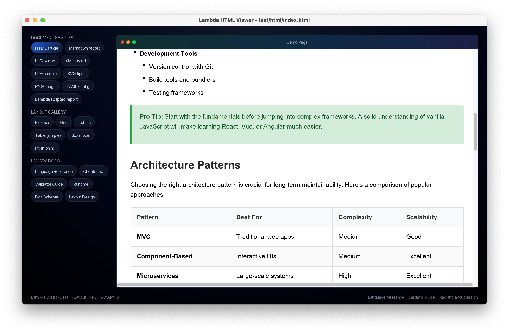

# Lambda Script

A general-purpose, cross-platform, functional scripting language and document processing engine.

Built from scratch in C/C++ with a custom and light-weight runtime (only **8 MB**), Tree-sitter parsing, MIR-based JIT compilation.

> Note: Lambda Script is still evolving — syntax/semantics and implementation details may change.
> A stable subset of the literal data model is separately formalised and released as
> [Mark Notation](https://github.com/henry-luo/mark).

## Overview
Lambda is designed for two things at once:

1) a small, expressive functional language for transforming data and documents, and
2) an end-to-end document pipeline (parse → normalize → validate/transform → layout → render/view).

Internally, Lambda treats documents as structured data. Different input formats (Markdown, Wiki, HTML/XML, JSON/YAML/TOML/CSV, LaTeX, PDF, …) can be parsed into a unified Lambda/Mark node tree, transformed with Lambda scripts, validated with schemas, and then rendered via the Radiant HTML/CSS/SVG layout engine.

## Features

### 1. Lambda script (pure functional runtime)
- **Pure-functional core** with immutable data structures (lists, arrays, maps, elements) and first-class functions and types.
- **Expressive pipe operator** (`|`) for fluent set-oriented data transformation pipelines with inline mapping and filtering.
- **Vector arithmetic** with automatic broadcasting — apply scalar operations to entire collections.
- **Powerful for-expressions** with `where`, `order by`, `limit`, `offset` clauses for SQL-like data querying.
- **Interactive REPL** for exploration and debugging.
- **Optional MIR JIT** execution path for performance-sensitive workloads.

### 2. Markup input parsing & formatting
- **Multi-format parsing**: JSON, XML, HTML, Markdown, Wiki, YAML/TOML/INI, CSV, LaTeX, PDF, and more.
- **One universal representation**: parse disparate syntaxes into a common Lambda/Mark node tree.
- **Conversion pipeline**: convert between formats using `lambda convert` (auto-detect input formats when possible).
- **Document-centric tooling**: designed to treat “documents as data”, not just as text.

### 3. Type system & schema validation
- **Rich type system** with type inference and explicit type annotations, similar to that of TypeScript.
- **Schema-based validation** for structured data and document trees (including element schemas for HTML/XML-like structures).
- **Format-aware validation** helpers that unwrap/normalize documents before validation.

### 4. Radiant HTML/CSS/SVG layout, rendering & viewer
- **Browser-compatible layout engine** supporting block/inline flow, flexbox, grid, and tables.
- **CSS cascade + computed style resolution**, with pixel-ratio aware sizing.
- **Render targets**: SVG / PDF / PNG / JPEG output via `lambda render`.
- **Unified interactive viewer** via `lambda view`:
   - HTML / XML (treated as HTML with CSS styling)
   - Markdown / Wiki (rendered with styling)
   - LaTeX (`.tex`) via conversion to HTML
   - Lambda script (`.ls`) evaluated to HTML and rendered (think of PHP)

## Language Highlights

### Pipe Operator & Data Pipelines

The pipe operator `|` enables fluent data transformations. Use `~` to reference the current item:

```lambda
// Map: double each element
[1, 2, 3] | ~ * 2                    // [2, 4, 6]

// Extract fields
users | ~.name                       // ["Alice", "Bob", "Carol"]

// Filter with 'where'
[1, 2, 3, 4, 5] where ~ > 3          // [4, 5]

// Chain operations: filter → map → aggregate
users where ~.age >= 18 | ~.name | len   // count adult names
```

### Vector Arithmetic

Scalar operations automatically broadcast over collections:

```lambda
1 + [2, 3]           // [3, 4]       — scalar + array
[1, 2] * 2           // [2, 4]       — array * scalar
[1, 2] + [3, 4]      // [4, 6]       — element-wise
[1, 2] ^ 2           // [1, 4]       — element-wise power
```

### For-Expressions with SQL-like Clauses

Powerful comprehensions with `let`, `where`, `order by`, `limit`, `offset`:

```lambda
// Filter and transform
for (x in data where x > 0) x * 2

// With local bindings
for (x in data, let sq = x * x where sq > 10) sq

// Sorting and pagination
for (x in items order by x.price desc limit 5) x.name
```

### Rich Type System

```lambda
// Type annotations
let x: int = 42
let items: [string] = ["a", "b"]

// Union and optional types
type Result = int | error
type Name = string?

// Function types
fn add(a: int, b: int) int => a + b
```

### Elements (Markup Literals)

First-class markup syntax for document generation:

```lambda
let card = <div class: "card";
    <h2; "Title">
    <p; "Content here.">
>
format(card, 'html)
```

### Built-in Multi-Format I/O

```lambda
// Read any format
let data = input("config.yaml", 'yaml)
let doc = input("article.md", 'markdown)

// Convert between formats
format(data, 'json)

// Write to file (in procedural functions)
data |> "/tmp/output.json"
```

## Demo
<p align="center">
  
  
</p>

### Run the demo

1. Download the Lambda binary for your platform from the GitHub Releases page, and unzip it.
2. Run:
   ```bash
   ./lambda.exe view
   ```

## Quick Start

### Install From Source

1. **Clone the repository:**
   ```bash
   git clone https://github.com/henry-luo/lambda.git
   cd lambda
   ```

2. **Install dependencies:**
   ```bash
   # macOS
   ./setup-mac-deps.sh

   # Linux
   ./setup-linux-deps.sh

   # Windows (under MSYS2)
   ./setup-windows-deps.sh
   ```

3. **Build:**
   ```bash
   make build
   ```
#### Build System

Lambda uses a Premake5-based build system generated from `build_lambda_config.json`.

```bash
make build             # Incremental build (recommended)
make release           # Optimized release build
make test              # Run unit test
make clean             # Clean build artifacts
make generate-grammar  # Regenerate Tree-sitter parser (auto-runs when grammar changes)
```

### Running

The build produces a runnable executable at the repo root: `lambda.exe`.

**Show help:**
```bash
./lambda.exe --help
```

**Interactive REPL:**
```bash
./lambda.exe
```

**Run a script:**
```bash
./lambda.exe script.ls
```

### CLI Commands

```bash
./lambda.exe <script.ls>                       # functional script
./lambda.exe run <script.ls>                   # procedural script
./lambda.exe validate <file> [-s <schema.ls>]
./lambda.exe convert <input> [-f <from>] -t <to> -o <output>
./lambda.exe layout <file.html|file.tex|file.ls> [options]
./lambda.exe render <input.html|input.tex|input.ls> -o <output.svg|pdf|png|jpg> [options]
./lambda.exe view [file.pdf|file.html|file.md|file.wiki|file.xml|file.tex|file.ls]
```

Tip: `./lambda.exe <command> --help` prints detailed options and examples.

## Examples

### Document Processing
```lambda
// Parse JSON and convert to Markdown
let data = input("data.json", 'json')
format(data, 'markdown')

// Process CSV data
let csv = input("data.csv", 'csv')
for (row in csv) {
  if (row.age > 25) row
}
```

### Interactive Analysis
```lambda
λ> let data = input("sample.json", 'json')
λ> data.users.length
42
λ> for (u in data.users) { if (u.active) u.name }
["Alice", "Bob", "Charlie"]
```

## Documentation

### Language Reference

| Document | Description |
|----------|-------------|
| [Lambda Reference](doc/Lambda_Reference.md) | Language overview, modules, I/O, and error handling |
| [Data & Collections](doc/Lambda_Data.md) | Literals, arrays, lists, maps, elements, and ranges |
| [Type System](doc/Lambda_Type.md) | Types, unions, patterns, and type declarations |
| [Expressions & Statements](doc/Lambda_Expr_Stam.md) | Operators, pipes, control flow, and comprehensions |
| [Functions](doc/Lambda_Func.md) | Function declarations, closures, and procedures |
| [System Functions](doc/Lambda_Sys_Func.md) | Built-in functions (math, string, collection, I/O) |
| [Cheatsheet](doc/Lambda_Cheatsheet.md) | Quick reference for syntax and common patterns |

### Other Documentation

| Document | Description |
|----------|-------------|
| [Validator Guide](doc/Lambda_Validator_Guide.md) | Schema-based validation for data structures |
| [Radiant Layout Design](doc/Radiant_Layout_Design.md) | HTML/CSS layout engine internals |
| [Doc Schema](doc/Doc_Schema.md) | Schema for lightweight markup (Markdown, Wiki, RST) |

### Developer Documentation

| Document | Description |
|----------|-------------|
| [Developer Guide](doc/dev/Developer_Guide.md) | Build from source, dependencies, testing, Tree-sitter grammar, MIR JIT |
| [C+ Coding Convention](doc/dev/C_Plus_Convention.md) | C/C++ coding convention: what C++ features are used vs. avoided, and why |
| [Lambda Runtime](doc/dev/Lamdba_Runtime.md) | Runtime internals and architecture |

## Platform Support

| Platform | Status | Notes                       |
| -------- | ------ | --------------------------- |
| macOS    | ✅ Full | Native development platform |
| Linux    | ✅ Full | Ubuntu 20.04+ tested        |
| Windows  | ✅ Full | Native build via MSYS2      |

## License

This project is licensed under the MIT License - see the [LICENSE](LICENSE) file for details.

## Acknowledgments

- **MIR Project**: JIT compilation infrastructure
- **Tree-sitter**: Incremental parsing framework
- **ThorVG**: SVG vector graphics library

## Support

- **Issues**: [GitHub Issues](https://github.com/henry-luo/lambda/issues)
