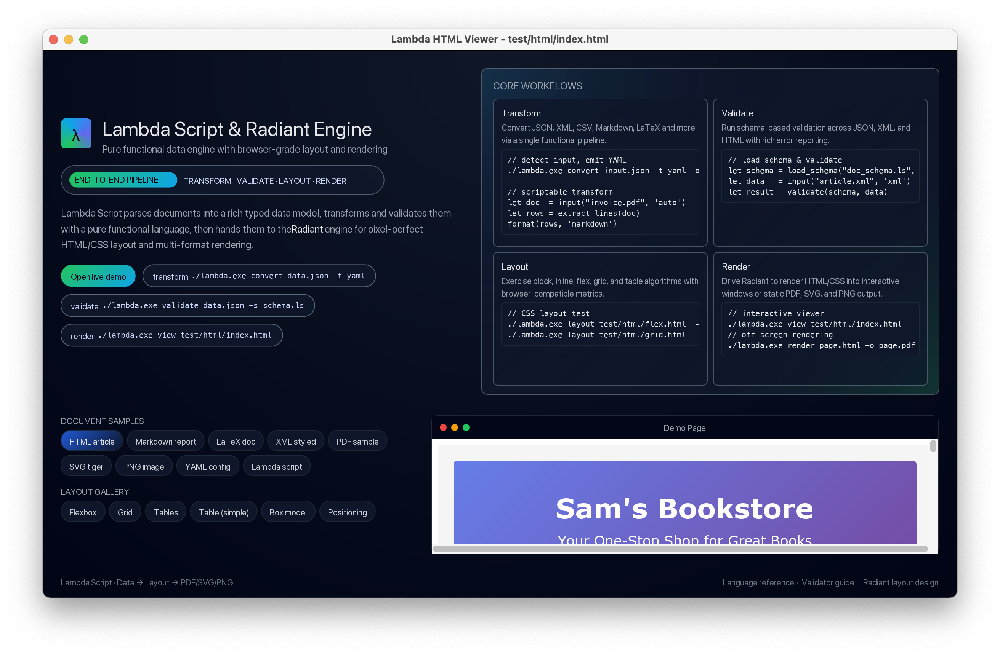
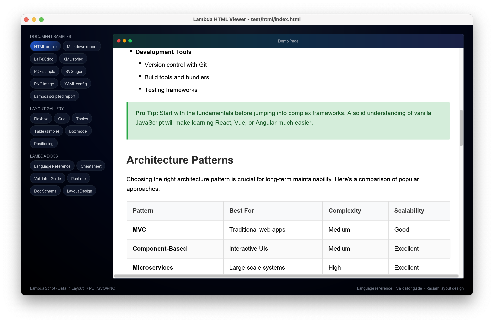
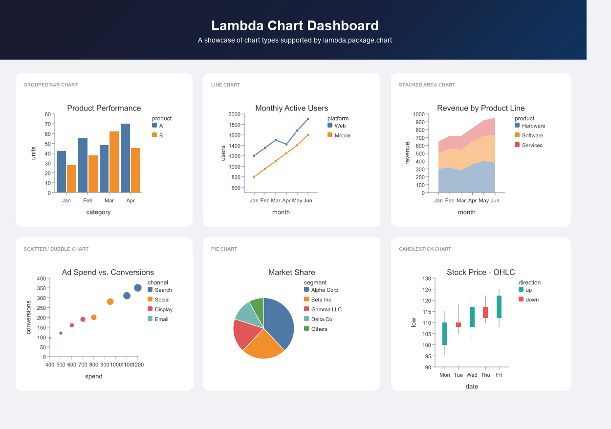

# Lambda Script


A general-purpose, cross-platform, functional scripting language and document processing engine, with a light-weight **9 MB** runtime, built from scratch in C/C++.

Lambda is designed for two things at once:

1) an expressive functional language for transforming data and documents, and
2) an end-to-end document pipeline (parse → validate/transform → layout → render/view).

Internally, Lambda treats documents as structured data. Different input formats (Markdown, Wiki, HTML/XML, JSON/YAML/TOML/CSV, LaTeX, PDF, …) are parsed into a unified Lambda/Mark node tree, transformed with Lambda scripts, validated with schemas, and then rendered via the Radiant HTML/CSS/SVG layout engine.

> Note: Lambda Script is still evolving — syntax/semantics and implementation details may change.
> A stable subset of the literal data model is separately formalised and released as
> [Mark Notation](https://github.com/henry-luo/mark).

## Demo

<p align="center">
  
  
</p>
<p align="center">
  
</p>

**Try it:** download the Lambda binary from the [Releases](https://github.com/henry-luo/lambda/releases) page, unzip, and run:
```bash
lambda view
```

## Features

**Lambda script (pure functional runtime)**
- **Pure-functional core** with immutable data structures (lists, arrays, maps, elements) and first-class functions and types.
- **Expressive pipe operator** (`|`) for fluent set-oriented data transformation pipelines with inline mapping and filtering.
- **Vector arithmetic** with automatic broadcasting — apply scalar operations to entire collections.
- **Powerful for-expressions** with `where`, `order by`, `limit`, `offset` clauses for SQL-like data querying.
- **Interactive REPL** for exploration and debugging.

**Markup input parsing & formatting**
- **Multi-format parsing**: JSON, XML, HTML, Markdown, Wiki, YAML/TOML/INI, CSV, LaTeX, PDF, and more.
- **One universal representation**: parse disparate syntaxes into a common Lambda/Mark node tree.
- **Conversion pipeline**: convert between formats using `lambda convert` (auto-detect input formats when possible).
- **Document-centric tooling**: designed to treat "documents as data", not just as text.

**Type system & schema validation**
- **Rich type system** with type inference and explicit type annotations, similar to that of TypeScript.
- **Schema-based validation** for structured data and document trees (including element schemas for HTML/XML-like structures).
- **Format-aware validation** helpers that unwrap/normalize documents before validation.

**Radiant HTML/CSS/SVG layout, rendering & viewer**
- **Browser-compatible layout engine** supporting block/inline flow, flexbox, grid, and tables.
- **Unified interactive viewer** via `lambda view`:
   - HTML / XML (treated as HTML with CSS styling)
   - Markdown / Wiki (rendered with styling)
   - LaTeX (`.tex`) via conversion to HTML
   - Lambda script (`.ls`) evaluated to HTML and rendered (think of PHP)
- **Render targets**: SVG / PDF / PNG / JPEG output via `lambda render`.

## Language Highlights

#### Elements (Markup Literals)

First-class markup syntax for document generation:

```lambda
let card = <div class: "card";
    <h2; "Title">
    <p; "Content here.">
>
format(card, 'html')
```

#### Vector Arithmetic

Scalar operations automatically broadcast over collections:

```lambda
1 + [2, 3]           // [3, 4]       — scalar + array
[1, 2] * 2           // [2, 4]       — array * scalar
[1, 2] + [3, 4]      // [4, 6]       — element-wise
[1, 2] ^ 2           // [1, 4]       — element-wise power
```

#### Pipe Operator & Data Pipelines

The pipe operator `|` enables fluent data transformations. Use `~` to reference the current item:

```lambda
// Map: double each element
[1, 2, 3] | ~ * 2                    // [2, 4, 6]

// Extract fields
users | ~.name                       // ["Alice", "Bob", "Carol"]

// Filter with 'where'
[1, 2, 3, 4, 5] where ~ > 3          // [4, 5]

// Chain operations: filter → map → aggregate
users where ~.age >= 18 | ~.name | len   // count adult names
```

#### For-Expressions with SQL-like Clauses

Powerful comprehensions with `let`, `where`, `order by`, `limit`, `offset`:

```lambda
// Filter and transform
for (x in data where x > 0) x * 2

// With local bindings
for (x in data, let sq = x * x where sq > 10) sq

// Sorting and pagination
for (x in items order by x.price desc limit 5) x.name
```

#### Rich Type System

```lambda
// Type annotations
let x: int = 42
let items: [string] = ["a", "b"]

// Union and optional types
type Result = int | error
type Name = string?

// Element type patterns
type Link = <a href: string; string>
type Article = <article title: string; string, Section*>

// Function types
fn add(a: int, b: int) int => a + b
```

#### Pattern-based Matching & Query

Match expressions support value, range, type, and constrained patterns:

```lambda
fn describe(x) => match x {
    case null:             "nothing"
    case 0:                "zero"              // literal value
    case 1 to 9:           "small number"      // range
    case int that (~ > 9): "big number"        // type + constraint
    case string:           "text: " ++ ~       // type
    case [int]:            "int array"         // collection type
    default:               "something else"
}
```

The `?` query operator searches data trees by type or structure, similar to jQuery:

```lambda
html?                    // all  descendants
html?<div class: string>      // <div>s with a class attribute
data?{status: "ok"}           // maps where status == "ok"
html[body][div]?<a>           // direct path then recursive search
```

## Quick Start

### Install From Source

1. **Clone the repository:**
   ```bash
   git clone https://github.com/henry-luo/lambda.git
   cd lambda
   ```

2. **Install dependencies:**
   ```bash
   # macOS
   ./setup-mac-deps.sh

   # Linux
   ./setup-linux-deps.sh

   # Windows (under MSYS2)
   ./setup-windows-deps.sh
   ```

3. **Build:**
   ```bash
   make build
   ```

Lambda uses a Premake5-based build system generated from `build_lambda_config.json`.

```bash
make build             # Incremental build (recommended)
make release           # Optimized release build
make test              # Run unit test
make clean             # Clean build artifacts
```

### CLI Commands

The build produces a runnable executable at the repo root: `lambda`.

```bash
lambda                                          # interactive REPL
lambda <script.ls>                              # run a functional script
lambda run <script.ls>                          # run a procedural script
lambda validate <file> [-s <schema.ls>]         # validate against a schema
lambda convert <input> -t <to> -o <output>      # format conversion
lambda render <input> -o <output.svg|pdf|png>   # render to image
lambda view [file.html|file.md|file.ls|...]     # open in interactive viewer
lambda --help                                   # show help
```

Tip: `lambda <command> --help` prints detailed options and examples.

## Examples

### Document Processing
```lambda
// Parse JSON and convert to Markdown
let data = input("data.json", 'json')
format(data, 'markdown')

// Process CSV data
let csv = input("data.csv", 'csv')
for (row in csv) {
  if (row.age > 25) row
}
```

### Interactive Analysis
```lambda
λ> let data = input("sample.json", 'json')
λ> data.users.length
42
λ> for (u in data.users) { if (u.active) u.name }
["Alice", "Bob", "Charlie"]
```

## Benchmark Results

Lambda's MIR JIT compiler is benchmarked across 6 standard benchmark suites (R7RS, AWFY, BENG, KOSTYA, LARCENY, JetStream) — 56 unique benchmarks in total — against Node.js (V8 JIT), QuickJS, and CPython.

| vs. Engine       |        Geo. Mean Ratio | Lambda Wins | Total |
| ---------------- | ---------------------: | :---------: | :---: |
| **Node.js (V8)** |              **1.05×** |     28      |  56   |
| **QuickJS**      | **0.12×** (8× faster)  |     49      |  53   |
| **CPython 3.13** | **0.08×** (13× faster) |     47      |  55   |

> Ratio < 1.0 = Lambda is faster.

**Highlights:**
- Competitive with Node.js V8 overall. Excels on tight numeric loops and recursive workloads (R7RS: 0.44×, AWFY micro: 0.05–0.30×).
- **13× faster than CPython** across the board (wins 47/55 benchmarks).

See the [full benchmark report](test/benchmark/Overall_Result4.md) for per-benchmark details, memory profiling, and cross-engine comparisons.

## Standards Conformance

| Standard | Pass Rate | Details |
|----------|----------:|---------|
| **HTML5** (html5lib/WPT) | **100%** | 1,560+ test cases from 63 html5lib test files |
| **CSS 2.1** (W3C test suite) | **98.2%** | 1,788 / 1,821 baseline tests passing |
| **CommonMark** | **100%** | 662 / 662 specification tests passing |
| **YAML 1.2** (official test suite) | **100%** | 231 / 231 tests passing |

## Documentation

### Language Reference

| Document                                            | Description                                         |
| --------------------------------------------------- | --------------------------------------------------- |
| [Cheatsheet](doc/Lambda_Cheatsheet.md)              | Quick reference for syntax and common patterns      |
| [Lambda Reference](doc/Lambda_Reference.md)         | Language overview, modules, I/O, and error handling |
| [CLI Reference](doc/Lambda_CLI.md)                  | Commands, flags, and usage for the Lambda CLI       |
| [Data & Collections](doc/Lambda_Data.md)            | Literals, arrays, lists, maps, elements, and ranges |
| [Type System](doc/Lambda_Type.md)                   | Types, unions, patterns, and type declarations      |
| [Expressions & Statements](doc/Lambda_Expr_Stam.md) | Operators, pipes, control flow, and comprehensions  |
| [Functions](doc/Lambda_Func.md)                     | Function declarations, closures, and procedures     |
| [System Functions](doc/Lambda_Sys_Func.md)          | Built-in functions (math, string, collection, I/O)  |
| [Validator Guide](doc/Lambda_Validator_Guide.md)    | Schema-based validation for data structures         |
| [Doc Schema](doc/Doc_Schema.md)                     | Schema for lightweight markup (Markdown, Wiki, RST) |

### Developer Documentation

| Document                                              | Description                                                            |
| ----------------------------------------------------- | ---------------------------------------------------------------------- |
| [Developer Guide](doc/dev/Developer_Guide.md)         | Build from source, dependencies, testing, Tree-sitter grammar, MIR JIT |
| [C+ Coding Convention](doc/dev/C_Plus_Convention.md)  | C/C++ coding convention                                                |
| [Lambda Runtime](doc/dev/Lamdba_Runtime.md)           | Runtime internals and architecture                                     |
| [Radiant Layout Design](doc/Radiant_Layout_Design.md) | HTML/CSS layout engine internals                                       |

## Platform Support

| Platform | Status | Notes                       |
| -------- | ------ | --------------------------- |
| macOS    | ✅ Full | Native development platform |
| Linux    | ✅ Full | Ubuntu 20.04+ tested        |
| Windows  | ✅ Full | Native build via MSYS2      |

## License

This project is licensed under the MIT License - see the [LICENSE](LICENSE) file for details.

## Acknowledgments

- **MIR Project**: JIT compilation infrastructure
- **Tree-sitter**: Incremental parsing framework
- **ThorVG**: SVG vector graphics library
