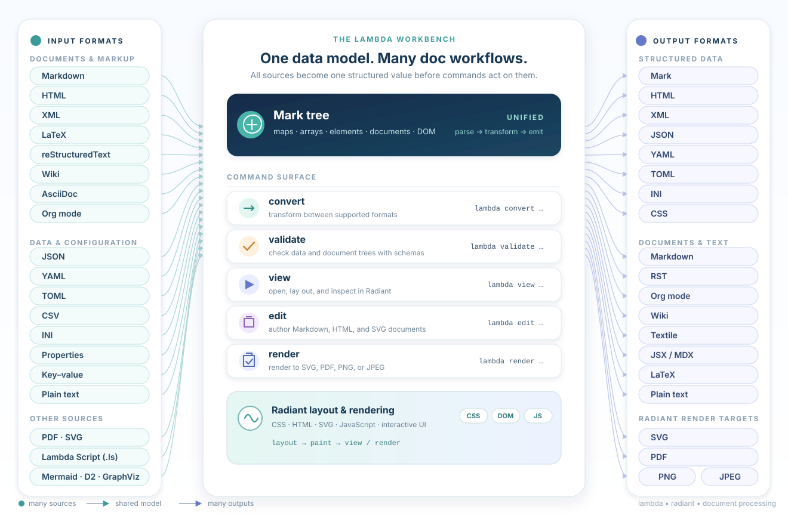

# The Lambda Document Pipeline

**One data model. Many document workflows.**

> *"It is better to have 100 functions operate on one data structure than 10 functions on 10 data structures."*
>
> — Alan Perlis, *Epigrams on Programming*, 1982



---

## Contents

- [Introduction: The Shape of the Pipeline](#introduction-the-shape-of-the-pipeline)
- [1. The Lambda / Mark Data Model](#section-1-the-lambda--mark-data-model)
- [2. From Input Formats to the Mark Tree](#section-2-from-input-formats-to-the-mark-tree)
- [3. Workflow Pipelines](#section-3-workflow-pipelines)
- [4. Comparison with Other Document Pipelines](#section-4-comparison-with-other-document-pipelines)
- [Further Reading](#further-reading)

---

## Introduction: The Shape of the Pipeline

Most document toolchains are built around a single *format*: a Markdown processor, an XML stack, a TeX engine, a html browser. Lambda is built around a *value tree*. Every source, whether prose markup, a data file, a PDF, a diagram description or a script, is parsed into the same in-memory structure, the **Mark tree**. Every command operates on that tree, and every output, pixels included, is derived from it. The diagram above is the whole architecture in one picture: sources converge on the left, outputs fan out on the right, and everything in between acts on one shared data model.

The pipeline is organized in four layers, each a directory of the source tree:

| Layer | Where | Role |
|---|---|---|
| **Input parsers** | `lambda/input/` | One parser per format. All of them build the Mark tree through the same construction API. |
| **Lambda runtime** | `lambda/` | The Mark data model, the Lambda Script language (JIT-compiled to native code through MIR), the type system and schema validator, and the hosted Lambda JS engine. |
| **Output formatters** | `lambda/format/` | The mirror image of the parsers: serialize a Mark tree as Mark, JSON, XML, YAML, HTML, Markdown, LaTeX and so on. |
| **Radiant** | `radiant/` | The HTML/CSS/SVG layout, rendering and interaction engine, in a window or to SVG, PDF, PNG/JPEG files, plus DOM events, animation, and editing. |

Two architectural decisions make these layers compose rather than merely coexist.

- **One value representation through out.** The value a parser produces is the value a script manipulates, a schema validates, a formatter serializes, JavaScript reads through the DOM API and Radiant lays out. Nothing is marshalled between subsystems, because there is no second representation to marshal into.
- **The document tree is the DOM.** Radiant does not build a separate view tree. It tags the parsed nodes in place with geometry, so CSS, layout, painting, events, scripting and editing all interoperate on one structure.

The command surface is small and maps directly onto the diagram:

| Command | What it does |
|---|---|
| `lambda convert` | Parse one format, emit another. |
| `lambda validate` | Check a data file or document tree against a schema. |
| `lambda script.ls`, `lambda run procedural.ls` | Query, transform or generate documents with Lambda Script. |
| `lambda layout`, `lambda render` | Lay out with CSS; render to SVG, PDF, PNG or JPEG. |
| `lambda view` | Open a document, a diagram, a script or a URL in the Radiant viewer, JavaScript included. |
| `lambda edit` | Edit Markdown, HTML and SVG in a Radiant window and save without loss. |


---
## 1: The Lambda / Mark Data Model

### 1.1 Mark: JSON and HTML, unified

The Mark tree is the runtime form of **Mark Notation**, a notation designed to hold *both* object data and markup in one data model. JSON gives it maps and arrays; HTML and XML give it elements. A stable subset of the literal syntax is formalized and released separately as [Mark Notation](https://github.com/henry-luo/mark); Lambda Script uses the same literals as its native data syntax, so a document and a program are written in one language.

Mark files use **`.mark` as their sole canonical extension** (D2.9.1).
Explicit `mark` input accepts any filename (D2.9.2), for example
`input("data.payload", 'mark')^`; `.m` and `.mk` are not automatic aliases.

```lambda
let report = <doc
    <meta title: "Quarterly report", date: t'2026-09-01'>
    <h1 "Summary">
    <p "Revenue grew " <strong "12%"> " year over year.">
    <table
        <tr <th "Region"> <th "Revenue">>
        <tr <td "EMEA"> <td 42>>
        <tr <td "APAC"> <td 31>>
    >
>
report.name          // 'doc' — the tag
report[0].title      // "Quarterly report" — an attribute of the first child
report[1][0]         // "Summary" — the text inside the heading
```

Three container kinds carry all structure:

| Building block | Literals | What it represents | Typical document use |
|---|---|---|---|
| Scalars | `"string"`, `123`, `true` | Text, numbers, booleans, null, dates, and other individual values | A title, measurement, publication date, or flag |
| **Maps** | `{name: "Alice", age: 30}` | Named fields and their values | Metadata, a configuration record, or a table row |
| **Arrays** | `[1, 2, 3]` | Ordered collections of values | Records, measurements, or a collection of documents |
| **Elements** | `<p class: "lead", "text">` | A name, named attributes, and ordered child content | Paragraphs, headings, links, tables, or application-specific markup |

The element is the load-bearing kind. Because it is simultaneously a map (its attributes) and a list (its children), one type can represent an HTML `<div>`, an XML record, a Pandoc-style document block, a diagram node or a Lambda object without any of them having to be encoded as a convention on top of JSON. Element content follows a small normalization rule set (S2.6): absent and empty items vanish, adjacent strings merge, and lists splice in place. This is what lets a parser and a script build the same tree and get the same shape.

The scalar vocabulary is richer than JSON's, which matters for documents and data alike: `symbol` (interned names, written `'markdown'`), `datetime` (`t'2026-09-01'`), exact `decimal` (`19.99m`), `binary` (`b'\xDEADBEEF'`), sized integers and floats, and a `path` type for files and URLs. A YAML timestamp, a TOML date, an iCalendar `DTSTART` or a vCard photo arrive as typed values, not as strings to be re-parsed downstream.

### 1.2 Documents are values

Lambda strictly separates functions from procedures. A transformation is an ordinary pure function from one tree to another: it can be re-run, cached, or executed in parallel without coordination.

Effects are governed by a single declared bit. `fn` functions are pure; `pn` procedures may perform I/O and mutation; a pure function can never call a procedure (S12.1.1v2). A document transformation written as `fn` is therefore *known* to be repeatable, and the parts of a pipeline that read files, fetch URLs or write output are visibly marked. Reactive templates apply the same doctrine: the template body is a pure transformation and mutation happens only in event handlers (S12.1.3).

### 1.3 Types are first-class and double as schemas

Lambda's type language describes shapes rather than classes. The same notation annotates program values, validates parsed input and matches templates:

```lambda
type Report = <doc
    <meta title: string, date: string>,
    <h1>,
    <p>*,
    <table>?
>
```

Element patterns state attributes, and content after it, with the familiar occurrence markers `*`, `+` and `?`. Maps, arrays, unions (`int | string`), optionals (`string?`) and literal types (`"GET" | "POST"`) compose freely (S11.1). A type declaration in a Lambda script *is* a schema; there is no separate schema language to learn (S11.4).

### 1.4 Querying and transforming the tree

Because every input becomes the same tree, one set of operators serves every format. The `?` operator searches all descendants by type or structure, in the spirit of XPath `//`; `[T]` selects direct children, like XPath `/`; the pipe `|>` maps, `|:` filters, and `for` comprehensions add SQL- and XQuery-style `where`, `order by`, `group by` and `limit` clauses:

```lambda
let report = <doc
    <h1 "Summary">
    <table
        <tr <th "Region"> <th "Revenue">>
        <tr <td "EMEA"> <td 42>>
        <tr <td "APAC"> <td 31>>
    >
>
let headers = report?<th> |> ~[0]                        // "Region", "Revenue"
let amounts = report?<td> |: (~[0] is int) |> ~[0]       // 42, 31
let total   = sum(report?<td> |: (~[0] is int) |> ~[0])  // 73
let large   = for (row in report?<tr> where row[1][0] is int and row[1][0] > 40) row[0][0]
count(report?<tr>)                                       // 3
```

The same expressions work unchanged on a parsed HTML page, an XML feed, a Markdown document or a JSON payload, because there is nothing format-specific left in the tree by the time a script sees it. Elements can also be rebuilt with the literal syntax, so generating a document is the same activity as querying one.

### 1.5 One representation from parser to pixel

The unifying property of the pipeline is that the Mark tree is never translated. The input parser builds it; the script sees it; the validator checks it; the formatter writes it; Radiant resolves CSS onto its elements, lays them out and paints them; and JavaScript on the page manipulates the same nodes through standard DOM and CSSOM APIs. Even the embedded JavaScript engine, Lambda JS, represents its values as the same tagged `Item` and runs on the same garbage collector and JIT, so a page script and a Lambda transformation are operating on literally the same objects.

---

## 2. From Input Formats to the Mark Tree


### 2.1 Prose markup: the Mark Doc schema

For this family of inputs, parser in `lambda/input/` follows one rule: **preserve structure, not presentation, and emit HTML wherever applicable.** Where a format has a concept HTML lacks, the parser introduces a small custom element rather than flattening the concept into text. The payoff is that a document parsed from any prose format can be handed straight to Radiant for layout, straight to a schema for validation, or straight to a formatter for a different syntax, with no per-format translation step in between.

Markdown, HTML5, reStructuredText, AsciiDoc, MediaWiki and DokuWiki markup, Org-mode, Textile, troff man pages, MDX and LaTeX all parse into the same element tree, the [Mark Doc schema](Doc_Schema.md). The schema is rooted at `<doc>`, carries metadata in a `<meta>` element, uses HTML element names for everything HTML can express (`<h1>`…`<h6>`, `<p>`, `<ul>`, `<table>`, `<a>`, ``, `<pre><code>`), and adds custom elements for what HTML cannot: `<math>`, `<cite>`, `<footnote>` and a `<raw>` pass-through. Its block and inline vocabulary is modelled on Pandoc's abstract syntax tree, so anyone who knows Pandoc's model already knows the shape of a Lambda document. Because a Markdown file, a wiki page and an HTML page all produce the same unified element tree, `lambda view` treats them as the same.

```markdown
# Hello

Some **bold** text with a [link](https://example.com).

- one
- two
```

```mark
<doc
  <meta>
  <h1 "Hello">
  <p "Some " <strong "bold"> " text with a " <a href:"https://example.com" "link"> ".">
  <ul <li "one"> <li "two">>
>
```

The parsers are held to the official conformance suites: the Markdown parser passes the full CommonMark test suite and the HTML5 parser passes the html5lib suite.
### 2.2 Data formats: maps, arrays and elements

Structured data maps onto the three container kinds without ceremony:

| Format | Becomes | Notes |
|---|---|---|
| JSON | maps and arrays | The closest format to Lambda's own literals. |
| YAML 1.2 | maps and arrays | All scalar kinds typed, including timestamps; multi-document streams supported; passes the YAML 1.2 test suite. |
| TOML | nested maps | Tables and dotted keys expand into nesting; arrays of tables become arrays of maps. |
| XML | element tree | A one-to-one mapping: tag, attributes, ordered children. |
| CSV | array of maps | The header row supplies the keys. |
| INI, `.properties`, key–value | maps | One or two levels of nesting. |
| CSS | array of rule maps | Selectors and declarations, usable as data or as a stylesheet. |

Once parsed, a configuration file and a spreadsheet export are just values: they can be joined in a `for` comprehension, checked against a `type`, or turned into a table element and rendered.

### 2.3 Other sources

The remaining parsers cover the sources a document pipeline meets in practice. PDF is parsed into an element tree with best-effort text-flow reconstruction, and a PDF package written in Lambda interprets page content streams for viewing. RTF and LaTeX produce Mark Doc trees, with LaTeX-specific constructs kept as `<cmd>` and `<env>` elements that a Lambda-side LaTeX package renders to HTML. Mathematics in LaTeX, Typst or AsciiMath syntax becomes a `<math>` tree that the math package typesets with CSS. Email (EML), vCard and iCalendar files become maps with typed dates. Graphviz DOT, D2, Mermaid and Structurizr diagram descriptions become a `<graph>` of `<node>` and `<edge>` elements that the graph package lays out and Radiant renders. JSX and MDX interleave components with expressions. A file directory listing is an array of file-info maps; an HTTP URL is fetched and dispatched on its content type.  


And a Lambda script can be seen as a functional mapping from its input sources, to the result, which is just another Mark tree.

### 2.4 Formatting Output

Formatters run the pipeline backwards. Mark itself is the lossless serialization of the tree; JSON, YAML, TOML, INI, XML, HTML, Markdown, reStructuredText, Org-mode, wiki, Textile, JSX/MDX, LaTeX and plain text each write the parts of the tree they can express, and math trees can be emitted as LaTeX, Typst, AsciiMath or MathML. Where a target lacks a concept the conversion is deliberately predictable rather than silently lossy: a `binary` value, for instance, becomes a standard base64 string in JSON and YAML. Because every parser and every formatter meets in the middle, adding one parser adds a route to every existing output, and adding one formatter adds a route from every existing input.

---

## 3. Workflow Pipelines

Every workflow is the same spine with different ends attached:

```text
source ─▶ parse ─▶ Mark tree ─▶ [validate] ─▶ format ─▶ text
                            └─▶ [transform] ─▶ layout ─▶ render ─▶ window · SVG · PDF · PNG
                                                           └─▶ edit ─▶ save
```


### 3.1 Convert

`lambda convert` is the shortest pipeline: one parser, one formatter, the tree in between.

```bash
lambda convert config.yaml -t json -o config.json
lambda convert paper.md -t latex -o paper.tex
lambda convert data.xml -t yaml -o data.yaml
lambda convert formula.tex -t html -o formula.html --full-document
```

The same conversion is a single function call inside a script, `format(input("config.yaml")^, 'json')`, which is how convert-and-then-do-something workflows begin.

### 3.2 Validate

`lambda validate` parses a file and checks the tree against a schema written in Lambda's type syntax. Schemas ship for HTML5, the Mark Doc schema shared by every prose format, and EML, iCalendar and vCard, so those formats validate with no arguments; data formats take a schema with `-s`.

```bash
lambda validate page.html                          # against the built-in HTML5 schema
lambda validate report.md                          # against the Mark Doc schema
lambda validate data.json -s report_schema.ls      # against your own types
lambda validate --strict config.yaml -s config_schema.ls --max-errors 50
```


### 3.3 Transform and generate

Scripts are where the pipeline becomes programmable. A script loads sources with `input()`, shapes them with queries, pipes and comprehensions, builds new elements with the literal syntax, and emits the result with `format()` or hands it to Radiant to layout and render:

```lambda
// load any supported format into the Mark tree
let doc = input("report.md", 'markdown')^

// derive a table of contents from the level-2 headings
let toc = <nav <ul for (h in doc?<h2>) <li h[0]>>>

// wrap the document and emit it in another format
format(<div toc doc>, 'html')
```

Two properties of the language shape how such scripts read. Data work looks like a query: `for (r in rows where int(r.amount) > 1000 order by r.region) r` is a complete filter-and-sort over a CSV, and vector arithmetic broadcasts over whole columns. And a script can *be* a document: `lambda view page.ls` evaluates the script and renders the element tree it returns, in the way a PHP page evaluates to HTML. Procedural work, such as walking a directory and writing many files, lives in `pn` procedures under a `main()` entry point run with `lambda run`.

### 3.4 Lay out and render

`lambda layout` and `lambda render` hand the tree to Radiant. Radiant resolves the CSS cascade onto the elements, lays them out with browser-compatible algorithms, and then render to a window through a vector backend or exports it as SVG or PDF, or rasterized as PNG and JPEG.

```bash
lambda render page.html -o page.svg
lambda render paper.tex -o paper.pdf
lambda render page.html -o shot.png -vw 1920 -vh 1080 --pixel-ratio 2.0
lambda render architecture.mmd -o architecture.svg -t github-dark
```

Radiant's CSS, DOM and editing behaviours are checked against subsets of the Web Platform Tests for conformance. [HTML_CSS_SVG_Support.md](HTML_CSS_SVG_Support.md) lists which HTML elements, CSS features and SVG features are supported, with the conformance figures and the differences between the output formats.

### 3.5 View, interact, script

`lambda view` opens the tree in Radiant's browsing shell, which accepts local files in every supported format as well as HTTP URLs. Pages run their JavaScript on LambdaJS, an engine that compiles JavaScript and TypeScript to the same MIR back end and represents values as the same `Item`, so scripts manipulate the live document through standard DOM and CSSOM APIs, with ES modules, promises and an event loop behind them. The engine is validated against the TC39 test262 conformance suite.

Interactivity in Lambda itself comes from **reactive templates**. A `view` or `edit` template declares the shape of data it presents, `apply()` dispatches each data item to the most specific matching template, and `on` handlers hold per-instance state and mutate the model. It combines XSLT's pattern-matched dispatch with React's component state while keeping the template body pure (S12.1.3); [Reactive UI](Reactive_UI.md) describes the model. The DOM behaviours themselves, such as focus, forms, ARIA and editing commands, are written as Lambda templates in the `dom` package rather than hard-coded in C++, so the engine's behaviour is inspectable and extensible in the same language users write.

### 3.6 Edit

`lambda edit` turns the viewer into an editor. Markdown and HTML open in a rich-text editor and SVG opens in a drawing editor with shape, text, fill and stroke tools. The editing application is itself a Lambda package built on the DOM layer. Its central guarantee is losslessness: a part of the document the editor has no model for, such as a footnote definition, a raw HTML block or a script, is shown read-only and written back exactly as it was read, and a file that could not be saved without loss is refused rather than opened as a lossy editor. Saves go through a temporary file and detect concurrent modification.

### 3.7 Batteries written in Lambda

A useful measure of a pipeline is how much of it can be built with its own tools. Several of Lambda's subsystems are Lambda packages rather than C++: the `chart` package turns data into SVG charts; the `graph` package lays out DOT, Mermaid and D2 diagrams; the `latex` package renders parsed LaTeX to HTML; the `math` package typesets `<math>` trees; the `pdf` package interprets PDF page content; the `openapi` package serves documentation and validates requests against an OpenAPI specification; and the `edit` and `dom` packages provide the editor and the DOM behaviours. Each of them is an ordinary program over the Mark tree, which is the strongest evidence that the model is general enough for the job.

A complete workflow, end to end, is therefore a few lines of shell:

```bash
lambda validate draft.md                                  # is the document well-formed?
lambda convert draft.md -t html -o site/draft.html        # publish as HTML
lambda render draft.md -o draft.pdf                       # and as a printable PDF
lambda edit draft.md                                      # fix a paragraph, save losslessly
```

---

## 4. Comparison with Other Document Pipelines

Lambda overlaps with several established toolchains, each excellent at the part of the pipeline it was built for.

### 4.1 Pandoc

Pandoc is the reference universal document converter: dozens of readers and writers meeting at a typed Haskell AST, with Lua and JSON filters for transformation and a template language for output. Lambda's Mark Doc schema is deliberately modelled on Pandoc's AST, and `lambda convert` covers the same convert-anything-to-anything ground. The differences are in what surrounds the AST. Pandoc's tree is reachable only from filters; Lambda's tree is the native data type of a general-purpose language, so querying, joining with external data and generating documents are ordinary programming. Pandoc has no schema layer, while Lambda validates any input against `type` declarations. And Pandoc stops at text: PDF output delegates to an external engine such as LaTeX, ConTeXt, Typst or a headless browser, whereas Lambda carries its own CSS layout engine, renderer, viewer and editor. Pandoc remains far ahead in breadth of exotic formats, in citation processing, and in a decade of community filters.

### 4.2 The XML stack

XML with XML Schema or RELAX NG for validation, XPath and XQuery for query, XSLT for transformation and XSL-FO for print layout is the most complete precedent for what Lambda attempts, and Lambda borrows from it openly: `?` and `[T]` echo XPath's `//` and `/`, the for-comprehension is FLWOR in a modern coat, the reactive templates are `apply-templates` with state, and elements are the XML infoset generalized. What Lambda changes is the number of languages and processors. The XML stack is five specifications with separate engines, its data model is text-centric (maps and arrays arrived late, in XPath 3.1), and JSON, YAML and Markdown sources have to be lifted into XML before any of it applies. Lambda has one data model that already contains maps, arrays and typed scalars, one language for query, schema, transformation and templates, and CSS in place of XSL-FO for layout. The XML stack's advantages are its standardization, its enterprise-grade processors, and XSL-FO or CSS Paged Media engines whose print output is more mature than Radiant's today.

### 4.3 Typst: programmable typesetting

Typst is a modern typesetting system: a markup language with an embedded scripting language, its own layout engine, incremental compilation and PDF, SVG and PNG output. It is the closest thing to Lambda's render path, and it is better at print typesetting than Radiant is: pagination, footnotes, bibliographies and mathematical layout are its core competence. The difference is direction. Typst is a language you write documents *in*; data enters through loader functions and other markup formats must first be converted to Typst. Lambda is a pipeline documents *pass through*: Markdown, HTML, LaTeX, XML and data files are first-class inputs, the layout model is the web's CSS rather than a bespoke one, and the same engine that produces the PDF also runs the interactive viewer and editor. 

### 4.4 TeX and LaTeX: a publishing ecosystem


LaTeX builds document preparation on TeX and provides document structures, mathematical typesetting, references, and a large package ecosystem. That ecosystem is a major consideration for scientific publishing and existing publisher workflows. Lambda treats LaTeX as an readable input format and renders it through HTML and CSS rather than as a competing engine.

### 4.5 unified.js: format-centric generators under JS

The unified ecosystem (remark for Markdown, rehype for HTML, retext for prose) is the JavaScript world's document pipeline: a syntax tree per format, a large plugin catalogue, and the browser for rendering. Lambda differs in having one tree rather than one per format, so there is no mdast-to-hast bridge to cross, and in running natively rather than on Node with a browser attached. Documentation generators such as Sphinx and Docutils, Asciidoctor and Quarto are format-centric by design, each built around one source syntax and its extensions; Quarto notably layers computation on Pandoc. They are mature products with large user bases, where Lambda is a general engine that such a generator could be built on.

### 4.6 Browser for HTML and CSS paginated output

For turning HTML and CSS into pixels or PDF, the established options are a headless browser (Chromium through Puppeteer or Playwright) or a dedicated CSS Paged Media renderer such as Prince, WeasyPrint or Paged.js. Radiant belongs to this family and is measured against a browser's output, but it is packaged differently: a browser-grade layout engine embedded in a 20 MB executable alongside the parsers and the language, rather than a separate 200 MB process driven over a protocol. Chromium's web compatibility is, and will remain, broader; Prince's paged output is more polished. Radiant's proposition is that layout is one stage of a pipeline, sharing its tree with everything before and after it, rather than the whole product.

### 4.6 Summary

| | Pandoc | XML stack | Typst | unified.js | Headless browser | **Lambda + Radiant** |
|---|---|---|---|---|---|---|
| **Data model** | Haskell AST | XML infoset, XDM | Typst content | one tree per syntax | HTML DOM | one Mark tree: maps, arrays, elements, typed scalars |
| **Inputs** | dozens of formats | XML | Typst markup, data loaders | Markdown, HTML | HTML | ~30 markup, data, document and diagram formats |
| **Transformation** | Lua / JSON filters | XSLT, XQuery | Typst scripting | JS plugins | JavaScript | Lambda Script, hoisted JavaScript |
| **Schema validation** | none | XSD, RELAX NG | none | none | none | built-in `type` schemas |
| **Layout and rendering** | delegated | XSL-FO engines | own engine | browser | full browser | own CSS engine: window, SVG, PDF, PNG, JPEG |
| **Interactive view and edit** | no | no | separate web app | browser | yes | built-in viewer, editor, reactive templates |
| **Footprint** | single binary | several processors | single binary | Node + browser | 200 MB+ | single ~20 MB executable |

### 4.7 Where Lambda sits

Lambda's position is the intersection the table leaves empty: a converter's breadth of formats, a query language's grip on the data, a schema language's guarantees, and a rendering engine's output, all operating on one tree inside one small executable. That position also fixes its trade-offs honestly. The project is young and its syntax is still evolving. Print typesetting is not yet at the level of TeX or Typst, and text shaping for right-to-left and complex scripts is missing. Web compatibility is narrower than Chromium's, and the ecosystem of ready-made filters and plugins is smaller than Pandoc's or unified's. What Lambda offers in exchange is coherence: the same value model from parser to pixel, and one language to work on it at every stage.

---

## Further Reading

- [Markup & Data Format Support](Markup_Formats_Support.md): every input format, with side-by-side source and Mark examples.
- [Mark Doc Schema](Doc_Schema.md): the unified document element vocabulary.
- [Lambda Data](Lambda_Data.md), [Lambda Type](Lambda_Type.md), [Lambda Expressions](Lambda_Expr_Stam.md): the data model, the type language and the query operators in full.
- [Lambda Validator Guide](Lambda_Validator.md): writing and applying schemas.
- [Lambda CLI Reference](Lambda_CLI.md): every command and flag.
- [Reactive UI](Reactive_UI.md): `view` and `edit` templates, `apply()` dispatch and event handlers.
- [Radiant Design Overview](dev/radiant/RAD_00_Overview.md), [Lambda Core Runtime Overview](dev/lambda/LR_00_Overview.md), [LambdaJS Overview](dev/js/JS_00_Overview.md): the engines in depth.
- [Lambda Formal Semantics](Lambda_Formal_Semantics.md) and [Lambda Formal Design](Lambda_Formal_Design.md): the normative rulings (`S#`, `D#`) cited above.
