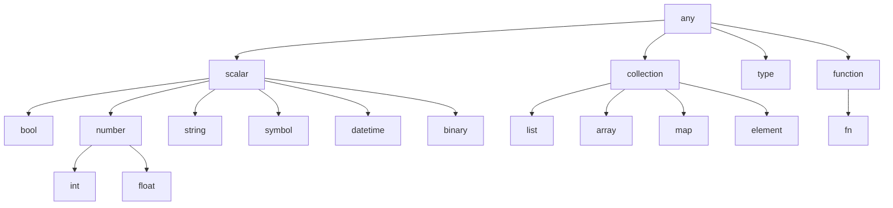

# Lambda Type System

This document covers Lambda's type system, including first-class types, type hierarchy, type patterns, and string pattern definitions.

> **Related Documentation**:
> - [Lambda Reference](Lambda_Reference.md) — Language overview and syntax
> - [Lambda Data](Lambda_Data.md) — Literals and collections
> - [Lambda Expressions](Lambda_Expr_Stam.md) — Expressions and statements

---

## Table of Contents

1. [Type System Overview](#type-system-overview)
2. [First-Class Types](#first-class-types)
3. [Type Hierarchy](#type-hierarchy)
4. [Basic Types](#basic-types)
5. [Collection Types](#collection-types)
6. [Union Types](#union-types)
7. [Function Types](#function-types)
8. [Type Declarations](#type-declarations)
9. [Type Occurrences](#type-occurrences)
10. [Type Patterns](#type-patterns)
11. [String Patterns](#string-patterns)
12. [Type Checking](#type-checking)
13. [Type Inference](#type-inference)

---

## Type System Overview

Lambda Script features a **strong, static type system** with inference. Types are:

- **First-class values** — Types can be assigned to variables, passed as arguments, and returned from functions
- **Structurally typed** — Compatibility based on structure, not declaration
- **Inferred** — Types are automatically deduced when not explicitly annotated
- **Checked at compile-time** — Type errors caught before execution

### Design Principles

1. **Safety**: Prevent runtime type errors through compile-time checking
2. **Expressiveness**: Rich type constructs for complex data modeling
3. **Ergonomics**: Type inference reduces annotation burden
4. **Documents as Data**: Types model structured documents naturally

---

## First-Class Types

Types in Lambda are first-class values that can be manipulated like any other value:

```lambda
// Assign types to variables
let T = int
let StringList = [string]
let UserType = {name: string, age: int}

// Pass types as arguments
fn validate(value, expected_type: type) => value is expected_type

validate(42, int)           // true
validate("hello", int)      // false

// Return types from functions
fn element_type(arr_type: type) => arr_type.element
element_type([int])         // int

// Type in collections
let types = [int, string, bool]
```

### Type Inspection

```lambda
// Get type of a value
type(42)           // int
type("hello")      // string
type([1, 2, 3])    // [int]
type({a: 1})       // {a: int}

// Type comparison
type(42) == int           // true
type([1,2]) == [int]      // true
```

---

## Type Hierarchy

Lambda's type system forms a hierarchy with `any` at the top and `null` at the bottom:



### Subtype Relations

| Subtype | Supertype | Example |
|---------|-----------|---------|
| `int` | `number` | `42 is number` → `true` |
| `float` | `number` | `3.14 is number` → `true` |
| `[int]` | `[any]` | `[1,2,3] is [any]` → `true` |
| `null` | `T?` | `null is int?` → `true` |
| Every type | `any` | `"hello" is any` → `true` |

---

## Basic Types

### Primitive Type Literals

```lambda
// Type literals
null        // Null type (singleton)
bool        // Boolean type
int         // 56-bit signed integer
float       // 64-bit floating point
decimal     // Arbitrary precision decimal
string      // UTF-8 string
symbol      // Interned symbol
binary      // Binary data
datetime    // Date and time
path        // File path or URL
```

### Type Constants

```lambda
// Special type values
any         // Top type (supertype of all)
error       // Error type
number      // Union: int | float
```

### Type Examples

```lambda
// Variables with type annotations
let x: int = 42
let name: string = "Alice"
let pi: float = 3.14159
let active: bool = true
let created: datetime = t'2025-01-01'
let config_path: path = .config.json
```

---

## Collection Types

### Array Types

```lambda
// Homogeneous arrays
[int]              // Array of integers
[string]           // Array of strings
[bool]             // Array of booleans

// Nested arrays
[[int]]            // Array of integer arrays
[[[string]]]       // 3D array of strings

// Array with any element
[any]              // Array of any type

// Examples
let nums: [int] = [1, 2, 3]
let matrix: [[int]] = [[1, 2], [3, 4]]
```

### List Types (Tuples)

```lambda
// Fixed-length tuples with specific types
(int, string)              // Pair of int and string
(int, int, int)            // Triple of ints
(string, int, bool)        // Mixed types

// Examples
let point: (int, int) = (10, 20)
let record: (string, int, bool) = ("Alice", 30, true)
```

### Map Types

```lambda
// Structural map types
{name: string, age: int}           // Required fields
{name: string, age?: int}          // Optional age field
{name: string, ...}                // Open map (allows extra fields)

// Nested maps
{
    user: {name: string, email: string},
    settings: {theme: string, notifications: bool}
}

// Examples
let person: {name: string, age: int} = {name: "Bob", age: 25}
```

### Element Types

```lambda
// Element type syntax
<tag>                              // Element with tag
<tag attr: type>                   // With attribute types
<tag attr: type; content_type>     // With content type

// Examples
type Paragraph = <p; string>
type Link = <a href: string; string>
type Article = <article title: string, author: string;
    string,           // Text content
    [Section]         // Array of sections
>
```

---

## Union Types

Union types allow a value to be one of several types:

```lambda
// Basic union
int | string           // Either int or string
int | float | string   // One of three types

// Nullable types (shorthand and explicit)
int?                   // Same as: int | null
string?                // Same as: string | null

// Union in function parameters
fn process(value: int | string) => ...

// Union in collections
let mixed: [int | string] = [1, "two", 3, "four"]
```

### Pattern Matching with Unions

```lambda
fn describe(value: int | string | bool) => {
    if (value is int) "integer: " ++ string(value)
    else if (value is string) "string: " ++ value
    else "boolean: " ++ string(value)
}
```

---

## Function Types

### Function Type Syntax

```lambda
// Function type declaration
fn (int) int                    // Takes int, returns int
fn (int, int) int               // Takes two ints, returns int
fn (string, bool) string        // Takes string and bool, returns string
fn int                          // No params, returns int (shorthand for fn () int)
fn ()                           // No params, no meaningful return

// With parameter names (documentation only)
fn (a: int, b: int) int         // Named parameters
fn (name: string) string        // Named parameter

// Higher-order function types
fn (fn (int) int) int           // Takes a function, returns int
fn (int) fn (int) int           // Returns a function
```

### Function Type Examples

```lambda
// Type alias for function types
type BinaryOp = fn (a: int, b: int) int
type Predicate = fn (x: int) bool
type Transform = fn (s: string) string

// Using function types
let add: BinaryOp = (a, b) => a + b
let isPositive: Predicate = (x) => x > 0
let upper: Transform = (s) => s.upper()

// Higher-order function
fn apply(f: fn (int) int, x: int) int => f(x)
apply((x) => x * 2, 5)  // 10
```

---

## Type Declarations

### Type Aliases

```lambda
// Simple aliases
type UserId = int
type UserName = string
type Point = (float, float)

// Collection aliases
type IntList = [int]
type StringMap = {string: string}

// Usage
let id: UserId = 12345
let name: UserName = "alice"
let pos: Point = (10.5, 20.5)
```

### Object Types

```lambda
// Structural object type
type User = {
    id: int,
    name: string,
    email: string,
    active: bool
}

// With optional fields
type Config = {
    host: string,
    port: int,
    timeout?: int,      // Optional
    debug?: bool        // Optional
}

// Nested types
type Company = {
    name: string,
    address: {
        street: string,
        city: string,
        zip: string
    },
    employees: [User]
}
```

### Element Types

```lambda
// Define document structure types
type Section = <section heading: string;
    string            // Section content
>

type Article = <article title: string, author: string;
    string,           // Intro text
    [Section]         // Array of sections
>

// Usage
let doc: Article = <article title: "Lambda Guide", author: "Team";
    "Introduction to Lambda Script"
    <section heading: "Basics"; "Getting started...">
    <section heading: "Advanced"; "Deep dive...">
>
```

---

## Type Occurrences

Type occurrences specify cardinality and optionality:

### Optional Types

```lambda
// Optional (nullable) types
int?               // int | null
string?            // string | null
[int]?             // Array or null

// In function parameters
fn greet(name: string, title?: string) => ...

// In map fields
type User = {
    name: string,      // Required
    nickname?: string  // Optional
}
```

### Array Occurrence Modifiers

```lambda
// Zero or more (array)
int*               // Same as [int] - array of zero or more
string*            // Array of zero or more strings

// One or more (non-empty array)
int+               // Array of at least one int
string+            // Non-empty string array

// Examples
type Args = string*        // Zero or more arguments
type Names = string+       // At least one name required

// In function signatures
fn concat(parts: string+) => ...   // Requires at least one
```

### Occurrence Summary

| Syntax | Meaning | Equivalent |
|--------|---------|------------|
| `T` | Exactly one | Required |
| `T?` | Zero or one | `T \| null` |
| `T*` | Zero or more | `[T]` |
| `T+` | One or more | Non-empty `[T]` |

---

## Type Patterns

Type patterns enable matching and destructuring based on type structure.

### Basic Type Matching

```lambda
// Type check with 'is'
42 is int                  // true
"hello" is string          // true
[1, 2] is [int]            // true

// Negated type check
42 is not string           // true
null is not int            // true

// Type in conditionals
if (value is string) {
    value.upper()          // Safe: value is string here
}
```

### Collection Type Patterns

```lambda
// Array element type matching
let arr = [1, 2, 3]
arr is [int]               // true
arr is [string]            // false
arr is [number]            // true (int is subtype of number)

// Map structure matching
let obj = {name: "Alice", age: 30}
obj is {name: string}      // true (has required field)
obj is {name: string, age: int}  // true
obj is {email: string}     // false (missing required field)
```

### Union Type Patterns

```lambda
fn process(value: int | string | null) => {
    if (value is null) "nothing"
    else if (value is int) "number: " ++ string(value)
    else "text: " ++ value
}
```

### Type Guards

Type patterns act as type guards, narrowing the type in subsequent code:

```lambda
fn handle(data: any) => {
    if (data is [int]) {
        // data is [int] here
        sum(data)
    } else if (data is {values: [int]}) {
        // data is {values: [int]} here
        sum(data.values)
    } else {
        error("Unsupported type")
    }
}
```

---

## String Patterns

String patterns define named validation rules for string and symbol values, using a regex-like syntax integrated into the type system.

### Pattern Definition Syntax

```lambda
// String pattern: defines a pattern type for strings
string PatternName = pattern_expression

// Symbol pattern: defines a pattern type for symbols
symbol PatternName = pattern_expression
```

### Literal Patterns

```lambda
// Exact string match
string Hello = "hello"

// Alternatives with union operator
string Greeting = "hello" | "hi" | "hey"

// HTTP methods
string HttpMethod = "GET" | "POST" | "PUT" | "DELETE" | "PATCH"
```

### Character Classes

```lambda
// Built-in character classes
\d    // digit [0-9]
\w    // word character [a-zA-Z0-9_]
\s    // whitespace
\a    // alphabetic [a-zA-Z]

// Any single character
\.

// Any characters (zero or more) - shorthand for \.*
...

// Examples
string Digit = \d                    // single digit
string Word = \w+                    // one or more word characters
string Anything = ...                // any string
```

### Character Ranges

```lambda
// Range with 'to' keyword (like regex [a-z])
string LowerLetter = "a" to "z"
string UpperLetter = "A" to "Z"
string HexDigit = "0" to "9" | "a" to "f" | "A" to "F"
```

### Occurrence Modifiers

```lambda
// Standard quantifiers
?       // zero or one (optional)
+       // one or more
*       // zero or more

// Exact count
[n]     // exactly n occurrences

// Bounded ranges
[n+]    // n or more occurrences
[n, m]  // between n and m occurrences (inclusive)

// Examples
string OptionalPrefix = "pre"? \w+           // optional "pre" prefix
string Identifier = \a \w*                    // letter followed by word chars
string ThreeDigits = \d[3]                    // exactly 3 digits
string Phone = \d[3] "-" \d[3] "-" \d[4]      // 555-123-4567
string ZipCode = \d[5] ("-" \d[4])?           // 12345 or 12345-6789
```

### Pattern Composition

```lambda
// Sequence: patterns concatenate
string FullName = \a+ " " \a+                 // first space last

// Union: match either pattern
string YesNo = "yes" | "no"

// Intersection: must match both patterns
string AlphaNum = \a & \w                     // alpha that is also word char

// Negation: exclude pattern
string NotDigit = !\d                         // any char except digit
```

### Complex Pattern Examples

```lambda
// Email-like pattern
string Email = \w+ "@" \w+ "." \a[2, 6]

// URL path segment
string PathSegment = ("/" \w+)+

// Version string: v1.2.3
string Version = "v" \d+ "." \d+ "." \d+

// Hex color: #RGB or #RRGGBB
string HexDigit = "0" to "9" | "a" to "f" | "A" to "F"
string HexColor = "#" (HexDigit[3] | HexDigit[6])

// Date format: YYYY-MM-DD
string DatePattern = \d[4] "-" \d[2] "-" \d[2]

// Username: 3-20 chars, starts with letter
string Username = \a \w[2, 19]
```

### Symbol Patterns

Symbol patterns work identically but define patterns for symbol values:

```lambda
// Symbol pattern for identifiers
symbol Keyword = 'if' | 'else' | 'for' | 'while'
```

### Using Patterns as Types

Pattern names can be used as types for validation:

```lambda
// Use pattern as parameter type
fn validate_email(email: Email) => ...

// Use in type annotations
let method: HttpMethod = "GET"

// Type checking with 'is'
"hello" is Greeting              // true
"goodbye" is Greeting            // false
"v1.2.3" is Version              // true
```

---

## Type Checking

### Static Type Checking

Lambda performs type checking at compile time:

```lambda
// Type errors caught at compile time
let x: int = "hello"           // Error: string not assignable to int
let y: [int] = [1, "two", 3]   // Error: mixed types in [int]

fn add(a: int, b: int) int => a + b
add(1, "2")                    // Error: string not assignable to int
```

### Runtime Type Checks

Use `is` for runtime type validation:

```lambda
fn safe_process(value: any) => {
    if (value is int) {
        value * 2
    } else if (value is string) {
        len(value)
    } else {
        error("Unsupported type: " ++ string(type(value)))
    }
}
```

### Type Assertions

```lambda
// Assert type (unsafe - runtime error if wrong)
let num = value as int         // Asserts value is int

// Safe assertion with check
let num = if (value is int) value else error("Expected int")
```

---

## Type Inference

Lambda infers types automatically when not explicitly annotated:

### Variable Inference

```lambda
// Types inferred from initializer
let x = 42                     // x: int
let name = "Alice"             // name: string
let items = [1, 2, 3]          // items: [int]
let user = {name: "Bob"}       // user: {name: string}
```

### Function Return Inference

```lambda
// Return type inferred from body
fn double(x: int) => x * 2     // Returns int
fn greet(name: string) => "Hello, " ++ name  // Returns string

// Complex inference
fn process(items: [int]) => {
    let filtered = items where ~ > 0
    let doubled = filtered | ~ * 2
    sum(doubled)
}  // Returns int
```

### Collection Inference

```lambda
// Element type inferred from contents
let nums = [1, 2, 3]           // [int]
let mixed = [1, 2.5, 3]        // [number] (int promoted to number)
let empty = []                 // [any] (unknown element type)

// Map type inferred from structure
let config = {
    host: "localhost",
    port: 8080,
    debug: true
}  // {host: string, port: int, debug: bool}
```

### Inference Limitations

```lambda
// Sometimes explicit annotation needed
let empty: [int] = []          // Disambiguate empty array type

// Recursive types need annotation
type Node = {value: int, next: Node?}

// Complex generics may need hints
fn identity<T>(x: T) T => x    // Generic requires annotation
```

---

## Type Compatibility

### Structural Compatibility

Lambda uses structural typing — types are compatible if they have compatible structure:

```lambda
type Point2D = {x: int, y: int}
type Coordinate = {x: int, y: int}

// These are compatible (same structure)
let p: Point2D = {x: 1, y: 2}
let c: Coordinate = p          // OK: same structure

// Subtype compatibility (more fields is OK)
type Point3D = {x: int, y: int, z: int}
let p3d: Point3D = {x: 1, y: 2, z: 3}
let p2d: Point2D = p3d         // OK: Point3D has all Point2D fields
```

---

This document covers Lambda's type system comprehensively. For data structure details, see [Lambda Data](Lambda_Data.md). For expressions using these types, see [Lambda Expressions](Lambda_Expr_Stam.md).
