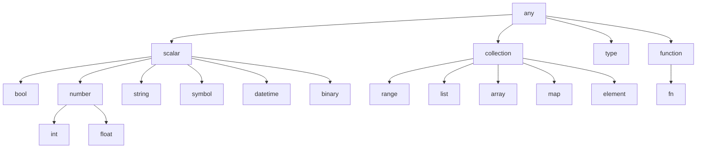

# Lambda Type System

This document covers Lambda's type system, including first-class types, type hierarchy, type patterns, and string pattern definitions.

> **Related Documentation**:
> - [Lambda Reference](Lambda_Reference.md) — Language overview and syntax
> - [Lambda Data](Lambda_Data.md) — Literals and collections
> - [Lambda Expressions](Lambda_Expr_Stam.md) — Expressions and statements

---

## Table of Contents

1. [Type System Overview](#type-system-overview)
2. [First-Class Types](#first-class-types)
3. [Type Hierarchy](#type-hierarchy)
4. [Basic Types](#basic-types)
5. [Collection Types](#collection-types)
6. [Function Types](#function-types)
7. [Type Declarations](#type-declarations)
8. [Type Occurrences](#type-occurrences)
9. [Type Patterns](#type-patterns)
10. [String Patterns](#string-patterns)
11. [Type Checking](#type-checking)
12. [Type Inference](#type-inference)

---

## Type System Overview

Lambda Script features a **strong, static type system** with inference. Types are:

- **First-class values** — Types can be assigned to variables, passed as arguments, and returned from functions
- **Structurally typed** — Compatibility based on structure, not declaration
- **Inferred** — Types are automatically deduced when not explicitly annotated
- **Checked at compile-time** — Type errors caught before execution

### Design Principles

1. **Safety**: Prevent runtime type errors through compile-time checking
2. **Expressiveness**: Rich type constructs for complex data modeling
3. **Ergonomics**: Type inference reduces annotation burden
4. **Documents as Data**: Types model structured documents naturally

---

## First-Class Types

Types in Lambda are first-class values that can be manipulated like any other value:

```lambda
// Assign types to variables
let T = int
let StringList = string[]
let UserType = {name: string, age: int}

// Pass types as arguments
fn validate(value, expected_type: type) => value is expected_type

validate(42, int)           // true
validate("hello", int)      // false

// Return types from functions
fn element_type(arr_type: type) => arr_type.element
element_type(int[])         // int

// Type in collections
let types = [int, string, bool]
```

### Type Inspection

```lambda
// Get type of a value
type(42)           // type int
type("hello")      // type string
type([1, 2, 3])    // type array
type({a: 1})       // type map

// Type comparison
type(42) == int           // true
type(123) != string       // true
type([1,2]) == array      // true
```

---

## Type Hierarchy

Lambda's type system forms a hierarchy with `any` at the top and `null` at the bottom:


```mermaid
flowchart TD
    any --> scalar
    any --> collection
    any --> type
    any --> function
    scalar --> bool
    scalar --> number
    scalar --> string
    scalar --> symbol
    scalar --> datetime
    scalar --> binary
    number --> int
    number --> float
    collection --> range
    collection --> list
    collection --> array
    collection --> map
    collection --> element
    function --> fn
```

### Subtype Relations

| Subtype | Supertype | Example |
|---------|-----------|---------|
| `int` | `number` | `42 is number` → `true` |
| `float` | `number` | `3.14 is number` → `true` |
| `range` | `collection` | `(1 to 10) is range` → `true` |
| `int[]` | `any[]` | `[1,2,3] is any[]` → `true` |
| `null` | `T?` | `null is int?` → `true` |
| Every type | `any` | `"hello" is any` → `true` |

---

## Basic Types

### Primitive Type Literals

```lambda
// Type literals
null        // Null type (singleton)
bool        // Boolean type
int         // 56-bit signed integer
float       // 64-bit floating point
decimal     // Arbitrary precision decimal
string      // UTF-8 string
symbol      // Interned symbol
binary      // Binary data
datetime    // Date and time
range       // Integer range (e.g. 1 to 10)
path        // File path or URL
```

### Type Constants

```lambda
// Special type values
any         // Top type (supertype of all)
error       // Error type
number      // Union: int | float
```

### Type Examples

```lambda
// Variables with type annotations
let x: int = 42
let name: string = "Alice"
let pi: float = 3.14159
let active: bool = true
let created: datetime = t'2025-01-01'
let config_path: path = .config.json
```

---

## Collection Types

### Range Types

Ranges represent a contiguous sequence of integer values with inclusive start and end bounds.

```lambda
// Range type keyword
range              // Any range value

// Range literal type (specific bounds)
1 to 10            // Range from 1 to 10 inclusive
0 to 255           // Byte range
-100 to 100        // Negative to positive
```

#### Range Type in Annotations

```lambda
// As a parameter type
fn sum_range(r: range) => ...

// Type checking
(1 to 10) is range          // true
42 is range                 // false

// Range literal types in match expressions
fn grade(score: int) => match score {
    case 90 to 100: "A"
    case 80 to 89: "B"
    case 70 to 79: "C"
    case 60 to 69: "D"
    default: "F"
}

// Or-patterns with ranges
fn classify(code: int) => match code {
    case 200 to 299: "success"
    case 400 to 499 | 500 to 599: "error"
    default: "other"
}
```

#### Range Containment

The `in` operator tests whether a value falls within a range:

```lambda
5 in 1 to 10       // true
15 in 1 to 10      // false
```

#### Range Iteration

Ranges are iterable and can be used in `for` expressions:

```lambda
for i in 1 to 5 { print(i) }   // 1 2 3 4 5
let squares = for (i in 1 to 5) i ^ 2   // [1, 4, 9, 16, 25]
```

### Array Types

Lambda has two forms for array types:

**Form 1: Bracket notation** — a type with an occurrence modifier inside `[ ]`:

```lambda
[int*]             // Array of zero or more ints
[int+]             // Array of one or more ints (non-empty)
[string*]          // Array of zero or more strings
[bool+]            // Non-empty array of booleans
```

> **Note:** `[int]` (without `*` or `+`) means a list of exactly 1 int, not an array of ints.

**Form 2: Occurrence suffix** — a type followed by `[]` or `[n]`:

```lambda
int[]              // Array of zero or more ints (same as [int*])
string[]           // Array of zero or more strings
float[]            // Array of zero or more floats
int[5]             // Array of exactly 5 ints
int[3+]            // Array of 3 or more ints
int[2, 10]         // Array of 2 to 10 ints
```

Nested arrays:

```lambda
int[][]            // Array of int arrays
string[][]         // 2D array of strings
```

Examples:

```lambda
let nums: int[] = [1, 2, 3]
let matrix: int[][] = [[1, 2], [3, 4]]
let names: [string+] = ["Alice", "Bob"]
```

### List Types (Tuples)

```lambda
// Fixed-length tuples with specific types
(int, string)              // Pair of int and string
(int, int, int)            // Triple of ints
(string, int, bool)        // Mixed types

// Examples
let point: (int, int) = (10, 20)
let record: (string, int, bool) = ("Alice", 30, true)
```

### Map Types

```lambda
// Structural map types
{name: string, age: int}           // Required fields
{name: string, age?: int}          // Optional age field
{name: string, ...}                // Open map (allows extra fields)

// Nested maps
{
    user: {name: string, email: string},
    settings: {theme: string, notifications: bool}
}

// Examples
let person: {name: string, age: int} = {name: "Bob", age: 25}
```

### Element Types

```lambda
// Element type syntax
<tag>                              // Element with tag
<tag attr: type>                   // With attribute types
<tag attr: type; content_type>     // With content type

// Examples
type Paragraph = <p; string>
type Link = <a href: string; string>
type Article = <article title: string, author: string;
    string,           // Text content
    Section*          // Zero or more sections
>
```

---

## Function Types

### Function Type Syntax

```lambda
// Function type declaration
fn (int) int                    // Takes int, returns int
fn (int, int) int               // Takes two ints, returns int
fn (string, bool) string        // Takes string and bool, returns string
fn int                          // No params, returns int (shorthand for fn () int)
fn ()                           // No params, no meaningful return

// With parameter names (documentation only)
fn (a: int, b: int) int         // Named parameters
fn (name: string) string        // Named parameter

// Higher-order function types
fn (fn (int) int) int           // Takes a function, returns int
fn (int) fn (int) int           // Returns a function
```

### Function Type Examples

```lambda
// Type alias for function types
type BinaryOp = fn (a: int, b: int) int
type Predicate = fn (x: int) bool
type Transform = fn (s: string) string

// Using function types
let add: BinaryOp = (a, b) => a + b
let isPositive: Predicate = (x) => x > 0
let upper: Transform = (s) => s.upper()

// Higher-order function
fn apply(f: fn (int) int, x: int) int => f(x)
apply((x) => x * 2, 5)  // 10
```

---

## Type Declarations

### Type Aliases

```lambda
// Simple aliases
type UserId = int
type UserName = string
type Point = (float, float)

// Collection aliases
type IntList = int[]
type StringMap = {string: string}

// Usage
let id: UserId = 12345
let name: UserName = "alice"
let pos: Point = (10.5, 20.5)
```

### Object Types

Object types are **nominally-typed maps** with optional methods, inheritance, default values, and constraints. Unlike map type aliases (`type T = {...}`), object types create a distinct runtime type checked by name.

```lambda
// Object type with fields and methods
type Point {
    x: float, y: float;
    fn distance(other: Point) => sqrt((x - other.x)**2 + (y - other.y)**2)
    fn magnitude() => sqrt(x**2 + y**2)
}

// Inheritance
type Circle : Point {
    radius: float;
    fn area() => 3.14159 * radius ** 2
}

// Default values
type Counter {
    value: int = 0;
    fn double() => value * 2
    pn increment() { value = value + 1 }   // Mutation method
}

// Field and object constraints
type User {
    name: string that (len(~) > 0),
    age: int that (0 <= ~ and ~ <= 150);
    that (~.name != "admin")               // Object-level constraint
}

// In 'that' clauses, bare identifiers resolve to ~.name implicitly:
type User2 {
    name: string that (len(~) > 0),        // ~ needed for scalar field value
    age: int that (~ > 0);
    that (name != "admin")                  // 'name' resolves to ~.name
}

// Object literals
let p = {Point x: 3.0, y: 4.0}
let c = {Counter}                          // All defaults
let c2 = {Circle x: 0.0, y: 0.0, radius: 5.0}

// Type checking (nominal only)
p is Point     // true
p is object    // true
p is map       // true (objects are map-compatible)
{x: 1.0, y: 2.0} is Point  // false (plain maps don't match)

// Object update (copy with overrides)
let p2 = {Point p, x: 10.0}   // copy p, override x
```

### Map Types

Map type aliases remain available for structural typing:

```lambda
// Structural map type (type alias — no methods, no nominal checking)
type Config = {
    host: string,
    port: int,
    timeout?: int,      // Optional
    debug?: bool        // Optional
}
```

### Element Types

```lambda
// Define document structure types
type Section = <section heading: string;
    string            // Section content
>

type Article = <article title: string, author: string;
    string,           // Intro text
    Section*          // Zero or more sections
>

// Usage
let doc: Article = <article title: "Lambda Guide", author: "Team";
    "Introduction to Lambda Script"
    <section heading: "Basics"; "Getting started...">
    <section heading: "Advanced"; "Deep dive...">
>
```

---

## Type Occurrences

Type occurrences specify cardinality and optionality:

### Optional Types

```lambda
// Optional (nullable) types
int?               // int | null
string?            // string | null
int[]?             // Array or null

// In function parameters
fn greet(name: string, title?: string) => ...

// In map fields
type User = {
    name: string,      // Required
    nickname?: string  // Optional
}
```

### Type Occurrence Modifiers

```lambda
// Zero or more (array)
int*               // Same as int[] — array of zero or more
string*            // Array of zero or more strings

// One or more (non-empty array)
int+               // Array of at least one int
string+            // Non-empty string array

// Occurrence suffix forms
int[]              // Array of zero or more ints (same as int*)
float[]            // Array of zero or more floats
int[5]             // Array of exactly 5 ints
int[3+]            // Array of 3 or more ints
int[2, 10]         // Array of 2 to 10 ints

// Examples
type Args = string*        // Zero or more arguments
type Names = string+       // At least one name required

// In variables and parameters
var positions: float[] = [0.0, 1.0, 2.0]
pn update(arr: int[], n: int) { arr[0] = n }

// In function signatures
fn concat(parts: string+) => ...   // Requires at least one
```

### Occurrence Summary

| Syntax | Meaning | Equivalent |
|--------|---------|------------|
| `T` | Exactly one | Required |
| `T?` | Zero or one | `T \| null` |
| `T*` | Zero or more | `T[]` |
| `T+` | One or more | Non-empty `T[]` |
| `T[]` | Zero or more | Same as `T*` |
| `T[n]` | Exactly n | Fixed-size array |
| `T[n+]` | n or more | Min-size array |
| `T[n, m]` | n to m | Bounded-size array |

---

## Type Patterns

Type patterns enable matching and destructuring based on type structure.

### Basic Type Matching

```lambda
// Type check with 'is'
42 is int                  // true
"hello" is string          // true
[1, 2] is int[]            // true

// Negated type check with '!'
!(42 is string)            // true
!(null is int)             // true
!("hello" is int)          // true

// Type equality
type(42) == int            // true
type("hi") == string       // true
type([1,2]) == array       // true
type(42) != string         // true

// Type in conditionals
if (value is string) {
    value.upper()          // Safe: value is string here
}
```

### Collection Type Patterns

```lambda
// Array element type matching
let arr = [1, 2, 3]
arr is int[]               // true
arr is string[]            // false
arr is number[]            // true (int is subtype of number)

// Map structure matching
let obj = {name: "Alice", age: 30}
obj is {name: string}      // true (has required field)
obj is {name: string, age: int}  // true
obj is {email: string}     // false (missing required field)
```

### Union Type Patterns

The union operator `|` combines types so a value can be one of several types:

```lambda
// Basic union
int | string           // Either int or string
int | float | string   // One of three types

// Nullable types (shorthand for union with null)
int?                   // Same as: int | null
string?                // Same as: string | null

// Union in function parameters
fn process(value: int | string) => ...

// Union in collections
let mixed: (int | string)[] = [1, "two", 3, "four"]
```

Pattern matching with union types:

```lambda
fn describe(value: int | string | bool) => {
    if (value is int) "integer: " ++ string(value)
    else if (value is string) "string: " ++ value
    else "boolean: " ++ string(value)
}

fn process(value: int | string | null) => {
    if (value is null) "nothing"
    else if (value is int) "number: " ++ string(value)
    else "text: " ++ value
}
```

### Exclusion Type Patterns

The exclusion operator `!` subtracts one type from another — `T1 ! T2` matches values that match `T1` but **not** `T2`:

```lambda
// any except null (non-nullable any)
any ! null

// number but not float (only int)
number ! float

// scalar but not bool
scalar ! bool
```

Exclusion is useful for narrowing broad types:

```lambda
// Accept any non-null value
fn required(value: any ! null) => value

// Accept any number except float
fn integers_only(n: number ! float) => n * 2

// Collection of non-null values
type NonNullList = [any ! null]
```

Exclusion can also be used in `is` checks and `match` expressions:

```lambda
// Type check
42 is (any ! null)         // true
null is (any ! null)       // false
42 is (number ! float)     // true (int matches)
3.14 is (number ! float)   // false (float excluded)

// In match expressions
fn classify(x) => match x {
    case number ! float: "integer"
    case float: "float"
    case string: "text"
    default: "other"
}
```

### Negation Types

The prefix `!` operator negates a type — `!T` matches any value that does **not** match `T`:

```lambda
// Not null — any non-null value
!null

// Not string — anything except string
!string

// Not bool — anything except bool
!bool
```

Negation differs from exclusion in that it has no base type — `!T` is equivalent to `any ! T`:

| Syntax | Meaning | Equivalent |
|--------|---------|------------|
| `!T` | Anything that is not `T` | `any ! T` |
| `T1 ! T2` | Values matching `T1` but not `T2` | (no shorthand) |

Negation is useful in type annotations and pattern matching:

```lambda
// Parameter that rejects null
fn required(value: !null) => value

// Type negation works in expressions with 'is'
42 is !null          // true (int is not null)
null is !null        // false
"hi" is !int         // true (string is not int)
42 is !int           // false
```

> **Note:** `!T` creates a negation type value. Use `x is !T` to check that `x` does **not** match type `T`. For logical negation, use `not` (e.g., `not true`).

In string patterns, `!` negates character classes:

```lambda
// Any character except a digit
string NotDigit = !\d

// Any character except whitespace
string NotSpace = !\s
```

### Constrained Types (`that`)

The `that` clause attaches a **runtime constraint** to a type. A value matches `T that (predicate)` only if it matches `T` **and** the predicate evaluates to true, with `~` referring to the value being checked.

```lambda
// Syntax: type that (predicate using ~)
int that (~ > 0)                    // Positive integer
int that (5 < ~ < 10)              // Integer between 5 and 10 (exclusive)
string that (len(~) > 0)           // Non-empty string
```

#### Type Aliases with Constraints

Name constrained types for reuse:

```lambda
type Positive = int that (~ > 0)
type Percentage = int that (0 <= ~ and ~ <= 100)
type NonEmpty = string that (len(~) > 0)
type Between5And10 = int that (5 < ~ < 10)

// Type checking
1 is Positive          // true
-1 is Positive         // false
50 is Percentage       // true
110 is Percentage      // false
"hi" is NonEmpty       // true
"" is NonEmpty         // false
7 is Between5And10     // true
5 is Between5And10     // false (not > 5)
```

#### Constrained Types in `match`

Constrained types work as `match` arms for precise value-based dispatch:

```lambda
fn classify(x) => match x {
    case int that (~ > 0): "positive"
    case int that (~ < 0): "negative"
    case 0: "zero"
    default: "other"
}

fn grade(score) => match score {
    case int that (90 <= ~ <= 100): "A"
    case int that (80 <= ~ < 90): "B"
    case int that (70 <= ~ < 80): "C"
    case int that (60 <= ~ < 70): "D"
    case int that (0 <= ~ < 60): "F"
    default: "invalid"
}
```

#### Field-Level Constraints in Object Types

Object type fields can each carry their own `that` constraint:

```lambda
type User {
    name: string that (len(~) > 0),
    age: int that (0 <= ~ and ~ <= 150),
    email: string;
}

{User name: "Alice", age: 30, email: "a@x.com"} is User   // true
{User name: "", age: 30, email: "a@x.com"} is User         // false (empty name)
{User name: "Bob", age: -5, email: "b@x.com"} is User      // false (negative age)
```

#### Object-Level Constraints

A `that` clause after the semicolon constrains the **entire object**, with `~` referring to the object itself:

```lambda
type DateRange {
    start: int,
    end: int;
    that (~.end > ~.start)
}

{DateRange start: 1, end: 10} is DateRange    // true
{DateRange start: 10, end: 1} is DateRange    // false
```

Field-level and object-level constraints can be combined:

```lambda
type Config {
    min: int that (~ >= 0),
    max: int that (~ >= 0);
    that (~.max > ~.min)
}
```

In object-level `that` clauses, bare identifiers that are not in scope resolve to `~.name` implicitly:

```lambda
type User2 {
    name: string that (len(~) > 0),     // ~ = field value (scalar)
    age: int that (~ > 0);
    that (name != "admin")               // name resolves to ~.name
}
```

---

## String Patterns

String patterns define named validation rules for string and symbol values, using a regex-like syntax integrated into the type system.

### Pattern Definition Syntax

```lambda
// String pattern: defines a pattern type for strings
string PatternName = pattern_expression

// Symbol pattern: defines a pattern type for symbols
symbol PatternName = pattern_expression
```

### Literal Patterns

```lambda
// Exact string match
string Hello = "hello"

// Alternatives with union operator
string Greeting = "hello" | "hi" | "hey"

// HTTP methods
string HttpMethod = "GET" | "POST" | "PUT" | "DELETE" | "PATCH"
```

### Character Classes

```lambda
// Built-in character classes
\d    // digit [0-9]
\w    // word character [a-zA-Z0-9_]
\s    // whitespace
\a    // alphabetic [a-zA-Z]

// Any single character
\.

// Any characters (zero or more) - shorthand for \.*
...

// Examples
string Digit = \d                    // single digit
string Word = \w+                    // one or more word characters
string Anything = ...                // any string
```

### Character Ranges

```lambda
// Range with 'to' keyword (like regex [a-z])
string LowerLetter = "a" to "z"
string UpperLetter = "A" to "Z"
string HexDigit = "0" to "9" | "a" to "f" | "A" to "F"
```

### Occurrence Modifiers

```lambda
// Standard quantifiers
?       // zero or one (optional)
+       // one or more
*       // zero or more

// Exact count
[n]     // exactly n occurrences

// Bounded ranges
[n+]    // n or more occurrences
[n, m]  // between n and m occurrences (inclusive)

// Examples
string OptionalPrefix = "pre"? \w+           // optional "pre" prefix
string Identifier = \a \w*                    // letter followed by word chars
string ThreeDigits = \d[3]                    // exactly 3 digits
string Phone = \d[3] "-" \d[3] "-" \d[4]      // 555-123-4567
string ZipCode = \d[5] ("-" \d[4])?           // 12345 or 12345-6789
```

### Pattern Composition

```lambda
// Sequence: patterns concatenate
string FullName = \a+ " " \a+                 // first space last

// Union: match either pattern
string YesNo = "yes" | "no"

// Intersection: must match both patterns
string AlphaNum = \a & \w                     // alpha that is also word char

// Negation: exclude pattern
string NotDigit = !\d                         // any char except digit
```

### Complex Pattern Examples

```lambda
// Email-like pattern
string Email = \w+ "@" \w+ "." \a[2, 6]

// URL path segment
string PathSegment = ("/" \w+)+

// Version string: v1.2.3
string Version = "v" \d+ "." \d+ "." \d+

// Hex color: #RGB or #RRGGBB
string HexDigit = "0" to "9" | "a" to "f" | "A" to "F"
string HexColor = "#" (HexDigit[3] | HexDigit[6])

// Date format: YYYY-MM-DD
string DatePattern = \d[4] "-" \d[2] "-" \d[2]

// Username: 3-20 chars, starts with letter
string Username = \a \w[2, 19]
```

### Symbol Patterns

Symbol patterns work identically but define patterns for symbol values:

```lambda
// Symbol pattern for identifiers
symbol Keyword = 'if' | 'else' | 'for' | 'while'
```

### Using Patterns as Types

Pattern names can be used as types for validation:

```lambda
// Use pattern as parameter type
fn validate_email(email: Email) => ...

// Use in type annotations
let method: HttpMethod = "GET"

// Type checking with 'is' (full-match semantics)
"hello" is Greeting              // true
"goodbye" is Greeting            // false
"v1.2.3" is Version              // true
```

### Pattern Matching with `match`

Named string patterns can be used as `match` arms. Each arm uses **full-match** semantics — the entire string must match the pattern:

```lambda
string digits = \d+
string alpha = \a+

fn classify(s) => match s {
    case digits: "number"         // "123" → "number"
    case alpha: "word"            // "hello" → "word"
    default: "other"              // "hello world" → "other"
}

// Mix literal and pattern arms
string num = \d+
fn tag(s) => match s {
    case "hello": "greeting"      // literal match checked first
    case num: "number"
    default: "unknown"
}
```

### Pattern-Aware String Functions

Named patterns can be passed to `find()`, `replace()`, and `split()` as the match argument. These functions use **partial/search** semantics (find matches *within* the string), unlike `is` and `match` which require full-string matches.

```lambda
string digits = \d+
string ws = \s+

// find(str, pattern) → [{value, index}, ...]
find("a1b22c333", digits)
// [{value: "1", index: 1}, {value: "22", index: 3}, {value: "333", index: 6}]

// replace(str, pattern, replacement) → str
replace("a1b2c3", digits, "N")        // "aNbNcN"
replace("hello   world", ws, " ")     // "hello world"

// split(str, pattern) → [str, ...]
split("a1b2c3", digits)               // ["a", "b", "c", ""]
split("a1b2c3", digits, true)         // ["a", "1", "b", "2", "c", "3", ""]  — keep delimiters
```

All three functions also accept plain strings as the match argument (see [Lambda_Sys_Func.md](Lambda_Sys_Func.md) § String Functions).

---

## Type Checking

### Static Type Checking

Lambda performs type checking at compile time:

```lambda
// Type errors caught at compile time
let x: int = "hello"           // Error: string not assignable to int
let y: int[] = [1, "two", 3]   // Error: mixed types in int[]

fn add(a: int, b: int) int => a + b
add(1, "2")                    // Error: string not assignable to int
```

### Runtime Type Checks

Use `is` for runtime type validation:

```lambda
fn safe_process(value: any) => {
    if (value is int) {
        value * 2
    } else if (value is string) {
        len(value)
    } else {
        error("Unsupported type: " ++ string(type(value)))
    }
}
```

### Type Assertions

```lambda
// Assert type (unsafe - runtime error if wrong)
let num = value as int         // Asserts value is int

// Safe assertion with check
let num = if (value is int) value else error("Expected int")
```

---

## Type Inference

Lambda infers types automatically when not explicitly annotated:

### Variable Inference

```lambda
// Types inferred from initializer
let x = 42                     // x: int
let name = "Alice"             // name: string
let items = [1, 2, 3]          // items: int[]
let user = {name: "Bob"}       // user: {name: string}
```

### Function Return Inference

```lambda
// Return type inferred from body
fn double(x: int) => x * 2     // Returns int
fn greet(name: string) => "Hello, " ++ name  // Returns string

// Complex inference
fn process(items: int[]) => {
    let filtered = items where ~ > 0
    let doubled = filtered | ~ * 2
    sum(doubled)
}  // Returns int
```

### Collection Inference

```lambda
// Element type inferred from contents
let nums = [1, 2, 3]           // int[]
let mixed = [1, 2.5, 3]        // number[] (int promoted to number)
let empty = []                 // any[] (unknown element type)

// Map type inferred from structure
let config = {
    host: "localhost",
    port: 8080,
    debug: true
}  // {host: string, port: int, debug: bool}
```

### Inference Limitations

```lambda
// Sometimes explicit annotation needed
let empty: int[] = []          // Disambiguate empty array type

// Recursive types need annotation
type Node = {value: int, next: Node?}

// Complex generics may need hints
fn identity<T>(x: T) T => x    // Generic requires annotation
```

---

## Type Compatibility

### Structural Compatibility

Lambda uses structural typing — types are compatible if they have compatible structure:

```lambda
type Point2D = {x: int, y: int}
type Coordinate = {x: int, y: int}

// These are compatible (same structure)
let p: Point2D = {x: 1, y: 2}
let c: Coordinate = p          // OK: same structure

// Subtype compatibility (more fields is OK)
type Point3D = {x: int, y: int, z: int}
let p3d: Point3D = {x: 1, y: 2, z: 3}
let p2d: Point2D = p3d         // OK: Point3D has all Point2D fields
```

---

This document covers Lambda's type system comprehensively. For data structure details, see [Lambda Data](Lambda_Data.md). For expressions using these types, see [Lambda Expressions](Lambda_Expr_Stam.md).
