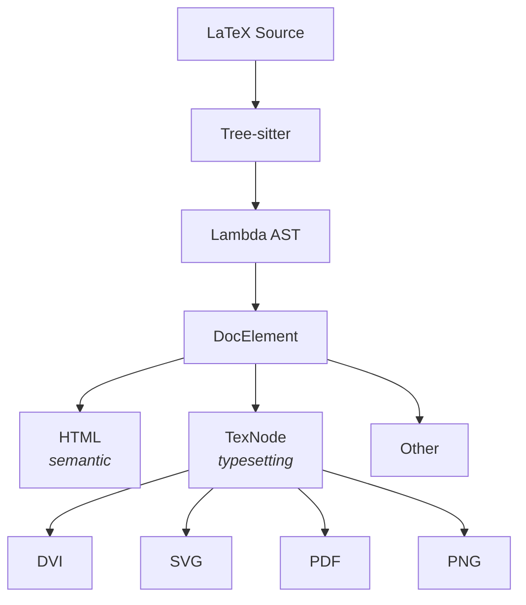

# Lambda LaTeX Pipeline Design

**Version**: 1.0
**Date**: January 2026
**Status**: Active Development

---

## Table of Contents

1. [Introduction](#1-introduction)
2. [Prior Art & Influences](#2-prior-art--influences)
3. [Overall Design & Key Features](#3-overall-design--key-features)
4. [Pipeline Architecture](#4-pipeline-architecture)
5. [Implementation Details](#5-implementation-details)
6. [Testing & Debugging](#6-testing--debugging)
7. [Future Enhancements](#7-future-enhancements)

---

## 1. Introduction

Lambda's LaTeX support provides a modern, cross-platform LaTeX processing pipeline built from scratch in C/C++. Unlike traditional TeX implementations that require a full TeX distribution, Lambda takes a **LaTeX.js-style approach**: emulating LaTeX layout and typesetting semantically while skipping legacy/complicated features.

Lambda targets **~90% of common LaTeX** feature support.
### Design Philosophy

| Principle                   | Description                                                  |
| --------------------------- | ------------------------------------------------------------ |
| **Unified Pipeline**        | Single codebase for all outputs (HTML, DVI, PDF, SVG, PNG)   |
| **Tree-sitter Parsing**     | Robust, incremental parsing with error recovery              |
| **Native Math Typesetting** | No external dependencies (KaTeX, MathJax) for math rendering |
| **Semantic IR**             | Document model captures meaning, not just appearance         |

## 2. Prior Art & Influences

Lambda's LaTeX pipeline draws inspiration from three established projects:

### 2.1 LaTeXML (Perl)

**Source**: [dlmf.nist.gov/LaTeXML](https://dlmf.nist.gov/LaTeXML/)

LaTeXML is the most comprehensive LaTeX-to-XML converter, developed by NIST for the Digital Library of Mathematical Functions.

**Architecture Inspiration**:
- **Digestive tract metaphor**: Mouth → Gullet → Stomach → Document
- Package binding system via JSON/Perl definitions
- Two-pass cross-reference resolution
- Semantic HTML output with ARIA-like classes (`ltx_section`, `ltx_paragraph`)

**What Lambda Adopts**:
- Package system with declarative JSON definitions (`lambda/tex/packages/*.pkg.json`)
- Sectioning with semantic `<section>` wrappers

### 2.2 LaTeX.js (JavaScript)

**Source**: [github.com/latexjs/latex.js](https://github.com/latexjs/latex.js)

LaTeX.js is a browser-based LaTeX renderer that emulates TeX layout without implementing the full macro processor.

**Architecture Inspiration**:
- **PEG.js grammar**: Static grammar-based parsing (analogous to Tree-sitter)
- **Direct HTML output**: Renders to HTML with CSS for layout
- **Typography**: Proper Unicode ligatures (fi, fl, ff, ffi, ffl), dashes (–, —)

**What Lambda Adopts**:
- Tree-sitter LaTeX grammar structure (designed to "match LaTeX.js structure")
- Typography transformations (ligatures, smart quotes)
- Compact HTML output with short class names

### 2.3 MathLive (TypeScript)

**Source**: [github.com/arnog/mathlive](https://github.com/arnog/mathlive)

MathLive is a TypeScript math editor with high-quality math typesetting.

**Architecture Inspiration**:
- **Three-phase pipeline**: LaTeX → Atom (AST) → Box (layout) → HTML
- **Atom types**: Semantic representation (`GenfracAtom`, `SurdAtom`, `SubsupAtom`)
- **Named branches**: `body`, `above`, `below`, `superscript`, `subscript`

**What Lambda Adopts**:
- MathAST intermediate representation (`tex_math_ast.hpp`)
- Two-phase math processing: Parse → AST, then AST → TexNode
- HTML math output via CSS positioning (following MathLive's `toMarkup()` pattern)

### 2.4 Comparison Summary

| Feature | LaTeXML | LaTeX.js | MathLive | Lambda |
|---------|---------|----------|----------|--------|
| **Parsing** | Custom tokenizer | PEG.js | Custom tokenizer | Tree-sitter |
| **Macro expansion** | Full TeX compat | Limited | None (math only) | Declarative (`\newcommand`) |
| **Math IR** | Token stream | None | Atom tree | MathASTNode tree |
| **Math output** | MathML | KaTeX/MathJax | HTML+CSS | HTML+CSS / SVG / DVI |
| **Document output** | XML → HTML/EPUB | HTML | N/A | HTML / DVI / PDF / SVG / PNG |
| **Package support** | 200+ packages | ~50 packages | N/A | 70+ package definitions |
| **Implementation** | Perl | JavaScript | TypeScript | C/C++ |

## 3. Overall Design & Key Features

### 3.1 Unified Pipeline Architecture

Lambda uses a **single pipeline** for all LaTeX processing:



### 3.2 Key Features

| Feature                       | Status     | Description                                         |
| ----------------------------- | ---------- | --------------------------------------------------- |
| **Tree-sitter Parsing**       | ✅ Yes      | Robust incremental parsing with error recovery      |
| **Separate Math Grammar**     | ✅ Yes      | Dedicated grammar for math mode                     |
| **Dual Font System**          | ✅ Yes      | TFM (TeX) + FreeType (screen)                       |
| **Knuth-Plass Line Breaking** | ✅ Yes      | Optimal paragraph breaking algorithm                |
| **Page Breaking**             | ✅ Yes      | Optimal page breaking                               |
| **DVI Output**                | ✅ Yes      | Standard TeX DVI format                             |
| **SVG Output**                | ✅ Yes      | Vector graphics for web                             |
| **PDF Output**                | ✅ Yes      | Direct PDF generation                               |
| **PNG Output**                | ✅ Yes      | Raster image output                                 |
| **HTML Output**               | ✅ Yes      | Semantic HTML5                                      |
| **Math Typesetting**          | ✅ Yes      | Fractions, radicals, scripts, delimiters, operators |
| **Package System**            | ✅ Yes      | JSON-based package definitions                      |
| **Cross-References**          | 🟡 Partial | Labels and refs work; figure numbering in progress  |
| **Table Layout**              | 🟡 Basic   | Basic tabular; complex layouts pending              |
| **Graphics**                  | 🟡 Basic   | picture environment; TikZ pending                   |

### 3.3 Document Element Model

The `DocElement` type serves as the semantic intermediate representation:

```cpp
enum class DocElemType : uint8_t {
    // Block-level elements
    PARAGRAPH,          // Text paragraph
    HEADING,            // Section/chapter heading
    LIST,               // itemize/enumerate/description
    LIST_ITEM,          // Single list item
    TABLE,              // tabular environment
    FIGURE,             // figure environment
    BLOCKQUOTE,         // quote/quotation
    CODE_BLOCK,         // verbatim

    // Math elements
    MATH_INLINE,        // $...$
    MATH_DISPLAY,       // $$...$$ or \[...\]
    MATH_EQUATION,      // equation environment
    MATH_ALIGN,         // align/gather

    // Inline elements
    TEXT_SPAN,          // Styled text
    TEXT_RUN,           // Plain text
    LINK,               // \href, \url
    IMAGE,              // \includegraphics
    FOOTNOTE,           // \footnote
    CITATION,           // \cite
    CROSS_REF,          // \ref, \pageref

    // Structure
    DOCUMENT,           // Root
    SECTION,            // Logical section
    TITLE_BLOCK,        // \maketitle content
};
```

### 3.4 Math AST Design

Math content uses a separate AST layer enabling font-independent parsing:

```cpp
enum class MathNodeType : uint8_t {
    ROW,            // Horizontal sequence
    SYMBOL,         // Single character/symbol
    NUMBER,         // Numeric literal
    OPERATOR,       // Binary/relational operator
    FRAC,           // \frac{num}{denom}
    SQRT,           // \sqrt[index]{radicand}
    SCRIPTS,        // Sub/superscripts
    DELIMITED,      // \left...\right
    ACCENT,         // \hat, \bar, etc.
    OVERUNDER,      // \sum with limits
    ARRAY,          // Matrix/cases
    TEXT,           // \text{...}
    SPACE,          // Spacing commands
    ERROR,          // Parse error recovery
};
```

---

## 4. Pipeline Architecture

### 4.1 Complete Pipeline Diagram

```mermaid
flowchart TD
    subgraph Stage1["Stage 1: PARSING"]
        A[LaTeX Source .tex] --> B["Tree-sitter LaTeX Parser<br><i>grammar.js, input-latex-ts.cpp</i><br>• External scanner for verbatim, \\char, ^^XX<br>• Produces CST"]
        B --> C["Lambda AST Builder<br><i>CST → Lambda Mark/Element tree</i>"]
    end

    subgraph Stage2["Stage 2: DOCUMENT MODEL"]
        C --> D["tex_document_model.cpp<br>TexDocumentModel + DocElement tree<br>• Macro expansion<br>• Counter tracking<br>• Cross-reference collection<br>• Package loading<br>• Math AST construction"]
    end

    D --> E["Stage 3a: HTML OUTPUT<br>doc_model_to_html()<br>• Semantic HTML5<br>• Inline SVG for math<br>• CSS class names"]
    D --> F["Stage 3b: TYPESETTING<br>doc_model_to_texnode()<br>• TFM font metrics<br>• Knuth-Plass algorithm<br>• Optimal page breaking"]

    E --> G[.html]
    F --> H[DVI<br>tex_dvi_out.cpp]
    F --> I[SVG<br>tex_svg_out.cpp]
    F --> J[PDF<br>tex_pdf_out.cpp]
    F --> K[PNG<br>tex_png_out.cpp]

    H --> L[.dvi]
    I --> M[.svg]
    J --> N[.pdf]
    K --> O[.png]
```



### 4.2 Stage Details

#### Stage 1: Parsing

| Component | File | Description |
|-----------|------|-------------|
| LaTeX Grammar | `tree-sitter-latex/grammar.js` | Tree-sitter grammar for LaTeX |
| Math Grammar | `tree-sitter-latex-math/grammar.js` | Separate grammar for math mode |
| External Scanner | `tree-sitter-latex/src/scanner.c` | Handles verbatim, `\char`, `^^XX` |
| Input Bridge | `input/input-latex-ts.cpp` | CST → Lambda Mark tree |

**Grammar Design Principles** (from `grammar.js`):
1. Match LaTeX.js structure for compatibility
2. Use generic command/macro handling (semantic interpretation at runtime)
3. Keep specialized rules only where parsing behavior differs
4. Use external scanner for verbatim content

#### Stage 2: Document Model

| Component | File | Description |
|-----------|------|-------------|
| Main Builder | `tex_document_model.cpp` | DocElement construction |
| Header | `tex_document_model.hpp` | DocElement types and structures |
| Command Handlers | `tex_doc_model_commands.cpp` | `\section`, `\textbf`, etc. |
| Structural Builders | `tex_doc_model_struct.cpp` | Lists, tables, figures |
| Inline Content | `tex_doc_model_inline.cpp` | Inline formatting |
| Text Processing | `tex_doc_model_text.cpp` | Text content handling |
| Command Registry | `tex_command_registry.cpp` | Extensible command lookup |
| Package Loader | `tex_package_loader.cpp` | JSON package loading |

**Macro Expansion** (unified in Tree-sitter pipeline):
```cpp
// Registration
void add_macro(const char* name, int num_args,
               const char* replacement, const char* params);

// Expansion
bool try_expand_macro(const char* name, const ElementReader& elem);
```

#### Stage 3a: HTML Output

| Component | File | Description |
|-----------|------|-------------|
| HTML Generator | `tex_doc_model_html.cpp` | DocElement → HTML |
| Math HTML | `tex_html_render.cpp` | TexNode → HTML (CSS positioning) |
| SVG Math | `tex_svg_out.cpp` | Inline SVG for math |

**HTML Mapping Decisions** (from Latex_Html_Mapping.md):

| LaTeX | Lambda HTML |
|-------|-------------|
| `\textbf{bold}` | `<strong>bold</strong>` |
| `\textit{italic}` | `<em>italic</em>` |
| `\texttt{mono}` | `<code>mono</code>` |
| `\section{Title}` | `<section class="section"><h2>...` |
| `\begin{itemize}` | `<ul class="itemize">` |
| `\begin{quote}` | `<blockquote class="quote">` |

#### Stage 3b: Typesetting (TexNode)

| Component | File | Description |
|-----------|------|-------------|
| Node Types | `tex_node.hpp` | TexNode class hierarchy |
| Math AST | `tex_math_ast.hpp` | MathASTNode types |
| Math AST Builder | `tex_math_ast_builder.cpp` | Parse → MathAST |
| Math Typesetter | `tex_math_ast_typeset.cpp` | MathAST → TexNode |
| Math Bridge | `tex_math_bridge.cpp` | Legacy math handling |
| Horizontal Lists | `tex_hlist.cpp` | HList construction |
| Vertical Lists | `tex_vlist.cpp` | VList construction |
| Line Breaking | `tex_linebreak.cpp` | Knuth-Plass algorithm |
| Page Breaking | `tex_pagebreak.cpp` | Optimal page breaking |
| Font Metrics | `tex_tfm.cpp` | TFM font loading |
| Font Adapter | `tex_font_adapter.cpp` | TFM + FreeType abstraction |

**TexNode Types**:
```cpp
enum class NodeClass : uint8_t {
    // Character nodes
    Char, Ligature,
    // List nodes
    HList, VList,
    // Math nodes
    Fraction, Radical, Scripts, Delimited, Operator,
    // Spacing
    Glue, Kern, Rule, Penalty,
    // Special
    Whatsit, Mark,
};
```

#### Stage 4: Output Writers

| Format | File | Description |
|--------|------|-------------|
| DVI | `tex_dvi_out.cpp` | TeX DVI format |
| SVG | `tex_svg_out.cpp` | Scalable Vector Graphics |
| PDF | `tex_pdf_out.cpp` | Direct PDF generation |
| PNG | `tex_png_out.cpp` | Raster images |

### 4.3 Font System

Lambda supports dual font providers:

| Provider | Use Case | Implementation |
|----------|----------|----------------|
| **TFMFontProvider** | DVI output, high-fidelity TeX metrics | `tex_tfm.cpp`, `tex_font_adapter.cpp` |
| **FreeTypeFontProvider** | Screen rendering, SVG/PNG output | `tex_font_adapter.cpp` |

**TFM Support**:
- Character metrics (width, height, depth, italic correction)
- Ligature tables (fi, fl, ff, ffi, ffl)
- Kerning information
- Math font parameters (axis height, rule thickness)
- Extensible character recipes (large delimiters)

**Font Provider Interface**:
```cpp
const FontMetrics* get_font(FontFamily family, bool bold, bool italic, float size_pt);
const FontMetrics* get_math_symbol_font(float size_pt);
const FontMetrics* get_math_extension_font(float size_pt);
```

---

## 5. Implementation Details

### 5.1 Key Files Reference

#### Core Pipeline

| File | Lines | Purpose |
|------|-------|---------|
| `tex_document_model.cpp` | ~5,800 | Main document model builder |
| `tex_document_model.hpp` | ~800 | DocElement types and API |
| `tex_doc_model_struct.cpp` | ~630 | Structural builders (lists, tables) |
| `tex_doc_model_commands.cpp` | ~400 | Command handlers |
| `tex_doc_model_html.cpp` | ~1,200 | HTML output generator |
| `tex_latex_bridge.cpp` | ~2,000 | LaTeX AST → TexNode bridge |

#### Math Processing

| File | Lines | Purpose |
|------|-------|---------|
| `tex_math_ts.cpp` | ~2,500 | Math typesetting |
| `tex_math_bridge.cpp` | ~1,600 | Math AST bridge |
| `tex_math_ast.hpp` | ~200 | MathASTNode types |
| `tex_math_ast_builder.cpp` | ~400 | Parse → MathAST |
| `tex_math_ast_typeset.cpp` | ~600 | MathAST → TexNode |

#### Layout Algorithms

| File | Lines | Purpose |
|------|-------|---------|
| `tex_hlist.cpp` | ~400 | Horizontal list building |
| `tex_vlist.cpp` | ~300 | Vertical list building |
| `tex_linebreak.cpp` | ~800 | Knuth-Plass line breaking |
| `tex_pagebreak.cpp` | ~400 | Page breaking algorithm |

#### Output Writers

| File | Lines | Purpose |
|------|-------|---------|
| `tex_dvi_out.cpp` | ~600 | DVI output |
| `tex_svg_out.cpp` | ~800 | SVG output |
| `tex_pdf_out.cpp` | ~500 | PDF output |
| `tex_png_out.cpp` | ~300 | PNG output |
| `tex_html_render.cpp` | ~400 | Math → HTML |

#### Package System

| File | Lines | Purpose |
|------|-------|---------|
| `tex_command_registry.cpp` | ~270 | Command lookup hash table |
| `tex_command_registry.hpp` | ~210 | CommandRegistry API |
| `tex_package_loader.cpp` | ~550 | JSON package loading |
| `tex_package_loader.hpp` | ~150 | PackageLoader API |
| `packages/*.pkg.json` | 70+ files | Package definitions |

### 5.2 Key Functions

#### Document Model Construction

```cpp
// Main entry point - parse LaTeX and build document model
TexDocumentModel* doc_model_from_string(
    const char* latex_src, size_t len,
    Arena* arena, TFMFontManager* fonts);

// Build DocElement from Lambda AST element
DocElement* build_doc_element(
    const ElementReader& elem,
    Arena* arena, TexDocumentModel* doc);

// Macro management
void add_macro(const char* name, int num_args,
               const char* replacement, const char* params);
bool try_expand_macro(const char* name, const ElementReader& elem);
```

#### HTML Output

```cpp
// Render document model to HTML
void doc_model_to_html(TexDocumentModel* doc, StrBuf* out,
                       const HtmlOutputOptions& opts);

// Render single element
void render_element_html(DocElement* elem, StrBuf* out,
                         const HtmlOutputOptions& opts, int depth);
```

#### Typesetting

```cpp
// Convert document model to TexNode tree
TexNode* doc_model_to_texnode(TexDocumentModel* doc,
                               LaTeXContext* ctx);

// Convert single DocElement
TexNode* doc_element_to_texnode(DocElement* elem,
                                 LaTeXContext* ctx);

// Math typesetting (two phases)
MathASTNode* parse_math_to_ast(const ElementReader& elem, Arena* arena);
TexNode* typeset_math_ast(MathASTNode* ast, LaTeXContext* ctx);
```

#### Output

```cpp
// DVI output
void dvi_output(TexNode* root, const char* filename);

// SVG output
void svg_output(TexNode* root, StrBuf* out);
char* svg_render_math_inline(TexNode* math, Arena* arena);

// PDF output
void pdf_output(TexNode* root, const char* filename);

// PNG output
void png_output(TexNode* root, const char* filename, int dpi);
```

### 5.3 Package System

Lambda uses a JSON-based package definition system inspired by LaTeXML:

**Package Definition Format** (`packages/amsmath.pkg.json`):
```json
{
  "name": "amsmath",
  "version": "1.0",
  "description": "AMS mathematical typesetting extensions",
  "dependencies": ["amstext", "amsbsy", "amsopn"],
  "commands": {
    "\\frac": {
      "params": "{}{}",
      "pattern": "FRAC(#1, #2)",
      "type": "CONSTRUCTOR"
    },
    "\\text": {
      "params": "{}",
      "pattern": "TEXT(#1)",
      "type": "CONSTRUCTOR"
    }
  },
  "environments": {
    "align": {
      "type": "math",
      "numbered": true
    }
  }
}
```

**Loading Packages**:
```cpp
// In doc_model_create()
registry = new CommandRegistry(arena);
pkg_loader = new PackageLoader(registry, arena);

// Load base packages
pkg_loader->load_package("tex_base");
pkg_loader->load_package("latex_base");

// On \usepackage{amsmath}
doc->require_package("amsmath");
```

---

## 6. Testing & Debugging

### 6.1 Test Suites

| Test Suite | File | Description |
|------------|------|-------------|
| LaTeX Parser | `test_latex_parser_gtest.cpp` | Tree-sitter grammar tests |
| LaTeX Bridge | `test_tex_latex_bridge_gtest.cpp` | AST → TexNode conversion |
| DVI Compare | `test_latex_dvi_compare_gtest.cpp` | Compare with TeX reference DVI |
| HTML Compare | `test_latex_html_compare_gtest.cpp` | Compare with LaTeXML HTML |
| Math Tests | `test_tex_math_gtest.cpp` | Math typesetting |
| Integration | `test_latex_integration_gtest.cpp` | End-to-end tests |
| Graphics | `test_graphics_gtest.cpp` | picture/TikZ support |

### 6.2 Running Tests

```bash
# Build all test executables
make build-test

# Run all tests
make test

# Run baseline tests only (must pass 100%)
make test-lambda-baseline

# Run specific test suite
./test/test_latex_dvi_compare_gtest.exe

# Run specific test case
./test/test_latex_dvi_compare_gtest.exe --gtest_filter=DviCompareTest.SimpleMath
```

### 6.3 DVI Comparison Testing

Lambda compares its DVI output against reference DVI files generated by TeX:

```bash
# Generate reference DVI
pdflatex -output-format=dvi test.tex

# Run comparison
./test/test_latex_dvi_compare_gtest.exe

# Test results show page-by-page metrics comparison
```

**Current Status**: 16/16 baseline tests passing

### 6.4 HTML Comparison Testing

Lambda compares HTML output against LaTeXML reference:

```bash
# Generate reference HTML
latexml --dest=test.xml test.tex
latexmlpost --dest=test.html test.xml

# Run comparison
./test/test_latex_html_compare_gtest.exe
```

### 6.5 Debugging

**Logging** (use structured logging to `./log.txt`):
```cpp
log_debug("Processing element: type=%s", doc_elem_type_name(elem->type));
log_info("Loaded package: %s", package_name);
log_error("Parse failed at line %d: %s", line, msg);
```

**CLI Debugging**:
```bash
# Dump parsed LaTeX AST
./lambda.exe convert test.tex -f latex -t mark /tmp/test.mk

# View document model
./lambda.exe convert test.tex -f latex -t json /tmp/test.json

# Generate HTML for inspection
./lambda.exe convert test.tex -f latex -t html /tmp/test.html

# View rendered output
./lambda.exe view test.tex
```

**Debugger**:
```bash
lldb -o "run" -o "bt" -o "quit" ./lambda.exe -- render test.tex
```

---

## 7. Future Enhancements

### 7.1 Planned Features

| Feature | Priority | Status | Description |
|---------|----------|--------|-------------|
| TikZ Graphics | High | In Progress | Full TikZ/PGF support via SVG |
| Bibliography | High | Planned | BibTeX/BibLaTeX support |
| Table Layout | High | Partial | Complex table layouts |
| Float Placement | Medium | Planned | figure/table float algorithm |
| Hyperlinks | Medium | Partial | PDF hyperlinks |
| Index Generation | Low | Planned | \index, \makeindex |
### 7.4 Package Coverage Goals

**Target**: Support top 50 CTAN packages

| Category | Packages |
|----------|----------|
| Math | amsmath, amssymb, mathtools, amsthm |
| Graphics | graphicx, tikz, pgf, xcolor |
| Tables | booktabs, tabularx, longtable, multirow |
| Code | listings, minted, verbatim |
| Bibliography | natbib, biblatex |
| Layout | geometry, fancyhdr, hyperref |
| Fonts | fontenc, inputenc, unicode-math |

## References

### Internal Documentation

| Document | Location | Description |
|----------|----------|-------------|
| Pipeline Design | [Latex_Pipeline_Design.md](../vibe/Latex_Pipeline_Design.md) | Unified pipeline architecture |
| Typeset Design 1-4 | [vibe/Latex_Typeset_Design*.md](../vibe/) | Evolution of design decisions |
| Graphics Proposal | [Latex_Typeset_Design5_Graphics.md](../vibe/Latex_Typeset_Design5_Graphics.md) | Graphics support plan |
| HTML Mapping | [Latex_Html_Mapping.md](../vibe/Latex_Html_Mapping.md) | LaTeX → HTML decisions |
| Math Design | [Latex_Math_Design*.md](../vibe/) | Math typesetting architecture |
| Pipeline Analysis | [Tex_Pipeline_Analysis.md](./Tex_Pipeline_Analysis.md) | Lambda vs LaTeXML comparison |

### External References

| Project | URL | Description |
|---------|-----|-------------|
| LaTeXML | [dlmf.nist.gov/LaTeXML](https://dlmf.nist.gov/LaTeXML/) | Reference for package system |
| LaTeX.js | [github.com/latexjs/latex.js](https://github.com/latexjs/latex.js) | Reference for approach |
| MathLive | [github.com/arnog/mathlive](https://github.com/arnog/mathlive) | Reference for math rendering |
| Tree-sitter | [tree-sitter.github.io](https://tree-sitter.github.io/) | Parser generator |

---

*This document consolidates design decisions from multiple sources. For historical context, see the versioned design documents in `vibe/Latex_Typeset_Design*.md`.*
