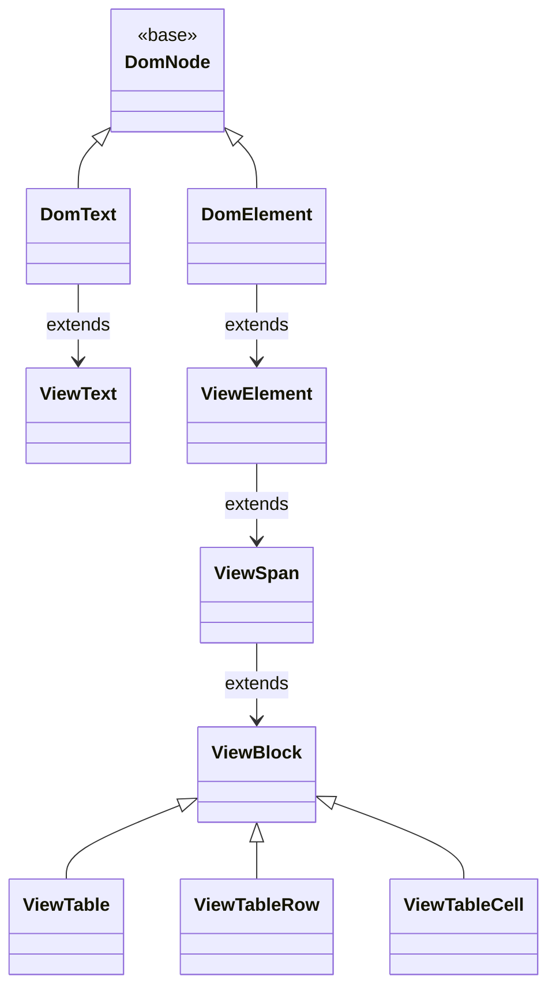
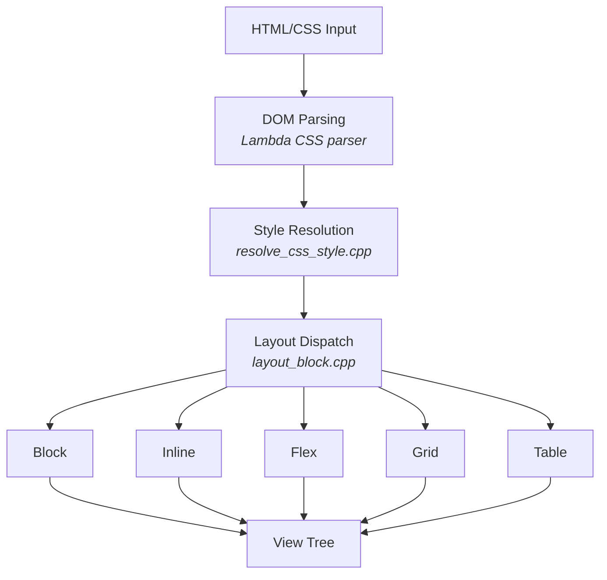
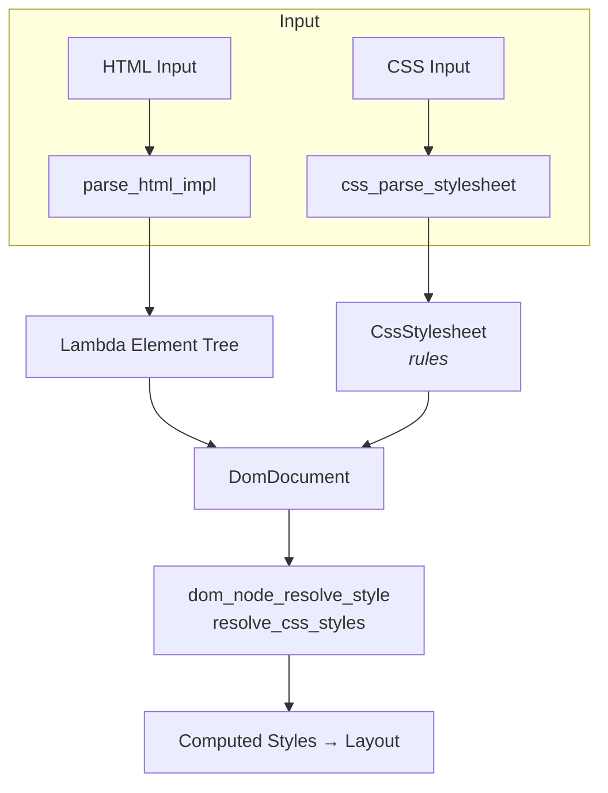

# Radiant Layout Engine - Master Design Document

## Overview

Radiant is Lambda's HTML/CSS rendering engine implementing browser-compatible layout algorithms. It supports Block, Inline, Flex, Grid, and Table layout modes with a unified DOM/View tree architecture.

---

## 1. Core Architecture

### 1.1 Unified DOM/View Tree

Radiant uses a **single inheritance tree** where DOM nodes are their own View representations:



**Benefits:**
- Single tree traversal for DOM and layout operations
- No parallel tree synchronization
- Parent/sibling pointers serve both DOM and View purposes

### 1.2 Coordinate System

All view positions are **relative to the parent's border box**:

```cpp
float x, y;       // Position relative to parent border box
float width, height;  // Border box dimensions
float content_width, content_height;  // Content area (inside padding)
```

**Key Property:** Moving a parent automatically moves all descendants visually.

**Absolute Coordinates:** Computed by walking parent chain when needed:
```cpp
float abs_x = view->x, abs_y = view->y;
for (ViewGroup* p = view->parent_view(); p; p = p->parent_view()) {
    abs_x += p->x;
    abs_y += p->y;
}
```

### 1.3 Pixel Ratio Support

CSS pixel values are converted to physical pixels during style resolution:
- `UiContext::pixel_ratio` stores the display scaling factor (1.0, 1.5, 2.0, etc.)
- All dimensional fields store physical pixel values
- High-DPI displays render correctly without additional scaling

---

## 2. Data Structures

### 2.1 Layout Context (`LayoutContext`)

Central coordinator passed through all layout functions:

```cpp
struct LayoutContext {
    DomDocument* doc;        // Document being laid out
    ViewGroup* view;         // Current view being processed
    DomElement* elmt;        // Current DOM element

    BlockContext block;      // Block formatting context state
    Linebox line;            // Inline formatting context state
    FontBox font;            // Current font state

    FlexContainerLayout* flex_container;  // Active flex container
    GridContainerLayout* grid_container;  // Active grid container

    AvailableSpace available;  // Available space constraints
    bool is_measuring;         // True during measurement pass
};
```

### 2.2 BlockContext (Block Formatting Context)

Tracks vertical layout state:

```cpp
struct BlockContext {
    float content_width;     // Available content width
    float content_height;    // Current content height
    float advance_y;         // Current vertical position
    float max_width;         // Maximum width encountered
    float line_height;       // Current line height
    CssEnum text_align;      // Text alignment
    float given_width;       // CSS specified width (-1 if auto)
    float given_height;      // CSS specified height (-1 if auto)
};
```

### 2.3 Linebox (Inline Formatting Context)

Tracks horizontal layout state:

```cpp
struct Linebox {
    float left, right;       // Line boundaries
    float advance_x;         // Current horizontal position
    float ascender;          // Maximum ascender in line
    float descender;         // Maximum descender in line
    CssEnum vertical_align;  // Vertical alignment mode
};
```

### 2.4 Property Structures

| Structure | Purpose |
|-----------|---------|
| `BlockProp` | Block-level CSS (text-align, line-height, box-sizing, given dimensions) |
| `BoundaryProp` | Box model (margin, padding, border, background) |
| `InlineProp` | Inline CSS (color, vertical-align, opacity) |
| `FontProp` | Font metrics (family, size, weight, ascender, descender) |
| `PositionProp` | CSS positioning (position, top/right/bottom/left, z-index) |
| `FlexProp` | Flex container CSS (direction, wrap, justify, align-items) |
| `FlexItemProp` | Flex item CSS (grow, shrink, basis, align-self) |
| `GridProp` | Grid container CSS (template-rows/columns, gaps, alignment) |
| `GridItemProp` | Grid item CSS (row/column start/end, grid-area) |
| `TableProp` | Table CSS (border-collapse, border-spacing, layout mode) |

---

## 3. Layout Pipeline

### 3.1 High-Level Flow



### 3.2 Layout Mode Dispatch

From `layout_block()` in `layout_block.cpp`:

```cpp
switch (display.inner) {
    case CSS_VALUE_FLOW:
    case CSS_VALUE_FLOW_ROOT:
        layout_block_content(lycon, block);  // Block/inline flow
        break;
    case CSS_VALUE_FLEX:
        layout_flex_content(lycon, block);   // Flexbox
        break;
    case CSS_VALUE_GRID:
        layout_grid_content(lycon, block);   // CSS Grid
        break;
    case CSS_VALUE_TABLE:
        layout_table_content(lycon, elmt, display);  // Table
        break;
}
```

---

## 4. Layout Modes

### 4.1 Block Layout

**Entry:** `layout_block_content()` in `layout_block.cpp`

**Algorithm:**
1. Initialize BlockContext with container width
2. For each child:
   - If block-level: stack vertically, advance `advance_y`
   - If inline-level: delegate to inline layout
3. Handle margin collapsing
4. Finalize block dimensions

**Key Functions:**
- `finalize_block_flow()` - Compute final block size
- `setup_line_height()` - Establish line height context

### 4.2 Inline Layout

**Entry:** `layout_inline()` in `layout_inline.cpp`

**Algorithm:**
1. Initialize Linebox with available width
2. Process text and inline elements
3. Break lines when `advance_x` exceeds right boundary
4. Apply vertical alignment within each line
5. Track ascender/descender for line height

**Key Functions:**
- `layout_text()` - Text node layout with word wrapping
- `line_break()` - Force line break
- `line_align()` - Apply text-align to completed line

### 4.3 Flex Layout

**Entry:** `layout_flex_content()` in `layout_flex_multipass.cpp`

**Multi-Pass Algorithm:**

```
Pass 1: Measurement + View Initialization
    - Collect flex items
    - Measure intrinsic content sizes
    - Cache measurements

Pass 2: 9-Phase Flex Algorithm
    Phase 1: Collect flex items
    Phase 2: Sort by order
    Phase 2.5: Apply min/max constraints
    Phase 3: Create flex lines (wrap handling)
    Phase 4: Resolve flexible lengths (grow/shrink)
    Phase 5: Calculate cross sizes
    Phase 6: Main axis alignment (justify-content)
    Phase 7: Cross axis alignment (align-items/self)
    Phase 8: Align content (multi-line)
    Phase 9: Wrap-reverse handling

    Sub-pass 2a: Layout nested content
    Sub-pass 2b: Baseline repositioning
```

**Data Structures:**
- `FlexContainerLayout` - Container state and item array
- `FlexLineInfo` - Per-line items, sizes, free space

### 4.4 Grid Layout

**Entry:** `layout_grid_content()` in `layout_grid_multipass.cpp`

**Multi-Pass Algorithm:**

```
Pass 1: Grid Definition
    - Parse grid-template-rows/columns
    - Resolve explicit track sizes
    - Expand repeat() functions

Pass 2: Item Placement
    - Place explicitly positioned items
    - Auto-place remaining items
    - Resolve grid areas

Pass 3: Track Sizing
    - Size tracks to fit content
    - Distribute fr units
    - Apply min/max constraints

Pass 4: Item Layout
    - Position items in cells
    - Apply alignment (justify/align-items)
    - Layout nested content
```

**Data Structures:**
- `GridContainerLayout` - Container state, track lists
- `GridTrackList` - Track definitions (length, fr, minmax, auto)
- `GridItemProp` - Item placement (row/column start/end)

### 4.5 Table Layout

**Entry:** `layout_table_content()` in `layout_table.cpp`

**Algorithm:**
1. Build table structure (rows, columns, cells)
2. Calculate column widths (auto or fixed layout)
3. Handle colspan/rowspan spanning
4. Position cells and apply border-spacing
5. Handle border-collapse mode

**View Types:**
- `ViewTable` - Table container
- `ViewTableRowGroup` - thead/tbody/tfoot
- `ViewTableRow` - tr element
- `ViewTableCell` - td/th elements

**Anonymous Box Handling:**
They are handled using flags is_annoy_* under TableProp and TableCellProp.

### 4.6 Pseudo Elements

**Entry:** `alloc_pseudo_content_prop()` in `layout_block.cpp`

`::before` and `::after` pseudo-elements are created during layout:
- Check `dom_element_has_before_content()` / `dom_element_has_after_content()`
- Create synthetic `DomElement` with `display: inline`
- Create `DomText` child with resolved `content` value
- Insert as first/last child of defining element
- Reuse existing pseudo-elements on reflow

### 4.7 HTML Entity Handling

HTML entities are processed during parsing (`input-html.cpp`):

| Entity Type | Handling | Example |
|-------------|----------|---------|
| ASCII escapes | Decoded inline | `&lt;` → `<`, `&amp;` → `&` |
| Numeric refs | Decoded to UTF-8 | `&#169;` → `©` |
| Named entities | Stored as Lambda Symbol | `&copy;` → Symbol("copy") |

**Symbol Resolution:** At render time, `DomNode::text_data()` calls `resolve_symbol()` to convert symbol names to UTF-8 characters (©, €, ™, etc.).

---

## 5. CSS Property Resolution

### 5.1 Style Cascade

**Entry:** `resolve_css_styles()` in `resolve_css_style.cpp`

**Process:**
1. Inherit values from parent
2. Apply element default styles
3. Process CSS declarations by specificity
4. Resolve length values to pixels

### 5.2 Length Resolution

**Function:** `resolve_length_value()`

Converts CSS values to pixels:
- Absolute units: px, pt, cm, mm, in
- Relative units: em, rem, ex, ch
- Viewport units: vw, vh, vmin, vmax
- Percentages: resolved against containing block

### 5.3 Display Value

Two-component display model:
```cpp
struct DisplayValue {
    CssEnum outer;  // block, inline, inline-block
    CssEnum inner;  // flow, flex, grid, table
};
```

### 5.4 Line Height and Font Rect Height

**Normal Line Height Calculation:**

When `line-height: normal`, Radiant follows Chrome's algorithm (ref: Blink `simple_font_data.cc`):

1. **Platform Metrics First:** Query CoreText (macOS) or platform API for ascent, descent, line gap
2. **Classic Font Hack (macOS only):** For Times, Helvetica, Courier—add 15% to ascent:
   ```cpp
   ascent += floor((ascent + descent) * 0.15 + 0.5)
   ```
3. **Round Components:** Round ascent, descent, and line gap individually
4. **Sum:** `line_height = round(ascent) + round(descent) + round(line_gap)`
5. **Fallback:** If no platform metrics, use FreeType HHEA metrics

**Entry:** `calc_normal_line_height()` in `layout.cpp`

**Font Rect Height (TextRect):**

The height of text rects (as returned by `Range.getClientRects()`) uses font metrics, not CSS line-height. Per CSS2 spec §10.6.1, the content area height "should be based on the font, but this specification does not specify how."

Radiant's empirically-matched behavior:

| Font Type | Height Source |
|-----------|---------------|
| Classic Mac fonts (Times, Helvetica, Courier) | CoreText ascent+descent (with 15% hack) |
| All other fonts | FreeType `metrics.height` (ascender + descender + line gap) |

**Entry:** `get_font_cell_height()` in `layout_text.cpp`

**Half-Leading Model (CSS2 §10.8.1):**

When line-height differs from font height, CSS distributes the difference equally above and below the text:

```
L = line-height - (A + D)           // Leading (can be negative)
A' = A + L/2                        // Effective ascent above baseline
D' = D + L/2                        // Effective descent below baseline
```

In Radiant:
```cpp
float half_leading = (line_height - font_height) / 2;
text_rect_y = advance_y + half_leading;
```

When `line_height < font_height`, half-leading is negative and text extends above the line box (per CSS spec: "L may be negative").

---

## 6. Memory Management

### 6.1 Pool Allocation

All layout structures allocated from memory pool:

```cpp
BlockProp* alloc_block_prop(LayoutContext* lycon);
BoundaryProp* alloc_boundary_prop(LayoutContext* lycon);
FlexProp* alloc_flex_prop(LayoutContext* lycon);
GridProp* alloc_grid_prop(LayoutContext* lycon);
```

**Benefits:**
- Fast allocation (bump pointer)
- Bulk deallocation on document close
- No individual free() calls needed

### 6.2 View Pool

`view_pool_init()` / `view_pool_destroy()` manage view tree memory.

---

## 7. HTML/CSS Parser

### 7.1 HTML Parsing

**Entry:** `parse_html_impl()` in `lambda/input/input-html.cpp`

**Key Components:**
- `HtmlParser` - Parsing context wrapping MarkBuilder and state
- `HtmlState` - HTML5-compliant tokenization state machine
- `ListBuilder` - Accumulates element children
- Results stored in `Input->root` as Lambda data structures

**Entity Handling:**

| Entity Type    | Example            | Resolution                |
| -------------- | ------------------ | ------------------------- |
| ASCII escapes  | `&lt;` `&amp;`     | Decoded inline to `<` `&` |
| Numeric refs   | `&#169;` `&#x1F;`  | Decoded to UTF-8          |
| Named entities | `&copy;` `&mdash;` | Stored as Lambda Symbol   |

### 7.2 CSS Parsing

**Entry:** `css_parse_stylesheet()` in `lambda/input/css/css_engine.cpp`

**Key Files:**

| File | Purpose |
|------|---------|
| `css_engine.cpp` | Main stylesheet parsing and cascade engine |
| `css_parser.cpp` | Selector and declaration parsing |
| `css_value.cpp` | CSS value types and unit handling |
| `css_value_parser.cpp` | Property-specific value parsing |
| `selector_matcher.cpp` | Selector-to-element matching |
| `css_style_node.cpp` | Per-property cascade resolution |

**Processing Flow:**
1. **Tokenization:** `CssTokenizer` breaks CSS into tokens
2. **Rule Parsing:** `CssParser` parses selectors and declarations
3. **Storage:** Rules added to `CssStylesheet` with specificity metadata
4. **Cascade:** Specificity `(inline, ids, classes, elements)` determines winning rules

### 7.3 Integration Pipeline



**Stylesheet Collection:**
- **External:** `<link>` elements → `load_external_stylesheets()`
- **Embedded:** `<style>` tags → `parse_style_element()`
- **Inline:** `style=""` attribute → `parse_inline_style()`

**Style Application:** `resolve_css_styles()` in `resolve_css_style.cpp`:
1. Apply user-agent defaults
2. Match selectors using `CssSelectorMatcher`
3. Apply rules respecting cascade order
4. Resolve computed values (lengths, colors, calc())
5. Store in DomElement property structures

---

## 8. File Organization

| File | Purpose |
|------|---------|
| `layout.hpp` | Core structures (LayoutContext, BlockContext, Linebox) |
| `view.hpp` | View hierarchy, property structures, type enums |
| `layout.cpp` | Common layout utilities (line height, style resolution) |
| `layout_block.cpp` | Block layout algorithm, layout dispatch |
| `layout_inline.cpp` | Inline layout and line box management |
| `layout_text.cpp` | Text measurement and word wrapping |
| `layout_flex.cpp` | Core 9-phase flex algorithm |
| `layout_flex_multipass.cpp` | Flex entry point, pass orchestration |
| `layout_flex_measurement.cpp` | Intrinsic size measurement |
| `layout_grid.cpp` | Grid track sizing and item placement |
| `layout_grid_multipass.cpp` | Grid entry point, pass orchestration |
| `layout_table.cpp` | Table layout algorithm |
| `layout_positioned.cpp` | CSS absolute/fixed positioning |
| `resolve_css_style.cpp` | CSS property resolution |
| `intrinsic_sizing.cpp` | Min/max content size calculation |

---

## 9. Testing Infrastructure

### 9.1 Test Architecture

- **HTML Test Files:** `test/layout/data/*`
- **Reference Data:** Browser-rendered JSON from Puppeteer
- **Comparison:** Element-by-element position/size matching
- **Tolerance:** 1-2px for floating-point variations

### 9.2 Commands

```bash
make build                # Build layout engine
make layout suite=baseline      # Run layout regression test
make layout test=file_name      # Run specific layout and compare against browser
./lambda.exe layout file.html   # Debug single file
./lambda.exe render file.html -o output.png  # Render to PNG image
```

### 9.3 Debug Output

View tree JSON output shows:
- Position: `x`, `y` (relative to parent)
- Dimensions: `width`, `height` (border box)
- Box model: margin, padding, border values
- Layout mode: flex/grid properties

---

## 10. Design Principles

1. **Extend, Don't Replace:** New features extend existing infrastructure
2. **CSS Conformance:** Follow W3C specifications
3. **High-DPI Support:** pixel_ratio scaling throughout
4. **Pool Allocation:** Use memory pools, avoid individual mallocs
5. **Structured Logging:** Use `log.h` for debug output
6. **Relative Coordinates:** All positions relative to parent
7. **Unified Tree:** DOM nodes are their own views

---

## 11. Current Status

| Layout Mode | Status         | Notes                                     |
| ----------- | -------------- | ----------------------------------------- |
| Block       | 🔄 In Progress | Full CSS2.1 conformance                   |
| Inline      | 🔄 In Progress | Text wrapping, vertical-align             |
| Flex        | 🔄 In Progress | Full flexbox spec, nested support         |
| Grid        | 🔄 In Progress | Basic grid, track sizing, CSS integration |
| Table       | 🔄 In Progress | Auto/fixed layout, spanning cells         |
| Positioned  | 🔄 In Progress | absolute, relative, fixed                 |

---

## 12. Future Enhancements

### Near-term
- Grid: subgrid, named lines, auto-fill/auto-fit
- Grid: advanced alignment (place-items, place-self)
- Performance: layout caching, incremental updates

### Long-term
- CSS transforms and animations
- Container queries
- Multi-column layout
- Writing modes (vertical text)
- Ligatures, and text shaping (HarfBuzz integration)

---

## References

- [CSS Box Model](https://www.w3.org/TR/css-box-3/)
- [CSS Display Level 3](https://www.w3.org/TR/css-display-3/)
- [CSS Flexbox Level 1](https://www.w3.org/TR/css-flexbox-1/)
- [CSS Grid Level 1](https://www.w3.org/TR/css-grid-1/)
- [CSS Table Level 3](https://www.w3.org/TR/css-tables-3/)
