# LambdaJS Runtime — Design Overview

> **The index and architectural summary for the LambdaJS detailed-design set.** LambdaJS is Lambda's embedded JavaScript engine: it compiles JavaScript to MIR and runs it inside the same `Item`/GC runtime as Lambda scripts, so JS values, the garbage collector, the MIR JIT, the input parsers/formatters, and the Radiant HTML/CSS layout engine are all shared rather than bridged.
> **Audience:** engine developers. **Scope:** everything under `lambda/js/` (engine, language, standard library, RegExp, typed arrays, async/modules, Web/DOM, Node.js compatibility) plus the test infrastructure. **Convention:** the detailed docs cite `file:line` + symbol names; line numbers drift, so confirm against the symbol. This document supersedes the older `doc/dev/JS_Runtime.md` and `doc/dev/JS_Runtime_Detailed.md`, whose content has been absorbed and reorganized into the set below.

---

## 1. What LambdaJS is, and its design goals

LambdaJS reuses Lambda's runtime instead of shipping a separate JS VM. A `.js` source is parsed by Tree-sitter, lowered through a typed AST to MIR IR, and JIT-compiled (or interpreted) by the shared MIR backend; the resulting code calls a large C/C++ runtime that implements JS semantics over Lambda `Item` values. The design optimizes for four goals, each visible throughout the set:

- **Unified runtime** — JS values *are* Lambda `Item` values (no marshalling boundary); see [JS_03 — Value Model & Memory](JS_03_Value_Model.md).
- **Near-native performance** — multi-phase type inference plus native arithmetic / shaped-object / fast-dispatch paths; see [JS_15 — Performance & Optimization](JS_15_Performance.md).
- **DOM integration** — JS manipulates Radiant `DomElement` trees through standard DOM/CSSOM APIs; see [JS_13 — Web Platform](JS_13_Web_DOM.md).
- **Reuse over reimplementation** — JSON, URL, regex (RE2), interning, the GC, and the JIT are shared Lambda subsystems, not JS-specific copies.

---

## 2. Architecture (C4)

### 2.1 System context

The engine lives inside the Lambda software system; developers drive it through the CLI, and the Node.js compatibility layer reaches the host OS/network and the npm registry.

### 2.2 Containers

The CLI dispatches into the LambdaJS engine, which sits on the shared Lambda runtime (Item model, GC, name pool, MIR JIT, I/O) and drives the Radiant layout engine for document/DOM work.

### 2.3 Engine components

Inside the engine, a front-end feeds a multi-phase MIR transpiler; the runtime core implements values/properties/functions/exceptions and dispatches into the standard library, the async/module subsystem, and the host bridges. Each component maps to one or more documents in [§4](#4-the-document-set).

> The C4 diagrams are authored as a Structurizr DSL workspace (`diagram/architecture.dsl`) and rendered to SVG; see [§7](#7-diagrams--regeneration).

---

## 3. Compilation & execution at a glance

Source → Tree-sitter parse → typed `JsAstNode` → early-error validation → a 14-step lowering pipeline producing a MIR module → link as native code (default) or the MIR interpreter (large/cold/document scripts) → execute `js_main` → drain the event loop → result. The full pipeline, phase model, and interpreter-vs-JIT policy are in [JS_01 — Compilation Pipeline & Phase Model](JS_01_Compilation_Pipeline.md).

---

## 4. The document set

The set is organized in five parts. Read JS_01–JS_04 first for the engine; the rest can be read on demand.

### Part I — Engine core

| Doc | Covers |
|---|---|
| [JS_01 — Compilation Pipeline & Phase Model](JS_01_Compilation_Pipeline.md) | Entry points, `JsMirTranspiler`, the 14-step phase model, interpreter-vs-JIT selection, MIR import resolution, CLI/batch dispatch. |
| [JS_02 — Parsing, AST & Front-End Validation](JS_02_Parsing_AST.md) | Tree-sitter integration, the `JsAstNode` model, lexical scope, the six-phase early-error validator, strict-mode detection. |
| [JS_03 — Value Model, Memory & GC Interop](JS_03_Value_Model.md) | The tagged `Item`, JS↔`TypeId` mapping, undefined/null/TDZ/symbol/BigInt encodings, GC heap & nursery, the call-argument stack, module-variable storage, `JsRuntimeState`. |
| [JS_04 — MIR Lowering, Code Generation & Exceptions](JS_04_MIR_Lowering.md) | Boxed-Item-by-default emission with native fast paths, boxing/unboxing, condition `_raw` facades, constant folding, call emission, the exception model, `eval`/`Function`. |

### Part II — Language semantics

| Doc | Covers |
|---|---|
| [JS_05 — Functions, Closures & Scope](JS_05_Functions_Closures.md) | `JsFunction`, native/boxed dual versions, parameter inference, capture analysis, the scope-environment model, `this`/`arguments`/`new.target`, TCO, inlining. |
| [JS_06 — Objects, Properties & Prototypes](JS_06_Objects_Properties_Prototypes.md) | `Map`/`TypeMap`/`ShapeEntry`, the `JSPD_*` flag model, MapKind dispatch, get/set pipelines, `defineProperty`, the prototype chain, built-in method dispatch, symbol keys, shape pre-allocation. |
| [JS_07 — Classes](JS_07_Classes.md) | Class collection, constructor compilation, prototype/static methods, inheritance & `super`, private members, computed keys, subclassable builtins, devirtualization. |
| [JS_08 — Iterators, Generators & Destructuring](JS_08_Iterators_Generators.md) | The iterator protocol & done sentinel, fast-path iterators, for-of compilation with IteratorClose, generator state machines, destructuring & spread/rest. |

### Part III — Runtime services

| Doc | Covers |
|---|---|
| [JS_09 — Async, Promises, Event Loop & Modules](JS_09_Async_Modules.md) | `JsPromise` & the resolution procedure, the microtask/job queue, the libuv event loop, async/await suspension, ES modules, top-level await, dynamic import, CommonJS `require`. |
| [JS_10 — Standard Built-in Library](JS_10_Builtins.md) | The built-in registry, Object/Reflect, Symbol, JSON, Math/Number, Date, collections (Map/Set/Weak*), Proxy, BigInt, global functions, template literals, `globalThis`. |
| [JS_11 — RegExp Engine](JS_11_RegExp.md) | `JsRegexData`, the RE2/wrapper/backtracking back-ends, JS→RE2 transpilation & post-filters, named groups, `/d` and `/v`, Unicode tables, caching, legacy statics. |
| [JS_12 — TypedArrays, Binary Data & Atomics](JS_12_TypedArrays.md) | `JsTypedArray`/`JsArrayBuffer`/`JsDataView`, element access & the native-backed map, resizable buffers & transfer, detach validation, raw bulk paths, Atomics & waiters, Node `Buffer`. |

### Part IV — Host integration

| Doc | Covers |
|---|---|
| [JS_13 — Web Platform: DOM, CSSOM, Events & Fetch](JS_13_Web_DOM.md) | The sentinel DOM bridge over Radiant, element/document dispatch, lazy layout & metric queries, the 3-phase event system, CSSOM, canvas/`measureText`, XHR/fetch/FormData/clipboard, Selection. |
| [JS_14 — Node.js Compatibility Layer](JS_14_Node_Compat.md) | Module dispatch & resolution, the npm client, per-module coverage (fs/path/os/buffer/crypto/stream/http/net/tls/child_process/…), `Buffer`, `EventEmitter`, the event-loop integration status. |

### Part V — Cross-cutting

| Doc | Covers |
|---|---|
| [JS_15 — Performance & Optimization](JS_15_Performance.md) | The optimization catalog (call-arg stack, const folding, native/dual versions, MapKind, shape pre-alloc, TA raw paths, registry reduction), interpreter-vs-JIT trade-offs, benchmark findings, open gaps. |
| [JS_16 — Testing & Conformance Infrastructure](JS_16_Testing.md) | The test262 batch runner, three-layer crash recovery, batch reset, baseline management, the async runner, the Node official-test harness, the GTest unit suites. |

---

## 5. Cross-cutting design themes

A handful of decisions recur across the set and are worth knowing before diving in:

- **`Item` everywhere.** Every JS value is a 64-bit tagged `Item`; objects are Lambda `Map` structs with a `TypeMap` shape. This is what makes interop with Lambda's parsers/formatters and Radiant free. ([JS_03](JS_03_Value_Model.md), [JS_06](JS_06_Objects_Properties_Prototypes.md))
- **MapKind exotic dispatch.** A 4-bit `map_kind` in the object header gives plain objects an O(1) fast path and routes exotic objects (TypedArray, DOM, CSSOM, Proxy, iterator, process.env) to dedicated handlers. ([JS_06](JS_06_Objects_Properties_Prototypes.md))
- **Boxed-by-default, native-on-proof codegen.** MIR carries boxed `Item`s unless type inference proves a value and its consumer are numeric, enabling native arithmetic and shaped-slot access without losing generality. ([JS_04](JS_04_MIR_Lowering.md), [JS_15](JS_15_Performance.md))
- **JIT with an interpreter escape hatch.** Native code is the default; large, cold, or document-embedded scripts link to the MIR interpreter because link-time codegen dominates their cost. ([JS_01](JS_01_Compilation_Pipeline.md), [JS_15](JS_15_Performance.md))
- **Preamble + batch process model.** test262/Node conformance runs compile a shared harness once and then each test against that snapshot inside a persistent, crash-recoverable worker. ([JS_01](JS_01_Compilation_Pipeline.md), [JS_16](JS_16_Testing.md))
- **An in-progress marker→shape-flag migration.** Property metadata is moving from string markers (`__nw_`/`__get_`/`__class_name__`) to `ShapeEntry` flags + `JsAccessorPair` + a `JsClass` byte; both schemes currently coexist. ([JS_06](JS_06_Objects_Properties_Prototypes.md))
- **Generator-based async.** Async functions reuse the generator state-machine transform; the event loop is libuv with a custom microtask queue layered on top. ([JS_08](JS_08_Iterators_Generators.md), [JS_09](JS_09_Async_Modules.md))

---

## 6. Maturity & recurring known-issue themes

Each detailed doc ends with a code-grounded **Known Issues & Future Improvements** section. The recurring themes across the set:

- **Language & core are mature** — ES2020-era language and most built-ins (closures, classes, generators, async/await, modules incl. top-level await, destructuring, Proxy/Reflect, Symbol, BigInt-as-decimal, TypedArrays/Atomics, RegExp via RE2) work and are conformance-tested.
- **Benchmark pass rate is not yet 100%** — on the standard performance suites (AWFY, JetStream, R7RS, Larceny, Octane, beng, kostya) the engine runs-and-passes ≈88% of the JS scripts (63/72); three wrong-result correctness bugs found by the audit (bounce, levenshtein, crypto-md5) were since fixed, leaving one wrong-result bug (box2d), two feature-path errors, an Octane driver that is not shipped, and several heavy macro-benchmarks that time out. ([JS_15 §7](JS_15_Performance.md))
- **Node.js async I/O is the biggest gap** — there is a real libuv event loop, but several `fs` async methods call back synchronously and the stream internals are stubs; crypto lacks asymmetric algorithms. ([JS_14](JS_14_Node_Compat.md))
- **RegExp semantics** — RE2's leftmost-longest model differs from JS leftmost-greedy-with-backtracking; a backtracking engine covers part of the gap. ([JS_11](JS_11_RegExp.md))
- **Approximations** — WeakMap/WeakSet have no true weak semantics, per-scope strict mode is approximated by a global flag in eval, and `globalThis` is a snapshot. ([JS_10](JS_10_Builtins.md), [JS_04](JS_04_MIR_Lowering.md))
- **Fixed-capacity statics** — generators, promises, modules, the transpiler's collected-function arrays, and several stacks are fixed-size; some lack overflow guards. ([JS_01](JS_01_Compilation_Pipeline.md))
- **Structure & performance debt** — several source files are very large (`js_runtime.cpp`, `js_globals.cpp`, the expression lowering file); float boxing in hot loops and the lack of destination-passing lowering are the main open performance items; compiled-artifact caching is blocked by realm pointers baked into MIR. ([JS_15](JS_15_Performance.md))

---

## 7. Diagrams & regeneration

Diagram sources live beside the docs in `doc/dev/js/diagram/` and are compiled to the SVGs embedded above:

- **Mermaid** (`*.mmd`) — flow, sequence, state, and class diagrams.
- **Structurizr DSL** (`architecture.dsl`) — the C4 system-context / container / component views in [§2](#2-architecture-c4).

Regenerate everything with `bash utils/render_md_diagrams.sh doc/dev/js/diagram` (Mermaid → SVG via `npx mmdc`; Structurizr DSL → per-view SVG via `structurizr-cli` export to Mermaid, then `mmdc`). The `.dsl` path needs a JDK (`JAVA_HOME`) and `structurizr-cli` (`STRUCTURIZR_CLI`); the script prints a skip notice if they are absent. `render_md_diagrams.sh doc/dev/js/diagram <name>` re-renders specific diagrams.

---

## 8. Glossary

- **Item** — the 64-bit tagged value used for every JS and Lambda value.
- **Map / TypeMap / ShapeEntry** — a JS object, its shape descriptor, and a per-property record.
- **MapKind** — the 4-bit exotic-object discriminator in the object header.
- **Boxing** — tagging a native scalar into an `Item` (and unboxing the reverse).
- **MIR** — the medium-level IR that the shared JIT/interpreter consumes.
- **Preamble** — a pre-compiled shared harness reused across batch tests.
- **Marker** — a legacy string property (e.g. `__nw_`, `__class_name__`) encoding metadata now carried by shape flags.
- **Shaped slot** — a constructor-pre-allocated, offset-addressed object field.

---

## Appendix — Relationship to the previous docs

This set replaces two earlier documents whose material it absorbs and reorganizes:

- `doc/dev/JS_Runtime.md` (overview) → distributed across this overview, [JS_01](JS_01_Compilation_Pipeline.md), [JS_03](JS_03_Value_Model.md), [JS_04](JS_04_MIR_Lowering.md), and [JS_13](JS_13_Web_DOM.md).
- `doc/dev/JS_Runtime_Detailed.md` (22 sections) → distributed across [JS_06](JS_06_Objects_Properties_Prototypes.md)–[JS_16](JS_16_Testing.md) by subsystem.

Where the old docs and the code disagreed, the new set follows the code (for example, BigInt is `LMD_TYPE_DECIMAL`, not a negative-int encoding; the Node.js event loop is real libuv).
