# LambdaJS — Compilation Pipeline & Phase Model

> **Part of the [LambdaJS detailed-design set](JS_00_Overview.md).** This document covers how a JavaScript source file becomes executing native code (or interpreted MIR): the entry points, the per-compile transpiler state, the multi-phase compile, the interpreter-vs-JIT decision, and MIR symbol resolution.
>
> **Primary sources:** `lambda/js/js_mir_entrypoints_require.cpp`, `lambda/js/js_mir_module_batch_lowering.cpp` (`transpile_js_mir_ast`), `lambda/js/js_mir_context.hpp` / `js_mir_internal.hpp` (`JsMirTranspiler`), `lambda/js/transpile_js_mir.cpp` (globals anchor), `lambda/mir.c` + `lambda/sys_func_registry.c` (import resolution), `lambda/main.cpp` (CLI dispatch).
> **Audience:** engine developers. **Convention:** `file:line` references are accurate as of this writing but drift; treat them as starting points, confirm against the symbol name.

---

## 1. Purpose & scope

LambdaJS reuses Lambda's `Item` value model, GC heap, name pool and MIR JIT, but has its own front end and transpiler. The compilation path is **distinct from the Lambda-script path** (`runner.cpp`): a `.js` source is only reached through the explicit `js` / `js-test-batch` CLI subcommands, or through `require`/`import` and `load_js_module` from inside running code (see [§8](#8-cli-dispatch--batch-mode)). This document is the map of that path; the lowering *mechanics* (boxing, native fast paths, statement/expression emission, exceptions) are in [JS_04 — MIR Lowering & Code Generation](JS_04_MIR_Lowering.md), and the front-end (Tree-sitter, AST, early errors) is in [JS_02 — Parsing, AST & Front-End](JS_02_Parsing_AST.md).

---

## 2. End-to-end pipeline

Source bytes flow through parse → AST → early-error validation → context setup → import resolution → JIT init → transpiler creation → multi-phase lowering → link (JIT or interpreter) → execution of `js_main` → event-loop drain → result. The single core implementation is `transpile_js_to_mir_core_len` (`js_mir_entrypoints_require.cpp:359`); every public entry point is a thin wrapper that sets preamble-mode globals and delegates to it.

The control/data flow, step by step (CLI `lambda js script.js`):

1. `main.cpp:1699` → `transpile_js_to_mir_len` → `transpile_js_to_mir_core_len`.
2. Copy source into an owned buffer; for a real file lacking an explicit `var __filename`, compute the realpath and **inject `var __filename` / `var __dirname`** after the directive prologue (CommonJS ergonomics) (`js_mir_entrypoints_require.cpp:374`).
3. Resolve interpreter env flags once and cache them (`:421`).
4. `js_transpiler_create` → `js_transpiler_parse` (Tree-sitter) → `build_js_ast` → `js_check_early_errors` (`:449`–`:474`), each timed.
5. Set up or **reuse** the `EvalContext` + GC heap + name pool + `Input` (reuse is the batch hot-reload fast path); set the `_lambda_rt` runtime pointer (`:483`–`:519`).
6. Resolve imports: a fast-path skip unless the source contains `import `, else parallel precompile (`jm_precompile_js_imports`) then serial fallback (`jm_load_imports`) (`:521`).
7. `jit_init(g_js_mir_optimize_level)` → `MIR_init` (+ `MIR_gen_init` unless pure-interpreter) (`mir.c:128`).
8. `jm_create_mir_transpiler` allocates the transpiler state and opens a MIR module (`:560`; see [§4](#4-the-transpiler-context-jsmirtranspiler)).
9. **`transpile_js_mir_ast`** runs phases 1→3 and finishes/loads the MIR module (`js_mir_module_batch_lowering.cpp:2055`; see [§5](#5-compilation-phases)).
10. Count `total_insns`; apply the interpreter/JIT policy and any opt-downgrade; validate MIR labels; then **`MIR_link(ctx, interface, import_resolver)`** — the eager-codegen (or interpreter-install) step (`:646`–`:730`).
11. `find_func(ctx, "js_main")` → typed `Item (*)(Context*)` (`:747`).
12. Initialize the event loop, attach the document if any, allocate module-var storage, arm the stack-overflow `sigsetjmp` guard, and **call `js_main`** (`:813`).
13. `js_event_loop_drain` and (document mode) animation-frame drain run **before** `MIR_finish` so JIT'd callbacks remain valid (`:820`).
14. Normalize a float result to int where exact, restore the previous context, tear down (transpiler, then `MIR_finish` / deferred cleanup / preamble-retain depending on mode), and return (`:862`).

---

## 3. Entry points

All are defined in `js_mir_entrypoints_require.cpp` (except the module entry, in `js_mir_module_batch_lowering.cpp`) and return an `Item`. Public declarations live in `js_transpiler.hpp` and `js_mir_internal.hpp` — **not** in `js_runtime.h`.

| Function | Used by | Notes |
|---|---|---|
| `transpile_js_to_mir_core_len(Runtime*, src, len, filename)` `:359` | (internal) | The real pipeline; all wrappers delegate here. |
| `transpile_js_to_mir[_len]` `:960/:964` | CLI `js`; batch normal tests | `g_jm_preamble_mode=false`. |
| `transpile_js_to_mir_preamble[_len]` `:971/:976` | `js-test-batch` harness compile | Snapshots `module_consts` into a `JsPreambleState`; forces `-O3` for the harness. |
| `transpile_js_to_mir_with_preamble[_len]` `:991/:996` | batch per-test execution | Pre-seeds `mt->preamble_entries` so a test inherits harness module vars. |
| `transpile_js_module_to_mir(Runtime*, src, filename)` `module_batch_lowering.cpp:6308` | `require` / `import()` / `load_js_module` / batch module tests | Own `MIR_context`; runs with `is_module=true`; `js_main` returns the **namespace object**; registers it in the module cache and defers MIR cleanup. |
| `transpile_js_ast_to_mir(Runtime*, JsTranspiler*, JsAstNode*, filename)` `:63` | TS transpiler | Transpiles a **pre-built AST** (skips parse/early-error/import phases). |
| `load_js_module(Runtime*, path)` `:1061` | Lambda→JS import | Reads a file, ensures a persistent heap context, delegates to the module entry. |
| `js_require(Item)` `:1143`, `js_dynamic_import(Item)` `:1231` | JIT'd code (runtime) | Both route through `transpile_js_module_to_mir`. See [JS_09](JS_09_Async_Modules.md). |

The preamble mechanism (compile a shared harness once, then compile each test pre-seeded against that snapshot) is the backbone of the test262 batch runner; it is detailed in [JS_16 — Testing & Conformance](JS_16_Testing.md).

---

## 4. The transpiler context (`JsMirTranspiler`)

`JsMirTranspiler` (`js_mir_context.hpp:350`) is the central per-compile state, heap-allocated and zeroed by `jm_create_mir_transpiler` (`js_mir_hashmap_scope_utils.cpp:43`). Key field groups:

- **MIR targets** — `ctx`, `module`, `current_func_item`, `current_func`.
- **Scopes & control flow** — `var_scopes[64]` (fixed-depth lexical scope hashmaps), `loop_stack[32]`, `for_of_iterators[32]`, `try_ctx_stack[16]`. *(All fixed-capacity; see [§9](#9-known-issues--future-improvements).)*
- **Collected program** — `func_entries[JS_MIR_MAX_COLLECTED_FUNCTIONS]` and `class_entries[JS_MIR_MAX_COLLECTED_CLASSES]`, where the caps are **32768** and **4096** respectively (`js_mir_context.hpp:128-129`). These inline arrays dominate the struct size.
- **Type inference** — `widen_to_float`, `force_boxed` hash sets; per-function `current_fc`, `in_native_func`.
- **Module state** — `module_consts` (name → `JsModuleConstEntry`), `module_var_count`, `is_module`, `namespace_reg`, preamble seed fields.
- **Closure read-back** — fixed `last_closure_capture_names[512][128]` parallel arrays (see [JS_05](JS_05_Functions_Closures.md)).
- **Generators** — `gen_state_labels[64]`, `gen_*` registers/offsets (64-state cap; see [JS_08](JS_08_Iterators_Generators.md)).

Supporting records (same header): `JsFuncCollected` (per-function pre-pass record: name, `func_item`, `param_types[16]`, `return_type`, `ctor_prop_*[16]`, ~25 booleans), `JsClassEntry` (`methods[128]`, `instance_fields[32]`, `static_fields[16]`, `static_blocks[8]`), `JsModuleConstEntry`, `JsMirVarEntry`, `JsCaptureEntry`, `JsTryContext`.

The companion `JsTranspiler` (`js_transpiler.hpp:40`) holds the parse/AST context (Tree-sitter tree, name pool, scope); see [JS_02](JS_02_Parsing_AST.md).

---

## 5. Compilation phases

`transpile_js_mir_ast` (`js_mir_module_batch_lowering.cpp:2055`) drives all phases in order; the per-phase workers live across the split `js_mir_*` files. The phase numbers are real labels in the code (not invented for this doc), though their *textual* order in source is slightly non-monotonic (see [§9](#9-known-issues--future-improvements)).

| Phase | Worker | Responsibility |
|---|---|---|
| 1.0 | `jm_collect_functions` (`function_collection_class_inference.cpp:395`) | Post-order (innermost-first) walk; fill `func_entries`/`class_entries`; set `parent_index`; scan ctor `this.prop` fields. |
| 1.0b | (inline `:2070`) | Resolve strict mode per function (own directive / global / class body / parent). |
| 1.1 | (inline `:2111`) | Build `module_consts`; pre-seed from preamble; assign `js_module_vars[]` indices to top-level decls. |
| 1.5 | `jm_analyze_captures` (`:3027`) | Free-variable detection: `free = refs − params − locals − module_consts`. |
| 1.6 | (inline `:3235`) | Transitive capture propagation (fixed-point) for multi-level closures. |
| 1.7 / 1.7.5 / 1.7b / 1.7c | (inline `:3445`–`:3861`) | Compute shared scope-env layouts; module-level scope env (Js57 Track A); parent-env reuse/link. |
| 1.75 | `jm_infer_param_types` (`:3984`) | Evidence-based param + return type inference; native-version eligibility. |
| 1.76 | `jm_callsite_propagate` (`:4036`) | Widen params contradicted by call-site literals (revokes native eligibility). |
| 1.77 | (inline `:4041`) | P6: narrow still-`ANY` params to INT/FLOAT when all call sites agree. |
| 1.78 | (inline `:4119`) | P4b: constructor field-type propagation from `new C(...)` call sites. |
| 1.9 | (inline `:4175`) | `MIR_new_forward` for every function (+ `<name>_n` native forwards) — enables mutual recursion. |
| 2 | `jm_define_function` (`function_class_lowering.cpp:292`) | Emit MIR for every collected function (innermost-first). |
| 3 | (inline `:4199`) | Create `js_main(Context*)`; emit module/script body; emit `MIR_RET` (namespace if module, else completion value); build exception landing pad; finish + load module. |

Detail of capture analysis (1.5–1.7) belongs to [JS_05 — Functions, Closures & Scope](JS_05_Functions_Closures.md); type inference (1.75–1.78) and the native/boxed dual-version scheme are shared with [JS_04](JS_04_MIR_Lowering.md) and [JS_05](JS_05_Functions_Closures.md).

---

## 6. Interpreter vs JIT selection

LambdaJS can link a module either to native code (`MIR_set_gen_interface`) or to the MIR interpreter (`MIR_set_interp_interface`). The decision is made inline in `transpile_js_to_mir_core_len`, not in a dedicated function. Thresholds are defined in `js_mir_internal.hpp:22` (and duplicated in `transpile_js_mir.cpp:59`).

- **Base mode** — `--mir-interp` CLI or `JS_MIR_INTERP=1` sets `g_mir_interp_mode` (pure interpreter).
- **Large-source-at-O0 pre-check** — if O0 and `source_len ≥ LAMBDA_JS_LARGE_INTERP_BYTES` (default **15000**), temporarily flips interpreter on around `jit_init`.
- **Post-MIR instruction policy** — interpret if `total_insns > JM_LARGE_MODULE_INSN_THRESHOLD` (**100000**), or if a document is attached and (`g_js_force_document_interp` or `total_insns > JM_RADIANT_INTERP_INSN_THRESHOLD`, **20000**). `document_context = (runtime->dom_doc != NULL)`.
- **Opt-downgrade fallback** — if still JIT and opt ≥ 2 and insns > 100k, `MIR_gen_set_optimize_level(ctx, 0)`.
- **Lazy** — `JS_LAZY_MIR≠0` selects `MIR_set_lazy_gen_interface` (see issues — non-viable at opt ≥ 2).

**"Link-interface interp" vs "pure interp":** size/document-driven interpretation leaves `g_mir_interp_mode = 0`, so `jit_init` still calls `MIR_gen_init` and only the `MIR_link` *interface* differs. Pure interpreter (`g_mir_interp_mode≠0`) skips `MIR_gen_init` entirely. The rationale (link cost dominates for large/cold modules; the interpreter sidesteps codegen) is covered with measurements in [JS_15 — Performance](JS_15_Performance.md). The interpreter has **no tail-call optimization**, a deliberate correctness divergence from the JIT.

---

## 7. MIR import resolution

JIT'd JS code calls C runtime functions (`js_add`, `js_property_get`, …) by name; these are resolved at link time.

- **Emit side** — `jm_ensure_import` (`js_mir_calls_boxing_types.cpp:97`) lazily creates a `MIR_new_proto_arr` + `MIR_new_import` per (name, return type, arg count, arg types) signature, caching both in `mt->import_cache`. The dedup key format is `name#r<ret>#n<nres>#a<nargs>#<argtype>…`; the proto name is `name_p_r<ret>_n<nres>_a<nargs>`. Helper wrappers (`jm_call_N`, `jm_call_void_N`) build the call insn.
- **Resolve side** — `import_resolver(name)` (`mir.c:106`), passed to `MIR_link`, checks a thread-local cross-module map first, then the static `func_map` (both O(1) hashmaps). `func_map` is built once by `init_func_map` (`mir.c:50`) from two registry arrays in `sys_func_registry.c`: `sys_func_defs[]` (Lambda system functions) and **`jit_runtime_imports[]`** — the latter holds ~650 `js_`-prefixed runtime entries (e.g. `{"js_property_get", FPTR(js_property_get)}`).

Adding a new runtime function therefore means: implement it, register it in `jit_runtime_imports[]`, and emit a call via `jm_ensure_import`/`jm_call_N`. Tune8 reduced the JS section of the registry from 547 to 452 entries (see [JS_15](JS_15_Performance.md)).

---

## 8. CLI dispatch & batch mode

`main.cpp` routes by `argv[1]`:

- **`js`** (`:1533`) — init runtime + stack guard; parse `--document <html>`, `--mir-interp`, `--diagnose`, `--opt-level=N`; read the file; optionally build a `DomDocument` and set `runtime.dom_doc`; set `process.argv`; call `transpile_js_to_mir_len` (`:1699`).
- **`js-test-batch`** (`:3361`) — persistent-process batch driver. With hot-reload (default) it keeps one `EvalContext`/heap across tests (the reuse fast path in step 5). It reads a line protocol on stdin: `harness:<len>` → `transpile_js_to_mir_preamble_len`; `source:<name>[:<path>]:<len>` / `module-source:<…>` → per-test compile via the with-preamble / module / plain entry, wrapped in per-test `sigsetjmp` crash recovery and an `alarm()` timeout. Full protocol and crash-recovery layering: [JS_16](JS_16_Testing.md).

A **bare `.js` path as `argv[1]` does not** enter the JS pipeline — the default extension dispatch handles `.ls`/document formats. JS is reachable only via the `js`/`js-test-batch` subcommands or from within running code (`require`/`import`/`load_js_module`).

---

## 9. Known Issues & Future Improvements

Grounded in the current code; these are candidates for cleanup, not necessarily bugs.

1. **Transpiler struct is very large and silently capped.** `JsMirTranspiler` is on the order of **45–55 MB** (dominated by `func_entries[32768]` and `class_entries[4096]`, each `JsClassEntry` ≈ 6–7 KB), allocated and zeroed **per compile** in `jm_create_mir_transpiler`. A stale comment at `js_mir_entrypoints_require.cpp:571` still says "~3 MB due to `func_entries[256]`" — doubly wrong. Modules exceeding 32768 functions or 4096 classes are **silently truncated** (overflow logged once, `function_collection_class_inference.cpp:442`). *Improvement:* grow these dynamically, or right-size + grow-on-demand; fix the comment.
2. **Vestigial dead-codegen fields.** `JsTranspiler::code_buf` / `func_buf` (`js_transpiler.hpp:46`) are allocated and freed but never read/written by the MIR pipeline (leftover from the retired C-codegen path); `normalized_source` is only ever set to NULL. *Improvement:* delete.
3. **Duplicated threshold/extern blocks.** The `JM_*_THRESHOLD` macros and many `extern` declarations are duplicated verbatim between `transpile_js_mir.cpp:59` and `js_mir_internal.hpp:22`, risking drift. `JM_LARGE_FUNC_INSN_THRESHOLD` (10000) is defined but unused in the selection logic (its "adaptive per-function opt" comment is aspirational/dead).
4. **One enormous function.** `transpile_js_mir_ast` is ~3800 lines (`module_batch_lowering.cpp:2055-5891`) with all 14 phases inline; `transpile_js_to_mir_core_len` is ~590 lines with two textually-duplicated `#ifndef NDEBUG` MIR-dump blocks. *Improvement:* extract phase drivers; factor the dump helper.
5. **Implicit, comment-only phase-ordering invariants.** Comments (`module_batch_lowering.cpp:3636`, `:3783`) warn that phase 1.7.5 must precede 1.7b and parents must be processed before children, but nothing enforces it. The textual phase labels are also out of execution order (the 1.9 comment precedes 1.76–1.78 code).
6. **Duplicated link/run boilerplate** across `transpile_js_to_mir_core_len`, `transpile_js_module_to_mir`, `jm_compile_js_module`, `transpile_js_ast_to_mir`, and the eval path — but only the core path applies the interpreter/opt policy, so module/eval/parallel paths can diverge in link behavior. *Improvement:* a single `link_and_find_main(ctx, …)` helper.
7. **Hard-coded fixed capacities** with inconsistent overflow handling: scope depth 64, loop depth 32, try depth 16, generator yield-states 64, closure-capture arrays 512, params 16. Several (e.g. `loop_stack[32]`, `try_ctx_stack[16]`) have **no overflow guard**.
8. **Compiled-artifact caching is blocked** by ~59 sites that bake raw realm heap pointers into MIR as integer constants (`js_mir_expression_lowering.cpp` and the ctor/shape inline caches); cross-realm reuse would dereference stale pointers. See [JS_15](JS_15_Performance.md).

---

## Appendix A — Source map

| File | Responsibility (this doc) |
|---|---|
| `lambda/js/js_mir_entrypoints_require.cpp` | All public entry points; the core pipeline; interp/JIT selection; require/import. |
| `lambda/js/js_mir_module_batch_lowering.cpp` | `transpile_js_mir_ast` (phase driver); module entry; preamble; batch. |
| `lambda/js/js_mir_context.hpp`, `js_mir_internal.hpp` | `JsMirTranspiler` + context structs; thresholds; extern decls. |
| `lambda/js/transpile_js_mir.cpp` | Globals/extern anchor after the J41 mechanical split. |
| `lambda/js/js_mir_hashmap_scope_utils.cpp` | `jm_create_mir_transpiler` (allocation). |
| `lambda/js/js_mir_calls_boxing_types.cpp` | `jm_ensure_import` + call-emit helpers. |
| `lambda/mir.c` | `jit_init`, `import_resolver`, `init_func_map`, `MIR_link`. |
| `lambda/sys_func_registry.c` | `sys_func_defs[]`, `jit_runtime_imports[]`. |
| `lambda/main.cpp` | `js` / `js-test-batch` CLI dispatch. |

## Appendix B — Related documents

- [JS_02 — Parsing, AST & Front-End Validation](JS_02_Parsing_AST.md) — the parse/AST/early-error stages.
- [JS_04 — MIR Lowering, Code Generation & Exceptions](JS_04_MIR_Lowering.md) — phase-2/3 emission internals.
- [JS_05 — Functions, Closures & Scope](JS_05_Functions_Closures.md) — capture analysis (phases 1.5–1.7).
- [JS_09 — Async, Promises, Event Loop & Modules](JS_09_Async_Modules.md) — `require`/`import`, module entry.
- [JS_15 — Performance & Optimization](JS_15_Performance.md) — interp/JIT trade-offs, link cost, caching blockers.
- [JS_16 — Testing & Conformance Infrastructure](JS_16_Testing.md) — preamble + batch runner.
