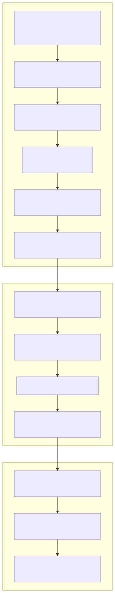
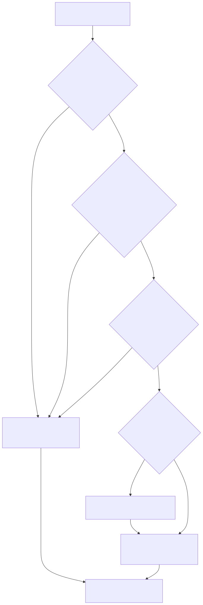

# LambdaJS — Compilation Pipeline & Phase Model

> **Last verified against tree:** 2026-08-28

> **Part of the [LambdaJS detailed-design set](JS_00_Overview.md).** This document covers the default MIR lane from JavaScript source to native code or interpreted MIR, plus its boundary with the explicit AST backend: entry points, per-compile state, multi-phase lowering, MIR-interpreter-vs-JIT policy, and symbol resolution.
>
> **Primary sources:** `lambda/js/js_transpiler.hpp` (`build_js_ast_indexed`), `lambda/runtime/ast-core.hpp` / `ast-core.cpp` (`AstIndex`), `lambda/runtime/compiler_pass.cpp`, `lambda/js/js_mir_entrypoints_require.cpp`, `lambda/js/js_mir_module_batch_lowering.cpp` (`transpile_js_mir_ast`), `lambda/js/js_mir_context.hpp` / `js_mir_internal.hpp` (`JsMirTranspiler`), `lambda/js/transpile_js_mir.cpp` (globals anchor), `lambda/mir.c` + `lambda/sys_func_registry.c` (import resolution), and `lambda/main.cpp` (CLI dispatch).
> **Audience:** engine developers. **Convention:** `file:line` references are accurate as of this writing but drift; treat them as starting points, confirm against the symbol name.

---

## 1. Purpose & scope

LambdaJS reuses Lambda's `Item` value model, GC heap, name pool, module registry, event-loop host, shared AST substrate, compiler-fact scaffolding, `MirEmitter`, and MIR JIT under **D1.2–D1.3** and **D8.1.3v9**. It retains its own JavaScript front end and semantic lowering. Under **D8.2.2** and **D8.2.4**, P1b reserves shared `AST_NODE_ASSIGN` for its single `AstAssignNode {op, left, right}` contract and moves Lambda declarations to `AST_NODE_VARIABLE_DECLARATOR`; P1c extends that physical assignment record to Lambda's procedural assignment tags, with the common visitor owning every assignment's `left/right` children; P1d publishes `AST_NODE_LOOP`/`AstLoopControlNode {form, init, test, update, body}` for while/do-while/JS C-style for, while iterator clauses use `AST_NODE_FOR_CLAUSE`. A `.js` source reaches this lane through the explicit `js` / `js-test-batch` CLI subcommands, through `require`/`import` and `load_js_module`, or through the explicit AST backend. This document maps the MIR compilation lane; the lowering *mechanics* are in [JS_04 — MIR Lowering & Code Generation](JS_04_MIR_Lowering.md), and the front end is in [JS_02 — Parsing, AST & Front-End](JS_02_Parsing_AST.md).

---

## 2. End-to-end pipeline

Source bytes flow through parse → AST/build-time binding → shared AST index → early-error validation → context setup → import resolution → JIT init → MIR-transpiler creation → multi-phase lowering → link → execution of `js_main` → event-loop drain → result. The ordinary MIR implementation is `transpile_js_to_mir_core_profile_len`; wrappers delegate through `transpile_js_to_mir_core_len`. Module, eval/new-Function, and pre-built-AST paths still own parallel orchestration, which is active consolidation residue under **D8.2.5**.

`JS_EXECUTION_BACKEND=ast` is the explicit fail-closed AST lane under **D8.1.3v9**. It shares the same indexed AST, early errors, `Runtime`/`EvalContext`, heap, module registry, and event-loop host, then enters `js_interp.cpp` rather than MIR lowering. The default remains MIR.

The control/data flow, step by step (CLI `lambda js script.js`):

1. `main.cpp:1699` → `transpile_js_to_mir_len` → `transpile_js_to_mir_core_len`.
2. Copy source into an owned buffer; for a real file lacking an explicit `var __filename`, compute the realpath and **inject `var __filename` / `var __dirname`** after the directive prologue (CommonJS ergonomics) (`js_mir_entrypoints_require.cpp:374`).
3. Resolve interpreter env flags once and cache them (`:421`).
4. `js_transpiler_create` → `js_transpiler_parse` (Tree-sitter) → `build_js_ast_indexed` → `js_check_early_errors`, each timed. `build_js_ast_indexed` currently seeds `BOUND|VALIDATED` before the separate early-error call; that fact-order mismatch is residue, not the target **D8.2.5** schedule.
5. Set up or **reuse** the `EvalContext` + GC heap + name pool + `Input` (reuse is the batch hot-reload fast path); set the `_lambda_rt` runtime pointer (`:483`–`:519`).
6. Resolve imports: a fast-path skip unless the source contains `import `, else parallel precompile (`jm_precompile_js_imports`) then serial fallback (`jm_load_imports`) (`:521`).
7. `jit_init(g_js_mir_optimize_level)` → `MIR_init` (+ `MIR_gen_init` unless pure-interpreter) (`mir.c:128`).
8. `jm_create_mir_transpiler` allocates the dynamic control stacks and per-compile state and opens a MIR module (see [§4](#4-the-transpiler-context-jsmirtranspiler)).
9. **`transpile_js_mir_ast`** count-walks functions/classes, allocates exact metadata, fill-walks them, runs the remaining numbered analysis/lowering phases, and finishes/loads the MIR module (see [§5](#5-compilation-phases)).
10. Count `total_insns`; apply the interpreter/JIT policy and any opt-downgrade; validate MIR labels; then call **`MIR_link(ctx, interface, import_resolver)`** for eager codegen or MIR-interpreter installation.
11. `find_func(ctx, "js_main")` → typed `Item (*)(Context*)` (`:747`).
12. Initialize the event loop, attach the document if any, allocate module-var storage, arm the stack-overflow `sigsetjmp` guard, and **call `js_main`** (`:813`).
13. `js_event_loop_drain` and (document mode) animation-frame drain run **before** `MIR_finish` so JIT'd callbacks remain valid (`:820`).
14. Normalize a float result to int where exact, restore the previous context, tear down (transpiler, then `MIR_finish` / deferred cleanup / preamble-retain depending on mode), and return (`:862`).

---

## 3. Entry points

All are defined in `js_mir_entrypoints_require.cpp` (except the module entry, in `js_mir_module_batch_lowering.cpp`) and return an `Item`. Public declarations live in `js_transpiler.hpp` and `js_mir_internal.hpp` — **not** in `js_runtime.h`.

| Function | Used by | Notes |
|---|---|---|
| `transpile_js_to_mir_core_profile_len` `js_mir_entrypoints_require.cpp:671` | (internal) | Ordinary source pipeline with JS/TypeScript profile policy. |
| `transpile_js_to_mir_core_len` `js_mir_entrypoints_require.cpp:1276` | wrappers | Pure-JS profile wrapper around the core profile pipeline. |
| `transpile_js_to_mir[_len]` `js_mir_entrypoints_require.cpp:1293/1298` | CLI `js`; batch normal tests | Clears preamble mode and delegates. |
| `transpile_js_to_mir_preamble[_len]` `js_mir_entrypoints_require.cpp:1316/1322` | `js-test-batch` harness compile | Snapshots `module_consts` into a `JsPreambleState`; forces `-O3` for the harness. |
| `transpile_js_to_mir_with_preamble[_len]` `js_mir_entrypoints_require.cpp:1445/1451` | batch per-test execution | Pre-seeds `mt->preamble_entries` so a test inherits harness module vars. |
| `transpile_js_module_to_mir` `js_mir_module_batch_lowering.cpp:5459` | `require` / `import()` / `load_js_module` / batch module tests | Own `MIR_context`; runs with `is_module=true`; `js_main` returns the namespace object; publishes through the shared module registry and defers MIR cleanup. |
| `transpile_js_ast_to_mir` `js_mir_entrypoints_require.cpp:403` | TS transpiler | Transpiles a pre-built AST and skips source parsing/import discovery. |
| `load_js_module` `js_mir_entrypoints_require.cpp:1657` | Lambda→JS import | Reads a file, ensures a persistent heap context, and delegates to the module entry. |
| `js_require` / `js_dynamic_import` `js_mir_entrypoints_require.cpp:2098/2223` | generated/runtime calls | Both route module loading through the shared registry and module compiler. See [JS_09](JS_09_Async_Modules.md). |

The preamble mechanism (compile a shared harness once, then compile each test pre-seeded against that snapshot) is the backbone of the test262 batch runner; it is detailed in [JS_16 — Testing & Conformance](JS_16_Testing.md).

---

## 4. The transpiler context (`JsMirTranspiler`)

`JsMirTranspiler` (`js_mir_context.hpp`, exact symbol) is the central per-compile state, allocated by `jm_create_mir_transpiler` in `js_mir_hashmap_scope_utils.cpp`. Key field groups:

- **MIR targets** — `ctx`, `module`, `current_func_item`, `current_func`.
- **Scopes & control flow** — `var_scopes`, `loop_stack`, `for_of_iterators`, and `try_ctx_stack` are dynamic `ArrayList` stacks. Their initial capacities are policy inputs to `jm_create_mir_transpiler`, not depth limits.
- **Collected program** — `func_entries` and `class_entries` are pool-owned exact-sized arrays. `transpile_js_mir_ast` runs `jm_collect_functions` once in count-only mode, allocates from those counts, runs it again to fill, and fails closed on a count/fill mismatch. Source function entries then publish through the shared `AstIndex` `AstFunctionId` table; synthesized class-field initializers retain a bounded linear fallback until their IDs are promoted.
- **Type inference** — `widen_to_float`, `force_boxed` hash sets; per-function `current_fc`, `in_native_func`.
- **Module state** — `module_consts` (name → `JsModuleConstEntry`), `module_var_count`, `is_module`, `namespace_reg`, preamble seed fields.
- **Closure read-back** — parallel `last_closure_capture_*[512]` arrays remain fixed-capacity (see [JS_05](JS_05_Functions_Closures.md)).
- **Generators** — `gen_state_labels[64]`, `gen_*` registers/offsets (64-state cap; see [JS_08](JS_08_Iterators_Generators.md)).

Supporting records in the same header include `JsFuncCollected`, whose captures and `FnAnalysis::param_types` are dynamically sized but whose constructor-shape evidence retains 16 slots, and `JsClassEntry`, whose methods/fields/static blocks are exact-sized per class. `JsModuleConstEntry`, `JsMirVarEntry`, `JsCaptureEntry`, and `JsTryContext` carry the remaining pass-local metadata.

The companion `JsTranspiler` (`js_transpiler.hpp:40`) holds the parse/AST context (Tree-sitter tree, name pool, scope); see [JS_02](JS_02_Parsing_AST.md).

---

## 5. Compilation phases

`transpile_js_mir_ast` drives the phases; workers live across the split `js_mir_*` files. The phase numbers are comments in the current driver, not yet typed `CompilerPassManager` ownership under **D8.2.5**.

| Phase | Worker | Responsibility |
|---|---|---|
| 1.0 count | `jm_collect_functions` | Post-order count-only walk for functions, classes, synthetic field initializers, and exact class-member capacities. |
| 1.0 allocate/fill | `transpile_js_mir_ast` + `jm_collect_functions` | Allocate exact `func_entries`/`class_entries`; repeat the walk to fill records, parent links, and class members; reject count/fill mismatch; build the separate function-pointer index. |
| 1.0b | (inline `:2070`) | Resolve strict mode per function (own directive / global / class body / parent). |
| 1.1 | (inline `:2111`) | Build `module_consts`; pre-seed from preamble; assign `js_module_vars[]` indices to top-level decls. |
| 1.5 | `jm_analyze_captures` (`:3027`) | Free-variable detection: `free = refs − params − locals − module_consts`. |
| 1.6 | (inline `:3235`) | Transitive capture propagation (fixed-point) for multi-level closures. |
| 1.7 / 1.7.5 / 1.7b / 1.7c | (inline `:3445`–`:3861`) | Compute shared scope-env layouts; module-level scope env (Js57 Track A); parent-env reuse/link. |
| 1.75 | `jm_infer_param_types` (`:3984`) | Evidence-based param + return type inference; native-version eligibility. |
| 1.76 | `jm_callsite_propagate` (`:4036`) | Widen params contradicted by call-site literals (revokes native eligibility). |
| 1.77 | (inline `:4041`) | P6: narrow still-`ANY` params to INT/FLOAT when all call sites agree. |
| 1.78 | (inline `:4119`) | P4b: constructor field-type propagation from `new C(...)` call sites. |
| 1.9 | (inline `:4175`) | `MIR_new_forward` for every function (+ `<name>_n` native forwards) — enables mutual recursion. |
| 2 | `jm_define_function` (`function_class_lowering.cpp:292`) | Emit MIR for every collected function (innermost-first). |
| 3 | (inline `:4199`) | Create `js_main(Context*)`; emit module/script body; emit `MIR_RET` (namespace if module, else completion value); build exception landing pad; finish + load module. |

Detail of capture analysis (1.5–1.7) belongs to [JS_05 — Functions, Closures & Scope](JS_05_Functions_Closures.md); type inference (1.75–1.78) and the native/boxed dual-version scheme are shared with [JS_04](JS_04_MIR_Lowering.md) and [JS_05](JS_05_Functions_Closures.md).

---

## 6. MIR interpreter vs JIT selection

LambdaJS can link a module either to native code (`MIR_set_gen_interface`) or to the MIR interpreter (`MIR_set_interp_interface`). The decision is made inline in `transpile_js_to_mir_core_len`, not in a dedicated function. Thresholds are defined in `js_mir_internal.hpp:22` (and duplicated in `transpile_js_mir.cpp:59`).

- **Base mode** — `--mir-interp` CLI or `JS_MIR_INTERP=1` sets `g_mir_interp_mode` (pure interpreter).
- **Large-source-at-O0 pre-check** — if O0 and `source_len ≥ LAMBDA_JS_LARGE_INTERP_BYTES` (default **15000**), temporarily flips interpreter on around `jit_init`.
- **Post-MIR instruction policy** — interpret if `total_insns > JM_LARGE_MODULE_INSN_THRESHOLD` (**100000**), or if a document is attached and (`g_js_force_document_interp` or `total_insns > JM_RADIANT_INTERP_INSN_THRESHOLD`, **20000**). `document_context = (runtime->dom_doc != NULL)`.
- **Opt-downgrade fallback** — if still JIT and opt ≥ 2 and insns > 100k, `MIR_gen_set_optimize_level(ctx, 0)`.
- **Lazy** — `JS_LAZY_MIR≠0` selects `MIR_set_lazy_gen_interface`; its optimization-level caveats and measurements are recorded in [JS_15](JS_15_Performance.md).

**"Link-interface interp" vs "pure interp":** size/document-driven interpretation leaves `g_mir_interp_mode = 0`, so `jit_init` still calls `MIR_gen_init` and only the `MIR_link` *interface* differs. Pure interpreter (`g_mir_interp_mode≠0`) skips `MIR_gen_init` entirely. The rationale (link cost dominates for large/cold modules; the interpreter sidesteps codegen) is covered with measurements in [JS_15 — Performance](JS_15_Performance.md). The interpreter has **no tail-call optimization**, a deliberate correctness divergence from the JIT.

---

## 7. MIR import resolution

JIT'd JS code calls C runtime functions (`js_add`, `js_property_get`, …) by name; these are resolved at link time.

- **Emit side** — `jm_ensure_import` (`js_mir_calls_boxing_types.cpp:97`) lazily creates a `MIR_new_proto_arr` + `MIR_new_import` per (name, return type, arg count, arg types) signature, caching both in `mt->import_cache`. The dedup key format is `name#r<ret>#n<nres>#a<nargs>#<argtype>…`; the proto name is `name_p_r<ret>_n<nres>_a<nargs>`. Helper wrappers (`jm_call_N`, `jm_call_void_N`) build the call insn.
- **Resolve side** — `import_resolver(name)` (`mir.c:106`), passed to `MIR_link`, checks a thread-local cross-module map first, then the static `func_map` (both O(1) hashmaps). `func_map` is built once by `init_func_map` (`mir.c:50`) from two registry arrays in `sys_func_registry.c`: `sys_func_defs[]` (Lambda system functions) and **`jit_runtime_imports[]`** — the latter holds ~650 `js_`-prefixed runtime entries (e.g. `{"js_property_get", FPTR(js_property_get)}`).

Adding a new runtime function therefore means: implement it, register it in `jit_runtime_imports[]`, and emit a call via `jm_ensure_import`/`jm_call_N`. Tune8 reduced the JS section of the registry from 547 to 452 entries (see [JS_15](JS_15_Performance.md)).

---

## 8. CLI dispatch & batch mode

`main.cpp` routes by `argv[1]`:

- **`js`** (`main.cpp:2280`) — initializes the runtime and stack guard; parses document/interpreter/diagnostic/optimization options; reads the file; optionally attaches a `DomDocument`; sets `process.argv`; and calls `transpile_js_to_mir_len` (ordinary execution call at `main.cpp:1943`).
- **`js-test-batch`** (`main.cpp:4186`) — persistent-process batch driver. With hot reload it keeps one `EvalContext`/heap across tests. It reads the harness/source/module line protocol and dispatches through the preamble, module, or plain entry under per-test recovery and timeout containment. Full protocol and recovery layering: [JS_16](JS_16_Testing.md).

A **bare `.js` path as `argv[1]` does not** enter the JS pipeline — the default extension dispatch handles `.ls`/document formats. JS is reachable only via the `js`/`js-test-batch` subcommands or from within running code (`require`/`import`/`load_js_module`).

---

## 9. Current consolidation boundary

The fixed function/class arrays and fixed scope/loop/try stacks described by the 2026-07-15 version of this document are retired. The current implementation boundary is:

- `AstIndex` supplies dense node/function identity and parent/owner links. P2a removed the duplicate JS pointer index: source function lookups now use `AstFunctionId`/`func_by_id`, while count/fill collection, duplicate `JsFuncCollected::analysis`, and synthesized-function fallback remain open residue. **D8.2.4** requires one stable ID authority.
- `CompilerPassManager` and fact bits exist, but they wrap isolated operations rather than the full build→bind→validate→index→analysis→lower→link schedule. `build_js_ast_indexed` currently claims `VALIDATED` before `js_check_early_errors`. **D8.2.5** requires truthful produced facts and one schedule.
- `MirValue`, demands, provenance, representation conversion, and emitter-owned rooting exist, but `jm_transpile_expression` and the Lambda `transpile_expr` boundary still return `MIR_reg_t`. **D2.4.1–D2.4.3** and **D8.2.6** require the full contract at every core expression boundary.
- Dynamic `ArrayList` control stacks and exact function/class/member allocation remove the old silent limits. Remaining explicit semantic/optimization capacities include 64 generator resume labels, 512 closure read-back/TDZ entries, and 16 constructor-shape evidence slots; callers fail closed, fall back, or clamp according to the owning feature.
- Ordinary source, pre-built AST, module, eval/new-Function, and batch/preamble paths still duplicate parts of build/validate/link/cleanup orchestration. Their JavaScript policy differs, but **D8.2.5** requires one lifecycle driver with mode policy as data.

Per **D8.4.1v2**, LambdaJS has no property inline cache. `property_name_cache` only reuses MIR registers for immutable module-name-table loads within one generated function; it does not cache receiver/property lookup. `TypeMap` constructor/transition shapes remain ordinary lookup metadata.

The active consolidation sequence and deletion gates are in [`vibe/Lambda_Design_JS_Unified.md`](../../../vibe/Lambda_Design_JS_Unified.md). The historical partial attempt is retained as [`vibe/impl/Lambda_Impl_Tune_Ast (retired).md`](<../../../vibe/impl/Lambda_Impl_Tune_Ast (retired).md>).

---

## Appendix A — Source map

| File | Responsibility (this doc) |
|---|---|
| `lambda/js/js_mir_entrypoints_require.cpp` | All public entry points; the core pipeline; interp/JIT selection; require/import. |
| `lambda/js/js_mir_module_batch_lowering.cpp` | `transpile_js_mir_ast` (phase driver); module entry; preamble; batch. |
| `lambda/js/js_mir_context.hpp`, `js_mir_internal.hpp` | `JsMirTranspiler` + context structs; thresholds; extern decls. |
| `lambda/js/transpile_js_mir.cpp` | Globals/extern anchor after the J41 mechanical split. |
| `lambda/js/js_mir_hashmap_scope_utils.cpp` | `jm_create_mir_transpiler` (allocation). |
| `lambda/js/js_mir_calls_boxing_types.cpp` | `jm_ensure_import` + call-emit helpers. |
| `lambda/mir.c` | `jit_init`, `import_resolver`, `init_func_map`, `MIR_link`. |
| `lambda/sys_func_registry.c` | `sys_func_defs[]`, `jit_runtime_imports[]`. |
| `lambda/main.cpp` | `js` / `js-test-batch` CLI dispatch. |

## Appendix B — Related documents

- [JS_02 — Parsing, AST & Front-End Validation](JS_02_Parsing_AST.md) — the parse/AST/early-error stages.
- [JS_04 — MIR Lowering, Code Generation & Exceptions](JS_04_MIR_Lowering.md) — phase-2/3 emission internals.
- [JS_05 — Functions, Closures & Scope](JS_05_Functions_Closures.md) — capture analysis (phases 1.5–1.7).
- [JS_09 — Async, Promises, Event Loop & Modules](JS_09_Async_Modules.md) — `require`/`import`, module entry.
- [JS_15 — Performance & Optimization](JS_15_Performance.md) — interp/JIT trade-offs, link cost, caching blockers.
- [JS_16 — Testing & Conformance Infrastructure](JS_16_Testing.md) — preamble + batch runner.
