# LambdaJS — Parsing, AST & Front-End Validation

> **Part of the [LambdaJS detailed-design set](JS_00_Overview.md).** This document covers the front end of the engine: how JS source becomes a Tree-sitter CST, how `build_js_ast.cpp` lowers that CST into a typed `JsAstNode` tree, how lexical scope is resolved during construction, how the early-error validator enforces the spec's parse-time `SyntaxError`/`ReferenceError` rules, and how strict mode is detected. The MIR lowering that consumes the AST is in [JS_04 — MIR Lowering](JS_04_MIR_Lowering.md); where this front end sits in the overall flow is in [JS_01 — Compilation Pipeline](JS_01_Compilation_Pipeline.md).
>
> **Primary sources:** `lambda/js/js_ast.hpp` (`JsAstNode` hierarchy, `JsAstNodeType`, `JsOperator`), `lambda/js/build_js_ast.cpp` (CST→AST builder), `lambda/js/js_scope.cpp` (parser lifecycle, source normalization, scope management), `lambda/js/js_early_errors.cpp` (static semantic validation), `lambda/js/js_print.cpp` (debug AST dumper), `lambda/js/js_transpiler.hpp` (`JsTranspiler`, `JsScope`, `JsVarKind`, `JsScopeType`). The grammar is `lambda/tree-sitter-javascript/` with auto-generated `parser.c`.
> **Audience:** engine developers. **Convention:** `file:line` references drift; confirm against the named symbols.

---

## 1. Purpose & scope

The front end turns a source buffer into a validated, typed AST in three stages: parse (`js_transpiler_parse`), build (`build_js_ast`), validate (`js_check_early_errors`). All three are driven from the MIR entrypoints — `js_mir_eval_lowering.cpp:120`/`:128`/`:136`, `js_mir_entrypoints_require.cpp:449`/`:462`/`:474`, and the module batch path `js_mir_module_batch_lowering.cpp:6073`/`:6080`/`:6355` call them in sequence and abort if any reports failure. The output is a tree of `JsAstNode`-rooted structs that the lowering layer walks; this document describes the tree's shape, how it is built, and the validation gate in front of codegen. It does **not** cover Tree-sitter internals (`parser.c` is generated and opaque here) nor the lowering of individual node types into MIR.

A recurring theme is that **the JS and TypeScript front ends share one Tree-sitter parser and one builder.** `tp->strict_js` (true by default) gates whether TS-only node types are accepted; the same `JsAstNode` enum range is deliberately kept wide enough (`JS_AST_NODE_TS_EXTENSION_SENTINEL = 1100`, `js_ast.hpp:157`) so the TS parser's extension-node values can be stored in `JsAstNode::node_type` without the compiler folding away comparisons.

---

## 2. AST node model

Every node begins with a common header, `struct JsAstNode` (`js_ast.hpp:241`): a `JsAstNodeType node_type` tag, a `Type* type` (the inferred Lambda type — same `Type*` vocabulary as the rest of the engine, e.g. `&TYPE_FLOAT`, `&TYPE_STRING`, `&TYPE_ANY`), a `JsAstNode* next` sibling pointer, and the originating `TSNode node`. The field order is **load-bearing**: the comment at `js_ast.hpp:239` notes it must match `AstNode`'s layout because `NameEntry::node` is typed `AstNode*` but points at `JsAstNode` memory — the scope table and the Lambda symbol-table machinery are reused verbatim. Subtypes (e.g. `JsBinaryNode`, `JsFunctionNode`, `JsForOfNode`) embed `JsAstNode base` as their first member and are reached by a pointer cast keyed on `node_type`.

Sibling lists rather than child arrays are the norm: a program body, a block's statements, an argument list, and object properties are all singly-linked through `base.next`. This keeps allocation simple (each node is one `pool_alloc` from `tp->ast_pool` via `alloc_js_ast_node`, `build_js_ast.cpp:144`, which `memset`s the block and stamps `node_type`/`node`) and lets builders append by walking to the tail.

**`JsAstNodeType`** (`js_ast.hpp:70`) enumerates ~70 node kinds grouped by ES era in the source: core statements/expressions first, then ES6+ (`JS_AST_NODE_CLASS_DECLARATION`, `JS_AST_NODE_SPREAD_ELEMENT`, patterns), then versioned additions tagged in comments — v5 (`JS_AST_NODE_NEW_EXPRESSION`, `switch`, `do-while`, the split `JS_AST_NODE_FOR_OF_STATEMENT`/`JS_AST_NODE_FOR_IN_STATEMENT`), v11 (`JS_AST_NODE_SEQUENCE_EXPRESSION`, labeled statement, regex), v14 (`JS_AST_NODE_YIELD_EXPRESSION`, `await`, ES-module import/export), v17 (`JS_AST_NODE_WITH_STATEMENT`, kept specifically so strict mode can reject it), v20 (`JS_AST_NODE_TAGGED_TEMPLATE`).

**`JsOperator`** (`js_ast.hpp:161`) is one flat enum spanning binary arithmetic/comparison/logical/bitwise operators, unary operators (including `JS_OP_TYPEOF`, `JS_OP_VOID`, `JS_OP_DELETE`, and the pre/post `JS_OP_INCREMENT`/`JS_OP_DECREMENT`), and the full assignment-operator family up through the v11 short-circuit forms `JS_OP_NULLISH_ASSIGN`/`JS_OP_AND_ASSIGN`/`JS_OP_OR_ASSIGN`. `js_operator_from_string` (`build_js_ast.cpp:153`) maps the operator's source text to the enum by length-then-`strncmp`; `JS_OP_IN`/`JS_OP_INSTANCEOF`/`JS_OP_TYPEOF`/`JS_OP_VOID`/`JS_OP_DELETE` are matched as keyword operators. Unmapped text logs an error and falls back to `JS_OP_ADD`. A separate small `JsLiteralType` (`js_ast.hpp:230`) distinguishes number/string/boolean/null/undefined for `JsLiteralNode`.

Two node-shape details worth noting: `JsForOfNode` and `JsForInNode` are the **same struct** (`typedef JsForOfNode JsForInNode`, `js_ast.hpp:563`) — only the `node_type` tag and the `kind` (var/let/const) and `is_await` fields differ. `JsLiteralNode` carries decode hints (`has_decimal`, `is_bigint`) and a separate `bigint_str` for arbitrary-precision integer literals alongside its `value` union.

---

## 3. Tree-sitter integration & CST→AST construction

**Parser setup.** `js_transpiler_create` (`js_scope.cpp:202`) allocates the `ts_parser_new()` and prefers `tree_sitter_javascript()`, falling back to `tree_sitter_typescript()` if the JS language is unavailable (`js_scope.cpp:215`). One AST memory pool (`MEM_ROLE_AST`) and a name pool back all node and string allocation; `strict_js` defaults to true (reject TS syntax).

**Source normalization.** `js_transpiler_parse` (`js_scope.cpp:975`) does not feed the raw bytes straight to Tree-sitter. First it rejects source containing an unescaped U+180E (MONGOLIAN VOWEL SEPARATOR) outside strings/comments/regex via the state-machine scan `js_source_has_unescaped_u180e_code_char` (`js_scope.cpp:356`). Then `js_normalize_source_for_parser` (`js_scope.cpp:658`) conditionally rewrites the buffer **in place at constant length** (to keep diagnostic byte offsets stable): CR and CRLF become LF (+ space), Unicode whitespace/line-terminators are folded to ASCII space/newline, an HTML `<!--` open comment is rewritten to `//` (the grammar's HTML-comment handling), `\0` becomes `@`, soft-keyword `await`/`yield` *used as identifiers* (detected heuristically by `js_source_soft_await_identifier_at`/`js_source_soft_yield_identifier_at`) are mangled so Tree-sitter does not parse them as operators, and invalid escapes in **tagged** template literals are neutralized. The rewriter carries its own lexer state (`ST_SQ`/`ST_DQ`/`ST_TPL`/`ST_LINE_COMMENT`/`ST_BLOCK_COMMENT`/`ST_REGEX`/`ST_REGEX_CLASS`) plus a `prev_allows_regex` flag so a `/` is correctly disambiguated as regex-open versus division — the same decision the grammar's external scanner makes — ensuring `<!--` inside a regex body is not rewritten. The whole pass is **skipped entirely** (returns NULL, original bytes parsed) when none of the triggering features are present, so the common case pays only the detection scans.

**Error reporting.** After `ts_parser_parse_string`, if `ts_node_has_error(root)` is set, the parser descends (bounded to 50 levels) to the deepest `ERROR`/`MISSING` node, logging each with line:column and a ±50-byte source snippet (`js_scope.cpp:1008`), then returns failure. Syntax errors therefore never reach the builder.

**The dispatch builders.** `build_js_ast` (`build_js_ast.cpp:4495`) requires a `program` root and calls `build_js_program` (`:2553`), which iterates **named** children, calls `build_js_statement` per child, and links the results through `base.next` — walking to the end of any returned chain because some builders (notably TS decorator → class) return multi-node lists. `build_js_statement` (`:2193`) and `build_js_expression` (`:1670`) are large `strcmp`-on-`ts_node_type` dispatchers; child access uses **field names** (`ts_node_child_by_field_name`, e.g. `"left"`/`"right"`/`"operator"` in `build_js_binary_expression` `:519`) precisely so that interspersed comment nodes do not shift positional child indices.

**Gotchas grounded in the code:**

- **Comment-node skipping.** Tree-sitter emits `comment` and `html_comment` as real CST nodes. `build_js_statement` returns NULL for both (`:2342`), as it does for `empty_statement` (`:2345`); `build_js_program` simply skips NULL results. Directive detection (`js_ts_body_has_use_strict_directive`, `:1124`) explicitly `continue`s past comment children so a leading comment does not hide a `"use strict"` prologue. Builders that read children positionally avoid corruption by going through field names instead.
- **One `for_in_statement` node for both for-in and for-of.** The grammar produces a single `for_in_statement` for `for (x in y)` and `for (x of y)`. `build_js_for_in_statement` (`:2951`) disambiguates by reading the `operator` field and comparing its node type to `"of"` (`:2957`), selecting `JS_AST_NODE_FOR_OF_STATEMENT` vs `JS_AST_NODE_FOR_IN_STATEMENT` accordingly. `for await` is detected by scanning children for an `await` node. The same function also carries a workaround for a Tree-sitter misparse where `for await (let [a,b] of ...)` parses `let [a,b]` as a `subscript_expression` (`let[a,b]`); it detects the literal `let` object and reinterprets the index as an `array_pattern` (`:2984`).
- **Numeric-literal decode.** `build_js_literal` (`:217`) strips numeric separators (`_`), records `has_decimal` (presence of `.`/`e`/`E`) and `is_bigint` (trailing `n`), and decodes the value: `0b`/`0o` prefixes via `strtoull` base 2/8, leading-zero all-octal-digit integers as Annex B legacy octal, otherwise `strtod` (which also covers `0x` hex and scientific notation). All JS numbers are typed `&TYPE_FLOAT` (`:280`). BigInt literals additionally retain the cleaned digit text in `bigint_str` (pool-allocated) for arbitrary precision.
- **Identifier/string decode.** Both string literals (`:281`) and identifiers (`js_decode_identifier_name`, `:394`) take a fast path when `memchr` finds no backslash — interning the raw source slice straight into the name pool with no temp buffer. Otherwise they decode escapes: `\uXXXX`/`\u{…}` (with surrogate-pair handling via `js_decode_unicode_escape`, encoded WTF-8 through `wtf8_encode`), `\xHH`, line continuations, and Annex B legacy octal escapes (`js_decode_legacy_octal_escape`). Identifier decode uses a fixed 512-byte stack buffer and only handles `\u` escapes (the only escape form valid in identifiers).

**Scope side effects during build.** Construction is not purely structural: `build_js_identifier` (`:434`) calls `js_scope_lookup` and copies the resolved declaration's `Type*` into the identifier's `base.type`, defaulting to `&TYPE_ANY` for unresolved (global or error) names. Declaration builders call `js_scope_define`. Thus scope resolution ([§4](#4-lexical-scope-resolution)) is interleaved with AST construction, not a separate pass.

---

## 4. Lexical scope resolution

Scopes are managed in `js_scope.cpp`. `JsScope` (`js_transpiler.hpp:30`) holds a `JsScopeType` (`JS_SCOPE_GLOBAL`/`FUNCTION`/`BLOCK`/`MODULE`), a `parent` link, a `strict_mode` flag inherited from the parent at creation, and a singly-linked list (`first`/`last`) of `NameEntry` records — the same `NameEntry` type used by Lambda's own symbol table, which is why `JsAstNode`'s header mirrors `AstNode`.

- **Create / push / pop.** `js_scope_create` (`:42`) `memset`s a pool-allocated scope and inherits the parent's strict flag. `js_scope_push`/`js_scope_pop` (`:56`/`:62`) maintain `tp->current_scope` as a stack. The global scope is created in `js_transpiler_create` and is the bottom of the chain.
- **Define.** `js_scope_define` (`:112`) implements var-vs-lexical scoping: a `JS_VAR_VAR` binding walks up past `JS_SCOPE_BLOCK` scopes to the nearest function/global scope before inserting, while `let`/`const` stay in the current scope. In strict mode or for any `let`/`const`, it first calls `js_scope_lookup_current` and logs a redeclaration error if the name already exists in that scope (note: this `log_error` does not set `has_errors`; the authoritative redeclaration rejection is the early-error phase, [§5](#5-early-error-validation)).
- **Lookup.** `js_scope_lookup` (`:70`) walks the scope chain outward, scanning each scope's `NameEntry` list by length-then-`memcmp`, returning the first match. `js_scope_lookup_current` (`:94`) checks only the current scope. Both are linear scans; an optional counter set (`JsScopeCounters`, `g_js_scope_counters`, toggled by `js_scope_counters_set_enabled`, `:26`) instruments lookup-call / scopes-walked / entries-scanned counts for performance profiling, gated off by default so normal transpiles pay only a not-taken branch.

The lookup result is used immediately by `build_js_identifier` for type propagation; it is not a binding-resolution pass that rewrites references (the lowering layer re-resolves bindings for codegen). The scope structure here is primarily for type inference and the redeclaration diagnostics.

---

## 5. Early-error validation

`js_check_early_errors` (`js_early_errors.cpp:1250`) runs after the full AST is built and before codegen, implementing the spec's parse-time errors (those that must be `SyntaxError`/`ReferenceError` regardless of whether the offending code executes). It builds an `EarlyErrorCtx` (`:27`) seeded with `tp->strict_mode`, then — for a program root — promotes `in_strict` if `has_use_strict_directive` is set, runs `check_block_redeclarations` on the top level, and walks the body. Each detected violation calls `ee_error` (`:61`), which increments `error_count` and forwards to `js_error` (setting `tp->has_errors`). The return value is the error count; a non-zero result aborts the pipeline at the call sites in [§1](#1-purpose--scope).

**Context flags.** `EarlyErrorCtx` threads the strict-mode and syntactic context through the recursive walk: `in_strict`, `in_generator`, `in_async`, `in_class_body`, `in_constructor`, `in_method`, `in_static_init`, `in_formal_parameters`, plus iteration/switch state and two label stacks (`iteration_labels`, `all_labels`) for `break`/`continue` target validation. Entering a function in `walk_expression` saves and restores all of these (`:781` onward), resetting iteration/label state at the function boundary and recomputing strict mode from the function's own directive prologue.

**Phases** (the header comment at `:7` enumerates them; the source section markers confirm the layout):

- **Phase 1 — assignment / update targets** (`check_assignment_target` `:251`, `check_update_target` `:275`). Validates that the LHS of an assignment or the operand of `++`/`--` is a valid assignment target via `is_valid_assignment_target` (`:223`); in strict mode it additionally rejects `eval`/`arguments` as update targets.
- **Phase 2 — reserved word as identifier** (`check_identifier_reserved` `:302`). Rejects keywords used as binding/reference identifiers using `is_reserved_word` (`:106`), which consults `JS_RESERVED_KEYWORDS`, `JS_FUTURE_RESERVED` (`enum`), and — only in strict mode — `JS_STRICT_RESERVED` (`implements`, `interface`, `let`, `package`, `private`, `protected`, `public`, `static`, `yield`). `await` is rejected contextually when `in_async`, `yield` when `in_generator`. Identifiers containing `\u` escapes are re-checked against the reserved list after `normalize_unicode_escapes` (`:179`) decodes them, so `yield` is caught.
- **Phase 3 — destructuring patterns** (`check_array_pattern` `:367`, `check_object_pattern` `:386`). Enforces rest-element rules (a rest element must be last, no trailing comma, etc.).
- **Phase 4 — block-scope redeclaration** (`check_block_redeclarations` `:417`). For each block/program body it builds a transient `lib/hashmap.h` keyed on declared name (`BlockScopeEntry`, `bse_hash`/`bse_cmp`) and flags duplicate `let`/`const` declarations, then a second pass folds in class declarations; `var` is skipped (function-scoped). This is the authoritative duplicate-binding check.
- **Phase 5 — strict mode** (`:470` onward). Rejects legacy octal numeric literals and `\0`–`\7` octal escape sequences in strict code (`walk_expression` `:630`/`:650`, re-reading the raw source text to classify the literal), the `with` statement (`walk_statement` `:1134`), duplicate parameters (`check_duplicate_params` `:495`, which also fires in sloppy mode when parameters are non-simple), a `"use strict"` directive in a function whose parameter list is non-simple (`check_strict_non_simple` `:486`), `delete` of a bare identifier (`walk_expression` `:614`), and reserved-word function names (`check_function_name_reserved` `:569`).
- **Phase 6 — context-sensitive checks.** `yield`/`await` appearing in formal parameters (`:765`/`:772`), undefined `break`/`continue` label targets (validated against the label stacks), and private-name resolution: `collect_class_private_names` (`:145`) populates `ctx->private_names` (capacity 128) on entering a class body and `check_private_identifier_valid` (`:166`) rejects a `#name` reference whose suffix was never declared.

---

## 6. Strict-mode detection

Strict mode has three independent inputs that the front end reconciles. (1) A global default carried on `tp->strict_mode` (set false in `js_transpiler_create`, `js_scope.cpp:224`) and inherited by every `JsScope` at creation. (2) A program-level `"use strict"` directive prologue, recorded as `JsProgramNode::has_use_strict_directive` by `build_js_program` (`build_js_ast.cpp:2555`). (3) A per-function `"use strict"` directive, recorded as `JsFunctionNode::has_use_strict_directive` during `build_js_function`.

Detection of the directive prologue is `js_ts_body_has_use_strict_directive` (`build_js_ast.cpp:1124`): it scans leading named children, skipping comments, accepting a run of string-literal expression statements, and returns true as soon as it sees a raw `"use strict"` / `'use strict'` string. The raw-text match `js_ts_string_is_raw_use_strict` (`:1105`) requires exactly the 12-byte quoted form — so an escaped variant like `"use strict"` is *not* a directive, matching the spec's "directive prologue uses the unescaped source text" rule. The early-error validator then promotes `ctx->in_strict` from these flags ([§5](#5-early-error-validation)), and re-evaluates strict mode at each function boundary so a strict inner function inside sloppy code is validated correctly.

---

## 7. Debug AST printer

`js_print.cpp` provides `print_js_ast_node` (`:82`), compiled only when `NDEBUG` is unset (the whole translation unit is wrapped in `#ifndef NDEBUG`). It indents by depth and prints a bracketed node-type name via `js_node_type_name` (`:17`, a `switch` over `JsAstNodeType`), then recurses for the handful of node kinds it knows in detail — program, variable declaration/declarator, identifier, literal, binary expression, expression statement — printing `(not implemented for printing)` for the rest. It is a developer aid for inspecting builder output and is not part of the production pipeline; it uses `printf` directly because it is debug-only scaffolding rather than runtime logging.

---

## Known Issues & Future Improvements

1. **Heuristic source rewriting before parsing.** `js_normalize_source_for_parser` re-implements a lexer (string/comment/regex/template states + regex-vs-division disambiguation) purely to mangle soft-keyword identifiers and HTML comments before Tree-sitter sees them. The code itself flags a gap: a regex literal containing `<!--` that follows a regex-allowing *keyword* (the comment at `js_scope.cpp:959` lists `return`, `typeof`, `delete`, `void`, `new`, `throw`, `yield`, `await`, `in`, `of`, `instanceof`) "would be rewritten — but that combination is exceedingly rare." This is a known correctness corner that a grammar-level fix would remove.
2. **Tree-sitter misparse workaround for `for await (let [...] of …)`.** `build_js_for_in_statement` (`:2984`) detects `let` being parsed as a `subscript_expression` object and manually reconstructs the `array_pattern`. This is a band-aid around a grammar ambiguity rather than a grammar fix, and only covers the `let` spelling.
3. **Two divergent redeclaration checks.** `js_scope_define` logs a redeclaration error but does **not** set `tp->has_errors`, while the authoritative rejection is `check_block_redeclarations` in the early-error phase. The duplicated logic (one structural, one validating) can drift.
4. **Operator decode is a length-bucketed `strncmp` ladder.** `js_operator_from_string` (`:153`) returns `JS_OP_ADD` as a silent fallback for any unrecognized operator text after logging; a malformed operator therefore degrades to addition rather than failing loudly.
5. **Fixed-capacity validator state.** The early-error context caps private names at 128, iteration labels at 32, and all-labels at 64 (`js_early_errors.cpp:39`/`:46`/`:54`); programs exceeding these silently stop tracking (e.g. `ctx_add_private_name` returns early at the cap, `:136`).
6. **Identifier decode buffer is fixed at 512 bytes.** `js_decode_identifier_name` (`:400`) decodes into a 512-byte stack buffer and stops near the end; a pathologically long escaped identifier would be truncated.
7. **Partial debug printer.** `print_js_ast_node` covers only ~6 node kinds in detail; most of the ~70 `JsAstNodeType` values print `(not implemented for printing)`, limiting its usefulness for newer constructs.

---

## Appendix A — Source map

| File | Responsibility (this doc) |
|---|---|
| `lambda/js/js_ast.hpp` | `JsAstNode` + all subtype structs, `JsAstNodeType`, `JsOperator`, `JsLiteralType`, Tree-sitter symbol/field macros. |
| `lambda/js/build_js_ast.cpp` | CST→AST builders, literal/identifier/number decode, for-in/for-of discrimination, directive-prologue detection, comment/empty skipping. |
| `lambda/js/js_scope.cpp` | Parser lifecycle (`js_transpiler_create`/`destroy`/`parse`), source normalization, scope create/push/pop/define/lookup, scope counters. |
| `lambda/js/js_early_errors.cpp` | `js_check_early_errors`, the six validation phases, reserved-word tables, context flags, block-redeclaration hashmap. |
| `lambda/js/js_print.cpp` | `#ifndef NDEBUG` AST dumper (`print_js_ast_node`, `js_node_type_name`). |
| `lambda/js/js_transpiler.hpp` | `JsTranspiler`, `JsScope`, `JsScopeType`, `JsVarKind`, public front-end entry-point declarations. |
| `lambda/tree-sitter-javascript/` | Tree-sitter JS grammar; generates `parser.c` (not read here). |

## Appendix B — Related documents

- [JS_00 — Overview](JS_00_Overview.md) — the LambdaJS detailed-design set index.
- [JS_01 — Compilation Pipeline](JS_01_Compilation_Pipeline.md) — where parse → build → validate sits end-to-end.
- [JS_03 — Value Model, Memory & GC Interop](JS_03_Value_Model.md) — the `Item`/`Type*` vocabulary the AST nodes carry.
- [JS_04 — MIR Lowering](JS_04_MIR_Lowering.md) — the consumer of `JsAstNode`; codegen and binding re-resolution.
- [JS_05 — Functions & Closures](JS_05_Functions_Closures.md) — `JsFunctionNode`, parameter handling, directive scope.
- [JS_07 — Classes](JS_07_Classes.md) — class/method/field nodes and private-name semantics.
- [JS_08 — Iterators & Generators](JS_08_Iterators_Generators.md) — `for-of`, `yield`, generator context flags.
- [JS_09 — Async & Modules](JS_09_Async_Modules.md) — `await`, import/export nodes, module scope.
- [JS_16 — Testing](JS_16_Testing.md) — Test262 early-error coverage and how validation failures are asserted.
