# LambdaJS — Value Model, Memory & GC Interop

> **Part of the [LambdaJS detailed-design set](JS_00_Overview.md).** This document covers how a JavaScript value is represented at runtime: the `Item` tagged-value layout, the JS type ↔ Lambda `TypeId` mapping, the `undefined`/`null`/TDZ/deleted sentinels, the BigInt and Symbol-key encodings, the GC heap + bump nursery memory model, `JsFunction` pool allocation, the transient call-argument stack, module-variable storage, the `JsRuntimeState` capsule, and which Lambda subsystems LambdaJS reuses.
>
> **Primary sources:** `lambda/lambda.h` / `lambda.hpp` (`Item`, `Container`, `Map`, `TypeId`, packing macros), `lambda/lambda-data.hpp` (`TypeMap`/`ShapeEntry`), `lambda/js/js_runtime.h` (`ITEM_JS_UNDEFINED`/`ITEM_JS_TDZ`/`JS_SYMBOL_BASE`/`JS_DELETED_SENTINEL_VAL`), `lambda/js/js_runtime_internal.hpp` (`js_is_symbol`/`js_is_bigint`/`js_symbol_to_key`/`JsFunction`), `lambda/js/js_runtime_value.cpp` (`js_typeof`/`js_make_number`/conversions), `lambda/js/js_coerce.cpp` (`js_to_primitive`), `lambda/js/js_runtime_state.{hpp,cpp}` (`JsRuntimeState`, module vars, batch reset), `lambda/js/js_runtime_function.cpp` (arg stack, `JsFunction` allocation), `lambda/lambda-mem.cpp` (`heap_calloc`/`heap_alloc`/GC roots), `lambda/lambda-decimal.cpp` (BigInt).
> **Audience:** engine developers. **Convention:** `file:line` references drift; confirm against symbol names.

---

## 1. Purpose & scope

LambdaJS does not invent a value representation: every JS value is a Lambda `Item` (a 64-bit tagged word, `lambda.h:477`), allocated from the same GC heap, bump nursery and name pool that Lambda script uses, and read through the same `get_type_id` dispatch (`lambda.hpp:293`). This document is the map of that shared substrate — how the JS type lattice is projected onto `TypeId`, where each kind of value physically lives, and how JS-specific lifetime requirements (module variables, closure environments, call arguments) are kept reachable across a **non-moving** collector. The object *shape* machinery (`Map`/`TypeMap`/`ShapeEntry`, `MapKind`, property attributes) is layered on top of this and is owned by [JS_06 — Objects, Properties & Prototypes](JS_06_Objects_Properties_Prototypes.md); closure-environment structure is in [JS_05 — Functions & Closures](JS_05_Functions_Closures.md); float-boxing performance is in [JS_15 — Performance & Optimization](JS_15_Performance.md).

---

## 2. The `Item` tagged-value representation

`Item` is a `union` over a raw `uint64_t` plus a set of bitfield views and direct container pointers (`lambda.hpp:88`). The **high byte** `[63:56]` is the `TypeId` tag for scalars; the low 56 bits hold either an inline value or a pointer. `Item::type_id()` (`lambda.hpp:159`) reads the high byte; if it is zero (a container, whose pointer occupies the full word) it dereferences the pointer and reads the `TypeId` stored at offset 0, and a fully-zero word reads as `LMD_TYPE_NULL`.

Three storage classes exist:

- **Packed scalars** — value lives entirely in the word. `null` (`ITEM_NULL`, `lambda.h:749`), booleans (`ITEM_TRUE`/`ITEM_FALSE`, `:762`), and small integers (`ITEM_INT` + a sign-extended 56-bit payload via `i2it`, `:774`) carry no heap object. `INT56_MAX`/`INT56_MIN` (`:766`) bound the inline-int range; `Item::get_int56()` (`lambda.hpp:240`) sign-extends from bit 55. Sub-word numerics (`i8`..`u32`, `f16`, `f32`) use the `LMD_TYPE_NUM_SIZED` layout — value in `[31:0]`, sub-type in `[55:48]` (`NUM_SIZED_PACK`, `lambda.h:216`).
- **Tagged-pointer scalars** — high byte is the tag, low 56 bits are a heap pointer: `LMD_TYPE_INT64` (`l2it`), `LMD_TYPE_FLOAT` (`d2it`), `LMD_TYPE_DECIMAL` (`c2it`, also BigInt), `LMD_TYPE_STRING` (`s2it`), `LMD_TYPE_SYMBOL` (`y2it`), `LMD_TYPE_DTIME` (`k2it`) (`lambda.h:780`–`786`). The pointer is recovered by masking off the tag (`0x00FFFFFFFFFFFFFF`).
- **Containers** — the word *is* the pointer (no tag byte), so `it2map`/`it2arr`/etc. are bare casts (`lambda.h:848`); the `TypeId` is read from the pointee's first byte. All extend `struct Container` (`lambda.h:525`).

JS arithmetic results funnel through `js_make_number` (`js_runtime_value.cpp:1071`): an exact integer in int56 range becomes a packed `ITEM_INT`, otherwise a `double` is boxed in the nursery via `heap_alloc` + `d2it`. Two extra guards matter for JS — `-0.0` is preserved as a boxed float (never collapsed to int 0), and integers with magnitude `≥ JS_SYMBOL_BASE` are forced to float boxing to avoid colliding with the Symbol encoding ([§4](#4-symbol-as-property-key-encoding)).

---

## 3. JS type ↔ Lambda `TypeId` mapping

The JS language types are a projection of the Lambda `EnumTypeId` enum (`lambda.h:83`). `js_typeof` (`js_runtime_value.cpp:2077`) is the authoritative mapping back to spec type names:

| JS type / value | Lambda `TypeId` | `typeof` | Notes |
|---|---|---|---|
| `undefined` | `LMD_TYPE_UNDEFINED` | `"undefined"` | `ITEM_JS_UNDEFINED`; distinct from null ([§5](#5-undefinednulltdz--deleted-sentinels)). |
| `null` | `LMD_TYPE_NULL` | `"object"` | the `typeof null` quirk (`:2086`). |
| boolean | `LMD_TYPE_BOOL` | `"boolean"` | packed in low byte. |
| number (int) | `LMD_TYPE_INT` | `"number"` | packed int56 (unless a Symbol — see below). |
| number (non-int / boxed) | `LMD_TYPE_FLOAT` | `"number"` | heap `double`. |
| number (sized) | `LMD_TYPE_NUM_SIZED` | `"number"` | typed-array element reads. |
| bigint | `LMD_TYPE_DECIMAL` | `"bigint"` | `Decimal` with `unlimited == DECIMAL_BIGINT` ([§4](#4-symbol-as-property-key-encoding)). |
| string | `LMD_TYPE_STRING` | `"string"` | heap `String`. |
| symbol | `LMD_TYPE_INT` (negative) **or** `LMD_TYPE_SYMBOL` | `"symbol"` | well-known symbols are negative ints ([§4](#4-symbol-as-property-key-encoding)). |
| function | `LMD_TYPE_FUNC` | `"function"` | a `JsFunction` ([§6](#6-memory-model-gc-heap-nursery-pool)). |
| object / array / Proxy / class ctor | `LMD_TYPE_MAP`, `LMD_TYPE_ARRAY`, `LMD_TYPE_ELEMENT` | `"object"`/`"function"` | `js_typeof` returns `"function"` for callable Proxies and class-constructor maps (those carrying `__instance_proto__`), `:2107`. |

A subtlety the table flags twice: a value tagged `LMD_TYPE_INT` is *usually* a JS number, but a sufficiently negative one is a JS Symbol; `js_typeof` calls `js_key_is_symbol` to decide (`:2093`), and `js_make_number` keeps the number domain clear of that range. `LMD_TYPE_NUMBER`, `LMD_TYPE_DTIME`, `LMD_TYPE_BINARY`, `LMD_TYPE_RANGE`, `LMD_TYPE_OBJECT`, `LMD_TYPE_PATH`, etc. exist in the Lambda enum but are not produced by ordinary JS code paths (they fall to the `default: "object"` arm).

---

## 4. Symbol-as-property-key & BigInt encoding

These two encodings are easy to confuse because both reuse an existing Lambda `TypeId` rather than adding one.

**Symbol** — a JS Symbol is encoded as a **negative `LMD_TYPE_INT`**: the value `≤ -(JS_SYMBOL_BASE)`, where `JS_SYMBOL_BASE = 1LL << 40` (`js_runtime.h:699`). The base is deliberately beyond the int32 range so a bitwise-op result can never be misread as a symbol. `js_key_is_symbol` (`js_runtime_internal.hpp:658`) and `js_is_symbol` (`:620`) both test `it2i(key) <= -(int64_t)JS_SYMBOL_BASE`; the symbol id is recovered as `-(value + JS_SYMBOL_BASE)`. For **property storage**, a symbol key is canonicalized to an interned `__sym_N` string by `js_symbol_to_key` (`:663`) — `N` is the decimal id, and well-known symbols use fixed ids (`Symbol.iterator` is `__sym_1`, `Symbol.toPrimitive` is `__sym_2`, `Symbol.toStringTag` is `__sym_4`; the `__sym_2` key is also hard-coded in `js_to_primitive`, `js_coerce.cpp:22`). The full property-key side — how `__sym_N` keys store, enumerate-filter and reverse-map — is owned by [JS_06 — Objects, Properties & Prototypes](JS_06_Objects_Properties_Prototypes.md); here we only fix the *value* encoding and the `js_to_property_key` entry (`js_runtime_state.cpp:98`), which routes symbols through `js_symbol_to_key` and everything else through ToPrimitive(string) + ToString.

**BigInt** — a JS BigInt is **not** a packed integer. It reuses `LMD_TYPE_DECIMAL`: a heap `Decimal` whose `dec_val` is an `mpd_t*` (libmpdec arbitrary-precision) and whose `unlimited` field is set to the `DECIMAL_BIGINT` marker (`lambda.h:755`). `bigint_push_result` (`lambda-decimal.cpp:963`) allocates the `Decimal` with `heap_alloc` and tags it `LMD_TYPE_DECIMAL`; `js_is_bigint` (`js_runtime_internal.hpp:626`) is simply `get_type_id(v) == LMD_TYPE_DECIMAL`. There is **no** int56 fast path for small BigInts — even `0n` and `1n` are full `mpd_t` allocations (`bigint_from_int64`, `lambda-decimal.cpp:983`). Mixing a BigInt with a non-BigInt operand throws TypeError (`js_check_bigint_arithmetic`, `js_runtime_internal.hpp:630`), matching the spec. (The "56-bit / negative-int" wording sometimes attached to BigInt actually describes the Symbol encoding above; the BigInt path is arbitrary-precision via libmpdec.)

---

## 5. `undefined`/`null`/TDZ & deleted sentinels

JS needs `undefined` distinct from `null`; Lambda already separates them at the type level.

- **`undefined`** — `ITEM_JS_UNDEFINED = (LMD_TYPE_UNDEFINED << 56)` (`lambda.h:751`); `make_js_undefined()` (`js_runtime_internal.hpp:645`) is the canonical constructor. `LMD_TYPE_UNDEFINED` is a distinct enum member (`lambda.h:120`), so `undefined` and `null` never alias.
- **`null`** — `ITEM_NULL = (LMD_TYPE_NULL << 56)` (`lambda.h:749`). `typeof null` returns `"object"` ([§3](#3-js-type--lambda-typeid-mapping)).
- **TDZ** — `let`/`const` bindings before initialization hold `ITEM_JS_TDZ = (LMD_TYPE_UNDEFINED << 56 | 1)` (`lambda.h:752`) — the same type tag as undefined but with the low bit set, so `js_check_tdz` (`js_runtime_state.cpp:238`) can throw a ReferenceError on access while ordinary `undefined` reads pass through. The same sentinel doubles as the "this not yet bound" marker in derived constructors: `js_get_this` (`:706`) and `js_resolve_lexical_this` (`:728`) throw the "Must call super constructor" ReferenceError when `js_current_this` equals `ITEM_JS_TDZ`.
- **Deleted slot** — `JS_DELETED_SENTINEL_VAL = (LMD_TYPE_INT << 56) | 0x00DEAD00DEAD00` (`js_runtime.h:26`) marks a `delete`d map slot so it round-trips through the field store/read path as an INT. Because it looks like a valid INT it must be canonicalized before any value probe — the cost of this overlap is catalogued in [JS_06](JS_06_Objects_Properties_Prototypes.md) ([§11](JS_06_Objects_Properties_Prototypes.md)); the deletion *mechanics* live there.
- **Iterator done** — `JS_ITER_DONE_SENTINEL = 0x7F00DEAD00000000` (`js_runtime.h:31`) uses the unused tag `0x7F` so it cannot collide with any real value; see [JS_08 — Iterators & Generators](JS_08_Iterators_Generators.md).

---

## 6. Memory model: GC heap, nursery, pool

LambdaJS allocates from the `EvalContext`'s three regions, all shared with Lambda script.

- **GC heap** (`gc_heap_t`) — a **dual-zone non-moving mark-and-sweep** collector (`lib/gc/gc_heap.c:4`). The *object zone* is a size-class free-list allocator for object structs (`Map`, `List`, `String`, `Decimal`, `JsAccessorPair`, …); the *data zone* is a bump-pointer allocator for variable-size buffers such as `Map.data` (`gc_heap.h:96`). JS objects are created via `heap_calloc` (`lambda-mem.cpp:381`), which zeroes the struct (so a fresh map is `MAP_KIND_PLAIN` and a fresh `ShapeEntry` is a default data property for free) and sets `Container::is_heap` for heap-vs-arena discrimination. The JIT hot path uses `heap_calloc_class` (`:395`) with a pre-computed size class and a bump-pointer fast path. **Non-moving** is the load-bearing property: a pointer handed to JIT code, stored in a pool-allocated env, or sitting in the arg stack stays valid across a collection — nothing is relocated, only swept.
- **Bump nursery** (`gc_nursery_t`) — a frame-less bump allocator in 32 KB blocks (`gc_nursery.h:13`) for boxed numeric temporaries: `push_d`/`push_l`/`push_k` (`lambda-mem.cpp:491`–`563`) allocate the `double`/`int64`/`DateTime` backing the `d2it`/`l2it`/`k2it` tagged pointers. JS `number` boxing therefore lands here, not in the object zone (relevant to [JS_15 — Performance & Optimization](JS_15_Performance.md), which discusses avoiding the box entirely).
- **Module-lifetime pool** (`js_input->pool`, a `mempool`) — objects that must live for the whole module and are *not* individually GC-traced. `JsFunction` is the canonical case (see below).

**Why `JsFunction` is pooled and GC-rooted.** `js_new_function`/`js_new_method_function`/`js_new_closure` (`js_runtime_function.cpp:151`/`178`/`197`) `pool_calloc` the `JsFunction` struct (`js_runtime_internal.hpp:70`) rather than heap-allocate it, because functions are typically reachable only through pool-allocated closure-env arrays that a conservative stack scan cannot trace into. The struct itself is not swept; but the `Item` slots it *points at* (its `env`, its `module_vars`, its `prototype`, bound args) hold heap objects that the GC must keep alive — so those backing arrays are registered as GC root ranges. `js_alloc_env` (`:222`) is `pool_calloc` followed immediately by `heap_register_gc_root_range` (`lambda-mem.cpp:287` → `gc_register_root_range`), and module-var arrays are rooted the same way ([§8](#8-module-variable-storage)). `js_new_function` additionally caches `func_ptr → JsFunction*` (`:159`) so the same MIR function always yields the same wrapper (preserving `.prototype` identity). Closure-env *structure* is detailed in [JS_05 — Functions & Closures](JS_05_Functions_Closures.md).

---

## 7. The transient call-argument stack

Every JS call with ≥1 argument needs a contiguous `Item[]` for its arguments. Allocating that per call from the pool and registering a fresh permanent GC root range made call-heavy loops O(n²) — `gc_register_root_range` linearly scans existing ranges, and the ranges were never released (`js_runtime_function.cpp:38`). The fix is a single **bump stack**, registered with the GC exactly once.

- `js_args_stack` is a fixed 256K-`Item` (2 MB) buffer (`JS_ARGS_STACK_CAP`, `:59`), `calloc`'d on first use and registered via `heap_register_gc_root_range` once (`:72`).
- A call expression saves the bump top with `js_args_save` (`:86`), reserves slots with `js_args_push` (`:65`), the JIT fills them, the callee reads them, and the caller pops back with `js_args_restore` (`:92`), which **re-zeros** the popped slots.
- **Invariant:** slots in `[len, cap)` are always zeroed, so the GC (which marks the whole `[0, cap)` range) never sees a stale pointer above the live region — `0` is a GC-safe `Item` (`:48`). The base never moves, because a partially-filled frame must stay GC-rooted in place while nested argument expressions push further frames (`:52`).
- On pathological depth (`len + count > cap`, which would C-stack-overflow first) it falls back to a standalone `js_alloc_env` buffer (`:77`).
- `js_args_stack_reset` (`:102`) drops the registration (re-acquired lazily on next push) on batch heap teardown, since the GC heap may be recreated between tests.

---

## 8. Module-variable storage

Top-level `var`/`let`/`const`/function bindings of a module are stored by **index** in a flat `Item` array, not in a map. `js_module_vars[JS_MAX_MODULE_VARS]` with `JS_MAX_MODULE_VARS = 2048` (`js_runtime_state.hpp:21`,`29`) is the static backing store; `js_set_module_var`/`js_get_module_var` (`js_runtime_state.cpp:124`/`130`) bounds-check the index and read/write through the **active** pointer `js_active_module_vars` (`hpp:30`,`88`). The indirection lets nested `require()`/`import()` swap in a per-module array so an inner module cannot clobber an outer module's live slots: `js_alloc_module_vars` (`cpp:159`) `pool_calloc`s a fresh 2048-slot array and registers it as a GC root range, and `js_set_active_module_vars`/`js_get_active_module_vars` (`:170`/`166`) swap the pointer (falling back to the static array when given NULL). Each `JsFunction` snapshots `js_active_module_vars` at creation (`js_runtime_function.cpp:172`) so a closure resolves globals against its defining module. The static array is lazily registered as a GC root range the first time the heap changes (`js_ensure_module_vars_gc_rooted`, `js_runtime_state.cpp:6`). Save/restore for re-entrant modules is `js_save_module_vars`/`js_restore_module_vars` (`:145`/`152`). The compiler's index-assignment side is in [JS_01 — Compilation Pipeline](JS_01_Compilation_Pipeline.md) and [JS_04 — MIR Lowering & Code Generation](JS_04_MIR_Lowering.md).

---

## 9. `JsRuntimeState` capsule & batch reset

All mutable engine globals are gathered into one `JsRuntimeState` struct (`js_runtime_state.hpp:23`), instantiated once (`js_runtime_state.cpp:3`); legacy free-global names (`js_strict_mode`, `js_current_this`, `js_exception_pending`, `js_module_vars`, …) are `#define` aliases onto its fields (`hpp:83`–`115`), an explicit migration-away-from-scattered-globals device. The capsule holds the strict-mode flag, the active input, module-var table and count, the heap epoch, the pending-exception state (`exception_pending`/`exception_value`/`exception_msg_buf`), `current_this`/`new_target`/`proxy_receiver`, the super-this stacks, pending call-arg state, and assorted caches (`cached_object_proto`, regexp last-match, trace counters).

The **batch reset** path supports the test262 runner, which reuses one process across thousands of scripts. `js_batch_reset` (`cpp:271`) is the heavy crash-recovery reset: it bumps `js_heap_epoch` (invalidating epoch-cached objects), zeroes the module-var table, tears down the module registry and JS module cache, clears pending exceptions, resets transient call state (`js_reset_transient_call_state`, `:768` — which also resets the arg stack) and heap-bound state, and then fans out to dozens of per-subsystem resets (Math/JSON/console/Reflect global objects, constructor prototypes, DOM, event loop, RegExp statics, and every Node-compat module). `js_batch_reset_to(checkpoint)` (`:388`) is the lighter preamble-mode path: it restores module vars to a checkpoint and clears test-local state but leaves the heap and cached builtins intact, so the harness need not re-initialize between tests. `js_assert_batch_runtime_state_clear` (`:795`) audits that a reset left no dangling `this`/exception/new-target/arg state, logging `js-batch-state` leaks. The batch/preamble mechanism itself is detailed in [JS_16 — Testing & Conformance](JS_16_Testing.md).

---

## 10. Reuse of Lambda subsystems

LambdaJS is an embedding, so much of the runtime is borrowed wholesale:

- **Name pool** — property keys, identifiers and short interned strings go through `heap_create_name` (`lambda-mem.cpp:458`), which interns into `context->name_pool` so the same name always returns the same `String*` (pointer-identity comparison for keys). Symbol storage keys (`__sym_N`) and the engine-internal marker keys all live here.
- **Mempool** — `js_input->pool` (a Lambda `mempool`) backs `JsFunction`, closure envs, and per-module var arrays ([§6](#6-memory-model-gc-heap-nursery-pool), [§8](#8-module-variable-storage)).
- **GC heap & nursery** — shared `gc_heap_t`/`gc_nursery_t` ([§6](#6-memory-model-gc-heap-nursery-pool)); JS roots use the same `gc_register_root`/`gc_register_root_range` API as Lambda.
- **Input parsers** — `JSON.parse` does not have its own parser; `js_json_parse` (`js_globals.cpp:12129`) calls Lambda's `parse_json_to_item_strict(js_input, …)` (`:175`), reusing the shared `lambda/input/` JSON parser and building ordinary Lambda `Map`/`Array`/`Item` values.
- **URL & other modules** — the `URL` constructor and Node `url`/`querystring`/`buffer`/etc. modules reuse Lambda's URL and I/O infrastructure (entry points `js_url_construct`, `js_url_parse`, `js_runtime.h:688`–`691`; module surface in `js_url_module.cpp`). Details are in [JS_14 — Node Compatibility](JS_14_Node_Compat.md) and [JS_13 — Web Platform: DOM, CSSOM, Events & Fetch](JS_13_Web_DOM.md).

---

## Known Issues & Future Improvements

1. **Symbol/number share `LMD_TYPE_INT`.** A negative int beyond `-JS_SYMBOL_BASE` *is* a Symbol, forcing `js_make_number` to special-case the boundary (`js_runtime_value.cpp:1079`) and every numeric reader to stay clear of the range. A dedicated `LMD_TYPE_SYMBOL`-style packed tag would remove the overlap, at the cost of a new enum slot. (Heap `LMD_TYPE_SYMBOL` exists but is used for Lambda symbols, not JS well-known symbols.)
2. **No small-BigInt fast path.** Every BigInt — including `0n`/`1n` and loop counters — is a full `mpd_t` heap allocation (`lambda-decimal.cpp:963`,`983`). An inline-int56 representation for small magnitudes (à la V8's SMI-BigInt) would cut allocation pressure in BigInt-heavy code; today the type is always boxed.
3. **`JsFunction` lifetime is "never freed".** Functions are `pool_calloc`'d and outlive the module ("module-lifetime objects that must not be GC-collected", `js_runtime_function.cpp:162`); a long-lived process that compiles many `Function`/closures only reclaims them at pool teardown / batch reset, not by GC.
4. **Module-var ceiling is a hard 2048.** `JS_MAX_MODULE_VARS` (`js_runtime_state.hpp:21`) is fixed; `js_set_module_var` silently drops out-of-range indices (`cpp:124`). A module with >2048 top-level bindings would lose writes rather than grow.
5. **Sentinel values masquerade as real `Item`s.** `JS_DELETED_SENTINEL_VAL` reuses the INT tag and `ITEM_JS_TDZ` reuses the UNDEFINED tag; both demand a value-shaped check before use. The deleted-sentinel debt is tracked in detail in [JS_06](JS_06_Objects_Properties_Prototypes.md); the broader pattern (a sentinel that is type-indistinguishable from a valid value) recurs across the value model.
6. **Batch reset is a long manual fan-out.** `js_batch_reset` (`js_runtime_state.cpp:271`) hand-enumerates ~30 per-subsystem reset calls; a new stateful module that forgets to register a reset leaks across test262 cases. `js_assert_batch_runtime_state_clear` catches only the capsule fields, not module-private statics.

---

## Appendix A — Source map

| File | Responsibility (this doc) |
|---|---|
| `lambda/lambda.h`, `lambda/lambda.hpp` | `Item` union + bitfields, `Container`/`Map`, `EnumTypeId`, packing macros (`i2it`/`d2it`/`s2it`/…), sentinel macros. |
| `lambda/lambda-data.hpp` | `TypeMap`/`ShapeEntry`/`JsAccessorPair` (shape owned by JS_06). |
| `lambda/js/js_runtime.h` | `ITEM_JS_UNDEFINED`/`ITEM_JS_TDZ`, `JS_SYMBOL_BASE`, `JS_DELETED_SENTINEL_VAL`, `JS_ITER_DONE_SENTINEL`, arg-stack API. |
| `lambda/js/js_runtime_internal.hpp` | `js_is_symbol`/`js_is_bigint`/`js_key_is_symbol`/`js_symbol_to_key`, `JsFunction` struct, `make_js_undefined`. |
| `lambda/js/js_runtime_value.cpp` | `js_typeof`, `js_make_number`, `js_to_string`/`js_to_boolean`/`js_to_numeric`, BigInt arithmetic dispatch. |
| `lambda/js/js_coerce.{h,cpp}` | `js_to_primitive` (ToPrimitive / OrdinaryToPrimitive). |
| `lambda/js/js_runtime_state.{hpp,cpp}` | `JsRuntimeState` capsule, module-var storage, `js_to_property_key`, `js_batch_reset[_to]`. |
| `lambda/js/js_runtime_function.cpp` | call-argument stack (`js_args_push`/`save`/`restore`), `JsFunction` allocation, `js_alloc_env`. |
| `lambda/lambda-mem.cpp` | `heap_calloc`/`heap_alloc`/`heap_calloc_class`, nursery `push_d`/`push_l`/`push_k`, GC root registration, `heap_create_name`. |
| `lambda/lambda-decimal.cpp` | BigInt encoding (`bigint_push_result`, `bigint_from_int64`). |
| `lib/gc/gc_heap.{c,h}`, `lib/gc/gc_nursery.{c,h}` | dual-zone non-moving collector, bump nursery. |

## Appendix B — Related documents

- [JS_05 — Functions & Closures](JS_05_Functions_Closures.md) — closure-environment structure backed by `js_alloc_env`.
- [JS_06 — Objects, Properties & Prototypes](JS_06_Objects_Properties_Prototypes.md) — `Map`/`TypeMap`/`ShapeEntry` shape, `MapKind`, property attributes, deleted-slot mechanics, `__sym_N` property keys.
- [JS_01 — Compilation Pipeline](JS_01_Compilation_Pipeline.md) / [JS_04 — MIR Lowering & Code Generation](JS_04_MIR_Lowering.md) — module-var index assignment and JIT boxing.
- [JS_08 — Iterators & Generators](JS_08_Iterators_Generators.md) — `JS_ITER_DONE_SENTINEL`.
- [JS_13 — Web Platform: DOM, CSSOM, Events & Fetch](JS_13_Web_DOM.md) / [JS_14 — Node Compatibility](JS_14_Node_Compat.md) — reused URL / module infrastructure.
- [JS_15 — Performance & Optimization](JS_15_Performance.md) — float boxing avoidance, nursery pressure, shape caching.
- [JS_16 — Testing & Conformance](JS_16_Testing.md) — batch/preamble reset in the test262 runner.
