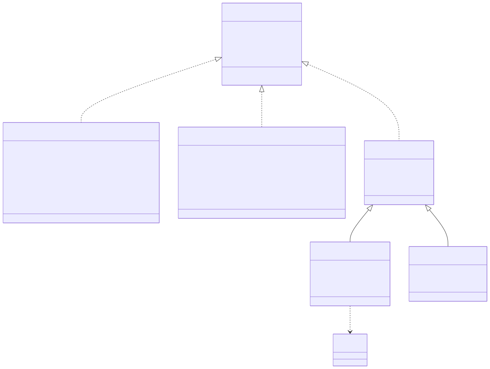
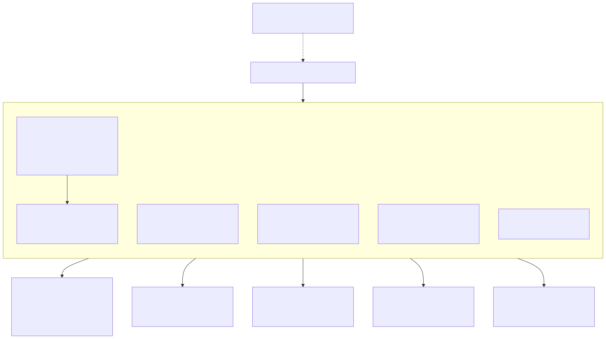
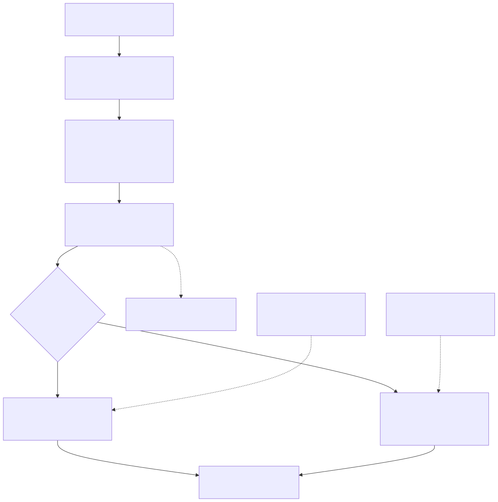

# LambdaJS — Value Model, Memory & GC Interop

> **Last verified against tree:** 2026-09-17

> **Part of the [LambdaJS detailed-design set](JS_00_Overview.md).** This document covers how a JavaScript value is represented at runtime: the `Item` tagged-value layout, the JS type ↔ Lambda `TypeId` mapping, the `undefined`/`null`/TDZ/deleted sentinels, the BigInt and Symbol-key encodings, the GC heap + side-stack memory model, `JsFunction`/closure-env ownership, call-argument spans, module-variable storage, the `JsRuntimeState` capsule, and which Lambda subsystems LambdaJS reuses.
>
> **Primary sources:** `lambda/lambda.h` / `lambda.hpp` (`Item`, `Symbol`, `Container`, `Map`, `TypeId`, packing macros), `lambda/lambda-data.hpp` (`TypeMap`/`ShapeEntry`), `lambda/js/js_runtime.h` (`ITEM_JS_UNDEFINED`/`ITEM_JS_TDZ`/`JS_DELETED_SENTINEL_VAL`), `lambda/js/js_runtime_internal.hpp` (`js_is_symbol`/`js_is_bigint`/`js_symbol_to_key`/`JsFunction`), `lambda/js/js_globals.cpp` (JS Symbol allocation and indexes), `lambda/js/js_runtime_value.cpp` (`js_typeof`/`js_make_number`/conversions), `lambda/js/js_coerce.cpp` (`js_to_primitive`), `lambda/js/js_runtime_state.{hpp,cpp}` (`JsRuntimeState`, module vars, batch reset), `lambda/js/js_runtime_function.cpp` (`JsFunction` allocation), `lambda/js/js_mir_context.hpp` (`JsMirArgStackScope`), `lambda/lambda-mem.cpp` (`heap_calloc`/`heap_alloc`/GC roots), `lambda/lambda-decimal.cpp` (BigInt).
> **Audience:** engine developers. **Convention:** `file:line` references drift; confirm against symbol names.

---

## 1. Purpose & scope

LambdaJS does not invent a value representation: every JS value is a Lambda `Item` (a 64-bit tagged word, `lambda.h:477`), backed by the same GC heap, execution side stacks, and name pool that Lambda script uses, and read through the same `get_type_id` dispatch (`lambda.hpp:293`). This document is the map of that shared substrate — how the JS type lattice is projected onto `TypeId`, where each kind of value physically lives, and how JS-specific lifetime requirements (module variables, closure environments, call arguments) are kept reachable across a **non-moving** collector. The object *shape* machinery (`Map`/`TypeMap`/`ShapeEntry`, `MapKind`, property attributes) is layered on top of this and is owned by [JS_06 — Objects, Properties & Prototypes](JS_06_Objects_Properties_Prototypes.md); closure-environment structure is in [JS_05 — Functions & Closures](JS_05_Functions_Closures.md); float-boxing performance is in [JS_15 — Performance & Optimization](JS_15_Performance.md).

---

## 2. The `Item` tagged-value representation

`Item` is a `union` over a raw `uint64_t` plus a set of bitfield views and direct container pointers (`lambda.hpp:88`). The **high byte** `[63:56]` is the `TypeId` tag for scalars; the low 56 bits hold either an inline value or a pointer. `Item::type_id()` (`lambda.hpp:159`) reads the high byte; if it is zero (a container, whose pointer occupies the full word) it dereferences the pointer and reads the `TypeId` stored at offset 0, and a fully-zero word reads as `LMD_TYPE_NULL`.

Three storage classes exist:

- **Packed scalars** — value lives entirely in the word. `null`, booleans, Lambda safe-band integers, compact sized numerics, and most canonical binary64 values carry no heap object. Ordinary JS Number creation uses the float encoding, not Lambda's integer tag.
- **Tagged-reference scalars** — high byte is the tag and the low 56 bits address a payload. Full-width integers and out-of-band doubles may point to number homes or destination-owned words; other pointer scalars use GC, pool, or Input-arena ownership. The tag alone does not prove GC ownership: dynamic datetimes are GC-owned, while static parser-built datetimes are Input-arena-owned.
- **Containers** — the word *is* the pointer (no tag byte), so `it2map`/`it2arr`/etc. are bare casts (`lambda.h:848`); the `TypeId` is read from the pointee's first byte. All extend `struct Container` (`lambda.h:525`).

JS arithmetic results funnel through `js_make_number`, which always calls the shared canonical float encoder. Most doubles self-tag directly; only the out-of-band residue uses the active number stack. `-0.0` remains distinct. No magnitude, integral-value, or Symbol-range test can retype a JS Number as Lambda `int`.

---

## 3. JS type ↔ Lambda `TypeId` mapping

The JS language types are a projection of the Lambda `EnumTypeId` enum (`lambda.h:83`). `js_typeof` (`js_runtime_value.cpp:2077`) is the authoritative mapping back to spec type names:

| JS type / value | Lambda `TypeId` | `typeof` | Notes |
|---|---|---|---|
| `undefined` | `LMD_TYPE_UNDEFINED` | `"undefined"` | `ITEM_JS_UNDEFINED`; distinct from null ([§5](#5-undefinednulltdz--deleted-sentinels)). |
| `null` | `LMD_TYPE_NULL` | `"object"` | the `typeof null` quirk (`:2086`). |
| boolean | `LMD_TYPE_BOOL` | `"boolean"` | packed in low byte. |
| number | `LMD_TYPE_FLOAT` | `"number"` | canonical binary64; most values self-tag, residue uses a number home. |
| Lambda integer crossing into JS | `LMD_TYPE_INT` | `"number"` | exact because Lambda `int` is restricted to the JS safe-integer band. |
| number (sized) | `LMD_TYPE_NUM_SIZED` | `"number"` | typed-array element reads. |
| bigint | `LMD_TYPE_DECIMAL` | `"bigint"` | `Decimal` with `unlimited == DECIMAL_BIGINT` ([§4](#4-symbol-as-property-key-encoding)). |
| string | `LMD_TYPE_STRING` | `"string"` | heap `String`. |
| symbol | `LMD_TYPE_SYMBOL` | `"symbol"` | one core `Symbol`; `kind` distinguishes Lambda textual and JS variants ([§4](#4-symbol-as-property-key--bigint-encoding)). |
| function | `LMD_TYPE_FUNC` | `"function"` | a `JsFunction` ([§6](#6-memory-model-gc-heap-side-stacks-pool)). |
| object / array / Proxy / class ctor | `LMD_TYPE_MAP`, `LMD_TYPE_ARRAY`, `LMD_TYPE_ELEMENT` | `"object"`/`"function"` | `js_typeof` follows callable capability for Proxies and `JsFunction` class constructors; class metadata does not grant callability. **A JS object is a `Map`, never an `LMD_TYPE_OBJECT`** in the shipped runtime — that kind is Lambda's nominal `type T { … }` and is inbound-only (D2.6.9v2). Ruled forward (D2.6.9v3): when the object TypeId retires, a JS object becomes a *nominal* Lambda map, i.e. a Lambda object ([JS_06](JS_06_Objects_Properties_Prototypes.md)). |

A value tagged `LMD_TYPE_INT` is always an integer. A hosted JavaScript Symbol is a pointer-backed `LMD_TYPE_SYMBOL`; `js_typeof` additionally checks `Symbol.kind` so a Lambda textual symbol does not acquire JS semantics. `js_make_number` always emits `LMD_TYPE_FLOAT`.

---

## 4. Symbol-as-property-key & BigInt encoding

Both values reuse core Lambda structures rather than carrying a parallel JS record.

**Symbol** — a JS Symbol is a pointer-backed `LMD_TYPE_SYMBOL` whose core `Symbol` allocation owns `len`, `kind`, `chars[]`, and a temporary `name_id`. `SYMBOL_JS_UNIQUE_UNDESCRIBED` separates `Symbol()` from `Symbol("")`; unique, registered, and well-known kinds all retain their required value identity. Pointer equality is JavaScript value equality, `Symbol.for` indexes text to the one registered `Symbol*`, and well-known symbols are one cached `Symbol*` each. At the **property** boundary only, `js_symbol_to_key` resolves the temporary `NameId` to the existing NamePool route, so shapes and enumeration stay on their established property identity without making the `NameId` JS value identity. `chars[]`, not a `NameRef`, is owned by the Symbol. This is the value/property distinction required by **D4.6.1v3**; the full property-key side is owned by [JS_06 — Objects, Properties & Prototypes](JS_06_Objects_Properties_Prototypes.md).

**BigInt** — a JS BigInt is **not** a packed integer. It reuses `LMD_TYPE_DECIMAL`: a heap `Decimal` whose `dec_val` is an `mpd_t*` (libmpdec arbitrary-precision) and whose `unlimited` field is set to the `DECIMAL_BIGINT` marker (`lambda.h:755`). `bigint_push_result` (`lambda-decimal.cpp:963`) allocates the `Decimal` with `heap_alloc` and tags it `LMD_TYPE_DECIMAL`; `js_is_bigint` (`js_runtime_internal.hpp:626`) is simply `get_type_id(v) == LMD_TYPE_DECIMAL`. There is **no** int56 fast path for small BigInts — even `0n` and `1n` are full `mpd_t` allocations (`bigint_from_int64`, `lambda-decimal.cpp:983`). Mixing a BigInt with a non-BigInt operand throws TypeError (`js_check_bigint_arithmetic`, `js_runtime_internal.hpp:630`), matching the spec.

---

## 5. `undefined`/`null`/TDZ & deleted sentinels

JS needs `undefined` distinct from `null`; Lambda already separates them at the type level.

- **`undefined`** — `ITEM_JS_UNDEFINED = (LMD_TYPE_UNDEFINED << 56)` (`lambda.h:751`); `make_js_undefined()` (`js_runtime_internal.hpp:645`) is the canonical constructor. `LMD_TYPE_UNDEFINED` is a distinct enum member (`lambda.h:120`), so `undefined` and `null` never alias.
- **`null`** — `ITEM_NULL = (LMD_TYPE_NULL << 56)` (`lambda.h:749`). `typeof null` returns `"object"` ([§3](#3-js-type--lambda-typeid-mapping)).
- **TDZ** — `let`/`const` bindings before initialization hold `ITEM_JS_TDZ = (LMD_TYPE_UNDEFINED << 56 | 1)` (`lambda.h:752`) — the same type tag as undefined but with the low bit set, so `js_check_tdz` (`js_runtime_state.cpp:238`) can throw a ReferenceError on access while ordinary `undefined` reads pass through. The same sentinel doubles as the "this not yet bound" marker in derived constructors: `js_get_this` (`:706`) and `js_resolve_lexical_this` (`:728`) throw the "Must call super constructor" ReferenceError when `js_current_this` equals `ITEM_JS_TDZ`.
- **Dense array hole sentinel** — `JS_DELETED_SENTINEL_VAL = 0x7E00DEAD00DEAD00` (`js_runtime.h:26`) uses the unused tag `0x7E` and marks empty dense `Array::items` slots. Ordinary object/FUNC/ARRAY companion-map delete state is `JSPD_DELETED` on `ShapeEntry`, not this raw `Item`. `js_own_shape_slot_status` still treats retained raw holes as deleted when reading shaped storage defensively; the deletion *mechanics* live in [JS_06](JS_06_Objects_Properties_Prototypes.md).
- **Iterator done** — `JS_ITER_DONE_SENTINEL = 0x7F00DEAD00000000` (`js_runtime.h:31`) uses the unused tag `0x7F` so it cannot collide with any real value; see [JS_08 — Iterators & Generators](JS_08_Iterators_Generators.md).

### 5.1 Array companion properties and the owned tail

JS arrays are the shared Lambda `Array` layout; there is no larger JS-only
header. Indexed values occupy the low `items[]` slots. Wide scalar payloads
(out-of-band doubles and polyglot int64/uint64 values) occupy counted slots
growing down from the high end, and their logical Items point back into that
same buffer.

Named properties and sparse-index metadata live in a companion `Map`. When an
array first needs that companion, `js_array_set_props` preserves the Array
header identity, grows only the items buffer if necessary, and reserves
`items[capacity - 1]` for the Map Item. `CONTAINER_FLAG_JS_PROPS` gates that
interpretation and the slot counts in `extra`; scalar payloads therefore begin
at `capacity - 2` when props exist. `extra` has one meaning for every generic
Array: total reserved tail slots. `js_array_has_props` / `js_array_props` are the
only companion read boundary, while dense scans stop at `capacity - extra`.

Both `expand_list` and the JS runtime-buffer replacement path relocate the
whole counted tail and rebase embedded scalar pointers. Attaching a property to
a Lambda-born array consequently preserves identity across the language
boundary, and importing a Lambda wide scalar into a props-bearing JS array
re-homes the scalar instead of retaining a pointer into its source frame or
container.

---

## 6. Memory model: GC heap, side stacks, pool

LambdaJS allocates from the `EvalContext`'s three regions, all shared with Lambda script.

- **GC heap** (`gc_heap_t`) — a **dual-zone non-moving mark-and-sweep** collector (`lib/gc/gc_heap.c:4`). The *object zone* is a size-class free-list allocator for object structs (`Map`, `List`, `String`, `Decimal`, `JsAccessorCell`, …); the *data zone* is a bump-pointer allocator for variable-size buffers such as `Map.data` (`gc_heap.h:96`). JS objects are created via `heap_calloc` (`lambda-mem.cpp:381`), which zeroes the struct and sets `Container::is_heap` for heap-vs-arena discrimination. `map_kind` records physical storage only; immutable `TypeMap::js_meta` carries semantic object identity under **D3.4.7**. Under **D3.4.8**, an accessor cell has `GC_TYPE_JS_ACCESSOR` and is reached directly from its owning private `ShapeEntry`; setup uses only an exact temporary object root until that edge is installed. The JIT hot path uses `heap_calloc_class` (`:395`) with a pre-computed size class and a bump-pointer fast path. **Non-moving headers** are the load-bearing property: a pointer handed to JIT code, stored in a traced environment, or sitting in an argument span stays valid across a collection. Object structs never relocate; variable data buffers can move and their owner pointers/interior scalar references are rewritten.
- **Execution side stacks** — each context reserves stable root and number regions. Generated JS saves both watermarks at function entry. Heap-capable register values are published to the precise root region; out-of-band doubles and full-width integer temporaries use the raw number region. The single epilogue copies escaping numerics to caller-donated homes before restoring the complete callee extent. The collector scans only `[side_root_base, side_root_top)` and never interprets raw number slots as Items. Datetime is owner-backed and does not use the number region; dynamic values use GC storage and static Mark values may retain Input-arena storage.
- **Module-lifetime pool** (`js_input->pool`, a `mempool`) — cache-addressable compiled wrappers returned by the cached `js_new_function` path remain module-lifetime because the function cache embeds them. Uncached method/`with` wrappers, escaping closures, bound functions, and other dynamically created wrappers are ordinary GC objects.

**`JsFunction` and closure-env ownership.** `js_new_closure` and bound-function paths allocate a `JsFunction` through `js_alloc_gc_function_object`. Its layout marker lets the `LMD_TYPE_FUNC` GC trace dispatch distinguish it from a Lambda `Function`. The trace hook follows the raw env object, bound-argument env, captured `with` stack, prototype, properties, name/source metadata, and global. `js_alloc_env` allocates the internal `GC_TYPE_JS_ENV`; its first half is precisely traced Item storage and its second half is one owned raw scalar-tail slot per Item. Thus env reachability follows closure/generator/async ownership and dead closures are collectible—there is no per-env permanent root range. Cached compiled wrappers remain pooled so `func_ptr → JsFunction*` continues to preserve `.prototype` identity. Closure-env *structure* is detailed in [JS_05 — Functions & Closures](JS_05_Functions_Closures.md).

---

## 7. Call-argument spans

Every JS call with ≥1 argument needs a contiguous `Item[]`. There is no global argument stack: the old `js_args_*` bump stack and its registered 256K-Item root range are retired. The span's owner depends on who makes the call.

- **Compiled call sites** use **argument frame slots**, a fixed range at the end of the calling function's own side-root frame (**D5.3.1**). `jm_transpile_invocation_value` opens a `JsMirArgStackScope` (`js_mir_context.hpp`) for each call or `new`. `jm_build_args_array` gives that scope the next `arg_frame_depth` slots at compile time, so an argument that itself contains a call uses disjoint higher slots, while sibling calls reuse the same range. `jm_finish_function_frame` patches the base displacement once root coloring has fixed the semantic slot count.
- **Clearing.** `jm_end_arg_stack_scope` zeroes the scope's slots when the expression completes, so completed-call roots do not outlive the expression. Every error-lane exit first zeroes all active scopes (`jm_clear_active_arg_frames`, `js_mir_completion.cpp`), so a throw during argument evaluation cannot leave stale roots behind.
- **Rooting proof.** The slots are scanned with the frame's other root slots, which is safe because the side-root region is scanned only to its current watermark. `jm_args_are_prerooted` proves that the span is exactly the scope's slots; the call then passes `args_prerooted = 1` and the call kernel does not root the span again (JC17). Generators, and argument lists that can suspend, take the copying path instead.
- **C and native callers** pass their own span with `args_prerooted = 0`; the kernel opens one owned `RootSpan` for the call's extent.
- **AST interpreter call sites** root their evaluated arguments in one `RootSpan` and pass it pre-rooted the same way.

Argument spans therefore need no batch reset and no per-heap registration: they die with the frame or scope that owns them. The dispatch that consumes the span is described in [JS_05 §7](JS_05_Functions_Closures.md).

---

## 8. Module-variable storage

Top-level `var`/`let`/`const`/function bindings of a module are stored by **index** in a flat `Item` array, not in a map. `js_module_vars[JS_MAX_MODULE_VARS]` with `JS_MAX_MODULE_VARS = 2048` (`js_runtime_state.hpp:21`,`29`) is the static backing store; `js_set_module_var`/`js_get_module_var` (`js_runtime_state.cpp:124`/`130`) bounds-check the index and read/write through the **active** pointer `js_active_module_vars` (`hpp:30`,`88`). The indirection lets nested `require()`/`import()` swap in a per-module array so an inner module cannot clobber an outer module's live slots: `js_alloc_module_vars` (`cpp:159`) `pool_calloc`s a fresh 2048-slot array and registers it as a GC root range, and `js_set_active_module_vars`/`js_get_active_module_vars` (`:170`/`166`) swap the pointer (falling back to the static array when given NULL). Each `JsFunction` snapshots `js_active_module_vars` at creation (`js_runtime_function.cpp:172`) so a closure resolves globals against its defining module. The static array is lazily registered as a GC root range the first time the heap changes (`js_ensure_module_vars_gc_rooted`, `js_runtime_state.cpp:6`). Save/restore for re-entrant modules is `js_save_module_vars`/`js_restore_module_vars` (`:145`/`152`). The compiler's index-assignment side is in [JS_01 — Compilation Pipeline](JS_01_Compilation_Pipeline.md) and [JS_04 — MIR Lowering & Code Generation](JS_04_MIR_Lowering.md).

---

## 9. `JsRuntimeState` capsule & batch reset

All mutable engine globals are gathered into one `JsRuntimeState` struct (`js_runtime_state.hpp`), instantiated once (`js_runtime_state.cpp`); legacy free-global names such as `js_strict_mode`, `js_current_this`, and `js_module_vars` are `#define` aliases onto its fields, an explicit migration-away-from-scattered-globals device. The capsule holds the strict-mode flag, active input, module-var table and count, heap epoch, `current_this`/`new_target`/`proxy_receiver`, super-this stacks, pending call-arg state, and caches (`cached_object_proto`, regexp last-match, trace counters). Per D8.4.3v2, it deliberately has no pending-exception value or message buffer: a failure is the ERROR-tagged Item returned by the fallible helper.

The **batch reset** path supports the test262 runner, which reuses one process across thousands of scripts. `js_batch_reset` is the heavy crash-recovery reset: it bumps `js_heap_epoch` (invalidating epoch-cached objects), zeroes the module-var table, tears down the module registry and JS module cache, resets transient call state and heap-bound state, and then fans out to dozens of per-subsystem resets (Math/JSON/console/Reflect global objects, constructor prototypes, DOM, event loop, RegExp statics, and every Node-compat module). `js_batch_reset_to(checkpoint)` is the lighter preamble-mode path: it restores module vars to a checkpoint and clears test-local state but leaves the heap and cached builtins intact, so the harness need not re-initialize between tests. `js_assert_batch_runtime_state_clear` audits that a reset left no dangling `this`/new-target/arg state, logging `js-batch-state` leaks. The batch/preamble mechanism itself is detailed in [JS_16 — Testing & Conformance](JS_16_Testing.md).

---

## 10. Reuse of Lambda subsystems

LambdaJS is an embedding, so much of the runtime is borrowed wholesale:

- **Name pool** — property keys, identifiers and short interned strings go through `heap_create_name` (`lambda-mem.cpp:458`), which interns into `context->name_pool` so the same name always returns the same `String*` (pointer-identity comparison for keys). A JS Symbol's temporary property `NameId` resolves here; its owned spelling remains in `Symbol::chars[]`.
- **Mempool** — `js_input->pool` backs cached compiled-function wrappers and per-module var arrays ([§6](#6-memory-model-gc-heap-side-stacks-pool), [§8](#8-module-variable-storage)).
- **GC heap & side stacks** — shared `gc_heap_t` plus the precise root/raw-number side stacks ([§6](#6-memory-model-gc-heap-side-stacks-pool)); generated Lambda and JS use the same frame emitter primitives.
- **Input parsers** — `JSON.parse` does not have its own parser; `js_json_parse` (`js_globals.cpp:12129`) calls Lambda's `parse_json_to_item_strict(js_input, …)` (`:175`), reusing the shared `lambda/input/` JSON parser and building ordinary Lambda `Map`/`Array`/`Item` values.
- **URL & other modules** — the `URL` constructor and Node `url`/`querystring`/`buffer`/etc. modules reuse Lambda's URL and I/O infrastructure (entry points `js_url_construct`, `js_url_parse`, `js_runtime.h:688`–`691`; module surface in `js_url_module.cpp`). Details are in [JS_14 — Node Compatibility](JS_14_Node_Compat.md) and [JS_13 — Web Platform: DOM, CSSOM, Events & Fetch](JS_13_Web_DOM.md).

---

## Known Issues & Future Improvements

1. **No small-BigInt fast path.** Every BigInt — including `0n`/`1n` and loop counters — is a full `mpd_t` heap allocation (`lambda-decimal.cpp:963`,`983`). An inline-int56 representation for small magnitudes (à la V8's SMI-BigInt) would cut allocation pressure in BigInt-heavy code; today the type is always boxed.
2. **Cached compiled wrappers remain module-lifetime.** The cacheable `js_new_function` path keeps pooled wrappers because the function cache embeds their addresses. Uncached method/`with` wrappers, closures, and bound functions are GC-owned, but repeatedly compiling distinct modules still retains cached wrappers until module teardown.
3. **Module-var ceiling is a hard 2048.** `JS_MAX_MODULE_VARS` (`js_runtime_state.hpp:21`) is fixed; `js_set_module_var` silently drops out-of-range indices (`cpp:124`). A module with >2048 top-level bindings would lose writes rather than grow.
4. **Sentinel values still exist.** `JS_DELETED_SENTINEL_VAL` no longer reuses the INT tag, but it remains a raw non-value `Item` in dense arrays; `ITEM_JS_TDZ` still reuses the UNDEFINED tag. Code that scans dense array items must preserve hole checks. The deleted-sentinel cleanup boundary is tracked in detail in [JS_06](JS_06_Objects_Properties_Prototypes.md).
5. **Batch reset is a long manual fan-out.** `js_batch_reset` (`js_runtime_state.cpp:271`) hand-enumerates ~30 per-subsystem reset calls; a new stateful module that forgets to register a reset leaks across test262 cases. `js_assert_batch_runtime_state_clear` catches only the capsule fields, not module-private statics.

---

## Appendix A — Source map

| File | Responsibility (this doc) |
|---|---|
| `lambda/lambda.h`, `lambda/lambda.hpp` | `Item` union + bitfields, `Container`/`Map`, `EnumTypeId`, packing macros (`i2it`/`d2it`/`s2it`/…), sentinel macros. |
| `lambda/lambda-data.hpp` | `TypeMap`/`ShapeEntry`/`JsAccessorCell` (shape owned by JS_06). |
| `lambda/js/js_runtime.h` | `ITEM_JS_UNDEFINED`/`ITEM_JS_TDZ`, `JS_DELETED_SENTINEL_VAL`, `JS_ITER_DONE_SENTINEL`, the `js_call` dynamic-call entry. |
| `lambda/js/js_runtime_internal.hpp` | `js_is_symbol`/`js_is_bigint`/`js_key_is_symbol`/`js_symbol_to_key`, `JsFunction` struct, `make_js_undefined`. |
| `lambda/js/js_runtime_value.cpp` | `js_typeof`, `js_make_number`, `js_to_string`/`js_to_boolean`/`js_to_numeric`, BigInt arithmetic dispatch. |
| `lambda/js/js_coerce.{h,cpp}` | `js_to_primitive` (ToPrimitive / OrdinaryToPrimitive). |
| `lambda/js/js_runtime_state.{hpp,cpp}` | `JsRuntimeState` capsule, module-var storage, `js_to_property_key`, `js_batch_reset[_to]`. |
| `lambda/js/js_runtime_function.cpp` | `JsFunction` allocation, `js_alloc_env`. |
| `lambda/lambda-mem.cpp` | GC allocation, execution side stacks, numeric boxing/scalar lanes, root registration, `heap_create_name`. |
| `lambda/lambda-decimal.cpp` | BigInt encoding (`bigint_push_result`, `bigint_from_int64`). |
| `lib/gc/gc_heap.{c,h}` | dual-zone non-moving collector, precise JS function/env tracing, root registries. |

## Appendix B — Related documents

- [JS_05 — Functions & Closures](JS_05_Functions_Closures.md) — closure-environment structure backed by `js_alloc_env`.
- [JS_06 — Objects, Properties & Prototypes](JS_06_Objects_Properties_Prototypes.md) — `Map`/`TypeMap`/`ShapeEntry` shape, `MapKind`, property attributes, deleted-slot mechanics, and Symbol property routing.
- [JS_01 — Compilation Pipeline](JS_01_Compilation_Pipeline.md) / [JS_04 — MIR Lowering & Code Generation](JS_04_MIR_Lowering.md) — module-var index assignment and JIT boxing.
- [JS_08 — Iterators & Generators](JS_08_Iterators_Generators.md) — `JS_ITER_DONE_SENTINEL`.
- [JS_13 — Web Platform: DOM, CSSOM, Events & Fetch](JS_13_Web_DOM.md) / [JS_14 — Node Compatibility](JS_14_Node_Compat.md) — reused URL / module infrastructure.
- [JS_15 — Performance & Optimization](JS_15_Performance.md) — float boxing avoidance, side-stack pressure, shape caching.
- [JS_16 — Testing & Conformance](JS_16_Testing.md) — batch/preamble reset in the test262 runner.
