# LambdaJS — MIR Lowering, Code Generation & Exceptions

> **Part of the [LambdaJS detailed-design set](JS_00_Overview.md).** This document covers the phase-2/3 lowering mechanics: how typed AST nodes become MIR instructions, the boxed-Item-by-default emission model and its native INT/FLOAT fast paths, boxing/unboxing tag arithmetic, condition lowering and the comparison `_raw` facades, short-circuit operators, constant folding and dead-branch elimination, call emission, the exception model (state, JIT try/catch/finally, signal-based stack overflow), and dynamic code (`eval` / `Function`).
>
> **Primary sources:** `lambda/js/js_mir_expression_lowering.cpp` (`jm_transpile_binary`, `jm_transpile_unary`, `jm_transpile_call`, `jm_transpile_condition`, `jm_try_fold_const`), `lambda/js/js_mir_statement_lowering.cpp` (`jm_transpile_if`, loops, try/catch/finally, `jm_emit_exc_propagate_check`, `jm_branch_dead_safe`), `lambda/js/js_mir_calls_boxing_types.cpp` (`jm_ensure_import`, `jm_call_*`, boxing/unboxing, `jm_emit_is_truthy`), `lambda/js/js_mir_eval_lowering.cpp` (`js_builtin_eval`, `new Function`), `lambda/js/js_mir_completion.cpp` (abrupt completions), `lambda/js/js_runtime_state.cpp` (`js_throw_value` / `js_check_exception` / `js_clear_exception`), `lambda/lambda-stack.cpp` (stack-overflow guard).
> **Audience:** engine developers. **Convention:** `file:line` references drift; confirm against the symbol name.

---

## 1. Purpose & scope

The compilation phases, the per-compile transpiler state (`JsMirTranspiler`), interpreter-vs-JIT selection, and MIR symbol resolution are all in [JS_01 — Compilation Pipeline & Phase Model](JS_01_Compilation_Pipeline.md). This document picks up at phases 2 and 3 — the per-node emission performed by `jm_define_function` and the `js_main` body — and describes how the transpiler turns expressions and statements into MIR instructions. The value representation (the tagged `Item`) is shared with [JS_03 — Value Model & Memory](JS_03_Value_Model.md); closures, capture and scope-env write-back are in [JS_05 — Functions, Closures & Scope](JS_05_Functions_Closures.md); iterator/generator lowering is in [JS_08 — Iterators & Generators](JS_08_Iterators_Generators.md).

---

## 2. The emission model: boxed Item by default, native fast paths

The default unit of value in emitted MIR is a **boxed `Item` in an `MIR_T_I64` register**. Most helpers return one, most runtime imports take and return them, and `jm_transpile_box_item` is the canonical "give me a boxed Item for this expression" entry point. On top of that baseline the transpiler opportunistically keeps numeric values **unboxed** — native `MIR_T_I64` (integer) or `MIR_T_D` (double) — whenever static type inference proves both an operand and its consumer are numeric, so an arithmetic chain need not box and re-box at every step.

The discriminator is `jm_get_effective_type` (the per-node inferred `TypeId`, fed by phase 1.75–1.78 inference in [JS_01](JS_01_Compilation_Pipeline.md) §5). `jm_is_native_type` (`js_mir_calls_boxing_types.cpp:1125`) admits exactly `LMD_TYPE_INT`, `LMD_TYPE_FLOAT`, `LMD_TYPE_BOOL`. A value flows native through arithmetic, then crosses back to boxed only at a boundary that demands an `Item` (a call argument, a property store, a return, a variable that is not statically typed). The native-vs-boxed decision is recomputed at each consumer rather than tracked as a global property of a register, which is why `jm_transpile_as_native` re-derives whether a child took the native path (`:1356`) before deciding to unbox.

---

## 3. Boxing & unboxing (tag arithmetic)

Boxing and unboxing of the common scalars is emitted **inline as MIR bit-ops**, not as runtime calls, so the fast paths stay branch-light.

- **Box int** — `jm_box_int_reg` (`js_mir_calls_boxing_types.cpp:356`) masks to 56 bits and ORs in `ITEM_INT_TAG`, but first range-checks against `INT56_MAX/MIN` and the symbol limit `-(JS_SYMBOL_BASE)`; out-of-range integers are promoted to a boxed float via `MIR_I2D` + `push_d` rather than truncated. `jm_box_int_const` (`:329`) is the constant-folded variant: a pure `MIR_MOV` of `ITEM_INT_TAG | (value & MASK56)`.
- **Box float** — `jm_box_float` is a single `push_d` call. Inline encodings stay in the Item; only the out-of-band residue consumes one raw slot in the current number side-stack (see [JS_03](JS_03_Value_Model.md)).
- **Box string** — `jm_box_string` (`:411`) ORs `STR_TAG` onto a non-null pointer (NULL maps to `ITEM_NULL`); `jm_box_string_literal` (`:429`) interns into the name pool at transpile time and bakes `s2it(interned)` as a raw `MIR_MOV` constant — valid because the interned `String*` outlives the transpiler.
- **Box bool** — handled in `jm_box_native` (`:767`) by ORing `LMD_TYPE_BOOL << 56` onto the 0/1 reg.
- **Unbox int** — `jm_emit_unbox_int` (`:709`) is `LSH 8` then arithmetic `RSH 8` to sign-extend the low 56 bits.
- **Unbox float** — `jm_emit_unbox_float` (`:720`) short-circuits if the register is already `MIR_T_D`/`MIR_T_F`, else calls the runtime `it2d`.

`jm_box_native` / `jm_ensure_native_int` / `jm_ensure_native_float` (`:749`–`:780`) are the type-directed adapters used at native↔boxed boundaries. `jm_ensure_boxed` (`:784`) is a defensive net that boxes a stray `MIR_T_D` register before it reaches a boxed-Item sink.

---

## 4. Native arithmetic & numeric fast paths

`jm_transpile_binary` (`js_mir_expression_lowering.cpp:1704`) takes the native path when `both_numeric` holds (both effective types are INT or FLOAT) and the operator is not `**`, `&&`, or `||` (`:1763`). Operands are fetched via `jm_transpile_as_native` at the chosen arithmetic width (`use_float` when either side is FLOAT) and combined with a single MIR op, returning a **raw** register:

- `+` / `-` → `MIR_DADD`/`MIR_ADD`, `MIR_DSUB`/`MIR_SUB` (`:1780`).
- `*` → `MIR_DMUL`; notably **INT×INT also multiplies through doubles** then `MIR_D2I`, to match JS double-precision semantics rather than exposing 64-bit int product precision (`:1806`).
- `/` → always `MIR_DDIV` returning a double, even for INT/INT, because `7/2 === 3.5` (`:1821`).
- `%` → the runtime `fmod` (so `x % 0 → NaN`) (`:1839`).
- `**` → no native MIR op; falls through to the boxed `js_power` (`:1848`).
- comparisons `<` `<=` `>` `>=` → `MIR_DLT`/`MIR_LTS` etc., returning a native 0/1 (`:1852`).

Crucially, the native comparison path requires **both** sides to be statically numeric; a mixed/untyped comparison deliberately does **not** take a "semi-native" route (the disabled block at `:2025` explains why: `it2i` on a boxed float, or float-unboxing a non-numeric Item, would produce garbage) and instead falls through to the boxed runtime.

The boxed fallback (`:2154`) maps each operator to a runtime import. Tune8 collapsed several families: `js_compare(op, l, r)` covers `<` `<=` `>` `>=` with `op` a compile-time-constant operand (`:2175`), and `!=` / `!==` reuse `js_equal` / `js_strict_equal` followed by an inline `MIR_XOR` of the low bit rather than dedicated not-equal functions (`:2155`, `invert_box`). String `+` is special-cased to `js_string_concat` when both sides are STRING (`:1766`).

---

## 5. Condition lowering, the `_raw` facades & `jm_emit_is_truthy`

Branch conditions (the test of `if`, `while`, `for`, ternary, and the operands of `!`) go through `jm_transpile_condition` (`js_mir_expression_lowering.cpp:12330`), which produces a **raw int64 0/1** directly usable in `MIR_BF`/`MIR_BT` — avoiding the box-a-boolean-then-unbox-it round trip:

1. **Typed numeric comparison** → defer to `jm_transpile_expression`, since the native comparison path (§4) already yields 0/1 (`:12356`).
2. **Untyped comparison** → call a `_raw` facade that returns int64 directly: `js_cmp_raw(op, l, r)` for the four relational ops (op a constant operand), `js_eq_raw` for `===`, `js_loose_eq_raw` for `==`, with `!==`/`!=` collapsed to the same call XOR-ed with 1 (`:12398`–`:12435`).
3. **`!expr`** → recurse on the operand and `MIR_XOR` with 1 (`:12440`).
4. **Fallback** → `jm_transpile_box_item` then `jm_emit_is_truthy` (`:12453`).

`jm_emit_is_truthy` (`js_mir_calls_boxing_types.cpp:1235`) is the general truthiness primitive: for a statically-BOOL expression it just `AND`s the low bit (the boolean Item's payload), otherwise it calls the runtime `js_is_truthy` and `uext8`-narrows the result. The empty test of `for(;;)` becomes a constant 1 (`:12331`).

---

## 6. Short-circuit operators

`&&`, `||`, and `??` are lowered in `jm_transpile_binary` **before** the boxed fallback (`js_mir_expression_lowering.cpp:2038`) so the right operand is only evaluated when needed. The shape is uniform: evaluate the left into a boxed Item; compute a branch condition (`jm_emit_is_truthy` for `&&`/`||`, `js_is_nullish` for `??`); branch with `MIR_BF` (for `||`) or `MIR_BT` (for `&&` and `??`) to the right-evaluation label; on the short-circuit edge `MOV` the left value into the result, else `MOV` the right value (`:2056`–`:2090`). The whole expression therefore yields a boxed Item, matching ECMAScript semantics that these operators return one of their operands, not a coerced boolean.

A separate peephole sits just after: `typeof x === "literal"` collapses the typeof + string-box + strict-equal triple into a single `js_typeof_is(value, type_str)` call returning a raw 0/1 that is then re-boxed as a boolean Item (`:2093`–`:2152`), gated on the operand being an in-scope identifier.

---

## 7. Constant folding & dead-branch elimination

`jm_try_fold_const` (`js_mir_calls_boxing_types.cpp:1552`, declared from the expression file) is a pure compile-time evaluator over literal/unary/binary subtrees, gated by `jm_const_fold_enabled` (on unless `LAMBDA_JS_CONST_FOLD=0`, `:1543`). It is deliberately conservative to preserve runtime numeric semantics:

- number literals carry an `is_float` classification mirroring `jm_get_effective_type`; bigint and non-finite values are not folded (`:1557`).
- integer `+`/`-`/`*` only fold when the result **round-trips exactly** through int64 and stays within ±2^53 (`:1608`); `/` and `%` always yield float; bit-ops fold via `ToInt32`/`ToUint32` helpers (`:1625`).
- unary `-0` is **not** folded (it must stay float), and `**`, `&&`, `||`, `??`, `in`, `instanceof` are never folded (`:1581`, `:1646`).

At a value site, `jm_emit_folded_at_value_site` (`:1661`) emits either a native constant (when the caller wants native and the fold type agrees) or a boxed Item, and returns false to fall through to normal codegen on a type mismatch — keeping the folded representation consistent with what the consumer expects.

Dead-branch elimination lives in `jm_transpile_if` (`js_mir_statement_lowering.cpp:1114`): if the test folds to a constant, the never-taken branch is dropped **only when** `jm_branch_dead_safe` (`:1094`) confirms it cannot hoist an Annex-B function declaration into the enclosing scope. That whitelist admits throw/expression/return/break/continue statements and blocks recursively composed of them; anything else (notably a function declaration) is conservatively kept and lowered normally, because `var` hoisting is already handled by local collection but function hoisting is not.

---

## 8. Call emission & MIR import

Runtime helpers are referenced by name and resolved at link time. The emit side is `jm_ensure_import` (`js_mir_calls_boxing_types.cpp:97`), which lazily builds one `MIR_new_proto_arr` + `MIR_new_import` per distinct `(name, return type, nres, nargs, arg types)` signature and caches both keyed by a string like `name#r<ret>#n<nres>#a<nargs>#<argtype>…` (`:104`). The arity-specialized wrappers `jm_call_0`…`jm_call_6` and `jm_call_void_0`…`jm_call_void_5` (`:154`–`:299`) build the actual call instruction. The resolution side (`import_resolver`, `func_map`, `jit_runtime_imports[]`) is documented in [JS_01](JS_01_Compilation_Pipeline.md) §7.

Every generated entry point also uses the shared Lambda side-stack emitter. `jm_begin_function_frame` inserts one checked prologue that binds the context stacks, saves root/number watermarks, and reserves the function's static root count. Heap-capable locals and raw env/args pointers publish into root slots; assignments refresh their slots and helper calls first publish all live scope variables. `jm_emit` rewrites every `MIR_RET` to one return label. `jm_finish_function_frame` re-homes owned env scalars, extracts any escaping scalar lane, restores the number watermark, rebuilds the return Item in the caller extent, restores the root watermark, and returns. Generator and async state-machine entries use the same discipline, so suspension state owns no pointer into a reclaimed invocation.

`jm_transpile_call` (`js_mir_expression_lowering.cpp:6458`) is a large dispatcher that recognizes special callees before the generic path: `console.log` (`:6462`), `require(literal)` resolved to `js_require` at transpile time (`:6482`), dynamic `import()` (`:6519`), and `super.method(...)` (`:6611`). The generic user-function call boxes the callee and `this`, builds an argument array via `jm_build_args_array`, and emits `js_call_function(fn, this, args, argc)` (e.g. `:6879`); spread-or-apply forms route through `js_apply_function`. Every call site that can observe side effects is wrapped, in `jm_transpile_expression`'s call case (`:12474`), by `js_args_save`/`js_args_restore` (to reset the transient argument stack), `jm_scope_env_reload_vars` / `jm_env_reload_shared_captures` (to re-read captured variables a callee may have mutated — see [JS_05](JS_05_Functions_Closures.md)), and `jm_emit_exc_propagate_check` (§9).

---

## 9. Exceptions

LambdaJS does not use C++ exceptions or `longjmp` for ordinary JS throws. Instead it uses a **thread-global pending-exception flag** plus emitted check-and-branch sequences, so JIT'd frames unwind by returning normally.

**State** (`js_runtime_state.cpp`): `js_throw_value(v)` sets `js_exception_pending = true`, re-homes a pointer-backed wide scalar to traced heap storage, stores `js_exception_value`, and caches a human-readable message; `js_check_exception` reads the flag; `js_clear_exception` reads-and-clears, returning the value. `js_exception_value` is registered as a GC root. The heap re-home is necessary because this singleton outlives the throwing frame's number watermark. The convenience throwers (`js_throw_type_error`, `js_throw_named_error`, `js_check_tdz`, `js_throw_const_assign`, …) all funnel into `js_throw_value`.

**Propagation** is emitted by `jm_emit_exc_propagate_check` (`js_mir_statement_lowering.cpp:1307`), called after essentially every runtime call that can throw. It finds the topmost non-`yield_state_only` entry on `try_ctx_stack` (the fixed-depth-16 stack in `JsMirTranspiler`): inside a try it emits `MIR_BT` to the catch (or finally) label; outside any try it emits `MIR_BT` to a per-function `func_except_label` that returns null (`:1322`). This is what makes exceptions propagate correctly through nested calls, loops and if/else even without an explicit `try`.

**JIT try/catch/finally** (`JS_AST_NODE_TRY_STATEMENT`, `:5483`) pushes a `JsTryContext` recording the catch/finally/end labels and delayed-return registers (`return_val_reg`, `has_return_reg`). After each statement in the try body it branches to catch/finally on a pending exception (`:5552`). The catch block restores the `with`-scope depth and the transient argument-stack mark (a throw during argument evaluation leaks a half-built arg frame — `js_args_save`/`js_args_restore` reclaim it, `:5532`), then `js_clear_exception` yields the thrown value to bind the catch parameter (`:5596`). The finally block **saves and clears** any pending exception so the finalizer starts clean, runs, and then re-throws the saved exception via `js_throw_value` **unless** the finalizer itself threw a new one (which takes precedence per spec §13.15.8) (`:5768`–`:5824`). `throw` (`:5885`) and abrupt `return`/`break`/`continue` (via `jm_emit_abrupt_jump_cleanup`, `js_mir_completion.cpp:7`) inline intervening finalizers and pop `with` scopes before transferring control. The `yield_state_only` flag marks synthetic contexts pushed only so a generator resume can re-initialize delayed-return registers — they are skipped by throw/return routing (`:5616`).

**Stack overflow** is the one case that *does* use signals (`lambda/lambda-stack.cpp`, shared with the Lambda runtime). `lambda_stack_init` installs a `SIGSEGV` handler on an alternate stack (`sigaltstack` + `SA_ONSTACK`, `:194`). The core pipeline arms a `sigsetjmp` recovery point and sets `_lambda_recovery_armed` only around the `js_main` call (`js_mir_entrypoints_require.cpp:798`–`:815`). On a fault the handler disambiguates a genuine stack overflow from other segfaults, and — only if armed — `siglongjmp`s back (`lambda-stack.cpp:177`–`:191`); the pipeline then converts the recovery into a normal JS exception via `js_throw_range_error("Maximum call stack size exceeded")` (`js_mir_entrypoints_require.cpp:810`). An unarmed overflow (e.g. during AST build) falls through to a clean default crash rather than jumping into a zero-initialized `jmp_buf`.

---

## 10. Dynamic code: `eval` & `Function` tiers

`js_builtin_eval` (`js_mir_eval_lowering.cpp:801`) compiles in escalating tiers, cheapest first, to avoid the full parse→AST→JIT cost for trivial inputs:

1. **Non-string** → returned unchanged (ES semantics, `:806`).
2. **Whitespace/comment-only** → `undefined` (`:820`).
3. **Single RegExp-literal fast path** → `js_create_regexp_from_source` directly, no parse/AST/JIT (`:857`).
4. **Expression form** → if the source has no leading statement/declaration keyword and no top-level `;` (a long keyword scan plus a string-aware semicolon check, `:907`–`:1002`), wrap it as `"return ( code )"` inside a function, compile via `js_new_function_from_string`, and `js_call_function` it (`:1003`). This preserves function context (`new.target`, `arguments`, `super`).
5. **Script form (Phase C)** → otherwise compile the source as a top-level script: own transpiler, `jit_init(0)` (eval snippets do not amortize optimization passes), `transpile_js_mir_ast`, `MIR_link`, run `js_main`, return its completion value (`:1029`). `is_eval_direct` exports `var` declarations to `globalThis` for sloppy-mode direct eval; `new.target` is forced to undefined for the duration (`:1126`).

Both the expression and script tiers **inherit the outer script's `module_consts`** by pre-seeding `mt->preamble_entries` from the `g_eval_preamble_*` globals, so eval/`new Function` code can resolve variables declared in the calling scope (`:1092`). `new Function` / `GeneratorFunction` / `AsyncFunction` share `js_new_function_from_string_kind` (`:31`), which textually assembles `(function(params)\n{ body\n})`, applies the same import-meta / hashbang / HTML-comment early errors, compiles at opt 0, and returns the function Item. The MIR context for eval/`Function` code is **deferred** (`jm_defer_mir_cleanup`), never eagerly finished, because the produced closures and name-pool string literals may outlive the call (`:1141`).

---

## Known Issues & Future Improvements

Grounded in the current code; candidates for cleanup, not necessarily bugs.

1. **Boxed `MIR_MOV` overhead / no destination-passing.** The short-circuit, conditional, and many fold/boxed paths thread results through explicit `MIR_MOV` into a fresh result register rather than letting the consumer name the destination. The volume of `MIR_MOV` is high (the boxed-Item discipline plus per-site result regs), and a destination-passing rewrite — having `jm_transpile_*` accept a target register — is the obvious next optimization but has not been done.
2. **Oversized lowering files.** `jm_transpile_binary`, `jm_transpile_call`, and `jm_transpile_condition` live in a ~13.7k-line `js_mir_expression_lowering.cpp`; `js_mir_statement_lowering.cpp` is ~6k lines with the entire try/catch/finally state machine inline in one `switch` case (`:5483`+). The special-callee dispatch in `jm_transpile_call` is a long linear chain of `memcmp` callee-name checks.
3. **MIR-gen spill workaround for generators.** Values that must survive a `yield` are manually spilled to the generator env via `jm_gen_spill_save`/`jm_gen_spill_load` (`js_mir_analysis.cpp:293`), threaded through try/catch/finally (`:5774`+). This is a hand-rolled compensation for the register allocator not preserving virtual registers across the resume edge; it is error-prone and scattered.
4. **Per-scope strict-mode is an approximation in eval.** The eval/`Function` paths set a single `tp->strict_mode` from the inherited flag (`js_mir_eval_lowering.cpp:1042`) and do a coarse source scan for restricted assignments (`js_eval_strict_assigns_restricted_name`) rather than tracking strictness per lexical scope; some edge cases are handled by string-scanning the source instead of by the parser.
5. **eval tier selection is textual.** Tiers 3–4 are chosen by hand-written character scans over the source (RegExp-literal recognizer, keyword table, string-aware semicolon search) rather than from the parsed AST, so the bridge between "looks like an expression" and "is an expression" is approximate and the keyword whitelist must be maintained by hand (`:907`–`:1002`).
6. **Native multiply routes INT×INT through doubles.** Correct for ≤2^53 but means a pure-integer hot loop pays `I2D`/`DMUL`/`D2I` instead of an integer multiply (`js_mir_expression_lowering.cpp:1806`); a range-guarded integer-multiply fast path is possible.
7. **Recomputed native-path predicates.** `jm_transpile_as_native` re-derives whether a child expression took the native path by re-inspecting the AST and re-running `jm_get_effective_type` (`js_mir_calls_boxing_types.cpp:1356`+), duplicating logic already embedded in `jm_transpile_binary`; the two predicates can drift.

---

## Appendix A — Source map

| File | Responsibility (this doc) |
|---|---|
| `lambda/js/js_mir_expression_lowering.cpp` | `jm_transpile_binary`/`_unary`/`_call`/`_condition`/`_conditional`, native arithmetic, short-circuit, `jm_try_fold_const` body, `_raw` facade emission. |
| `lambda/js/js_mir_statement_lowering.cpp` | `jm_transpile_if`, loops, try/catch/finally, throw, `jm_emit_exc_propagate_check`, `jm_branch_dead_safe`. |
| `lambda/js/js_mir_calls_boxing_types.cpp` | `jm_ensure_import` + `jm_call_*`, inline box/unbox helpers, `jm_box_native`, `jm_is_native_type`, `jm_emit_is_truthy`, `jm_transpile_as_native`. |
| `lambda/js/js_mir_eval_lowering.cpp` | `js_builtin_eval` tiers, `new Function` / `GeneratorFunction` / `AsyncFunction`. |
| `lambda/js/js_mir_completion.cpp` | Abrupt-completion cleanup (`jm_emit_abrupt_jump_cleanup`, break/continue). |
| `lambda/js/js_mir_analysis.cpp` | `jm_gen_spill_save` / `jm_gen_spill_load`. |
| `lambda/js/js_runtime_state.cpp` | `js_throw_value` / `js_check_exception` / `js_clear_exception`, TDZ/const-assign throwers. |
| `lambda/lambda-stack.cpp` | `lambda_stack_init`, SIGSEGV alt-stack handler, `sigsetjmp` recovery. |

## Appendix B — Related documents

- [JS_01 — Compilation Pipeline & Phase Model](JS_01_Compilation_Pipeline.md) — phases 1–3, interp/JIT selection, MIR import resolution.
- [JS_03 — Value Model, Memory & GC Interop](JS_03_Value_Model.md) — the tagged `Item`, tag layout, execution side stacks for boxed numerics.
- [JS_05 — Functions, Closures & Scope](JS_05_Functions_Closures.md) — capture analysis, scope-env reload around calls, native/boxed dual versions.
- [JS_08 — Iterators & Generators](JS_08_Iterators_Generators.md) — generator yield-state lowering and the spill mechanism.
- [JS_15 — Performance & Optimization](JS_15_Performance.md) — fast-path measurements, link cost, opt-level trade-offs.
