# LambdaJS — Functions, Closures & Scope

> **Part of the [LambdaJS detailed-design set](JS_00_Overview.md).** This document covers how a JS function becomes a runtime `JsFunction`, the dual native/boxed code emitted for each function, evidence-based parameter-type inference and native eligibility, the capture-analysis phases that decide which variables a closure needs, the scope-environment model that backs mutable capture, the `this`/`arguments`/`new.target` bindings, tail-call optimization, single-expression inlining, and the transient call-argument stack.
>
> **Primary sources:** `lambda/js/js_runtime_function.cpp` (`JsFunction`, `js_new_function`/`js_new_closure`/`js_alloc_env`, arg stack), `lambda/js/js_runtime_state.cpp` (`js_get_this`/`js_set_this`/`js_get_new_target`/`js_build_arguments_object`), `lambda/js/js_mir_function_class_lowering.cpp` (`jm_define_function`, native version, scope-env emit, TCO loop), `lambda/js/js_mir_expression_lowering.cpp` (`jm_create_func_or_closure`, `jm_readback_closure_env`, `jm_should_inline`, dual-version call dispatch), `lambda/js/js_mir_analysis.cpp` (`jm_analyze_captures`), `lambda/js/js_mir_function_collection_class_inference.cpp` (`jm_infer_param_types`, `jm_has_tail_call`), `lambda/js/js_mir_module_batch_lowering.cpp` (phase driver, `jm_callsite_propagate`, scope-env layout), `lambda/js/js_mir_calls_boxing_types.cpp` (`jm_scope_env_mark_and_writeback`).
> **Audience:** engine developers. **Convention:** `file:line` references drift; confirm against symbol names.

---

## 1. Purpose & scope

A JS function compiles to one or two MIR functions and is represented at runtime by a `JsFunction` struct (an `LMD_TYPE_FUNC` tagged pointer sharing Lambda's `Item`/GC model — see [JS_03 — Value Model](JS_03_Value_Model.md)). The compile-time machinery is the back half of the multi-phase pipeline in [JS_01 — Compilation Pipeline](JS_01_Compilation_Pipeline.md): function collection (phase 1.0), capture analysis (phases 1.5–1.7), type inference (1.75–1.78), forward declarations (1.9), and body emission (phase 2, `jm_define_function`). This document covers what those phases compute *about functions and scope* and how the emitted code wires up closures, `this`, and calls. The general expression/statement emission and exception model are in [JS_04 — MIR Lowering](JS_04_MIR_Lowering.md); class methods and constructors layer on top of this and live in [JS_07 — Classes](JS_07_Classes.md); generators/async rewrite the function body into a state machine and are in [JS_08 — Iterators & Generators](JS_08_Iterators_Generators.md) and [JS_09 — Async & Modules](JS_09_Async_Modules.md).

---

## 2. Function objects (`JsFunction`) & the dual code scheme

`JsFunction` (`js_runtime_internal.hpp:70`) starts with `TypeId type_id` (always `LMD_TYPE_FUNC`) followed by `void* func_ptr` (the compiled MIR entry), `int param_count`, the closure `Item* env` + `int env_size`, `Item prototype`, the bound-function trio (`bound_this`/`bound_args`/`bound_argc`), `String* name`, `int builtin_id` (>0 routes to built-in dispatch — see [JS_06](JS_06_Objects_Properties_Prototypes.md)), `Item properties_map` (arbitrary own props), a `uint16_t flags` word (`JS_FUNC_FLAG_*`: generator, arrow, strict, method, async, derived-ctor, …, `:92`), `int16_t formal_length` (ES `.length`; -1 = use `param_count`), `Item* module_vars` (binds the function to its defining module's variable array), `String* source_text` (for `Function.prototype.toString`), and the `with`-environment capture (`with_env`/`with_env_depth`).

The bound trio (`bound_this`/`bound_args`/`bound_argc`, flagged by `JS_FUNC_FLAG_HAS_BOUND_THIS`) records the result of `Function.prototype.bind`; bound functions always take the dynamic call path, which merges `bound_args` ahead of the call args and overrides the receiver (`js_runtime.cpp:1667`–`1679`).

`js_new_function` pool-allocates only its cached module wrapper, stamps the fields, binds `module_vars` to `js_active_module_vars`, and **caches by `func_ptr`** in a fixed 512-entry table so the same MIR function always yields the same `JsFunction*` — this is what makes `Foo.prototype = {…}` and `new Foo()` agree on identity. Cache-suppressed or `with`-capturing wrappers, `js_new_method_function`, `js_new_closure`, and bound-function paths allocate GC-owned `JsFunction` objects; their trace hook owns all dynamic env edges.

Each user function is potentially emitted **twice** by `jm_define_function` (`js_mir_function_class_lowering.cpp:292`):

- a **boxed version** — name `<fname>`, signature `Item(Context*)` style with boxed `Item` params and result, handling the full dynamic ABI (closure env, `arguments`, dynamic `this`, exceptions);
- a **native version** — name `<fname>_n` (`:319`), a flat `MIR_new_func_arr` whose params and return are unboxed `MIR_T_I64`/`MIR_T_D` (`:327`,`:332`). It exists only when the function is *native-eligible* ([§3](#3-parameter-type-inference--native-eligibility)): `has_native_version`, no captures, no non-simple params, `1 ≤ param_count ≤ 16`, and INT/FLOAT params and return (`:301`–`:313`). The native item is registered as a local func (`:338`) so direct call sites can target it.

The native version skips the boxed entry's per-call overhead entirely; the call-site decision between the two is in [§7](#7-call-dispatch-native-vs-boxed-vs-dynamic).

---

## 3. Parameter type inference & native eligibility

Native eligibility is driven by **evidence**, not declared types. `jm_infer_param_types` (`js_mir_function_collection_class_inference.cpp:1954`) first classifies the parameter list: it sets `has_rest_param` and `has_non_simple_params` for rest/default/destructuring/non-identifier params (`:1961`–`:1991`), which disqualify the function from a native version. Functions with 0 or >16 params are left boxed (`:1993`). TypeScript parameter annotations, when present on any param, take priority (`:1997`–`:2046`).

Otherwise it walks the body (`jm_infer_walk`, `:1689`) accumulating a `JsParamEvidence` per parameter (`js_mir_context.hpp:81`): `int_evidence`/`float_evidence`/`string_evidence` counters plus three poison flags — `used_as_container` (param appears as the object in `arr[i]`), `compared_with_non_numeric` (compared via `===` with undefined/null/bool, where native unboxing would erase the type distinction), and `param_reassigned` (target of a plain assignment, so the entry value's type is not trustworthy). Arithmetic with int/float literals and arithmetic operators contribute numeric evidence; comparisons alone do not (`:1744`–`:1761`). A P6 alias pass re-walks the body treating `let x = param` aliases as the parameter so evidence on the alias flows back (`:2074`–`:2133`). Resolution (`:2138`): any poison flag → `ANY`; else `float_evidence > 0` → FLOAT; else int evidence with no string evidence → INT; else `ANY`. BigInt literals anywhere in the body force all params to `ANY` (`:2055`).

Return type comes from `jm_infer_return_type` with a P6 deep re-inference fallback (`js_mir_module_batch_lowering.cpp:3988`–`3998`). Native eligibility is then computed centrally in **phase 1.75** (`:4004`): no captures, `1 ≤ param_count ≤ 16`, no `arguments` use, no non-simple params, and an INT/FLOAT return — computing it here (not lazily in `jm_define_function`) lets callers that invoke a later-defined native function propagate its return type into a `let x = f(…)` variable.

Two later passes adjust eligibility against actual call sites:

- **Phase 1.76 — callsite widening** (`jm_callsite_propagate` → `jm_callsite_scan_node`, `js_mir_module_batch_lowering.cpp:1706`). For every call to a native-eligible function, a literal argument whose type contradicts the inferred param type widens that param to `ANY` and clears `has_native_version` (`:1738`–`:1743`). Any function expression / arrow passed *as a callback argument* also has its native version revoked, since the receiving builtin may pass arbitrary types (`:1748`–`:1764`).
- **Phase 1.77 (P6 narrowing)** and **Phase 1.78 (P4b ctor field propagation)** further refine still-`ANY` params and constructor field types from agreeing call sites (driver at `js_mir_module_batch_lowering.cpp`, phase table in [JS_01 §5](JS_01_Compilation_Pipeline.md)).

---

## 4. Capture analysis (phases 1.5–1.7)

> Capture analysis is the back half of phase 1 in the compile pipeline; the phase ordering, the fixed-point invariants, and the per-phase line references are owned by [JS_01 — Compilation Pipeline §5](JS_01_Compilation_Pipeline.md). This section summarizes what the phases compute about scope; it does not re-document the driver.

**Phase 1.5 — free-variable detection.** `jm_analyze_captures` (`js_mir_analysis.cpp:1644`) collects the function's parameter names, local declarations, and all identifier references in the body (plus references inside default-parameter expressions), then computes `free = refs − params − locals`. A free name is a capture only if it is in the outer scope and is **not** a compile-time module constant — unless a parent function declares a same-named local that shadows the module constant, in which case it is captured and `force_env_capture` is set (`:1696`–`:1718`). Each capture is recorded in `fc->captures[]` as a `JsCaptureEntry` (`js_mir_context.hpp:193`: `name`, `scope_env_slot`, `grandparent_slot`, and `is_let_const`/`is_const`/`is_nfe_binding`/`force_env_capture` flags). Synthetic captures are appended for a named-function-expression self-reference and for the lexical pseudo-variables `_js_this`, `_js_new.target`, and `_js_arguments` when the body needs them (`:1755`–`:1808`) — this is how an arrow inherits its enclosing `this`/`new.target`/`arguments`.

**Phase 1.6 — transitive propagation.** A fixed-point loop (≤10 rounds, `js_mir_module_batch_lowering.cpp:3242`) walks parents and pulls up any capture a child needs that the parent does not itself bind, so a variable referenced only by a deeply nested arrow is captured at every intervening level. Module constants and names the parent binds stop the propagation.

**Phase 1.7 family — scope-env layout.** For each parent, phase 1.7 (`:3445`) computes the **union of the captures of its direct children** as the parent's scope-environment slot list (`scope_env_names[]`, `scope_env_count`). True NFE self-captures are excluded from the shared pool and given dedicated trailing slots so one NFE's self-patch cannot clobber a same-named outer binding (`:3450`–`3517`). Phase 1.7.5 (Track A, `:3636`) builds an analogous **module-level** scope env from top-level `let`/`const` captured by closures, stored in a synthetic `module_fc`. Phase 1.7b (`:3797`) detects parents whose scope env consists entirely of transitive captures already present in the grandparent's env and marks `reuse_parent_env` so they need no allocation of their own. Phase 1.7c (`:3870`) wires grandparent slots and a parent-env-link slot for the mixed case. The output consumed at emit time is `fc->has_scope_env`, the `scope_env_names[]` list, and each capture's resolved `scope_env_slot`.

---

## 5. The scope-environment model

LambdaJS backs mutable closure capture with a **scope environment**: a GC-managed internal allocation whose first half is `Item[]` and whose second half is an owned raw scalar tail. Because JS captures by reference, multiple sibling closures and the parent itself must all see the same storage.

**Allocation at parent entry.** When `fc->has_scope_env`, the parent either **reuses** its incoming env (when `reuse_parent_env` holds and a compile-time re-check confirms no scope var is locally shadowed) or **allocates** a fresh one via `js_alloc_env(scope_env_count)`. `js_alloc_env` returns a `GC_TYPE_JS_ENV`; the collector derives the logical Item count from its header and traces only that half. Each scope-env slot is populated from the current live value — re-read live from the parent's env when the var is itself a capture (`from_env`), so a sibling closure's mutation is visible to later grandchild closures — and the corresponding `JsMirVarEntry` is marked with its env slot/register. The generated function registers owned env registers with its epilogue so pointer-backed int64/float/DateTime values are rebased into the env's scalar tail before the number watermark is restored.

**Closure creation.** `jm_create_func_or_closure` chooses between two strategies for a capturing function. If the parent's scope env is live and every capture has a resolved slot — excluding per-iteration `let`/`const` and NFE self-bindings — it emits `js_new_closure(func, pc, scope_env_reg, slot_count)`, giving the closure a shared env. Otherwise it allocates a copied dense env and fills its resolved capture slots. `js_new_closure` re-homes the scalar slots, allocates a traced `JsFunction`, stores `env`/`env_size`, and binds `module_vars`; the function→env edge and generator maps trace their envs, while the fixed async-context table roots suspended env pointers without adding a root range per environment.

**Consuming the env (closure entry).** A closure body receives its captured environment in a dedicated `_js_env` register — a MIR function parameter (`js_mir_function_class_lowering.cpp:2320`,`:2328`). At entry the boxed body loads each capture from its env slot into a register and records a `JsMirVarEntry` marked `from_env` with the `env_slot`/`env_reg` (`:2410`–`2416`), so later reads/writes target the env, not a stale copy. Transitive captures that live in a grandparent env are read indirectly through the parent-env-link slot, with a null-link fallback to the local slot (`:2380`–`2406`).

**Write-back (shared env).** When an outer variable that lives in a scope env is reassigned, `jm_scope_env_mark_and_writeback` (`js_mir_calls_boxing_types.cpp:1156`) stores the new (boxed) value into the var's scope-env slot so closures observe it. In module-body context (`current_func_index < 0`) it uses the synthetic `module_fc` and the `module_scope_env_active` flag (`:1173`–`1177`). A `let`/`const` outer-binding guard prevents writing through a shadowed inner binding (`:1188`).

**Read-back (copied env).** A copied dense env is the closure's canonical storage, so after a call to that closure the caller must reload the outer registers. `jm_create_func_or_closure` registers the env in the `last_closure_*` fields (`:11780`–`11788`); a subsequent call emits `jm_readback_closure_env` (`js_mir_expression_lowering.cpp:6078`), which — guarding against a null env — reloads each capture's `var.reg` from its env slot (unboxing INT/FLOAT, leaving BOOL and object types boxed, `:6102`–`6133`) and mirrors the value into any scope-env slot. The env is deliberately **not** reset after read-back: it stays alive with the closure and the read-back is idempotent, so a closure stored and called repeatedly keeps propagating mutations (`:6135`–6145`). Single assignments into a matching capture also write through via `jm_write_last_closure_capture_if_matching` (`js_mir_statement_lowering.cpp:28`). Block and loop boundaries save/reset the `last_closure_*` state so a prior block's closure cannot capture a later block's `let`/`const` initializer (`js_mir_statement_lowering.cpp:5426`, for-loop boundary at `:1473`).

---

## 6. `this`, `arguments` & `new.target`

**`this`.** The dynamic receiver lives in a single GC-rooted global `js_current_this`. `js_get_this` (`js_runtime_state.cpp:706`) returns it, treating the `ITEM_JS_TDZ` sentinel as the "`this` before `super()`" ReferenceError and a zero value as global-this; `js_set_this` (`:742`) installs it. `js_get_lexical_this_binding` (`:723`) returns the binding without the TDZ throw, used when merely saving/restoring caller state across a direct call (`js_mir_expression_lowering.cpp:9643`). Arrow functions do not bind their own `this`: capture analysis adds `_js_this` as a synthetic capture so the arrow reads the enclosing binding lexically (resolved at closure creation via `js_get_lexical_this_binding`, `js_mir_expression_lowering.cpp:11731`). Sloppy-mode `this` coercion is applied by the call machinery before installing the binding, not in `js_get_this`.

**`arguments`.** A function that references `arguments` (`fc->uses_arguments`, `js_mir_context.hpp:238`) materializes an arguments object: the emitter calls `js_set_arguments_info` then `js_build_arguments_object` (`js_runtime_state.cpp:878`) and stores the result into `_js_arguments` (`js_mir_function_class_lowering.cpp:1979`–`1984`). For simple-parameter functions the emitter can alias `arguments[i]` directly to the parameter registers (`jm_activate_arguments_aliasing`, `:14`); generator/async bodies reserve an env slot for the object (`gen_args_slot`, `:666`).

**`new.target`.** Stored in the GC-rooted `js_new_target`, read by `js_get_new_target` (`js_runtime_state.cpp:746`). A constructor call sets it as *pending* (`js_set_new_target`, `:750`) so `js_call_function` picks it up on entry; direct calls use `js_set_direct_new_target`. As with `this`, arrows capture `_js_new.target` lexically and read it at closure-creation time (`js_mir_expression_lowering.cpp:11733`); child arrows inside a generator/async state machine reload it from the shared env (`js_mir_function_class_lowering.cpp:1140`).

---

## 7. Call dispatch: native vs boxed vs dynamic

A call expression resolves its callee statically when possible (`js_mir_expression_lowering.cpp:9367`): a function declaration that is a direct binding, or a `const`-bound function/arrow whose declaration textually precedes the call (`:9375`–9387` — the byte-offset check guards the temporal-dead-zone case). Static resolution is abandoned if a parameter or capture shadows the name (`:9394`–9434`) or the binding is a nested-function hoist (`:9445`). With a resolved `JsFuncCollected`, spread args, rest params, `uses_arguments`, reassignment, async, and zero-arg generators each fall back to the dynamic path (`:9454`–9464`).

For a statically resolved, native-eligible callee the emitter prefers **inlining** (if `jm_should_inline`), then a **native direct call**: it builds an ad-hoc proto over the inferred native param types and emits `MIR_CALL` straight to `<fname>_n`, transpiling each argument as a native value and returning the native result (`:9580`–9617`). A resolved-but-not-native callee takes a **boxed direct call** that saves/restores `this` and `new.target` around the call (`:9635`–9644`). Everything else goes through the dynamic runtime (`js_call_function`/`js_invoke_fn`), which handles closure env, the arguments object, bound functions, and `with` environments.

**Single-expression inlining.** `jm_should_inline` (`js_mir_expression_lowering.cpp:6171`) accepts a native-versioned, capture-free function with simple params (≤4) whose body is exactly one `return` statement. `jm_transpile_inline_native` (`:6189`) then pushes a temporary scope, binds each parameter to its evaluated argument, transpiles the return expression in place, and pops — eliminating the call entirely and returning a native register when the return type is typed.

**Tail-call optimization (loop rewrite).** A native-eligible function with at least one tail-recursive call is flagged `is_tco_eligible` (`js_mir_module_batch_lowering.cpp:4024`; a tail call is `return f(args)` to itself, detected by `jm_has_tail_call`, `js_mir_function_collection_class_inference.cpp:251`). `jm_define_function` then wraps the native body in a loop: it initializes a `tco_count` register, emits the `tco_label` at the top, and on each iteration increments the counter and guards `tco_count ≤ 1000000`, bailing out with a 0 return if the guard fails (`js_mir_function_class_lowering.cpp:392`–426`). The recursive tail call itself is rewritten into argument evaluation → parameter-register reassignment → `MIR_JMP tco_label` (`js_mir_expression_lowering.cpp:9500`–9557`), with `tco_jumped` flagging that no fall-through return follows.

---

## 8. The call-argument stack

> The transient JIT call-argument stack is shared with the general call machinery in [JS_03 — Value Model](JS_03_Value_Model.md); summarized here for the function angle.

Every call with ≥1 argument needs a contiguous `Item[]` for its arguments. Rather than pool-allocating and GC-registering a fresh range per call (which made call-heavy loops quadratic in `gc_register_root_range`), arguments live on a single bump stack registered with the GC exactly once. `js_args_push(count)` (`js_runtime_function.cpp:65`) reserves a frame from a fixed 256K-Item region (`JS_ARGS_STACK_CAP`, `:59`), `js_args_save`/`js_args_restore` (`:86`/`:92`) mark and pop, and slots above the live top are kept zeroed so the GC never sees a stale pointer (`:48`). The emitter brackets a call's argument evaluation with `js_args_save` … `js_args_restore` (`js_mir_expression_lowering.cpp:12479`). On pathological overflow `js_args_push` falls back to a `js_alloc_env` allocation (`:75`).

---

## Known Issues & Future Improvements

1. **for-of `let`-binding per-iteration capture.** Loop `let`/`const` bindings need a fresh binding per iteration, which is why `jm_create_func_or_closure` refuses the shared scope env when `iteration_depth > 0` and a capture is `let`/`const` (`js_mir_expression_lowering.cpp:11677`). The write-back/read-back path for the *copied* env then carries iteration-boundary hazards: the for-loop and block boundaries explicitly reset `last_closure_*` to stop a stale closure from capturing a later iteration's binding (`js_mir_statement_lowering.cpp:1473`, `:5426`). This is correctness-critical bookkeeping rather than a clean per-iteration-binding model, and is a likely source of subtle stale-capture bugs in for-of bodies.
2. **Fixed 512-capture / 16-name arrays.** The `last_closure_*` parallel arrays are fixed `[512][128]` (`js_mir_context.hpp:426`), but the registration loop only fills the first 16 entries (`js_mir_expression_lowering.cpp:11782`), so closures with >16 captures lose write-back/read-back for the overflow. Several capture-related loops are similarly capped at 16. *Improvement:* size the registration to the array, or grow dynamically.
3. **Arrow-`this` is capture-based, not a binding chain.** Arrows reify `_js_this`/`_js_new.target`/`_js_arguments` as synthetic captures resolved at closure-creation time. This works but means every arrow in a deep nest re-captures and re-stores the lexical receiver; there is no shared `this`-binding object. The runtime accessor `js_get_lexical_this_binding` exists precisely to paper over the TDZ-vs-resolved distinction across the save/restore boundary.
4. **Inliner / native-version type assumptions.** `jm_should_inline` and `jm_transpile_inline_native` assume `param_types`/`return_type` hold for native-versioned functions; a comment at the call site records that a broader call-site widening attempt "caused regressions … Object.defineProperty, Object.seal" and was reverted (`js_mir_expression_lowering.cpp:9621`). Widening inlining beyond native-versioned callees is a known hazard.
5. **TCO is self-recursion only, with a magic iteration cap.** The loop rewrite only fires for `return f(args)` to the *same* function (`jm_has_tail_call` handles only return/block/if, `js_mir_function_collection_class_inference.cpp:251`); mutual tail recursion and general tail position are not optimized, and a deep non-self tail chain still grows the C stack. The `tco_count ≤ 1000000` guard (`js_mir_function_class_lowering.cpp:413`) is a hard-coded safety net that silently returns 0 on overflow. [JS_01 §6](JS_01_Compilation_Pipeline.md) additionally notes the interpreter link mode has no tail-call optimization as a deliberate JIT/interpreter divergence.
6. **`with` defeats the function cache and most fast paths.** An active `with` environment bypasses the `func_ptr` → `JsFunction*` cache (`js_runtime_function.cpp:158`) and forces dynamic dispatch (`js_mir_expression_lowering.cpp:9465`), so `with`-scoped functions get neither identity caching nor native/direct calls.

---

## Appendix A — Source map

| File | Responsibility (this doc) |
|---|---|
| `lambda/js/js_runtime_function.cpp` | `JsFunction` alloc, `js_new_function`/`js_new_closure`/`js_alloc_env`, func cache, arg stack. |
| `lambda/js/js_runtime_internal.hpp` | `JsFunction` struct + `JS_FUNC_FLAG_*`. |
| `lambda/js/js_runtime_state.cpp` | `js_get_this`/`js_set_this`/lexical-this, `new.target`, `js_build_arguments_object`. |
| `lambda/js/js_mir_function_class_lowering.cpp` | `jm_define_function`, native version, scope-env allocation, TCO loop, arguments/this/new.target emit. |
| `lambda/js/js_mir_expression_lowering.cpp` | `jm_create_func_or_closure`, `jm_readback_closure_env`, `jm_should_inline`/inline, dual-version + TCO call emit. |
| `lambda/js/js_mir_analysis.cpp` | `jm_analyze_captures` (free vars, synthetic captures). |
| `lambda/js/js_mir_function_collection_class_inference.cpp` | `jm_infer_param_types` (`JsParamEvidence`), return-type inference, `jm_has_tail_call`. |
| `lambda/js/js_mir_module_batch_lowering.cpp` | Phase driver, transitive propagation, scope-env layout, `jm_callsite_propagate` (widening), native eligibility. |
| `lambda/js/js_mir_calls_boxing_types.cpp` | `jm_scope_env_mark_and_writeback`. |
| `lambda/js/js_mir_context.hpp` | `JsCaptureEntry`, `JsFuncCollected`, `JsParamEvidence`, `last_closure_*`/`scope_env_*` fields. |

## Appendix B — Related documents

- [JS_01 — Compilation Pipeline & Phase Model](JS_01_Compilation_Pipeline.md) — the phase driver; capture-analysis ordering (1.5–1.7) and inference phases (1.75–1.78).
- [JS_03 — Value Model, Memory & GC Interop](JS_03_Value_Model.md) — `Item`, `LMD_TYPE_FUNC`, GC roots, the call-argument stack.
- [JS_04 — MIR Lowering, Code Generation & Exceptions](JS_04_MIR_Lowering.md) — statement/expression emission, boxing, the boxed call ABI.
- [JS_06 — Objects, Properties & Prototypes](JS_06_Objects_Properties_Prototypes.md) — `JsFunction.prototype`, `builtin_id` dispatch, function-as-object properties.
- [JS_07 — Classes](JS_07_Classes.md) — constructors, methods, `super`, `this`-before-`super` TDZ.
- [JS_08 — Iterators & Generators](JS_08_Iterators_Generators.md) — generator/async state-machine env slots.
- [JS_15 — Performance & Optimization](JS_15_Performance.md) — native-version/inlining/TCO performance rationale.
