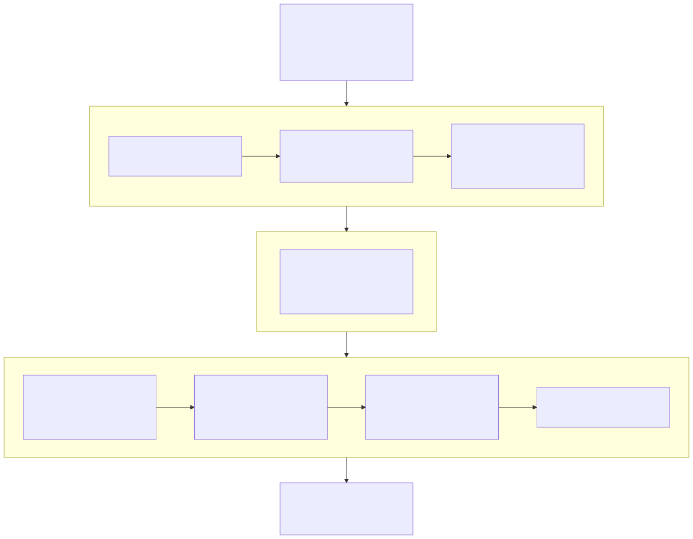
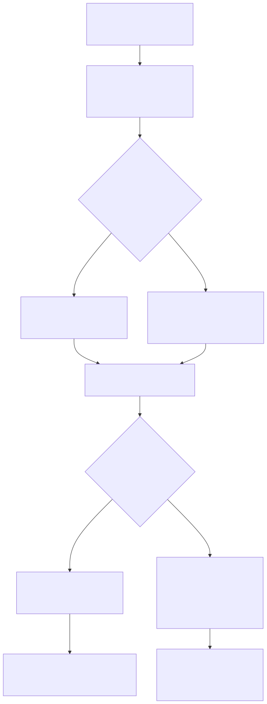
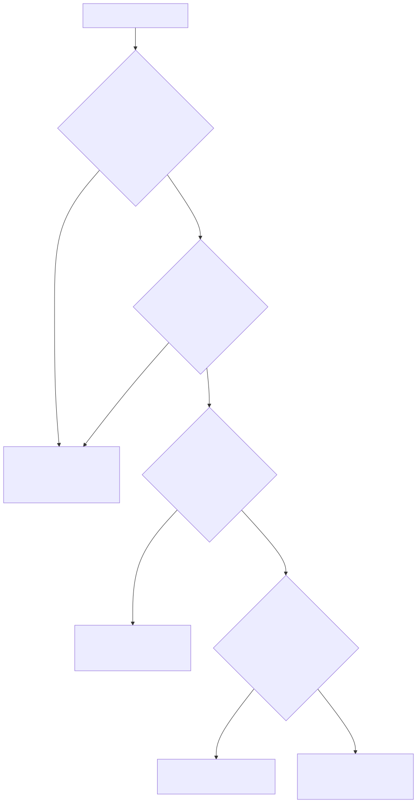

# LambdaJS — Functions, Closures & Scope

> **Last verified against tree:** 2026-08-12 *(initial stamp from git history; §2 span entry and §7 dynamic dispatch re-verified 2026-09-15; §7 tail-call/native-return paragraph and known issue 5 updated for JC24 on 2026-09-15)*

> **Part of the [LambdaJS detailed-design set](JS_00_Overview.md).** This document covers how a JS function becomes a runtime `JsFunction`, the dual native/boxed code emitted for each function, evidence-based parameter-type inference and native eligibility, the capture-analysis phases that decide which variables a closure needs, the scope-environment model that backs mutable capture, the `this`/`arguments`/`new.target` bindings, single-expression inlining, and call-argument frame slots.
>
> **Primary sources:** `lambda/js/js_function.hpp` (`JsFunction`, `JsCallEntry`, `JsConstructEntry`, typed native targets), `lambda/js/js_runtime_function.cpp` (MIR/native/closure factories, capability finalization), `lambda/js/js_runtime.cpp` (call and construct kernels), `lambda/js/js_runtime_state.cpp` (`js_get_this`/`js_set_this`/`js_get_new_target`/`js_build_arguments_object`), `lambda/js/js_mir_function_class_lowering.cpp` (`jm_define_function`, native version, scope-env emit), `lambda/js/js_mir_expression_lowering.cpp` (`jm_create_func_or_closure`, `jm_readback_closure_env`, `jm_should_inline`, dual-version call dispatch), `lambda/js/js_mir_analysis.cpp` (`jm_analyze_captures`), `lambda/js/js_mir_function_collection_class_inference.cpp` (`jm_infer_param_types`), `lambda/js/js_mir_module_batch_lowering.cpp` (phase driver, `jm_callsite_propagate`, scope-env layout), `lambda/js/js_mir_calls_boxing_types.cpp` (`jm_scope_env_mark_and_writeback`).
> **Audience:** engine developers. **Convention:** `file:line` references drift; confirm against symbol names.

---

## 1. Purpose & scope

A JS function compiles to one or two MIR functions and is represented at runtime by a `JsFunction` struct (an `LMD_TYPE_FUNC` tagged pointer sharing Lambda's `Item`/GC model — see [JS_03 — Value Model](JS_03_Value_Model.md)). The compile-time machinery is the back half of the multi-phase pipeline in [JS_01 — Compilation Pipeline](JS_01_Compilation_Pipeline.md): function collection (phase 1.0), capture analysis (phases 1.5–1.7), type inference (1.75–1.78), forward declarations (1.9), and body emission (phase 2, `jm_define_function`). This document covers what those phases compute *about functions and scope* and how the emitted code wires up closures, `this`, and calls. The general expression/statement emission and exception model are in [JS_04 — MIR Lowering](JS_04_MIR_Lowering.md); class methods and constructors layer on top of this and live in [JS_07 — Classes](JS_07_Classes.md); generators/async rewrite the function body into a state machine and are in [JS_08 — Iterators & Generators](JS_08_Iterators_Generators.md) and [JS_09 — Async & Modules](JS_09_Async_Modules.md).

---

## 2. Function objects (`JsFunction`) & the dual code scheme

Per **D6.2.1 and D6.2.2v2**, `JsFunction` (`js_function.hpp`) owns its executable capabilities. `invoke` is the per-callee `[[Call]]` entry; `construct` is the optional, distinct `[[Construct]]` entry. `func_ptr` is only the compiled MIR body. Native functions instead carry a typed `JsNativeTarget` union plus declared `native_call`/`native_construct` bodies and a creation-time adapter policy. `catalog_id`, `.name`, `.length`, flags, intrinsic class, and TypedArray element policy remain metadata or allocation policy; none is interpreted on each call to choose an algorithm. The remaining fields own the closure env, ordinary function properties/prototype, defining module and home realm/class, source text, `with` capture, and bound-function state.

Bound functions store the callable `bound_target`, optional bound receiver, and a traced bound-argument span. Capability finalization assigns the bound call entry and assigns the bound construct entry only when the target is constructable. Call merges the bound arguments and receiver; construction ignores bound `this`, substitutes the target when `newTarget` is the bound wrapper, and forwards explicitly through the common construct kernel.

The typed factories make publication intent explicit: `js_new_function_mir` / `js_new_method_function_mir` / `js_new_closure_mir` create compiled wrappers; `js_new_native_function` and fixed/rest/span/this-span/env-span variants store declared native ABIs; constructor factories add `[[Construct]]`; distinct factories suppress identity sharing when two bindings use one C body. Every factory finalizes capabilities before publication. Realm/context-owned cache keys stabilize repeated lookup of one binding without storing function objects in shared MIR state, satisfying **D5.4.1–D5.4.4**.

Each user function is potentially emitted **twice** by `jm_define_function` (`js_mir_function_class_lowering.cpp:292`):

- a **boxed version** — the body `<fname>_body`, taking `Context*`, the closure env when the function captures, and one boxed `Item` per formal, returning a companion-lane pair (D5.2.1v3); it handles the full dynamic ABI (closure env, `arguments`, dynamic `this`, exceptions) and is the only direct-call target. Beside it `jm_emit_span_entry` emits the C-reachable **span entry** `<fname>`, with the `JsBodyEntry` shape `(callee, this, args, argc, result_home)`: it loads `Context` and the env from the callee, pads missing formals with `undefined`, packs a rest formal (`js_args_rest_array`), calls the body, and forwards a pending result's payload through `Context::mir_companion_slot`. The span entry is the function's finalized body entry (`JsFunction::body`), so the call kernel reaches the body in one hop;
- a **native version** — name `<fname>_n` (`:319`), a flat `MIR_new_func_arr` whose params and return are unboxed `MIR_T_I64`/`MIR_T_D` (`:327`,`:332`). It exists only when the function is *native-eligible* ([§3](#3-parameter-type-inference--native-eligibility)): `has_native_version`, no captures, no non-simple params, `1 ≤ param_count ≤ 16`, and INT/FLOAT params and return (`:301`–`:313`). The native item is registered as a local func (`:338`) so direct call sites can target it.

The native version skips the boxed entry's per-call overhead entirely; the call-site decision between the two is in [§7](#7-call-dispatch-native-vs-boxed-vs-dynamic).

---

## 3. Parameter type inference & native eligibility

Native eligibility is driven by **evidence**, not declared types. `jm_infer_param_types` (`js_mir_function_collection_class_inference.cpp:1954`) first classifies the parameter list: it sets `has_rest_param` and `has_non_simple_params` for rest/default/destructuring/non-identifier params (`:1961`–`:1991`), which disqualify the function from a native version. Functions with 0 or >16 params are left boxed (`:1993`). TypeScript parameter annotations, when present on any param, take priority (`:1997`–`:2046`).

Otherwise it walks the body (`jm_infer_walk`, `:1689`) accumulating a `JsParamEvidence` per parameter (`js_mir_context.hpp:81`): `int_evidence`/`float_evidence`/`string_evidence` counters plus three poison flags — `used_as_container` (param appears as the object in `arr[i]`), `compared_with_non_numeric` (compared via `===` with undefined/null/bool, where native unboxing would erase the type distinction), and `param_reassigned` (target of a plain assignment, so the entry value's type is not trustworthy). Arithmetic with int/float literals and arithmetic operators contribute numeric evidence; comparisons alone do not (`:1744`–`:1761`). A P6 alias pass re-walks the body treating `let x = param` aliases as the parameter so evidence on the alias flows back (`:2074`–`:2133`). Resolution (`:2138`): any poison flag → `ANY`; else `float_evidence > 0` → FLOAT; else int evidence with no string evidence → INT; else `ANY`. BigInt literals anywhere in the body force all params to `ANY` (`:2055`).

Return type comes from `jm_infer_return_type` with a P6 deep re-inference fallback (`js_mir_module_batch_lowering.cpp:3988`–`3998`). Native eligibility is then computed centrally in **phase 1.75** (`:4004`): no captures, `1 ≤ param_count ≤ 16`, no `arguments` use, no non-simple params, and an INT/FLOAT return — computing it here (not lazily in `jm_define_function`) lets callers that invoke a later-defined native function propagate its return type into a `let x = f(…)` variable.

Two later passes adjust eligibility against actual call sites:

- **Phase 1.76 — callsite widening** (`jm_callsite_propagate` → `jm_callsite_scan_node`, `js_mir_module_batch_lowering.cpp:1706`). For every call to a native-eligible function, a literal argument whose type contradicts the inferred param type widens that param to `ANY` and clears `has_native_version` (`:1738`–`:1743`). Any function expression / arrow passed *as a callback argument* also has its native version revoked, since the receiving builtin may pass arbitrary types (`:1748`–`:1764`).
- **Phase 1.77 (P6 narrowing)** and **Phase 1.78 (P4b ctor field propagation)** further refine still-`ANY` params and constructor field types from agreeing call sites (driver at `js_mir_module_batch_lowering.cpp`, phase table in [JS_01 §5](JS_01_Compilation_Pipeline.md)).

---

## 4. Capture analysis (phases 1.5–1.7)

> Capture analysis is the back half of phase 1 in the compile pipeline; the phase ordering, the fixed-point invariants, and the per-phase line references are owned by [JS_01 — Compilation Pipeline §5](JS_01_Compilation_Pipeline.md). This section summarizes what the phases compute about scope; it does not re-document the driver.

**Phase 1.5 — free-variable detection.** `jm_analyze_captures` (`js_mir_analysis.cpp:1644`) collects the function's parameter names, local declarations, and all identifier references in the body (plus references inside default-parameter expressions), then computes `free = refs − params − locals`. A free name is a capture only if it is in the outer scope and is **not** a compile-time module constant — unless a parent function declares a same-named local that shadows the module constant, in which case it is captured and `force_env_capture` is set (`:1696`–`:1718`). Each capture is recorded in `fc->captures[]` as a `JsCaptureEntry` (`js_mir_context.hpp:193`: `name`, `scope_env_slot`, `grandparent_slot`, and `is_let_const`/`is_const`/`is_nfe_binding`/`force_env_capture` flags). Synthetic captures are appended for a named-function-expression self-reference and for the lexical pseudo-variables `_js_this`, `_js_new.target`, and `_js_arguments` when the body needs them (`:1755`–`:1808`) — this is how an arrow inherits its enclosing `this`/`new.target`/`arguments`.

**Phase 1.6 — transitive propagation.** A fixed-point loop (≤10 rounds, `js_mir_module_batch_lowering.cpp:3242`) walks parents and pulls up any capture a child needs that the parent does not itself bind, so a variable referenced only by a deeply nested arrow is captured at every intervening level. Module constants and names the parent binds stop the propagation.

**Phase 1.7 family — scope-env layout.** For each parent, phase 1.7 (`:3445`) computes the **union of the captures of its direct children** as the parent's scope-environment slot list (`scope_env_names[]`, `scope_env_count`). True NFE self-captures are excluded from the shared pool and given dedicated trailing slots so one NFE's self-patch cannot clobber a same-named outer binding (`:3450`–`3517`). Phase 1.7.5 (Track A, `:3636`) builds an analogous **module-level** scope env from top-level `let`/`const` captured by closures, stored in a synthetic `module_fc`. Phase 1.7b (`:3797`) detects parents whose scope env consists entirely of transitive captures already present in the grandparent's env and marks `reuse_parent_env` so they need no allocation of their own. Phase 1.7c (`:3870`) wires grandparent slots and a parent-env-link slot for the mixed case. The output consumed at emit time is `fc->has_scope_env`, the `scope_env_names[]` list, and each capture's resolved `scope_env_slot`.

---

## 5. The scope-environment model

LambdaJS backs mutable closure capture with a **scope environment**: a GC-managed internal allocation whose first half is `Item[]` and whose second half is an owned raw scalar tail. Because JS captures by reference, multiple sibling closures and the parent itself must all see the same storage.

**Allocation at parent entry.** When `fc->has_scope_env`, the parent either **reuses** its incoming env (when `reuse_parent_env` holds and a compile-time re-check confirms no scope var is locally shadowed) or **allocates** a fresh one via `js_alloc_env(scope_env_count)`. `js_alloc_env` returns a `GC_TYPE_JS_ENV`; the collector derives the logical Item count from its header and traces only that half. Each scope-env slot is populated from the current live value — re-read live from the parent's env when the var is itself a capture (`from_env`), so a sibling closure's mutation is visible to later grandchild closures — and the corresponding `JsMirVarEntry` is marked with its env slot/register. The generated function registers owned env registers with its epilogue so pointer-backed int64/float/DateTime values are rebased into the env's scalar tail before the number watermark is restored.

**Closure creation.** `jm_create_func_or_closure` chooses between two strategies for a capturing function. If the parent's scope env is live and every capture has a resolved slot — excluding per-iteration `let`/`const` and NFE self-bindings — it emits `js_new_closure_mir(func, pc, scope_env_reg, slot_count)`, giving the closure a shared env. Otherwise it allocates a copied dense env and fills its resolved capture slots. `js_new_closure_mir` re-homes the scalar slots, allocates a traced `JsFunction`, stores `env`/`env_size`, records the defining module state, and finalizes the call/construct capabilities; the function→env edge and generator maps trace their envs, while suspended async state owns its env without adding a permanent root range.

**Consuming the env (closure entry).** A closure body receives its captured environment in a dedicated `_js_env` register — a MIR function parameter (`js_mir_function_class_lowering.cpp:2320`,`:2328`). At entry the boxed body loads each capture from its env slot into a register and records a `JsMirVarEntry` marked `from_env` with the `env_slot`/`env_reg` (`:2410`–`2416`), so later reads/writes target the env, not a stale copy. Transitive captures that live in a grandparent env are read indirectly through the parent-env-link slot, with a null-link fallback to the local slot (`:2380`–`2406`).

**Write-back (shared env).** When an outer variable that lives in a scope env is reassigned, `jm_scope_env_mark_and_writeback` (`js_mir_calls_boxing_types.cpp:1156`) stores the new (boxed) value into the var's scope-env slot so closures observe it. In module-body context (`current_func_index < 0`) it uses the synthetic `module_fc` and the `module_scope_env_active` flag (`:1173`–`1177`). A `let`/`const` outer-binding guard prevents writing through a shadowed inner binding (`:1188`).

**Read-back (copied env).** A copied dense env is the closure's canonical storage, so after a call to that closure the caller must reload the outer registers. `jm_create_func_or_closure` registers the env in the `last_closure_*` fields (`:11780`–`11788`); a subsequent call emits `jm_readback_closure_env` (`js_mir_expression_lowering.cpp:6078`), which — guarding against a null env — reloads each capture's `var.reg` from its env slot (unboxing INT/FLOAT, leaving BOOL and object types boxed, `:6102`–`6133`) and mirrors the value into any scope-env slot. The env is deliberately **not** reset after read-back: it stays alive with the closure and the read-back is idempotent, so a closure stored and called repeatedly keeps propagating mutations (`:6135`–6145`). Single assignments into a matching capture also write through via `jm_write_last_closure_capture_if_matching` (`js_mir_statement_lowering.cpp:28`). Block and loop boundaries save/reset the `last_closure_*` state so a prior block's closure cannot capture a later block's `let`/`const` initializer (`js_mir_statement_lowering.cpp:5426`, for-loop boundary at `:1473`).

---

## 6. `this`, `arguments` & `new.target`

**`this`.** The dynamic receiver lives in a single GC-rooted global `js_current_this`. `js_get_this` (`js_runtime_state.cpp:706`) returns it, treating the `ITEM_JS_TDZ` sentinel as the "`this` before `super()`" ReferenceError and a zero value as global-this; `js_set_this` (`:742`) installs it. `js_get_lexical_this_binding` (`:723`) returns the binding without the TDZ throw, used when merely saving/restoring caller state across a direct call (`js_mir_expression_lowering.cpp:9643`). Arrow functions do not bind their own `this`: capture analysis adds `_js_this` as a synthetic capture so the arrow reads the enclosing binding lexically (resolved at closure creation via `js_get_lexical_this_binding`, `js_mir_expression_lowering.cpp:11731`). Sloppy-mode `this` coercion is applied by the call machinery before installing the binding, not in `js_get_this`.

**`arguments`.** A function that references `arguments` (`fc->uses_arguments`, `js_mir_context.hpp:238`) materializes an arguments object: the emitter calls `js_set_arguments_info` then `js_build_arguments_object` (`js_runtime_state.cpp:878`) and stores the result into `_js_arguments` (`js_mir_function_class_lowering.cpp:1979`–`1984`). For simple-parameter functions the emitter can alias `arguments[i]` directly to the parameter registers (`jm_activate_arguments_aliasing`, `:14`); generator/async bodies reserve an env slot for the object (`gen_args_slot`, `:666`).

**`new.target`.** The active dynamic-extent binding is stored in the precisely rooted `js_new_target` and read by `js_get_new_target`. Per **D6.2.2v2**, every construct operation supplies `newTarget` directly to `js_construct_value` and the callee's construct entry; the entry scopes the active binding and restores it on success or ERROR. There is no pending/consume side channel. Exact direct MIR calls use `js_set_direct_new_target` only while their body executes. As with `this`, arrows capture `_js_new.target` lexically; child arrows inside a generator/async state machine reload it from the shared env.

---

## 7. Call dispatch: native vs boxed vs dynamic

A call expression resolves its callee statically when possible (`js_mir_expression_lowering.cpp:9367`): a function declaration that is a direct binding, or a `const`-bound function/arrow whose declaration textually precedes the call (`:9375`–9387` — the byte-offset check guards the temporal-dead-zone case). Static resolution is abandoned if a parameter or capture shadows the name (`:9394`–9434`) or the binding is a nested-function hoist (`:9445`). With a resolved `JsFuncCollected`, spread args, rest params, `uses_arguments`, reassignment, async, and zero-arg generators each fall back to the dynamic path (`:9454`–9464`).

For a statically resolved, native-eligible callee the emitter prefers **inlining** (if `jm_should_inline`), then a **native direct call**: it builds an ad-hoc proto over the inferred native param types and emits `MIR_CALL` straight to `<fname>_n`, transpiling each argument as a native value and returning the native result. A resolved-but-not-native callee may take a boxed direct call only when lexical binding identity proves the target; it scopes `this` and active `new.target` around the body. Every observable or dynamic callee enters its stored `invoke` capability. Compiled call sites do so directly behind a layout guard, with `js_call` as the miss arm (JS_04 §8). C callers use `js_call`, or the named ownership adapters `js_call_function`, `js_call_function_into` and `js_call_function_prerooted_args_into`, which only fix `js_call`'s two ownership operands (the result home and the pre-rooted-span fact) and preserve **D5.2.1–D5.3.5** ownership. For an ordinary function `invoke` is `js_call_entry_generic`, an inlined instance of the single call kernel `js_call_kernel` (`js_runtime.cpp`). The kernel pushes the call activation (`this`, `new.target`, callee, private home class, super-`this`, and the `arguments` source span), applies sloppy-`this` coercion, switches module, realm and `with` chain when they differ, and calls the callee's finalized body entry once: the MIR span entry, a native body, or an AST adapter. **AST interpreter calls.** An interpreted call site with plain arguments calls `js_call_from_ast`. When the callee is an ordinary interpreted function in the same module and realm with no `with` chain (`js_call_ast_direct_eligible`), it runs `js_call_ast_direct`, a third kernel instance that omits the steps those facts make unnecessary and calls `js_interp_call_function` directly; otherwise it forwards to `js_call`. `js_interp_call_function` borrows the kernel's activation for the callee, `this` and `new.target` instead of rooting its own copies. Dynamic construction analogously enters `js_construct_value(callee, args, argc, newTarget, resultHome, argsPrerooted)` and rejects a missing construct capability before dispatch.

**Single-expression inlining.** `jm_should_inline` (`js_mir_expression_lowering.cpp:6171`) accepts a native-versioned, capture-free function with simple params (≤4) whose body is exactly one `return` statement. `jm_transpile_inline_native` (`:6189`) then pushes a temporary scope, binds each parameter to its evaluated argument, transpiles the return expression in place, and pops — eliminating the call entirely and returning a native register when the return type is typed.

**No tail-call elimination; native returns are completions.** A `return f(args)` to the running function is an ordinary call on every backend (**JC24**, `vibe/jube/JS_Runtime_Call_Flatten.md` §3.7). Node performs no TCO, and a call rewritten into a jump would skip enclosing `finally` blocks and never reach the JC23 stack guard. The former loop rewrite (`is_tco_eligible`, `tco_label`, and a `tco_count ≤ 1000000` cap that returned 0 when exceeded) was removed on 2026-09-15. A native-version body returns its raw value directly only when nothing must run first; `jm_return_needs_completion_routing` detects an enclosing try/`using` completion context or an open for-of iterator. In that case `jm_transpile_return` boxes the value onto the Item lane and takes the same iterator-close and delayed-completion path as a boxed return, and every native landing converts it back with `jm_native_return_reg`.

---

## 8. Call-argument frame slots

Every call with ≥1 argument needs a contiguous `Item[]`. There is no global argument stack (the `js_args_*` bump stack is retired). The span is a fixed range of slots at the end of the **calling function's own side-root frame** (**D5.3.1**). `jm_transpile_invocation_value` (`js_mir_expression_lowering.cpp`) opens a `JsMirArgStackScope` per call or `new`. `jm_build_args_array` assigns it the next `arg_frame_depth` slots at compile time, so arguments containing calls use disjoint higher slots while sibling calls reuse the same range. `jm_finish_function_frame` patches the base displacement once root coloring has fixed the semantic slot count. A scope zeroes its slots when the expression completes, and every error-lane exit zeroes all active scopes first. `jm_args_are_prerooted` proves the span is exactly the scope's slots, which lets the call pass `args_prerooted = 1`; generators and argument lists that can suspend take the copying path instead. An interpreted call site roots its evaluated arguments in one `RootSpan` and passes them pre-rooted the same way.

---

## Known Issues & Future Improvements

1. **for-of `let`-binding per-iteration capture.** Loop `let`/`const` bindings need a fresh binding per iteration, which is why `jm_create_func_or_closure` refuses the shared scope env when `iteration_depth > 0` and a capture is `let`/`const` (`js_mir_expression_lowering.cpp:11677`). The write-back/read-back path for the *copied* env then carries iteration-boundary hazards: the for-loop and block boundaries explicitly reset `last_closure_*` to stop a stale closure from capturing a later iteration's binding (`js_mir_statement_lowering.cpp:1473`, `:5426`). This is correctness-critical bookkeeping rather than a clean per-iteration-binding model, and is a likely source of subtle stale-capture bugs in for-of bodies.
2. **Fixed 512-capture / 16-name arrays.** The `last_closure_*` parallel arrays are fixed `[512][128]` (`js_mir_context.hpp:426`), but the registration loop only fills the first 16 entries (`js_mir_expression_lowering.cpp:11782`), so closures with >16 captures lose write-back/read-back for the overflow. Several capture-related loops are similarly capped at 16. *Improvement:* size the registration to the array, or grow dynamically.
3. **Arrow-`this` is capture-based, not a binding chain.** Arrows reify `_js_this`/`_js_new.target`/`_js_arguments` as synthetic captures resolved at closure-creation time. This works but means every arrow in a deep nest re-captures and re-stores the lexical receiver; there is no shared `this`-binding object. The runtime accessor `js_get_lexical_this_binding` exists precisely to paper over the TDZ-vs-resolved distinction across the save/restore boundary.
4. **Inliner / native-version type assumptions.** `jm_should_inline` and `jm_transpile_inline_native` assume `param_types`/`return_type` hold for native-versioned functions; a comment at the call site records that a broader call-site widening attempt "caused regressions … Object.defineProperty, Object.seal" and was reverted (`js_mir_expression_lowering.cpp:9621`). Widening inlining beyond native-versioned callees is a known hazard.
5. ~~**TCO is self-recursion only, with a magic iteration cap.**~~ *Resolved 2026-09-15 (JC24):* the loop rewrite was removed. It skipped `finally` for a self-tail call inside `try`, and its 1,000,000-iteration cap returned 0 instead of throwing `RangeError`. No backend eliminates tail calls, and deep recursion ends at the JC23 stack guard. How deep that is depends on frame sizes, which differ by backend and build (S7.11.4).
6. **`with` defeats the function cache and most fast paths.** An active `with` environment bypasses the `func_ptr` → `JsFunction*` cache (`js_runtime_function.cpp:158`) and forces dynamic dispatch (`js_mir_expression_lowering.cpp:9465`), so `with`-scoped functions get neither identity caching nor native/direct calls.

---

## Appendix A — Source map

| File | Responsibility (this doc) |
|---|---|
| `lambda/js/js_function.hpp` | `JsFunction`, call/construct entries, typed native target union, flags. |
| `lambda/js/js_runtime_function.cpp` | Typed MIR/native/closure factories, capability finalization support, function cache. |
| `lambda/js/js_runtime.cpp` | Common call/construct kernels and per-callee entry implementations. |
| `lambda/js/js_runtime_state.cpp` | `js_get_this`/`js_set_this`/lexical-this, `new.target`, `js_build_arguments_object`. |
| `lambda/js/js_mir_function_class_lowering.cpp` | `jm_define_function`, native version, scope-env allocation, arguments/this/new.target emit. |
| `lambda/js/js_mir_expression_lowering.cpp` | `jm_create_func_or_closure`, `jm_readback_closure_env`, `jm_should_inline`/inline, dual-version call emit. |
| `lambda/js/js_mir_analysis.cpp` | `jm_analyze_captures` (free vars, synthetic captures). |
| `lambda/js/js_mir_function_collection_class_inference.cpp` | `jm_infer_param_types` (`JsParamEvidence`), return-type inference. |
| `lambda/js/js_mir_module_batch_lowering.cpp` | Phase driver, transitive propagation, scope-env layout, `jm_callsite_propagate` (widening), native eligibility. |
| `lambda/js/js_mir_calls_boxing_types.cpp` | `jm_scope_env_mark_and_writeback`. |
| `lambda/js/js_mir_context.hpp` | `JsCaptureEntry`, `JsFuncCollected`, `JsParamEvidence`, `last_closure_*`/`scope_env_*` fields. |

## Appendix B — Related documents

- [JS_01 — Compilation Pipeline & Phase Model](JS_01_Compilation_Pipeline.md) — the phase driver; capture-analysis ordering (1.5–1.7) and inference phases (1.75–1.78).
- [JS_03 — Value Model, Memory & GC Interop](JS_03_Value_Model.md) — `Item`, `LMD_TYPE_FUNC`, GC roots, call-argument spans.
- [JS_04 — MIR Lowering, Code Generation & Exceptions](JS_04_MIR_Lowering.md) — statement/expression emission, boxing, the boxed call ABI.
- [JS_06 — Objects, Properties & Prototypes](JS_06_Objects_Properties_Prototypes.md) — `JsFunction.prototype`, real intrinsic properties, function-as-object properties.
- [JS_07 — Classes](JS_07_Classes.md) — constructors, methods, `super`, `this`-before-`super` TDZ.
- [JS_08 — Iterators & Generators](JS_08_Iterators_Generators.md) — generator/async state-machine env slots.
- [JS_15 — Performance & Optimization](JS_15_Performance.md) — native-version/inlining performance rationale.
