# LambdaJS — Objects, Properties & Prototypes

> **Part of the [LambdaJS detailed-design set](JS_00_Overview.md).** This document covers how JS objects are represented (Lambda `Map` + `TypeMap` shape), how property attributes are stored, the `[[Get]]`/`[[Set]]` dispatch pipelines, `Object.defineProperty`, the prototype chain, built-in method dispatch, symbol-keyed properties, and constructor shape pre-allocation.
>
> **Primary sources:** `lambda/js/js_props.{h,cpp}` (ordinary kernels), `lambda/js/js_property_attrs.{h,cpp}` (shape-flag descriptors, accessor pairs, shape clone), `lambda/js/js_class.h` (`JsClass`), `lambda/lambda-data.hpp` / `lambda.h` (`Map`, `TypeMap`, `ShapeEntry`, `Container`, `MapKind`), `lambda/js/js_runtime.cpp` (`js_property_get`/`js_property_set`/prototype walk), `lambda/js/js_globals.cpp` (`Object.defineProperty`), `lambda/js/js_runtime_builtin_registry.cpp` (method specs).
> **Audience:** engine developers. **Convention:** `file:line` references drift; confirm against symbol names.

---

## 1. Purpose & scope

JS objects are Lambda `Map` structs (`LMD_TYPE_MAP`) carrying a `TypeMap` "shape" descriptor; functions (`LMD_TYPE_FUNC`) and arrays (`LMD_TYPE_ARRAY`) keep ordinary properties in side maps. Property semantics (attributes, accessors, prototype lookup, exotic objects) are layered on top of this representation. The shape *layout* and GC handling are shared with [JS_03 — Value Model & Memory](JS_03_Value_Model.md); this document focuses on the property/prototype machinery. Symbol *values* (the `Symbol` builtin) are in [JS_10 — Standard Built-in Library](JS_10_Builtins.md); here we cover only their use as property keys.

The Js59 migration retired string-marker metadata for ordinary property attributes, accessors, and built-in class identity. Descriptor metadata is now `ShapeEntry::flags`, accessors are `JsAccessorPair` slots, and built-in brands use the `TypeMap::js_class` byte. Public properties whose names look like the retired markers (`__nw_`, `__ne_`, `__nc_`, `__get_`, `__set_`, `__class_name__`) are ordinary JS properties. [§11](#11-known-issues--future-improvements) tracks the remaining non-metadata sentinel uses and larger refactor debt.

---

## 2. Object representation

- **`Container`** (`lambda.h:525`) — base header: `TypeId type_id`, then a `union { uint8_t flags; bitfields }`. The bitfields are `is_content:1`, `is_spreadable:1`, `is_heap:1`, `is_data_migrated:1`, and **`map_kind:4`** (the upper four bits — the exotic-object discriminator, [§4](#4-mapkind-dispatch)).
- **`Map`** (`lambda.hpp:368` / mirror `lambda.h:588`) — `Container` header + `void* type` (a `TypeMap*`), `void* data` (packed field-value buffer), `int data_cap`. **`data_cap == 0` means "native-backed"** (the map fronts a `JsTypedArray`/`JsArrayBuffer`/`JsDataView`); `js_upgrade_native_backed_map_for_properties` (`js_runtime.cpp:2880`) migrates such a map to a real shape before storing ordinary properties.
- **`TypeMap`** (`lambda-data.hpp:242`) — the shape: `length` (field count), `byte_size`, the `ShapeEntry* shape` linked list (+ `last` tail), an **inline FNV-1a hash table `field_index[TYPEMAP_HASH_CAPACITY]`** with `TYPEMAP_HASH_CAPACITY == 32`, an optional pool-owned dynamic hash table for larger shapes, a lazily-built slot-indexed `slot_entries[]` (O(1) shaped access), `bool is_private_clone`, and a **`uint8_t js_class`** identity byte.
- **`ShapeEntry`** (`lambda-data.hpp:227`) — per field: `StrView* name`, `Type* type`, `int64_t byte_offset` (offset into `Map.data`), `ShapeEntry* next`, and **`uint8_t flags`** (the `JSPD_*` bits; 0 = JS defaults).
- **`JsAccessorPair`** (`lambda-data.hpp:220`) — `{ uint8_t type_id (= LMD_TYPE_FUNC), Item getter, Item setter }`, stored **directly in the field's data slot** when the shape entry has `JSPD_IS_ACCESSOR`. Because the slot's `type_id` reads `LMD_TYPE_FUNC`, **every reader must test `jspd_is_accessor()` before treating the slot as a value** (`js_property_attrs.h:104`).

The hash table is last-writer-wins and linear-probe (`lambda-data.hpp:280`). Small or stack-only maps use the inline 32-slot table; pool-owned builders call `typemap_hash_build` / `typemap_hash_insert_owned` to grow the active table for larger shapes. The shape chain remains authoritative when a table is unpopulated or saturated.

---

## 3. Property attribute model

The **primary** representation is the `ShapeEntry::flags` byte, inverse-encoded so a `pool_calloc`'d entry is a writable/enumerable/configurable data property by default (`lambda-data.hpp:205`):

| Flag | Value | Meaning |
|---|---|---|
| `JSPD_NON_WRITABLE` | `0x01` | property is read-only |
| `JSPD_NON_ENUMERABLE` | `0x02` | hidden from enumeration |
| `JSPD_NON_CONFIGURABLE` | `0x04` | cannot be redefined/deleted |
| `JSPD_IS_ACCESSOR` | `0x08` | slot holds a `JsAccessorPair*` |
| `JSPD_DELETED` | `0x10` | tombstone (successor to the slot sentinel) |

Inline predicates/mutators (`jspd_is_writable`, `jspd_set_*`, …) are in `js_property_attrs.h:37`. Higher-level helpers in `js_property_attrs.cpp`: `js_find_shape_entry` (resolves the right `TypeMap` for MAP/ARRAY/FUNC then hash+linear lookup, `:61`); `js_typemap_clone_for_mutation` (copy-on-write before any flag change, `:129`); the flag-first query/write helpers `js_props_query_{writable,enumerable,configurable}` (`:294`) and `js_attr_set_{writable,enumerable,configurable}` (`:416`); and the accessor producers `js_install_native_accessor`, `js_define_accessor_partial`, `js_find_accessor_pair_inheritable` (own+proto walk, depth cap 16, `:699`).

Retired metadata strings:
- `__get_X` / `__set_X` are no longer accessor storage. Accessor producers install a `JsAccessorPair` under the visible property name and set `JSPD_IS_ACCESSOR`.
- `__nw_` / `__ne_` / `__nc_` are no longer attribute storage or fallback. Attribute reads and writes use `ShapeEntry::flags`; array descriptor-special indices and `length` are materialized in the companion map before flags are mutated.
- `__class_name__` is no longer built-in brand metadata. Built-in identity is the `TypeMap::js_class` byte; user class identity is constructor/prototype identity.
- Deletes stamp `JSPD_DELETED`; ordinary map/FUNC/ARRAY companion-map slots no longer receive `JS_DELETED_SENTINEL_VAL`. Dense array holes still use the raw sentinel in `Array::items`. Ordinary readers go through `js_own_shape_slot_status`, which canonicalizes `ABSENT`, `DELETED`, `DATA`, and `ACCESSOR`.

The unified read/write descriptor record is `JsPropertyDescriptor` (`js_props.h:307`), used by `js_get_own_property_descriptor`, `js_descriptor_from_object`, and `js_define_own_property_from_descriptor`.

---

## 4. MapKind dispatch

`enum MapKind` (`lambda.h:505`) discriminates exotic objects in the 4-bit `Container.map_kind`:

`PLAIN=0`, `TYPED_ARRAY=1`, `ARRAYBUFFER=2`, `DATAVIEW=3`, `DOM=4`, `CSSOM=5`, `ITERATOR=6`, `PROCESS_ENV=7`, `DOC_PROXY=8`, `PROXY=9`, `FOREIGN_DOC=10`, `ARRAY_PROPS=11`, `CSS_NAMESPACE=12`.

Because `pool_calloc` zeroes the header, **all ordinary objects are `MAP_KIND_PLAIN` for free**. Both `js_property_get` and `js_property_set` use a single fast-path guard — `if (m->map_kind != MAP_KIND_PLAIN && !private_internal_key) { … js_try_exotic_property_get/set … }` (GET `js_runtime.cpp:3466`, SET `:5565`) — then a `switch (map_kind)` routes to the exotic handler (TypedArray, DOM/CSSOM, Proxy traps, process.env, etc.). `js_try_exotic_property_set` returning `false` means "not handled, continue the ordinary path." The exotic handlers themselves are documented in their owning docs ([JS_12 TypedArrays](JS_12_TypedArrays.md), [JS_13 DOM/CSSOM](JS_13_Web_DOM.md), Proxy in [JS_10](JS_10_Builtins.md)).

---

## 5. Property get

`js_property_get(object, key)` (`js_runtime.cpp:3403`).

1. **Key normalization** — symbol keys become `__sym_N` strings via `js_symbol_to_key` (except on a Proxy, where symbols stay raw); private-field `__private_` keys on a non-private host throw TypeError.
2. **MAP branch** (`:3422`):
   - typed-array meta (`BYTES_PER_ELEMENT`) proto walk (depth cap 16);
   - **exotic gate** → `js_try_exotic_property_get` for non-PLAIN kinds;
   - key stringification / `js_to_property_key`;
   - **own lookup + accessor dispatch** via `js_ordinary_get_own` (`js_props.cpp:77`), which delegates storage state to `js_own_shape_slot_status` then dispatches `JSPD_IS_ACCESSOR` pairs with the receiver (setter-only public -> undefined; setter-only private -> TypeError);
   - string-wrapper indexed access + virtual `length` for `JS_CLASS_STRING`;
   - **prototype walk** `js_prototype_lookup_ex` (`:3592`);
   - top-of-chain deletion guard (don't resurrect a deleted Object.prototype builtin);
   - **builtin-method fallback** via `js_map_builtin_fallback_get`: `js_class_id`, `js_lookup_builtin_method`, `.constructor`, and collection methods;
   - else `make_js_undefined()`.
3. **ARRAY / ELEMENT branches** handle index/length/companion-map access, including `JSPD_IS_ACCESSOR` slots on the companion map.

**Prototype walk** `js_prototype_lookup_ex` (`:26343`): per level, FUNC props + Function builtins, ARRAY/ELEMENT delegation, Proxy `get` trap forward (with receiver), MAP own slot via `js_ordinary_get_own`, and class-method dispatch — bounded to **depth 32**. `js_get_implicit_proto` (`:26220`) returns the own `__proto__` slot or synthesizes one from class identity; `js_get_prototype` (`:26165`) special-cases an accessor-redefined `__proto__` and the `Object.create(null)` sentinel.

---

## 6. Property set

`js_property_set(object, key, value)` (`js_runtime.cpp`) is now a thin preflight dispatcher over helper-sized branches.

1. **Dense-array fast path** for an INT key on a plain array.
2. Base checks: null/undefined -> TypeError; private-host check; primitive/symbol base handling.
3. **ARRAY branch** via `js_property_set_array` - `length` resize (honoring the companion-map `length` shape flags), non-numeric keys -> companion map (with inherited-setter walk), numeric-index accessor/non-writable guards from the companion-map digit entry, OrdinarySet proto-walk for inherited index accessors.
4. **MAP branch** via `js_property_set_map` - key stringification; proxy private slots; `__proto__` set -> `js_reflect_set_prototype_of`; **`__frozen__` reject**; **non-writable guard** via `js_prop_attrs_fast_path` (shape flags); **exotic gate** `js_try_exotic_property_set`; **setter dispatch** (proxy `[[Set]]` forward, then `js_ordinary_set_via_accessor` walking own+proto for an `IS_ACCESSOR` pair, then a non-writable inherited-data reject); **data write** - `fn_map_set` for an existing shape entry (clearing `JSPD_DELETED` and preserving enum order for resurrection), else `map_put` with extensible/sealed/frozen checks.
5. **FUNC branch** via `js_property_set_function` - virtual `prototype`/`name`/`length` handling, bound-function restricted properties, inherited setter/non-writable checks, then `properties_map` storage.

The spec-named kernels `js_ordinary_set` / `js_ordinary_set_via_accessor` live in `js_props.cpp:254`.

---

## 7. Object.defineProperty

`js_object_define_property` (`js_globals.cpp`) handles Proxy `[[DefineOwnProperty]]`, typed-array integer-index defines, String-exotic rules, and the non-extensible new-property reject, then calls **`ValidateAndApplyPropertyDescriptor`** — a full ES2020 §9.1.6.3 implementation. The top-level function is now an ordered validation/apply pipeline:

- sets `js_skip_accessor_dispatch` (RAII) so internal writes are `[[DefineOwnProperty]]`, not `[[Set]]`;
- **Array `length`** exotic validation via `js_define_property_validate_array_exotic` (`ToUint32`/`ToNumber` double-conversion, companion-map `length` shape flags, non-configurable-index shrink);
- descriptor object validation via `js_define_property_validate_descriptor_object` (mixed accessor/data -> TypeError; non-callable get/set -> TypeError);
- existing-property state collection via `js_define_property_collect_existing_state`;
- array companion-map index invariants via `js_define_property_validate_array_companion_index`;
- **non-configurable invariant checks** via `js_define_property_validate_nonconfigurable_update` (no config/enumerable change; no data<->accessor conversion; non-writable value/writable change via SameValue `js_object_is`; accessor get/set change) using the flag-first `js_props_obj_query_*` helpers and the live `JsAccessorPair`;
- storage apply via `js_define_property_apply_validated_descriptor` -> `js_descriptor_from_object` -> `js_define_own_property_from_descriptor` (`js_props.cpp`), which clears/sets `IS_ACCESSOR`, writes data via `fn_map_set`, clears `JSPD_DELETED` on resurrection, and mutates attribute flags through `js_attr_set_*`.

---

## 8. Prototype chain & built-in method dispatch

Built-in methods are not stored on every object; they are resolved on demand at the end of the GET path.

- **Class identity** - `TypeMap::js_class` (a 1-byte `JsClass`, `js_class.h:39`) is the typed identity. `js_class_id(Item)` is byte-only for built-in dispatch. `js_class_stamp` clones the TypeMap before stamping.
- **Method specs** — `JsBuiltinMethodSpec { name, len, builtin_id, param_count, display_name }` (`js_runtime_internal.hpp:547`); per-class static tables (e.g. `JS_ARRAY_PROTOTYPE_METHOD_SPECS`). Lookup is a **linear `strncmp` scan** (`js_runtime_builtin_registry.cpp:20`).
- **Resolution** — `js_proto_class_method_dispatch` (`js_runtime.cpp:26316`) and `js_lookup_builtin_method` (`js_runtime_builtin_registry.cpp:1060`) map (class, name) to a singleton `JsFunction` via `js_get_or_create_builtin` (cached by `builtin_id`). Installation (`js_install_builtin_method_specs`) also marks methods non-enumerable.

This registry is the single source of truth for method install/lookup/descriptor synthesis; the broader builtin catalog (which classes, which methods) is in [JS_10 — Standard Built-in Library](JS_10_Builtins.md).

---

## 9. Symbol-as-property-key

A JS Symbol is a **negative INT**: `LMD_TYPE_INT` with value `≤ -(JS_SYMBOL_BASE)`, `JS_SYMBOL_BASE = 1LL << 40` (`js_runtime.h:699`); `js_key_is_symbol` tests this. For storage/lookup, `js_symbol_to_key` (`js_runtime_internal.hpp:663`) maps a symbol to an interned `__sym_N` string (N = decimal id). Well-known symbols use fixed ids (`Symbol.iterator` = `__sym_1`, `toPrimitive` = `__sym_2`, `hasInstance` = `__sym_3`, `toStringTag` = `__sym_4`, …). `js_to_property_key` (`js_runtime_state.cpp:98`) canonicalizes any key.

Enumeration filters internal keys via `js_is_engine_internal_enumeration_key` (`js_globals.cpp:8726`), which skips symbol encodings (`__sym_`), private/brand/internal slots (`__private_`, `__brand_`, `__proto__`, freeze/seal flags, native-backed markers, etc.), so `Object.keys`/for-in exclude symbol-keyed and engine-internal properties. Retired metadata prefixes such as `__get_`, `__set_`, `__nw_`, `__ne_`, `__nc_`, and `__class_name__` are no longer filtered as metadata. `Object.getOwnPropertySymbols` reverses the symbol encoding (`js_internal_symbol_name_to_symbol`, `:8761`).

---

## 10. Constructor shape pre-allocation

To make `new C()` and `this.prop = …` fast, the compiler pre-computes a shape:

- `js_set_class_ctor_shape_metadata` records the constructor's `this.prop` field names as a non-enumerable `__ctor_shape_names__` on the class (`js_runtime.cpp:2526`).
- `js_constructor_create_object_shaped_cached` (`:2566`) captures the freshly-built `TypeMap*` into a per-call-site `void** shape_cache` on first `new`, so subsequent instances from the same call site share the blueprint.
- `js_get_shaped_slot` / `js_set_shaped_slot` (`:2584`) read/write by slot index — O(1) via `tm->slot_entries[]`, O(n) `shape` walk otherwise — writing the raw native value into `Map.data + byte_offset`.

Because instances **share** the cached `TypeMap`, any per-instance attribute change must first `js_typemap_clone_for_mutation` (`js_property_attrs.cpp:129`) to avoid corrupting siblings. The compile-time side of this optimization (the ctor field scan, "A5") is in [JS_07 — Classes](JS_07_Classes.md); the perf rationale is in [JS_15 — Performance](JS_15_Performance.md).

---

## 11. Known Issues & Future Improvements

1. **Dense array hole sentinel remains.** `JS_DELETED_SENTINEL_VAL` (`js_runtime.h:26`) now uses unused tag `0x7E` and marks dense `Array::items` holes, not ordinary descriptor metadata. Ordinary map/FUNC/ARRAY companion-map deletes use `JSPD_DELETED`; readers that may inspect dense array items still preserve a raw-hole check, while ordinary property readers use `js_own_shape_slot_status`.
2. **Property dispatch decomposition status.** The post-Js59 cleanup split MAP built-in fallback out of `js_property_get`, ordinary MAP tombstone/configurable/frozen handling plus ARRAY/FUNC/string-exotic branches out of `js_delete_property`, ARRAY/MAP/FUNC branches out of `js_property_set`, and the validation/apply phases out of `ValidateAndApplyPropertyDescriptor`. Remaining cleanup is now optional polish: move more helper internals into `js_props.cpp` once their contracts are stable.
3. **Linear scans on hot paths.** Built-in method lookup is linear `strncmp` over each spec table (`js_runtime_builtin_registry.cpp:20`). *Improvement:* sort + bsearch (or hash) the spec tables.
4. **TypeMap pointer guard is defensive.** The TypeMap plausibility guard is centralized as `typemap_ptr_is_plausible` (`lambda-data.hpp:283`), so JS property/class readers share one safety net. The `lib_marked.js` corrupt-`type` crash family traced to captured block-scoped lets is fixed in MIR last-closure environment tracking; keep the guard as a defensive invariant check, not as the primary fix for that bug family.

---

## Appendix A — Source map

| File | Responsibility (this doc) |
|---|---|
| `lambda/lambda-data.hpp`, `lambda.h`/`lambda.hpp` | `Container`/`Map`/`TypeMap`/`ShapeEntry`/`JsAccessorPair`, `MapKind`, `JSPD_*`. |
| `lambda/js/js_props.{h,cpp}` | Ordinary kernels (`js_ordinary_get/get_own/set/...`), descriptor record, define-from-descriptor. |
| `lambda/js/js_property_attrs.{h,cpp}` | Shape-flag helpers, accessor install/find, shape clone. |
| `lambda/js/js_class.h` | `JsClass` enum + identity helpers. |
| `lambda/js/js_runtime.cpp` | `js_property_get`/`js_property_set`, `js_map_get_fast`, exotic gates, prototype walk, shaped slots. |
| `lambda/js/js_globals.cpp` | `Object.defineProperty` + `ValidateAndApplyPropertyDescriptor`, enumeration filters. |
| `lambda/js/js_runtime_builtin_registry.cpp` | `JsBuiltinMethodSpec` tables; method install/lookup. |

## Appendix B — Related documents

- [JS_03 — Value Model, Memory & GC Interop](JS_03_Value_Model.md) — `Item`, shape layout, GC, name pool.
- [JS_07 — Classes](JS_07_Classes.md) — constructor shape scan (A5), inheritance, private members.
- [JS_10 — Standard Built-in Library](JS_10_Builtins.md) — `Object`/`Reflect`/`Symbol`/Proxy builtins.
- [JS_12 — TypedArrays, Binary Data & Atomics](JS_12_TypedArrays.md) — `MAP_KIND_TYPED_ARRAY`/etc. exotic gets/sets.
- [JS_13 — Web Platform: DOM, CSSOM, Events & Fetch](JS_13_Web_DOM.md) — `MAP_KIND_DOM`/`CSSOM` exotic dispatch.
- [JS_15 — Performance & Optimization](JS_15_Performance.md) — shape caching, fast paths, the migration's perf goals.
