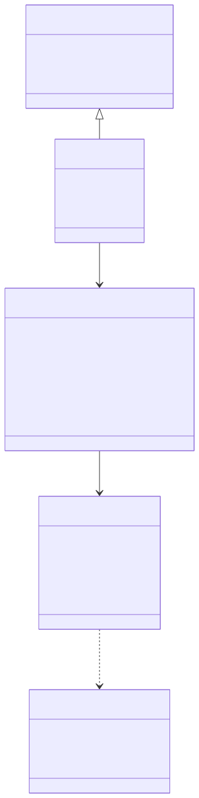
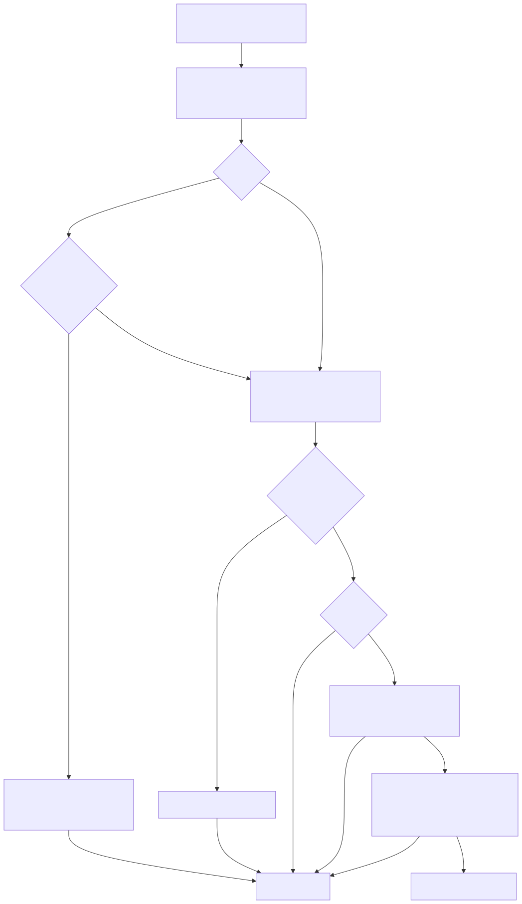
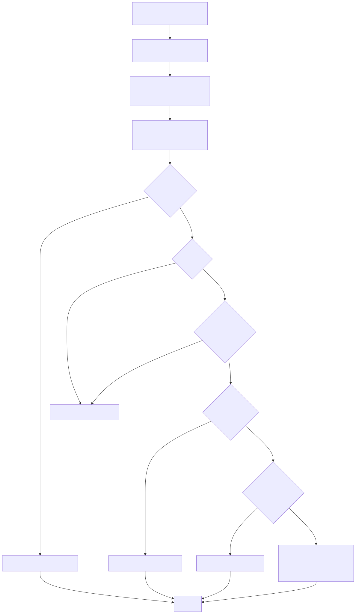

# LambdaJS — Objects, Properties & Prototypes

> **Last verified against tree:** 2026-08-13 *(initial stamp from git history)*

> **Part of the [LambdaJS detailed-design set](JS_00_Overview.md).** This document covers how JS objects are represented (Lambda `Map` + `TypeMap` shape), how property attributes are stored, the `[[Get]]`/`[[Set]]` dispatch pipelines, `Object.defineProperty`, the prototype chain, realm-local intrinsic properties, symbol-keyed properties, and constructor shape pre-allocation.
>
> **Primary sources:** `lambda/js/js_object_meta.{h,cpp}` (immutable class/family metadata and the `JsPropertyOps` table), `lambda/js/js_props.{h,cpp}` (ordinary kernels), `lambda/js/js_property_attrs.{h,cpp}` (shape-flag descriptors, accessor pairs, shape clone), `lambda/js/js_class.h` (class identity helpers), `lambda/lambda-data.hpp` / `lambda.h` (`Map`, `TypeMap`, `ShapeEntry`, `Container`, physical `MapKind`), `lambda/js/js_runtime.cpp` (`js_property_get`/`js_property_set`/prototype walk), `lambda/js/js_globals.cpp` (`Object.defineProperty`), and `js_runtime_builtin_registry.cpp` (intrinsic target/binding installation).
> **Audience:** engine developers. **Convention:** `file:line` references drift; confirm against symbol names.

---

## 1. Purpose & scope

JS objects are Lambda `Map` structs (`LMD_TYPE_MAP`) carrying a `TypeMap` "shape" descriptor; functions (`LMD_TYPE_FUNC`) and arrays (`LMD_TYPE_ARRAY`) keep ordinary properties in side maps. Property semantics (attributes, accessors, prototype lookup, exotic objects) are layered on top of this representation. The shape *layout* and GC handling are shared with [JS_03 — Value Model & Memory](JS_03_Value_Model.md); this document focuses on the property/prototype machinery. Symbol *values* (the `Symbol` builtin) are in [JS_10 — Standard Built-in Library](JS_10_Builtins.md); here we cover only their use as property keys.

The Tune6 object migration applies **D3.4.7**: descriptor metadata is
`ShapeEntry::flags`, accessors are `JsAccessorPair` slots, and built-in brands
resolve through immutable `TypeMap::js_meta` via `js_object_meta(Item)`.
`map_kind` is physical storage information only. Public properties whose names
resemble former markers are ordinary JS properties; private engine names use
NamePool identity rather than spelling prefixes.

---

## 2. Object representation

- **`Container`** (`lambda.h`) — base header plus the physical flags union. `map_kind` remains a four-bit storage/allocation tag; it is not an object classifier.
- **`Map`** (`lambda.hpp` / mirror `lambda.h`) — `Container` header + `void* type` (a valid `TypeMap*` for runtime JS Maps), `void* data` (packed field-value buffer), and `data_cap`. Native engine state is held in typed trailing carrier storage; host state remains in VMaps. `Map.data` therefore retains its TypeMap-described meaning under **D3.4.1/D3.4.5**.
- **`TypeMap`** (`lambda-data.hpp`) — the shape plus its immutable `const JsClassMeta* js_meta` refinement. The metadata is selected before publication and preserved by shape/descriptor transitions under **D3.4.7**; it contains no realm `Item`, GC edge, mutable cache, or context-owned pointer.
- **`ShapeEntry`** (`lambda-data.hpp:227`) — per field: `StrView* name`, `Type* type`, `int64_t byte_offset` (offset into `Map.data`), `ShapeEntry* next`, and **`uint8_t flags`** (the `JSPD_*` bits; 0 = JS defaults).
- **`JsAccessorPair`** (`lambda-data.hpp:220`) — `{ uint8_t type_id (= LMD_TYPE_FUNC), Item getter, Item setter }`, stored **directly in the field's data slot** when the shape entry has `JSPD_IS_ACCESSOR`. Because the slot's `type_id` reads `LMD_TYPE_FUNC`, **every reader must test `jspd_is_accessor()` before treating the slot as a value** (`js_property_attrs.h:104`).

The hash table is last-writer-wins and linear-probe (`lambda-data.hpp:280`). Small or stack-only maps use the inline 32-slot table; pool-owned builders call `typemap_hash_build` / `typemap_hash_insert_owned` to grow the active table for larger shapes. The shape chain remains authoritative when a table is unpopulated or saturated.

---

## 3. Property attribute model

The **primary** representation is the `ShapeEntry::flags` byte, inverse-encoded so a `pool_calloc`'d entry is a writable/enumerable/configurable data property by default (`lambda-data.hpp:205`):

| Flag | Value | Meaning |
|---|---|---|
| `JSPD_NON_WRITABLE` | `0x01` | property is read-only |
| `JSPD_NON_ENUMERABLE` | `0x02` | hidden from enumeration |
| `JSPD_NON_CONFIGURABLE` | `0x04` | cannot be redefined/deleted |
| `JSPD_IS_ACCESSOR` | `0x08` | slot holds a `JsAccessorPair*` |
| `JSPD_DELETED` | `0x10` | tombstone (successor to the slot sentinel) |

Inline predicates/mutators (`jspd_is_writable`, `jspd_set_*`, …) are in `js_property_attrs.h:37`. Higher-level helpers in `js_property_attrs.cpp`: `js_find_shape_entry` (resolves the right `TypeMap` for MAP/ARRAY/FUNC then hash+linear lookup, `:61`); `js_typemap_clone_for_mutation` (copy-on-write before any flag change, `:129`); the flag-first query/write helpers `js_props_query_{writable,enumerable,configurable}` (`:294`) and `js_attr_set_{writable,enumerable,configurable}` (`:416`); and the accessor producers `js_install_native_accessor`, `js_define_accessor_partial`, `js_find_accessor_pair_inheritable` (own+proto walk, depth cap 16, `:699`).

Retired metadata strings:
- `__get_X` / `__set_X` are no longer accessor storage. Accessor producers install a `JsAccessorPair` under the visible property name and set `JSPD_IS_ACCESSOR`.
- `__nw_` / `__ne_` / `__nc_` are no longer attribute storage or fallback. Attribute reads and writes use `ShapeEntry::flags`; array descriptor-special indices and `length` are materialized in the companion map before flags are mutated.
- `__class_name__` is no longer built-in brand metadata. Built-in identity is
  the immutable `TypeMap::js_meta` resolved by `js_object_meta(Item)` under
  **D3.4.7**; user class identity is constructor/prototype identity.
- Deletes stamp `JSPD_DELETED`; ordinary map/FUNC/ARRAY companion-map slots no longer receive `JS_DELETED_SENTINEL_VAL`. Dense array holes still use the raw sentinel in `Array::items`. Ordinary readers go through `js_own_shape_slot_status`, which canonicalizes `ABSENT`, `DELETED`, `DATA`, and `ACCESSOR`.

The unified read/write descriptor record is `JsPropertyDescriptor` (`js_props.h:307`), used by `js_get_own_property_descriptor`, `js_descriptor_from_object`, and `js_define_own_property_from_descriptor`.

---

## 4. MapKind dispatch

`enum MapKind` (`lambda.h`) identifies physical storage/tracing carriers:

`PLAIN=0`, `TYPED_ARRAY=1`, `ARRAYBUFFER=2`, `DATAVIEW=3`, `DOM=4`, `CSSOM=5`, `ITERATOR=6`, `PROCESS_ENV=7`, `DOC_PROXY=8`, `PROXY=9`, `FOREIGN_DOC=10`, `ARRAY_PROPS=11`, `CSS_NAMESPACE=12`.

`js_property_get` and `js_property_set` resolve `js_object_meta(Item)` and
enter the single `JsPropertyOps` table when the metadata supplies one. A
callback may fall through only before observable work; otherwise it returns a
complete result. Physical `map_kind` remains in allocation, tracing,
finalization, and checked payload accessors only. The family-specific behavior
is documented in [JS_12 TypedArrays](JS_12_TypedArrays.md), [JS_13 Web DOM](JS_13_Web_DOM.md), and [JS_10 Builtins](JS_10_Builtins.md).

---

## 5. Property get

`js_property_get(object, key)` (`js_runtime.cpp:3403`).

1. **Key normalization** — symbol keys become `__sym_N` strings via `js_symbol_to_key` (except on a Proxy, where symbols stay raw); private-field `__private_` keys on a non-private host throw TypeError.
2. **MAP branch** (`:3422`):
   - typed-array meta (`BYTES_PER_ELEMENT`) proto walk (depth cap 16);
   - **metadata gate** → the `JsPropertyOps` get callback, if present;
   - key stringification / `js_to_property_key`;
   - **own lookup + accessor dispatch** via `js_ordinary_get_own` (`js_props.cpp:77`), which delegates storage state to `js_own_shape_slot_status` then dispatches `JSPD_IS_ACCESSOR` pairs with the receiver (setter-only public -> undefined; setter-only private -> TypeError);
   - string-wrapper indexed access + virtual `length` for `JS_CLASS_STRING`;
   - **prototype walk** `js_prototype_lookup_ex` (`:3592`);
   - ordinary prototype exhaustion after the last real own property;
   - else `make_js_undefined()`.
3. **ARRAY / ELEMENT branches** handle index/length/companion-map access, including `JSPD_IS_ACCESSOR` slots on the companion map.

**Prototype walk** `js_prototype_lookup_ex`: per level, FUNC properties, ARRAY/ELEMENT delegation, Proxy `get` trap forward (with receiver), and MAP own slots via `js_ordinary_get_own` — bounded to **depth 32**. Builtin methods and accessors participate because realm construction installed them as real properties; a miss never fabricates a callable. `js_get_prototype` resolves explicit override/null and the metadata's realm-relative intrinsic policy; public `__proto__` remains an accessor and is never the internal slot or classifier.

---

## 6. Property set

`js_property_set(object, key, value)` (`js_runtime.cpp`) is now a thin preflight dispatcher over helper-sized branches.

1. **Dense-array fast path** for an INT key on a plain array.
2. Base checks: null/undefined -> TypeError; private-host check; primitive/symbol base handling.
3. **ARRAY branch** via `js_property_set_array` - `length` resize (honoring the companion-map `length` shape flags), non-numeric keys -> companion map (with inherited-setter walk), numeric-index accessor/non-writable guards from the companion-map digit entry, OrdinarySet proto-walk for inherited index accessors.
4. **MAP branch** via `js_property_set_map` - key stringification; proxy private slots; `__proto__` set -> `js_reflect_set_prototype_of`; **`__frozen__` reject**; **non-writable guard** via `js_prop_attrs_fast_path` (shape flags); metadata-selected `JsPropertyOps` set callback; **setter dispatch** through `js_ordinary_set_via_accessor`; then ordinary shaped storage.
5. **FUNC branch** via `js_property_set_function` - virtual `prototype`/`name`/`length` handling, bound-function restricted properties, inherited setter/non-writable checks, then `properties_map` storage.

The spec-named kernels `js_ordinary_set` / `js_ordinary_set_via_accessor` live in `js_props.cpp:254`.

---

## 7. Object.defineProperty

`js_object_define_property` (`js_globals.cpp`) handles Proxy `[[DefineOwnProperty]]`, typed-array integer-index defines, String-exotic rules, and the non-extensible new-property reject, then calls **`ValidateAndApplyPropertyDescriptor`** — a full ES2020 §9.1.6.3 implementation. The top-level function is now an ordered validation/apply pipeline:

- sets `js_skip_accessor_dispatch` (RAII) so internal writes are `[[DefineOwnProperty]]`, not `[[Set]]`;
- **Array `length`** exotic validation via `js_define_property_validate_array_exotic` (`ToUint32`/`ToNumber` double-conversion, companion-map `length` shape flags, non-configurable-index shrink);
- descriptor object validation via `js_define_property_validate_descriptor_object` (mixed accessor/data -> TypeError; non-callable get/set -> TypeError);
- existing-property state collection via `js_define_property_collect_existing_state`;
- array companion-map index invariants via `js_define_property_validate_array_companion_index`;
- **non-configurable invariant checks** via `js_define_property_validate_nonconfigurable_update` (no config/enumerable change; no data<->accessor conversion; non-writable value/writable change via SameValue `js_object_is`; accessor get/set change) using the flag-first `js_props_obj_query_*` helpers and the live `JsAccessorPair`;
- storage apply via `js_define_property_apply_validated_descriptor` -> `js_descriptor_from_object` -> `js_define_own_property_from_descriptor` (`js_props.cpp`), which clears/sets `IS_ACCESSOR`, writes data via `fn_map_set`, clears `JSPD_DELETED` on resurrection, and mutates attribute flags through `js_attr_set_*`.

---

## 8. Prototype chain & realm-local intrinsic properties

Per **D6.2.2v2**, intrinsic methods and accessors are ordinary realm-local function values installed as real properties before publication of their owner object.

- **Class identity** — `js_object_meta(Item)` resolves the immutable
  `TypeMap::js_meta` family/class policy. It does not grant callability or
  select a method body at call time. Class constructors are `JsFunction` values
  with explicit call/construct capability under **D6.2.2v2**.
- **Target specs** — `JsIntrinsicTargetSpec` binds a catalog ID to typed call and optional construct bodies plus compiler metadata. The target is copied into the `JsFunction` when the binding is created; the ID remains diagnostic/catalog metadata.
- **Binding specs** — `JsBuiltinMethodSpec` records owner, NameId spelling, descriptors, formal length, and an explicit identity-alias key. `js_create_builtin_function_from_spec` creates one function per realm binding (or declared alias), finalizes its call/construct capabilities, and caches that identity in context-owned rooted state under **D5.4.1–D5.4.4**.
- **Installation** — `js_install_builtin_method_specs`, `js_install_builtin_accessor_specs`, and owner-binding population store those values on constructors/prototypes/namespaces with the required descriptors. Ordinary `Get` and the normal prototype walk then find them. Replacement, deletion, accessors, extraction, and Proxy traps are therefore observed before `Call`.

The catalog is the single construction-time source of target and binding metadata; it is not a property-miss oracle or a runtime semantic dispatcher. See [JS_10 — Standard Built-in Library](JS_10_Builtins.md).

---

## 9. Symbol-as-property-key

A JS Symbol is a **negative INT**: `LMD_TYPE_INT` with value `≤ -(JS_SYMBOL_BASE)`, `JS_SYMBOL_BASE = 1LL << 40` (`js_runtime.h:699`); `js_key_is_symbol` tests this. For storage/lookup, `js_symbol_to_key` (`js_runtime_internal.hpp:663`) maps a symbol to an interned `__sym_N` string (N = decimal id). Well-known symbols use fixed ids (`Symbol.iterator` = `__sym_1`, `toPrimitive` = `__sym_2`, `hasInstance` = `__sym_3`, `toStringTag` = `__sym_4`, …). `js_to_property_key` (`js_runtime_state.cpp:98`) canonicalizes any key.

Enumeration filters symbol encodings and exact owner-defined engine keys;
private names are recognized by NamePool private identity. Spelling prefixes
such as `__brand_` or `__if_` are not semantic classifiers, so user properties
with those spellings remain ordinary properties. `Object.getOwnPropertySymbols`
reverses the symbol encoding (`js_internal_symbol_name_to_symbol`).

---

## 10. Constructor shape pre-allocation

To make `new C()` and `this.prop = …` fast, the compiler pre-computes a shape:

- `js_set_class_ctor_shape_metadata` records constructor field layout in the
  callable class carrier; it does not publish a class/prototype sentinel.
- `js_constructor_create_object_shaped_cached` (`:2566`) captures the freshly-built `TypeMap*` into a per-call-site `void** shape_cache` on first `new`, so subsequent instances from the same call site share the blueprint.
- `js_get_shaped_slot` / `js_set_shaped_slot` (`:2584`) read/write by slot index — O(1) via `tm->slot_entries[]`, O(n) `shape` walk otherwise — writing the raw native value into `Map.data + byte_offset`.

Because instances **share** the cached `TypeMap`, any per-instance attribute change must first `js_typemap_clone_for_mutation` (`js_property_attrs.cpp:129`) to avoid corrupting siblings. The compile-time side of this optimization (the ctor field scan, "A5") is in [JS_07 — Classes](JS_07_Classes.md); the perf rationale is in [JS_15 — Performance](JS_15_Performance.md).

---

## 11. Known Issues & Future Improvements

1. **Dense array hole sentinel remains.** `JS_DELETED_SENTINEL_VAL` (`js_runtime.h:26`) now uses unused tag `0x7E` and marks dense `Array::items` holes, not ordinary descriptor metadata. Ordinary map/FUNC/ARRAY companion-map deletes use `JSPD_DELETED`; readers that may inspect dense array items still preserve a raw-hole check, while ordinary property readers use `js_own_shape_slot_status`.
2. **Property dispatch decomposition status.** The post-Js59 cleanup split MAP built-in fallback out of `js_property_get`, ordinary MAP tombstone/configurable/frozen handling plus ARRAY/FUNC/string-exotic branches out of `js_delete_property`, ARRAY/MAP/FUNC branches out of `js_property_set`, and the validation/apply phases out of `ValidateAndApplyPropertyDescriptor`. Sparse array accessor hole-fill now lives in the descriptor write kernel (`js_define_own_property_from_descriptor`), so no Js59-specific dispatch cleanup remains.
3. **Catalog construction lookup.** The catalog builds fixed owner/name and ID indexes when the realm's intrinsic bindings are populated. Ordinary property reads never consult those indexes. Further indexing is justified only if release startup profiling shows catalog construction is material.
4. **TypeMap invariant — implemented.** Runtime JS Maps carry valid TypeMaps
  with immutable metadata before publication. Foreign/Input Maps remain at the
  explicit boundary and are not mutated merely by observation. Debug checks and
  the Tune6 census enforce **D3.4.1/D3.4.5/D3.4.7**.

---

## Appendix A — Source map

| File | Responsibility (this doc) |
|---|---|
| `lambda/lambda-data.hpp`, `lambda.h`/`lambda.hpp` | `Container`/`Map`/`TypeMap`/`ShapeEntry`/`JsAccessorPair`, `MapKind`, `JSPD_*`. |
| `lambda/js/js_props.{h,cpp}` | Ordinary kernels (`js_ordinary_get/get_own/set/...`), descriptor record, define-from-descriptor. |
| `lambda/js/js_property_attrs.{h,cpp}` | Shape-flag helpers, accessor install/find, shape clone. |
| `lambda/js/js_class.h` | `JsClass` enum + identity helpers. |
| `lambda/js/js_runtime.cpp` | `js_property_get`/`js_property_set`, `js_map_get_fast`, exotic gates, prototype walk, shaped slots. |
| `lambda/js/js_globals.cpp` | `Object.defineProperty` + `ValidateAndApplyPropertyDescriptor`, enumeration filters. |
| `lambda/js/js_runtime_builtin_registry.cpp` | `JsBuiltinMethodSpec` tables; method install/lookup. |

## Appendix B — Related documents

- [JS_03 — Value Model, Memory & GC Interop](JS_03_Value_Model.md) — `Item`, shape layout, GC, name pool.
- [JS_07 — Classes](JS_07_Classes.md) — constructor shape scan (A5), inheritance, private members.
- [JS_10 — Standard Built-in Library](JS_10_Builtins.md) — `Object`/`Reflect`/`Symbol`/Proxy builtins.
- [JS_12 — TypedArrays, Binary Data & Atomics](JS_12_TypedArrays.md) — `MAP_KIND_TYPED_ARRAY`/etc. exotic gets/sets.
- [JS_13 — Web Platform: DOM, CSSOM, Events & Fetch](JS_13_Web_DOM.md) — `MAP_KIND_DOM`/`CSSOM` exotic dispatch.
- [JS_15 — Performance & Optimization](JS_15_Performance.md) — shape caching, fast paths, the migration's perf goals.
