# LambdaJS — Classes

> **Part of the [LambdaJS detailed-design set](JS_00_Overview.md).** This document covers the class layer that LambdaJS builds *on top of* the ordinary object/property/prototype machinery: how a `class` declaration is collected into a `JsClassEntry` at compile time, how the constructor's `this.prop =` writes drive shape pre-allocation, how methods land on the prototype (vs. static methods on the class object), how `super()`/`super.method()` and `new.target` are wired, how private `#` members are mangled and brand-checked, and how a handful of builtins are subclassable.
>
> **Object representation, property attributes, `[[Get]]`/`[[Set]]`, the prototype walk, and shape pre-allocation storage are owned by [JS_06 — Objects, Properties & Prototypes](JS_06_Objects_Properties_Prototypes.md); this document links to JS_06 rather than restating those mechanics.** A class object is just a `Map` with extra metadata keys; its prototype is just another `Map`.
>
> **Primary sources:** `lambda/js/js_mir_context.hpp` (`JsClassEntry`, `JsClassMethodEntry`, `JsStaticFieldEntry`, `JsInstanceFieldEntry`, the `ctor_prop_*` arrays on `JsFuncCollected`, the collection caps), `lambda/js/js_mir_function_collection_class_inference.cpp` (class collection, `jm_scan_ctor_props`, `jm_find_class`, P7 method resolution), `lambda/js/js_mir_statement_lowering.cpp` (class-object emission, prototype/method install, constructor prologue/body/epilogue, `new C()` lowering), `lambda/js/js_mir_expression_lowering.cpp` (`jm_class_private_name`, `super.x` lowering), `lambda/js/js_runtime.cpp` (`js_constructor_create_object*`, `js_super_call_native`, `js_new_from_class_object`, brand helpers, `new.target`), `lambda/js/js_class.h` (`JsClass`).
> **Audience:** engine developers. **Convention:** `file:line` references drift; confirm against symbol names.

---

## 1. Purpose & scope

ES2022 classes are pure syntactic sugar over constructor functions, prototype objects, and property descriptors — and LambdaJS lowers them that way. A class is **not** a distinct runtime type: the class binding is a `LMD_TYPE_MAP` "class object" carrying metadata keys (`__class_name__`, `__ctor__`, `__instance_proto__`, `__super_ctor__`, `prototype`, `length`), and the instances it produces are ordinary `Map`s whose `__proto__` points at the class's prototype object. `js_super_callee_is_constructor` (`js_runtime.cpp:11410`) treats a MAP as a constructor only when `js_is_class_object_item` recognizes this metadata shape.

The compiler does the heavy lifting in a **pre-pass** (`jm_collect_functions` recursing into class bodies, `js_mir_function_collection_class_inference.cpp:680`) that fills one `JsClassEntry` per class, then emits the class object and all instance/static plumbing during statement lowering. Constructor field inference (the A5 `this.prop` scan, [§3](#3-constructor-compilation)) feeds the shape pre-allocation owned by [JS_06 §10](JS_06_Objects_Properties_Prototypes.md). The earliest typed-AST phase that classifies constructors and derived-ness is in [JS_01 — Compilation Pipeline](JS_01_Compilation_Pipeline.md); generators-as-methods are in [JS_08 — Iterators & Generators](JS_08_Iterators_Generators.md).

---

## 2. Class collection & `JsClassEntry`

`jm_collect_functions` reserves a `JsClassEntry` slot the moment it sees a class node and then recurses into the body so nested functions/classes get collected with the right `parent_index` (`js_mir_function_collection_class_inference.cpp:684`). The struct (`js_mir_context.hpp:313`) holds **fixed-capacity** arrays:

| Field | Cap | Meaning |
|---|---|---|
| `methods[128]` | 128 | every method/accessor/constructor, `method_count` live |
| `static_fields[16]` | 16 | `static x = …` definitions (`JsStaticFieldEntry`, `:294`) |
| `instance_fields[32]` | 32 | non-static field initializers (`JsInstanceFieldEntry`, `:304`) |
| `static_blocks[8]` | 8 | `static { … }` block bodies |
| `constructor` | — | points into `methods[]` or NULL |
| `superclass` | — | resolved parent `JsClassEntry*` (NULL for `extends <expr>` / builtins) |

Each `JsClassMethodEntry` (`:281`) records `name`, the collected `fc` (`JsFuncCollected*`), `param_count`, and the booleans `is_constructor`/`is_static`/`is_getter`/`is_setter`/`computed` plus `key_expr` for computed keys. The collection loop walks the class body's statement list (`:703`): field definitions feed `static_fields[]`/`instance_fields[]` (private names mangled via `jm_class_private_name`, [§6](#6-private-members)), method definitions feed `methods[]`, and `static {}` blocks feed `static_blocks[]`. The constructor's body is fed to `jm_scan_ctor_props` to populate the A5 field arrays ([§3](#3-constructor-compilation), `:871`).

The whole-module caps are `JS_MIR_MAX_COLLECTED_CLASSES == 4096` and `JS_MIR_MAX_COLLECTED_FUNCTIONS == 32768` (`js_mir_context.hpp:128`); overflowing the class array sets `class_collection_overflow_logged` and silently stops collecting. `jm_find_class` (`:1591`) is a linear name scan over `class_entries[]`, and `jm_class_name_is_unique` (`js_mir_statement_lowering.cpp:2168`) guards the static-`new` fast path: a duplicated class name falls back to runtime dispatch.

---

## 3. Constructor compilation

The compiler distinguishes three things that all live on the class object: the **constructor function** (`__ctor__`), the **prototype object** (`prototype`/`__instance_proto__`), and the **shape blueprint** derived from the constructor body.

**A5 ctor field scan.** `jm_scan_ctor_props` (`js_mir_function_collection_class_inference.cpp:1501`) walks the constructor's top-level statements and records each `this.<name> = <rhs>` assignment into the constructor `fc`'s parallel arrays `ctor_prop_ptrs[16]`/`ctor_prop_lens[16]`/`ctor_prop_types[16]`/`ctor_prop_param_idx[16]` (`js_mir_context.hpp:244`). It stops at the first `return`/`throw` (so only unconditional prologue writes count), detects typed-array RHS (`jm_detect_typed_array_new`) and a scalar field type (`jm_detect_ctor_field_type`), and maps a field to a constructor parameter index when the RHS is a bare param identifier (P4b). The cap is 16 distinct fields.

**Prologue — create object + set proto + A5 shape pre-alloc.** For a statically-resolved `new C(args)` (`js_mir_statement_lowering.cpp:2747`), when `ctor_prop_count > 0` the compiler emits `js_constructor_create_object_shaped` (or the `_cached` variant once `shape_cache_ptr` is allocated) passing the ctor-prop name/len arrays — this pre-allocates the instance's `TypeMap` so every `this.prop =` write in the body hits a known slot. `js_constructor_create_object_shaped_cached` (`js_runtime.cpp:2566`) captures the freshly-built `TypeMap*` into the per-class `shape_cache` on first `new`; subsequent instances share the blueprint. The slot read/write helpers `js_get_shaped_slot`/`js_set_shaped_slot` (`:2584`/`:2613`) and the storage mechanics are documented in [JS_06 §10](JS_06_Objects_Properties_Prototypes.md). When the class has instance fields or is a superclass, pre-shaping is skipped and `js_new_object` is used so `js_property_set` manages the shape dynamically. The prologue then writes `__class_name__`, sets `length` (non-writable/non-enumerable), and calls `js_set_prototype(obj, C.prototype)` (`:2845`).

**Body — `this.prop =`.** Inside the body, `this` is a normal receiver; `this.prop = v` lowers to either a shaped-slot write (when the slot was pre-allocated) or `js_property_set`. Instance-field initializers run **before** the constructor body, base-class-first, with `this` bound to the partially-constructed object (`:2850`).

**Epilogue / return rules.** After the constructor call, `js_new_check_constructor_return(obj, result)` (`js_runtime.cpp:7425`) implements the ES rule: if the constructor explicitly returned an object (MAP/ARRAY/ELEMENT/FUNC/OBJECT/VMAP) that value becomes the instance, otherwise the freshly-created `obj` is used (`js_mir_statement_lowering.cpp:3099`). `new.target` is set around the call via `js_set_new_target(C)` (`:3091`) and read inside bodies/arrows via `js_get_new_target` (`js_mir_function_class_lowering.cpp:1140`); a `js_call_function` save/restore of `new.target` keeps it scoped to the construct (`js_runtime.cpp:12056`).

---

## 4. Methods on prototype vs. static methods

The class-object emission (`js_mir_statement_lowering.cpp:4679` for the function-body path, mirrored in the Phase-3 module pre-pass in `js_mir_module_batch_lowering.cpp`) builds two targets:

- **Instance methods** install onto the **prototype object** (`class_proto_obj`, created at `:4801` and exposed as both `prototype` and `__instance_proto__`). The own-instance-method loop (`:5031`) skips `is_constructor`/`is_static`, builds the method function (a closure via `jm_build_closure_for_method` when it captures, else `js_new_method_function`), names it (`get `/`set ` prefix for accessors), marks it a method (`js_mark_method_func`), sets its home class, and installs it with `jm_emit_install_method_or_accessor` — which routes getters/setters into a `JsAccessorPair` and plain methods into a non-enumerable data slot (accessor storage is [JS_06 §3](JS_06_Objects_Properties_Prototypes.md)).
- **Static methods** install directly onto the **class object** `cls_obj` (`:4870`), with inherited static methods copied base-first from the superclass chain (`:4816`) before own statics override them. `static {}` blocks lower via `jm_emit_class_static_block` (`:2128`), executing the block with `this`/the class binding in scope.
- **Static fields** lower via `jm_emit_class_static_field` (`:2044`), evaluating initializers (computed keys allowed) onto the class object.

The prototype carries `__class_name__` and a non-enumerable `constructor` back-pointer (`js_set_default_constructor_property`, `:4954`). Built-in prototype methods (e.g. `Array.prototype.map`) are never copied here — they resolve on demand through the registry described in [JS_06 §8](JS_06_Objects_Properties_Prototypes.md) and [JS_10 — Standard Built-in Library](JS_10_Builtins.md).

---

## 5. Inheritance, `super()` & `super.method()`

When a class has a resolved `superclass` `JsClassEntry`, the prototype's `__proto__` is linked to the parent's `prototype` (`js_set_prototype(last_proto, sp_obj)`, `js_mir_statement_lowering.cpp:4981`), the parent constructor is stored as `__super_ctor__` on the class object, and `js_check_class_prototype_parent`/`js_check_class_heritage_constructor` (`js_runtime.cpp:11472`/`:11480`) enforce IsConstructor and a valid `.prototype`. An `extends <expr>` whose target is not a collected class (a builtin, a member expression, `null`) takes the runtime-resolved heritage path (`:5001`); `extends null` links the prototype to `null` and makes a later `super()` fail IsConstructor.

**`super(args)`** in a derived constructor lowers to `js_super_call_native(callee, this, args, argc)` (`js_runtime.cpp:11522`, emitted at `js_mir_expression_lowering.cpp:6772`):

1. reject non-constructors with a TypeError;
2. if the parent resolves to a typed-array type, or is a builtin that constructs via `[[Construct]]` (`js_builtin_super_constructs_via_construct` lists Boolean/String/Array/Map/Set/WeakMap/WeakSet/ArrayBuffer/SharedArrayBuffer/DataView/Proxy/Promise/Symbol and every TypedArray, `:11433`), route through `js_new_from_class_object` so the instance carries the parent's internal slot and the subclass prototype;
3. otherwise call the parent (`js_call_function`); if it returned a fresh object, `js_object_assign` merges its own enumerable fields onto `this` so the derived body sees populated base fields, and `this` (the receiver the JIT already holds) is returned. A class-object parent (with `__ctor__`) uses `js_super_call_class` (`:11493`).

**`super.method(args)`** fetches the method via `js_super_property_get` walking the home class's prototype parent, then calls it with the current `this` (`js_mir_expression_lowering.cpp:6828`, `:6875`); `super.x`/`super.x =` go through `js_super_property_get`/`js_super_property_set` (`:700`/`:750`).

---

## 6. Private members

A `#`-prefixed name is rewritten to a `__private_` prefix at parse time; `jm_is_private_name` (`js_mir_expression_lowering.cpp:101`) tests for `len > 10 && starts-with "__private_"`. To keep two classes' identically-spelled private names distinct, `jm_class_private_name` (`:105`) re-mangles to `__private_<classIndex>_<suffix>` where `classIndex` is the `JsClassEntry`'s position in `class_entries[]` — so `#x` in class slot 3 becomes `__private_3_x`. Private fields, methods, and static fields all carry this mangled `name`. Enumeration filters `__private_` keys ([JS_06 §9](JS_06_Objects_Properties_Prototypes.md)), so private members never surface in `Object.keys`/for-in.

**Brand checks (partial).** Private access on an object that never went through the class body must throw `TypeError`, not return `undefined`. LambdaJS approximates the ES `[[PrivateBrand]]` with a `__brand_<privateKey>` storage key: `js_private_brand_add` (`js_runtime.cpp:1586`) stamps the brand when a private method/static is installed and when an instance is branded; `js_private_brand_mismatch` (`:3328`) and `js_private_brand_owner` (`:3342`) check it on access, and `js_property_get`/`js_property_set` consult them on `__private_` keys (`:3435`, `:5446`). `js_init_class_instance_fields` re-runs private-field init for derived instances that brand only after `super()` (`js_mir_statement_lowering.cpp:3102`). This is a *partial* model — see [§8](#8-known-issues--future-improvements).

---

## 7. Computed property names

A computed key (`[expr]`) is stored on the relevant entry as `computed = true` with the original `key_expr` AST. At install time the key is evaluated via `jm_transpile_box_item(key_expr)` rather than a string literal — for instance methods (`js_mir_statement_lowering.cpp:5052`), static methods (`:4875`), static fields (`jm_emit_class_static_field`, `:2046`), and instance fields (`:1986`). Because a computed key may itself contain a `yield` when the class sits inside a generator, the compiler spills `proto_obj`/`cls_obj`/`fn_item` across the key evaluation (`jm_gen_spill_save`/`jm_gen_spill_load`, `:5055`). Phase-5C removed the legacy `__get_`/`__set_` key wrapping; getters/setters now install through the accessor-pair path regardless of whether the key is computed.

---

## 8. Subclassable builtins

`class MyArr extends Array {}` cannot start life as a plain `Map` — the instance needs the builtin's internal behaviour (exotic length, primitive slot, typed-array backing) *and* the subclass prototype. Two runtime entry points handle this:

- **`js_constructor_create_object` / `js_constructor_create_object_shaped`** (`js_runtime.cpp:1289`/`:2488`) walk the prototype chain of the constructor's `.prototype` (depth cap 16) looking for a builtin ancestor by `js_class_id`/`__class_name__`, and swap the freshly-created object for `js_array_new`, `js_map_collection_new`, `js_set_collection_new`, `js_weakmap_new`, `js_weakset_new`, `js_regexp_construct`, `js_date_new`, or `js_promise_create` before setting the subclass prototype.
- **`js_new_from_class_object(callee, args, argc)`** (`js_runtime.cpp:1630`) is the general dynamic-`new` path. It sets the pending `new.target` to the subclass, dispatches builtin constructors that yield internal-slot-bearing instances (TypedArray/ArrayBuffer/etc.), then `js_apply_constructed_builtin_prototype` (`:1615`) re-points the result's prototype at `new.target.prototype` so the subclass prototype wins.
- **`js_super_call_native`** (above) funnels `super(args)` for these builtins through `js_new_from_class_object` so derived TypedArray/Boolean/String/Array subclasses get a correctly-initialized backing with the subclass prototype rather than reusing a pre-allocated empty `this`.

The `Array`-extends case also has a compile-time fast path: when the (sole, unique) superclass identifier is `Array`, `new` emits `js_array_new(0)` directly (`js_mir_statement_lowering.cpp:2800`). Exotic get/set behaviour on the resulting instances is [JS_12 — TypedArrays](JS_12_TypedArrays.md).

---

## 9. Compile-time method resolution (P7)

When a variable's static type is a known `JsClassEntry` (tracked on `JsMirVarEntry.class_entry` or a `MCONST_CLASS` module const), `jm_resolve_native_call` (`js_mir_function_collection_class_inference.cpp:132`) can devirtualize `obj.method(args)`: it matches `method` against the class's non-static methods, checks the argument types against the method's declared `param_types` (only `INT`/`FLOAT` monomorphic params qualify), and on success returns the method's `fc` so the call site emits a direct native call (`native_func_item`) instead of a prototype lookup + boxed dispatch. This is the class-layer slice of the broader devirtualization story in [JS_15 — Performance & Optimization](JS_15_Performance.md).

---

## Known Issues & Future Improvements

1. **Class-expression inner-name scope leak.** The immutable inner class-name binding is tracked via `inner_module_var_index` and `alias_name` on `JsClassEntry`, but the lowering for named class *expressions* writes the class object into module-var slots driven by name (`js_mir_statement_lowering.cpp:4718`+) rather than a fully isolated lexical scope; an inner name can be observable beyond the strict class-body scope the spec mandates.
2. **Boolean/String subclass primitive-slot loss.** Subclasses route through the builtin `[[Construct]]` (`js_builtin_super_constructs_via_construct`, `js_runtime.cpp:11448`) to get `[[BooleanData]]`/`[[StringData]]`, but because the instance is then re-prototyped and merged via `js_object_assign`, edge cases where the primitive internal slot must survive `super()`-then-field-init are fragile.
3. **TypedArray subclass species/resize.** `js_super_call_native` builds the backing from `super`'s length/buffer args (`:11530`), but `@@species`-driven resize on subclassed typed arrays is not fully wired through the construct path.
4. **Private brand is partial.** The `__brand_<key>` storage approximation (`js_private_brand_add`/`js_private_brand_mismatch`, `js_runtime.cpp:1586`/`:3328`) is not a true per-class `[[PrivateBrand]]`: it is a string-keyed slot subject to the same internal-key hazards as the rest of the metadata scheme, and the deferred-init dance for derived classes (`js_init_class_instance_fields`) only triggers when `jm_class_has_private_instance_brands` is true.
5. **Fixed method/field caps.** `methods[128]`, `static_fields[16]`, `instance_fields[32]`, `static_blocks[8]`, and `ctor_prop_*[16]` (`js_mir_context.hpp:317`+) are hard limits; a class exceeding any of them silently truncates (e.g. field-definition collection guards `static_field_count < 16` at `js_mir_function_collection_class_inference.cpp:707`). *Improvement:* grow these to dynamic arrays like `JsFuncCollected.captures`.
6. **String-keyed class metadata.** Class identity rides on string keys `__class_name__`/`__ctor__`/`__instance_proto__`/`__super_ctor__`/`__ctor_shape_names__` set via `js_property_set` rather than the typed `TypeMap::js_class` byte; subclassable-builtin detection in `js_constructor_create_object` still does `strncmp` on `__class_name__` (`js_runtime.cpp:1335`+), duplicating the `JsClass` enum that `js_constructor_create_object_shaped` already uses.
7. **Duplicate name forces full deopt.** A class name reused anywhere in the module makes every `new` of *any* same-named class fall back to `js_new_from_class_object` runtime dispatch (`jm_class_name_is_unique`, `js_mir_statement_lowering.cpp:2744`), losing the shaped-object fast path even for the unambiguous call sites.

---

## Appendix A — Source map

| File | Responsibility (this doc) |
|---|---|
| `lambda/js/js_mir_context.hpp` | `JsClassEntry`, `JsClassMethodEntry`, `JsStaticFieldEntry`, `JsInstanceFieldEntry`, `ctor_prop_*` arrays, collection caps. |
| `lambda/js/js_mir_function_collection_class_inference.cpp` | Class collection, `jm_scan_ctor_props` (A5), `jm_find_class`, P7 `jm_resolve_native_call`. |
| `lambda/js/js_mir_statement_lowering.cpp` | Class-object emission, prototype/method/static install, `static {}` blocks, constructor prologue/body/epilogue, `new C()` lowering. |
| `lambda/js/js_mir_module_batch_lowering.cpp` | Phase-3 top-level class pre-pass (mirror of the function-body path). |
| `lambda/js/js_mir_expression_lowering.cpp` | `jm_is_private_name`/`jm_class_private_name`, `super(...)`/`super.x` lowering. |
| `lambda/js/js_runtime.cpp` | `js_constructor_create_object[_shaped[_cached]]`, `js_super_call_native`/`_class`, `js_new_from_class_object`, brand helpers, `js_new_check_constructor_return`, `new.target`. |
| `lambda/js/js_class.h` | `JsClass` enum + identity helpers (shared with JS_06). |

## Appendix B — Related documents

- [JS_01 — Compilation Pipeline](JS_01_Compilation_Pipeline.md) — constructor classification and the collection pre-pass.
- [JS_05 — Functions & Closures](JS_05_Functions_Closures.md) — method functions, closures, `js_new_method_function`, home-class.
- [JS_06 — Objects, Properties & Prototypes](JS_06_Objects_Properties_Prototypes.md) — object/`Map` representation, accessors, prototype walk, shape pre-allocation storage (§10).
- [JS_08 — Iterators & Generators](JS_08_Iterators_Generators.md) — generator/async methods, computed-key yield spilling.
- [JS_10 — Standard Built-in Library](JS_10_Builtins.md) — built-in constructors, prototype-method registry, Proxy.
- [JS_12 — TypedArrays, Binary Data & Atomics](JS_12_TypedArrays.md) — exotic behaviour of subclassed typed arrays.
- [JS_15 — Performance & Optimization](JS_15_Performance.md) — shape caching, P7 devirtualization, fast paths.
