# LambdaJS — Iterators, Generators & Destructuring

> **Part of the [LambdaJS detailed-design set](JS_00_Overview.md).** This document covers the iteration protocol (`GetIterator`/`IteratorStep`/`IteratorClose` and the done sentinel), the lightweight fast-path iterators for arrays/strings/typed-arrays, how `for-of`/`for-in` compile (with per-iteration bindings and IteratorClose), the two-function generator state-machine transform (`yield`, `yield*`), and array/object destructuring with spread/rest.
>
> **Primary sources:** `lambda/js/js_runtime.cpp` (iterator + generator runtime), `lambda/js/js_mir_iterator.cpp` (MIR iterator helpers), `lambda/js/js_mir_function_class_lowering.cpp` (generator state-machine emission), `lambda/js/js_mir_statement_lowering.cpp` (`for-of`/`for-in`), `lambda/js/js_mir_expression_lowering.cpp` (`yield`, destructuring, spread), `lambda/js/js_mir_completion.cpp` (abrupt completions), `lambda/js/js_mir_analysis.cpp` (yield counting, spill slots).
> **Audience:** engine developers. **Convention:** `file:line` references drift; confirm against symbol names.

---

## 1. Purpose & scope

Iteration in LambdaJS is built on a runtime IteratorRecord-style protocol and a compile-time generator transform that turns a generator body into a resumable state machine sharing Lambda's `Item`/GC runtime. Three runtime entry points — `js_get_iterator`, `js_iterator_step`, `js_iterator_close` — are the single ABI through which the compiler drives every iterable, and the MIR side emits calls to them via thin wrappers in `js_mir_iterator.cpp`. Generators reuse this protocol (a generator is its own iterable) but layer a separate `JsGenerator` state machine on top.

This document owns the iterator protocol, the generator state-machine transform, `for-of` compilation, and destructuring/spread. Promises, the microtask/event loop, modules, and `await`-suspension are owned by [JS_09 — Async, Promises & Modules](JS_09_Async_Modules.md); async generators are described here as a generator mechanism, but their `await`-points route through the same suspension machinery JS_09 documents. The underlying value/shape representation used by iterator objects (the `Map` + `map_kind` discriminator) is in [JS_03 — Value Model](JS_03_Value_Model.md) and [JS_06 — Objects, Properties & Prototypes](JS_06_Objects_Properties_Prototypes.md).

---

## 2. Iterator protocol & the done sentinel

The protocol avoids allocating a `{value, done}` object on every step. Instead `js_iterator_step` returns the **value directly**, and signals completion with a unique sentinel: `JS_ITER_DONE_SENTINEL == 0x7F00DEAD00000000ULL` (`js_runtime.h:31`). The high tag byte `0x7F` cannot collide with any real `Item` — null, undefined, false, `0`, or the empty string all have distinct encodings — so callers test `step_result.item == JS_ITER_DONE_SENTINEL` rather than reading a `done` property (`js_runtime.cpp:27726`+). The MIR side encodes this test as a single `MIR_EQ` against the constant in `jm_emit_iterator_done_test` (`js_mir_iterator.cpp:23`).

`js_iterator_step` (`js_runtime.cpp:27726`) dispatches in three layers: (1) the `MAP_KIND_ITERATOR` fast path (§3); (2) legacy property-based synthetic iterators keyed by `__arr__`/`__str__`/`__tarr__` markers; (3) generic iterators — generators via `js_generator_next`, then a cached `__iter_next__` method or a `next` property lookup, validating that the result is an object and reading its `done`/`value`. On any thrown exception it returns the done sentinel so the caller's exception check fires.

The for-await variant uses a parallel path: `js_async_iterator_step_result` (`js_runtime.cpp:26839`) always returns a real `{value, done}` object (wrapping fast-path iterators and generators) so the loop can `await` it before reading `done` via `js_iterator_result_done`/`js_iterator_result_value` (`:26831`).

---

## 3. Fast-path iterators

Arrays, strings, and typed arrays get a lightweight iterator with **no public `next` property and no real shape**: a `Map` whose `map_kind` is `MAP_KIND_ITERATOR` (value 6, `lambda.h:512`) and whose `type` field is a 1-byte sentinel address — `js_array_iter_marker`, `js_string_iter_marker`, or `js_typed_array_iter_marker` (`js_runtime.cpp:27330`). The backing storage is a fixed 24-byte `JsIterData { Item source; int64_t index; int64_t length; }` (`js_runtime.cpp:27458`), allocated outside the GC heap (`MEM_CAT_JS_RUNTIME`) and pointed to by `Map.data`, with `data_cap == sizeof(JsIterData)`. Creation is `js_create_array_iterator` / `js_create_string_iterator` / `js_create_typed_array_iterator` (`:27465`+).

Because the `type` field is not a `TypeMap`, any generic property lookup on these maps would read out of bounds. The codebase short-circuits this in several places: `js_is_generator` returns false immediately for `MAP_KIND_ITERATOR` (`js_runtime.cpp:27310`), `js_iterator_close` treats them as having no `return` method (`:27963`), and `js_get_prototype`-adjacent helpers bail (`:26172`). Stepping reads `JsIterData` directly: the array iterator re-reads the live observable length each step via `js_array_iterator_source_length` (`:27420`, handling arguments-exotic length), the string iterator advances by a full UTF-8 code point with WTF-8/CESU-8 surrogate-pair combining (`:27746`), and the typed-array iterator checks out-of-bounds detach before each read (`:27774`).

`js_get_iterator_impl` (`js_runtime.cpp:27565`) chooses the fast path only when it is safe: for arrays it first consults `js_check_array_sym_iterator` (`:27520`, gated by `g_array_sym_iter_ever_set`) and `js_array_iterator_next_is_default` (`:27411`) — if user code overrode `Array.prototype[Symbol.iterator]` or `%ArrayIteratorPrototype%.next`, it falls back to a property-based array iterator object or calls the user `@@iterator`. Maps/Sets dispatch through `JsCollectionData` to the proper collection-iterator builtin; plain objects and elements look up `__sym_1` (the interned key for `Symbol.iterator`, see JS_06 §9) or a bare `next` method. `js_get_iterator` caches the resolved `next` method as `__iter_next__`; `js_get_iterator_lazy` (`:27718`) skips that caching and is used by destructuring.

---

## 4. for-of / for-in compilation

`jm_transpile_for_of` (`js_mir_statement_lowering.cpp:3557`) handles both `for-of` and `for-in` (discriminated by `node_type`), plus `for await`. The `for-in` branch collects keys eagerly via `js_for_in_keys` and walks them with a liveness re-check (`js_for_in_key_is_live`, `:3895`); the rest of this section covers `for-of`.

The loop obtains its iterator with `jm_emit_get_iterator` (`:3989`) and pushes it onto the `mt->for_of_iterators[32]` stack (`js_mir_context.hpp:375`) so nested loops can be closed by `break`/`continue` to an outer label. It then opens a **synthetic try context** (`mt->try_ctx_stack`, depth-bounded at 16) whose catch target is `l_iter_exc` and whose end target is `l_forit_ret` (`:4087`). This try context is what makes IteratorClose happen on every abrupt exit, implementing ES §13.7.5.13:

- **normal `done`** → branch to `l_end` (no close needed; the iterator reported done);
- **`break`** → `l_break` calls `jm_emit_iterator_close` then falls through (`:4269`);
- **throw from the body** → `l_iter_exc` saves the pending exception, closes the iterator, clears any close-time exception, and re-throws the original (`:4281`);
- **`return` from the body** → `jm_transpile_return` stores into `forit_return_val`/`forit_has_return` and jumps to `l_forit_ret`, which closes the iterator before propagating the return to an outer try or emitting the real `ret` (`:4296`).

Abrupt jumps that skip *over* a for-of (a labeled `break`/`continue` to an enclosing loop) are handled by `jm_emit_close_intervening_iterators` (`js_mir_completion.cpp:30`), which walks `mt->loop_stack` closing each entry's `iterator_to_close` (`js_mir_context.hpp:187`, set at `js_mir_statement_lowering.cpp:4038`).

Each iteration installs a **fresh binding** for a `let`/`const` loop variable. The loop variable register is created anew (not reused) for block-scoped declarations (`:3659`), the per-iteration value is initialized to the `ITEM_JS_TDZ` sentinel until the step value is assigned (`:3680`), and `const` loop variables are tagged so body writes throw. The RHS-during-TDZ rule and per-iteration closure semantics are enforced by the "P19" save/restore of `mt->last_closure_*` around the whole loop (`:3564`, `:4329`) — a closure created in one iteration must not write back into a sibling iteration's env. Inside generators, the iterator and loop variable are additionally registered as env-backed slots (`:4001`) so they survive `yield` suspension, as are `forit_return_val`/`forit_has_return` (`:4060`). If the loop variable is a pattern, the step value is fed to `jm_emit_array_destructure`/`jm_emit_object_destructure` (§7) with an exception check that routes failures to `l_iter_exc` for IteratorClose.

---

## 5. Generator state machines

A generator function compiles to **two functions**: the ordinary callable (which, when invoked, calls `js_generator_create` to allocate a generator object) and a separate state-machine function named `gen_sm_<name>_<n>` with signature `(Item* env, Item input, int64_t state) -> Item` (`js_mir_function_class_lowering.cpp:677`). The state machine returns a 2-element array `[value, next_state]` (built by `js_gen_yield_result`, `js_runtime.cpp:26591`); `next_state == -1` means done.

**Env layout & state dispatch.** All locals, params, captures, `this`, and `arguments` are collected up front and assigned env slots (`jm_collect_body_locals`, `:627`), because a register cannot survive a return-and-resume. The env reserves padding for dynamically allocated loop vars and a 128-slot **spill** region for temporaries that straddle a yield (`:670`). At entry the state machine emits a switch over `state` to the matching `gen_state_labels[k]` (`:752`); the label array is fixed at 64 entries (`js_mir_context.hpp:460`), so the yield count is capped at 63 (`:621`).

**Yield emission.** `jm_transpile_yield` (the `JS_AST_NODE_YIELD_EXPRESSION` case, `js_mir_expression_lowering.cpp:12560`) implements the save/return/resume/reload cycle: it allocates the next state index, **saves every env-backed local** into the env, returns `[value, next_state]`, then emits the resume label `gen_state_labels[next_state]` and **reloads every local** from the env. After reload it re-initializes try-context registers (which are plain registers and do not survive the return, `:12643`) and checks `js_gen_is_return_signal` on the resumed `input` so a `Generator.prototype.return()` arriving at a suspended yield routes through enclosing `finally` blocks and closes any active for-of iterator (`:12671`). The yield expression's own value is the `input` parameter. Sub-expression temporaries that contain a nested yield are preserved across it with `jm_gen_spill_save`/`jm_gen_spill_load` (`js_mir_analysis.cpp:293`), used pervasively in destructuring and member-access lowering.

**Eager param binding.** ES requires parameter destructuring to run synchronously at call time, not on first `.next()`. The transform emits an **implicit param-binding yield** after binding params (`:954`): it saves env-backed params and returns `[undefined, 1]`, so the body proper begins at state 1. `js_generator_create` (`js_runtime.cpp:26684`) then **eagerly runs state 0** at creation time so a destructuring error throws synchronously; if it throws, the generator is marked done immediately.

**Runtime driving.** `js_generator_next` (`js_runtime.cpp:26912`) guards re-entrancy (`executing`), routes an active `yield*` delegate first, then calls the state-machine function and interprets its `[value, next_state]` result, marking done on `next_state < 0`. `js_generator_return` (`:27053`) and `js_generator_throw` inject a return/throw at the suspension point.

**`yield*` delegation.** A `yield*` returns a 3-element marker array `[iterable, resume_state, 1]` from `js_gen_yield_delegate_result` (`:26599`). `js_generator_next` detects the flag, calls `js_get_iterator` on the iterable, stores it as `gen->delegate` with `delegate_resume`, and on each subsequent `.next()` advances the delegate via `js_yield_delegate_next_result` (`:26867`); when the delegate reports done its return value becomes the `yield*` expression's value and the machine resumes at `delegate_resume`.

**Generator pool.** `JsGenerator` records are stored in a fixed array `js_generators[JS_MAX_GENERATORS]` with `JS_MAX_GENERATORS == 4096` (`js_runtime.cpp:26562`); the generator object holds a hidden `__gen_idx` integer into this array (`js_get_generator`, `:26774`). Slots are not recycled until the array is full, at which point the oldest `done` slot is reused.

---

## 6. Async generators

Async generators reuse the entire §5 mechanism: the same two-function transform, the same `JsGenerator` record (with `is_async = true`), and the same `gen_state_labels` dispatch. The difference is purely at the result-wrapping and suspension boundary. When `is_async`, `js_generator_next`/`return`/`throw` wrap their results in Promises: a yielded value goes through `js_async_generator_yield_result` (`js_runtime.cpp:26580`), which resolves the value and `.then()`-maps it into a `{value, done}` result (`js_async_generator_wrap_yield_value`, `:26576`); a done result is wrapped with `js_promise_resolve`. The async-generator prototype installs the async `next`/`return`/`throw` builtins and `Symbol.asyncIterator` (`js_get_generator_shared_proto`, `:26655`; `js_get_async_iterator_proto`, `:26632`).

Inside an async-generator body, `await` is lowered as a *second kind of yield point* in the same state machine — the `JS_AST_NODE_AWAIT_EXPRESSION` case (`js_mir_expression_lowering.cpp:12743`) allocates a state from the same `gen_yield_index` counter, with the await-count folded into the state budget (`:621`, `js_mir_function_class_lowering.cpp:1261`). The actual promise-pending check (`js_async_must_suspend`), the resolved-value fast path (`js_async_get_resolved`), and the microtask resumption are owned by [JS_09 — Async, Promises & Modules](JS_09_Async_Modules.md); this document only notes that an async generator interleaves yield-states and await-states in one machine.

---

## 7. Destructuring & spread

**Array destructuring** — `jm_emit_array_destructure` (`js_mir_expression_lowering.cpp:3539`) follows ES iterator-destructuring exactly. It validates that a rest element is last and has no default (`:3542`), obtains a **lazy** iterator (`js_get_iterator_lazy`, no `next` caching), tracks an `iter_done` flag, and opens a synthetic try context so a thrown target binding triggers IteratorClose. Each element calls `js_iterator_step`; a defaulted target applies its initializer when the step value is undefined; a rest element drains the remainder with `js_iterator_collect_rest` (`js_runtime.cpp:27994`). Crucially, IteratorClose only runs when the iterator is **not yet exhausted** — `jm_emit_iterator_close_on_exception_if_open` (`js_mir_iterator.cpp:60`) checks the `iter_done` flag before calling close, per spec. In a generator, a yield inside any element spills `iterator` and `iter_done` across the suspension and parks the iterator in `gen_active_iterator_slot` so `Generator.prototype.return()` can close it.

**Object destructuring** — `jm_emit_object_destructure` (`:3874`) pre-initializes all target variables to undefined (assignment mode), calls `js_require_object_coercible` on the source, then for each property computes its key (`js_to_property_key` for computed/non-identifier keys), reads it with `js_property_get`, and binds the target. There is no iterator and no IteratorClose — object patterns are plain property reads.

**Object rest** — `{ ...rest }` collects the exclude-key list at compile time into a small `js_alloc_env` buffer and calls `js_object_rest(src, exclude_keys, exclude_count)` (`js_runtime.cpp:26499`). The runtime enumerates keys via `js_reflect_own_keys` (preserving the spec own-property **key order** — integer indices ascending, then string keys in insertion order, then symbols), skips excluded keys, copies only **own enumerable** properties (checking each descriptor's `enumerable` flag), and skips deleted-sentinel values. Strings are handled by index.

**Spread** — in call arguments and array/object literals, spread is materialized by `jm_build_spread_args_array` (`js_mir_function_collection_class_inference.cpp:2744`): it allocates a fresh array and, for each `JS_AST_NODE_SPREAD_ELEMENT`, converts the operand to an array with `js_iterable_to_array` (`js_runtime.cpp:28007` — fast paths for typed arrays, generators, and Map/Set; falls back to the iterator protocol otherwise) and appends each element. Generator spill keeps the accumulating array alive across a yield inside a spread operand (`:2752`).

---

## Known Issues & Future Improvements

1. **Max 64 yield/await states per generator.** `gen_state_labels` is a fixed `[64]` array (`js_mir_context.hpp:460`) and the yield count is clamped to 63 (`js_mir_function_class_lowering.cpp:621`); a generator with more than 63 syntactic yield/await points silently loses resume labels. `jm_transpile_yield` guards this with "returning undefined instead of crashing" when `next_state >= 64` (`js_mir_expression_lowering.cpp:12582`). *Improvement:* size the label array from the pre-scanned count.

2. **Yield-in-destructuring relies on conservative spill heuristics.** Destructuring lowering spills `iterator`/`iter_done` around yields based on `jm_has_yield` subtree scans (`js_mir_expression_lowering.cpp:3634`+), and `jm_count_yields` is acknowledged to **over-count** resume points (`js_mir_function_class_lowering.cpp:1208`), so unused state labels are emitted defensively at the end of the body to avoid dangling-label link crashes. Yields hidden in patterns may also be **under-counted** relative to `jm_count_yields`, which is exactly why the `next_state >= 64` fallback exists.

3. **for-of early-exit `.return()` gaps for fast iterators.** `MAP_KIND_ITERATOR` iterators have no `return` method, so `js_iterator_close` is a no-op for them (`js_runtime.cpp:27963`) — correct for built-ins, but it means a user iterator surfaced through a wrapper that *does* define `return` is only honored on the generic path. IteratorClose is also bounded by the depth-16 synthetic try-context stack (`js_mir_statement_lowering.cpp:4049`); deeper nesting silently skips the close.

4. **Async-generator await modeled as yield.** `await` and `yield` share one state counter and one state-machine function (§6), with the await-suspension semantics living in JS_09. This conflation keeps the transform simple but means the await/yield state budget is shared against the same 63-state cap.

5. **Fixed generator pool, no GC reclamation.** `js_generators[4096]` (`js_runtime.cpp:26562`) never frees a slot; exhaustion only recycles the oldest `done` slot. Long-running programs that create more than 4096 live generators, or churn through them, can collide indices or fail allocation (`js_generator_create` logs "exceeded max generators"). *Improvement:* tie generator records to GC lifetime.

6. **Dual synthetic-iterator schemes.** Both the modern fixed-layout `MAP_KIND_ITERATOR`/`JsIterData` iterators (§3) and a legacy property-based scheme keyed by `__arr__`/`__str__`/`__tarr__`/`__index__` markers coexist in `js_iterator_step` (`js_runtime.cpp:27794`+); the property-based array-iterator *object* (`js_create_array_iterator_object`, `:27479`) is still emitted whenever the array iterator prototype is non-default. Two code paths for the same concept.

---

## Appendix A — Source map

| File | Responsibility (this doc) |
|---|---|
| `lambda/js/js_runtime.cpp` | `js_get_iterator`/`js_iterator_step`/`js_iterator_close`, `JsIterData` + fast-path iterators, `JsGenerator` + `js_generator_create`/`next`/`return`/`throw`, `yield*` delegation, `js_object_rest`, `js_iterable_to_array`, done sentinel. |
| `lambda/js/js_mir_iterator.cpp` | MIR wrappers: `jm_emit_get_iterator(_lazy)`, `jm_emit_iterator_step`, `jm_emit_iterator_done_test`, `jm_emit_iterator_close[_on_exception[_if_open]]`. |
| `lambda/js/js_mir_function_class_lowering.cpp` | Generator/async-generator two-function transform, env layout, state dispatch, eager param-binding yield. |
| `lambda/js/js_mir_statement_lowering.cpp` | `for-of`/`for-in`/`for await` lowering, synthetic try context, per-iteration binding + TDZ, IteratorClose targets. |
| `lambda/js/js_mir_expression_lowering.cpp` | `yield`/`yield*` emission, `await` state point, `jm_emit_array_destructure`/`jm_emit_object_destructure`, object-rest call. |
| `lambda/js/js_mir_completion.cpp` | Abrupt-completion cleanup, `jm_emit_close_intervening_iterators`. |
| `lambda/js/js_mir_analysis.cpp` | `jm_count_yields`, `jm_gen_spill_save`/`load`, `jm_has_yield`. |

## Appendix B — Related documents

- [JS_03 — Value Model, Memory & GC Interop](JS_03_Value_Model.md) — `Map`, `map_kind`, `Item` encoding behind iterator objects and generator results.
- [JS_05 — Functions & Closures](JS_05_Functions_Closures.md) — env/closure capture that generator state machines build on.
- [JS_06 — Objects, Properties & Prototypes](JS_06_Objects_Properties_Prototypes.md) — `MAP_KIND_*` dispatch, `Symbol.iterator` as the `__sym_1` key, prototype walk for iterator prototypes.
- [JS_07 — Classes](JS_07_Classes.md) — generator/async-generator methods on classes.
- [JS_09 — Async, Promises & Modules](JS_09_Async_Modules.md) — `await` suspension, the microtask loop, async-iterator stepping, `for await`.
- [JS_10 — Standard Built-in Library](JS_10_Builtins.md) — `Symbol.iterator`/`Symbol.asyncIterator`, Map/Set iterators, the iterator-prototype builtins.
- [JS_12 — TypedArrays, Binary Data & Atomics](JS_12_TypedArrays.md) — typed-array iteration and out-of-bounds detach checks.
