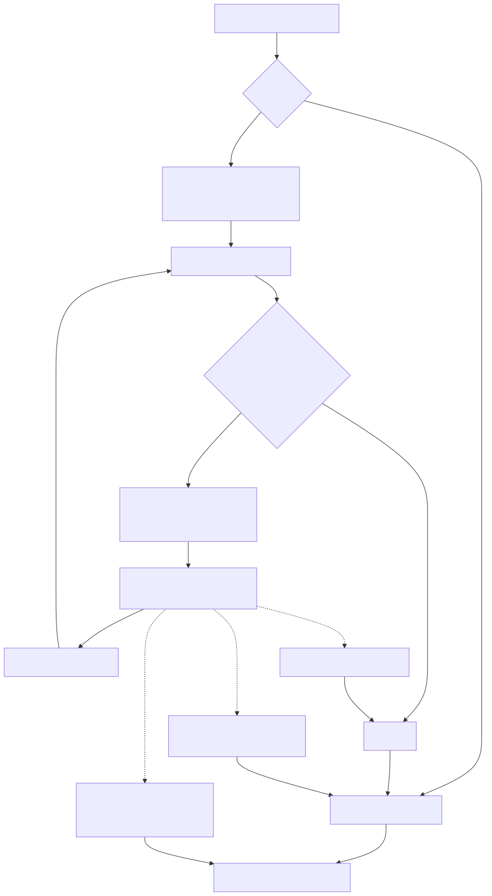
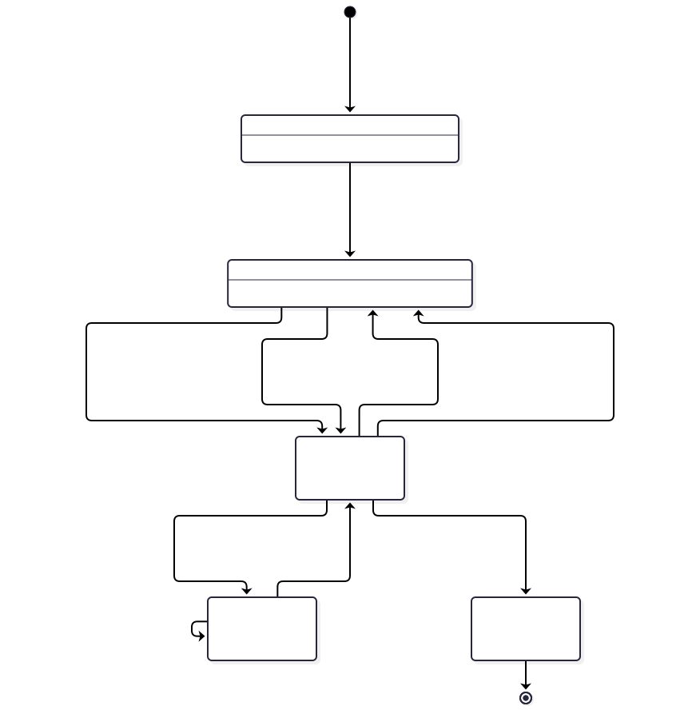
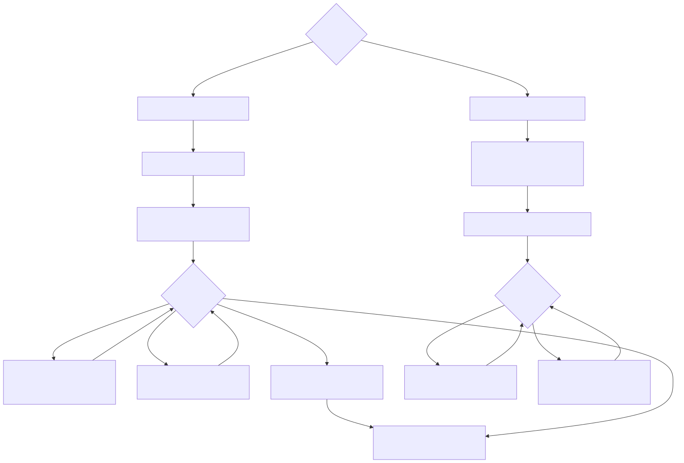

# LambdaJS — Iterators, Generators & Destructuring

> **Last verified against tree:** 2026-10-05

> **Part of the [LambdaJS detailed-design set](JS_00_Overview.md).** This document covers the iteration protocol (`GetIterator`/`IteratorStep`/`IteratorClose` and the done sentinel), the lightweight fast-path iterators for arrays/strings/typed-arrays, how `for-of`/`for-in` compile (with per-iteration bindings and IteratorClose), generator bodies running on stackful activations in both tiers (`yield`, `yield*`, the `next`/`return`/`throw` driver), and array/object destructuring with spread/rest.
>
> **Primary sources:** `lambda/js/js_runtime.cpp` (iterator + generator runtime, `js_gen_park`, the generator driver), `lambda/runtime/activation.{h,cpp}` (the Activation the body runs on), `lambda/js/js_interp.cpp` (interpreted generator body), `lambda/js/js_mir_iterator.cpp` (MIR iterator helpers), `lambda/js/js_mir_function_class_lowering.cpp` (MIR generator body emission), `lambda/js/js_mir_statement_lowering.cpp` (`for-of`/`for-in`), `lambda/js/js_mir_expression_lowering.cpp` (`yield`, destructuring, spread), `lambda/js/js_mir_completion.cpp` (abrupt completions), `lambda/js/js_mir_analysis.cpp` (`jm_can_suspend`).
> **Audience:** engine developers. **Convention:** `file:line` references drift; confirm against symbol names.

---

## 1. Purpose & scope

Iteration in LambdaJS is built on a runtime IteratorRecord-style protocol, and generators on stackful suspension: a generator body, interpreted or compiled, runs once on its own Activation and parks in place at each `yield` (**D5.1.1v3**). No tier transforms the body into a state machine. Three runtime entry points — `js_get_iterator`, `js_iterator_step`, `js_iterator_close` — are the single ABI through which the compiler drives every iterable, and the MIR side emits calls to them via thin wrappers in `js_mir_iterator.cpp`. Generators reuse this protocol (a generator is its own iterable); the `JsGenerator` record on the generator object carries the parked activation and the driver state.

This document owns the iterator protocol, generator parking and driving, `for-of` compilation, and destructuring/spread. Promises, the microtask/event loop, modules, and `await`-suspension are owned by [JS_09 — Async, Promises & Modules](JS_09_Async_Modules.md); async generators are described here as a generator mechanism, but their `await`-points park on the same activation and are resumed by promise reactions as JS_09 documents. The underlying value/shape representation used by iterator objects (the `Map` + `map_kind` discriminator) is in [JS_03 — Value Model](JS_03_Value_Model.md) and [JS_06 — Objects, Properties & Prototypes](JS_06_Objects_Properties_Prototypes.md).

---

## 2. Iterator protocol & the done sentinel

The protocol avoids allocating a `{value, done}` object on every step. Instead `js_iterator_step` returns the **value directly**, and signals completion with a unique sentinel: `JS_ITER_DONE_SENTINEL == 0x7F00DEAD00000000ULL` (`js_runtime.h:31`). The high tag byte `0x7F` cannot collide with any real `Item` — null, undefined, false, `0`, or the empty string all have distinct encodings — so callers test `step_result.item == JS_ITER_DONE_SENTINEL` rather than reading a `done` property (`js_runtime.cpp:27726`+). The MIR side encodes this test as a single `MIR_EQ` against the constant in `jm_emit_iterator_done_test` (`js_mir_iterator.cpp:23`).

`js_iterator_step` (`js_runtime.cpp:27726`) dispatches fixed-layout Map/Set/string/typed-array iterators through `js_is_fixed_layout_iterator` (§3), generators through their typed trailing carrier, and all other iterators through the ordinary `next` property protocol. On any thrown exception it returns the done sentinel so the caller's exception check fires.

The for-await variant uses a parallel path: `js_async_iterator_step_result` (`js_runtime.cpp:26839`) always returns a real `{value, done}` object (wrapping fast-path iterators and generators) so the loop can `await` it before reading `done` via `js_iterator_result_done`/`js_iterator_result_value` (`:26831`).

---

## 3. Fast-path iterators

Arrays, strings, and typed arrays get a lightweight iterator with **no public `next` property**: a valid metadata-qualified Map with physical `MAP_KIND_ITERATOR` storage and a typed trailing `JsIteratorMapCarrier { Map base; JsIterData payload; }` (`js_runtime.cpp:30549`). `JsIterData { Item source; int64_t index; int64_t length; }` is precisely traced by the iterator carrier hook; it is not stored in `Map.data` and no fake TypeMap marker is used. Creation is `js_create_array_iterator` / `js_create_string_iterator` / `js_create_typed_array_iterator` (`:30565`+).

The fixed-layout helper is used wherever the payload layout matters; generic prototype/property APIs see a valid TypeMap and therefore do not dereference `Map.data` as iterator state. Stepping reads the trailing `JsIterData` directly: the array iterator re-reads the live observable length each step via `js_array_iterator_source_length`, the string iterator advances by a full UTF-8 code point with WTF-8/CESU-8 surrogate-pair combining, and the typed-array iterator checks out-of-bounds detach before each read.

`js_get_iterator_impl` (`js_runtime.cpp:27565`) chooses the fast path only when it is safe: for arrays it first consults `js_check_array_sym_iterator` (`:27520`, gated by `g_array_sym_iter_ever_set`) and `js_array_iterator_next_is_default` (`:27411`) — if user code overrode `Array.prototype[Symbol.iterator]` or `%ArrayIteratorPrototype%.next`, it falls back to a property-based array iterator object or calls the user `@@iterator`. Maps/Sets dispatch through `JsCollectionData` to the proper collection-iterator builtin; plain objects and elements look up the cached direct `Symbol.iterator` value through the JS Symbol property route (see JS_06 §9) or a bare `next` method. `js_get_iterator` caches the resolved `next` method as `__iter_next__`; `js_get_iterator_lazy` (`:27718`) skips that caching and is used by destructuring.

---

## 4. for-of / for-in compilation

`jm_transpile_for_of` (`js_mir_statement_lowering.cpp:2186`) handles both `for-of` and `for-in` (discriminated by `node_type`), plus `for await`. The `for-in` branch collects keys eagerly via `js_for_in_keys` and walks them with a liveness re-check (`js_for_in_key_is_live`, `:2455`); the rest of this section covers `for-of`.

The loop obtains its iterator with `jm_emit_get_iterator` (`:2502`) and pushes it onto the `mt->for_of_iterators` stack (a growable `ArrayList`, `js_mir_context.hpp:549`) so nested loops can be closed by `break`/`continue` to an outer label. It then opens a **synthetic try context** (`mt->try_ctx_stack`, also a growable `ArrayList`) whose catch target is `l_iter_error` and whose end target is `l_forit_ret` (`:2579`). This try context is what makes IteratorClose happen on every abrupt exit, implementing ES §13.7.5.13:

- **normal `done`** → branch to `l_end` (no close needed; the iterator reported done);
- **`break`** → `l_break` pops the synthetic context and calls `jm_emit_loop_iterator_close_checked` (`:2664`), so a failing `return()` is not mistaken for a body exception;
- **throw from the body** → `l_iter_error` saves the routed ERROR Item, closes the iterator, preserves the original payload across any close-time failure, and re-throws it (`:2685`);
- **`return` from the body** → `jm_transpile_return` stores into `forit_return_val`/`forit_has_return` and jumps to `l_forit_ret`, which closes the iterator before propagating the return to an outer try or emitting the real `ret` (`:2725`).

Abrupt jumps that skip *over* a for-of (a labeled `break`/`continue` to an enclosing loop) are handled by `jm_emit_close_intervening_iterators` (`js_mir_completion.cpp:521`), which walks the loop-label stack closing each entry's `iterator_to_close` (`js_mir_context.hpp:169`, set at `js_mir_statement_lowering.cpp:2538`).

Each iteration installs a **fresh binding** for a `let`/`const` loop variable. The loop variable register is created anew (not reused) for block-scoped declarations (`:2287`), the per-iteration value is initialized to the `ITEM_JS_TDZ` sentinel until the step value is assigned (`:2311`), and `const` loop variables are tagged so body writes throw. The RHS-during-TDZ rule and per-iteration closure semantics are enforced by the "P19" save/rollback of the last-closure checkpoint (`jm_closure_checkpoint_save`/`jm_closure_checkpoint_rollback`) around the whole loop (`:2194`, `:2761`) — a closure created in one iteration must not write back into a sibling iteration's env. Inside a generator or async body, the iterator and loop variable are homed in env slots taken from the body layout's dynamic region (`js_mir_statement_lowering.cpp:2518`), as are `forit_return_val`/`forit_has_return` (`:2567`), like every other local of a resumable body; nothing is saved or reloaded around a `yield`, because the body parks with its registers and frame intact (§5). If the loop variable is a pattern, the step value is fed to `jm_emit_array_destructure`/`jm_emit_object_destructure` (§7) with an exception check that routes failures to `l_iter_error` for IteratorClose.

---

## 5. Generator bodies on activations

A generator body runs **once**, on a stackful Activation of its own (`lambda/runtime/activation.h`), and parks in place at every `yield`: its native frames, registers, try state and `with` scopes are all still live when it resumes (**D5.1.1v3**; Runtime_Async RA1). This holds in both tiers. There is no state machine, resume-state table, dispatcher, env spill or `[value, state]` marker array in either; the body hands its driver a bare payload when it parks and finishes by returning its value, or its throw as an error Item.

**The record.** The generator object is a GC-owned Map carrier (`JsGeneratorMapCarrier`, `MAP_KIND_GENERATOR`) whose trailing `JsGenerator` (= `JsGeneratorStateRecord`, `js_runtime_state.hpp:643`) extends `JsSuspendedActivation` (`:617`). The common part holds the weakly owned `activation`, the `body` entry that activation runs, the creation-time `with` chain, and the interpreter's environments; the generator tail holds `done`/`started`/`executing`/`is_async`, the `private_home_class` of the creating method, and the active `yield*` `delegate`. `js_generator_map_gc_trace` traces the parked activation's root segment through the carrier, and `js_generator_map_heap_destroy` abandons it when an unfinished generator is collected: the stack is released and no code on it runs again, so a collected generator does not run its `finally` (Runtime_Async RA7). `js_generator_create_current` (`js_runtime.cpp:28637`) picks the body entry: `js_interp_generator_body` (`js_interp.cpp:6117`) for an interpreted function, `js_mir_state_body` (`js_runtime.cpp:262`) for a compiled one.

**Compiled body.** A MIR generator still compiles to two functions: the callable, which builds the body's env (`jm_initialize_resumable_env`) and calls `js_generator_create_mir` (`js_mir_function_class_lowering.cpp:2080`), and a body function named `gen_sm_<name>_<n>` (`jm_create_resumable_state_machine`, `:1130`; emitted from `:1422`). The body keeps the `(ctx, env, input, state)` signature, but `js_mir_state_body` always passes state 0 and enters it once. Locals, params, captures, `this` and `arguments` are homed in env slots laid out by `jm_resumable_layout` (`:1107`) — captures, params, locals, `this`, `arguments`, a 32-slot dynamic region for loop bindings, then the active-iterator slot last. The env is the body's lexical storage, not a spill area; values that live only in registers across a `yield` are kept by the emitter's ordinary root write-back, because a park is just a may-GC call.

**Yield emission.** The `AST_NODE_YIELD` case (`js_mir_expression_lowering.cpp:10720`) evaluates the argument and emits one call, `js_gen_park(value, JS_GEN_PARK_YIELD)` (or `JS_GEN_PARK_DELEGATE` for `yield*`); the call returns the next resume input, which is the yield expression's value. After it the lowering checks `js_gen_is_return_signal` — a `Generator.prototype.return()` arriving at the parked yield closes any iterator published in the active-iterator slot and routes through enclosing `finally` blocks as a delayed return — and `js_gen_is_throw_signal`, which becomes an ordinary throw completion. The interpreter's `AST_NODE_YIELD` evaluator (`js_interp.cpp:3840`) makes the same call, and `js_interp_resume_completion` decodes the same two signals.

**Parking.** `js_gen_park` (`js_runtime.cpp:28615`) finds the record through `activation_user(activation_current())`, records the park kind in `gen->state` (`JS_GEN_PARK_YIELD/AWAIT/DELEGATE`, `js_runtime.h:1166`) and calls `activation_suspend` with the payload. For an await it first resolves the value to a promise; for a `yield*` it obtains the iterator (`js_get_async_iterator` for an async generator, otherwise `js_get_iterator`), installs it as `gen->delegate`, and parks with no payload — a failure to obtain the iterator throws at the `yield*` without parking.

**Eager param binding.** ES requires parameter binding (FunctionDeclarationInstantiation) to run at call time, not on the first `.next()`. A compiled body binds its params and then parks once on an implicit `js_gen_park(undefined, JS_GEN_PARK_YIELD)` (`js_mir_function_class_lowering.cpp:1536`); `js_generator_create_current` steps the new activation to that park at creation, so a destructuring error throws synchronously and marks the generator done. An interpreted generator binds its parameters in `js_interp_create_generator` before the generator object exists (`js_interp_prepare_suspended_activation`), so its first activation step begins at the body.

**Runtime driving.** `js_generator_next` (`js_runtime.cpp:29015`) is the one driver for both tiers. It guards re-entrancy (`executing`), advances an active `yield*` delegate first (below), then resumes the body through `js_generator_step` (`:28596`), which makes the generator's `private_home_class` current and calls `js_suspended_activation_step` (`:232`). That step creates the activation on first use, resumes it with the input, re-homes a wide scalar the body handed over (`scalar_storage_read`) before the activation's number segment can be compacted or released (**D5.1.3**), and destroys a finished activation at once; a native fault inside the body (stack exhaustion) is caught at the activation's own boundary and surfaces as a RangeError (**D6.3.3v2**). The driver then reads the ActivationStatus and the park kind and builds the iterator result itself: done → `{value, done: true}` (unwrapping a return signal) or the error; a `yield` park → `{value, done: false}`; a `yield*` park → it immediately takes the first delegated step; an await park (async generators, §6) → it waits on the promise. `js_generator_return` (`:29161`) and `js_generator_throw` (`:29220`) never resume the body directly: once started, they resume it **through `next`** with `js_gen_return_signal(value)` or `js_gen_throw_signal(error)`, so the parked yield observes the abrupt completion and enclosing `finally`/`catch` run.

**Ambient state across a park.** Everything LIFO with the native stack switches with the activation. The core swap covers the side-stack watermarks, stack bounds, recovery chain, current file and module state; the JS ambient hook (`JsAmbient`, `js_runtime_state.cpp:24`) adds the call-activation chain, the `with` chain, the active module namespace and the per-call flags (strict mode, private-field initialization, …). A body's entry copies its call facts onto its own stack (`JsOwnedCallActivation`, `js_runtime_state.hpp:934`), so a later resume never reads the call chain of whichever turn first resumed it; it enters its creation-time `with` chain once (`js_with_activation_enter`) for the body's lifetime. Since a park is an ordinary call, generator definitions promote and hand off loops like any other (**D8.1.1v16**; JS_09 §5 "Tiering").

**`yield*` delegation.** Delegation stays in the driver. After a `JS_GEN_PARK_DELEGATE` park, each `next(input)` advances `gen->delegate` by one step via `js_yield_delegate_next_result` (`:28887`) and returns the delegate's result without resuming the body; when the delegate reports done, the driver clears it and resumes the parked `yield*` with the delegate's return value. `return()`/`throw()` forward to the delegate's `return`/`throw` (`js_generator_delegate_abrupt_call`) and resume the parked `yield*` with the delegate's completion — as a return signal for `return()`; a delegate protocol error resumes it with a throw signal (`js_generator_resume_after_delegate_error`).

---

## 6. Async generators

Async generators are the §5 mechanism with `is_async = true`: the same carrier, the same activation, the same `js_gen_park` call. The difference is at the result-wrapping boundary and in the extra await park. When `is_async`, `js_generator_next`/`return`/`throw` return Promises: a yielded value goes through `js_async_generator_yield_result` (`js_runtime.cpp:28459`), which resolves the value and `.then()`-maps it into a `{value, done}` result (`js_async_generator_wrap_yield_value`, `:28456`); a done result is wrapped with `js_promise_resolve`, an error with `js_promise_reject`. A delegated step is awaited before its `done`/`value` are read (`js_async_generator_await_delegate_step`, `:28966`). The async-generator prototype installs the async `next`/`return`/`throw` builtins and `Symbol.asyncIterator` (`js_get_generator_shared_proto`, `:28556`; `js_get_async_iterator_proto`, `:28527`).

Inside an async-generator body, `await` parks the same activation with `js_gen_park(value, JS_GEN_PARK_AWAIT)` — from `jm_emit_await_value_reg` in MIR (`js_mir_statement_lowering.cpp:2141`, which emits `js_await_park` instead for a plain async function) and from `js_interp_await_value` in the interpreter (`js_interp.cpp:192`). The park kind is what lets the driver tell an await from a yield: on an await park, `js_async_generator_continue_after_await` (`js_runtime.cpp:28995`) subscribes `js_generator_next`/`js_generator_throw`, bound to the generator, to the awaited promise, so the reaction job resumes the body with the value or, through `js_generator_throw`, with a throw signal; the interpreter decodes that signal at the await into an explicit throw completion (`js_interp_resume_completion`, **D8.4.3v2**). The awaited value is resolved and parked on unconditionally, so even a settled value resumes on a later promise job, as ECMA-262 Await requires; microtask ordering is owned by [JS_09 — Async, Promises & Modules](JS_09_Async_Modules.md).

---

## 7. Destructuring & spread

**Array destructuring** — `jm_emit_array_destructure` (`js_mir_expression_lowering.cpp:6459`) follows ES iterator-destructuring exactly. It validates that a rest element is last and has no default (`:6462`), obtains a **lazy** iterator (`js_get_iterator_lazy`, no `next` caching), tracks an `iter_done` flag, and opens a synthetic try context so a thrown target binding triggers IteratorClose. Each element calls `js_iterator_step`; a defaulted target applies its initializer when the step value is undefined; a rest element drains the remainder with `js_iterator_collect_rest` (`js_runtime.cpp:29918`). Crucially, IteratorClose only runs when the iterator is **not yet exhausted** — `jm_emit_iterator_close_on_error_lane_if_open` (`js_mir_iterator.cpp:116`) checks the `iter_done` flag before calling close, per spec. In a generator, `iterator` and `iter_done` are ordinary values across a `yield` inside an element (the body parks with them live, §5); the one generator-specific step is that a target which can suspend (`jm_can_suspend`, `js_mir_analysis.cpp:191`) is bracketed by `jm_set_active_iterator` (`js_mir_expression_lowering.cpp:6119`), which publishes the iterator in the body's active-iterator env slot. That slot is kept on purpose, not a spill: a `Generator.prototype.return()` delivered at that yield closes the iterator through it, both at the yield site and in `js_generator_return`, which reads the last env slot.

**Object destructuring** — `jm_emit_object_destructure` (`:6643`) pre-initializes all target variables to undefined (assignment mode), calls `js_require_object_coercible` on the source, then for each property computes its key (`js_to_property_key` for computed/non-identifier keys), reads it with `js_property_get`, and binds the target. There is no iterator and no IteratorClose — object patterns are plain property reads.

**Object rest** — `{ ...rest }` collects the exclude-key list at compile time into a small `js_alloc_env` buffer and calls `js_object_rest(src, exclude_keys, exclude_count)` (`js_runtime.cpp:28350`). The runtime enumerates keys via `js_reflect_own_keys` (preserving the spec own-property **key order** — integer indices ascending, then string keys in insertion order, then symbols), skips excluded keys, copies only **own enumerable** properties (checking each descriptor's `enumerable` flag), and skips deleted-sentinel values. Strings are handled by index.

**Spread** — in call arguments and array/object literals, spread is materialized by `jm_build_spread_args_array` (`js_mir_function_collection_class_inference.cpp:2513`): it allocates a fresh array and, for each `AST_NODE_SPREAD` argument, converts the operand to an array with `js_iterable_to_array` (`js_runtime.cpp:29935` — fast paths for typed arrays, generators, and Map/Set; falls back to the iterator protocol otherwise) and appends each element. A yield inside a spread operand needs nothing special: the accumulating array is a live register across an ordinary may-GC call, kept by the emitter's root write-back.

---

## Known Issues & Future Improvements

1. ~~**Max 64 yield/await states per generator.**~~ Resolved 2026-10-05 (Runtime_Async P4): there are no resume labels or state budget; a body parks at any number of `yield`/`await` points.

2. ~~**Yield-in-destructuring relies on conservative spill heuristics.**~~ Resolved 2026-10-05 (Runtime_Async P4): the expression spills (`jm_gen_spill_*`), the yield/await counting and the defensive unused labels are deleted; only the active-iterator env slot remains (§7).

3. **for-of early-exit `.return()` gaps for fixed-layout iterators.** Built-in fixed-layout iterators have no `return` method, so `js_iterator_close` is a no-op for them — correct for built-ins, but a user iterator is honored through the generic property path. (The former depth-16 bound on the synthetic try-context stack is gone: `try_ctx_stack` is a growable `ArrayList`.)

4. ~~**Async-generator await modeled as yield.**~~ Resolved 2026-10-05: an await and a yield are two park kinds (`JS_GEN_PARK_AWAIT`/`JS_GEN_PARK_YIELD`) on one activation, with no shared state budget (§6).

5. ~~**Fixed generator pool, no GC reclamation.**~~ Resolved: a generator's record lives inline in its GC-owned carrier (JSCU9), and an unfinished generator that is collected abandons its parked activation (`js_generator_map_heap_destroy`).

6. **Prototype override fallback.** If a built-in iterator prototype is overridden, construction falls back to a shape-backed iterator object so the user-visible `next` property and custom prototype are honored; the fixed-layout carrier remains the default path.

---

## Appendix A — Source map

| File | Responsibility (this doc) |
|---|---|
| `lambda/js/js_runtime.cpp` | `js_get_iterator`/`js_iterator_step`/`js_iterator_close`, `JsIterData` + fast-path iterators, `JsGenerator` carrier + `js_generator_create`/`next`/`return`/`throw`, `js_gen_park`, `js_generator_step` + `js_suspended_activation_step`, `js_mir_state_body`, `yield*` delegation, `js_object_rest`, `js_iterable_to_array`, done sentinel. |
| `lambda/js/js_mir_iterator.cpp` | MIR wrappers: `jm_emit_get_iterator(_lazy)`, `jm_emit_iterator_step`, `jm_emit_iterator_done_test`, `jm_emit_iterator_close[_checked]`, `jm_emit_loop_iterator_close_checked`, `jm_emit_iterator_close_on_error_lane_if_open`. |
| `lambda/js/js_mir_function_class_lowering.cpp` | Generator/async-generator callable + `gen_sm_*` body function, `jm_resumable_layout` env layout, implicit param-binding park. |
| `lambda/js/js_interp.cpp` | Interpreted generator body `js_interp_generator_body`, `js_interp_create_generator` (eager param binding), the `yield` evaluator and `js_interp_resume_completion`. |
| `lambda/js/js_runtime_state.{hpp,cpp}` | `JsSuspendedActivation`/`JsGeneratorStateRecord`, `JsOwnedCallActivation`, the `JsAmbient` activation hook. |
| `lambda/runtime/activation.{h,cpp}` | The Activation: create/resume/suspend/destroy, the ambient-hook registry, root-segment tracing. |
| `lambda/js/js_mir_statement_lowering.cpp` | `for-of`/`for-in`/`for await` lowering, synthetic try context, per-iteration binding + TDZ, IteratorClose targets. |
| `lambda/js/js_mir_expression_lowering.cpp` | `yield`/`yield*` park calls and return/throw-signal decoding, `await`, `jm_set_active_iterator`, `jm_emit_array_destructure`/`jm_emit_object_destructure`, object-rest call. |
| `lambda/js/js_mir_completion.cpp` | Abrupt-completion cleanup, `jm_emit_close_intervening_iterators`. |
| `lambda/js/js_mir_analysis.cpp` | `jm_can_suspend` (over `js_ast_index_can_suspend`, `js_ast_children.cpp`). |

## Appendix B — Related documents

- [JS_03 — Value Model, Memory & GC Interop](JS_03_Value_Model.md) — `Map`, `map_kind`, `Item` encoding behind iterator objects and generator results.
- [JS_05 — Functions & Closures](JS_05_Functions_Closures.md) — env/closure capture that generator bodies build on.
- [JS_06 — Objects, Properties & Prototypes](JS_06_Objects_Properties_Prototypes.md) — `MAP_KIND_*` dispatch, `Symbol.iterator` property routing, prototype walk for iterator prototypes.
- [JS_07 — Classes](JS_07_Classes.md) — generator/async-generator methods on classes.
- [JS_09 — Async, Promises & Modules](JS_09_Async_Modules.md) — `await` suspension, the microtask loop, async-iterator stepping, `for await`.
- [JS_10 — Standard Built-in Library](JS_10_Builtins.md) — `Symbol.iterator`/`Symbol.asyncIterator`, Map/Set iterators, the iterator-prototype builtins.
- [JS_12 — TypedArrays, Binary Data & Atomics](JS_12_TypedArrays.md) — typed-array iteration and out-of-bounds detach checks.
