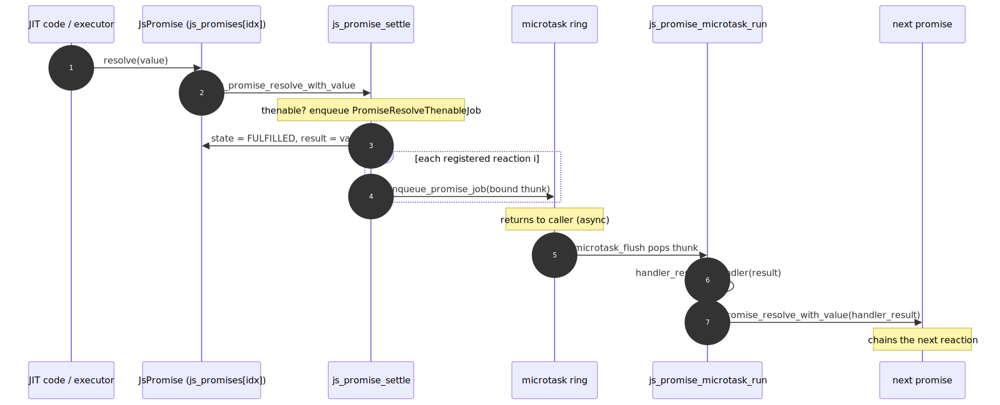
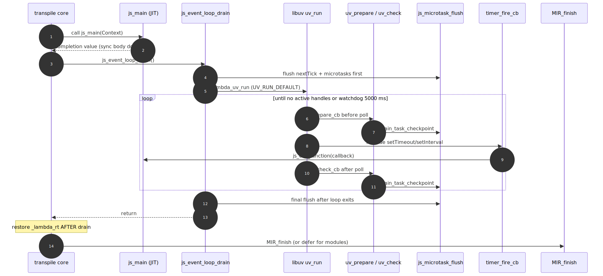
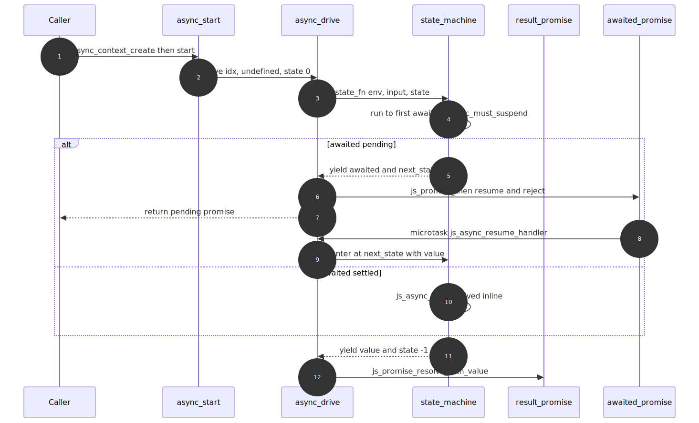

# LambdaJS — Async, Promises, Event Loop & Modules

> **Part of the [LambdaJS detailed-design set](JS_00_Overview.md).** This document covers the asynchronous half of the runtime: the `JsPromise` record and resolution procedure, the microtask/job queue, the libuv event loop and its drain ordering, async functions and `await` (built on the generator state machine), the ES-module system (load/link/eval, top-level await, dynamic `import()`), CommonJS `require`, and the module-variable lifecycle.
>
> **Primary sources:** `lambda/js/js_runtime.cpp` (`JsPromise`, resolution procedure, combinators, async state-machine driver, `JsModule` + TLA), `lambda/js/js_event_loop.{h,cpp}` (libuv loop, microtask ring, timers, bounded drain), `lambda/js/js_job_queue.{h,cpp}` (PromiseJob routing), `lambda/js/js_mir_function_class_lowering.cpp` (async lowering, phase 6), `lambda/js/js_mir_module_batch_lowering.cpp` (`transpile_js_module_to_mir`, `jm_load_imports`, body split), `lambda/js/js_mir_entrypoints_require.cpp` (`js_require`, `js_dynamic_import`, CJS wrap), `lambda/js/js_runtime_state.cpp` (module-var storage).
> **Audience:** engine developers. **Convention:** `file:line` references drift; confirm against the symbol name.

---

## 1. Purpose & scope

LambdaJS has no native thread of suspension — `js_main` runs straight through. Asynchrony is therefore layered on top of three cooperating pieces: a fixed pool of `JsPromise` records, a FIFO microtask/job queue, and a libuv event loop that owns timers and drains the queue at well-defined points. Async functions reuse the **generator state machine** (the lowering and resume-label infrastructure are owned by [JS_08 — Iterators & Generators](JS_08_Iterators_Generators.md); this document covers only the async-specific suspend/resume wiring). The module system sits above all of this: it compiles each module into its own MIR context, runs the body through `js_main`, and approximates top-level await by splitting the body at the first `await`.

This document owns promises, the job/microtask queue, the event loop, async/await suspension, the ES-module load/link/eval pipeline, CommonJS `require`, and the module-variable lifecycle. **Module *resolution* (path lookup, Node `node_modules` walking) and the npm client are owned by [JS_14 — Node Compatibility](JS_14_Node_Compat.md)**; this doc treats the resolved path as an input. The compilation entry points (`transpile_js_module_to_mir`, the core pipeline) are catalogued in [JS_01 — Compilation Pipeline](JS_01_Compilation_Pipeline.md); module-variable storage layout (`js_module_vars[]`) is in [JS_03 — Value Model](JS_03_Value_Model.md).

---

## 2. Promises

A promise is a `JsPromise` struct (`js_runtime.cpp:28143`): `JsPromiseState state` (PENDING/FULFILLED/REJECTED), an `Item result`, fixed parallel arrays `on_fulfilled[8]` / `on_rejected[8]` / `next_promise[8]` / `is_finally[8]` for registered reactions, a stable `wrapper` Item, and `int then_count`. Records live in a **fixed static pool** `js_promises[JS_MAX_PROMISES]` with `JS_MAX_PROMISES == 1024` (`:28156`); `js_alloc_promise` (`:28175`) bump-allocates from it and logs once on overflow. The whole pool is registered with the GC root scanner once via `js_promise_register_roots_once` (`:28160`), so every slot's `result`/handlers/`next_promise`/`wrapper` survive collection.

The user-visible Promise object is a **separate Lambda `Map`** carrying a `__promise_idx` INT back into the pool (`js_promise_to_item`, `:28198`); `js_get_promise` (`:28216`) reverses the mapping. The wrapper also gets `__class_name__ = "Promise"` and a `Promise.prototype` `__proto__` for `instanceof` and method dispatch.

### Resolution procedure & thenable assimilation

`js_promise_resolve_with_value` (`:28358`) is the ES Promise Resolution Procedure. It (1) adopts a native promise argument directly via `js_promise_adopt_native` (`:28300`, which also rejects self-resolution with a "Chaining cycle detected" TypeError); (2) for any other object-like value, reads `.then` and, if callable, enqueues a **PromiseResolveThenableJob** (`js_promise_thenable_job`, `:28327`) as a microtask rather than calling `then` synchronously; (3) otherwise settles FULFILLED. `js_promise_settle` (`:28493`) writes state+result once (ignoring already-settled promises) and schedules each registered reaction.

`js_resolve_callback` / `js_reject_callback` (`:28532`/`:28541`) are the executor's resolve/reject functions; they are bound to a per-promise **resolving-state** object (`js_promise_make_resolving_state`, `:28272`) that carries an `idx` plus a `called` once-flag, so the first call wins (`js_promise_resolving_state_claim`, `:28280`) — the spec's "alreadyResolved" guard. The resolve/reject base functions are cached by function pointer and shared across every `new Promise`; `js_promise_mark_anonymous_builtin` (`:28624`) gives each a non-writable empty `name`, but skips re-marking the shared unbound callback (only the per-promise *bound* function is freshly stamped) to avoid a "Cannot assign to read only property 'name'" throw on the second use.

### Microtask-scheduled reactions

Reactions never run inline. `js_promise_settle` builds a bound thunk per reaction and routes it through `js_enqueue_promise_job` (job queue → microtask ring). The thunk is `js_promise_microtask_run(handler, result, next_promise_item)` (`:28387`): it calls `handler(result)`, then drives the chained `next_promise` through the resolution procedure (so a returned thenable is assimilated), or settles it REJECTED on a thrown exception. Missing-handler reactions use `js_promise_enqueue_passthrough` (`:28486`) to forward state unchanged; `finally` uses `js_promise_finally_microtask_run` (`:28411`) which runs the cleanup, awaits its result, and only then replays the original settlement via `js_promise_finally_continue` (`:28433`).

`js_promise_then` (`:29415`) allocates the chained promise, registers the reaction pair (or, if already settled, immediately enqueues a microtask per spec), and honours `Symbol.species`: a non-builtin species constructor routes the result through a new-capability promise (`js_promise_new_capability`, `:28756`) forwarded by `js_promise_forward_native_to_capability` (`:28861`). `catch`/`finally` are thin wrappers (`:29468`/`:29473`).

### Combinators

`Promise.all` (`:29706`), `race` (`:29825`), `any` (`:29907`), `allSettled` (`:30028`) each have an **array fast path** plus an iterator-protocol slow path (`*_iterable`, e.g. `js_promise_all_iterable`, `:29763`). `all`/`allSettled` share a `{ remaining, results, called }` counter object and per-element resolve/reject closures (`js_all_resolve_element` etc.) bound to `(counter, index, result_promise)`; the result promise settles when `remaining` hits zero. Each element is first coerced through the builtin-constructor `resolve` and then `then`-subscribed via `js_invoke_promise_then`. `Promise.withResolvers` (`:29138`) builds `{ promise, resolve, reject }` via `js_promise_new_capability`; `js_promise_resolve`/`reject`/`create_pending` (`:28581`/`:28604`/`:28592`) are the basic constructors. `Promise.resolve` returns its argument unchanged when it is already a native promise.

---

## 3. Microtask & job queue

A **PromiseJob is just a microtask**: `js_enqueue_promise_job` (`js_job_queue.cpp:6`) validates the job is a function and forwards to `js_microtask_enqueue`; `js_run_microtasks` is an alias for `js_microtask_flush`. This unifies promise reactions, `queueMicrotask` (dispatched at `js_runtime.cpp:7577`), and `process.nextTick` into one drain model.

The queues are two fixed ring buffers in `js_event_loop.cpp:37` — `next_tick_ring` and `microtask_ring`, each `MICROTASK_CAPACITY == 1024` — both zeroed and registered as GC root ranges at init (`js_event_loop_init`, `:1003`/`:1032`). `js_microtask_flush` (`:123`) drains **all nextTick callbacks before any microtask**, then loops until both are empty, bounded by `TASK_FLUSH_SAFETY_LIMIT` (`MICROTASK_CAPACITY * 8`) to break runaway producers. Overflow on either ring is logged and dropped (`:64`/`:83`).

---

## 4. The libuv event loop

Timers are libuv handles. `js_setTimeout`/`setInterval` (and `_args` variants) allocate a `JsTimerHandle` (`:244`) that captures the current heap/name-pool/pool and DOM document (`timer_capture_runtime`, `:276`), registers the callback + extra args as GC roots, and arms a `uv_timer_t` (`:490`+). The runtime capture matters because the libuv loop is process-global: a timer can fire after the originating context has been swapped out (a later batch test, or a different document), so `timer_fire_cb` (`:392`) re-enters the captured runtime via `timer_runtime_enter` — installing a scratch `EvalContext` and re-attaching the captured document — invokes the callback, and closes one-shot timers. Document teardown explicitly cancels or abandons a document's timers (`js_event_loop_cancel/abandon_document_timers`, `:950`/`:970`) so a detached DOM is never re-entered. There is also a promise-returning family (`js_setTimeout_promise`, `js_setImmediate_promise`, `scheduler.wait`/`yield`, `:775`+) that resolves a `withResolvers` promise on fire and wires AbortSignal rejection, plus a `requestAnimationFrame` ring drained by Radiant's frame clock (`:201`+).

`js_event_loop_drain` (`:1197`) is the post-`js_main` drain: it flushes microtasks first, installs a SIGSEGV recovery guard (`event_loop_sigsegv_handler` + `setjmp`, so a crash in a JIT'd timer callback aborts the loop instead of the process), arms a watchdog timer (`EVENT_LOOP_DRAIN_TIMEOUT_MS == 5000`, `:1109`) that calls `lambda_uv_stop`, runs `lambda_uv_run` to completion, stops surviving interval timers, and does a final microtask flush. The microtask drain is also wired into libuv's phase checkpoints: `lambda_uv_set_microtask_drain(js_microtask_flush)` (`:1042`) registers it so `uv_prepare`/`uv_check` callbacks flush the queue around each poll — microtasks thus run between macrotasks, not only at the end.

`js_event_loop_auto_close_mode` (set for headless page-load/reftest snapshots) takes a different path (`:1204`): a few bounded `UV_RUN_NOWAIT` turns, then `close_all_timer_handles`, matching "close the page after onload".

### Drain-before-`MIR_finish` ordering and the `_lambda_rt` rule

Two invariants in the entry point (and mirrored in the module entry) make the drain safe:

- **Drain runs before `MIR_finish`.** The core pipeline calls `js_event_loop_drain` (and, in document mode, the animation-frame drain) *before* tearing down the MIR module, because microtask and timer callbacks are JIT'd code whose machine code must remain mapped (`JS_01_Compilation_Pipeline.md` §2 step 13; module path `js_mir_module_batch_lowering.cpp:6511`). For modules the MIR context is not even finished — it is handed to `jm_defer_mir_cleanup` (`:6537`) so module function pointers stay valid for the main program.
- **Restore `_lambda_rt` *after* the drain, not before.** Microtasks scheduled by the body (e.g. `Promise.resolve().then(...)` chains) run inside the drain, and their JIT'd handler bodies dereference the `_lambda_rt` runtime pointer to reach the pool. The module entry sets `_lambda_rt = context` before `js_main` and restores `prev_lambda_rt` only after `js_event_loop_drain` returns (`:6474`–`:6514`); restoring earlier produced a NULL-deref on first run (the comment at `:6503` documents the SIGSEGV that motivated the ordering). The same rule applies to the active module-vars pointer and module namespace.

---

## 5. Async functions & await

An async function (non-generator) is lowered to a **generator-style state machine** in phase 6 of function lowering (`js_mir_function_class_lowering.cpp:1257`). `jm_count_awaits` gives the number of resume points (capped at 63 to match `gen_state_labels`); the body becomes `async_sm_<name>(Item* env, Item input, int64_t state)` returning `[value, next_state]`, with the same env-slot layout, scope save/load, and state-dispatch switch used by generators (`mt->in_generator` *and* `mt->in_async` are both set, `:1338`). The reuse of the yield-resume machinery — env spill slots, per-state labels, the dispatch jump — is documented in [JS_08](JS_08_Iterators_Generators.md); only the driver and the await classification are async-specific.

At each `await`, lowering emits a call to `js_async_must_suspend(value)` (`js_runtime.cpp:29265`): it runs the resolution procedure, returns 0 for a settled/non-promise value (caching the unwrapped result in `js_async_get_resolved`, `:29303`) or throwing the rejection, and returns 1 only when the awaited promise is genuinely pending. A return of 1 makes the state machine emit `[awaited, next_state]` and return.

The caller side (`:2295`) wires `js_async_context_create` (allocates a `JsAsyncContext` from the fixed `js_async_contexts[256]` pool, `:29254`, plus a result promise), `js_async_start`, and `js_async_get_promise`. `js_async_drive` (`:29312`) is the core: it calls the state-machine function, then on `next_state == -1` resolves the result promise through the resolution procedure (so a returned promise is adopted), on `-2` rejects it, and otherwise registers `js_async_resume_handler` / `js_async_reject_handler` (`:29359`/`:29368`) on the pending promise via `js_promise_then` — these re-enter `js_async_drive` at the saved state when the awaited promise settles. A rejection re-enters with `js_throw_value` set so the state machine's try/catch can observe it.

### Synchronous await fast path and bounded drain

For top-level await without a state machine (and as the simple path), `js_await_sync` (`:29143`) handles a settled or non-promise value by draining microtasks (the spec requires a tick even for `await 1`) and returning/throwing. For a still-pending direct promise it drains once more, and only if reactions or queued tasks remain does it fall back to `js_await_bounded_drain` (`js_event_loop.cpp:1158`). That bounded drain runs `UV_RUN_NOWAIT` + microtask-flush turns until a predicate fires or one of three bounds expires — `watchdog_ms` (≈100), `max_no_progress` turns, `max_turns` (≈64). The comment block at `:1140` records why this is bounded: an earlier unconditional full-loop drain from inside `js_await_sync` blew the test suite from 155 s to 1675 s. A genuinely-unsettleable await returns `undefined` quickly.

---

## 6. ES modules

`transpile_js_module_to_mir` (`js_mir_module_batch_lowering.cpp:6308`) is the module entry. Each module gets **its own `MIR_context`** (`jit_init`, `:6407`) compiled with `is_module = true`, so `js_main` returns the **namespace object** rather than a completion value. The flow: enter TLA depth, parse + AST + `js_check_early_errors` (a parse/early-error failure returns `ITEM_ERROR` not `ItemNull` so the batch driver short-circuits cleanly, `:6330`), register a placeholder namespace early (so circular and self imports observe one object), recurse into `jm_load_imports` (dependencies first), compile + `MIR_link`, allocate module vars, run (or defer) the body, drain, then re-register the final namespace and **defer MIR cleanup** via `jm_defer_mir_cleanup` (`:6537`). The deferred entry also adopts the transpiler's name-pool/ast-pool so they outlive the transpiler (`:6540`).

`jm_load_imports` (`:6557`) walks top-level `import` declarations, resolves each path (algorithm in [JS_14](JS_14_Node_Compat.md)), skips self-imports (handled by live bindings), registers a placeholder against circular edges, and recursively compiles each dependency — including cross-language `.ls` Lambda modules, which are compiled by `load_script` and exposed as a JS namespace via `module_build_lambda_namespace` (`:6620`). Cached deps still propagate awaited-target and async-parent links.

**Namespace object & live bindings.** Exported bindings are written onto the namespace object (`mt->namespace_reg`); `export default <expr>` writes the `default` key (`:5640`). Import *bindings* are recorded in `module_consts` as `JsModuleConstEntry` (`js_mir_context.hpp:57`) mapping each imported name to a `js_module_vars[]` slot; for a **self-import default** the entry is flagged `is_live_default_binding` with a `live_binding_specifier`, so reads emit `js_get_live_binding_default(specifier)` (`js_runtime.cpp:30348`) — which reads `namespace.default` live and throws ReferenceError while still in TDZ — instead of a snapshot `js_get_module_var`. General named imports are otherwise resolved as module-var snapshots (see [§9](#9-known-issues--future-improvements)).

The module-var storage itself is a fixed `js_module_vars[JS_MAX_MODULE_VARS]` with `JS_MAX_MODULE_VARS == 2048` (`js_runtime_state.hpp:21`); `js_alloc_module_vars` (`js_runtime_state.cpp:159`) hands each module its own pool-allocated, GC-rooted slot array, and `js_set_active_module_vars` swaps the active pointer for the duration of a module's evaluation.

---

## 7. Top-level await

Because `js_main` cannot truly suspend, TLA is approximated by a per-module state machine modelled on the spec's `[[HasTLA]]` / `[[PendingAsyncDependencies]]` / `[[AsyncParentModules]]` fields, stored on `JsModule` (`js_runtime.cpp:30168`, `JS_MAX_MODULES == 64`, `JS_MAX_ASYNC_PARENTS == 16`).

- **Detection.** A nested module (TLA depth ≥ 2, not under a dynamic-import suppression) whose top-level body contains an `await` is marked via `js_module_mark_has_tla` (`:6398`). Entry-level TLA still runs synchronously through `js_main` + microtask drain.
- **Dependency counting.** During `jm_load_imports`, an importer that pulls in a TLA-transitive dep registers itself as an async parent (`js_module_register_async_parent`, `:30556`), incrementing the dep's `pending_async_deps`. If at body time `pending_async_deps > 0`, the importer **defers its body**: `js_main` is stashed as `deferred_main_ptr` and its evaluation context (module-vars pointer + namespace) is saved via `js_module_save_context` (`:6482`).
- **Body split at first await.** Lowering splits the module body at the first top-level `ExpressionStatement(await)` (`:5658`): it evaluates the await argument (so side effects and the P5 publish run), calls `js_p5_module_await`, flips `body_state` to 1, marks `post_await_pending`, assigns an **Async Evaluation Order** slot (`js_module_assign_async_eval_order`, `:30600`), and returns the namespace early. A POST_AWAIT label catches re-entry so the remaining statements run on the second call. This is single-shot — only the first await is split.
- **AEO drain.** When the outermost `transpile_js_module_to_mir` unwinds, `js_tla_exit_module` (`:30270`) drops the depth to 0 and drains: first the registered continuation queue, then it repeatedly picks the lowest-AEO module with a pending post-await chunk, restores its saved evaluation context (module-vars/namespace/`_lambda_rt`), re-enters `deferred_main_ptr`, and calls `js_module_complete_tla_body` (`:30659`) to decrement importers' `pending_async_deps` and wake any that are now ready. The continuation queue is deliberately *not* the microtask queue — the regular drain would fire continuations between siblings and defeat sibling-observability ordering (`:30239`).

---

## 8. Dynamic import and CommonJS require

**Dynamic import.** `js_dynamic_import` (`js_mir_entrypoints_require.cpp:1231`) coerces the specifier to a string, checks the module cache, and otherwise reads + `transpile_js_module_to_mir` on the **ESM path** (never the CJS-default-extraction path, so `export var x` stays on the namespace). It bumps `js_dynamic_import_suppress_module_drain` for the duration so the nested module skips its own event-loop drain and the caller sees a fully-evaluated namespace. If the imported subgraph captured a pending TLA awaited-target, the result is chained on it via `js_p5_chain_dynamic_import` (`:1288`); otherwise the namespace is wrapped in `js_promise_resolve`. The load itself is synchronous — only the returned Promise is asynchronous.

**`require`.** `js_require` (`:1143`) checks the cache (returning the CJS `default` export = `module.exports` when present), reads the file (with Node `path/index.js` fallback), and for a CJS file (`js_is_cjs_file`: `.cjs` and bare `.js` are CJS, `.mjs` is ESM, `:1099`) **wraps the source**. `js_wrap_cjs_source` (`:1107`) prefixes `var __cjs_module__ = {exports:{}}; var exports = …; var module = …; var __filename/__dirname = …;` and suffixes `export default __cjs_module__.exports;`, then compiles through the same module entry and extracts the default export. CJS is thus implemented entirely as a source-to-ESM rewrite plus the existing module machinery. There is no static `require` interception pass in this path — `require` is resolved as a runtime call (the Node built-in module surface is in [JS_14](JS_14_Node_Compat.md)).

---

## 9. Module-variable lifecycle (save/restore on nested require)

Each module evaluation runs against an active module-vars pointer. The module entry saves the caller's pointer (`js_get_active_module_vars`), allocates a fresh per-module array (`js_alloc_module_vars`), switches to it for `js_main` + drain, and restores the caller's pointer **after** the drain (`:6461`–`:6515`) — same after-drain timing as `_lambda_rt`, so deferred handlers that touch module-level vars still see the right array. The AEO drain re-applies this save/restore around each deferred `js_main` re-entry (`:30329`–`:30337`).

An older mechanism, `js_save_module_vars` / `js_restore_module_vars` (`js_runtime_state.cpp:145`/`:152`), snapshots and memcpy-restores the whole shared `js_module_vars[]` block to stop a nested `require` from clobbering the outer module's live variables via `js_reset_module_vars`. It is superseded by the per-module active-pointer swap above (see [§9 issue 5](#9-known-issues--future-improvements)).

---

## Known Issues & Future Improvements

Grounded in the current code; candidates for cleanup, not necessarily bugs.

1. **TLA is "first-await-per-body only."** The body split (`js_mir_module_batch_lowering.cpp:5696`) is explicitly single-shot — `p7d_post_await_label = NULL; // single-shot split`. A module with two top-level awaits separated by observable work does not get a second suspension point; statements after the first await all run in one post-await chunk. Full multi-await TLA would need the body lowered through the async state machine like a function.
2. **Named-import live binding is snapshot-only except self-import default.** Only `is_live_default_binding` self-imports route through `js_get_live_binding_default` (`js_mir_context.hpp:76`); general `import { x }` reads resolve to a `js_module_vars[]` slot snapshot. Cross-module mutation of an exported `let` after import is therefore not observed live.
3. **Circular ESM relies on placeholder namespaces.** `jm_load_imports` registers an empty placeholder before recursing (`:6612`); a cycle that reads a not-yet-exported binding sees `undefined`/missing rather than a TDZ ReferenceError, and there is no SCC/`[[CycleRoot]]` handling as in the spec's link phase.
4. **Fixed pools with hard caps.** `JS_MAX_PROMISES` 1024 (`js_runtime.cpp:28156`), `JS_MAX_ASYNC_CONTEXTS` 256 (`:29254`), per-promise reaction arrays capped at 8 (`then_count < 8` silently drops further reactions, `:29444`), `JS_MAX_MODULES` 64, `JS_TLA_MAX_CONTINUATIONS` 64, timer/microtask/raf rings 1024. The promise pool also never frees slots — a long-running program leaks promise records. *Improvement:* grow dynamically or recycle settled records.
5. **Vestigial `js_save_module_vars`/`js_restore_module_vars`.** Defined in `js_runtime_state.cpp:145`/`:152` but the per-module `js_alloc_module_vars` + active-pointer swap is the live mechanism; the whole-array memcpy helpers appear unused on the current require/module paths. *Improvement:* confirm and delete.
6. **`js_await_sync` cannot suspend.** Without a state machine (e.g. some TLA shapes), a pending await falls back to a bounded busy-drain (`js_event_loop.cpp:1158`) and returns `undefined` if it cannot settle in-turn — a deliberate divergence from real suspension, documented against the Js55 1675 s regression (`:1146`). Anything depending on a cross-thread/cross-event settlement that needs more than 64 turns silently observes `undefined`.
7. **SIGSEGV guard around the drain is a band-aid.** `js_event_loop_drain` installs a SIGSEGV handler + `setjmp` to survive heap corruption in timer callbacks (`:1076` comment: "Heap corruption in timer callbacks (pre-existing bug)"). This masks an underlying memory-safety bug rather than fixing it.
8. **Promise wrapper still uses legacy `__class_name__`.** `js_promise_to_item` (`:28206`) writes the `__class_name__` string marker for `instanceof Promise`, against the migration to the typed `JsClass` byte described in [JS_06](JS_06_Objects_Properties_Prototypes.md).

---

## Appendix A — Source map

| File | Responsibility (this doc) |
|---|---|
| `lambda/js/js_runtime.cpp` | `JsPromise` pool, resolution procedure, `js_promise_then`/combinators, async state-machine driver, `JsModule` + TLA/AEO drain, live-binding default. |
| `lambda/js/js_event_loop.{h,cpp}` | libuv loop, microtask/nextTick/raf rings, timers, `js_event_loop_drain`, `js_await_bounded_drain`. |
| `lambda/js/js_job_queue.{h,cpp}` | `js_enqueue_promise_job` → microtask, `js_run_microtasks`. |
| `lambda/js/js_mir_function_class_lowering.cpp` | Phase-6 async state-machine lowering; `js_async_context_create`/`start`/`get_promise` call emission. |
| `lambda/js/js_mir_module_batch_lowering.cpp` | `transpile_js_module_to_mir`, `jm_load_imports`, body split, export emission, deferred MIR cleanup. |
| `lambda/js/js_mir_entrypoints_require.cpp` | `js_require`, `js_dynamic_import`, `js_wrap_cjs_source`, `js_is_cjs_file`. |
| `lambda/js/js_runtime_state.cpp` | `js_alloc_module_vars`, `js_get/set_active_module_vars`, `js_save/restore_module_vars`. |
| `lambda/js/js_mir_context.hpp` | `JsModuleConstEntry` (import binding / live-binding flags). |

## Appendix B — Related documents

- [JS_01 — Compilation Pipeline & Phase Model](JS_01_Compilation_Pipeline.md) — module entry point, drain-before-`MIR_finish` step.
- [JS_03 — Value Model, Memory & GC Interop](JS_03_Value_Model.md) — `js_module_vars[]` storage, GC roots.
- [JS_06 — Objects, Properties & Prototypes](JS_06_Objects_Properties_Prototypes.md) — `JsClass` byte vs `__class_name__` migration.
- [JS_08 — Iterators & Generators](JS_08_Iterators_Generators.md) — generator state machine reused by async functions; iterator protocol used by promise combinators.
- [JS_14 — Node Compatibility](JS_14_Node_Compat.md) — module resolution algorithm, `node_modules` walk, npm client, Node built-in modules.
