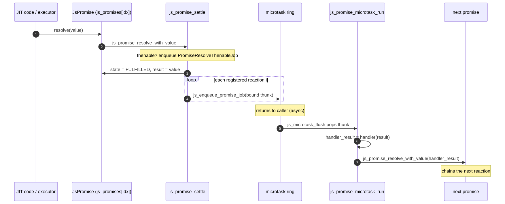
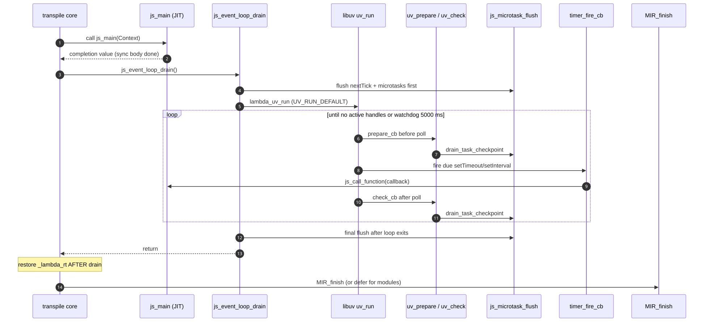
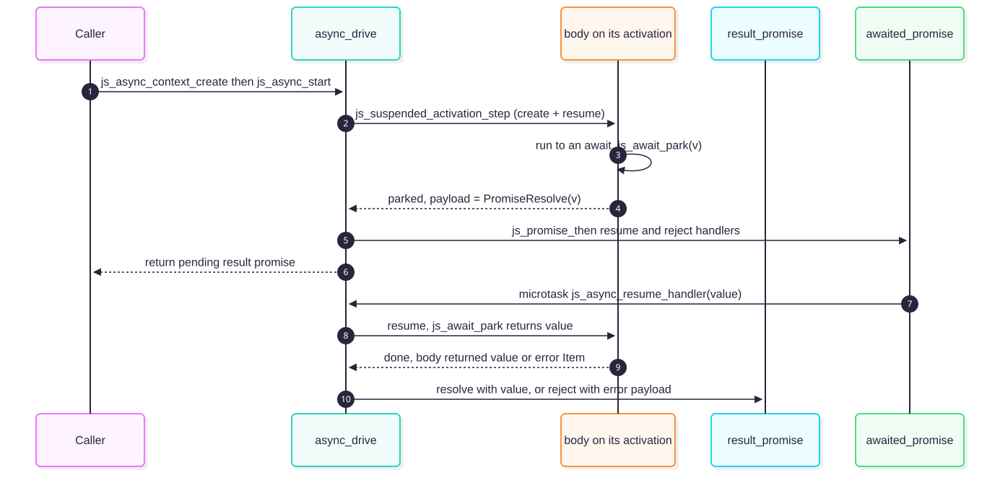

# LambdaJS — Async, Promises, Event Loop & Modules

> **Last verified against tree:** 2026-10-05

> **Part of the [LambdaJS detailed-design set](JS_00_Overview.md).** This document covers the asynchronous half of the runtime: the `JsPromise` record and resolution procedure, the microtask/job queue, the libuv event loop and its drain ordering, async functions and `await` (bodies parked in place on stackful activations), the ES-module system (load/link/eval, top-level await on module carriers, dynamic `import()`), CommonJS `require`, and the module-variable lifecycle.
>
> **Primary sources:** `lambda/js/js_runtime.cpp` (`JsPromise`, resolution procedure, combinators, `js_await_park`/`js_await_sync`, the async driver `js_async_drive`, module TLA tracking and the ready scan), `lambda/runtime/activation.{h,cpp}` (the Activation a body parks on), `lambda/js/js_interp.cpp` (interpreted async and module bodies, `js_mir_module_async_body`), `lambda/js/js_event_loop.{h,cpp}` (libuv loop, job queues, timers, bounded drain), `lambda/js/js_job_queue.{h,cpp}` (PromiseJob routing), `lambda/js/js_mir_function_class_lowering.cpp` (MIR async body emission), `lambda/js/js_mir_module_batch_lowering.cpp` (`transpile_js_module_to_mir`, `jm_load_imports`, module carriers), `lambda/js/js_mir_entrypoints_require.cpp` (`js_require`, `js_dynamic_import`, CJS wrap), `lambda/js/js_runtime_state.{hpp,cpp}` (`JsSuspendedActivation` records, the `JsAmbient` activation hook).
> **Audience:** engine developers. **Convention:** `file:line` references drift; confirm against the symbol name.

---

## 1. Purpose & scope

Asynchrony in LambdaJS rests on four cooperating pieces: `JsPromise` records, a FIFO microtask/job queue, a libuv event loop that owns timers and drains the queue at well-defined points, and **stackful activations**. Every async function, generator and top-level-await module body runs once on an Activation of its own and parks in place at each `await` (or `yield`), in both the AST interpreter and MIR tiers (**D5.1.1v3**); no tier transforms a function into a state machine. The generator side — the record, `js_gen_park`, the `next` driver and the ambient switch — is owned by [JS_08 — Iterators & Generators](JS_08_Iterators_Generators.md) §5; this document covers the await park, the async driver, and module top-level await. The module system sits above all of this: it compiles each module into its own MIR context and runs `js_main`, directly or — for a nested or dynamically imported module with a top-level await, or one waiting on async dependencies — on a module carrier where every top-level `await` is an ordinary park.

This document owns promises, the job/microtask queue, the event loop, async/await suspension, the ES-module load/link/eval pipeline, CommonJS `require`, and the module-variable lifecycle. **Module *resolution* (path lookup and built-in classification) is owned by [JS_14 — Node Compatibility](JS_14_Node_Compat.md)**; this doc treats the resolved path as an input. External package installation and `node_modules` discovery are outside the `lambda.exe` host build. The compilation entry points (`transpile_js_module_to_mir`, the core pipeline) are catalogued in [JS_01 — Compilation Pipeline](JS_01_Compilation_Pipeline.md); module-variable storage layout (`js_module_vars[]`) is in [JS_03 — Value Model](JS_03_Value_Model.md).

---

## 2. Promises

A promise is a `JsPromise` (`js_runtime_state.hpp:557`), a GC-owned `VMap` carrier with its own vtable (`js_promise_vtable`), allocated by `js_alloc_promise` (`js_runtime.cpp:30476`): `JsPromiseState state` (PENDING/FULFILLED/REJECTED), an `Item result`, a `reactions` Item holding a growable GC array of registered reactions (`js_promise_add_reaction`, `:30616`), and unhandled-rejection bookkeeping. There is no record pool and no reaction cap; each live promise owns its precise edge set.

The user-visible Promise object is that carrier itself: `js_promise_to_item` boxes it as a `VMap` Item and `js_get_promise` recognizes it by its vtable. A carrier has no Map header slot for `[[Prototype]]`, so a subclass prototype from OrdinaryCreateFromConstructor is kept in `prototype_override`; otherwise the intrinsic `Promise.prototype` is used.

### Resolution procedure & thenable assimilation

`js_promise_resolve_with_value` (`:28358`) is the ES Promise Resolution Procedure. It (1) adopts a native promise argument directly via `js_promise_adopt_native` (`:28300`, which also rejects self-resolution with a "Chaining cycle detected" TypeError); (2) for any other object-like value, reads `.then` and, if callable, enqueues a **PromiseResolveThenableJob** (`js_promise_thenable_job`, `:28327`) as a microtask rather than calling `then` synchronously; (3) otherwise settles FULFILLED. `js_promise_settle` (`:28493`) writes state+result once (ignoring already-settled promises) and schedules each registered reaction.

`js_resolve_callback` / `js_reject_callback` (`:28532`/`:28541`) are the executor's resolve/reject functions; they are bound to a per-promise **resolving-state** object (`js_promise_make_resolving_state`, `:28272`) that carries an `idx` plus a `called` once-flag, so the first call wins (`js_promise_resolving_state_claim`, `:28280`) — the spec's "alreadyResolved" guard. The resolve/reject base functions are cached by function pointer and shared across every `new Promise`; `js_promise_mark_anonymous_builtin` (`:28624`) gives each a non-writable empty `name`, but skips re-marking the shared unbound callback (only the per-promise *bound* function is freshly stamped) to avoid a "Cannot assign to read only property 'name'" throw on the second use.

### Microtask-scheduled reactions

Reactions never run inline. `js_promise_settle` builds a bound thunk per reaction and routes it through `js_enqueue_promise_job` (job queue → microtask queue). The thunk is `js_promise_microtask_run(handler, result, next_promise_item)` (`:28387`): it calls `handler(result)`, then drives the chained `next_promise` through the resolution procedure (so a returned thenable is assimilated), or settles it REJECTED on a thrown exception. Missing-handler reactions use `js_promise_enqueue_passthrough` (`:28486`) to forward state unchanged; `finally` uses `js_promise_finally_microtask_run` (`:28411`) which runs the cleanup, awaits its result, and only then replays the original settlement via `js_promise_finally_continue` (`:28433`).

`js_promise_then` (`:29415`) allocates the chained promise, registers the reaction pair (or, if already settled, immediately enqueues a microtask per spec), and honours `Symbol.species`: a non-builtin species constructor routes the result through a new-capability promise (`js_promise_new_capability`, `:28756`) forwarded by `js_promise_forward_native_to_capability` (`:28861`). `catch`/`finally` are thin wrappers (`:29468`/`:29473`).

### Combinators

`Promise.all` (`:29706`), `race` (`:29825`), `any` (`:29907`), `allSettled` (`:30028`) each have an **array fast path** plus an iterator-protocol slow path (`*_iterable`, e.g. `js_promise_all_iterable`, `:29763`). `all`/`allSettled` share a `{ remaining, results, called }` counter object and per-element resolve/reject closures (`js_all_resolve_element` etc.) bound to `(counter, index, result_promise)`; the result promise settles when `remaining` hits zero. Each element is first coerced through the builtin-constructor `resolve` and then `then`-subscribed via `js_invoke_promise_then`. `Promise.withResolvers` (`:29138`) builds `{ promise, resolve, reject }` via `js_promise_new_capability`; `js_promise_resolve`/`reject`/`create_pending` (`:28581`/`:28604`/`:28592`) are the basic constructors. `Promise.resolve` returns its argument unchanged when it is already a native promise.

---

## 3. Microtask & job queue

A **PromiseJob is just a microtask**: `js_enqueue_promise_job` (`js_job_queue.cpp:6`) validates the job is a function and forwards to `js_microtask_enqueue`; `js_run_microtasks` is an alias for `js_microtask_flush`. This unifies promise reactions, `queueMicrotask` (dispatched at `js_runtime.cpp:7577`), and `process.nextTick` into one drain model.

The queues are growable `RuntimeJobQueue`s on the context's event-loop state — `next_tick_queue` and `microtask_queue` (`js_event_loop.cpp:47`) — whose callbacks are rooted through the runtime's `event_loop_queue_roots`; a job also captures the async-hooks resource, async-local context and domain current at enqueue (`js_async_queue_push`, `:74`). `js_microtask_flush` (`:161`) drains the nextTick queue before the microtask queue on each pass and loops until both are empty, bounded by `TASK_FLUSH_WORK_BUDGET` (8192 jobs) to break runaway producers. `js_microtask_step` (`:209`) advances exactly one job; `js_await_sync` uses it to wait for one promise without consuming unrelated jobs (§5).

---

## 4. The libuv event loop

Timers are libuv handles. `js_setTimeout`/`setInterval` (and `_args` variants) allocate a `JsTimerHandle` (`:244`) that captures the current heap/name-pool/pool and DOM document (`timer_capture_runtime`, `:276`), registers the callback + extra args as GC roots, and arms a `uv_timer_t` (`:490`+). The runtime capture matters because the libuv loop is process-global: a timer can fire after the originating context has been swapped out (a later batch test, or a different document), so `timer_fire_cb` checks through `timer_runtime_enter` that the callback arrived on its owning context and thread — a routing check that refuses the callback rather than borrowing another evaluator — re-attaches the captured document, invokes the callback, and closes one-shot timers. Document teardown explicitly cancels or abandons a document's timers (`js_event_loop_cancel/abandon_document_timers`, `:950`/`:970`) so a detached DOM is never re-entered. There is also a promise-returning family (`js_setTimeout_promise`, `js_setImmediate_promise`, `scheduler.wait`/`yield`, `:775`+) that resolves a `withResolvers` promise on fire and wires AbortSignal rejection, plus a `requestAnimationFrame` ring drained by Radiant's frame clock (`:201`+). `js_event_loop_init` runs at every outermost script turn — including the synthetic `<window-pageshow>` lifecycle script right after `load` — and it must leave live document work alone: it returns early while timers or animation-frame requests are pending (a frame requested from a `load` handler on a page with no timers used to be wiped there, 2026-09-30).

`js_event_loop_drain` is the post-`js_main` drain: it flushes microtasks first — with no signal guard of its own, so a memory fault in a timer callback terminates the process (S7.11.4) while C14 faults use the active recovery frame — arms a watchdog timer (`EVENT_LOOP_DRAIN_TIMEOUT_MS == 5000`, `:1109`) that calls `lambda_uv_stop`, runs `lambda_uv_run` to completion, stops surviving interval timers, and does a final microtask flush. The microtask drain is also wired into libuv's phase checkpoints: `lambda_uv_set_microtask_drain(js_microtask_flush)` (`:1042`) registers it so `uv_prepare`/`uv_check` callbacks flush the queue around each poll — microtasks thus run between macrotasks, not only at the end.

`js_event_loop_auto_close_mode` (set for headless page-load/reftest snapshots) takes a different path (`:1204`): a few bounded `UV_RUN_NOWAIT` turns, then `close_all_timer_handles`, matching "close the page after onload".

### Drain ordering in the entry point and the module entry

Two invariants in the entry point (and mirrored in the module entry) make the drain safe:

**Headless load boundary verified 2026-10-09:** auto-close document batches
leave animation-frame callbacks queued until the same post-`load` boundary
used by timers. A per-script drain must not advance a recurring ticker while
later startup scripts are still being dispatched. The bounded frame drain
keeps callbacks queued at its limit; a recurring animation is ordinary pending
work. Callback ownership still follows **D5.4.1**, and script timeouts still
use **D8.4.3v2**. `JsEventLoop.BrowserFrameDrainWaitsForLoadBoundary` checks
that a queued callback waits during startup and executes after load.

- **Drain runs before `MIR_finish`.** The core pipeline calls `js_event_loop_drain` (and, in document mode, the animation-frame drain) *before* tearing down the MIR module, because microtask and timer callbacks are JIT'd code whose machine code must remain mapped (`JS_01_Compilation_Pipeline.md` §2 step 13). For modules the MIR context is not even finished — `jm_finish_module_transpile` hands it to `jm_defer_mir_cleanup` (`js_mir_module_batch_lowering.cpp:3756`) so module function pointers stay valid for the main program.
- **Only the entry module drains, and module state is restored after the drain.** One `RuntimeExecutionScope` spans the whole module graph: `transpile_js_module_to_mir` opens it before the imports load, and only the outermost scope initializes the event loop (`:4131`), so a nested module no longer re-initializes the loop and clears queued jobs. A nested module never drains — draining there would resume a parked module carrier before its siblings evaluate (ECMA-262 InnerModuleEvaluation) — and the entry module flushes promise jobs and then drains (`:4338`). The module's current-file, module-state and namespace scopes (`RuntimeCurrentFileScope`, `RuntimeModuleStateScope`, `JsModuleNamespaceScope`) are destroyed at function exit, after the drain, so callbacks run inside it still see the module's slab and namespace.

---

## 5. Async functions & await

An async function body runs **once** on a stackful Activation and parks in place at each `await`; there is no state machine, resume-state table, `[value, state]` marker or replay in either tier (**D5.1.1v3**; Runtime_Async RA1). The carrier is a GC-owned frame Map (`JsAsyncFrameCarrier`, `MAP_KIND_ASYNC_FRAME`) whose `JsAsyncContextStateRecord` (`js_runtime_state.hpp:653`) extends the same `JsSuspendedActivation` as a generator: the weakly owned `activation`, its `body` entry, the creation-time `with` chain, plus the result `promise`, `this_val` and the `module_state_id` the body was compiled against. `js_async_frame_map_heap_destroy` abandons a body that is collected while still awaiting a promise that never settles (Runtime_Async RA7).

**Bodies.** Each record names its entry. `js_async_context_create_ast` installs `js_interp_async_body` (`js_interp.cpp:6166`); `js_async_context_create_mir` (`js_runtime.cpp:31885`) installs `js_mir_state_body`, which enters the compiled body function once. The MIR body is emitted at `js_mir_function_class_lowering.cpp:1639` as `async_sm_<name>_<n>` with the same env layout as a generator (JS_08 §5), wrapped in an implicit try context whose catch label returns the routed ERROR carrier, so a throw from parameter binding or the body rejects. The MIR emits this activation path only when `jm_has_await` finds an `await` in the body; an async function without one keeps a direct path that resolves its result through `js_async_wrap_return` and creates no activation. The interpreter starts every async function on a carrier (`js_interp_start_async_function`).

**The await park.** In MIR, `jm_emit_await_value_reg` (`js_mir_statement_lowering.cpp:2141`) emits one call, `js_await_park(value)` (or `js_gen_park(value, JS_GEN_PARK_AWAIT)` inside an async generator); the interpreter's `js_interp_await_value` (`js_interp.cpp:192`) makes the same call when its frame `can_await`. `js_await_park` (`js_runtime.cpp:32677`) runs PromiseResolve and calls `activation_suspend` with the resulting promise; the call returns the fulfilled value, or the rejection as an ERROR Item, which the MIR routes as `JS_MIR_COMPLETION_AWAIT_REJECTION` so the body's own try/catch observes it (**D8.4.3v2**). The park is unconditional: a settled value still resumes on a later promise job, as ECMA-262 Await requires. Registers, try state and `with` scopes are still live after the call; MIR only refreshes env-backed scope variables and shared captures (`jm_emit_async_resume_refresh`).

**The driver.** The callable creates the carrier, calls `js_async_start`, and returns `js_async_get_promise`. `js_async_drive` (`js_runtime.cpp:31765`) is the one driver for every async body of both tiers: it activates the record's `module_state_id`, installs `this_val` as `js_current_this`, and makes **one** `js_suspended_activation_step(ctx, ctx->body, …)` (JS_08 §5), then reads the ActivationStatus. Parked → the step returned the promise the body awaits; the driver binds `js_async_resume_handler`/`js_async_reject_handler` to the frame Item and subscribes them with `js_promise_then`, so the awaited promise's reaction list retains the carrier until it settles (JSCU10), and the reaction job re-enters `js_async_drive` with the value or with `js_throw_value(reason)`. Done → it resolves the result promise through the resolution procedure (a returned promise or thenable is adopted), or, for an error Item, rejects it with `js_error_lane_payload`. A native fault inside the body is caught at the activation's own boundary and rejects as a RangeError (**D6.3.3v2**); a wide scalar the body hands over is re-homed in the step before the activation's number segment can be compacted or released (**D5.1.3**). Ambient per-activation state — the call-activation chain, `with` chain, per-call flags and active module namespace on the JS side, current file and module state in the core — is carried by the activation switch through the `JsAmbient` hook (`js_runtime_state.cpp:24`), and each body copies its call facts onto its own stack at entry (`JsOwnedCallActivation`), so the driver contains no save/restore code for them.

**Tiering.** Because a park is an ordinary call in both tiers, no tier decision reads a function's colour (**D8.1.1v16**). P2 promotion admits async and generator definitions (`js_interp_p2_admission_reason` no longer rejects them), and its planner treats `await`/`yield` as planned syntax (`js_interp_p2_scan_node`); the satellite's bodies park on activations exactly as the interpreter's do. Loop handoff from an interpreted frame refuses only a loop whose tail — from the loop to the end of the body — can itself suspend (`js_interp.cpp:5476`), checked by `js_ast_index_can_suspend` (`js_ast_children.cpp:526`), the suspension scan MIR lowering shares through `jm_can_suspend`. A handed-off continuation is an ordinary function call on the same activation.

### Awaiting outside an activation

An `await` with no activation to park — a script's top level, the MIR entry module's top level (the entry module keeps its synchronous top-level ticks; an interpreted module body always runs on a carrier, §7), or a host waiting on a promise — goes through `js_await_sync` (`js_runtime.cpp:31655`), the one wait shared by both tiers. A non-promise scalar gets one microtask step, so older queued jobs still get a turn. For a promise it subscribes a marker reaction and runs jobs one at a time (`js_microtask_step`) **only until that promise's own reaction has run**, so the await resumes at the same FIFO point as a parked await would. If the promise is still pending once the job queues are empty — the work lives on timers or another runtime — it falls back to `js_await_bounded_drain` (`js_event_loop.cpp:1599`): `UV_RUN_NOWAIT` + microtask-flush turns until the promise settles or one of three bounds expires (watchdog 100 ms, 3 no-progress turns, 64 turns). The comment block at `:1581` records why this is bounded: an earlier unconditional full-loop drain from inside `js_await_sync` blew the test suite from 155 s to 1675 s. A genuinely unsettleable await reads as `undefined`.

---

## 6. ES modules

`transpile_js_module_to_mir` (`js_mir_module_batch_lowering.cpp:3998`) is the module entry. Each module gets **its own MIR compile unit** (`js_mir_open_compile_unit`, `:4155`) compiled with `is_module = true`, so `js_main` returns the **namespace object** rather than a completion value. The flow: route to the AST tier when it is forced, selected, or the module is too large; enter TLA depth (`js_tla_enter_module`); parse + AST + early errors (a parse/early-error failure returns `ITEM_ERROR` not `ItemNull` so the batch driver short-circuits cleanly, `:4084`); open the graph's one `RuntimeExecutionScope` (§4); register a placeholder namespace early (so circular and self imports observe one object); detect a top-level await (`jm_module_has_top_level_await`) and decide whether this module runs on a carrier (§7); lower, prelink and recurse into `jm_load_imports` (dependencies first); link `js_main` (`js_mir_link_main`, `:4268`); reserve and activate the module's state slab; run the body directly or on its carrier; let only the entry module drain; drop TLA depth (`js_tla_exit_module`); record an evaluation error or re-register the final namespace; and either admit a closed module (no TLA, synchronous dependencies) to the module MIR cache or **defer MIR cleanup** via `jm_finish_module_transpile` → `jm_defer_mir_cleanup`.

`jm_load_imports` (`:4436`) walks top-level `import` declarations, resolves each path (algorithm in [JS_14](JS_14_Node_Compat.md)), skips self-imports (handled by live bindings), registers a placeholder against circular edges, and recursively compiles each dependency — including cross-language `.ls` Lambda modules, which are compiled by `load_script` and exposed as a JS namespace via `module_build_lambda_namespace` (`:4515`). After each dependency it propagates evaluation errors, records the static edge, inherits the dependency's awaited target, and registers the importer as an async parent when the dependency still needs to settle (`:4574`); the interpreter's static-import loader does the same against the same registry (`js_interp.cpp:6598`).

**Namespace object & live bindings.** Exported bindings are written onto the namespace object (`mt->namespace_reg`); `export default <expr>` writes the `default` key (`:3353`). Import *bindings* are recorded in `module_consts` as `JsModuleConstEntry` (`js_mir_context.hpp:69`) mapping each imported name to a `js_module_vars[]` slot; for a **self-import default** the entry is flagged `is_live_default_binding` with a `live_binding_specifier`, so reads emit `js_get_live_binding_default(specifier)` (`js_runtime.cpp:32498`) — which reads `namespace.default` live and throws ReferenceError while still in TDZ — instead of a snapshot `js_get_module_var`. General named imports are otherwise resolved as module-var snapshots (see [§9](#9-known-issues--future-improvements)).

Module variables live in a per-context module state slab, never at code-baked addresses (**D7.2.1**): the module entry calls `lambda_module_state_reserve_and_activate(mt->module_var_count)` (`runtime-state.cpp:499`) to reserve the module's own slab and make it active, and an `MCONST_MODVAR` binding names a slot in it (`jm_load_module_var`); §9 covers its lifecycle.

**Inline browser modules verified 2026-10-09:** each task retains a distinct
synthetic module identity, while relative imports, import-map scopes, and
`import.meta.url` use the document URL snapshot. The snapshot is copied into
the document pool because `history.replaceState` replaces the original URL's
string storage (**D4.5.1v4**); module records and execution remain separate
from cached source artifacts (**D8.5.1v7**). This follows HTML's
[inline module graph creation](https://html.spec.whatwg.org/multipage/webappapis.html#fetch-an-inline-module-script-graph).
`js_inline_module_document_lifetime` covers three independent module scopes,
static and dynamic relative imports, metadata, and history updates under
forced GC with freed storage poisoned.

---

## 7. Top-level await

A top-level await is an ordinary await on a **module carrier** in both tiers — the same `JsAsyncContextStateRecord` an async function uses, created by `js_async_context_create_module` (`js_runtime.cpp:31904`) with the module's script (interpreter) or `js_main` (MIR), its module-state id, specifier and file. Its body entry is `js_interp_module_async_body` (`js_interp.cpp:6239`) or `js_mir_module_async_body` (`:6268`); both set the module's current file and active namespace once at entry (`JsModuleBodyScope`) — the activation switch carries both across parks — and every top-level `await` parks through `js_await_park` (§5). The old single-shot body split, `js_p5_module_await`, the depth-0 re-entry of `js_main`, `deferred_main_ptr`, `body_state` and the async-evaluation-order counter are deleted. The spec's `[[HasTLA]]` / `[[PendingAsyncDependencies]]` / `[[AsyncParentModules]]` fields live on the module registry's `ModuleDescriptor` (`has_tla`, `pending_async_deps`, `async_parents`, plus `deferred_async_frame`, `post_await_pending`, `awaited_target`; `lambda/runtime/module_registry.h:49`), shared by both tiers, with no fixed cap on modules or parents.

- **Which modules get a carrier.** The interpreter runs every module body on one (`js_interp_execute_es_module_script`, `js_interp.cpp:6778`). MIR does so for a module with a top-level await that is nested (TLA depth ≥ 2) or dynamically imported (`mt->module_tla_carrier`, `js_mir_module_batch_lowering.cpp:4196`), and for any module still waiting on async dependencies (`:4308`); every other MIR module runs `js_main` directly, and the MIR entry module's top-level awaits keep their synchronous ticks through `js_await_sync` (§5).
- **Dependency counting.** During import loading, an importer whose dependency still needs to settle (`js_module_needs_async_settle`) registers as that dependency's async parent (`js_module_register_async_parent`, `js_runtime.cpp:32823`), which increments the **importer's** `pending_async_deps`; an importer outside a strongly connected component waits on the component's cycle root. An importer whose count is still positive at body time does not start its carrier: it parks it in its descriptor (`js_module_set_deferred_async_frame`).
- **Parking.** When the driver sees a module body park, it marks the module `has_tla` and `post_await_pending` (`js_async_drive`), so importers and dynamic imports treat it as a pending async evaluation edge; the carrier's result promise is recorded as the module's awaited target.
- **Completion and the ready scan.** A body that runs to its end — at once or after parking — calls `js_module_complete_tla_body` (`js_runtime.cpp:32867`; MIR emits the call at the end of `js_main`), which marks the module executed and decrements each async parent's `pending_async_deps`, then queues the ready scan as a microtask so ready importers start behind the completing carrier's own settlement. **One ready scan**, `js_tla_drain_ready_modules` (`:32415`), starts any deferred carrier, of either tier, whose dependencies have all completed; it also runs when the outermost module unwinds (`js_tla_exit_module`, `:32487`) and before a dynamic import resolves. A rejected body records its evaluation error and rejects its async parents in leaf-to-root order (`js_module_record_async_evaluation_error`, ECMA-262 AsyncModuleExecutionRejected).

## 8. Dynamic import and CommonJS require

**Dynamic import.** `js_dynamic_import` (`js_mir_entrypoints_require.cpp:2456`) coerces the specifier to a string, checks the module cache, and otherwise loads the module on the **ESM path** (`js_execute_dynamic_import_module`; never the CJS-default-extraction path, so `export var x` stays on the namespace). It bumps `js_dynamic_import_suppress_module_drain` for the duration, so the imported module never drains the event loop itself and, if it has a top-level await, runs on a module carrier (§7). If the imported graph still needs to settle, it first runs the ready scan (`js_tla_flush_for_dynamic_import`); if the graph then has a pending awaited target — the module carrier's promise, inherited by static importers — the result is chained on it via `js_p5_chain_dynamic_import` (`:2556`), so the namespace is delivered only after the body finishes; otherwise the namespace is wrapped in `js_promise_resolve`. The load itself is synchronous — only the returned Promise is asynchronous.

**`require`.** `js_require` (`:2322`) checks the cache (returning the CJS `default` export = `module.exports` when present), reads the file (with Node `path/index.js` fallback), and for a CJS file (`js_is_cjs_file`: `.cjs` and bare `.js` are CJS, `.mjs` is ESM, `:1918`) **wraps the source**. `js_wrap_cjs_source` (`:2306`) prefixes `var __cjs_module__ = {exports:{}}; var exports = …; var module = …; var __filename/__dirname = …;` and suffixes `export default __cjs_module__.exports;`, then compiles through the same module entry and extracts the default export. CJS is thus implemented entirely as a source-to-ESM rewrite plus the existing module machinery. There is no static `require` interception pass in this path — `require` is resolved as a runtime call (the Node built-in module surface is in [JS_14](JS_14_Node_Compat.md)).

---

## 9. Module-state lifecycle (nested evaluation and parked bodies)

Each module evaluation runs against an active module-state slab, a current file and an active namespace. The module entry brackets them with scopes — `RuntimeCurrentFileScope`, `RuntimeModuleStateScope` and `JsModuleNamespaceScope` — that restore the importer's values when the entry returns, **after** the drain (§4), so a nested import or `require` never leaves its own slab active for the importer (**D7.2.1**). A cached module image does the same in `jm_execute_cached_module_mir` (`js_mir_module_batch_lowering.cpp:3962`).

A parked body needs no save/restore of its own. The activation switch carries the current file and active module state (core ambient) and the active namespace (`JsAmbient`), so a module carrier sets them once at entry and sees them on every resume; `js_async_drive` additionally activates the record's `module_state_id`, which is what a resumed MIR body uses to resolve its property names against the module image that compiled it. The old whole-array `js_save_module_vars`/`js_restore_module_vars` helpers and the per-module `js_alloc_module_vars` pointer swap no longer exist.

---

## Known Issues & Future Improvements

Grounded in the current code; candidates for cleanup, not necessarily bugs.

1. ~~**TLA is "first-await-per-body only."**~~ Resolved 2026-10-05 (Runtime_Async P4): a module with a top-level await runs on a module carrier in both tiers and parks at every top-level `await` (§7); the single-shot split is deleted.
2. **Named-import live binding is snapshot-only except self-import default.** Only `is_live_default_binding` self-imports route through `js_get_live_binding_default` (`js_mir_context.hpp:86`); general `import { x }` reads resolve to a module-state slot snapshot. Cross-module mutation of an exported `let` after import is therefore not observed live.
3. **Circular ESM relies on placeholder namespaces.** `jm_load_imports` registers an empty placeholder before recursing (`:4501`); a cycle that reads a not-yet-exported binding sees `undefined`/missing rather than a TDZ ReferenceError. Strongly connected components are recognized only for async evaluation (`js_module_mark_async_cycle`, which gives async parents the cycle root), not in a spec-style link phase.
4. ~~**Fixed pools with hard caps.**~~ Resolved: a `JsPromise` is a GC-owned carrier whose reactions are a growable GC array (`js_runtime_state.hpp:555`); async frames (JSCU10) and generators (JSCU9) are GC-owned carriers; module TLA state lives on registry descriptors with growable edge lists; nextTick, microtask and animation-frame jobs use growable `RuntimeJobQueue`s.
5. ~~**Vestigial `js_save_module_vars`/`js_restore_module_vars`.**~~ Resolved: deleted along with `js_alloc_module_vars`; module state is a per-context slab restored by scopes (§9).
6. **`js_await_sync` cannot suspend.** Only an await with no activation to park on reaches it (a script's top level, the MIR entry module's top level, a host wait; §5). If the awaited promise is still pending once the job queues are empty, it falls back to a bounded busy-drain (`js_event_loop.cpp:1599`) and reads as `undefined` if it cannot settle in-turn — a deliberate divergence from real suspension, documented against the Js55 1675 s regression (`:1581`). Anything there that depends on a cross-thread/cross-event settlement needing more than 64 turns silently observes `undefined`.
7. ~~**SIGSEGV guard around the drain is a band-aid.**~~ Resolved: the guard that survived "heap corruption in timer callbacks" was removed on 2026-07-31 (ER-S6), so a fault there now fails the process, as S7.11.4 requires, and timer re-entry became an owner check on 2026-07-29 (JO12). `test/js/timer_callback_gc_stress.js` and `dom_timer_callback_gc_stress.js` drive allocating callbacks, nested scheduling, clears and promise jobs through the drain in the forced-GC lane with freed memory poisoned (2026-09-26, central ledger §15.1).
8. ~~**Promise wrapper uses the bounded JR7 adapter.**~~ Resolved: the user-visible Promise object is the `JsPromise` carrier itself (a `VMap`, `js_promise_to_item`, `js_runtime.cpp:30508`); there is no `__promise_idx` expando or record pool.

---

## Appendix A — Source map

| File | Responsibility (this doc) |
|---|---|
| `lambda/js/js_runtime.cpp` | `JsPromise`, resolution procedure, `js_promise_then`/combinators, `js_suspended_activation_step`, `js_await_park`, `js_await_sync`, `js_async_drive` + async/module carriers, module TLA tracking + the ready scan, live-binding default. |
| `lambda/runtime/activation.{h,cpp}` | The Activation a body parks on; ambient-hook registry. |
| `lambda/js/js_interp.cpp` | `js_interp_async_body`, `js_interp_module_async_body`, `js_mir_module_async_body`, `js_interp_await_value`, interpreted module evaluation on a carrier. |
| `lambda/js/js_event_loop.{h,cpp}` | libuv loop, microtask/nextTick/animation-frame queues, timers, `js_event_loop_drain`, `js_await_bounded_drain`. |
| `lambda/js/js_job_queue.{h,cpp}` | `js_enqueue_promise_job` → microtask, `js_run_microtasks`. |
| `lambda/js/js_mir_function_class_lowering.cpp` | MIR async body (`async_sm_*`) emission; `js_async_context_create_mir`/`start`/`get_promise` call emission; the no-await direct path. |
| `lambda/js/js_mir_statement_lowering.cpp` | `jm_emit_await_value_reg` (the `js_await_park`/`js_gen_park` call). |
| `lambda/js/js_mir_module_batch_lowering.cpp` | `transpile_js_module_to_mir`, `jm_load_imports`, module carrier start/deferral, entry-only drain, export emission, deferred MIR cleanup. |
| `lambda/js/js_mir_entrypoints_require.cpp` | `js_require`, `js_dynamic_import`, `js_wrap_cjs_source`, `js_is_cjs_file`. |
| `lambda/js/js_runtime_state.{hpp,cpp}` | `JsSuspendedActivation`/`JsAsyncContextStateRecord`, `JsOwnedCallActivation`, the `JsAmbient` activation hook, `JsModuleNamespaceScope`. |
| `lambda/js/js_mir_context.hpp` | `JsModuleConstEntry` (import binding / live-binding flags). |

## Appendix B — Related documents

- [JS_01 — Compilation Pipeline & Phase Model](JS_01_Compilation_Pipeline.md) — module entry point, drain-before-`MIR_finish` step.
- [JS_03 — Value Model, Memory & GC Interop](JS_03_Value_Model.md) — module variable storage, GC roots.
- [JS_06 — Objects, Properties & Prototypes](JS_06_Objects_Properties_Prototypes.md) — immutable `TypeMap::js_meta`, ordinary prototypes, and the JR7 Promise adapter boundary.
- [JS_08 — Iterators & Generators](JS_08_Iterators_Generators.md) — generator bodies on activations, `js_gen_park`, the shared suspended-activation step and ambient switch; iterator protocol used by promise combinators.
- [JS_14 — Node Compatibility](JS_14_Node_Compat.md) — built-in module resolution, Node built-in modules, and the external package boundary.
