# LambdaJS — Standard Built-in Library

> **Part of the [LambdaJS detailed-design set](JS_00_Overview.md).** This document is the catalog of standard built-in objects and their semantics: the spec-table built-in registry, Object/Reflect, the Symbol builtin and well-known symbols, JSON, Math/Number, Date, String prototype methods (survey), the Map/Set/WeakMap/WeakSet collection family, Proxy & Reflect, BigInt, the global functions, template literals, and `globalThis`.
>
> **Primary sources:** `lambda/js/js_runtime_builtin_registry.cpp` (`JsBuiltinMethodSpec` tables + install/lookup), `lambda/js/js_globals.cpp` (Object/JSON/Symbol/Date/globalThis/global functions/template raw), `lambda/js/js_runtime.cpp` (collections, Proxy traps, Math/JSON object getters, `$262`, WeakRef), `lambda/js/js_coerce.cpp` (`ToPrimitive`).
> **Audience:** engine developers. **Convention:** `file:line` references drift; confirm against symbol names.
>
> **Coordination:** property/prototype/descriptor mechanics and the on-demand built-in *method dispatch* pipeline are owned by [JS_06 — Objects, Properties & Prototypes](JS_06_Objects_Properties_Prototypes.md); this doc links rather than re-deriving them. Symbol *key-encoding* (`__sym_N`) lives in JS_06 §9. TypedArrays/ArrayBuffer/DataView/Atomics are [JS_12](JS_12_TypedArrays.md); RegExp is [JS_11](JS_11_RegExp.md) — both linked, not covered here.

---

## 1. Purpose & scope

LambdaJS ships the ES2020+ standard library as native C++ that operates on Lambda `Item` values. There is no self-hosted JS prelude; every builtin is either a `builtin_id`-dispatched native function (resolved through the registry, [§2](#2-built-in-registry--installlookup)) or a C entry point installed directly onto a namespace/constructor object during `globalThis` construction ([§13](#13-globalthis-a-snapshot)). This catalog surveys *which* objects exist and *how each is represented*; the per-property-access machinery that surfaces these methods is in JS_06.

The coverage notes below are grounded in the spec tables and the namespace getters actually present in the code; where a method count is large the doc gives a representative sample and cites the table rather than enumerating every entry.

---

## 2. Built-in registry & install/lookup

`JsBuiltinMethodSpec { const char* name; int len; int builtin_id; int param_count; const char* display_name; }` (`js_runtime_internal.hpp:547`) is the unit of the registry. Per-class `static const` tables terminate with a `{NULL,0,0,0}` sentinel — e.g. `JS_MATH_METHOD_SPECS` (`js_runtime_builtin_registry.cpp:98`), `JS_OBJECT_PROTOTYPE_METHOD_SPECS` (`:137`), `JS_OBJECT_STATIC_METHOD_SPECS` (`:530`), `JS_STRING_PROTOTYPE_METHOD_SPECS` (`:237`). The optional `display_name` lets an alias share a `builtin_id` while reporting a different `.name` (`trimLeft` → `trimStart`, `:268`).

- **Lookup** is `js_find_builtin_method_spec` — a **linear `strncmp` scan** comparing `len` then bytes (`:20`). It is the single matcher used by every resolution path.
- **Install** is `js_install_builtin_method_specs` (`:38`): for each spec, materialize the function via `js_get_or_create_builtin` and `js_property_set` it onto the target, then `js_mark_non_enumerable`. Variants install onto a FUNC object (`js_install_builtin_method_specs_on_function`, `:48`), as plain non-enumerable function-valued data (`js_install_builtin_function_specs`, `:79`), or as native accessors (`js_install_builtin_accessor_specs`, `:89`).
- **Function materialization** is `js_get_or_create_builtin(builtin_id, name, param_count)`: a **singleton `JsFunction` cached by `builtin_id`** in `js_builtin_cache[JS_BUILTIN_MAX]` (`:11`). `js_create_builtin_function_from_spec` (`:64`) bypasses the cache when `flags != 0` (e.g. typed-array/strict variants) to mint a distinct `JsFunction`.
- **Class-/type-routed resolution** is `js_get_prototype_method_specs_for_class_or_type` (`:722`), a `switch` over `JsClass` with a `TypeId` fallback (`js_get_prototype_method_specs_for_type`, `:712`); static-side resolution is `js_get_constructor_static_method_specs` (`:673`) keyed by constructor name string. The descriptor-synthesis entry `js_builtin_registry_prototype_method_descriptor` (`:784`) builds an ES-shaped `{value,writable,enumerable,configurable}` or accessor descriptor for `getOwnPropertyDescriptor`.
- **Static lookup** `js_lookup_constructor_static` (`:935`) resolves `Object.keys`/`Array.isArray`/etc., and falls through to general property access (including `.prototype`) on the constructor.

Actual dispatch of a resolved `builtin_id` (the big `js_dispatch_builtin` switch) is described in JS_06 §8 / [JS_05 — Functions & Closures](JS_05_Functions_Closures.md); this registry only maps names to cached function objects.

---

## 3. Object & Reflect

**Object** statics are `JS_OBJECT_STATIC_METHOD_SPECS` (`:530`, 23 entries): `keys`/`values`/`entries`/`fromEntries`, `create`, `assign`, `freeze`/`isFrozen`/`seal`/`isSealed`/`preventExtensions`/`isExtensible`, `is`, `getPrototypeOf`/`setPrototypeOf`, `defineProperty`/`defineProperties`, `getOwnPropertyDescriptor`/`getOwnPropertyDescriptors`/`getOwnPropertyNames`/`getOwnPropertySymbols`, `hasOwn`, `groupBy`. `Object.prototype` methods are `JS_OBJECT_PROTOTYPE_METHOD_SPECS` (`:137`): `hasOwnProperty`, `propertyIsEnumerable`, `toString`, `valueOf`, `isPrototypeOf`, `toLocaleString`, plus the legacy `__defineGetter__`/`__defineSetter__`/`__lookupGetter__`/`__lookupSetter__`. The heavy `Object.defineProperty` + `ValidateAndApplyPropertyDescriptor` implementation and the enumeration filters live in `js_globals.cpp` and are owned by **JS_06 §7 / §9** (the descriptor record, attribute storage, and internal-key skipping are property mechanics).

**Reflect** is `JS_REFLECT_METHOD_SPECS` (`:489`, 13 entries) — the full Reflect surface: `apply`, `construct`, `defineProperty`, `deleteProperty`, `get`, `getOwnPropertyDescriptor`, `getPrototypeOf`, `has`, `isExtensible`, `ownKeys`, `preventExtensions`, `set`, `setPrototypeOf`. Reflect.get/set are receiver-aware: `js_reflect_get_with_receiver` (`js_runtime.cpp:548`) installs a `ScopedProxyReceiver` then defers to `js_property_get`, so accessor `this`-binding and Proxy forwarding match the ordinary path. The Reflect namespace object is built by `js_get_reflect_object_value` and attached to `globalThis` at `js_globals.cpp:14371`.

---

## 4. Symbol (builtin object & well-known symbols)

A JS Symbol *value* is a negative INT (`-(id + JS_SYMBOL_BASE)`; `js_make_symbol_item`, `js_globals.cpp:16585`); the *property-key* encoding to `__sym_N` strings is JS_06 §9. This section covers the `Symbol` builtin object.

- **Well-known symbols** use fixed ids 1–13: `iterator=1`, `toPrimitive=2`, `hasInstance=3`, `toStringTag=4`, `asyncIterator=5`, `species=6`, `match=7`, `replace=8`, `search=9`, `split=10`, `unscopables=11`, `isConcatSpreadable=12`, `matchAll=13` (`#define`s at `js_globals.cpp:16552`). `js_populate_symbol_ctor` (`:16603`) installs them as non-writable/non-enumerable/non-configurable own properties of the `Symbol` constructor per ES §19.4.2.
- **Symbol prototype** methods are `JS_SYMBOL_PROTOTYPE_METHOD_SPECS` (`js_runtime_builtin_registry.cpp:218`); statics are `JS_SYMBOL_STATIC_METHOD_SPECS` (`:620`).
- **Global symbol registry** for `Symbol.for`/`Symbol.keyFor` is a string-keyed `HashMap` of `JsSymbolEntry {char key[128]; uint64_t symbol_id;}` (`:16517`), with ids issued from `js_symbol_next_id` starting at 100 (`:16522`) so they never collide with the reserved 1–99 range. `js_symbol_for` (`:16657`) interns; descriptions are tracked in a parallel `js_symbol_desc_registry` (`:16532`).

`Symbol.toStringTag` is consumed throughout: namespace objects stamp `__sym_4` to "JSON"/"CSS"/etc. (`js_runtime.cpp:25072`, `:25106`), and collection prototypes set it to "Map"/"Set"/… (`:4325`).

---

## 5. JSON

`JS_JSON_METHOD_SPECS` (`js_runtime_builtin_registry.cpp:481`): `parse`, `stringify`, plus the `rawJSON`/`isRawJSON` proposal methods. The JSON namespace object (`js_get_json_object_value`, `js_runtime.cpp:25058`) is an ordinary object whose `[[Prototype]]` is set to `Object.prototype` and tagged with `Symbol.toStringTag` = "JSON".

- **parse** — `js_json_parse` (`js_globals.cpp:12129`) reuses the host JSON input parser to build a Lambda tree. `js_json_parse_full` (`:12256`) layers the **reviver**: it wraps the result in a `{"": value}` holder and walks bottom-up via `js_json_revive` (`:12204`), invoking the reviver with `(key, value)` and a reviver-context (source-text aware) per the ES `JSON.parse` source proposal (`js_json_make_reviver_context`, `:12168`).
- **stringify** — `js_json_stringify_full(value, replacer, space)` (`:12672`); the plain arity-1 form is `js_json_stringify` → `_full(value, ItemNull, ItemNull)` (`:12797`). The recursive serializer `js_stringify_value` (`:12438`) applies a **replacer function** (called with `(key, value)`, `:12456`) or a **replacer array** PropertyList (`:12617`), and honors a **space/gap** indent string built once at the top. BigInt values throw a TypeError (`:12506`); `Symbol`-typed values are dropped.

---

## 6. Math & Number

**Math** is a singleton ordinary object (`js_get_math_object`, `js_runtime.cpp:25005`) with `[[Prototype]]` = Object.prototype. It installs the numeric **constants** `PI`, `E`, `LN2`, `LN10`, `LOG2E`, `LOG10E`, `SQRT2`, `SQRT1_2` (`:25031`) and the method set `JS_MATH_METHOD_SPECS` (`js_runtime_builtin_registry.cpp:98`, ~35 methods: `abs`/`floor`/`ceil`/`round`/`trunc`/`sign`, `sqrt`/`cbrt`/`pow`/`hypot`, the `log*`/`exp*` family, the trig and hyperbolic families, plus `random`, `clz32`, `fround`, `imul`).

**Number** prototype methods are `JS_NUMBER_PROTOTYPE_METHOD_SPECS` (`:208`): `toString` (radix-aware, `param_count` 1), `valueOf`, `toLocaleString` (which reuses the Object builtin id), `toFixed`, `toPrecision`, `toExponential`. Statics are `JS_NUMBER_STATIC_METHOD_SPECS` (`:589`): `isFinite`, `isNaN`, `isInteger`, `isSafeInteger`, `parseInt`, `parseFloat` — the latter two share their implementations with the global functions ([§12](#12-global-functions)). The numeric-formatting helpers behind `toFixed`/`toPrecision`/`toExponential` carry the bulk of the double-to-string edge-case logic (`js_globals.cpp:3729`+).

---

## 7. Date

A Date instance is an **ordinary `MAP_KIND_PLAIN` object** carrying a string-keyed `__time__` slot that stores epoch-milliseconds as a FLOAT (`js_date_new`, `js_globals.cpp:1522`); `js_class_stamp(obj, JS_CLASS_DATE)` plus a legacy `__class_name__` give it `instanceof` identity, and its prototype is linked to `Date.prototype` (`js_date_set_instance_prototype`, `:1514`). Construction from a value/string/component-list is `js_date_new_from` (`:1542`) and friends, all applying `TimeClip` (`|v| > 8.64e15` → NaN, `js_date_time_clip`).

All instance methods funnel through **`js_date_method(date_obj, method_id)`** (`js_globals.cpp:1697`): it reads `__time__`, TypeErrors on a non-Date receiver (with a `toISOString` prototype-fallback escape hatch, `:1707`), then a per-`method_id` switch computes getters/`toString`/`toISOString` etc., handling the Invalid-Date (NaN) cases per spec (`:1726`). Setters route through a companion `js_date_setter`. The prototype/static method names are `JS_DATE_PROTOTYPE_METHOD_SPECS` (`js_runtime_builtin_registry.cpp:423`) and `JS_DATE_STATIC_METHOD_SPECS` (`:571`: `now`, `parse`, `UTC`).

---

## 8. String prototype methods (survey)

`JS_STRING_PROTOTYPE_METHOD_SPECS` (`js_runtime_builtin_registry.cpp:237`) is the largest prototype table (~48 entries sampled): the search/slice family (`charAt`, `charCodeAt`, `codePointAt`, `at`, `indexOf`, `lastIndexOf`, `includes`, `slice`, `substring`, `substr`), case/trim (`toLowerCase`/`toUpperCase`/`toLocale*`, `trim`/`trimStart`/`trimEnd` with `trimLeft`/`trimRight` aliases), `split`/`replace`/`replaceAll`/`match`/`matchAll`/`search` (RegExp-aware — see [JS_11](JS_11_RegExp.md)), `startsWith`/`endsWith`/`repeat`/`padStart`/`padEnd`/`concat`/`normalize`, `isWellFormed`/`toWellFormed`, and the legacy HTML-wrapper methods (`anchor`, `bold`, `italics`, `link`, `sub`, `sup`, …). Statics are `JS_STRING_STATIC_METHOD_SPECS` (`:564`): `fromCharCode`, `fromCodePoint`, `raw`. How a method on a primitive string is *located* (string-wrapper class dispatch) is JS_06 §5/§8.

---

## 9. Collections — Map / Set / WeakMap / WeakSet

All four collections share one backing structure, `JsCollectionData` (`js_runtime.cpp:318`): a `HashMap* hmap` of `JsCollectionEntry {key,value}` (SameValueZero compare/hash via `js_collection_compare`, `:16907`), an `int type` (`JS_COLLECTION_MAP`/`JS_COLLECTION_SET`), an `is_weak` flag, and an **insertion-order doubly-linked list** (`order_head`/`order_tail` of `JsCollectionOrderNode`, `:310`). The `JsCollectionData*` is attached to a plain Map via a `__cd` string slot (`js_collection_create`, `js_runtime.cpp:16995`+); `js_collection_link_prototype` (`:17010`) wires the instance to the right `*.prototype`.

`js_collection_method(obj, method_id, arg1, arg2)` (`:17175`) is the unified entry: a numeric `method_id` selects set/add (0), get (1), has (2), delete (3), clear (4), forEach (5), keys/values/entries (6/7/8). The hashmap is the membership/value store; the order list is maintained in parallel (`js_collection_order_upsert`/`_remove`, `:17022`/`:17047`) so iteration and `forEach` visit in insertion order. `Object.freeze` on a Map/Set makes the mutators throw (`:17180`). Per-class method names are `JS_MAP_PROTOTYPE_METHOD_SPECS`/`JS_SET_PROTOTYPE_METHOD_SPECS`/`JS_WEAKMAP_*`/`JS_WEAKSET_*` (`js_runtime_builtin_registry.cpp:298`+); the `size` accessor and method receiver-type guards are enforced in the dispatch wrapper (`js_runtime.cpp:10935`+).

**Weak-semantics caveat.** `js_weakmap_new`/`js_weakset_new` (`js_runtime.cpp:32476`) build an ordinary collection and merely set `cd->is_weak = true`; the only behavioral differences are the `js_can_be_held_weakly` key check (`:17201`) and the receiver guards. There is **no real weak GC behavior** — entries are held strongly by the same `hmap`/order list as a normal Map/Set and are never collected while the collection is live. `WeakRef`/`FinalizationRegistry` are likewise stubbed: `WeakRef` stores its target in a strong `__weakref_target__` slot (`:32496`) and `deref` always returns it.

---

## 10. Proxy & Reflect

A Proxy is a `MAP_KIND_PROXY` object whose `Map.data` is a `JsProxyData {uint64_t target; uint64_t handler; uint64_t private_slots; bool revoked;}` (`js_runtime.h:815`; Items stored as `uint64_t` for C-header compatibility, unpacked via the `PD_TARGET`/`PD_HANDLER` macros, `js_runtime.cpp:347`). `js_proxy_get_target` unwraps nested proxies up to depth 32 (`:360`).

All **13 traps** are implemented as `js_proxy_trap_*` (`js_runtime.cpp`): `get` (`:495`), `set`/`set_with_receiver` (`:570`/`:622`), `has` (`:631`), `delete` (`:670`), `ownKeys` (`:831`), `getOwnPropertyDescriptor` (`:937`), `defineProperty` (`:1030`), `getPrototypeOf` (`:1134`), `setPrototypeOf` (`:1165`), `isExtensible` (`:1199`), `preventExtensions` (`:1220`), `apply` (`:1242`), `construct` (`:1260`). Each: fetches the named trap from the handler (`js_proxy_get_trap`, `:411`); if absent, **forwards to the target** (wrapping a `ScopedProxyReceiver` so accessor `this` and prototype-walk receivers survive); if present, calls `trap(target, key, …)` on the handler and then enforces the **ES2020 §9.5 invariant checks** against the target's own descriptor (e.g. the get-trap must return the target's value for a non-configurable/non-writable data property, `:520`). Exotic GET/SET on a Proxy is routed here from the property pipeline's exotic gate (JS_06 §4). `Proxy.revocable` (statics `JS_PROXY_STATIC_METHOD_SPECS`, `js_runtime_builtin_registry.cpp:609`) flips `pd->revoked`, after which traps throw.

---

## 11. BigInt (Decimal-backed)

A BigInt is a Lambda `LMD_TYPE_DECIMAL` value; `js_is_bigint` is simply `get_type_id(v) == LMD_TYPE_DECIMAL` (`js_runtime_internal.hpp:626`). The narrower disambiguator `js_global_is_bigint` (`js_globals.cpp:64`) additionally checks `dec->unlimited == DECIMAL_BIGINT`, distinguishing an integer BigInt from an arbitrary-precision decimal carried in the same tagged representation. Mixed BigInt/Number arithmetic throws via `js_check_bigint_arithmetic` (`:630`); `typeof` reports "bigint" (`js_runtime.cpp:21572`). The `BigInt` constructor function pointer is `js_bigint_constructor` (`js_globals.cpp:16340`); prototype/static method names are `JS_BIGINT_PROTOTYPE_METHOD_SPECS` / `JS_BIGINT_STATIC_METHOD_SPECS` (`js_runtime_builtin_registry.cpp:224`/`:231`). JSON.stringify rejecting BigInt and many builtins testing `js_is_bigint` keep the Decimal/BigInt overlap consistent at the boundaries.

---

## 12. Global functions

Installed as own properties of `globalThis` from the `global_fns` table (`js_globals.cpp:14380`): `parseInt`/`parseFloat`/`isNaN`/`isFinite`, `eval`, the URI quartet `decodeURI`/`encodeURI`/`decodeURIComponent`/`encodeURIComponent`, the legacy `escape`/`unescape`, the timer/scheduling family (`setTimeout`/`setInterval`/`setImmediate`/`queueMicrotask`/`requestAnimationFrame` + clears), and the Web globals `structuredClone`/`fetch`. Core implementations: `js_parseInt` (`:3460`, accumulates as a double for large values), `js_parseFloat` (`:3582`, ES `StrDecimalLiteral` only — no hex/octal/binary), `js_isNaN` (`:3683`), `js_isFinite` (`:3699`); the URI codecs and `atob`/`btoa` are at `:13242`+. `Number.parseInt`/`Number.parseFloat` share these.

---

## 13. Template literals & tagged templates

Template literals are an AST/codegen concern. The parser builds `JsTemplateLiteralNode {quasis, expressions}` interleaving text `JS_AST_NODE_TEMPLATE_ELEMENT` nodes (each with a `cooked` String) and substitution expressions (`build_js_template_literal`, `build_js_ast.cpp:2671`); escape merging into adjacent quasis and the "invalid escape" tracking are handled there (`:2685`). A tagged form `tag\`…\`` is detected during call-building and lowered to a `JsTaggedTemplateNode {tag, quasi}` (`:601`), which at runtime passes the tag a template object exposing both cooked elements and a `.raw` array.

The library side is **`String.raw`** — `js_string_raw(args, argc)` (`js_globals.cpp:4810`): it reads `template.raw`, coerces `.length`, then concatenates `raw[i]` interleaved with `ToString(substitution)` (`:4855`). Detailed lowering of template literals into IR is in [JS_04 — MIR Lowering](JS_04_MIR_Lowering.md).

---

## 14. `globalThis` (a snapshot)

`js_get_global_this` (`js_globals.cpp:14301`) lazily builds the global object the first time it is requested and registers it as a GC root. It eagerly **snapshots** the entire standard surface as own properties: the value globals `undefined`/`NaN`/`Infinity` (marked non-writable/non-enumerable/non-configurable, `:14318`); the long `ctor_names` table of constructors fetched via `js_get_constructor` (`:14329`); the self-aliases `globalThis`/`self`/`window`/`global`; the namespace objects `Math`/`JSON`/`Reflect`/`Atomics`/`console`/`process`/`CSS` (`:14368`); the `global_fns` ([§12](#12-global-functions)); and the EventTarget/URL/timer Web extras. `ToPrimitive` ([JS_03](JS_03_Value_Model.md) / `js_coerce.cpp:74`) underpins the coercions many of these builtins perform.

Because the population is a one-time snapshot, the global object is **rebuilt only on batch reset** (`js_globals_batch_reset`, `:13916`), which clears `js_global_this_obj` along with the constructor/builtin-fn caches so per-file state never leaks. See [§15](#15-known-issues--future-improvements) for the snapshot-vs-live consequence.

The **`$262` host object** (`js_runtime.cpp:25189`+) is created on demand for the test262 harness, exposing `detachArrayBuffer`, `evalScript`, a `global` reference, and the agent/atomics scaffolding — engine plumbing, not a standard global.

---

## 15. Known Issues & Future Improvements

1. **Linear `strncmp` lookup on every spec table.** `js_find_builtin_method_spec` (`js_runtime_builtin_registry.cpp:20`) is an O(n) scan, and it is the matcher behind both install and every on-demand method/static resolution. The large String table (~48 entries) is scanned per miss. *Improvement:* sort + bsearch or hash the tables (mirrors the JS_06 §11 note).
2. **`globalThis` is a snapshot, not live.** Standard constructors/namespaces are materialized once as own properties (`:14329`+). Reassigning e.g. `globalThis.Array` does not retroactively change earlier-cached references, and freshly mutated prototypes after the snapshot are not re-mirrored except across a full `js_globals_batch_reset`.
3. **WeakMap/WeakSet/WeakRef have no real weak semantics.** `is_weak` only gates a key-eligibility check; entries are retained strongly by the same hashmap + order list as strong collections (`js_runtime.cpp:32476`, `:17201`), and `WeakRef.deref` never clears (`:32496`). This is a correctness gap for finalization-observing code, accepted because it requires GC-integrated ephemeron support.
4. **`js_globals.cpp` size and switch-based dispatch.** The file is ~17k lines and many builtins (Date methods, JSON serialization, define-property validation) remain large hand-written `switch`/`if`-ladders that are still migrating onto the `JsBuiltinMethodSpec` registry rather than being fully table-driven.
5. **Host functions can terminate the process.** `process.exit` calls `exit(code)` (`js_globals.cpp:2360`) and `process.abort` calls `abort()` (`:2809`) directly — there is no embedder hook to intercept, so a script can hard-kill the host. *Improvement:* route through an injectable termination callback.
6. **Date carries duplicate identity metadata.** Instances keep both a `js_class` stamp and a legacy `__class_name__` string (`js_globals.cpp:1528`), the same dual-bookkeeping debt catalogued in JS_06 §11.
7. **Fixed-size string-registry keys.** `JsSymbolEntry.key`/`JsSymbolDesc.desc` are `char[128]` (`js_globals.cpp:16518`, `:16528`); symbol descriptions longer than 127 bytes are truncated in the `Symbol.for`/description registries.

---

## Appendix A — Source map

| File | Responsibility (this doc) |
|---|---|
| `lambda/js/js_runtime_builtin_registry.cpp` | `JsBuiltinMethodSpec` tables; install/lookup; singleton builtin cache; descriptor synthesis; static-method routing. |
| `lambda/js/js_globals.cpp` | Object/JSON statics & serialization, Symbol builtin + well-known/registry, Date representation & `js_date_method`, global functions, `String.raw`, `globalThis` construction & batch reset. |
| `lambda/js/js_runtime.cpp` | `JsCollectionData` & `js_collection_method`, the 13 `js_proxy_trap_*` + `JsProxyData`, Math/JSON/Reflect/CSS namespace getters, `$262` host, WeakRef/WeakMap. |
| `lambda/js/js_runtime.h` / `js_runtime_internal.hpp` | `JsProxyData`, `JsBuiltinMethodSpec`, `js_is_bigint`, symbol-item helpers. |
| `lambda/js/js_coerce.cpp` | `ToPrimitive` / `OrdinaryToPrimitive` used by many builtins. |
| `lambda/js/build_js_ast.cpp` | Template-literal & tagged-template AST construction. |

## Appendix B — Related documents

- [JS_06 — Objects, Properties & Prototypes](JS_06_Objects_Properties_Prototypes.md) — property/descriptor mechanics, built-in *method dispatch*, symbol key-encoding, enumeration filters, `Object.defineProperty`.
- [JS_03 — Value Model, Memory & GC Interop](JS_03_Value_Model.md) — `Item` representation, Decimal/BigInt tagging, `ToPrimitive` placement.
- [JS_05 — Functions & Closures](JS_05_Functions_Closures.md) — `JsFunction`, `builtin_id` dispatch, bound functions.
- [JS_11 — RegExp](JS_11_RegExp.md) — String match/replace/search backing engine.
- [JS_12 — TypedArrays, Binary Data & Atomics](JS_12_TypedArrays.md) — ArrayBuffer/DataView/typed-array statics & accessors, Atomics.
- [JS_04 — MIR Lowering](JS_04_MIR_Lowering.md) — template-literal lowering.
