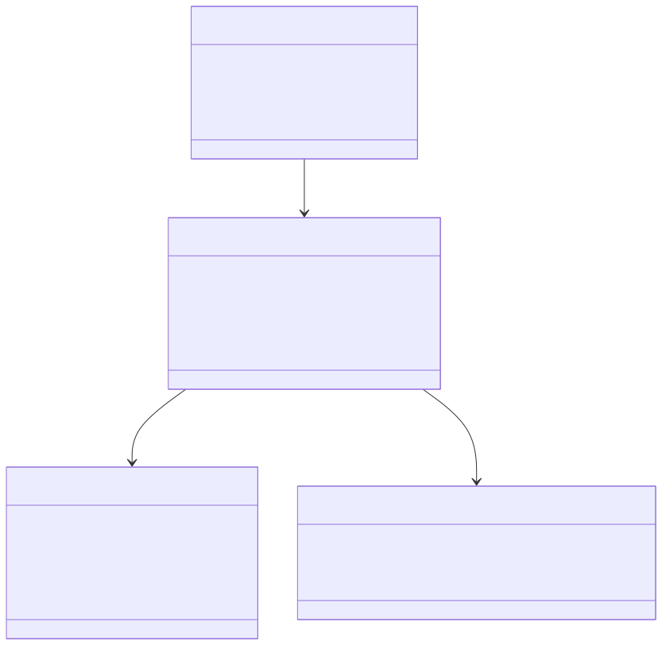
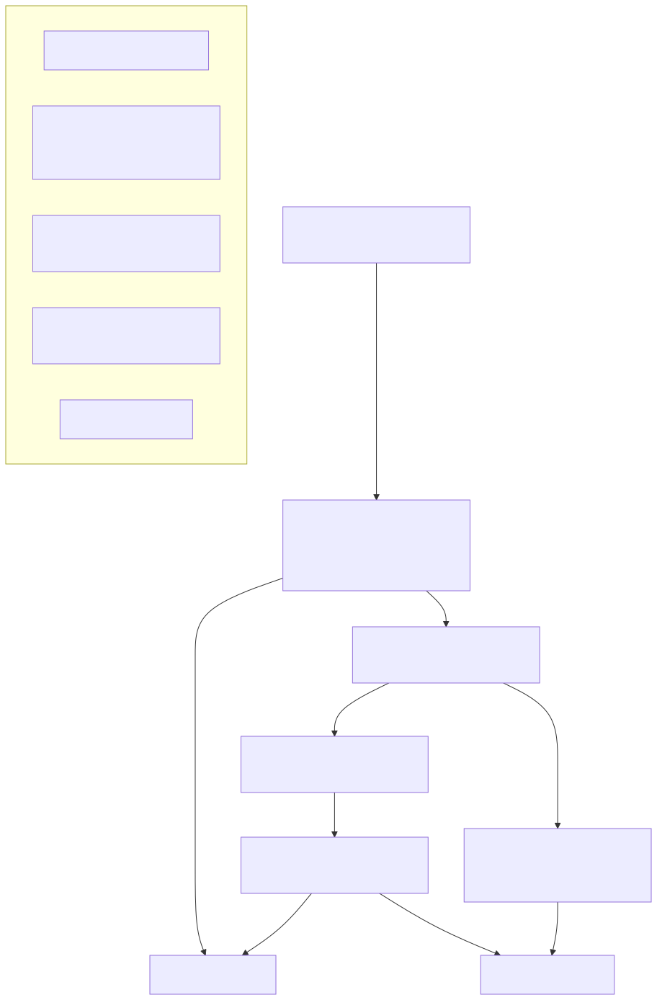

# LambdaJS — Standard Built-in Library

> **Part of the [LambdaJS detailed-design set](JS_00_Overview.md).** This document is the catalog of standard built-in objects and their semantics: the spec-table built-in registry, Object/Reflect, the Symbol builtin and well-known symbols, JSON, Math/Number, Date, String prototype methods (survey), the Map/Set/WeakMap/WeakSet collection family, Proxy & Reflect, BigInt, the global functions, template literals, and `globalThis`.
>
> **Primary sources:** `lambda/js/js_builtin_catalog.def` (single target/binding/global catalog), `lambda/js/js_builtin_catalog.hpp` (typed generated records), `lambda/js/js_runtime_builtin_registry.cpp` (validation, realm identity, installation), `lambda/js/js_globals.cpp` (Object/JSON/Symbol/Date/globalThis/global functions/template raw), `lambda/js/js_runtime.cpp` (typed intrinsic bodies, collections, Proxy traps, Math/JSON object getters, `$262`, WeakRef), `lambda/js/js_coerce.cpp` (`ToPrimitive`).
> **Audience:** engine developers. **Convention:** `file:line` references drift; confirm against symbol names.
>
> **Coordination:** property/prototype/descriptor mechanics and observable member `Get -> Call` are owned by [JS_06 — Objects, Properties & Prototypes](JS_06_Objects_Properties_Prototypes.md); this doc links rather than re-deriving them. Symbol *key-encoding* (`__sym_N`) lives in JS_06 §9. TypedArrays/ArrayBuffer/DataView/Atomics are [JS_12](JS_12_TypedArrays.md); RegExp is [JS_11](JS_11_RegExp.md) — both linked, not covered here.

---

## 1. Purpose & scope

LambdaJS ships the ES2020+ standard library as native C++ that operates on Lambda `Item` values. There is no self-hosted JS prelude. Under **D6.2.1 and D6.2.2v2**, every builtin is a realm-local function value whose typed `[[Call]]` and optional `[[Construct]]` targets are fixed when the value is created. Catalog IDs, display names, formal lengths, and owner groups are linking/reflection metadata; none selects the runtime algorithm. Namespace, constructor, prototype, and global bindings are installed as ordinary properties during realm construction ([§13](#13-globalthis-a-snapshot)).

The coverage notes below are grounded in the spec tables and the namespace getters actually present in the code; where a method count is large the doc gives a representative sample and cites the table rather than enumerating every entry.

---

## 2. Built-in target/binding catalog and realm installation

`js_builtin_catalog.def` expands into three related record sets rather than parallel registries:

- `JsIntrinsicTargetSpec` stores a stable catalog/link ID plus typed call and construct bodies and optional MIR-lowering metadata. A target must have at least one executable capability.
- `JsBuiltinMethodSpec` stores owner, property spelling, target ID, observable arity/name, property kind/attributes, and an explicit identity-alias key.
- `JsBuiltinGlobalSpec` stores each namespace, function, or constructor binding and its target/capability policy.

The catalog validator builds bounded hash indexes for owner/property and ID lookup and rejects missing targets, duplicate owner/property bindings, incompatible aliases, duplicate IDs, and invalid call/construct matrices. `make test-js-callable-catalog` and `utils/js_callable_census.py --check` are standing structural gates.

Installation is construction-time only. `js_install_builtin_method_specs`, `js_install_builtin_function_specs`, and `js_install_builtin_accessor_specs` materialize typed function values and define ordinary properties with catalog attributes. `js_intrinsic_binding_get` uses a precisely rooted, realm-owned identity slot for one binding; only rows carrying the same explicit alias key share a JavaScript function object. Sharing a native body or catalog target does not imply `===`.

Runtime property misses never consult this catalog and never fabricate methods. `js_builtin_catalog_find` remains a construction/linking lookup and uses the owner/property hash index rather than a per-call linear name scan. Once installed, deletion, replacement, accessors, Proxy traps, and descriptor queries flow through the ordinary property model in JS_06. Invocation reads the loaded function's stored entry; there is no semantic builtin dispatcher.

---

## 3. Object & Reflect

**Object** static bindings use catalog owner `JS_BUILTIN_OWNER_OBJECT_STATIC_METHOD` (23 entries): `keys`/`values`/`entries`/`fromEntries`, `create`, `assign`, `freeze`/`isFrozen`/`seal`/`isSealed`/`preventExtensions`/`isExtensible`, `is`, `getPrototypeOf`/`setPrototypeOf`, `defineProperty`/`defineProperties`, descriptor/name/symbol queries, `hasOwn`, and `groupBy`. `Object.prototype` uses `JS_BUILTIN_OWNER_OBJECT_PROTOTYPE_METHOD` for `hasOwnProperty`, `propertyIsEnumerable`, `toString`, `valueOf`, `isPrototypeOf`, `toLocaleString`, and the legacy getter/setter helpers. The heavy descriptor algorithm and enumeration filters live in `js_globals.cpp` and are owned by **JS_06 §7 / §9**.

**Reflect** uses catalog owner `JS_BUILTIN_OWNER_REFLECT_METHOD` for the full 13-method surface: `apply`, `construct`, `defineProperty`, `deleteProperty`, `get`, `getOwnPropertyDescriptor`, `getPrototypeOf`, `has`, `isExtensible`, `ownKeys`, `preventExtensions`, `set`, `setPrototypeOf`. Reflect.get/set are receiver-aware: `js_reflect_get_with_receiver` installs a `ScopedProxyReceiver` then defers to `js_property_get`, so accessor `this`-binding and Proxy forwarding match the ordinary path.

---

## 4. Symbol (builtin object & well-known symbols)

A JS Symbol *value* is a negative INT (`-(id + JS_SYMBOL_BASE)`; `js_make_symbol_item`, `js_globals.cpp:16585`); the *property-key* encoding to `__sym_N` strings is JS_06 §9. This section covers the `Symbol` builtin object.

- **Well-known symbols** use fixed ids 1–13: `iterator=1`, `toPrimitive=2`, `hasInstance=3`, `toStringTag=4`, `asyncIterator=5`, `species=6`, `match=7`, `replace=8`, `search=9`, `split=10`, `unscopables=11`, `isConcatSpreadable=12`, `matchAll=13` (`#define`s at `js_globals.cpp:16552`). `js_populate_symbol_ctor` (`:16603`) installs them as non-writable/non-enumerable/non-configurable own properties of the `Symbol` constructor per ES §19.4.2.
- **Symbol prototype** and static bindings use the corresponding `JS_BUILTIN_OWNER_SYMBOL_*` catalog owners.
- **Global symbol registry** for `Symbol.for`/`Symbol.keyFor` is a string-keyed `HashMap` of `JsSymbolEntry {char key[128]; uint64_t symbol_id;}` (`:16517`), with ids issued from `js_symbol_next_id` starting at 100 (`:16522`) so they never collide with the reserved 1–99 range. `js_symbol_for` (`:16657`) interns; descriptions are tracked in a parallel `js_symbol_desc_registry` (`:16532`).

`Symbol.toStringTag` is consumed throughout: namespace objects stamp `__sym_4` to "JSON"/"CSS"/etc. (`js_runtime.cpp:25072`, `:25106`), and collection prototypes set it to "Map"/"Set"/… (`:4325`).

---

## 5. JSON

Catalog owner `JS_BUILTIN_OWNER_JSON_METHOD` supplies `parse`, `stringify`, plus the `rawJSON`/`isRawJSON` proposal methods. The JSON namespace object (`js_get_json_object_value`) is an ordinary object whose `[[Prototype]]` is set to `Object.prototype` and tagged with `Symbol.toStringTag` = "JSON".

- **parse** — `js_json_parse` (`js_globals.cpp:12129`) reuses the host JSON input parser to build a Lambda tree. `js_json_parse_full` (`:12256`) layers the **reviver**: it wraps the result in a `{"": value}` holder and walks bottom-up via `js_json_revive` (`:12204`), invoking the reviver with `(key, value)` and a reviver-context (source-text aware) per the ES `JSON.parse` source proposal (`js_json_make_reviver_context`, `:12168`).
- **stringify** — `js_json_stringify_full(value, replacer, space)` (`:12672`); the plain arity-1 form is `js_json_stringify` → `_full(value, ItemNull, ItemNull)` (`:12797`). The recursive serializer `js_stringify_value` (`:12438`) applies a **replacer function** (called with `(key, value)`, `:12456`) or a **replacer array** PropertyList (`:12617`), and honors a **space/gap** indent string built once at the top. BigInt values throw a TypeError (`:12506`); `Symbol`-typed values are dropped.

---

## 6. Math & Number

**Math** is a realm-local ordinary object (`js_get_math_object`) with `[[Prototype]]` = Object.prototype. It installs the numeric **constants** `PI`, `E`, `LN2`, `LN10`, `LOG2E`, `LOG10E`, `SQRT2`, `SQRT1_2` and the `JS_BUILTIN_OWNER_MATH_METHOD` bindings (~35 methods spanning arithmetic, roots/powers, logarithms, trigonometry, `random`, `clz32`, `fround`, and `imul`).

**Number** prototype and static bindings use `JS_BUILTIN_OWNER_NUMBER_PROTOTYPE_METHOD` and `JS_BUILTIN_OWNER_NUMBER_STATIC_METHOD`. The former includes radix-aware `toString`, `valueOf`, `toLocaleString`, `toFixed`, `toPrecision`, and `toExponential`; the latter includes `isFinite`, `isNaN`, `isInteger`, `isSafeInteger`, `parseInt`, and `parseFloat`. Reusing a native target does not share function identity unless an alias row explicitly says so.

---

## 7. Date

A Date instance is an **ordinary `MAP_KIND_PLAIN` object** carrying a string-keyed `__time__` slot that stores epoch-milliseconds as a FLOAT (`js_date_new`, `js_globals.cpp:1522`); `js_class_stamp(obj, JS_CLASS_DATE)` plus a legacy `__class_name__` give it `instanceof` identity, and its prototype is linked to `Date.prototype` (`js_date_set_instance_prototype`, `:1514`). Construction from a value/string/component-list is `js_date_new_from` (`:1542`) and friends, all applying `TimeClip` (`|v| > 8.64e15` → NaN, `js_date_time_clip`).

All instance target bodies reuse **`js_date_method(date_obj, method_id)`**: it reads `__time__`, TypeErrors on a non-Date receiver, then a lower algorithm ID computes getters/`toString`/`toISOString` and Invalid-Date cases. This algorithm ID is fixed by the selected typed target and is not derived from a property name. Setters route through `js_date_setter`; prototype/static bindings use `JS_BUILTIN_OWNER_DATE_PROTOTYPE_METHOD` and `JS_BUILTIN_OWNER_DATE_STATIC_METHOD` (`now`, `parse`, `UTC`).

---

## 8. String prototype methods (survey)

`JS_BUILTIN_OWNER_STRING_PROTOTYPE_METHOD` is the largest prototype binding group (~48 entries sampled): the search/slice family, case/trim (with explicit `trimLeft`/`trimRight` identity aliases), RegExp-aware methods, padding/concat/normalize, well-formedness, and legacy HTML wrappers. Static bindings (`fromCharCode`, `fromCodePoint`, `raw`) use `JS_BUILTIN_OWNER_STRING_STATIC_METHOD`. Primitive method lookup is ordinary boxing/prototype property access (JS_06 §5/§8), not string-name dispatch.

---

## 9. Collections — Map / Set / WeakMap / WeakSet

All four collections share one backing structure, `JsCollectionData` (`js_runtime.cpp:318`): a `HashMap* hmap` of `JsCollectionEntry {key,value}` (SameValueZero compare/hash via `js_collection_compare`, `:16907`), an `int type` (`JS_COLLECTION_MAP`/`JS_COLLECTION_SET`), an `is_weak` flag, and an **insertion-order doubly-linked list** (`order_head`/`order_tail` of `JsCollectionOrderNode`, `:310`). The `JsCollectionData*` is attached to a plain Map via a `__cd` string slot (`js_collection_create`, `js_runtime.cpp:16995`+); `js_collection_link_prototype` (`:17010`) wires the instance to the right `*.prototype`.

`js_collection_method(obj, method_id, arg1, arg2)` is the shared lower algorithm for set/add, get, has, delete, clear, forEach, and iterators. The hashmap is the membership/value store; the order list is maintained in parallel so iteration and `forEach` preserve insertion order. Per-class bindings use the `JS_BUILTIN_OWNER_MAP_*`, `SET_*`, `WEAKMAP_*`, and `WEAKSET_*` catalog owners. The `size` accessor and receiver guards live in their typed target bodies; the lower operation ID is reached only after that stored target is selected.

**Weak-semantics caveat.** `js_weakmap_new`/`js_weakset_new` (`js_runtime.cpp:32476`) build an ordinary collection and merely set `cd->is_weak = true`; the only behavioral differences are the `js_can_be_held_weakly` key check (`:17201`) and the receiver guards. There is **no real weak GC behavior** — entries are held strongly by the same `hmap`/order list as a normal Map/Set and are never collected while the collection is live. `WeakRef`/`FinalizationRegistry` are likewise stubbed: `WeakRef` stores its target in a strong `__weakref_target__` slot (`:32496`) and `deref` always returns it.

---

## 10. Proxy & Reflect

A Proxy is a `MAP_KIND_PROXY` object whose `Map.data` is a `JsProxyData {uint64_t target; uint64_t handler; uint64_t private_slots; bool revoked;}` (`js_runtime.h:815`; Items stored as `uint64_t` for C-header compatibility, unpacked via the `PD_TARGET`/`PD_HANDLER` macros, `js_runtime.cpp:347`). `js_proxy_get_target` unwraps nested proxies up to depth 32 (`:360`).

All **13 traps** are implemented as `js_proxy_trap_*` (`js_runtime.cpp`): `get` (`:495`), `set`/`set_with_receiver` (`:570`/`:622`), `has` (`:631`), `delete` (`:670`), `ownKeys` (`:831`), `getOwnPropertyDescriptor` (`:937`), `defineProperty` (`:1030`), `getPrototypeOf` (`:1134`), `setPrototypeOf` (`:1165`), `isExtensible` (`:1199`), `preventExtensions` (`:1220`), `apply` (`:1242`), `construct` (`:1260`). Each: fetches the named trap from the handler (`js_proxy_get_trap`, `:411`); if absent, **forwards to the target** (wrapping a `ScopedProxyReceiver` so accessor `this` and prototype-walk receivers survive); if present, calls `trap(target, key, …)` on the handler and then enforces the **ES2020 §9.5 invariant checks** against the target's own descriptor (e.g. the get-trap must return the target's value for a non-configurable/non-writable data property, `:520`). Exotic GET/SET on a Proxy is routed here from the property pipeline's exotic gate (JS_06 §4). `Proxy.revocable` (statics `JS_PROXY_STATIC_METHOD_SPECS`, `js_runtime_builtin_registry.cpp:609`) flips `pd->revoked`, after which traps throw.

---

## 11. BigInt (Decimal-backed)

A BigInt is a Lambda `LMD_TYPE_DECIMAL` value; `js_is_bigint` checks that representation while `js_global_is_bigint` additionally distinguishes `DECIMAL_BIGINT` from arbitrary-precision decimal values. Mixed BigInt/Number arithmetic throws and `typeof` reports `"bigint"`. Per **D6.2.2v2**, the `BigInt` global has typed `[[Call]]` and `[[Construct]]` entries: the latter exists for `IsConstructor`/`extends` but rejects before argument coercion. Prototype/static bindings use the `JS_BUILTIN_OWNER_BIGINT_*` catalog owners.

---

## 12. Global functions

Installed as own properties of `globalThis` from the `global_fns` table (`js_globals.cpp:14380`): `parseInt`/`parseFloat`/`isNaN`/`isFinite`, `eval`, the URI quartet `decodeURI`/`encodeURI`/`decodeURIComponent`/`encodeURIComponent`, the legacy `escape`/`unescape`, the timer/scheduling family (`setTimeout`/`setInterval`/`setImmediate`/`queueMicrotask`/`requestAnimationFrame` + clears), and the Web globals `structuredClone`/`fetch`. Core implementations: `js_parseInt` (`:3460`, accumulates as a double for large values), `js_parseFloat` (`:3582`, ES `StrDecimalLiteral` only — no hex/octal/binary), `js_isNaN` (`:3683`), `js_isFinite` (`:3699`); the URI codecs and `atob`/`btoa` are at `:13242`+. `Number.parseInt`/`Number.parseFloat` share these.

---

## 13. Template literals & tagged templates

Template literals are an AST/codegen concern. The parser builds `JsTemplateLiteralNode {quasis, expressions}` interleaving text `JS_AST_NODE_TEMPLATE_ELEMENT` nodes (each with a `cooked` String) and substitution expressions (`build_js_template_literal`, `build_js_ast.cpp:2671`); escape merging into adjacent quasis and the "invalid escape" tracking are handled there (`:2685`). A tagged form `tag\`…\`` is detected during call-building and lowered to a `JsTaggedTemplateNode {tag, quasi}` (`:601`), which at runtime passes the tag a template object exposing both cooked elements and a `.raw` array.

The library side is **`String.raw`** — `js_string_raw(args, argc)` (`js_globals.cpp:4810`): it reads `template.raw`, coerces `.length`, then concatenates `raw[i]` interleaved with `ToString(substitution)` (`:4855`). Detailed lowering of template literals into IR is in [JS_04 — MIR Lowering](JS_04_MIR_Lowering.md).

---

## 14. `globalThis` (a snapshot)

`js_get_global_this` (`js_globals.cpp:14301`) lazily builds the global object the first time it is requested and registers it as a GC root. It eagerly **snapshots** the entire standard surface as own properties: the value globals `undefined`/`NaN`/`Infinity` (marked non-writable/non-enumerable/non-configurable, `:14318`); the long `ctor_names` table of constructors fetched via `js_get_constructor` (`:14329`); the self-aliases `globalThis`/`self`/`window`/`global`; the namespace objects `Math`/`JSON`/`Reflect`/`Atomics`/`console`/`process`/`CSS` (`:14368`); the `global_fns` ([§12](#12-global-functions)); and the EventTarget/URL/timer Web extras. `ToPrimitive` ([JS_03](JS_03_Value_Model.md) / `js_coerce.cpp:74`) underpins the coercions many of these builtins perform.

Because the population is a one-time snapshot, the global object is **rebuilt only on batch reset** (`js_globals_batch_reset`, `:13916`), which clears `js_global_this_obj` along with the constructor/builtin-fn caches so per-file state never leaks. See [§15](#15-known-issues--future-improvements) for the snapshot-vs-live consequence.

The **`$262` host object** (`js_runtime.cpp:25189`+) is created on demand for the test262 harness, exposing `detachArrayBuffer`, `evalScript`, a `global` reference, and the agent/atomics scaffolding — engine plumbing, not a standard global.

---

## 15. Known Issues & Future Improvements

1. **Catalog indexes are fixed-capacity construction structures.** Owner/property and ID lookups use bounded open-addressed indexes built from the catalog. They are absent from ordinary property reads, but realm construction should still profile collision and startup cost as the catalog grows.
2. **`globalThis` is a snapshot, not live.** Standard constructors/namespaces are materialized once as own properties (`:14329`+). Reassigning e.g. `globalThis.Array` does not retroactively change earlier-cached references, and freshly mutated prototypes after the snapshot are not re-mirrored except across a full `js_globals_batch_reset`.
3. **WeakMap/WeakSet/WeakRef have no real weak semantics.** `is_weak` only gates a key-eligibility check; entries are retained strongly by the same hashmap + order list as strong collections (`js_runtime.cpp:32476`, `:17201`), and `WeakRef.deref` never clears (`:32496`). This is a correctness gap for finalization-observing code, accepted because it requires GC-integrated ephemeron support.
4. **`js_globals.cpp` remains large.** Many lower algorithms (Date operations, JSON serialization, descriptor validation) remain hand-written switches or ladders. These are selected by typed target bodies rather than catalog/name dispatch, but coherent algorithm-family extraction would improve ownership and reviewability.
5. **Host functions can terminate the process.** `process.exit` calls `exit(code)` (`js_globals.cpp:2360`) and `process.abort` calls `abort()` (`:2809`) directly — there is no embedder hook to intercept, so a script can hard-kill the host. *Improvement:* route through an injectable termination callback.
6. **Date carries duplicate identity metadata.** Instances keep both a `js_class` stamp and a legacy `__class_name__` string (`js_globals.cpp:1528`), the same dual-bookkeeping debt catalogued in JS_06 §11.
7. **Fixed-size string-registry keys.** `JsSymbolEntry.key`/`JsSymbolDesc.desc` are `char[128]` (`js_globals.cpp:16518`, `:16528`); symbol descriptions longer than 127 bytes are truncated in the `Symbol.for`/description registries.

---

## Appendix A — Source map

| File | Responsibility (this doc) |
|---|---|
| `lambda/js/js_builtin_catalog.def` | Single source for intrinsic targets, method/accessor bindings, aliases, and globals/constructors. |
| `lambda/js/js_builtin_catalog.hpp` | Typed target/binding/global record contracts generated from the catalog. |
| `lambda/js/js_runtime_builtin_registry.cpp` | Catalog validation/indexes, realm-owned binding identities, and property installation. |
| `lambda/js/js_globals.cpp` | Object/JSON statics & serialization, Symbol builtin + well-known/registry, Date representation & `js_date_method`, global functions, `String.raw`, `globalThis` construction & batch reset. |
| `lambda/js/js_runtime.cpp` | `JsCollectionData` & `js_collection_method`, the 13 `js_proxy_trap_*` + `JsProxyData`, Math/JSON/Reflect/CSS namespace getters, `$262` host, WeakRef/WeakMap. |
| `lambda/js/js_function.hpp` / `js_runtime.h` / `js_runtime_internal.hpp` | Callable capabilities/typed targets, `JsProxyData`, builtin contracts, BigInt and symbol helpers. |
| `lambda/js/js_coerce.cpp` | `ToPrimitive` / `OrdinaryToPrimitive` used by many builtins. |
| `lambda/js/build_js_ast.cpp` | Template-literal & tagged-template AST construction. |

## Appendix B — Related documents

- [JS_06 — Objects, Properties & Prototypes](JS_06_Objects_Properties_Prototypes.md) — property/descriptor mechanics, observable member `Get -> Call`, symbol key-encoding, enumeration filters, `Object.defineProperty`.
- [JS_03 — Value Model, Memory & GC Interop](JS_03_Value_Model.md) — `Item` representation, Decimal/BigInt tagging, `ToPrimitive` placement.
- [JS_05 — Functions & Closures](JS_05_Functions_Closures.md) — `JsFunction` call/construct capabilities, typed factories, bound functions.
- [JS_11 — RegExp](JS_11_RegExp.md) — String match/replace/search backing engine.
- [JS_12 — TypedArrays, Binary Data & Atomics](JS_12_TypedArrays.md) — ArrayBuffer/DataView/typed-array statics & accessors, Atomics.
- [JS_04 — MIR Lowering](JS_04_MIR_Lowering.md) — template-literal lowering.
