# LambdaJS — RegExp Engine

> **Part of the [LambdaJS detailed-design set](JS_00_Overview.md).** This document covers how JS regular expressions are compiled and matched: the `JsRegexData` storage, the three matching back-ends (plain RE2, RE2 + a post-filter wrapper, and a spec backtracking engine) and how a pattern is routed between them, the JS→RE2 transpilation and post-filter pipeline, named groups and `\u` escapes, `/d` match indices and `/v` set operations, the ES §22.2.2 backtracking matcher, the generated Unicode property tables, pattern caching, and the Annex B static properties (`$1`–`$9`).
>
> **Primary sources:** `lambda/js/js_regex_wrapper.{h,cpp}` (RE2 wrapper, `JsRegexCompiled`, post-filters, JS→RE2 rewrite, `/v` class rewrite), `lambda/js/js_regexp_compile.{h,cpp}` (flag/named-group frontend, named-backref + property-escape rewrites), `lambda/js/js_bt_regex.{h,cpp}` (backtracking matcher), `lambda/js/js_runtime.cpp` (`JsRegexData`, `js_create_regex`, `js_regex_exec`/`test`, `@@replace`/`@@match`/`@@split`, routing, lastIndex), `lambda/js/js_runtime_state.hpp` (`JsRegexpLastMatch`), the generated `*.inc` property tables.
> **Audience:** engine developers. **Convention:** `file:line` references drift; confirm against symbol names.

---

## 1. Purpose & scope

LambdaJS uses [RE2](https://github.com/google/re2) as its default regex engine — it is linear-time and immune to catastrophic backtracking, which matters for an embedded runtime. RE2 is not a JS engine, however: it lacks lookahead, lookbehind, and backreferences, and its *leftmost-longest* match semantics differ from ECMAScript's *leftmost-greedy*. The RegExp subsystem bridges that gap with a layered strategy: most patterns compile straight to RE2; patterns that need a JS-only assertion are rewritten to a wider RE2 pattern plus a chain of runtime post-filters that verify or trim the match; and the small set of patterns that no rewrite can express correctly (backreferences, hard lookbehind, nested lookaround) route to a compact, spec-faithful backtracking engine.

The pattern transpilation, flag parsing, the RegExp result object (`index`/`input`/`groups`), the `exec`/`test` kernels, and the `Symbol.replace`/`match`/`split` glue all live here. The RegExp *builtin object* (its prototype methods, the `Symbol`-keyed dispatch) is registered through the machinery in [JS_10 — Standard Built-in Library](JS_10_Builtins.md); the string-side entry points (`String.prototype.match`/`replace`/`split`/`matchAll`) are in [JS_10](JS_10_Builtins.md) as well and forward into the symbol protocols described in [§9](#9-symbolreplace--match--split).

---

## 2. Storage & flags

A compiled JS RegExp is an ordinary `Map` object (see [JS_06 — Objects, Properties & Prototypes](JS_06_Objects_Properties_Prototypes.md)) whose engine state hangs off a pool-allocated `JsRegexData` (`js_runtime.cpp:12257`). The struct holds, in priority order, the back-end the pattern was routed to plus the cached flag booleans:

- `re2` — a `re2::RE2*` for the direct path, or the wrapper's own RE2 when a wrapper is present.
- `wrapper` — a `JsRegexCompiled*` (`js_regex_wrapper.h:50`) when the pattern needs post-filters.
- `bt` — a `JsBtRegex*` when the pattern routed to the backtracking engine.
- `literal_pattern` / `literal_fast` — a plain substring fast path matched by `memcmp` with no RE2 at all.
- `special_property_kind` — a nonzero tag for a handful of hot shapes like `^\d+$` or `^\p{…}+$`, matched by a hand-written codepoint scan (`js_regex_detect_simple_property_repeat`, `js_runtime.cpp:12729`).
- flag booleans `global`, `ignore_case`, `multiline`, `sticky`, `has_indices`, `unicode`, plus `needs_utf16_subject` (legacy surrogate escapes that must match against a UTF-16-expanded subject).

The eight standard flags are parsed once in `js_regexp_compile_frontend` (`js_regexp_compile.cpp:176`): `d g i m s u v y`, each rejected if duplicated, with `u` and `v` mutually exclusive, and re-emitted in the ES2024 §22.2.5.4 canonical order `dgimsuvy` into `canonical_flags`. `lastIndex` is stored as an ordinary writable, non-enumerable, non-configurable data property on the Map (`js_runtime.cpp:15388`), not inside `JsRegexData`, so observable reads/writes flow through the normal property path.

---

## 3. The three back-ends and routing

`js_create_regex` (`js_runtime.cpp:14400`) picks exactly one back-end per pattern. The decision is made *before* RE2 preprocessing because that preprocessing destroys the very constructs the choice depends on (it rewrites named groups and would drop forward backreferences):

1. **Spec backtracking engine** (`bt`) — chosen when `js_regex_needs_backtrack` (`js_runtime.cpp:13743`) returns true. That predicate fires on a numeric or named backreference outside a class, a lookahead whose body contains a capturing group (RE2 cannot surface those captures), a *hard* lookbehind (body with a capture, backref, nested assertion, alternation, or variable-length quantifier), and the nullable-discard quantifier shape (an optional-but-not-unbounded group under a `*`/`+`/`{`, e.g. `(a?b??)*`) that RE2 mishandles. The route is decided on `effective_pattern` at `js_runtime.cpp:14697`. If `js_bt_compile` fails, the code logs and falls through to the RE2 paths.
2. **RE2 + post-filter wrapper** (`wrapper`) — chosen when `js_regex_needs_wrapper` (`js_runtime.cpp:13687`) returns true: any lookahead `(?=…)`/`(?!…)`, any lookbehind `(?<=…)`/`(?<!…)`, or a `\1`–`\9` backreference. `js_regex_wrapper_compile` rewrites the pattern and attaches filters ([§4](#4-jsre2-transpilation--the-post-filter-pipeline)). If the wrapper cannot be built it falls back to direct RE2.
3. **Plain RE2** — the default for every linear-time pattern. As a last-resort safety net the direct path strips any lookbehind that survived to compile time so RE2 still produces an (approximate) match rather than throwing (`js_runtime.cpp:15254`).

Two non-RE2 shortcuts sit in front: a literal-substring fast path (`literal_fast`, no flags, no metacharacters) and the `special_property_kind` codepoint scanner. `js_regex_match_internal` (`js_runtime.cpp:13353`) is the single dispatch point — it tests `special_property_kind`, then `literal_fast`, then `bt`, then `wrapper && has_filters`, then falls through to a direct `re2->Match`. `js_regex_num_groups` (`js_runtime.cpp:13341`) mirrors that ordering to report the correct capture count for each back-end.

---

## 4. JS→RE2 transpilation & the post-filter pipeline

The wrapper's strategy is "match wider, then post-filter" (`js_regex_wrapper.h:1`). `rewrite_pattern` (`js_regex_wrapper.cpp:1322`) is the heart of it. It first runs a prepass that rewrites constructs RE2 rejects but JS accepts: empty class `[]` → `(?!)` (never matches), `[^]` → `[\s\S]`, JS `.` → `[^\n\r\x{2028}\x{2029}]` (or `[\s\S]` under `s`), and `\b` *inside* a class → `\x08` backspace. `scan_assertions` (`js_regex_wrapper.cpp:348`) then collects every assertion and backreference, processed right-to-left so byte positions stay valid as the string is edited. Each assertion lowers to a RE2-compatible fragment plus a `JsRegexFilter` (`js_regex_wrapper.h:39`); the filter enum `JsRegexFilterType` (`js_regex_wrapper.h:28`) is:

- **`JS_PF_TRIM_GROUP`** — a trailing positive lookahead `X(?=Y)` becomes `X(Y)`; the synthetic group `Y` is captured so its content is available to later backreferences, then *trimmed* from the match end at runtime.
- **`JS_PF_ASSERT_AT_MARKER`** — a zero-width positive lookahead `(?=Y)` becomes an empty marker group `()`; the filter re-checks that `Y` matches anchored at the marker position.
- **`JS_PF_REJECT_MATCH`** — a negative lookahead `(?!Y)X` or `X(?!Y)` inserts a marker group and rejects the whole match if the rejection pattern matches at the boundary.
- **`JS_PF_LOOKBEHIND`** — `(?<=Y)`/`(?<!Y)` inserts a marker, compiles `Y` to an unanchored RE2 (`compile_lookbehind_re`, `js_regex_wrapper.cpp:453`), and at runtime requires (or, for `lb_negative`, forbids) `Y` to match ending at the marker byte offset.
- **`JS_PF_GROUP_EQUALITY`** — a backreference `\N` is rewritten to a fresh wide capture `(.+)` and the filter requires `group[a] == group[b]`.

After all rewrites the synthetic-group RE2 indices are reconciled and `group_remap` (original JS group index → rewritten RE2 index) is built so callers can map captures back. At match time `js_regex_wrapper_exec` (`js_regex_wrapper.cpp:2346`) runs `RE2::Match` and verifies each filter; `has_filters` short-circuits the whole post-processing path when zero filters exist.

Backreferences are the hard case because RE2 cannot constrain the wide `(.+)` to equal the referenced group. When any `JS_PF_GROUP_EQUALITY` filter is present, `js_regex_wrapper_exec` runs a **two-pass retry loop** (`js_regex_wrapper.cpp:2368`): pass 1 matches with the wide capture to discover candidate content, then it re-matches with the literalized backref, trying candidate captures longest-to-shortest, advancing the start position and retrying when a candidate fails. This recovers JS greedy semantics that the single widened RE2 pattern would otherwise lose.

---

## 5. Named groups & Unicode escapes

JS named groups `(?<name>…)` and named backreferences `\k<name>` are normalized in several passes before RE2 ever sees them:

- **`\u` decoding in names** — escaped identifier characters inside a `(?<…>` or `\k<…>` region are decoded so an escaped name validates, compiles, and keys the `groups` object identically to a literal name (`js_regex_decode_name_escapes`, called at `js_runtime.cpp:14444`). The original source is preserved for `.source` and the cache.
- **Named-backref rewrite** — `js_regexp_rewrite_named_backrefs` (`js_regexp_compile.cpp:252`) resolves each `\k<name>` to its group's ordinal and rewrites it to a numeric `\N` when that ordinal is 1–9, so the downstream engines only ever handle numeric backrefs in the common case.
- **RE2 name aliasing** — RE2's group-name grammar is narrower than ECMAScript's `IdentifierName`. When a JS name is not RE2-legal (e.g. `$<astral>`), the named group is compiled under a safe alias `JsCapN` and mapped back when the public `groups` object is built (`js_runtime.cpp:15185`); `js_regex_original_group_name` reverses the alias.
- **Validation** — `js_regexp_scan_named_groups` (`js_regexp_compile.cpp:38`) enforces valid identifiers, rejects duplicate names, and (under `u`/`v`) rejects backreferences to undefined names; `js_regex_named_groups_valid` adds an ECMAScript `IdentifierName` check that RE2's permissive Unicode validation would let through.

The backtracking engine parses `(?<name>…)` natively, so when a pattern routes to `bt` the result `groups` object is built from `js_bt_named_count`/`js_bt_named_name`/`js_bt_named_index` (`js_runtime.cpp:15910`) instead of from RE2's `NamedCapturingGroups`.

---

## 6. `/d` match indices & `/v` set operations

**`/d` (indices).** When the `d` flag is set, `has_indices` is recorded and `js_regex_attach_indices` (`js_runtime.cpp:15893`) builds the ES2022 `indices` array: a `[start, end]` pair per group (`js_regex_make_indices_pair`), an `indices.groups` object for named captures, and `undefined` for non-participating groups. Offsets are reported in UTF-16 code units whenever the subject is non-ASCII, matching `exec`'s `index` basis.

**`/v` (unicode sets).** The `v` flag enables nested character classes, the set operators `--` (difference) and `&&` (intersection), and `\q{…}` quoted-string alternation. Validation routes through `js_regex_wrapper_validate_unicode_sets` (`js_regex_wrapper.cpp:80`). Because RE2 has none of these, `rewrite_v_flag_classes` (`js_regex_wrapper.cpp:1115`) runs *first* in `rewrite_pattern`, flattening `/v` classes into ordinary RE2 syntax before the rest of the pipeline sees them; intersection is expressed via a lookahead idiom `(?:(?=[B])[A])` (`js_runtime.cpp:14663`). Property escapes inside `/v` classes resolve through the shared property-range lookup ([§8](#8-unicode-property-tables)).

---

## 7. The backtracking matcher

`js_bt_regex.cpp` is a compact implementation of ECMA-262 §22.2.2 semantics (`js_bt_regex.cpp:2`). It compiles the *normalized* pattern — `\u` already lowered, shorthands expanded, but named groups and backreferences still spelled out — into an `RxNode` AST (`js_bt_compile`, `js_bt_regex.h:42`), all arena-allocated from the supplied `Pool`.

Matching uses the spec's **Matcher / Continuation (CPS)** model. `bt_run`/`bt_match`/`bt_match_disj`/`bt_repeat` (`js_runtime`-style mutual recursion, `js_bt_regex.cpp:676`) thread a `Cont` continuation chain and a **direction** `dir` through a shared `MatchCtx` (`js_bt_regex.cpp:651`). Direction is `+1` normally and flips to `-1` inside a lookbehind body (`RX_LOOK` with `look_behind`, `js_bt_regex.cpp:911`), which is exactly how the spec evaluates lookbehind right-to-left while still recording captures. Captures live in a flat `cap_start`/`cap_end` array saved and restored on backtracking. The nullable-quantifier rule — discard an empty optional iteration — is implemented in the `C_REPEAT` continuation (`if rep_min == 0 && pos == rep_start return -1`, `js_bt_regex.cpp:702`). Simple single-codepoint atoms repeat iteratively rather than recursively to avoid stack blowups on long inputs (`bt_simple_atom`, `js_bt_regex.cpp:711`).

Two budgets bound runtime so a pathological pattern degrades gracefully instead of hanging or overflowing the C stack: a **step budget** of 8,000,000 and a **recursion-depth budget** of 5,000, both set in `js_bt_exec` (`js_bt_regex.cpp:1018`). Exhausting either sets `overflow`, which bails the whole match to "no match" with a debug log (`js_bt_regex.cpp:1038`) — the engine never throws on budget exhaustion. `js_bt_exec` mirrors `js_regex_wrapper_exec`'s contract exactly: UTF-8 byte offsets, group 0 is the whole match, `-1` for non-participating groups, and it only begins a match at a UTF-8 codepoint boundary.

---

## 8. Unicode property tables

`\p{…}`/`\P{…}` property escapes are served from two generated includes that are pulled directly into `js_runtime.cpp` and `js_regex_wrapper.cpp` and must not be hand-edited:

- **`js_regex_generated_property_tables.inc`** (~7,850 lines) — generated from the Test262 `property-escapes/generated` corpus. Each `JsRegexGeneratedPropertyTable` is a `{name, ranges, count}` triple of inclusive codepoint ranges (`JsRegexRange`). `js_regex_wrapper_lookup_property_ranges` (`js_runtime.cpp:12709`) does a linear name match and copies the `(lo, hi)` pairs out; it is the single bridge the `/v` rewriter calls to expand a property into a class.
- **`js_regex_string_properties.inc`** (~8,140 lines) — the `/v` *string* properties (`Basic_Emoji`, `RGI_Emoji`, …, `JsVFlagStringProperty`), which can match multi-codepoint strings and are only meaningful under `v`.

Before lookup, alias and value-pair forms are canonicalized by `js_regexp_canonicalize_property_escapes` (`js_regexp_compile.cpp:439`): `General_Category=Letter` → `\p{L}`, the long script names → their canonical spelling, and a few escapes (notably `Script_Extensions=Greek`) are expanded inline to an explicit codepoint class. Common ASCII shorthands (`^\d+$`, `^\w+$`, `^\s+$` and their negations) and a handful of `\p{…}+` shapes are recognized as `special_property_kind` ([§2](#2-storage--flags)) and matched without RE2 at all.

---

## 9. `Symbol.replace` / `match` / `split`

The string methods delegate to the RegExp object via the well-known symbol protocols (these tie into the symbol-as-key model in [JS_06](JS_06_Objects_Properties_Prototypes.md) and the iterator/`Symbol` machinery in [JS_08 — Iterators & Generators](JS_08_Iterators_Generators.md) and [JS_10 — Standard Built-in Library](JS_10_Builtins.md)):

- **`js_regexp_symbol_replace`** (`js_runtime.cpp:16356`) — implements `RegExp.prototype[@@replace]`, including the `$$`/`$&`/`` $` ``/`$'`/`$N`/`$<name>` substitution grammar (`js_runtime.cpp:19290`) and a functional-replacement branch. It carries a fast path (`js_try_fast_replace_non_whitespace`) for the common global, own-`g`-flag, non-functional case, and a `utf16_replace` unit basis so non-ASCII subjects don't split multi-byte sequences.
- **`js_regexp_symbol_match`** (`js_runtime.cpp:16281`) — resets `lastIndex`, then for a global regex loops `RegExpExec`, advancing `lastIndex` by one on an empty match to avoid an infinite loop.
- **`js_regexp_symbol_split`** (`js_runtime.cpp:16677`) — drives a sticky clone of the regex with `AdvanceStringIndex` semantics.

All three observe and write `lastIndex` through the strict spec helper `js_regex_set_lastindex_strict` (`js_runtime.cpp:15804`), which throws a TypeError when `lastIndex` has been made non-writable. `js_regex_exec` (`js_runtime.cpp:15961`) is the shared engine: it reads `lastIndex` via `ToLength` (which can fire `valueOf`), uses it only for global/sticky regexes, matches via `js_regex_match_internal`, updates `lastIndex` to the match end (never auto-advancing on a zero-length match — callers own that), refreshes the static properties, and builds the result array. `js_regex_test` (`js_runtime.cpp:15711`) is a lighter sibling that returns a boolean.

---

## 10. Pattern caching & legacy static properties

**Caching.** Regex *literals* re-evaluate the same AST-owned `pattern`/`flags` pointers on every pass, so `js_create_regex` keys a compile cache `g_regex_compile_cache` on pointer identity (`js_regex_cache_key` XORs the two pointers, `js_runtime.cpp:12300`). A hit whose `source` pointer and length match skips the entire frontend-validation and compile pipeline and rebuilds the Map from the cached `JsRegexData` via `js_regex_build_object_from_cache` (`js_runtime.cpp:13846`). `new RegExp(runtimeString)` does not benefit — its strings are fresh allocations. A separate single-slot `g_regex_property_cache_*` memoizes the last property-name validation result. `js_regex_cache_reset` (`js_runtime.cpp:12304`) clears both between runs.

**Legacy static properties.** Annex B exposes `RegExp.$1`–`$9`, `RegExp.lastMatch` (`$&`), `RegExp.lastParen`, `RegExp.leftContext`/`` $` ``, `RegExp.rightContext`/`$'`, and `RegExp.input` as constructor-level state reflecting the most recent successful match. The backing store is the `JsRegexpLastMatch` struct (`js_runtime_state.hpp:12`) — input string, matched substring, up to `JS_REGEXP_MAX_PAREN` group strings, group count, and match start/end. Every successful `js_regex_exec` and `js_regex_test` calls `js_regexp_update_last_match` (`js_runtime.cpp:12218`) to refresh it, and the constructor's property getter reads from it (`js_runtime.cpp:4078`); `leftContext`/`rightContext` are sliced from the stored input on demand.

---

## Known Issues & Future Improvements

1. **RE2 leftmost-longest ≠ JS leftmost-greedy.** RE2's match semantics differ from ECMAScript's greedy/backtracking model. For most patterns the result is identical, but the wrapper's backreference two-pass (`js_regex_wrapper.cpp:2368`) exists precisely because the widened RE2 pattern can choose a shorter referenced capture than JS would; it papers over the mismatch for backrefs that share one referenced group but does not generalize to every greedy-vs-longest divergence.
2. **Lookbehind limits on the RE2 path.** Wrapper lookbehind compiles its body to an *unanchored* RE2 slice and checks a boundary offset (`compile_lookbehind_re`, `js_regex_wrapper.cpp:453`); bodies with captures, backreferences, `\b`/`\B`, alternation, or variable length are deliberately *not* handled here — `js_regex_needs_backtrack` routes those to the `bt` engine instead. A lookbehind that reaches the *direct* RE2 fallback is silently stripped (`js_runtime.cpp:15254`), yielding an approximate match rather than a SyntaxError.
3. **`/v` gaps.** The `/v` rewriter flattens nested classes and set operators into RE2 syntax (`rewrite_v_flag_classes`, `js_regex_wrapper.cpp:1115`), and the string-property tables only matter under `v`; multi-codepoint `\q{…}` alternation and full `/v` string-set semantics are an area where coverage against Test262 should be re-verified rather than assumed complete.
4. **Backtracking-engine coverage & routing.** The `bt` engine is a *fallback*, entered only when `js_regex_needs_backtrack` fires; the routing heuristic is conservative (e.g. it intentionally keeps unbounded-nullable shapes like `(.*\n?)*` on RE2 to avoid catastrophic backtracking, `js_runtime.cpp:13749`). A pattern the heuristic misroutes to RE2 can therefore produce a wrong capture; and a genuinely pathological pattern that reaches `bt` bails to "no match" once the 8M-step / 5000-depth budget is hit (`js_bt_regex.cpp:1018`), which is a silent non-match rather than a spec-mandated result.
5. **Property-escape memory.** The two generated `.inc` tables are large (~16K lines combined) and compiled into the binary; lookups are linear scans over the table array (`js_runtime.cpp:12714`). *Improvement:* index the tables by name (sorted + bsearch or a hash) and consider sharing range storage between aliases.
6. **Fixed capture ceilings.** Several buffers are fixed-size: `JS_REGEX_MAX_GROUPS == 256` (`js_regex_wrapper.h:25`), `JS_REGEX_MAX_FILTERS == 16` (`js_regex_wrapper.h:20`), `scan_assertions` accepts at most 32 assertions, and `js_bt_exec` falls back when groups exceed 256 (`js_bt_regex.cpp:1011`). Patterns past these limits silently lose captures or fail to route.

---

## Appendix A — Source map

| File | Responsibility (this doc) |
|---|---|
| `lambda/js/js_regex_wrapper.{h,cpp}` | RE2 wrapper, `JsRegexCompiled`, `JsRegexFilter`/`JS_PF_*`, `scan_assertions`/`rewrite_pattern`, `/v` class rewrite, lookbehind compile, two-pass backref exec. |
| `lambda/js/js_regexp_compile.{h,cpp}` | Flag parse + canonical order, named-group validation, `\k<name>` → numeric rewrite, property-escape/alias canonicalization. |
| `lambda/js/js_bt_regex.{h,cpp}` | ES §22.2.2 backtracking matcher (`JsBtRegex`, Matcher/Continuation, direction, step + depth budgets). |
| `lambda/js/js_runtime.cpp` | `JsRegexData`, `js_create_regex`/`js_create_regexp_from_source`, routing (`js_regex_needs_backtrack`/`needs_wrapper`), `js_regex_exec`/`test`, `@@replace`/`@@match`/`@@split`, `/d` indices, caching, static-property updates. |
| `lambda/js/js_runtime_state.hpp` | `JsRegexpLastMatch` storage for `$1`–`$9` / `lastMatch` / context. |
| `lambda/js/js_regex_generated_property_tables.inc` | Generated `\p{…}` codepoint-range tables (do not edit). |
| `lambda/js/js_regex_string_properties.inc` | Generated `/v` string-property tables (do not edit). |

## Appendix B — Related documents

- [JS_06 — Objects, Properties & Prototypes](JS_06_Objects_Properties_Prototypes.md) — the Map/shape backing the RegExp object, `lastIndex` storage, symbol-as-key.
- [JS_08 — Iterators & Generators](JS_08_Iterators_Generators.md) — `String.prototype.matchAll` and the match-iterator protocol.
- [JS_10 — Standard Built-in Library](JS_10_Builtins.md) — RegExp prototype registration, `String` match/replace/split entry points, well-known symbols.
- [JS_03 — Value Model, Memory & GC Interop](JS_03_Value_Model.md) — `Item`, `String`, pool/arena allocation used by `JsRegexData` and capture results.
- [JS_00 — Overview](JS_00_Overview.md) — where the RegExp subsystem sits in the engine.
