# LambdaJS — TypedArrays, Binary Data & Atomics

> **Part of the [LambdaJS detailed-design set](JS_00_Overview.md).** This document covers the eleven TypedArray element types, `ArrayBuffer`/`SharedArrayBuffer` (including resizable buffers and `transfer`), `DataView`, `Atomics` with its cooperative waiter simulation, and the Node `Buffer` subclass. It describes how each is represented as a Lambda `Map` fronting a native struct, how element access reaches the raw lanes, and how the exotic gate routes string-keyed access.
>
> **Primary sources:** `lambda/js/js_typed_array.{h,cpp}` (`JsTypedArray`/`JsArrayBuffer`/`JsDataView`/`JsAtomicsWaiter`, constructors, raw bulk paths, Atomics), `lambda/js/js_runtime.cpp` (the exotic gates `js_try_exotic_property_get`/`set`, `js_upgrade_native_backed_map_for_properties`, `js_get_typed_array_ptr`, species create, `$262.agent`), `lambda/js/js_runtime_value.cpp` (`js_ta_key_canonical_numeric`, `js_ta_numeric_index_valid`), `lambda/js/js_runtime_builtin_registry.cpp` (method-spec tables), `lambda/js/js_buffer.cpp` (Node `Buffer`).
> **Audience:** engine developers. **Convention:** `file:line` references drift; confirm against symbol names.

The **property-dispatch machinery** — the `Container.map_kind` discriminator, the single fast-path guard `if (m->map_kind != MAP_KIND_PLAIN && !private_internal_key)`, and the `[[Get]]`/`[[Set]]` pipelines that call into the exotic gate — is owned by [JS_06 — Objects, Properties & Prototypes](JS_06_Objects_Properties_Prototypes.md). This document picks up at the TypedArray/ArrayBuffer/DataView arms of that gate.

---

## 1. Purpose & scope

A TypedArray, ArrayBuffer, or DataView is **not** a bespoke heap type — it is an ordinary Lambda `Map` (`LMD_TYPE_MAP`) whose `Container.map_kind` nibble is stamped with one of `MAP_KIND_TYPED_ARRAY=1`, `MAP_KIND_ARRAYBUFFER=2`, or `MAP_KIND_DATAVIEW=3` (`lambda.h:507`). The `Map.data` slot points at a native C struct (`JsTypedArray`/`JsArrayBuffer`/`JsDataView`) instead of a packed field buffer, and `Map.data_cap == 0` flags this "native-backed" arrangement. This is the same zero-overhead wrapper pattern DOM nodes use ([JS_13 — Web Platform](JS_13_Web_DOM.md)): the object reads as a Map everywhere, so the GC, prototype walk, and `instanceof` all work without special cases, while the exotic gate intercepts element and metadata access.

This doc covers: the storage structs and the upgrade-on-user-property dance; the eleven element types and the two BigInt lanes; element access (inline fast path plus the exotic gate, with canonical-numeric-index rules); buffer construction including resizable and `transfer`; DataView endianness and BigInt views; detach/out-of-bounds validation; the raw bulk fast paths; Atomics and the cooperative waiter simulation; and a brief tour of the Node `Buffer`.

---

## 2. Structs & storage

- **`JsArrayBuffer`** (`js_typed_array.h:34`) — `void* data` (heap byte buffer), `int byte_length`, `int max_byte_length`, and three flags: `detached`, `is_shared` (SharedArrayBuffer), `resizable`. Allocated by `js_arraybuffer_alloc` (`js_typed_array.cpp:1220`), which zero-fills via `mem_calloc`.
- **`JsTypedArray`** (`js_typed_array.h:54`) — `JsTypedArrayType element_type`, `int length`/`byte_length`/`byte_offset`, `void* data` (a **direct pointer to the first element**), `JsArrayBuffer* buffer` (NULL for a standalone array that owns its bytes), `uint64_t buffer_item` (the original ArrayBuffer `Item`, kept so `.buffer` returns the identical object), `bool length_tracking`, and `bool is_buffer` (set only for Node `Buffer`).
- **`JsDataView`** (`js_typed_array.h:44`) — `JsArrayBuffer* buffer`, `int byte_offset`, `int byte_length`, `uint64_t buffer_item`, and `bool length_tracking`.

The wrapper `Map` is built the same way in each constructor: `heap_calloc(sizeof(Map), LMD_TYPE_MAP)`, set `map_kind`, point `m->type` at a per-kind sentinel marker (`js_typed_array_type_marker`, `js_arraybuffer_type_marker`, `js_sharedarraybuffer_type_marker`, `js_dataview_type_marker`), set `m->data` to the native struct, and leave `m->data_cap = 0` (e.g. `js_typed_array_new` `:1814`, `js_arraybuffer_new` `:1242`, `js_dataview_new` `:2654`).

**Native-backed → upgraded.** Because `Map.data` is occupied by the native pointer, there is nowhere to store ordinary user properties (`ta.foo = 1`). On the **set** path the exotic gate calls `js_upgrade_native_backed_map_for_properties` (`js_runtime.cpp:2880`): it repoints `m->type` at `EmptyMap`, clears `m->data`/`m->data_cap`, then `map_put`s the native pointer back under an internal key — `__ta__`, `__ab__`, or `__dv__` — as an `int64`, and returns `false` so the ordinary Map set proceeds. From then on, accessors fetch the native struct through `js_get_typed_array_ptr` (`:1786`), `js_get_arraybuffer_ptr` (`:1299`), or `js_get_dataview_ptr_from_map` (`:2595`), each of which checks `data_cap`/`type` and falls back to the internal key. The upgrade is one-way and lazy: a TypedArray that never receives a user property stays in the cheap `data_cap == 0` form.

---

## 3. The eleven element types & BigInt lanes

`enum JsTypedArrayType` (`js_typed_array.h:19`) enumerates eleven kinds: `INT8`, `UINT8`, `INT16`, `UINT16`, `INT32`, `UINT32`, `FLOAT32`, `FLOAT64`, `UINT8_CLAMPED`, `BIGINT64`, `BIGUINT64`. Element sizes come from `typed_array_element_size` (`js_typed_array.cpp:155`): 1 byte for the three 8-bit kinds, 2, 4, and 8 as expected, with both BigInt lanes at 8.

The **number lanes** read into Lambda scalars (`js_typed_array_get` `:2047`): integer lanes pack into `LMD_TYPE_INT`, `FLOAT32`/`FLOAT64` allocate a heap `double` (`LMD_TYPE_FLOAT`). Writes (`js_typed_array_set` `:2160`) coerce via `js_to_number`, then narrow with `js_typed_array_to_int_n` for the integer lanes; `UINT8_CLAMPED` implements the spec ToUint8Clamp inline including round-half-to-even (`:2193`).

The **BigInt lanes** are gated separately at the top of get/set. `BigInt64`/`BigUint64` values are Lambda `LMD_TYPE_DECIMAL` with `unlimited == DECIMAL_BIGINT`. On set (`:2112`), the value goes through ToBigInt semantics: a Number, null, or undefined throws TypeError; the value is then wrapped with `js_bigint_as_int_n`/`js_bigint_as_uint_n` at width 64 before storing. On get (`:2083`), an `int64` lane round-trips through `bigint_from_int64`; a `uint64` lane that exceeds `INT64_MAX` is formatted to a decimal string and rebuilt with `bigint_from_string`. Atomics on BigInt arrays is restricted to `BigInt64Array` (and Int32Array) for `wait`/`notify` (`js_validate_atomic_typed_array` `:622`). BigInt values themselves are owned by [JS_10 — Standard Built-in Library](JS_10_Builtins.md).

---

## 4. Element access

There are two doors into a TypedArray element. The **inline fast path** is taken when the compiler already knows the key is an integer: `js_array_get_int`/`js_array_set_int` (`js_runtime.cpp:7045`, `:7059`) test `js_is_typed_array` and call `js_typed_array_get`/`set` directly, bypassing `js_property_access`. The MIR-lowered `obj[i]` for an integer `i` reaches these (see [JS_04 — MIR Lowering](JS_04_MIR_Lowering.md)).

The **general path** flows through `js_property_get`/`js_property_set`, hits the [JS_06](JS_06_Objects_Properties_Prototypes.md) exotic gate, and lands in the `MAP_KIND_TYPED_ARRAY` arm of `js_try_exotic_property_get` (`js_runtime.cpp:2894`). For string keys this arm resolves, in order: `@@toStringTag` (`__sym_4` → the type name); upgraded user properties when `data_cap > 0`; the virtual metadata `length`/`byteLength`/`byteOffset`/`buffer`/`BYTES_PER_ELEMENT` (each returning 0 on a detached buffer, `:2919`); a **canonical numeric index** lookup; and finally a prototype walk (including the Node `Buffer` prototype when `is_buffer`, `:2994`). There is also a non-string fast arm at `:3018` for raw INT/FLOAT keys.

The **set** side is short: the gate's `MAP_KIND_TYPED_ARRAY` case (`:3218`) calls `js_upgrade_native_backed_map_for_properties(m, "__ta__", 6)` and returns `false`. Numeric-index writes never reach here — the dense fast path at `js_property_set` `:5386` intercepts a canonical numeric index first and routes straight to `js_typed_array_set`; only string keys (e.g. `__proto__`, user properties) fall through to trigger the upgrade.

**Canonical numeric index rules** are the spec's exotic-integer-index gate, implemented by `js_ta_key_canonical_numeric` (`js_runtime_value.cpp:894`) and `js_ta_numeric_index_valid` (`:955`). The former accepts an INT or FLOAT key directly, and for a string key only if it **round-trips** through the canonical number→string algorithm (covering `"-0"`, `"NaN"`, `"Infinity"`, fractional forms, etc.); a non-canonical string like `"01"` is rejected and treated as an ordinary property. The latter then rejects negative zero, non-finite, non-integer, and negative values, rejects an out-of-bounds typed array, and bounds-checks against the **current** length. A reject yields `undefined` on read and a silent no-op on write (the spec's IntegerIndexedElementSet for OOB), per `js_typed_array_get`/`set` returning early when `idx >= current_length`.

---

## 5. ArrayBuffer, SharedArrayBuffer, resizable & transfer

A plain `ArrayBuffer(length)` runs through `js_arraybuffer_construct_resizable` (`js_typed_array.cpp:1261`) with undefined options. The constructor performs ToIndex on the length and, if an options object supplies `maxByteLength`, validates `maxByteLength >= byteLength`, sets `resizable = true`, and records `max_byte_length`. `SharedArrayBuffer` mirrors this via `js_sharedarraybuffer_construct_with_options` (`:1630`) with `is_shared = true`. Both link their prototype by name through `js_arraybuffer_link_prototype` (`:1231`).

**Resizable buffers.** `ArrayBuffer.prototype.resize` (`js_arraybuffer_resize` `:1348`) is non-shared only, requires `resizable`, performs ToIndex on the new length **after** an entry check but before the detach re-check (so a coercing `valueOf` side effect is observed, per the spec note at `:1353`), rejects lengths above `max_byte_length`, then **allocates a fresh buffer** with `mem_calloc`, copies `min(old, new)` bytes, and reassigns `ab->data`. Because the data block moves, a TypedArray's cached `ta->data` pointer becomes stale — this is why every element access re-derives the pointer through `js_typed_array_current_data` (`:207`), which returns `ta->buffer->data + ta->byte_offset` rather than `ta->data`, and why the exported `js_typed_array_current_data_ptr` (`:2232`) exists for callers that need the live pointer.

**Length-tracking views.** A TypedArray constructed over a resizable buffer without an explicit length sets `length_tracking = true` (`js_typed_array_new_from_buffer` `:1850`); its current length re-floors from `buffer->byte_length - byte_offset` on every access (`js_typed_array_current_length` `:193`). For length-tracking views the spec only requires element-size alignment on non-resizable buffers, so `new Float64Array(rab)` over a resizable buffer whose size is not a multiple of 8 simply floors the remainder (`:1858`).

**transfer.** `ArrayBuffer.prototype.transfer(newLength?)` and `transferToFixedLength(newLength?)` share `js_arraybuffer_transfer`-family logic (`:1383`+): both allocate a new buffer of `newLength` bytes (default `byteLength`), copy `min(srcByteLength, newLength)`, and **detach the source** via `js_arraybuffer_detach` (`:1568`). `transfer` preserves the source's `resizable`/`maxByteLength`; `transferToFixedLength` produces a non-resizable result (`:1395`). `js_arraybuffer_detach` zeroes `byte_length` and sets `detached = true`; existing TypedArrays observe the detach through their stored `ta->buffer` pointer.

**species** for buffer methods reads `constructor[@@species]` (`__sym_6`) and validates the returned object is a same-or-larger non-detached buffer (`slice` path `:1515`; SharedArrayBuffer path `:1717`).

---

## 6. DataView

`new DataView(buffer, offset?, length?)` is `js_dataview_new` (`js_typed_array.cpp:2609`): it requires an ArrayBuffer, ToIndex-validates the offset against the buffer, and — when called without an explicit length over a **resizable** buffer — sets `length_tracking = true` (`:2635`). The view is stamped with `js_class_stamp(view, JS_CLASS_DATA_VIEW)`.

**Accessor reads** of `byteLength`/`byteOffset` go through the `MAP_KIND_DATAVIEW` arm of the exotic gate (`js_runtime.cpp:3083`): a detached or shrunk-out-of-bounds buffer throws TypeError; a length-tracking view returns the live `buffer->byte_length - byte_offset`; a fixed view returns its recorded `byte_length` after confirming the window still fits.

**The get/set methods** (`getInt8`…`getFloat64`, `getBigInt64`/`getBigUint64`, and the matching setters) dispatch by name in `js_dataview_method` (`:2727`). Each computes the system endianness once (`is_little_endian_system` `:2721`), reads the optional `littleEndian` argument (defaulting to big-endian per spec), loads/stores the raw bytes via `dv_ptr` (`:2703`, which bounds-checks against the **current** view length), and byte-swaps with `swap16`/`swap32`/`swap64` (`:2710`) only when the requested endianness differs from the host. The BigInt views read/write 64-bit lanes and round-trip through the same bigint helpers as the BigInt TypedArray lanes. All methods first run `dv_validate_or_throw` (`:2692`) so a detached or out-of-bounds view throws before touching memory.

---

## 7. Detach validation & out-of-bounds

Two notions interact: a buffer can be **detached** (after `transfer` or `$262.detachArrayBuffer`), and a view can be **out-of-bounds** because a resizable buffer shrank below its window. `js_typed_array_is_out_of_bounds` (`js_typed_array.cpp:214`) returns true when the buffer is detached, or — for a length-tracking view — when `buffer->byte_length < byte_offset`, or — for a fixed view — when `buffer->byte_length < byte_offset + byte_length`. The DataView analogue is `dv_is_out_of_bounds` (`:2681`).

These checks gate every observable operation. `js_ta_numeric_index_valid` calls `js_typed_array_is_out_of_bounds_item` before bounds-checking; the metadata accessors return 0 on a detached buffer; constructing a TypedArray from a detached buffer throws (`:1834`); and constructing from an out-of-bounds source TypedArray throws TypeError per the InitializeTypedArrayFromTypedArray check (`:1897`). Atomics validation centralizes the detach/type checks in `js_validate_atomic_typed_array` (`:602`).

---

## 8. Raw bulk fast paths

`set`, `slice`, `subarray`, `reverse`/`toReversed`, `indexOf`/`lastIndexOf`/`includes`, and `fill` would be slow if they round-tripped each element through `js_typed_array_get`/`set` and the Item boxing. A family of `js_typed_array_raw_*` functions short-circuits the common cases with `memcpy`/`memmove` and direct lane loops, all gated by the `LAMBDA_JS_TA_RAW_FAST` env flag (`js_typed_array_raw_fast_enabled` `:221`, default on):

- **Same-type copy/set** — `js_typed_array_raw_copy_same_type` (`:430`) and `js_typed_array_try_raw_set_same_type` (`:230`) `memcpy`/`memmove` when source and destination share an element type.
- **Cross-type conversion** — `js_typed_array_try_raw_convert_number` (`:368`) loops `load_number`→`store_number` across differing numeric lanes, with an explicit overlap check (`js_typed_array_ranges_overlap` `:250`) so an aliasing set falls back to the safe path; `js_typed_array_try_raw_convert_bigint` (`:401`) handles the BigInt↔BigInt case.
- **Reverse** — `js_typed_array_raw_reverse` (`:448`) swaps lanes in place; `js_typed_array_raw_copy_reversed` (`:469`) writes the reversed copy for `toReversed`.
- **Search** — `js_typed_array_raw_index_of` (`:491`) scans numeric lanes directly; it returns the sentinel `-2` to signal "not handled, use the slow path" for non-numeric needles or out-of-bounds arrays, and clamps to the **spec-captured** bound the caller passes so a buffer grown by a coercion callback cannot leak freshly-zeroed elements (`:516`).

Each raw path re-validates out-of-bounds and recomputes the live data pointer before touching memory. The performance rationale and the env-flag escape hatch belong to [JS_15 — Performance & Optimization](JS_15_Performance.md).

---

## 9. Atomics & cooperative waiter simulation

The read-modify-write operations — add/and/or/sub/xor/exchange/compareExchange/load/store — go through `js_atomics_operation` (`js_typed_array.cpp:1006`), which validates an integer TypedArray, coerces the operands to the element width, and dispatches to a macro that emits the GCC/Clang `__atomic_fetch_*` / `__atomic_compare_exchange_n` builtins at `__ATOMIC_SEQ_CST` (`:965`). `Atomics.isLockFree` (`:1183`) returns true for sizes 1/2/4/8.

LambdaJS is single-threaded, so `Atomics.wait`/`waitAsync`/`notify` are **simulated cooperatively** rather than truly blocking. The state lives in a fixed table `js_atomics_waiters[JS_ATOMICS_MAX_WAITERS]` (128 slots, `:757`) of `JsAtomicsWaiter` records — `{ used, id, agent_slot, buffer, index, promise, deadline_ms, has_deadline, status }` (`:745`) — with the `promise` field GC-rooted (`js_atomics_register_waiter_roots` `:764`). A virtual clock `js_atomics_virtual_now_ms` advances on short timeouts instead of real sleeping.

`js_atomics_wait` (`:1040`) validates a shared, waitable (Int32/BigInt64) array, does the atomic compare against `expected`, and returns `"not-equal"` on mismatch. It then consults `__lambda_can_block` (`js_atomics_host_can_suspend` `:728`, throwing if suspension is disallowed) and `js_262_agent_current_slot_for_atomics`: the **main agent** (slot `< 0`) immediately returns `"timed-out"`, while a spawned agent records a waiter; a finite timeout `<= 200ms` advances the virtual clock, resolves due waiters, and reports `"timed-out"`, otherwise it returns `"ok"`. `js_atomics_wait_async` (`:1093`) mirrors this but resolves through a pending Promise (`js_atomics_wait_async_result` wraps `{ async, value }`); on timeout it schedules a libuv timer via `js_atomics_schedule_timeout_waiter` so the report drains. `js_atomics_notify` (`:1156`) scans the table for waiters on the matching buffer+index and flips each to `OK`, fulfilling any attached promise through `js_atomics_set_waiter_status` (`:781`).

**`$262.agent`** is the test262 multi-agent harness, assembled in `js_runtime.cpp` (`:25356`+) as an object with `start`/`receiveBroadcast`/`broadcast`/`getReport`/`sleep`/`monotonicNow`. Cross-agent reports use a ring buffer (`js_262_agent_reports`, `:25197`) and are correlated with pending waiters via `js_atomics_report_waiter_for_agent` (`:904`), so a `getReport` holds back until the corresponding waiter resolves (`js_262_agent_get_report` `:25307`). `$262.detachArrayBuffer` is the detach hook used throughout the detach tests (`JS_BUILTIN_262_DETACH_ARRAYBUFFER` `:9651`).

---

## 10. Node Buffer

`Buffer` is a thin Node-compatibility layer over `Uint8Array`, not a distinct exotic kind. `js_buffer_create` (`js_buffer.cpp:55`) calls `js_typed_array_new(JS_TYPED_UINT8, size)` and sets the resulting `JsTypedArray.is_buffer = true`; `Buffer.isBuffer` checks the `UINT8` element type (`:514`), and the exotic get path routes a `Buffer`'s string-keyed methods to the Buffer prototype when `is_buffer` is set (`js_runtime.cpp:2994`). Because a `Buffer` is `MAP_KIND_TYPED_ARRAY`, string properties cannot be stored directly without triggering the native-backed upgrade, so Buffer identity is carried by the `is_buffer` flag rather than a marker property (`js_buffer.cpp:51`). `Buffer.alloc`/`from`/`concat`/`of` and the encode/decode methods (`toString`, `write`, base64/hex) live entirely in `js_buffer.cpp`; the full Node surface is documented in [JS_14 — Node Compatibility](JS_14_Node_Compat.md).

---

## Known Issues & Future Improvements

1. **TypedArray copy-method coverage relies on the Array builtins.** `JS_TYPED_ARRAY_PROTOTYPE_METHOD_SPECS` (`js_runtime_builtin_registry.cpp:626`) maps `toReversed`/`toSorted`/`with` onto the shared `JS_BUILTIN_ARR_*` implementations rather than TypedArray-specific kernels. This works for the common cases but means TypedArray semantics (the result must be a new TypedArray of the same kind via TypedArrayCreate, not a plain Array) ride on the Array path's type checks; edge cases like a detaching `compareFn` in `toSorted` are not independently covered here.
2. **`set`/`subarray`/`toLocaleString` are stub specs.** They appear in `JS_TYPED_ARRAY_STUB_METHOD_SPECS` (`:658`) with `builtin_id == 0`, i.e. installed as named placeholders whose real behavior is wired elsewhere; the indirection makes the actual dispatch target non-obvious from the table.
3. **Subclass species-resize is name-matched, not identity-matched.** `js_typed_array_species_create` (`js_runtime.cpp:2251`) recognizes built-in result constructors by `strncmp` on the function name (`:2313`+) before falling back to a generic construct. A user subclass that shadows a built-in name, or a renamed constructor, can defeat the fast match; the generic `js_new_from_class_object` fallback then re-validates length/detach, but the two paths can diverge on resizable-buffer corner cases.
4. **Freeze on a resizable-buffer-backed TypedArray is under-specified.** The exotic gate has no dedicated handling for `Object.freeze` over a length-tracking TypedArray; freezing interacts with the `__frozen__` reject in the ordinary set path ([JS_06](JS_06_Objects_Properties_Prototypes.md)) only after the native-backed upgrade, so a frozen-then-resized array's observable length and integer-index writability are not guaranteed to track the spec's IntegerIndexed invariants.
5. **Pending-new-target is global, not per-construction.** Subclassing a TypedArray relies on the global `js_pending_new_target`/`js_has_pending_new_target` flags (`js_runtime.cpp:1296`, `:1636`), threaded through every `new`. The TypedArray constructors (`js_typed_array_construct` `:1956`) do not themselves read `new.target` to pick the instance prototype — they always link the built-in prototype — so a subclass instance's prototype is fixed up by the surrounding class machinery ([JS_07 — Classes](JS_07_Classes.md)) rather than here, leaving a seam where an exotic `new.target` (e.g. a Reflect.construct with a third argument) is not honored at the buffer-allocation site.
6. **Linear name dispatch in `js_dataview_method`.** Every DataView accessor call walks a chain of `strncmp` comparisons (`:2738`+) rather than a sorted/hashed table; on a hot serialization loop this is measurable. *Improvement:* dispatch on a small perfect hash of name length + first char.
7. **Standalone-array `.buffer` synthesizes a buffer lazily.** Reading `.buffer` on a standalone TypedArray (one with `ta->buffer == NULL`) allocates a `JsArrayBuffer` on the fly and back-patches `ta->buffer`/`ta->buffer_item` (`js_runtime.cpp:2946`). The synthesized buffer is non-resizable and its `max_byte_length` is left at the natural length, so a later attempt to treat that buffer as resizable would be inconsistent with a buffer that had been explicit from construction.

---

## Appendix A — Source map

| File | Responsibility (this doc) |
|---|---|
| `lambda/js/js_typed_array.h` | `JsTypedArray`/`JsArrayBuffer`/`JsDataView`/`JsAtomicsWaiter` structs, `JsTypedArrayType`/`JsAtomicsOp` enums, public API. |
| `lambda/js/js_typed_array.cpp` | Constructors, element get/set, element-size table, raw bulk paths, ArrayBuffer/SharedArrayBuffer/resize/transfer, DataView methods, Atomics + waiter simulation. |
| `lambda/js/js_runtime.cpp` | Exotic gates `js_try_exotic_property_get`/`set` (TA/AB/DV arms), `js_upgrade_native_backed_map_for_properties`, `js_get_typed_array_ptr`, inline element fast paths, species create, `$262.agent`. |
| `lambda/js/js_runtime_value.cpp` | `js_ta_key_canonical_numeric`, `js_ta_numeric_index_valid`, `js_ta_proto_chain_set`. |
| `lambda/js/js_runtime_builtin_registry.cpp` | TypedArray static/prototype/stub/accessor method-spec tables. |
| `lambda/js/js_buffer.cpp` | Node `Buffer` (Uint8Array subclass) — `alloc`/`from`/`concat`/`of`, encode/decode. |
| `lambda/lambda.h` | `enum MapKind` (`MAP_KIND_TYPED_ARRAY`/`ARRAYBUFFER`/`DATAVIEW`), `Container.map_kind`. |

## Appendix B — Related documents

- [JS_06 — Objects, Properties & Prototypes](JS_06_Objects_Properties_Prototypes.md) — `map_kind` dispatch, the exotic gate, native-backed upgrade, ordinary `[[Get]]`/`[[Set]]`.
- [JS_03 — Value Model, Memory & GC Interop](JS_03_Value_Model.md) — `Item`, `Map`, heap allocation, BigInt/Decimal representation.
- [JS_04 — MIR Lowering](JS_04_MIR_Lowering.md) — how `obj[i]` lowers to `js_array_get_int`/`set_int`.
- [JS_10 — Standard Built-in Library](JS_10_Builtins.md) — BigInt, Symbol, Proxy, and the broader builtin catalog.
- [JS_14 — Node Compatibility](JS_14_Node_Compat.md) — the full Node `Buffer` surface.
- [JS_15 — Performance & Optimization](JS_15_Performance.md) — raw bulk fast paths, the `LAMBDA_JS_TA_RAW_FAST` flag, dispatch-table improvements.
