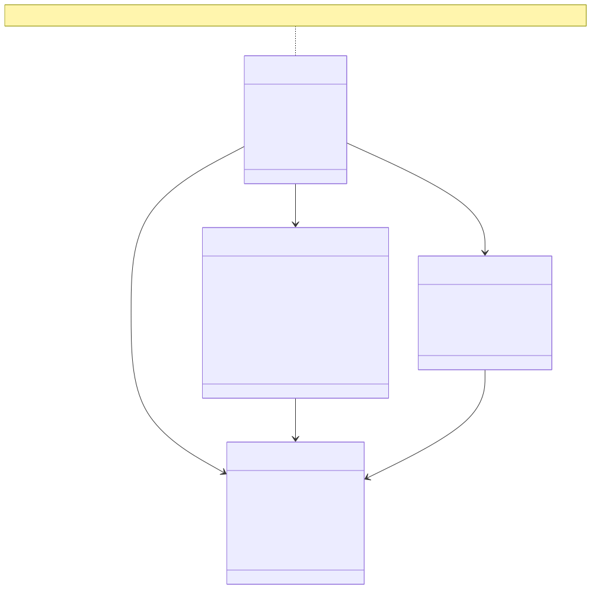
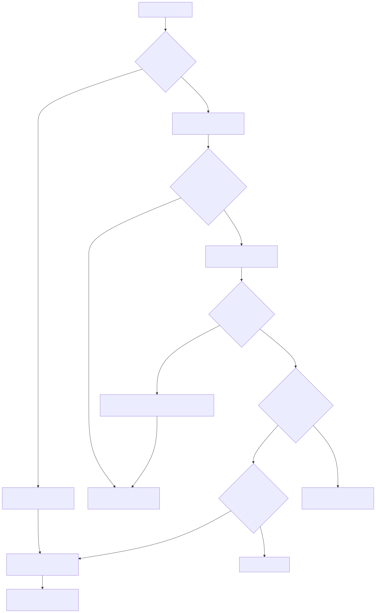
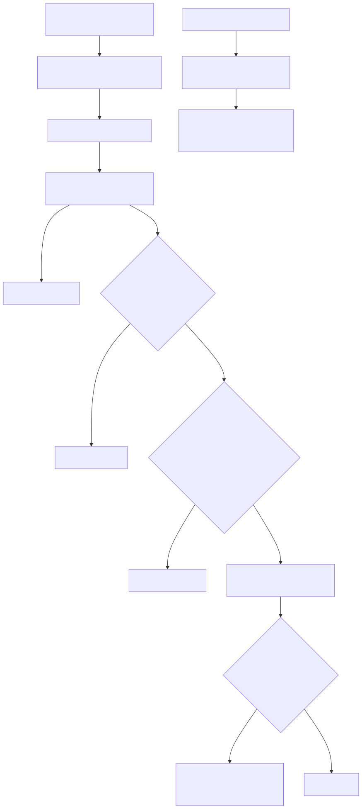

# LambdaJS — TypedArrays, Binary Data & Atomics

> **Last verified against tree:** 2026-08-13 *(initial stamp from git history)*

> **Part of the [LambdaJS detailed-design set](JS_00_Overview.md).** This document covers the twelve TypedArray element types, `ArrayBuffer`/`SharedArrayBuffer` (including resizable buffers and `transfer`), `DataView`, `Atomics` with its cooperative waiter simulation, and the Node `Buffer` subclass. It describes how each is represented as a Lambda `Map` fronting a native struct, how typed-array element storage is unified with Lambda's `ArrayNum` numeric-array core via an external view, and how the exotic gate routes string-keyed access.
>
> **Primary sources:** `lambda/js/js_typed_array.{h,cpp}` (`JsTypedArray`/`JsArrayBuffer`/`JsDataView`/`JsAtomicsWaiter`, metadata-qualified constructors, ArrayNum-routed element and bulk paths, Atomics), `lambda/js/js_object_meta.{h,cpp}` (TypedArray/ArrayBuffer/DataView metadata and ops), `lambda/lambda-data-runtime.cpp` (`array_num_new_external_view`, the `array_num_*` element/bulk kernels), `lambda/js/js_runtime.cpp` (the property kernel, direct TypedArray call/construct bodies, species create, `$262.agent`), `lambda/js/js_runtime_value.cpp` (`js_ta_key_canonical_numeric`, `js_ta_numeric_index_valid`), `lambda/lambda-mem.cpp` (GC trace/finalizers), `lambda/js/js_mir_expression_lowering.cpp` (JIT inline fast paths), `lambda/js/js_builtin_catalog.def` / `js_runtime_builtin_registry.cpp` (intrinsic target and binding specs), and `lambda/js/js_buffer.cpp` (Node `Buffer`).
> **Audience:** engine developers. **Convention:** `file:line` references drift; confirm against symbol names.

The **property-dispatch machinery** is owned by [JS_06 — Objects, Properties & Prototypes](JS_06_Objects_Properties_Prototypes.md). Under **D3.4.7**, TypedArray, ArrayBuffer, and DataView behavior is selected by immutable `JsClassMeta` and one `JsPropertyOps` table; physical `map_kind` is used only by allocation, tracing, finalization, and checked payload accessors. This document picks up at those metadata-selected operations.

---

## 1. Purpose & scope

A TypedArray, ArrayBuffer, or DataView is **not** a bespoke heap type — it is
an ordinary Lambda `Map` (`LMD_TYPE_MAP`) with immutable family metadata and a
typed trailing native carrier. `Map.type` and `Map.data` retain the ordinary
shape/layout contract of **D3.4.1/D3.4.5**; the physical `map_kind` nibble
(`MAP_KIND_TYPED_ARRAY=1`, `MAP_KIND_ARRAYBUFFER=2`, or
`MAP_KIND_DATAVIEW=3`) is checked only at the carrier boundary. This is the
same wrapper pattern DOM nodes use ([JS_13 — Web Platform](JS_13_Web_DOM.md)):
the object remains a Map for shared runtime representation, while its metadata
table intercepts element and binary-data operations.

Since the ArrayNum-unification series, a TypedArray's element storage is additionally described by a **Lambda `ArrayNum` external view** over the ArrayBuffer's bytes — the same descriptor Lambda script uses for its numeric arrays and mutable views. Element reads, coercing writes, and the bulk copy/reverse/search kernels route through the shared `array_num_*` core in `lambda/lambda-data-runtime.cpp`, so JS typed arrays and Lambda numeric arrays exercise one implementation of lane storage. A small set of deliberate carve-outs stays raw: Float16 bit handling, the BigInt lanes, DataView, Node `Buffer`, and the MIR JIT's inline load/store path (§4, §8).

This doc covers: the storage structs, the ArrayNum view discipline, and
ordinary expando ownership; the twelve element types and the carve-out lanes;
element access (inline fast path, the JIT path, and the metadata-selected
operations with canonical-numeric-index rules); buffer construction including
resizable and `transfer`; DataView endianness and BigInt views;
detach/out-of-bounds validation; the ArrayNum bulk fast paths; Atomics and the
cooperative waiter simulation; and a brief tour of the Node `Buffer`.

---

## 2. Structs & storage

- **`JsArrayBuffer`** (`js_typed_array.h`) — embeds a stable `ByteBufferHandle`. The handle retains `ByteStorage` plus `storage_offset`, current/max byte lengths, generation, and detached/resizable/shared flags. Resize, detach, transfer, and copy-on-write replace or clear handle storage without changing ArrayBuffer identity.
- **`JsTypedArray`** (`js_typed_array.h:55`) — `JsTypedArrayType element_type`, `JsArrayBuffer* buffer`, `uint64_t buffer_item` (the original ArrayBuffer `Item`, kept so `.buffer` returns the identical object), `bool length_tracking`, `bool is_buffer` (set only for Node `Buffer`), and `ArrayNum* view` — the ArrayNum descriptor over the buffer's bytes. There are **no** cached `length`/`byte_length`/`byte_offset`/`data` fields anymore: all of those derive from the view (below).
- **`JsDataView`** (`js_typed_array.h:45`) — `JsArrayBuffer* buffer`, `int byte_offset`, `int byte_length`, `uint64_t buffer_item`, and `bool length_tracking`. DataView keeps plain fields; it does not carry an ArrayNum view.

Each constructor selects its metadata-qualified TypeMap before publishing the
Map and allocates the native carrier in typed trailing storage. No fake
TypeMap marker or native pointer in `Map.data` is used.

**The ArrayNum view.** Every TypedArray constructor calls `array_num_new_buffer_view`: it allocates an `ArrayNum` marked `is_view`/`is_mutable_view` whose `ArrayNumShape` explicitly tags `ARRAY_NUM_BACKING_BUFFER_HANDLE`, stores the element offset and last resolved generation, and keeps the ArrayBuffer wrapper `Map` as its GC base. JS-visible geometry remains derived from the view. Reads resolve the handle's current allocation; non-shared writes use `js_typed_array_prepare_write`/`js_typed_array_prepare_write_ptr`, which first COWs a shared immutable snapshot when necessary. Resize, detach, transfer, and COW increment the handle generation, so refresh re-floors length-tracking geometry and re-resolves `view->data`. The MIR path calls the same live read/prepare-write accessors and does not hoist a raw typed-array pointer across storage-invalidating operations.

**GC.** The typed-array carrier trace marks `buffer_item` and the `view` from
the typed payload; the ArrayNum descriptor also traces its semantic base.
Finalization frees the TypedArray record and destroys the ArrayBuffer handle,
which releases exactly one storage reference; storage retained by a Binary
snapshot remains alive.

Ordinary expandos are stored directly in the valid shape/data area; there is
no native-backed upgrade that hides a pointer in `__ta__`, `__ab__`, or
`__dv__`. The typed carrier remains available through checked accessors while
the object gains ordinary properties without changing its semantic metadata.

---

## 3. The twelve element types & carve-out lanes

`enum JsTypedArrayType` (`js_typed_array.h:19`) enumerates twelve kinds: `INT8`, `UINT8`, `INT16`, `UINT16`, `INT32`, `UINT32`, `FLOAT32`, `FLOAT64`, `UINT8_CLAMPED`, `BIGINT64`, `BIGUINT64`, `FLOAT16`. Element sizes come from `typed_array_element_size` (`js_typed_array.cpp:278`): 1 byte for the three 8-bit kinds, 2 for the 16-bit kinds including `FLOAT16`, 4 and 8 as expected, with both BigInt lanes at 8. Each kind maps onto an `ArrayNumElemType` lane via `js_typed_array_elem_type` (`:354`) — mostly one-to-one (`ELEM_INT8` … `ELEM_FLOAT64`, `ELEM_UINT8_CLAMPED`), with the BigInt lanes stored as `ELEM_INT64`/`ELEM_UINT64` and `FLOAT16` stored as `ELEM_UINT16` (raw bits; see the carve-out below).

The **number lanes** read through the shared core: `js_typed_array_raw_get_item` (`:2344`) calls `array_num_get_number_value` (`lambda-data-runtime.cpp:752`) when the refreshed view covers the index, then canonicalizes the result with `js_make_number` (`js_runtime_value.cpp:1131`) — always an `LMD_TYPE_FLOAT` Item, usually self-tagged and using the number-home residue only for out-of-band encodings. It never leaks Lambda's compact-int representation (number-model v2). Scalar writes (`js_typed_array_set` `:2437`) coerce via `js_to_number`, then narrow with `js_typed_array_to_int_n` (`:535`) and store with an inline per-lane switch (`:2526`), including the spec ToUint8Clamp with round-half-to-even (`:2529`). The bulk/conversion paths instead store through `js_typed_array_arraynum_store_number` (`:548`), which routes to `array_num_set_int64_value`/`array_num_set_double_value` (`lambda-data-runtime.cpp:786`/`:836`) — ArrayNum's `ELEM_UINT8_CLAMPED` lane implements the same round-half-even clamp in `array_num_clamp_uint8_even` (`:29`), so both stores agree.

The **BigInt lanes** are gated separately at the top of get/set and stay raw. `BigInt64`/`BigUint64` values are Lambda `LMD_TYPE_DECIMAL` with `unlimited == DECIMAL_BIGINT`. On set (`js_typed_array.cpp:2448`), the value goes through ToBigInt semantics: a Number, null, or undefined throws TypeError; the value is then wrapped with `js_bigint_as_int_n`/`js_bigint_as_uint_n` at width 64 before a direct 64-bit store. On get (`:2403`), an `int64` lane round-trips through `bigint_from_int64`; a `uint64` lane that exceeds `INT64_MAX` is formatted to a decimal string and rebuilt with `bigint_from_string`. Atomics `wait`/`notify` is restricted to `BigInt64Array` and `Int32Array` (`js_validate_atomic_typed_array` `:909`). BigInt values themselves are owned by [JS_10 — Standard Built-in Library](JS_10_Builtins.md).

The **Float16 lane** is bit-level on both sides: reads decode with `js_float16_bits_to_float64` (`:339`) and writes encode with `js_float64_to_float16_bits` (`:296`), which rounds directly from the double — a float32 pre-round would lose subnormal tie decisions (comment at `:310`). The store helper carves it out of the ArrayNum path explicitly (`:572`): ArrayNum's `ELEM_UINT16` view would expose backing bits instead of rounded JS Numbers.

---

## 4. Element access

There are three doors into a TypedArray element. The **inline fast path** is taken when the compiler already knows the key is an integer: `js_array_get_int`/`js_array_set_int` (`js_runtime.cpp:8149`, `:8241`) test `js_is_typed_array` and call `js_typed_array_get`/`set` directly, bypassing `js_property_access`.

The **MIR JIT path** goes further: when type inference has pinned a variable to a typed-array kind, `jm_transpile_typed_array_get_native` (`js_mir_expression_lowering.cpp:10941`) and `jm_transpile_typed_array_set` (`:11024`) emit **raw width-typed loads/stores** over the same storage — they fetch the live element pointer via `js_typed_array_current_data_ptr` (`js_typed_array.cpp:2570`, which refreshes the view and returns NULL for OOB/detached, so a resize realloc cannot leave the JIT reading a freed block), compute `data + idx * elem_size`, and load/store natively without touching the ArrayNum accessors. `FLOAT16` is excluded — it falls back to a boxed `js_typed_array_get` call (`js_mir_expression_lowering.cpp:10945`). See [JS_04 — MIR Lowering](JS_04_MIR_Lowering.md).

The **general path** flows through `js_property_get`/`js_property_set` and the
TypedArray `JsPropertyOps` table. For string keys it resolves
`@@toStringTag`, ordinary expandos, virtual metadata (`length`, `byteLength`,
`byteOffset`, `buffer`, `parent`, `BYTES_PER_ELEMENT`), canonical numeric
indices, and then the prototype walk. A non-string arm uses the same
canonical-index validation. Physical carrier tags are not read by this
semantic path.

The **set** side uses the same table. Numeric-index writes route directly to
`js_typed_array_set` after canonical-index validation; string keys use the
ordinary expando path or the typed operation as appropriate.

**Canonical numeric index rules** are the spec's exotic-integer-index gate, implemented by `js_ta_key_canonical_numeric` (`js_runtime_value.cpp:948`) and `js_ta_numeric_index_valid` (`:1009`). The former accepts an INT or FLOAT key directly, and for a string key only if it **round-trips** through the canonical number→string algorithm (covering `"-0"`, `"NaN"`, `"Infinity"`, fractional forms, etc.); a non-canonical string like `"01"` is rejected and treated as an ordinary property. The latter then rejects negative zero, non-finite, non-integer, and negative values, rejects an out-of-bounds typed array, and bounds-checks against the **current** length. A reject yields `undefined` on read and a silent no-op on write (the spec's IntegerIndexedElementSet for OOB), per `js_typed_array_get`/`set` returning early when `idx >= current_length` (`js_typed_array.cpp:2431`, `:2522`).

---

## 5. ArrayBuffer, SharedArrayBuffer, resizable & transfer

A plain `ArrayBuffer(length)` runs through `js_arraybuffer_construct_resizable` (`js_typed_array.cpp:1551`) with undefined options. The constructor performs ToIndex on the length and, if an options object supplies `maxByteLength`, validates `maxByteLength >= byteLength`, sets `resizable = true`, and records `max_byte_length`. `SharedArrayBuffer` mirrors this via `js_sharedarraybuffer_construct_with_options` (`:1891`) with `is_shared = true`. Both link their prototype by name through `js_arraybuffer_link_prototype` (`:1521`).

**Resizable buffers.** `ArrayBuffer.prototype.resize` is non-shared only, requires `resizable`, preserves ECMAScript coercion/detach-check ordering, and rejects lengths above `maxByteLength`. `byte_buffer_resize` allocates the replacement storage, preserves the common prefix, swaps only after successful allocation, increments generation, and releases the previous reference. TypedArray refresh resolves the new handle generation; an immutable Binary retained from the old allocation remains unchanged.

**Length-tracking views.** A TypedArray constructed over a resizable buffer without an explicit length sets `length_tracking = true` (`js_typed_array_new_from_buffer` `:2149`); its current length re-floors from `buffer->byte_length - byte_offset` on every access (`js_typed_array_current_length` `:419`), and refresh writes that floored length back into `view->length`. For length-tracking views the spec only requires element-size alignment on non-resizable buffers, so `new Float64Array(rab)` over a resizable buffer whose size is not a multiple of 8 simply floors the remainder (`:2157`).

**transfer.** `ArrayBuffer.prototype.transfer(newLength?)` and `transferToFixedLength(newLength?)` use `byte_buffer_transfer`. An unchanged-length transfer can move the handle reference; a changed length allocates/copies before committing. The source is then detached by clearing its handle reference and advancing its generation. `transfer` preserves resizability only when the source was resizable, while `transferToFixedLength` always produces a fixed destination; fixed sources never expose a stale source maximum as destination `maxByteLength`.

**species** for buffer methods reads `constructor[@@species]` (`__sym_6`) and validates the returned object is a same-or-larger non-detached buffer (`slice` path `:1812`; SharedArrayBuffer path `:2017`).

---

## 6. DataView

DataView is a deliberate **carve-out from the ArrayNum operation layer**: it is a byte-oriented, endianness-aware window, so it keeps plain geometry fields. It still follows the same ArrayBuffer handle and COW ownership rules.

`new DataView(buffer, offset?, length?)` is `js_dataview_new` (`js_typed_array.cpp:2991`): it requires an ArrayBuffer, ToIndex-validates the offset against the buffer, and — when called without an explicit length over a **resizable** buffer — sets `length_tracking = true` (`:3017`). The view is published with DataView metadata selected before construction under **D3.4.7**.

**Accessor reads** of `byteLength`/`byteOffset` go through the DataView
`JsPropertyOps` callback: a detached or shrunk-out-of-bounds buffer throws
TypeError; a length-tracking view returns the live
`buffer->byte_length - byte_offset`; a fixed view returns its recorded
`byte_length` after confirming the window still fits.

**The get/set methods** (`getInt8`…`getFloat64`, `getBigInt64`/`getBigUint64`, and the matching setters) dispatch by name in `js_dataview_method`. Reads use a checked const pointer; setters use the separate checked `dv_write_ptr`, which prepares the ArrayBuffer handle before returning mutable bytes. This split is load-bearing: a DataView write must COW the handle shared with an immutable Binary while remaining visible to every sibling JS view. Endianness conversion and detached/OOB validation remain unchanged.

---

## 7. Detach validation & out-of-bounds

Two notions interact: a buffer can be **detached** (after `transfer` or `$262.detachArrayBuffer`), and a view can be **out-of-bounds** because a resizable buffer shrank below its window. `js_typed_array_is_out_of_bounds` (`js_typed_array.cpp:469`) returns true when the buffer is detached, or — for a length-tracking view — when `buffer->byte_length < byte_offset`, or — for a fixed view — when `buffer->byte_length < byte_offset + byte_length` (with the offset/length derived from the ArrayNum shape as in §2). The DataView analogue is `dv_is_out_of_bounds` (`:3063`).

These checks gate every observable operation. `js_ta_numeric_index_valid` calls `js_typed_array_is_out_of_bounds_item` before bounds-checking; the metadata accessors return 0 on a detached buffer; constructing a TypedArray from a detached buffer throws (`:2133`); and constructing from an out-of-bounds source TypedArray throws TypeError per the InitializeTypedArrayFromTypedArray check (`:2199`). Atomics validation centralizes the detach/type checks in `js_validate_atomic_typed_array` (`:890`).

---

## 8. ArrayNum bulk fast paths

`set`, `slice`, `subarray`, `reverse`/`toReversed`, `copyWithin`, `indexOf`/`lastIndexOf`/`includes`, and construction-from-array would be slow if they round-tripped each element through `js_typed_array_get`/`set` and the Item boxing. The bulk paths short-circuit the common cases by delegating to the shared ArrayNum byte kernels in `lambda-data-runtime.cpp` — `array_num_copy_same_type_bytes` (`:871`, memmove-based so overlap-safe), `array_num_copy_equal_size_bytes` (`:889`), `array_num_reverse_bytes` (`:909`), and `array_num_copy_reversed_bytes` (`:933`), each of which also enforces ArrayNum's read-only-view rule. Every entry first refreshes both views (§2), re-derives the live data pointer, and checks the guard `js_typed_array_arraynum_range_matches` (`js_typed_array.cpp:482`) — which requires an in-range, view-consistent, **non-`Buffer`** array (`!ta->is_buffer`, `:477`) — before handing the views to the kernel; any mismatch falls back to the safe element loop.

- **Same-type copy/set** — `js_typed_array_try_raw_set_same_type` (`:489`) for `set(src, offset)`, `js_typed_array_raw_copy_same_type` (`:700`) for whole-array copies, and `js_typed_array_raw_copy_within` (`:757`) all reduce to `array_num_copy_same_type_bytes`; `slice` copies its window the same way (`:2904`).
- **Cross-type conversion** — `js_typed_array_try_arraynum_convert_number` (`:629`) loops `js_typed_array_raw_load_number` (`:518`, reading via `array_num_get_number_value`) into `js_typed_array_arraynum_store_number` (`:548`) across differing numeric lanes, with an explicit overlap check (`js_typed_array_ranges_overlap` `:510`) so an aliasing `set` falls back to the safe path; `js_typed_array_try_arraynum_convert_bigint` (`:668`) handles the BigInt↔BigInt case as an equal-size byte copy.
- **Dense-array construction** — `js_typed_array_try_raw_from_dense_number_array` (`:595`) streams a dense JS array's INT/FLOAT Items straight into the lanes, bailing on holes, deleted sentinels, or non-numeric elements.
- **Reverse** — `js_typed_array_raw_reverse` (`:721`) delegates to `array_num_reverse_bytes`; `js_typed_array_raw_copy_reversed` (`:736`) writes the reversed copy for `toReversed`.
- **Search** — `js_typed_array_raw_index_of` (`:772`) scans numeric lanes via `js_typed_array_raw_load_number`; it returns the sentinel `-2` to signal "not handled, use the slow path" for non-numeric needles or out-of-bounds arrays, and clamps to the **spec-captured** bound the caller passes so a buffer grown by a coercion callback cannot leak freshly-zeroed elements (`:796`).

The performance framing belongs to [JS_15 — Performance & Optimization](JS_15_Performance.md). (The former `LAMBDA_JS_TA_RAW_FAST` env flag and the private `memcpy` raw family it gated were retired by the unification — the ArrayNum kernels are always on.)

---

## 9. Atomics & cooperative waiter simulation

Atomics is a carve-out: it operates on raw storage pointers (obtained through the same live-pointer discipline), never through the ArrayNum accessors. The read-modify-write operations — add/and/or/sub/xor/exchange/compareExchange/load/store — go through `js_atomics_operation` (`js_typed_array.cpp:1296`), which validates an integer TypedArray, coerces the operands to the element width, and dispatches to a macro that emits the GCC/Clang `__atomic_fetch_*` / `__atomic_compare_exchange_n` builtins at `__ATOMIC_SEQ_CST` (`:1255`). `Atomics.isLockFree` (`:1472`) returns true for sizes 1/2/4/8.

LambdaJS is single-threaded, so `Atomics.wait`/`waitAsync`/`notify` are **simulated cooperatively** rather than truly blocking. The state lives in a fixed table `js_atomics_waiters[JS_ATOMICS_MAX_WAITERS]` (128 slots, `:1047`) of `JsAtomicsWaiter` records — `{ used, id, agent_slot, buffer, index, promise, deadline_ms, has_deadline, status }` (`:1035`) — with the `promise` field GC-rooted (`js_atomics_register_waiter_roots` `:1054`). A virtual clock `js_atomics_virtual_now_ms` (`:1051`) advances on short timeouts instead of real sleeping.

`js_atomics_wait` (`:1330`) validates a shared, waitable (Int32/BigInt64) array, does the atomic compare against `expected`, and returns `"not-equal"` on mismatch. It then consults `__lambda_can_block` (`js_atomics_host_can_suspend` `:1018`, throwing if suspension is disallowed) and `js_262_agent_current_slot_for_atomics`: the **main agent** (slot `< 0`) immediately returns `"timed-out"`, while a spawned agent records a waiter (`js_atomics_record_waiter` `:1130`); a finite timeout `<= 200ms` advances the virtual clock, resolves due waiters, and reports `"timed-out"`, otherwise it returns `"ok"`. `js_atomics_wait_async` (`:1383`) mirrors this but resolves through a pending Promise (`js_atomics_wait_async_result` wraps `{ async, value }`); on timeout it schedules a libuv timer via `js_atomics_schedule_timeout_waiter` (`:1120`) so the report drains. `js_atomics_notify` (`:1445`) scans the table for waiters on the matching buffer+index and flips each to `OK`, fulfilling any attached promise through `js_atomics_set_waiter_status` (`:1071`).

**`$262.agent`** is the test262 multi-agent harness, assembled in `js_runtime.cpp` (`:26732`+) as an object with `start`/`receiveBroadcast`/`broadcast`/`getReport`/`sleep`/`monotonicNow`. Cross-agent reports use a ring buffer (`js_262_agent_reports`, `:26568`) and are correlated with pending waiters via `js_atomics_report_waiter_for_agent` (`js_typed_array.cpp:1194`), so a `getReport` holds back until the corresponding waiter resolves (`js_262_agent_get_report` `js_runtime.cpp:26680`). `$262.detachArrayBuffer` is the detach hook used throughout the detach tests (`JS_BUILTIN_262_DETACH_ARRAYBUFFER` `:10914`).

---

## 10. Node Buffer

`Buffer` is a thin Node-compatibility layer over `Uint8Array`, not a distinct exotic kind. It keeps the `is_buffer` identity flag and its Node-specific method surface. Read-only helpers use `buffer_data`; every mutating constructor/method uses `buffer_data_write`, which delegates to `js_typed_array_prepare_write_ptr`. Thus index writes, encoding writes, fill/copy/swaps, crypto/fs/network destinations, and other native writers cannot bypass COW. `Buffer.from(Binary)` uses the same retained-storage Uint8 bridge and marks the resulting view as a Buffer; its first write diverges the ArrayBuffer handle while the Binary remains immutable.

---

## Known Issues & Future Improvements

1. **TypedArray copy-method algorithms remain shared.** `toReversed`/`toSorted`/`with` now have distinct catalog targets and realm-local function identities, but their bodies reuse the common TypedArray algorithm layer. The result must still be created through TypedArray species construction and revalidation; detaching callbacks remain the important edge cases.
2. **The “stub” owner name is historical.** `set`/`subarray`/`toLocaleString` live under `JS_BUILTIN_OWNER_TYPED_ARRAY_STUB_METHOD`, but each row has a real direct catalog target and is installed as a normal property. The owner should be renamed in a mechanical cleanup; there is no placeholder or miss-time dispatch.
3. **Duplicated scalar-store semantics.** The scalar write path (`js_typed_array_set` `js_typed_array.cpp:2526`) narrows and clamps with an inline switch, while the bulk paths store through `js_typed_array_arraynum_store_number` → `array_num_set_*_value`; ToUint8Clamp's round-half-even in particular is implemented twice (`:2529` and `array_num_clamp_uint8_even` `lambda-data-runtime.cpp:29`). The two must be kept in agreement by hand. *Improvement:* route the scalar path through the ArrayNum store helper once the JIT-visible cost is measured.
4. **The refresh discipline is convention, not construction.** Every entry point must call `js_typed_array_refresh_arraynum_view` before touching `ta->view`; a new code path that forgets the call reads a stale `view->data` after a resizable-buffer `resize` reallocs. Nothing enforces this statically — the invariant lives in review.
5. **Subclass species-resize coverage.** `js_typed_array_species_create` now tests construct capability and invokes `js_construct_value`; concrete TypedArray constructors carry their immutable element policy on the function object, so renamed or shadowing constructors cannot change allocation selection (**D6.2.2v2**). Resizable-buffer corner cases still need broader species/resize conformance coverage.
6. **Freeze on a resizable-buffer-backed TypedArray is under-specified.** The
   metadata ops table still needs dedicated `Object.freeze` handling for a
   length-tracking TypedArray; a frozen-then-resized array's observable length
   and integer-index writability are not yet covered by the full spec matrix.
7. **TypedArray construction policy is split from active binding state.** Concrete constructors store `typed_array_element_type_plus_one` as immutable allocation policy, while `js_construct_value` passes an explicit `newTarget` and scopes the active binding. The construct body applies `newTarget.prototype` at the allocation boundary; there is no pending construction state. Source-class constructors are `JsFunction` values as described in [JS_07 — Classes](JS_07_Classes.md).
8. **Linear name dispatch in `js_dataview_method`.** Every DataView accessor call walks a chain of `strncmp` comparisons (`js_typed_array.cpp:3120`+) rather than a sorted/hashed table; on a hot serialization loop this is measurable. *Improvement:* dispatch on a small perfect hash of name length + first char.
9. **The NULL-buffer `.buffer` synthesis path is vestigial.** `js_typed_array_new` now always allocates and wraps a backing `JsArrayBuffer` eagerly (`:2100`), so the exotic-gate fallback that lazily synthesizes a buffer for a `ta->buffer == NULL` array (`js_runtime.cpp:3283`) should be unreachable for engine-constructed arrays; it survives as a guard for exotic construction paths and could be demoted to an assert.

---

## Appendix A — Source map

| File | Responsibility (this doc) |
|---|---|
| `lambda/js/js_typed_array.h` | `JsTypedArray` (with its `ArrayNum* view`)/`JsArrayBuffer`/`JsDataView` structs, `JsTypedArrayType`/`JsAtomicsOp` enums, public API. |
| `lambda/js/js_typed_array.cpp` | Constructors and view creation, view refresh + derived geometry, element get/set, ArrayNum bulk paths, ArrayBuffer/SharedArrayBuffer/resize/transfer, DataView methods, Atomics + waiter simulation, `js_get_*_ptr` accessors. |
| `lambda/lambda-data-runtime.cpp` | `array_num_new_external_view`, `array_num_get_number_value`/`set_int64_value`/`set_double_value`, the byte kernels (`copy_same_type`/`copy_equal_size`/`reverse`/`copy_reversed`), `array_num_clamp_uint8_even`. |
| `lambda/js/js_runtime.cpp` | Shared property-kernel entry, inline element fast paths, species create, `$262.agent`. |
| `lambda/js/js_runtime_value.cpp` | `js_ta_key_canonical_numeric`, `js_ta_numeric_index_valid`, `js_make_number`. |
| `lambda/js/js_mir_expression_lowering.cpp` | JIT inline typed-array get/set/length lowering (raw loads over the shared storage). |
| `lambda/lambda-mem.cpp` | `js_native_map_gc_trace` (marks `buffer_item` + `view`), native-map finalizers. |
| `lambda/js/js_builtin_catalog.def`, `js_runtime_builtin_registry.cpp` | TypedArray target/binding/accessor specs and realm-local installation. |
| `lambda/js/js_buffer.cpp` | Node `Buffer` (Uint8Array subclass) — `alloc`/`from`/`concat`/`of`, encode/decode. |
| `lambda/lambda.h` | `enum MapKind`, `Container.map_kind`, `ArrayNum`/`ArrayNumShape`/`ArrayNumElemType`, the `array_num_*` C API. |

## Appendix B — Related documents

- [JS_06 — Objects, Properties & Prototypes](JS_06_Objects_Properties_Prototypes.md) — immutable metadata/ops dispatch, physical carrier boundary, ordinary `[[Get]]`/`[[Set]]`.
- [JS_03 — Value Model, Memory & GC Interop](JS_03_Value_Model.md) — `Item`, `Map`, heap allocation, BigInt/Decimal representation.
- [JS_04 — MIR Lowering](JS_04_MIR_Lowering.md) — how `obj[i]` lowers to `js_array_get_int`/`set_int` and the native typed-array load/store path.
- [JS_10 — Standard Built-in Library](JS_10_Builtins.md) — BigInt, Symbol, Proxy, and the broader builtin catalog.
- [JS_14 — Node Compatibility](JS_14_Node_Compat.md) — the full Node `Buffer` surface.
- [JS_15 — Performance & Optimization](JS_15_Performance.md) — bulk-path rationale and dispatch-table improvements.
