# LambdaJS — Web Platform: DOM, CSSOM, Events & Fetch

> **Part of the [LambdaJS detailed-design set](JS_00_Overview.md).** This document covers the Web-platform host objects: the DOM bridge to Radiant's `DomNode`/`DomElement` tree, element/document API dispatch, CSS selector queries and layout-metric reads, the 3-phase event system, the CSSOM, OffscreenCanvas text measurement, XHR/fetch/FormData/clipboard, and Selection/Range.
>
> **Primary sources:** `lambda/js/js_dom.{h,cpp}` (DOM wrap/unwrap, element & document dispatch, layout metrics, computed style, classList/dataset), `lambda/js/js_dom_events.{h,cpp}` (EventTarget, listener storage, dispatch), `lambda/js/js_cssom.{h,cpp}` (CSSOM wrappers, CSS namespace), `lambda/js/js_canvas.cpp` (OffscreenCanvas/`measureText`), `lambda/js/js_xhr.{h,cpp}`, `lambda/js/js_fetch.cpp`, `lambda/js/js_formdata.cpp`, `lambda/js/js_clipboard.cpp`, `lambda/js/js_dom_selection.{h,cpp}`. Exotic-dispatch gate in `lambda/js/js_runtime.cpp`.
> **Audience:** engine developers. **Convention:** `file:line` references drift; confirm against symbol names.

---

## 1. Purpose & scope

Every host object below is a Lambda `Map` tagged with a `MapKind` byte so the ordinary property pipeline ([JS_06 — Objects, Properties & Prototypes](JS_06_Objects_Properties_Prototypes.md)) can detour into a per-kind handler. The `MapKind` enum and the single fast-path gate (`if (m->map_kind != MAP_KIND_PLAIN …)`) are **owned by JS_06**; this document describes only the Web-platform kinds — `MAP_KIND_DOM` (4), `MAP_KIND_CSSOM` (5), `MAP_KIND_DOC_PROXY` (8), `MAP_KIND_FOREIGN_DOC` (10), `MAP_KIND_CSS_NAMESPACE` (12) — and the C bridges they route into.

The DOM/CSSOM layers are **views over Radiant's structures**: a wrapper Map never owns layout state, it points at a `DomNode`/`DomElement`, `CssStylesheet`, `CssRule`, or `DomRange`/`DomSelection` living in Radiant's pools. The layout engine itself (block/inline/flex/grid/table) is documented in `doc/dev/Radiant_*` and is **out of scope here** — we only describe the JS-visible surface and the dirty/lazy-layout contract between them.

---

## 2. The DOM bridge

**Sentinel-marker wrapping.** `js_dom_wrap_element` (`js_dom.cpp:875`) allocates a bare `Map` via `heap_calloc`, sets `type_id = LMD_TYPE_MAP`, `map_kind = MAP_KIND_DOM`, stores the address of a file-static `TypeMap js_dom_type_marker` (`js_dom.cpp:99`) in `Map::type`, writes the `DomNode*` directly into `Map::data`, and sets `data_cap = 0`. The marker is an **identity sentinel, not a real shape** — `js_dom_unwrap_element` (`:912`) tests `m->type == &js_dom_type_marker` and returns `Map::data` as the `DomNode*`; `js_is_dom_node` (`:933`) is the same pointer compare. This gives O(1) wrap/unwrap with **zero per-node HashMap allocation** — the header comment calls out the design (`js_dom.h:7`).

**Identity cache.** So that `el === el` holds across repeated wraps, `cache_dom_wrapper`/`lookup_dom_wrapper` (`:846`,`:820`) keep a thread-local linked list of `DomWrapperCacheChunk` (4096 entries each, `:807`); each cached `Item` is registered as a GC root (`:856`) and torn down by `reset_dom_wrapper_cache` (`:859`) between documents. Lookup is a **linear scan over all chunks** — see [Known Issues](#known-issues--future-improvements). A `DomNode` that is the document stub is re-wrapped as the document proxy instead, so `range.startContainer === document` works (`:885`).

**Document proxy & foreign docs.** Bare `document` resolves to a singleton `MAP_KIND_DOC_PROXY` Map whose `Map::data` is the `DomDocument*` (`js_dom.cpp:697`, `js_get_document_object_value`); methods route through `js_document_proxy_method` → `js_document_method` (`:1090`,`:3035`) and properties through `js_document_proxy_get_property`. `document.implementation.createHTMLDocument`/`createDocument` build `MAP_KIND_FOREIGN_DOC` wrappers (`:1208`); the exotic gate swaps the active document around their property reads via `js_dom_swap_active_document`/`restore` (`js_runtime.cpp:3151`).

---

## 3. Element & document API dispatch

The exotic gate in `js_try_exotic_property_get`/`_set` (`js_runtime.cpp:3158`,`:3203`) is the sole entry from the ordinary pipeline. For `MAP_KIND_DOM` it routes reads to `js_dom_get_property` (or `js_computed_style_get_property` when the Map is a computed-style wrapper) and writes to `js_dom_set_property`; method calls arrive via `js_map_method` (`:17362`,`:19195`), which dispatches DOM/foreign-doc nodes to `js_dom_element_method` before any ordinary-method fallback.

- **`js_dom_get_property`** (`js_dom.cpp:5323`) first re-routes Range/Selection/inline-style wrappers (which share `MAP_KIND_DOM`, [§8](#8-cssom--the-css-namespace-map-kind)), then `strcmp`-dispatches the property name: `tagName`, `id`, `className`, `textContent`, tree navigation (`parentNode`, `firstElementChild`, `childNodes`, …), `nodeType`, the layout metrics ([§4](#4-css-selector-queries--lazy-layout)), `innerHTML`/`outerHTML` serialization (`:5554`), and falls back to `getAttribute`. Header lists the full set (`js_dom.h:170`).
- **`js_dom_set_property`** handles `className`/`id`/`textContent`/`data` and the **`innerHTML` setter** (`:6959`): it removes existing children, runs the Radiant HTML5 *fragment* parser (`html5_fragment_parser_create`/`html5_fragment_parse`, `:6987`), converts the parsed Lambda `Element`s into `DomNode`s via `build_dom_tree_from_element`, re-registers element ids on the Window, and marks the subtree dirty.
- **`js_dom_element_method`** (`js_dom.cpp`, declared `js_dom.h:257`) dispatches `getAttribute`/`setAttribute`/`removeAttribute`, `appendChild`/`removeChild`/`insertBefore`, `cloneNode`, `matches`/`closest`, the selector queries, `getBoundingClientRect`/`getClientRects` (`:8442`), `compareDocumentPosition` (`:8475`), and `dispatchEvent`.
- **classList / dataset / style.** `js_classlist_method`/`js_classlist_get_property` (`js_dom.h:272`) implement `add`/`remove`/`toggle`/`contains`/`replace`/`length`/`value`; `js_dataset_get_property`/`set` translate camelCase ↔ `data-kebab-case` attributes; `js_dom_set_style_property` converts camelCase JS names to hyphenated CSS, and `js_dom_style_method` adds `setProperty`/`removeProperty` (`js_dom.h:202`,`:340`).

`document.<method>` (`js_document_method`, `:3035`) covers `getElementById`, `getElementsByClassName`/`TagName`/`Name`, `querySelector`/`All`, `createElement`/`createTextNode`, and `createRange`/`getSelection` (forwarded to `js_dom_selection`).

---

## 4. CSS selector queries & lazy layout

**Selector matching reuses the Radiant CSS matcher** — `js_dom.cpp` includes `input/css/selector_matcher.hpp` (`:36`). `querySelector`/`querySelectorAll`/`matches`/`closest` parse the selector text with `css_parse_selector_with_combinators` (`parse_css_selector`, `:2918`), build a `SelectorMatcher` via `selector_matcher_create`, then call `selector_matcher_find_first` / `selector_matcher_find_all` / `selector_matcher_matches` (`:3148`,`:3171`,`:7903`). The same matcher backs on-demand `getComputedStyle` cascade resolution (`:2343`). There is no second selector engine — JS DOM queries and the layout engine share one.

**Layout-metric reads & the lazy contract.** `offsetWidth`/`offsetHeight`/`clientWidth`/`clientHeight`/`offsetTop`/`offsetLeft`/`offsetParent` (`js_dom.cpp:5777`–`5810`) read the `DomElement` geometry fields (`elem->width`, `->height`, `->x`, `->y`, and `bound->border` for the client-box border subtraction) directly. `getBoundingClientRect` (`:8442`) sums `x`/`y` up the parent chain to an absolute box. These fields hold real pixels **only after a Radiant layout pass** (`layout_html_doc`); before first layout they are 0, which the code notes "matches current browser behaviour for scripts that run before first paint" (`:5772`).

DOM **mutations** (appendChild, innerHTML, attribute/style writes) don't relayout synchronously — they call `js_dom_mutation_notify`, which sets `layout_dirty` on the subtree and ancestors via `js_dom_mark_dirty_subtree`/`_ancestors` (`:181`,`:194`), clears `styles_resolved`, and records a `DomJsMutationRecord` (kind + target + sequence) into a per-document ring (`:221`). A later layout pass consumes the dirty flags. The metric getters do **not** force a flush, so the "lazy layout" here is a *dirty-marking* protocol, not an on-read reflow — see [Known Issues](#known-issues--future-improvements).

The mutation kind is classified so a future incremental engine can scope work: child mutations record `DOM_JS_MUTATION_CHILD_INSERT`/`CHILD_REMOVE` (`:348`,`:354`), while style writes map to `DOM_JS_MUTATION_STYLE_REPAINT` for paint-only properties (`background-color`, `color`, `opacity`, `visibility`) versus `DOM_JS_MUTATION_STYLE` for layout-affecting ones (`js_dom_style_mutation_kind`, `:209`). The per-document `js_mutation_kind_mask` accumulates a bitmask of all kinds seen since the last pass, and records past `DOM_JS_MUTATION_RECORD_CAP` bump an overflow counter rather than growing unbounded (`:233`).

**Computed style.** `js_get_computed_style` (`:1739`) returns a `MAP_KIND_DOM` wrapper tagged with `js_computed_style_marker`; `js_computed_style_get_property` resolves camelCase/hyphenated CSS names against the cascade, normalizing named colors to `rgb()` (`:1656`).

---

## 5. The event system

**EventTarget surface.** `addEventListener`/`removeEventListener`/`dispatchEvent` (`js_dom_events.h:29`–`43`) work on DOM nodes, the document proxy, the Window, and plain `new EventTarget()` objects (`js_create_event_target`, `:90`). `parse_listener_options` (`js_dom_events.cpp:332`) accepts either a boolean `useCapture` or an options object `{capture, once, passive, signal}`.

**Listener storage is external** — the `DomNode` struct is never modified. A file-static flat array `NodeListenerEntry _entries[]` maps a `void* key` → `NodeListeners {EventListener* items; count; capacity}` (`:230`–`244`). `get_event_target_key` (`:251`) derives the key: the `DomNode*` for elements, `&_document_sentinel` for the document proxy, `&_window_sentinel` for the global, or the object pointer itself for a plain EventTarget. Each `EventListener` (`:218`) carries the type string, callback, `capture`/`once`/`passive` flags, an `AbortSignal`, and a `removed` tombstone. `get_or_create_listeners`/`find_listeners` (`:277`,`:305`) **linearly scan** `_entries` (geometric grow, `:286`) — O(n) in distinct targets.

**3-phase dispatch.** `js_dom_dispatch_event` (`:1673`):
1. **Validate** — a null/non-Event argument throws TypeError (`:1674`); a re-entrant dispatch (the `__dispatch_flag` per-event slot) throws InvalidStateError (`:1769`).
2. **Pre-activation** — for a `click` whose class is `MouseEvent`/`PointerEvent`/`WheelEvent`, toggle checkbox/radio checkedness and identify submit/reset activation before listeners run (HTML §6.4.4, `:1710`).
3. **Path** — `build_path` collects `target → ancestors → document → window` into `path[0..n-1]` (`:1800`); `window.event` is set to the in-flight event for the duration (`:1815`).
4. **Phases** — **CAPTURING** fires capture-only listeners from `path[n-1]` down to `path[1]` (`:1822`); **AT_TARGET** fires `path[0]` capture-then-bubble, both reported with `eventPhase == 2` (`:1830`); **BUBBLING**, only if `event.bubbles`, fires non-capture listeners up from `path[1]` (`:1837`).
5. **Per-node firing** — `fire_listeners` (`:1554`) runs the matching `on<type>` IDL handler first, then snapshots the matching, non-tombstoned, correct-phase listeners into an `alloca` array so concurrent add/remove during dispatch cannot perturb iteration (`:1611`); a non-true return from a cancelable handler sets the canceled flag (`:1596`).
6. **Teardown** — `eventPhase` → 0, `currentTarget` → null, stop flags reset; the canceled flag *persists* across dispatches (`:1846`).

**Propagation control.** `stopPropagation`/`stopImmediatePropagation`/`cancelBubble` are checked through both thread-local mirrors (`_stop_propagation`, `_stop_immediate`, `:610`) and per-event flag slots (`__stop_prop`/`__stop_imm`); the `_STOP_PROP` macro (`:1817`) gates each phase boundary, and `_STOP_IMM` (`:1583`) gates between listeners on a single node. Subclass constructors (`js_ctor_mouse_event_fn`, etc., `js_dom_events.h:97`) and native-input factories (`js_create_native_mouse_event`, etc., `:113`) build spec-shaped events (`isTrusted`, `bubbles`) that flow through the same dispatcher.

---

## 6. CSSOM & the CSS namespace map kind

CSSOM wrappers use the **same sentinel pattern** as the DOM bridge (`js_cssom.cpp:5`), all under `MAP_KIND_CSSOM` with three distinct `TypeMap` markers — `js_stylesheet_marker`, `js_css_rule_marker`, `js_rule_decl_marker` (`:282`). `js_cssom_wrap_stylesheet` stores a `CssStylesheet*` in `Map::data` (`:337`); `js_cssom_wrap_rule` stores a `CssRule*` and stashes the serialization `Pool*` in `data_cap` (`:482`). The exotic gate (`js_runtime.cpp:3165`,`:3208`) routes by marker: `js_is_stylesheet` → stylesheet getter/`insertRule`/`deleteRule`; `js_is_css_rule` → rule `selectorText`/`style`/`cssText`; else the declaration getter/setter.

`CSSStyleDeclaration` access is camelCase-aware: `js_cssom_rule_decl_set_property` re-parses the value as CSS and replaces/adds the declaration (`js_cssom.h:110`). Font-face rules expose declarations via a synthesized **shadow `CssRule`** of type `CSS_RULE_STYLE` cached in the rule's repurposed legacy fields (`:456`). This CSSOM property model — camelCase ↔ hyphenated, per-declaration storage — mirrors the property machinery in [JS_06](JS_06_Objects_Properties_Prototypes.md).

`insertRule`/`deleteRule` mutate the **live** `CssStylesheet` in place: `insertRule` range-checks the index, re-tokenizes and re-parses the rule text into a `CssRule`, and splices it into the sheet's rule array (`js_cssom.cpp:690`); `deleteRule` range-checks and removes (`:743`). Because wrappers hold the underlying pointer (not a copy), subsequent `cssRules` reads observe the change.

`document.styleSheets` returns an array of wrapped sheets (`js_cssom_get_document_stylesheets`, `:1228`); `HTMLStyleElement.sheet` finds the sheet parsed from that `<style>` element. The **CSS namespace** object (`CSS.supports`/`CSS.escape`) is *not* a CSSOM wrapper: `js_get_css_object_value` creates an ordinary `Object.create(null)` Map, tags only `map_kind = MAP_KIND_CSS_NAMESPACE` (`js_runtime.cpp:25100`) so its real shape is preserved, and installs methods through the builtin-method registry; its get-gate case deliberately returns `false` (`:3163`) to keep ordinary property reads.

---

## 7. Canvas / measureText via the Radiant font engine

OffscreenCanvas exists for **text measurement only** (`js_canvas.cpp:2`). The constructor is **intercepted at MIR-lowering time** — `js_mir_statement_lowering.cpp:2667` emits a direct call to `js_offscreen_canvas_new` for `new OffscreenCanvas(w,h)` rather than a generic constructor path. The canvas and its `getContext("2d")` context are plain objects stamped with `JS_CLASS_OFFSCREEN_CANVAS` / `JS_CLASS_CANVAS_RENDERING_CONTEXT_2D` (`js_canvas.cpp:237`,`:258`); method calls reach `js_canvas_method_dispatch` (`:357`) via the class byte.

Measurement uses **Lambda's unified font engine** (`lib/font/`): a singleton `FontContext` (`:31`), a fixed `FontHandle*` pool of `MAX_CANVAS_FONT_HANDLES` indexed by integer id stored in the `__font_handle_id` expando (`:50`,`:271`). Setting `ctx.font` parses the CSS font shorthand (`parse_css_font_shorthand`, `:85`) and resolves a `FontHandle` via `font_resolve`. `js_canvas_measure_text` (`:302`) calls `font_measure_text` and returns a `TextMetrics`-shaped `{width}` object, falling back to a `len * size * 0.5` heuristic when no handle resolves (`:222`). Setting `ctx.font` at runtime is intercepted by the property-set path (`js_runtime.cpp:5406`).

---

## 8. XHR / fetch / FormData / clipboard, Selection/Range

**XMLHttpRequest** is **synchronous** under the hood (`js_xhr.h:5`): `js_xhr_new` creates an object carrying a hidden `__xhr_id` that indexes a flat C-side state array (`js_xhr.cpp:249`); methods read `js_get_this()` to resolve the id. `js_xhr_send` calls `http_fetch` from `input_http.cpp` (`:435`) and then walks `readyState` 2→3→4 firing `readystatechange` (`:454`), mirroring `status`/`statusText`/`responseText` onto the JS object. The HTTP backing (`http_fetch`, `FetchResponse`) is **shared with the Node http module** described in [JS_14 — Node Compatibility](JS_14_Node_Compat.md).

**fetch** (`js_fetch.cpp:2`) returns a `Promise<Response>` over the same path; the `Response` object exposes `text()`/`json()`/`blob()` that resolve promises by re-reading a stored body index (`:202`,`:216`,`:234`). **FormData** (`js_formdata.cpp`) is a `JS_CLASS_*`-stamped object holding entries plus IDL methods (`append`/`delete`/`get`/`getAll`/`has`/`set`/iterators, `:4`), with Blob/File coercion (`:212`). **navigator.clipboard** (`js_clipboard.cpp`) provides `writeText`/`readText` and the `ClipboardItem` constructor (`:300`).

**Selection / Range** are `MAP_KIND_DOM` host objects backed by `radiant/dom_range.{hpp,cpp}` (`js_dom_selection.cpp:33`) but tagged with their own markers `js_dom_range_marker` / `js_dom_selection_marker` (`:157`); `js_dom_get_property` re-routes them at its top (`js_dom.cpp:5325`). Mutating methods re-sync the JS-visible properties from the native object via `range_sync_props`/`selection_sync_props` (`:163`). `StaticRange` (`js_ctor_static_range_fn`, `js_dom_selection.h:25`) is an immutable snapshot used by `InputEvent.getTargetRanges()`.

---

## Known Issues & Future Improvements

1. **DOM API gaps block real frameworks.** The element/document surface is broad but not complete; Bootstrap-class libraries exercise properties and methods (e.g. richer `style`/transition introspection, full `Node`/`Range` coverage) beyond what `js_dom_element_method` and `js_dom_get_property` dispatch today. Gaps surface as `undefined` falls through `getAttribute` rather than as errors, so failures are silent.
2. **No on-read layout flush.** Layout-metric getters read stale `DomElement` geometry; mutations only set `layout_dirty` (`js_dom.cpp:181`) without forcing a relayout, so a script that mutates then reads `offsetWidth` in the same turn sees pre-mutation pixels (or 0 before first layout). A spec-faithful engine would flush pending layout on metric access.
3. **OffscreenCanvas is compile-time-intercepted, not runtime-overridable.** `new OffscreenCanvas` is hard-wired in MIR lowering (`js_mir_statement_lowering.cpp:2667`), so a user-defined `globalThis.OffscreenCanvas` cannot shadow it — the constructor name is matched before any identifier resolution.
4. **No real text segmentation / Bidi.** There is no `Intl.Segmenter` implementation and no bidirectional-text algorithm; FormData/clipboard direction is hard-coded — "always 'ltr' in headless (no bidi algorithm)" (`js_formdata.cpp:690`). Text width fallback in canvas is a crude per-char heuristic (`js_canvas.cpp:222`).
5. **`js_dom.cpp` size & per-access logging.** The file is ~9,500 lines with ~50 `log_debug` call sites on hot get/method paths (e.g. every `js_dom_get_property` on a non-node logs, `:5340`); the `strcmp` ladder in `js_dom_get_property` re-tests every property name linearly per access. Both add avoidable per-access overhead in tight DOM loops — see [JS_15 — Performance](JS_15_Performance.md).
6. **O(n) listener and wrapper storage.** Event listeners live in a flat `_entries` array scanned linearly by target key (`js_dom_events.cpp:277`), and the DOM wrapper identity cache is a linked list of chunks scanned linearly per wrap (`js_dom.cpp:820`). Documents with many distinct event targets or many wrapped nodes degrade quadratically. *Improvement:* hash both keyed structures.
7. **Transitional dual propagation state.** Stop-propagation tracks both thread-local booleans and per-event flag slots (`js_dom_events.cpp:610`,`:1794`), labeled "legacy thread-locals — transitional"; a single source of truth (the event slots) is the intended end state.

---

## Appendix A — Source map

| File | Responsibility (this doc) |
|---|---|
| `lambda/js/js_dom.{h,cpp}` | DOM wrap/unwrap sentinel, identity cache, element/document dispatch, layout metrics, computed style, classList/dataset, innerHTML, selector queries. |
| `lambda/js/js_dom_events.{h,cpp}` | EventTarget, external listener storage, 3-phase dispatch, event/subclass/native factories. |
| `lambda/js/js_cssom.{h,cpp}` | `MAP_KIND_CSSOM` stylesheet/rule/declaration wrappers, CSS namespace object. |
| `lambda/js/js_canvas.cpp` | OffscreenCanvas, `measureText`, FontHandle pool over `lib/font/`. |
| `lambda/js/js_xhr.{h,cpp}`, `js_fetch.cpp` | XHR (sync `http_fetch`), fetch + Response. |
| `lambda/js/js_formdata.cpp`, `js_clipboard.cpp` | FormData, navigator.clipboard / ClipboardItem. |
| `lambda/js/js_dom_selection.{h,cpp}` | Range / Selection / StaticRange over `radiant/dom_range`. |
| `lambda/js/js_runtime.cpp` | Exotic get/set gate routing to the bridges; CSS-namespace tagging; canvas font-set intercept. |
| `lambda/js/js_mir_statement_lowering.cpp` | Compile-time `OffscreenCanvas` constructor interception. |

## Appendix B — Related documents

- [JS_06 — Objects, Properties & Prototypes](JS_06_Objects_Properties_Prototypes.md) — `MapKind` enum, the exotic-dispatch gate, and the property model the CSSOM mirrors.
- [JS_10 — Standard Built-in Library](JS_10_Builtins.md) — the builtin-method registry that installs CSS-namespace and collection methods.
- [JS_14 — Node Compatibility](JS_14_Node_Compat.md) — the `http_fetch`/`FetchResponse` HTTP backing shared with XHR/fetch.
- [JS_15 — Performance & Optimization](JS_15_Performance.md) — fast paths and the per-access / O(n) overheads called out above.
- Radiant layout/cascade/selection internals live in `doc/dev/Radiant_*` (outside this set).
