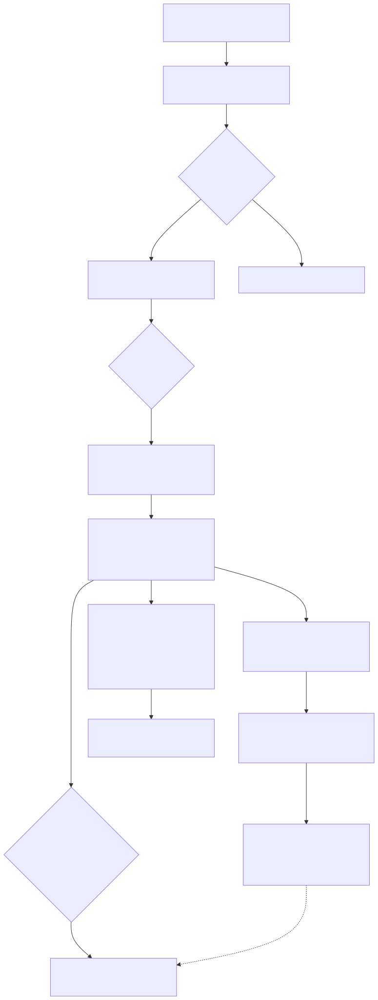
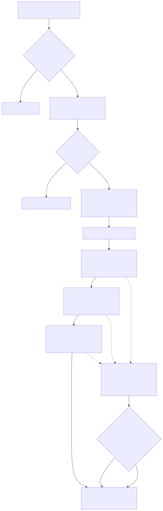
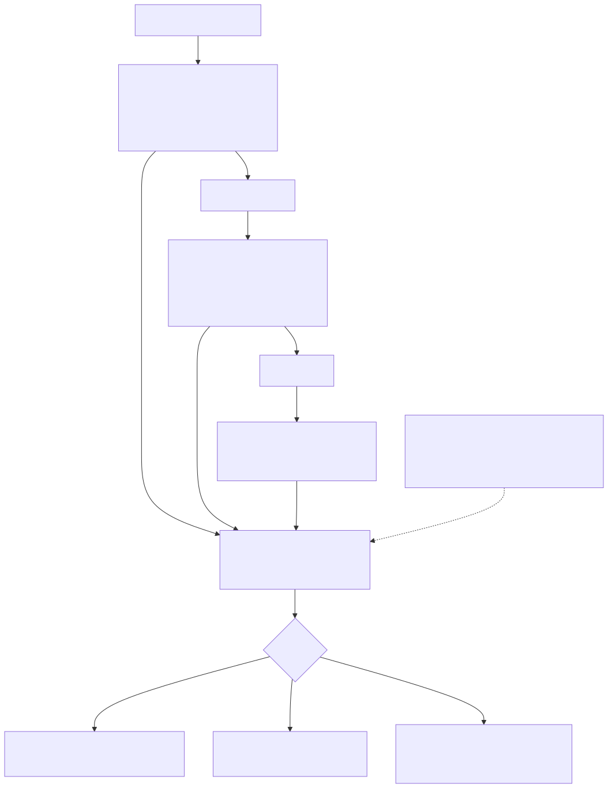

# LambdaJS — Web Platform: DOM, CSSOM, Events & Fetch

> **Last verified against tree:** 2026-09-01

> **Part of the [LambdaJS detailed-design set](JS_00_Overview.md).** This document covers the Web-platform host objects: the DOM bridge to Radiant's `DomNode`/`DomElement` tree, element/document API dispatch, CSS selector queries and layout-metric reads, the 3-phase event system, the CSSOM, OffscreenCanvas text measurement, XHR/fetch/FormData/clipboard, and Selection/Range.
>
> **Primary sources:** `lambda/dom/dom.{h,cpp}` (DOM wrap/unwrap, element & document dispatch, layout metrics, computed style, classList/dataset), `lambda/dom/dom_events.{h,cpp}` (EventTarget, listener storage, dispatch), `lambda/dom/dom_cssom.{h,cpp}` (CSSOM wrappers, CSS namespace), `lambda/dom/dom_canvas.cpp` (OffscreenCanvas/`measureText`), `lambda/dom/dom_xhr.{h,cpp}`, `lambda/dom/dom_fetch.cpp`, `lambda/dom/dom_formdata.cpp`, `lambda/dom/dom_clipboard.cpp`, `lambda/dom/dom_selection.{h,cpp}`, and `lambda/js/js_object_meta.{h,cpp}` (host metadata/ops bridge). The property kernel is in `lambda/js/js_runtime.cpp`.
> **Audience:** engine developers. **Convention:** `file:line` references drift; confirm against symbol names.
>
> **Relocated 2026-09-01 (DOM API F22–F26).** This layer moved from `lambda/js/` to **`lambda/dom/`** and dropped its `js_` prefix (`js_dom_*` → `dom_*`), because after F17–F20 it is the DOM mechanism *both* realms drive, not JS-private code: the Lambda `dom` package reaches it through the `radiant.*` waist, and `import dom` now reaches it directly. What JS adds on top — class stamps, prototypes, realm globals — is the adapter layer, partly extracted and tracked in `vibe/Lambda_Design_DOM_API.md` (ES32–ES38, ESO79/ESO81). The JS behaviour described below is unchanged by the move.

---

## 1. Purpose & scope

Current Web-platform host objects are native VMaps branded by the
Radiant/JS DOM bridges. Under **D3.4.7/D7.4.1–D7.4.3**, the property kernel
resolves their host-family metadata and delegates through the single VMap/Jube
bridge; declared member records and record-owned hooks remain authoritative under
D7.4.4. Physical `MapKind` tags
are not DOM semantic classifiers. This document describes DOM-node VMaps,
document/foreign-document VMaps, CSSOM/style host resources, and the
the metadata-qualified CSS namespace ordinary object.

The DOM/CSSOM layers are **views over Radiant's structures**: a wrapper Map never owns layout state, it points at a `DomNode`/`DomElement`, `CssStylesheet`, `CssRule`, or `DomRange`/`DomSelection` living in Radiant's pools. The layout engine itself (block/inline/flex/grid/table) is documented in `doc/dev/Radiant_*` and is **out of scope here** — we only describe the JS-visible surface and the dirty/lazy-layout contract between them.

---

## 2. The DOM bridge

**Native VMap wrapping.** `dom_wrap_element` returns a branded native VMap whose `host_type` identifies the Radiant DOM-node carrier and whose `host_data` points at the `DomNode`. `dom_unwrap_element` and `js_is_dom_node` test the VMap host brand through the Radiant bridge, while property lookup, enumeration, descriptors, prototype behavior, and expandos enter the shared host `JsPropertyOps` bridge.

**Identity cache.** So that `el === el` holds across repeated wraps, `cache_dom_wrapper`/`lookup_dom_wrapper` (`:846`,`:820`) keep a thread-local linked list of `DomWrapperCacheChunk` (4096 entries each, `:807`); each cached `Item` is registered as a GC root (`:856`) and torn down by `reset_dom_wrapper_cache` (`:859`) between documents. Lookup is a **linear scan over all chunks** — see [Known Issues](#known-issues--future-improvements). A `DomNode` that is the document stub is re-wrapped as the document proxy instead, so `range.startContainer === document` works (`:885`).

**Document proxy & foreign docs.** Bare `document` resolves to a singleton branded VMap whose `host_data` is the active browsing-context `DomDocument*`. The Radiant declared interface publishes document operations as concrete callable properties; properties use `js_document_proxy_get_property`. `document.implementation.createHTMLDocument`/`createDocument` build branded foreign-document VMaps whose bridge swaps the active document around the same declared operations when needed.

---

## 3. Element & document API dispatch

The VMap host-object bridge in `js_property_get`/`js_property_set` is the
primary entry from the ordinary pipeline. DOM nodes, Range/Selection,
inline/computed style, CSSOM, and document/foreign-document proxies are
recognized by host metadata before ordinary map property access. Their type
prototypes and property hooks publish callable method values; an ordinary
source method call still performs observable property `Get` followed by the
stored function's `[[Call]]`, as required by **D6.2.2v2**. Host dispatch helpers
implement the selected method body after lookup; they are not compiler
receiver/name call routes.

- **`dom_get_property`** (`dom.cpp`) handles DOM-node property reads after native host predicates have separated Range/Selection, style, CSSOM, and document resources. It dispatches the property name for `tagName`, `id`, `className`, `textContent`, tree navigation (`parentNode`, `firstElementChild`, `childNodes`, ...), `nodeType`, layout metrics ([§4](#4-css-selector-queries--lazy-layout)), `innerHTML`/`outerHTML` serialization, and falls back to `getAttribute`.
- **`dom_set_property`** handles `className`/`id`/`textContent`/`data` and the **`innerHTML` setter** (`:6959`): it removes existing children, runs the Radiant HTML5 *fragment* parser (`html5_fragment_parser_create`/`html5_fragment_parse`, `:6987`), converts the parsed Lambda `Element`s into `DomNode`s via `build_dom_tree_from_element`, re-registers element ids on the Window, and marks the subtree dirty.
- **Declared DOM operations** originate in `radiant_dom_interface_decl` / `radiant_dom_bindings` and enter `radiant_dom_element_operation` with a `JubeDomElementOperation` selected when the function property is published. `dom_element_operation_impl` owns the host algorithms for attributes, tree mutation, selectors, geometry, and events. The enum is an executable target capability, not a property name crossing the call ABI. `ChildNode.after` and `replaceWith` share one backing-aware relative-insertion kernel so node moves and string arguments preserve both DOM links and the Mark tree.
- **classList / dataset / style.** Declared interface records publish direct operations for token-list and CSS methods; property hooks handle `length`/`value`, camelCase ↔ `data-kebab-case`, and camelCase ↔ hyphenated CSS conversion.

Document declared operations cover `getElementById`, `getElementsByClassName`/`TagName`/`Name`, `querySelector`/`All`, `createElement`/`createTextNode`, and `createRange`/`getSelection` (forwarded to `dom_selection`).

---

## 4. CSS selector queries & lazy layout

**Selector matching reuses the Radiant CSS matcher** — `dom.cpp` includes `input/css/selector_matcher.hpp` (`:36`). `querySelector`/`querySelectorAll`/`matches`/`closest` parse the selector text with `css_parse_selector_with_combinators` (`parse_css_selector`, `:2918`), build a `SelectorMatcher` via `selector_matcher_create`, then call `selector_matcher_find_first` / `selector_matcher_find_all` / `selector_matcher_matches` (`:3148`,`:3171`,`:7903`). The same matcher backs on-demand `getComputedStyle` cascade resolution (`:2343`). There is no second selector engine — JS DOM queries and the layout engine share one.

**Layout-metric reads & the lazy contract.** `offsetWidth`/`offsetHeight`/`clientWidth`/`clientHeight`/`offsetTop`/`offsetLeft`/`offsetParent` (`dom.cpp:5777`–`5810`) read the `DomElement` geometry fields (`elem->width`, `->height`, `->x`, `->y`, and `bound->border` for the client-box border subtraction) directly. `getBoundingClientRect` (`:8442`) sums `x`/`y` up the parent chain to an absolute box. These fields hold real pixels **only after a Radiant layout pass** (`layout_html_doc`); before first layout they are 0, which the code notes "matches current browser behaviour for scripts that run before first paint" (`:5772`).

DOM **mutations** (appendChild, innerHTML, attribute/style writes) don't relayout synchronously — they call `dom_mutation_notify`, which sets `layout_dirty` on the subtree and ancestors via `dom_mark_dirty_subtree`/`_ancestors` (`:181`,`:194`), clears `styles_resolved`, and records a `DomJsMutationRecord` (kind + target + sequence) into a per-document ring (`:221`). A later layout pass consumes the dirty flags. The metric getters do **not** force a flush, so the "lazy layout" here is a *dirty-marking* protocol, not an on-read reflow — see [Known Issues](#known-issues--future-improvements).

The mutation kind is classified so a future incremental engine can scope work: child mutations record `DOM_JS_MUTATION_CHILD_INSERT`/`CHILD_REMOVE` (`:348`,`:354`), while style writes map to `DOM_JS_MUTATION_STYLE_REPAINT` for paint-only properties (`background-color`, `color`, `opacity`, `visibility`) versus `DOM_JS_MUTATION_STYLE` for layout-affecting ones (`dom_style_mutation_kind`, `:209`). The per-document `js_mutation_kind_mask` accumulates a bitmask of all kinds seen since the last pass, and records past `DOM_JS_MUTATION_RECORD_CAP` bump an overflow counter rather than growing unbounded (`:233`).

**Computed style.** `js_get_computed_style` returns a branded native VMap tagged as computed style; `js_computed_style_get_property` resolves camelCase/hyphenated CSS names against the cascade, normalizing named colors to `rgb()`.

---

## 5. The event system

**EventTarget surface.** `addEventListener`/`removeEventListener`/`dispatchEvent` (`dom_events.h:29`–`43`) work on DOM nodes, the document proxy, the Window, and plain `new EventTarget()` objects (`js_create_event_target`, `:90`). `parse_listener_options` (`dom_events.cpp:332`) accepts either a boolean `useCapture` or an options object `{capture, once, passive, signal}`.

**Listener storage is external** — the `DomNode` struct is never modified. A file-static flat array `NodeListenerEntry _entries[]` maps a `void* key` → `NodeListeners {EventListener* items; count; capacity}` (`:230`–`244`). `get_event_target_key` (`:251`) derives the key: the `DomNode*` for elements, `&_document_sentinel` for the document proxy, `&_window_sentinel` for the global, or the object pointer itself for a plain EventTarget. Each `EventListener` (`:218`) carries the type string, callback, `capture`/`once`/`passive` flags, an `AbortSignal`, and a `removed` tombstone. `get_or_create_listeners`/`find_listeners` (`:277`,`:305`) **linearly scan** `_entries` (geometric grow, `:286`) — O(n) in distinct targets.

**One-record, two-tier dispatch.** `dom_dispatch_event` first validates the
event and its `__dispatch_flag`, then routes a native DOM record through
`radiant_dispatch_synthetic_dom_event` when necessary. The shared engine owns
the target → ancestor → document → window path. Its author tier fires capture
listeners, target listeners, and bubble listeners; after each node's JS
target/bubble listeners it invokes that node's Lambda template participant.
The UA tier runs only after the author cascade has settled and only when the
record is not default-prevented (ES22–ES29).

`fire_listeners` snapshots matching listeners before invocation, preserving
`once`, removal, and `AbortSignal` behavior under mutation. The one native
record carries `eventPhase`, `currentTarget`, `default_prevented`, and the
stop state for both realms through the D3.4.7/D7.4.1–D7.4.4 host bridge.
`stopPropagation`/`stopImmediatePropagation` read only `__stop_prop` and
`__stop_imm` on that record; the former thread-local mirrors are retired.
Teardown clears the dispatch/stop state while preserving cancellation according
to the DOM event contract. F19 removed the former JS-only activation pass, so
checkbox/radio/popover policy is the shared UA-tier claim protocol instead.

---

## 6. CSSOM & the CSS namespace map kind

CSSOM wrappers are branded native VMaps with host data pointing at the stylesheet, rule, or declaration state. `dom_cssom_wrap_stylesheet` stores a `CssStylesheet*`; `dom_cssom_wrap_rule` stores a `CssRule*` and associated serialization state. The VMap host gate routes by CSSOM predicate: `js_is_stylesheet` -> stylesheet getter/`insertRule`/`deleteRule`; `js_is_css_rule` -> rule `selectorText`/`style`/`cssText`; else the declaration getter/setter.

`CSSStyleDeclaration` access is camelCase-aware: `dom_cssom_rule_decl_set_property` re-parses the value as CSS and replaces/adds the declaration (`dom_cssom.h:110`). Font-face rules expose declarations via a synthesized **shadow `CssRule`** of type `CSS_RULE_STYLE` cached in the rule's repurposed legacy fields (`:456`). This CSSOM property model — camelCase ↔ hyphenated, per-declaration storage — mirrors the property machinery in [JS_06](JS_06_Objects_Properties_Prototypes.md).

`insertRule`/`deleteRule` mutate the **live** `CssStylesheet` in place: `insertRule` range-checks the index, re-tokenizes and re-parses the rule text into a `CssRule`, and splices it into the sheet's rule array (`dom_cssom.cpp:690`); `deleteRule` range-checks and removes (`:743`). Because wrappers hold the underlying pointer (not a copy), subsequent `cssRules` reads observe the change.

`document.styleSheets` returns an array of wrapped sheets (`dom_cssom_get_document_stylesheets`, `:1228`); `HTMLStyleElement.sheet` finds the sheet parsed from that `<style>` element. The **CSS namespace** object (`CSS.supports`/`CSS.escape`) is *not* a CSSOM wrapper: `js_get_css_object_value` creates a metadata-qualified ordinary `Object.create(null)` Map and installs realm-local methods as real non-enumerable properties. Physical `map_kind` is not consulted for ordinary property reads.

---

## 7. Canvas / measureText via the Radiant font engine

OffscreenCanvas exists for **text measurement only** (`js_canvas.cpp:2`). Realm construction publishes `OffscreenCanvas` as a replaceable global native constructor with an explicit `[[Construct]]` capability; `new OffscreenCanvas(w, h)` uses the same property-resolution and `js_construct_value` path as other constructors. Renaming the function does not change its body, while replacing the global binding is observed. The canvas and its `getContext("2d")` context are plain objects stamped with `JS_CLASS_OFFSCREEN_CANVAS` / `JS_CLASS_CANVAS_RENDERING_CONTEXT_2D`; the selected method function delegates to `js_canvas_method_dispatch` for its host algorithm.

Measurement uses **Lambda's unified font engine** (`lib/font/`): a singleton `FontContext` (`:31`), a fixed `FontHandle*` pool of `MAX_CANVAS_FONT_HANDLES` indexed by integer id stored in the `__font_handle_id` expando (`:50`,`:271`). Setting `ctx.font` parses the CSS font shorthand (`parse_css_font_shorthand`, `:85`) and resolves a `FontHandle` via `font_resolve`. `js_canvas_measure_text` (`:302`) calls `font_measure_text` and returns a `TextMetrics`-shaped `{width}` object, falling back to a `len * size * 0.5` heuristic when no handle resolves (`:222`). Setting `ctx.font` at runtime is intercepted by the property-set path (`js_runtime.cpp:5406`).

---

## 8. XHR / fetch / FormData / clipboard, Selection/Range

**XMLHttpRequest** is **synchronous** under the hood (`js_xhr.h:5`): `js_xhr_new` creates an object carrying a hidden `__xhr_id` that indexes a flat C-side state array (`js_xhr.cpp:249`); methods read `js_get_this()` to resolve the id. `js_xhr_send` calls `http_fetch` from `input_http.cpp` (`:435`) and then walks `readyState` 2→3→4 firing `readystatechange` (`:454`), mirroring `status`/`statusText`/`responseText` onto the JS object. The HTTP backing (`http_fetch`, `FetchResponse`) is **shared with the Node http module** described in [JS_14 — Node Compatibility](JS_14_Node_Compat.md).

**fetch** (`js_fetch.cpp:2`) returns a `Promise<Response>` over the same path; the `Response` object exposes `text()`/`json()`/`blob()` that resolve promises by re-reading a stored body index (`:202`,`:216`,`:234`). **FormData** (`js_formdata.cpp`) is a `JS_CLASS_*`-stamped object holding entries plus IDL methods (`append`/`delete`/`get`/`getAll`/`has`/`set`/iterators, `:4`), with Blob/File coercion (`:212`). **navigator.clipboard** (`js_clipboard.cpp`) provides `writeText`/`readText` and the `ClipboardItem` constructor (`:300`).

**Selection / Range** are branded native VMap host objects backed by `radiant/dom_range.{hpp,cpp}`. Native predicates route them before element-only DOM dispatch, and mutating methods re-sync the JS-visible properties from the native object via `range_sync_props`/`selection_sync_props`. `StaticRange` (`js_ctor_static_range_fn`, `dom_selection.h`) is an immutable snapshot used by `InputEvent.getTargetRanges()`.

---

## Known Issues & Future Improvements

1. **DOM API coverage is incomplete.** The declared element/document surface is broad but not complete; browser libraries continue to expose missing Node/Range/style behavior. A missing declared member is observable as `undefined`, so library probes remain part of the JS suite.
2. **No on-read layout flush.** Layout-metric getters read stale `DomElement` geometry; mutations only set `layout_dirty` (`dom.cpp:181`) without forcing a relayout, so a script that mutates then reads `offsetWidth` in the same turn sees pre-mutation pixels (or 0 before first layout). A spec-faithful engine would flush pending layout on metric access.
3. **Canvas remains intentionally narrow.** `OffscreenCanvas` now has ordinary replaceable global-constructor semantics, but the implementation supports text measurement rather than the general Canvas 2D, bitmap, or WebGL surfaces.
4. **Text segmentation remains narrow; Bidi is absent.** `Intl.Segmenter` is a construct-only callable with a realm-local prototype and a basic segment operation, sufficient for current editor libraries, but it is not a complete ICU-grade implementation. There is no bidirectional-text algorithm; FormData/clipboard direction remains hard-coded and canvas fallback width is a per-character heuristic.
5. **`dom.cpp` size & per-access logging.** The file is ~9,500 lines with ~50 `log_debug` call sites on hot get/method paths (e.g. every `dom_get_property` on a non-node logs, `:5340`); the `strcmp` ladder in `dom_get_property` re-tests every property name linearly per access. Both add avoidable per-access overhead in tight DOM loops — see [JS_15 — Performance](JS_15_Performance.md).
6. **O(n) listener and wrapper storage.** Event listeners live in a flat `_entries` array scanned linearly by target key (`dom_events.cpp:277`), and the DOM wrapper identity cache is a linked list of chunks scanned linearly per wrap (`dom.cpp:820`). Documents with many distinct event targets or many wrapped nodes degrade quadratically. *Improvement:* hash both keyed structures.

---

## Appendix A — Source map

| File | Responsibility (this doc) |
|---|---|
| `lambda/dom/dom.{h,cpp}` | DOM wrap/unwrap sentinel, identity cache, element/document dispatch, layout metrics, computed style, classList/dataset, innerHTML, selector queries. |
| `lambda/dom/dom_events.{h,cpp}` | EventTarget, external listener storage, 3-phase dispatch, event/subclass/native factories. |
| `lambda/dom/dom_cssom.{h,cpp}` | `MAP_KIND_CSSOM` stylesheet/rule/declaration wrappers, CSS namespace object. |
| `lambda/dom/dom_canvas.cpp` | OffscreenCanvas, `measureText`, FontHandle pool over `lib/font/`. |
| `lambda/dom/dom_xhr.{h,cpp}`, `dom_fetch.cpp` | XHR (sync `http_fetch`), fetch + Response. |
| `lambda/dom/dom_formdata.cpp`, `dom_clipboard.cpp` | FormData, navigator.clipboard / ClipboardItem. |
| `lambda/dom/dom_selection.{h,cpp}` | Range / Selection / StaticRange over `radiant/dom_range`. |
| `lambda/js/js_runtime.cpp` | Exotic get/set gate routing to the bridges; CSS-namespace tagging; canvas font-set intercept. |
| `lambda/js/js_globals.cpp` | Realm-local Web/DOM constructor publication, including `OffscreenCanvas`. |
| `lambda/js/js_dom_adapter.cpp` | JS-side adapter for the core: today the scheduling seam behind `dom_schedule_microtask` / `dom_schedule_task`. |
| `lambda/dom/dom_module.cpp` | The Lambda-facing `import dom` module — the same core, other door. |

## Appendix B — Related documents

- [JS_06 — Objects, Properties & Prototypes](JS_06_Objects_Properties_Prototypes.md) — `MapKind` enum, the exotic-dispatch gate, and the property model the CSSOM mirrors.
- [JS_10 — Standard Built-in Library](JS_10_Builtins.md) — the intrinsic catalog that installs realm-local namespace and collection properties.
- [JS_14 — Node Compatibility](JS_14_Node_Compat.md) — the `http_fetch`/`FetchResponse` HTTP backing shared with XHR/fetch.
- [JS_15 — Performance & Optimization](JS_15_Performance.md) — fast paths and the per-access / O(n) overheads called out above.
- Radiant layout/cascade/selection internals live in `doc/dev/Radiant_*` (outside this set).
