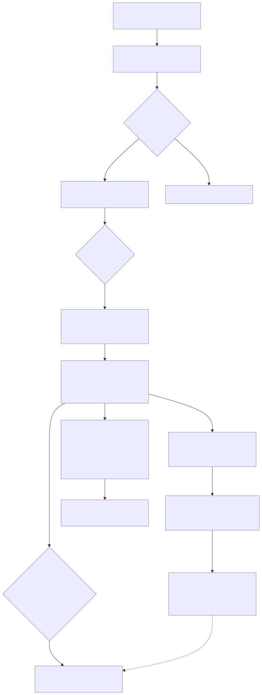
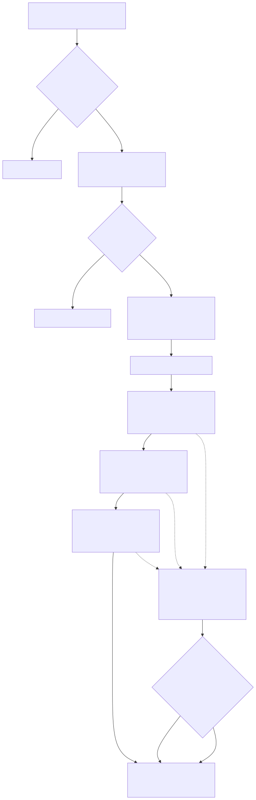
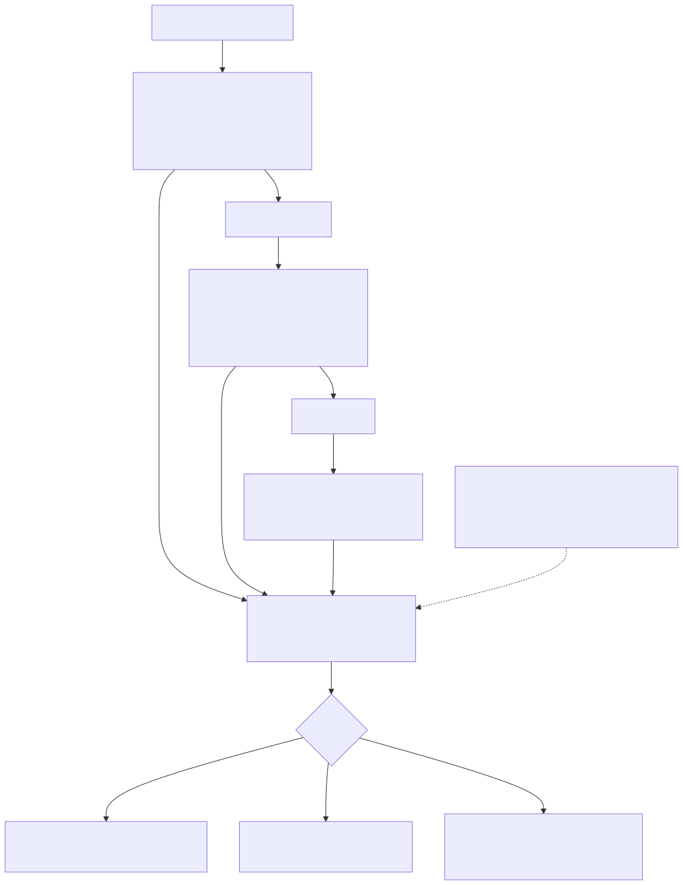

# LambdaJS — Web Platform: DOM, CSSOM, Events & Fetch

> **Last verified against tree:** 2026-09-01

> **Part of the [LambdaJS detailed-design set](JS_00_Overview.md).** This document covers the Web-platform host objects: the DOM bridge to Radiant's `DomNode`/`DomElement` tree, element/document API dispatch, CSS selector queries and layout-metric reads, the 3-phase event system, the CSSOM, OffscreenCanvas text measurement, XHR/fetch/FormData/clipboard, and Selection/Range.
>
> **Primary sources:** `lambda/dom/dom.{h,cpp}` (DOM wrap/unwrap, element & document dispatch, layout metrics, computed style, classList/dataset), `lambda/dom/dom_events.{h,cpp}` (EventTarget, listener storage, dispatch), `lambda/dom/dom_cssom.{h,cpp}` (CSSOM wrappers, CSS namespace), `lambda/dom/dom_canvas.cpp` (OffscreenCanvas/`measureText`), `lambda/dom/dom_xhr.{h,cpp}`, `lambda/dom/dom_fetch.cpp`, `lambda/dom/dom_formdata.cpp`, `lambda/dom/dom_clipboard.cpp`, `lambda/dom/dom_selection.{h,cpp}`, and `lambda/js/js_object_meta.{h,cpp}` (host metadata/ops bridge). The property kernel is in `lambda/js/js_runtime.cpp`.
> **Audience:** engine developers. **Convention:** `file:line` references drift; confirm against symbol names.
>
> **Relocated 2026-09-01 (DOM API F22–F26).** This layer moved from `lambda/js/` to **`lambda/dom/`** and dropped its `js_` prefix (`js_dom_*` → `dom_*`), because after F17–F20 it is the DOM mechanism *both* realms drive, not JS-private code: the Lambda `dom` package reaches it through the `radiant.*` waist, and `import dom` now reaches it directly. What JS adds on top — class stamps, prototypes, realm globals — is the adapter layer, partly extracted and tracked in `vibe/Lambda_Design_DOM_API.md` (ES32–ES38, ESO79/ESO81). The JS behaviour described below is unchanged by the move.

---

## 1. Purpose & scope

Current Web-platform host objects are native VMaps branded by the
Radiant/JS DOM bridges. Under **D3.4.7/D7.4.1–D7.4.3**, the property kernel
resolves their host-family metadata and delegates through the single VMap/Jube
bridge; declared member records and record-owned hooks remain authoritative under
D7.4.4. Physical `MapKind` tags
are not DOM semantic classifiers. This document describes DOM-node VMaps,
document/foreign-document VMaps, CSSOM/style host resources, and the
the metadata-qualified CSS namespace ordinary object.

The DOM/CSSOM layers are **views over Radiant's structures**: a wrapper Map never owns layout state, it points at a `DomNode`/`DomElement`, `CssStylesheet`, `CssRule`, or `DomRange`/`DomSelection` living in Radiant's pools. The layout engine itself (block/inline/flex/grid/table) is documented in `doc/dev/Radiant_*` and is **out of scope here** — we only describe the JS-visible surface and the dirty/lazy-layout contract between them.

---

## 2. The DOM bridge

**Native node wrapping.** `dom_wrap_element` returns a branded native VELMT whose `host_type` identifies the Radiant DOM-node interface and whose `host_data` points at the `DomNode` (D7.4.5v2). `dom_unwrap_element` tests this native brand through the Radiant bridge; property lookup, enumeration, descriptors, prototypes, and expandos enter the shared property protocol.

**Identity cache.** `dom_cached_node_wrapper` / `dom_cache_node_wrapper` in `dom_cssom.cpp` use a realm-owned hash index and collector-registered weak slots. Entries lease native node generations through the document registry, preserving repeated wrapper identity without rooting unreachable wrappers (D4.5.1v4). The document stub uses the Document interface, so `range.startContainer === document` holds.

**Attribute nodes.** `DomAttr` is a document-owned node with independent namespace/name/value storage, an optional owner element, and a Node-derived `Attr` interface. `getAttributeNode`, `NamedNodeMap`, and attribute-node mutation methods share canonical native identity. Replacement detaches the old Attr without changing its value; attached `value` writes use ordinary mutation handling. A live Attr wrapper leases its owner, and adoption transfers registry leases while retaining the physical source pool. Removed attributes and their strings recycle through native retirement (D4.5.1v4); temporary MutationRecord fields use precise roots until the observer's pending list owns them (D5.3.3).

**Document proxy & foreign docs.** Bare `document` resolves to a singleton branded VMap whose `host_data` is the active browsing-context `DomDocument*`. The Radiant declared interface publishes document operations as concrete callable properties; properties use `js_document_proxy_get_property`. `document.implementation.createHTMLDocument`/`createDocument` build branded foreign-document VMaps whose bridge swaps the active document around the same declared operations when needed.

---

## 3. Element & document API dispatch

The VMap host-object bridge in `js_property_get`/`js_property_set` is the
primary entry from the ordinary pipeline. DOM nodes, Range/Selection,
inline/computed style, CSSOM, and document/foreign-document proxies are
recognized by host metadata before ordinary map property access. Their type
prototypes and property hooks publish callable method values; an ordinary
source method call still performs observable property `Get` followed by the
stored function's `[[Call]]`, as required by **D6.2.2v2**. Host dispatch helpers
implement the selected method body after lookup; they are not compiler
receiver/name call routes.

- **`dom_get_property`** (`dom.cpp`) handles DOM-node property reads after native host predicates have separated Range/Selection, style, CSSOM, and document resources. It dispatches the property name for `tagName`, `id`, `className`, `textContent`, tree navigation (`parentNode`, `firstElementChild`, `childNodes`, ...), `nodeType`, layout metrics ([§4](#4-css-selector-queries--lazy-layout)), `innerHTML`/`outerHTML` serialization, and falls back to `getAttribute`.
- **`dom_set_property`** handles `className`/`id`/`textContent`/`data` and the **`innerHTML` setter** (`:6959`): it removes existing children, runs the Radiant HTML5 *fragment* parser (`html5_fragment_parser_create`/`html5_fragment_parse`, `:6987`), converts the parsed Lambda `Element`s into `DomNode`s via `build_dom_tree_from_element`, re-registers element ids on the Window, and marks the subtree dirty.
- **Declared DOM operations** originate in `radiant_dom_interface_decl` / `radiant_dom_bindings` and enter `radiant_dom_element_operation` with a `JubeDomElementOperation` selected when the function property is published. `dom_element_operation_impl` owns the host algorithms for attributes, tree mutation, selectors, geometry, and events. The enum is an executable target capability, not a property name crossing the call ABI. `ChildNode.after` and `replaceWith` share one backing-aware relative-insertion kernel so node moves and string arguments preserve both DOM links and the Mark tree.
- **classList / dataset / style.** Declared interface records publish direct operations for token-list and CSS methods; property hooks handle `length`/`value`, camelCase ↔ `data-kebab-case`, and camelCase ↔ hyphenated CSS conversion.

Document declared operations cover `getElementById`, `getElementsByClassName`/`TagName`/`Name`, `querySelector`/`All`, `createElement`/`createTextNode`, and `createRange`/`getSelection` (forwarded to `dom_selection`).

The native interface tables also publish `Document.cookie`, `Document.write`, and `Element.innerHTML` on their canonical prototypes. Libraries can inspect and wrap the same accessors and methods used by instance reads, rather than encountering an absent descriptor.

**DocumentType and ChildNode prototypes (verified 2026-10-09).** `DocumentType` is a non-constructible Node-derived interface. Doctype wrappers select it by native node kind even though their allocation shares comment storage (**D3.4.7**). The existing Jube `dom_node` bindings publish `before`, `after`, `replaceWith`, and `remove` on Element, CharacterData, and DocumentType prototypes; receiver checks and operation bodies remain shared (**D7.4.4, D6.2.2v2**). `test/ui/dom/document_type_interface` checks doctype branding, captured mutations on elements/text/comments, detached doctypes, and forged receivers, including forced-collection runs. This follows the [DOM ChildNode mixin](https://dom.spec.whatwg.org/#interface-childnode).

**History interface (verified 2026-10-09).** `dom_install_history_interface` uses the existing realm interface installer to publish the non-constructible `History` interface and link the native `history` object to `History.prototype`. The prototype owns `pushState`, `replaceState`, `back`, `forward`, and `go`; their observable names and WebIDL lengths are independent of their native adapter arities (**D6.2.2v2**). `dom_history.cpp` retains the receiver identity in its realm-lifetime context capsule, rejects forged receivers, and releases its exact root before heap replacement (**D5.3.5, D5.4.2**). Captured prototype methods share the existing Radiant history operations. `test/ui/dom/history_interface` checks the prototype, branding, illegal construction, receiver validation, and captured calls; the existing hash and popstate fixtures check traversal delivery. The interface follows the [HTML History surface](https://html.spec.whatwg.org/multipage/nav-history-apis.html#the-history-interface); cross-document reload remains outside the existing traversal implementation.

**TreeWalker interface (verified 2026-10-09).** The realm publishes `TreeWalker` with an illegal constructor and the existing `nextNode`, `firstChild`, and `nextSibling` traversal operations on its prototype. `dom_create_tree_walker_bridge` creates a metadata-branded walker and binds that prototype; captured methods use their current receiver instead of a per-instance bound argument. Forging the prototype or string tag does not satisfy the native receiver check (**D3.4.7, D6.2.2v2**). Interface-member installation and instance prototype binding are shared with Storage and History. `test/ui/dom/tree_walker_interface` checks traversal, captured calls on different walkers, and forged-receiver rejection.

**DOMImplementation interface (verified 2026-10-09).** The realm exposes the existing document-creation operations on `DOMImplementation.prototype` and binds `document.implementation` to it, so scripts can capture and call those methods through their native receiver. The shared interface installers retain an illegal constructor, string tag and WebIDL method lengths; forged receivers fail the singleton identity check (**D3.4.7, D6.2.2v2**). `test/ui/dom/document_implementation_interface` covers captured methods, document creation, identity and receiver checks. Created doctypes retain their public/system identifiers in the backing element; their name and identifiers are exposed through shared DOM property reads, while `nodeValue` and `textContent` are null instead of inherited comment data (**D1.3v3**). Surface: [DOM Standard §4.5.1](https://dom.spec.whatwg.org/#interface-domimplementation).

**HTML resource interfaces (verified 2026-10-09).** The shared HTML tag catalog also selects the Area, Base, Embed, Frame, Object, Picture, Source and Track prototypes. Resource wrappers retain their constructor identity and HTMLElement ancestry (**D3.4.7, D6.2.2v2**). The existing guarded `href` binding is published on the declaring Anchor, Area, Base and Link prototypes, allowing captured getters and setters to use native receivers even after a wrapper's prototype changes. `test/ui/dom/html_resource_interfaces` verifies that surface in both execution tiers and under forced collection (**D5.3.3**).

**Node base URI (verified 2026-10-09).** `Node.prototype.baseURI` publishes the declared `dom_node.base_uri` member through the canonical property reader (**D7.4.4**). Document proxies and all native node kinds resolve their owning document, including detached CharacterData and attributes retained by the registry (**D1.3v3**). The reader selects the first connected `base[href]` in tree order, resolves its URL against the document URL, and falls back for invalid or prohibited schemes. `test/ui/dom/node_base_uri` checks captured getters, base mutation/removal, receiver validation and adoption. Surface: [DOM Node baseURI](https://dom.spec.whatwg.org/#dom-node-baseuri) and [HTML document base URLs](https://html.spec.whatwg.org/multipage/urls-and-fetching.html#document-base-url).

**Captured document properties (verified 2026-10-09).** The Document interface publishes its existing native property bindings, including `implementation`, `defaultView`, `currentScript`, tree roots and document metadata. Captured getters use the native receiver and its document, including foreign documents and wrappers with changed prototypes (**D3.4.7, D7.4.4**). `test/ui/dom/document_captured_properties` checks those paths and rejects forged receivers. The shared adoption path now transfers registry ownership for detached nodes as well as attributes, preserving their owner-document-dependent properties (**D1.3v3, D4.5.1v4**).

**Captured collection lengths (verified 2026-10-09).** NodeList and HTMLCollection
publish readonly prototype getters before the first wrapper exists. Declared
inheritance admits native RadioNodeList, form-control and options collections
while rejecting unrelated brands, including after public prototype changes
(**D3.4.7, D7.4.4**). Form named-property access and `elements.namedItem()` share
the rooted collection lookup; multiple matches return a live filtered
RadioNodeList (**D1.3v3, D5.3.3**).
`test/ui/dom/collection_captured_length` passes 12 assertions in MIR and AST,
normally and under forced collection, and agrees with Chromium. Surface:
[HTML form-control collections](https://html.spec.whatwg.org/multipage/common-dom-interfaces.html#htmlformcontrolscollection).

**Captured dataset getters (verified 2026-10-09).** HTMLElement and SVGElement
publish separate declared getters with namespace-specific native receiver
checks (**D3.4.7, D7.4.4**). Retained dataset reads, writes and `Reflect.set`
share the DOM catalog bridge, so reads see current attributes after additions
and removals (**D1.3v3, D5.3.3**). The appended `get_data` row preserves existing
catalog offsets. `test/ui/dom/dataset_captured_getters` passes 12 assertions in
both tiers, normally and under forced collection, and agrees with Chromium.
Dataset views still use ordinary Map storage; SameObject identity, dynamic
enumeration and deletion remain incomplete.

**Captured Window close state (verified 2026-10-09).** The Window global owns a
readonly native `closed` accessor with receiver validation (**D6.2.2v2**).
Its catalog read uses the attached host's approved-close state, including the
initial script stage before `UiContext.document` is published, and reports a
closed context when no host remains (**D1.3v3, D4.5.1v4**).
`test/ui/dom/window_closed_captured_getter` verifies captured access and the
platform close transition in both tiers and under forced collection; its
initial descriptor and brand checks agree with Chromium. Surface:
[HTML Window.closed](https://html.spec.whatwg.org/multipage/nav-history-apis.html#dom-window-closed).

**Observer interfaces (verified 2026-10-09).** The realm installs distinct MutationObserver, ResizeObserver, and IntersectionObserver constructors with shared prototype operations, string tags, names, and WebIDL lengths. The adapter rejects construction without `new`; captured methods validate the native receiver's observer kind (**D6.2.2v2**). `takeRecords` retains the drained array while allocating its replacement, and observer fields use interned keys so allocating a value cannot collect a temporary property key (**D5.3.5, D5.4.1**). `test/ui/dom/observer_interfaces` checks captured observation, draining, disconnection, and forged/cross-kind receivers in normal and forced-collection runs. The published operations follow the [MutationObserver](https://dom.spec.whatwg.org/#interface-mutationobserver), [ResizeObserver](https://drafts.csswg.org/resize-observer/#resize-observer-interface), and [IntersectionObserver](https://w3c.github.io/IntersectionObserver/#intersection-observer-interface) interface definitions.

**Media-query ownership and delivery (verified 2026-10-09).** `dom_match_media` retains its query input and EventTarget object through construction; interned field names survive allocations of their values/functions. The existing accessor installer publishes `matches` without a second descriptor-building path. Resize notification roots the target and change event through field population and dispatch (**D5.3.3, D5.3.5**). The canonical EventTarget dispatcher owns `onchange` delivery, so the notifier no longer invokes that handler twice. `test/ui/dom/match_media_gc_ownership` checks initial values, allocating legacy/onchange callbacks, listener removal, live matching, and exactly one delivery per resize. All 12 assertions pass under forced collection and poisoned frees; both resize states agree with Chromium and the [CSSOM View MediaQueryList interface](https://drafts.csswg.org/cssom-view/#the-mediaquerylist-interface).

**History state cloning (verified 2026-10-09).** Recursive `structuredClone` destinations, enumerated keys, and child values stay precisely rooted until publication (**D5.3.5, D5.4.1**). Array clones append into an empty destination rather than creating leading holes. `JsStructuredClone.RetainsRecursiveDestinationsAcrossEveryAllocation` checks distinct nested objects and array contents under forced collection and poisoned frees in both AST and MIR; the History interface fixture verifies state after `replaceState` under the same stress.

**Autofocus dispatch (verified 2026-10-09).** The existing package policy selects the candidate (**ES30**), then `radiant_run_autofocus` receives the enclosing host's `UiContext` for the public focus/focusin dispatch. An author listener can insert a stylesheet and trigger retained layout through that same context; a document-only event context cannot supply its viewport or layout services. Window and document-rebuild callers pass their current host explicitly. `test/ui/js_autofocus_listener_relayout` reproduces the former null-context crash and checks focused identity and geometry after the listener's full recascade.

**Web Animation cancellation (verified 2026-10-09).** `Animation.prototype.cancel` operates on the receiver's native effect through an ordinary shared method (**D6.2.2v2**). Cancellation makes `currentTime` unresolved, excludes the effect from sampling/computed-style queries, and requests layout without a DOM mutation. The existing CSS-animation transform-restoration helper also clears a retained sample when the cascade has no transform declaration. Effect state remains document-owned (**D4.5.1v4**); a later numeric seek reactivates it, including the preceding timestamp, and recaptures underlying values after intervening style changes. Current-time conversion keeps its receiver/input rooted and preserves thrown values (**D5.3.5, D5.4.1**). `test/ui/dom/animation_cancel` checks sizing, opacity, transforms, repeat cancellation, shared-method metadata, receiver rejection, and neutral-keyframe resampling across host event commits; its 13 script checks agree with Chromium, and all 17 native UI assertions pass under forced collection. This implements cancellation of the existing explicitly sampled effects following [Web Animations cancellation](https://www.w3.org/TR/web-animations-1/#canceling-an-animation); automatic playback, finished promises, and playback-event dispatch remain incomplete.

---

## 4. CSS selector queries & lazy layout

**Selector matching reuses the Radiant CSS matcher** — `dom.cpp` includes `input/css/selector_matcher.hpp` (`:36`). `querySelector`/`querySelectorAll`/`matches`/`closest` parse the selector text with `css_parse_selector_with_combinators` (`parse_css_selector`, `:2918`), build a `SelectorMatcher` via `selector_matcher_create`, then call `selector_matcher_find_first` / `selector_matcher_find_all` / `selector_matcher_matches` (`:3148`,`:3171`,`:7903`). The same matcher backs on-demand `getComputedStyle` cascade resolution (`:2343`). There is no second selector engine — JS DOM queries and the layout engine share one.

**Layout-metric reads & the lazy contract.** `offsetWidth`/`offsetHeight`/`clientWidth`/`clientHeight`/`offsetTop`/`offsetLeft`/`offsetParent` (`dom.cpp:5777`–`5810`) read the `DomElement` geometry fields (`elem->width`, `->height`, `->x`, `->y`, and `bound->border` for the client-box border subtraction) directly. `getBoundingClientRect` (`:8442`) sums `x`/`y` up the parent chain to an absolute box. These fields hold real pixels **only after a Radiant layout pass** (`layout_html_doc`); before first layout they are 0, which the code notes "matches current browser behaviour for scripts that run before first paint" (`:5772`).

DOM **mutations** (appendChild, innerHTML, attribute/style writes) don't relayout synchronously — they call `dom_mutation_notify`, which sets `layout_dirty` on the subtree and ancestors via `dom_mark_dirty_subtree`/`_ancestors` (`:181`,`:194`), clears `styles_resolved`, and records a `DomJsMutationRecord` (kind + target + sequence) into a per-document ring (`:221`). A later layout pass consumes the dirty flags. The metric getters do **not** force a flush, so the "lazy layout" here is a *dirty-marking* protocol, not an on-read reflow — see [Known Issues](#known-issues--future-improvements).

The mutation kind is classified so a future incremental engine can scope work: child mutations record `DOM_JS_MUTATION_CHILD_INSERT`/`CHILD_REMOVE` (`:348`,`:354`), while style writes map to `DOM_JS_MUTATION_STYLE_REPAINT` for paint-only properties (`background-color`, `color`, `opacity`, `visibility`) versus `DOM_JS_MUTATION_STYLE` for layout-affecting ones (`dom_style_mutation_kind`, `:209`). The per-document `js_mutation_kind_mask` accumulates a bitmask of all kinds seen since the last pass, and records past `DOM_JS_MUTATION_RECORD_CAP` bump an overflow counter rather than growing unbounded (`:233`).

**Computed style.** `js_get_computed_style` returns a branded native VMap tagged as computed style; `js_computed_style_get_property` resolves camelCase/hyphenated CSS names against the cascade, normalizing named colors to `rgb()`.

---

## 5. The event system

**EventTarget surface.** `addEventListener`/`removeEventListener`/`dispatchEvent` (`dom_events.h:29`–`43`) work on DOM nodes, the document proxy, the Window, and plain `new EventTarget()` objects (`js_create_event_target`, `:90`). `parse_listener_options` (`dom_events.cpp:332`) accepts either a boolean `useCapture` or an options object `{capture, once, passive, signal}`.

**Listener storage is external** — the `DomNode` struct is never modified. A file-static flat array `NodeListenerEntry _entries[]` maps a `void* key` → `NodeListeners {EventListener* items; count; capacity}` (`:230`–`244`). `get_event_target_key` (`:251`) derives the key: the `DomNode*` for elements, `&_document_sentinel` for the document proxy, `&_window_sentinel` for the global, or the object pointer itself for a plain EventTarget. Each `EventListener` (`:218`) carries the type string, callback, `capture`/`once`/`passive` flags, an `AbortSignal`, and a `removed` tombstone. `get_or_create_listeners`/`find_listeners` (`:277`,`:305`) **linearly scan** `_entries` (geometric grow, `:286`) — O(n) in distinct targets.

**One-record, two-tier dispatch.** `dom_dispatch_event` first validates the
event and its `__dispatch_flag`, then routes a native DOM record through
`radiant_dispatch_synthetic_dom_event` when necessary. The shared engine owns
the target → ancestor → document → window path. Its author tier fires capture
listeners, target listeners, and bubble listeners; after each node's JS
target/bubble listeners it invokes that node's Lambda template participant.
The UA tier runs only after the author cascade has settled and only when the
record is not default-prevented (ES22–ES29).

`fire_listeners` snapshots matching listeners before invocation, preserving
`once`, removal, and `AbortSignal` behavior under mutation. The one native
record carries `eventPhase`, `currentTarget`, `default_prevented`, and the
stop state for both realms through the D3.4.7/D7.4.1–D7.4.4 host bridge.
`stopPropagation`/`stopImmediatePropagation` read only `__stop_prop` and
`__stop_imm` on that record; the former thread-local mirrors are retired.
Teardown clears the dispatch/stop state while preserving cancellation according
to the DOM event contract. F19 removed the former JS-only activation pass, so
checkbox/radio/popover policy is the shared UA-tier claim protocol instead.

**MessageEvent native interface (verified 2026-10-09).** The constructor has
separate call/construct capabilities and applies `newTarget.prototype`
(**D6.2.2v2**). Readonly prototype getters validate the native Event record's
class and read a private, GC-traced payload; public shadows and prototype
changes cannot replace that payload (**D7.4.4**, **D5.3.3**). Dictionary
conversion follows inherited-member and alphabetical order, and `ports`
owns a frozen sequence. `initMessageEvent` converts arguments before updating
the record and leaves a dispatching event unchanged. The shared Jube protocol
stores prototype overrides and extensibility in the wrapper's traced property
storage. Channel and port constructors retain their unpublished objects
through method/queue allocation. The `message_event_native_interface` fixture
passes both execution tiers with normal and forced GC. Chromium 152 agrees
except that its `origin` retains lone surrogates; Lambda follows the current
[HTML MessageEvent](https://html.spec.whatwg.org/multipage/comms.html#the-messageevent-interface)
and [Web IDL USVString](https://webidl.spec.whatwg.org/#es-USVString) conversion.
Window and MessagePort delivery use the native factory; Window messages use
the shared clone helper, and browser port listeners share one Event envelope.
Dequeued values and listener snapshots remain precise roots during callbacks.
The traced owner retains payloads and GC-owned targets without allocating an
arena name per event. `message_event_delivery` covers both tiers and forced GC;
its HTTP browser reference passes. Target-origin filtering, transferred-port
projection, and ServiceWorker sources remain incomplete.

---

## 6. CSSOM & the CSS namespace map kind

CSSOM wrappers are branded native VMaps with host data pointing at the stylesheet, rule, or declaration state. `dom_cssom_wrap_stylesheet` stores a `CssStylesheet*`; `dom_cssom_wrap_rule` stores a `CssRule*` and associated serialization state. The VMap host gate routes by CSSOM predicate: `js_is_stylesheet` -> stylesheet getter/`insertRule`/`deleteRule`; `js_is_css_rule` -> rule `selectorText`/`style`/`cssText`; else the declaration getter/setter.

`CSSStyleDeclaration` access is camelCase-aware: `dom_cssom_rule_decl_set_property` re-parses the value as CSS and replaces/adds the declaration (`dom_cssom.h:110`). Font-face rules expose declarations via a synthesized **shadow `CssRule`** of type `CSS_RULE_STYLE` cached in the rule's repurposed legacy fields (`:456`). This CSSOM property model — camelCase ↔ hyphenated, per-declaration storage — mirrors the property machinery in [JS_06](JS_06_Objects_Properties_Prototypes.md).

**Declaration-write comparison verified 2026-10-09:** property setters and
removal compare the declaration block's serialization before and after the
edit, as required by [CSSOM's declaration-setting contract](https://drafts.csswg.org/cssom/#set-a-css-declaration).
An unchanged block does not publish an attribute mutation or invalidate layout;
`cssText` retains its unconditional attribute-update behavior. Comparison
strings belong to the declaration view's scratch pool (**D4.5.1v4**) rather
than the stylesheet's persistent pool. The
`cssom_idempotent_declaration_writes` UI fixture covers ordinary, important,
custom, shorthand and named writes, removal, `cssText`, and an observer that
writes its observed value back before reading geometry.

**Resize sampling verified 2026-10-09:** ResizeObserver's CSS-box path uses
the engine seam's untransformed content and border sizes, with logical axes
and a padding-relative content rectangle. A transform on the target or an
ancestor does not publish a resize; IntersectionObserver continues to use
visual rectangles. This follows the [Resize Observer box-size algorithm](https://drafts.csswg.org/resize-observer/#calculate-box-size).
The DOM's engine call remains native-data-only under **ES40**;
`resize_observer_css_boxes` checks content and border sizes, transform-only
changes, and a real width change.

**Relational invalidation verified 2026-10-09:** the notifier marks a data/ARIA
attribute as local only when the active stylesheet rules have no `:has()`
argument referencing that name. The shared selector walk handles nested
functional selectors and imported rules. Direction, scope, column and
stylesheet-mutation guards still apply; a stylesheet edit later in the same
batch forces a broad recascade. The native provider follows **ES40**;
`dom_mutation_attribute_relational_scope` checks both local writes and
ancestor styling through existing and newly inserted dependencies.
Child-list edits also check whether a descendant/child `:has()` selector has
a possible anchor in the edited parent's ancestry. Unrelated insertions and
removals keep the local recascade; sibling/column relations and possible
ancestor anchors retain the broad path. Static anchor tests reuse the selector
matcher, and journal ownership remains document-scoped (**D4.5.1v4**).
When neither structural selectors nor relational anchors depend on a child-list
edit, the cascade visits only the inserted subtree; removals retain existing
styles. Layout still processes the dirty ancestry. Position and `:empty`
selectors recascade the parent when its children or the parent can match
their static selector ancestry, verified by `StyleEpochTest`.
`dom_mutation_child_relational_scope` covers unrelated probes, nested `:not()`,
ancestor changes, stylesheet insertion, and a sibling dependency.

`insertRule`/`deleteRule` mutate the **live** `CssStylesheet` in place: `insertRule` range-checks the index, re-tokenizes and re-parses the rule text into a `CssRule`, and splices it into the sheet's rule array (`dom_cssom.cpp:690`); `deleteRule` range-checks and removes (`:743`). Because wrappers hold the underlying pointer (not a copy), subsequent `cssRules` reads observe the change.

`document.styleSheets` returns an array of wrapped sheets (`dom_cssom_get_document_stylesheets`, `:1228`); `HTMLStyleElement.sheet` finds the sheet parsed from that `<style>` element. The **CSS namespace** object (`CSS.supports`, `CSS.escape`, `CSS.registerProperty`) is a metadata-qualified ordinary `Object.create(null)` Map created by `js_get_css_object_value`, with realm-local methods installed as real non-enumerable properties. Physical `map_kind` is not consulted for ordinary property reads.

**Registration path verified 2026-10-06:** `js_intrinsic_css_register_property_body` selects its native executable through the builtin catalog (**D6.2.2v2**) and calls the CORE DOM catalog operation through the Jube host API (**D7.3.3–D7.3.4**). `dom_css_register_property_operation` roots the definition and converted strings across getters and coercion (**D5.3.3**), then uses the shared syntax/initial-value parser. `css_register_document_property` retains an owned definition in the document pool (**D4.5.1v4**). `css_find_document_property_registration` gives that definition precedence over active stylesheet rules. Registration marks global style change; layout and computed-style reads use the same registration lookup. The four `test/ui/css_registration_api*.json` fixtures cover 66 browser-confirmed conversion, validation, complete-name and live-style assertions; cross-realm invocation, branded rule interfaces and registered-property interpolation still require implementation or verification.

---

## 7. Canvas / measureText via the Radiant font engine

OffscreenCanvas exists for **text measurement only** (`js_canvas.cpp:2`). Realm construction publishes `OffscreenCanvas` as a replaceable global native constructor with an explicit `[[Construct]]` capability; `new OffscreenCanvas(w, h)` uses the same property-resolution and `js_construct_value` path as other constructors. Renaming the function does not change its body, while replacing the global binding is observed. The canvas and its `getContext("2d")` context are plain objects stamped with `JS_CLASS_OFFSCREEN_CANVAS` / `JS_CLASS_CANVAS_RENDERING_CONTEXT_2D`; the selected method function delegates to `js_canvas_method_dispatch` for its host algorithm.

Measurement uses **Lambda's unified font engine** (`lib/font/`): a singleton `FontContext` (`:31`), a fixed `FontHandle*` pool of `MAX_CANVAS_FONT_HANDLES` indexed by integer id stored in the `__font_handle_id` expando (`:50`,`:271`). Setting `ctx.font` parses the CSS font shorthand (`parse_css_font_shorthand`, `:85`) and resolves a `FontHandle` via `font_resolve`. `js_canvas_measure_text` (`:302`) calls `font_measure_text` and returns a `TextMetrics`-shaped `{width}` object, falling back to a `len * size * 0.5` heuristic when no handle resolves (`:222`). Setting `ctx.font` at runtime is intercepted by the property-set path (`js_runtime.cpp:5406`).

---

## 8. XHR / fetch / FormData / clipboard, Selection/Range

**XMLHttpRequest** (`lambda/dom/dom_xhr.cpp`) stores request state in its realm capsule. Asynchronous requests reuse fetch's libuv transport; explicit synchronous requests use `http_fetch`. Completion walks `readyState` 2→3→4 and dispatches callbacks. Construction roots the wrapper, status descriptor, and upload target until publication; methods use the shared rooted native installer (**D5.3.3**, **D6.2.2v2**). The asynchronous body handoff consumes an ArrayBuffer so UTF-8 text decoding cannot alter transport bytes. The HTTP backing (`http_fetch`, `FetchResponse`) is shared with [JS_14 — Node Compatibility](JS_14_Node_Compat.md).

**fetch** (`lambda/dom/dom_fetch.cpp`) returns `Promise<Response>`. `lambda/js/js_response.cpp` publishes the realm's native `Response` constructor and prototype. A branded private record owns GC-traced body bytes and Headers, replacing the public body index and fixed response table (**D3.4.7**, **D5.3.3**). Captured getters and methods validate that record even after the public prototype changes. Non-null bodies are consumed once; `text` decodes UTF-8, `json` rejects malformed JSON, and `arrayBuffer`/`bytes`/`blob` produce owned native values. `clone` independently owns bytes and a Headers snapshot without invoking a replaced public iterator. Constructor input supports strings, ArrayBuffer views, and native Blob/File values. Stream bodies, the `body` stream getter, `formData`, and static Response factories remain incomplete; see the [Fetch Body specification](https://fetch.spec.whatwg.org/#body-mixin).

**FormData** (`dom_formdata.cpp`) carries native branding and entries with IDL methods and Blob/File coercion. **Navigator** (`dom_clipboard.cpp`) has a native interface prototype with branded readonly getters. Its existing host preferences and clipboard/permissions/serviceWorker objects live in a private traced record; `languages` is frozen, and captured getters ignore public shadows (**D3.4.7**, **D5.3.3**). The shared interface installer supplies an illegal constructor with the correct zero-argument metadata (**D6.2.2v2**). **navigator.clipboard** uses the platform clipboard store and native ClipboardItem/Blob/File objects.

**Selection / Range** are native VMap host objects backed by `radiant/dom_range`. The declared member records publish `Range.commonAncestorContainer` and Selection's readonly attributes as branded prototype accessors (**D7.4.4**); captured getters read current native boundaries and reject forged receivers. Script mutations of the selected Range preserve selection direction even when the Range collapses, as required by the [Selection API](https://www.w3.org/TR/selection-api/#dfn-direction). The interaction validator accepts that state while retaining enum, boundary, and shadow consistency checks. `StaticRange` remains an immutable snapshot used by `InputEvent.getTargetRanges()`.

---

## Known Issues & Future Improvements

1. **DOM API coverage is incomplete.** The declared element/document surface is broad but not complete; browser libraries continue to expose missing Node/Range/style behavior. A missing declared member is observable as `undefined`, so library probes remain part of the JS suite.
2. **No on-read layout flush.** Layout-metric getters read stale `DomElement` geometry; mutations only set `layout_dirty` (`dom.cpp:181`) without forcing a relayout, so a script that mutates then reads `offsetWidth` in the same turn sees pre-mutation pixels (or 0 before first layout). A spec-faithful engine would flush pending layout on metric access.
3. **Canvas remains intentionally narrow.** `OffscreenCanvas` now has ordinary replaceable global-constructor semantics, but the implementation supports text measurement rather than the general Canvas 2D, bitmap, or WebGL surfaces.
4. **Text segmentation remains narrow; Bidi is absent.** `Intl.Segmenter` is a construct-only callable with a realm-local prototype and a basic segment operation, sufficient for current editor libraries, but it is not a complete ICU-grade implementation. There is no bidirectional-text algorithm; FormData/clipboard direction remains hard-coded and canvas fallback width is a per-character heuristic.
5. **`dom.cpp` size & per-access logging.** The file is ~9,500 lines with ~50 `log_debug` call sites on hot get/method paths (e.g. every `dom_get_property` on a non-node logs, `:5340`); the `strcmp` ladder in `dom_get_property` re-tests every property name linearly per access. Both add avoidable per-access overhead in tight DOM loops — see [JS_15 — Performance](JS_15_Performance.md).
6. **O(n) listener and wrapper storage.** Event listeners live in a flat `_entries` array scanned linearly by target key (`dom_events.cpp:277`), and the DOM wrapper identity cache is a linked list of chunks scanned linearly per wrap (`dom.cpp:820`). Documents with many distinct event targets or many wrapped nodes degrade quadratically. *Improvement:* hash both keyed structures.

---

## Appendix A — Source map

| File | Responsibility (this doc) |
|---|---|
| `lambda/dom/dom.{h,cpp}` | DOM wrap/unwrap sentinel, identity cache, element/document dispatch, layout metrics, computed style, classList/dataset, innerHTML, selector queries. |
| `lambda/dom/dom_events.{h,cpp}` | EventTarget, external listener storage, 3-phase dispatch, event/subclass/native factories. |
| `lambda/dom/dom_cssom.{h,cpp}` | `MAP_KIND_CSSOM` stylesheet/rule/declaration wrappers, CSS namespace object. |
| `lambda/dom/dom_canvas.cpp` | OffscreenCanvas, `measureText`, FontHandle pool over `lib/font/`. |
| `lambda/dom/dom_xhr.{h,cpp}`, `dom_fetch.cpp`, `lambda/js/js_response.{h,cpp}` | XHR/fetch transport and branded, byte-owning Response values. |
| `lambda/dom/dom_formdata.cpp`, `dom_clipboard.cpp` | FormData, Navigator, clipboard / ClipboardItem / Blob / File. |
| `lambda/dom/dom_selection.{h,cpp}` | Range / Selection / StaticRange over `radiant/dom_range`. |
| `lambda/js/js_runtime.cpp` | Exotic get/set gate routing to the bridges; CSS-namespace tagging; canvas font-set intercept. |
| `lambda/js/js_globals.cpp` | Realm-local Web/DOM constructor publication, including `OffscreenCanvas`. |
| `lambda/js/js_dom_adapter.cpp` | JS-side adapter for the core: today the scheduling seam behind `dom_schedule_microtask` / `dom_schedule_task`. |
| `lambda/dom/dom_module.cpp` | The Lambda-facing `import dom` module — the same core, other door. |

## Appendix B — Related documents

- [JS_06 — Objects, Properties & Prototypes](JS_06_Objects_Properties_Prototypes.md) — `MapKind` enum, the exotic-dispatch gate, and the property model the CSSOM mirrors.
- [JS_10 — Standard Built-in Library](JS_10_Builtins.md) — the intrinsic catalog that installs realm-local namespace and collection properties.
- [JS_14 — Node Compatibility](JS_14_Node_Compat.md) — the `http_fetch`/`FetchResponse` HTTP backing shared with XHR/fetch.
- [JS_15 — Performance & Optimization](JS_15_Performance.md) — fast paths and the per-access / O(n) overheads called out above.
- Radiant layout/cascade/selection internals live in `doc/dev/Radiant_*` (outside this set).
