# LambdaJS — Node.js Compatibility Layer

> **Part of the [LambdaJS detailed-design set](JS_00_Overview.md).** This document covers the Node.js compatibility layer: how a module specifier becomes a namespace object (built-in dispatch, `node:`/bare/relative resolution, conditional `exports`), the embedded npm client (package.json parse, semver, BFS dependency resolution, pnpm-style symlink install, `lambda-node.lock`), and the per-module implementations with their actual backing and gaps.
>
> **Primary sources:** `lambda/js/js_runtime.cpp` (`js_module_get`, `js_module_register`, the `JsModule` cache, inline stub modules), `lambda/js/js_mir_entrypoints_require.cpp` (`js_require`, `js_dynamic_import`, `js_is_cjs_file`, `js_wrap_cjs_source`), `lambda/js/js_mir_module_batch_lowering.cpp` (`jm_resolve_module_path`), `lambda/npm/` (`npm_resolve_module.cpp`, `npm_resolver.cpp`, `npm_installer.cpp`, `npm_registry.cpp`, `npm_lockfile.cpp`, `npm_package_json.cpp`, `semver.cpp`), and the per-module files `js_fs.cpp` … `js_assert.cpp`.
> **Audience:** engine developers. **Convention:** `file:line` references drift; confirm against symbol names. The Promise/microtask/event-loop *mechanism* and the require-time compilation pipeline are owned by [JS_09 — Async, Promises & Modules](JS_09_Async_Modules.md); this doc owns only the Node.js surface layered on top.

---

## 1. Purpose & scope

LambdaJS runs Node-style JavaScript inside `lambda.exe` with no separate Node binary: every Node API is a native C/C++ function operating on Lambda `Item` values, the same runtime representation used by Lambda scripts ([JS_03 — Value Model](JS_03_Value_Model.md)). The layer has three moving parts — module *dispatch* (specifier → namespace object), module *resolution* (Node's path algorithm, used at transpile time), and an embedded *npm client* (`lambda node install` / `task` / `exec`, dispatched from `lambda/main.cpp:1318`). The CommonJS/ESM *loading and caching* mechanism (source wrapping, `transpile_js_module_to_mir`, dynamic-import promise wrapping) is described here only at the level needed to explain coverage; the compilation internals belong to [JS_09](JS_09_Async_Modules.md) and [JS_01 — Compilation Pipeline](JS_01_Compilation_Pipeline.md).

This document deliberately bases each module's "status" on what the code actually implements, not on the aspirational claims in the older `doc/dev/Node_Runtime.md`. Several subsystems are more complete than that doc suggests (a real libuv event loop, `uv_getaddrinfo`-backed DNS, `uv_spawn`-backed `child_process`); a few are less so. [§11](#11-known-issues--future-improvements) records the verified gaps.

---

## 2. Module dispatch — `js_module_get`

`js_module_get(specifier)` (`js_runtime.cpp:31550`) maps a string specifier to a namespace `Item`, returning `ItemNull` when nothing matches. It is the single runtime entry point for both `require()` and static/dynamic `import`. Its structure is a long, hand-written chain of `memcmp` comparisons — one `if` per built-in, each accepting **three spelling forms**: the bare name, the name with a `.js` suffix (which the resolver may append), and the `node:`-prefixed form. For example `fs`, `fs.js`, and `node:fs` all route to `js_get_fs_namespace` (`js_runtime.cpp:31555`).

- **Sub-path specifiers** are matched explicitly where they exist: `path/posix` and `path/win32` route to `js_get_path_namespace` / `js_get_path_win32_namespace` (`:31575`, `:31582`); `stream/promises`, `stream/web`, `stream/consumers`, `stream/iter` all alias the single stream namespace (`:31688`+); `fs/promises` builds a wrapper namespace that exposes the `*Sync` functions under their async names (`:32108`); `util/types`, `assert/strict`, `dns/promises`, `readline/promises` likewise re-use a parent namespace.
- **Built-in priority over npm.** Resolution (`jm_resolve_module_path`, [§4](#4-module-resolution-the-node-algorithm)) short-circuits any name in its `builtin_names[]` list *before* consulting `node_modules` (`js_mir_module_batch_lowering.cpp:762`), and the dispatch chain in `js_module_get` runs ahead of the user-module cache lookup — so an npm polyfill package named `events` or `buffer` can never shadow the engine built-in.
- **User-module fallback.** After every built-in and stub `if`, the function loops over the `js_modules[]` registry (`:32255`) and returns a matching previously-registered namespace; otherwise `ItemNull`.

### 2.1 Epoch-based namespace singletons

Each native namespace is built once and cached behind two static fields and a heap-epoch guard, e.g. `js_get_vm_namespace` (`js_runtime.cpp:31456`): `static Item vm_ns` plus `static uint64_t vm_epoch`, rebuilt only when `vm_epoch != js_heap_epoch`. The freshly built namespace is registered as a GC root (`heap_register_gc_root`) so it survives collection, and each module sets a `default` property pointing at itself for CommonJS `require()` interop. The epoch comparison is what lets the test harness wipe every cached namespace between batch runs by bumping `js_heap_epoch` — the next access rebuilds against the fresh heap. The larger modules keep this state inside their own `.cpp` (e.g. `js_get_fs_namespace` at `js_fs.cpp:1630`, `js_get_events_namespace` at `js_events.cpp:653`); the many small stub modules (`worker_threads`, `cluster`, `v8`, `tty`, `perf_hooks`, `domain`, `punycode`, `repl`, `diagnostics_channel`, `timers`) are constructed inline inside `js_module_get` itself.

### 2.2 The user-module cache — `JsModule`

User modules loaded from disk are registered in a fixed-size array `js_modules[JS_MAX_MODULES]` via `js_module_register` (`js_runtime.cpp:30373`), keyed by specifier string (last-writer-wins; an existing entry is overwritten). Beyond `specifier` and `namespace_obj`, each `JsModule` (`:30155`) carries the top-level-await bookkeeping (`has_tla`, `pending_async_deps`, `async_parents[]`, `deferred_main_ptr`, `body_state`, `saved_module_vars`) that [JS_09](JS_09_Async_Modules.md) uses to split a TLA module body into pre-/post-await halves. `js_module_cache_reset` (`:30198`) zeroes the count for batch resets. The cache is consulted both by `js_module_get`'s tail loop and directly by `js_require`.

---

## 3. Module loading & caching (CJS / ESM)

`js_require(specifier)` (`js_mir_entrypoints_require.cpp:1143`) first calls `js_module_get`; on a hit it extracts the `default` export (which is `module.exports` for CJS) and returns it. On a miss it reads the file (with a Node-style `path` → `path/index.js` directory fallback, `:1169`), then branches on `js_is_cjs_file` (`:1099`): `.cjs` is always CJS, `.mjs` is always ESM, and a bare `.js` loaded through `require()` defaults to **CJS** (matching Node). CJS sources are wrapped by `js_wrap_cjs_source` (`:1107`) in the standard envelope — `var __cjs_module__ = {exports: {}}`, `exports`, `module`, `__filename`, `__dirname`, then the original source, then a trailing `export default __cjs_module__.exports` — so the file compiles through Lambda's native ESM path and the CJS exports surface as the namespace `default`. Both branches call `transpile_js_module_to_mir`, which registers the result via `js_module_register` (`js_mir_module_batch_lowering.cpp:6456`).

`js_dynamic_import(specifier)` (`js_mir_entrypoints_require.cpp:1231`) is ESM-only: it bypasses the CJS-default extraction, loads through the same cache/transpile path, and wraps the namespace in a resolved Promise — chaining onto a captured top-level-await target when the imported module had one (`:1288`). The compile-time `import`/`require` interception and the live-binding plumbing are [JS_09](JS_09_Async_Modules.md)'s territory.

---

## 4. Module resolution — the Node algorithm

`jm_resolve_module_path(base_file, specifier, …)` (`js_mir_module_batch_lowering.cpp:740`) runs at **transpile time** to turn a specifier into a concrete path, classifying by shape:

- **Relative / absolute** (`./`, `../`, `/`) — joined against the importing file's directory; later the helper appends `.js` if the result lacks a recognized extension (`.js`, `.mjs`, `.cjs`, `.json`, `.ls`, `:809`).
- **Built-in** — a `node:` prefix, or a literal match against the inline `builtin_names[]` table, short-circuits with no extension added and no filesystem probe (`:762`); dispatch is left to `js_module_get`.
- **Bare** — handed to `npm_resolve_module` (`npm_resolve_module.cpp:198`), which splits the specifier into package name + subpath (`@scope/pkg/util` → `@scope/pkg` + `util`; `lodash/fp` → `lodash` + `fp`) and walks up parent directories looking for `node_modules/<pkg_name>` (`:273`), accepting either a real directory or a symlink. A subpath resolves via `resolve_package_subpath` (exports map, then a direct file probe, `:150`); a bare package root resolves via `try_directory`.

`try_directory` (`npm_resolve_module.cpp:32`) encodes the package-entry precedence: `package.json` `exports` (modern, condition-aware) → `module` field (ESM) → `main` field (CJS, extension-probed) → `index.js`/`index.mjs`/`index.cjs`/`index.json`. ESM-vs-CJS for the resolved file is decided by `is_esm_file` (`:109`) — `.mjs` ⇒ ESM, `.cjs` ⇒ CJS, otherwise the nearest `package.json` `"type": "module"` walking up directories.

### 4.1 Conditional `exports`

`npm_resolve_exports` (`npm_package_json.cpp:226`) implements Node's `exports` field. A string maps the root directly; a map is either a *subpath map* (keys begin with `.`, e.g. `"."` / `"./feature"`) or a *root-level conditions* object. Condition objects are matched in caller-supplied priority order by `resolve_exports_target` (`:190`), recursing into nested objects and trying array fallbacks in order. The condition priority passed by `jm_resolve_module_path` is **`["lambda", "node", "import", "default"]`** (`js_mir_module_batch_lowering.cpp:794`) — the leading `lambda` condition lets a package ship a LambdaJS-specific entry point, falling back to the Node entry, then the ESM entry, then the catch-all. Note the absence of `require` in this list: the resolver always prefers the `import` condition for dual packages.

---

## 5. The npm client

The npm client in `lambda/npm/` performs registry-backed installation entirely in C/C++. The pipeline is: parse the manifest, resolve the dependency tree (consulting the lock file), download and extract tarballs into a flat store, wire up symlinks, and write the lock file.

### 5.1 package.json parsing & semver

`npm_package_json_parse` (`npm_package_json.cpp`) parses the manifest through Lambda's own JSON parser (`parse_json_to_item`) into `NpmPackageJson` (`npm_package_json.h:23`): identity (`name`, `version`), entry points (`main`, `module`, `type`), the raw `exports`/`imports` items kept as `void*` Items for flexible traversal, and `NpmDependency[]` arrays for `dependencies`/`devDependencies`/`peerDependencies`/`scripts`/`bin` (the `scripts` and `bin` arrays reuse `NpmDependency` as name+value pairs). `semver.cpp` is a full range engine: `SemVer` is `MAJOR.MINOR.PATCH` plus fixed-width `prerelease`/`build` buffers (`semver.h:14`); a `SemVerRange` is an OR of up to 8 `SemVerComparatorSet`s (`SEMVER_MAX_SETS`), each an AND of up to 8 `SemVerComparator`s (`SEMVER_MAX_COMPARATORS`), supporting exact, caret, tilde, hyphen, x-range, and `||` union syntaxes.

### 5.2 BFS dependency resolution

`npm_resolve_dependencies` (`npm_resolver.cpp:73`) is a breadth-first walk over a growable task queue seeded with the top-level deps. Per task it (1) skips names already resolved when the existing version satisfies the new range (a **first-wins** strategy — a conflicting range is logged and the existing pick kept, `:113`), (2) consults the lock file for a pinned version that satisfies the range and uses it without a registry round-trip (`:124`), and (3) otherwise calls `npm_registry_resolve_version` and enqueues the transitive deps. A `max_iterations = 500` guard bounds the walk. The result is a flat `NpmResolvedPackage[]` carrying name, version, tarball URL, integrity, and each package's own dependency name/range pairs. The registry client (`npm_registry.cpp`) targets `https://registry.npmjs.org` (`:17`) with `npm_registry_fetch_package` / `npm_registry_resolve_version` / `npm_registry_download_tarball`; `.tgz` extraction lives in `npm_tarball.cpp` (zlib + tar).

### 5.3 pnpm-style flat install & lock file

`npm_install` (`npm_installer.cpp:187`) lays out packages in a flat content-addressed store and wires everything with symlinks, avoiding deep nesting while staying compatible with the resolution walk:

- **Store path** `node_modules/.lambda/<name>@<version>/node_modules/<name>/` holds the extracted files (`make_store_dir`, `:24`).
- **Top-level link** `node_modules/<name>` is a relative symlink into the store (`link_package`, `:95`), with scope directories created for `@scope/pkg`.
- **Inter-package links** are created inside each store package's own `node_modules` so transitive `require` resolves through the walk (`link_store_deps`, `:130`).

`npm_lockfile.cpp` reads/writes `lambda-node.lock` (JSON, version 1) via `NpmLockFile`/`NpmLockEntry`; each entry records the `name@version` key, resolved tarball URL, integrity hash, and dependency name/range pairs that the resolver replays on the next install. `npm_install_package` adds a single package and (for an existing manifest) currently only logs the dependency line to add — full JSON editing is a TODO (`npm_installer.cpp:405`); `npm_uninstall` removes the top-level symlink but leaves the store and manifest untouched (`:424`).

---

## 6. Core-module coverage

The table records each module's **actual** backing and the notable gaps verified in code. "native" means a hand-written C/C++ namespace; "libuv" means it drives `uv_*` handles on the shared loop. Method-level catalogs (every export) are intentionally omitted; see the source file.

| Module | File / namespace | Backing | Status & notable gaps |
|---|---|---|---|
| `fs` | `js_fs.cpp` / `js_get_fs_namespace` (`:1630`) | libuv `uv_fs_*` + POSIX | Broad `*Sync` set plus async `readFile`/`writeFile`/`mkdir`/`stat`/`access` etc.; `Stats` prototype, `fs.constants`. Async methods run the op **synchronously then call the callback inline** (`js_fs_mkdir_async`, `:368`), not deferred. No `fs.watch`/`watchFile` (absent). |
| `path` | `js_path.cpp` / `js_get_path_namespace` (`:307`) | native string ops | POSIX `join`/`resolve`/`dirname`/`basename`/`extname`/`normalize`/`relative`/`parse`/`format`, plus a full `path.win32` sub-namespace and `path.posix`. |
| `os` | `js_os.cpp` / `js_get_os_namespace` | native `sysctl`/`sysconf`/`gethostname` | `platform`/`arch`/`cpus`/`totalmem`/`freemem`/`hostname`/`homedir`/`tmpdir`/`uptime`/`networkInterfaces`/`userInfo`. macOS-specific `sysctlbyname` (`:186`); portability to other platforms is uneven. |
| `buffer` | `js_buffer.cpp` / `js_get_buffer_namespace` (`:2328`) | `JsTypedArray` (Uint8Array exotic) | `Buffer` is a `Uint8Array` backed by the typed-array infrastructure (`:44`). Cannot carry string props directly — the map is `MAP_KIND_TYPED_ARRAY` ([JS_12](JS_12_TypedArrays.md)). `alloc`/`from`/`concat`/`compare`/`copy`/`write`/`toString` across utf8/hex/base64. |
| `events` | `js_events.cpp` / `js_get_events_namespace` (`:653`) | native; listeners in `__events__` | `EventEmitter` with `on`/`once`/`off`/`emit`/`prependListener`/`removeAllListeners`/`listeners`/`eventNames`; `newListener`/`removeListener` meta-events; `ERR_UNHANDLED_ERROR` on unhandled `error`. Implemented in C++ (not a pure-JS polyfill); instance storage is a hidden `__events__` map. |
| `util` | `js_util.cpp` / `js_get_util_namespace` | native | `format`, `inspect` (basic Node-style), `types.*`, `inherits`, `isDeepStrictEqual`. `promisify` noted as a stub in the file header (`:4`). |
| `crypto` | `js_crypto.cpp` / `js_get_crypto_namespace` (`:1459`) | native SHA + mbedTLS ciphers + OS entropy | `createHash` (md5/sha1/sha256/384/512), `createHmac`, `createCipheriv`/`createDecipheriv` (AES via mbedTLS, `:569`), `randomBytes`/`randomUUID`/`randomInt`, `pbkdf2`/`scrypt`, `timingSafeEqual`, partial WebCrypto `subtle`. **No asymmetric crypto** — `createSign`/`createVerify`/`generateKeyPair`/DH/ECDH absent. `getHashes()` reports only the SHA family (`:542`). |
| `stream` | `js_stream.cpp` / `js_get_stream_namespace` (`:805`) | native, partial | `Readable`/`Writable`/`Duplex`/`Transform`/`PassThrough` constructors, `push`/`pipe`/`write`/`end`, `Readable.from`. Internals are thin: a subclass that doesn't override `_write`/`_transform` throws "not implemented" (`:447`, `:629`); backpressure and many state transitions are stubbed. |
| `http` | `js_http.cpp` / `js_get_http_namespace` | libuv TCP + inline HTTP/1.1 parser | `createServer`/`request`/`get`, `IncomingMessage`/`ServerResponse`. Request/response parsing is hand-rolled (`parse_http_request`, `:102`); also serves the `_http_*` internal specifiers. No HTTP/2, no WebSocket. |
| `https` | `js_https.cpp` / `js_get_https_namespace` (`:91`) | thin adapter over http/tls | `request`/`get`. Small wrapper (~120 lines). |
| `net` | `js_net.cpp` / `js_get_net_namespace` | libuv `uv_tcp_t` | `createServer`/`createConnection`/`Socket`/`Server`. Socket events (`data`/`end`/`connect`/`close`/`error`) emitted from uv callbacks via `socket_emit` (`:42`), which calls the JS listener and flushes microtasks. |
| `tls` | `js_tls.cpp` / `js_get_tls_namespace` | libuv TCP + mbedTLS handshake | `connect`/`createServer`/`createSecureContext`; per-connection `TlsConnection` state (`:50`) driving an mbedTLS handshake atop `uv_tcp_connect`. |
| `child_process` | `js_child_process.cpp` / `js_get_child_process_namespace` | libuv `uv_spawn` + `popen` | `exec` (async, `uv_spawn`, `:287`), `execSync` (`popen`, `:329`), `spawn`/`spawnSync`. **`fork()` is absent.** |
| `url` | `js_url_module.cpp` / `js_get_url_namespace` | native, `js_class_stamp(JS_CLASS_URL)` | WHATWG `URL` constructor plus legacy `parse`/`format`/`resolve`. `searchParams` is a basic key/value object, **not** a full `URLSearchParams` (`:80`). |
| `querystring` | `js_querystring.cpp` / `js_get_querystring_namespace` | native | `parse`/`stringify`/`escape`/`unescape` with Node percent-encoding semantics (`:33`). |
| `zlib` | `js_zlib.cpp` / `js_get_zlib_namespace` | system `<zlib.h>` | `gzipSync`/`gunzipSync`/`deflateSync`/`inflateSync` (`deflateInit2` with gzip windowBits, `:69`) and streaming `createGzip`/`createGunzip`. |
| `dns` | `js_dns.cpp` / `js_get_dns_namespace` | libuv `uv_getaddrinfo` | `lookup` (async, `:92`), `lookupSync`, `resolve`/`resolve4` (delegate to A/AAAA `getaddrinfo`). No real DNS record types beyond A/AAAA. |
| `readline` | `js_readline.cpp` / `js_get_readline_namespace` | native, blocking stdin | `createInterface` with `question`/`on`/`close`; reads stdin synchronously (`:31`). |
| `string_decoder` | `js_string_decoder.cpp` / `js_get_string_decoder_namespace` | native | `StringDecoder` with `write`/`end`; buffers incomplete multi-byte sequences in `__pending__` (`:56`). utf8 primary. |
| `assert` | `js_assert.cpp` / `js_get_assert_namespace` | native | `ok`/`equal`/`strictEqual`/`deepStrictEqual`/`throws`/`rejects`/`match`/`ifError` and friends; throws `AssertionError` with Node-shaped properties (`:36`). `assert/strict` aliases the same namespace (always strict). |

**Stub-only modules** (built inline in `js_module_get`, providing just enough surface to import without crashing): `timers`/`timers/promises`, `module` (`builtinModules`, `isBuiltin`, `createRequire`), `worker_threads` (`isMainThread: true`), `cluster`, `vm`, `perf_hooks`, `tty`, `v8`, `async_hooks`, `diagnostics_channel`, `domain`, `punycode`, `repl`, `console` (alias to the global), `node:test`, and `internal/test/binding` (which exposes `internalBinding('uv')` UV error codes and `internalBinding('config')`, `js_runtime.cpp:31491`).

### 6.1 Test-harness shims

`lambda/js/test_shim/` provides Lambda-compatible replacements for Node's official test-suite `common` modules so that the ported conformance tests can `require('../common')` and `require('../common/fixtures')`. `common_index.js` and `fixtures.js` are ordinary CJS files (the directory's `package.json` declares `{"type": "commonjs"}`) layered on the same `fs`/`path`/`url` built-ins documented above; `tmpdir.js` supplies the temp-dir helper. They are JS, not engine code — useful as worked examples of what the compatibility layer can run.

---

## 7. Buffer — a Uint8Array subclass

`Buffer` is not a distinct type: instances are `Uint8Array`s carved from the typed-array machinery, so a `Buffer` is a `Map` with `MAP_KIND_TYPED_ARRAY` and a `JsTypedArray` payload (`js_buffer.cpp:44`). Buffer methods read and write that payload directly. The consequence noted in the source is that ordinary string properties cannot be stored on a buffer (the exotic get/set path intercepts them, `:51`), so Buffer-specific metadata lives in the typed-array structure rather than as map fields. The full typed-array exotic-object model — element get/set, `BYTES_PER_ELEMENT`, the `ArrayBuffer` backing — is owned by [JS_12 — TypedArrays, Binary Data & Atomics](JS_12_TypedArrays.md); this layer only adds the Node `Buffer` API surface on top.

---

## 8. EventEmitter, streams, networking & the event loop

- **EventEmitter** (`js_events.cpp`) is a C++-implemented class, not a JS polyfill. Listeners for each event name are stored in a hidden `__events__` map on the instance, with `__once__`/`__maxListeners__` companions; `emit` invokes listeners synchronously in registration order, and an unhandled `error` event produces a wrapped error carrying `ERR_UNHANDLED_ERROR` (`:263`). The constructor is wired through the runtime's `new`-on-MAP path via `__ctor__`/`__instance_proto__` (`:704`).
- **Streams** (`js_stream.cpp`) provide the class shapes and the most common methods, but the internals are partial: an unoverridden `_write`/`_transform` throws "not implemented", and the file header describes the supported surface narrowly (push/pipe/write/end). Treat stream internals as stubs, not a faithful Node implementation.
- **Networking** (`net`/`http`/`tls`/`dns`/`child_process`) is genuinely libuv-backed. `net.Socket` events are emitted from `uv_read`/`uv_connect` callbacks (`socket_emit`, `js_net.cpp:42`); `http` layers a hand-written HTTP/1.1 parser over the same TCP handles (`js_http.cpp:8`, `:102`); `dns.lookup` uses `uv_getaddrinfo`; `child_process.exec` uses `uv_spawn`.
- **Event-loop integration.** A real libuv loop exists and is drained by `js_event_loop_drain` (`js_event_loop.cpp:1197`), which flushes microtasks, runs `uv_run` under a watchdog timer and a SIGSEGV recovery guard, then stops lingering interval timers. So libuv-driven callbacks (TCP, DNS, spawn, timers) *do* fire through the loop at drain time. The remaining sharp edge is that the `fs` async functions perform their work synchronously and call the callback inline rather than scheduling it — i.e. they do not interleave with the loop. The loop mechanism, microtask ordering, and `process.nextTick` semantics are detailed in [JS_09 — Async, Promises & Modules](JS_09_Async_Modules.md).

---

## 9. The `process` global

`process` is built in `js_globals.cpp` (`js_get_process_object_value`) and routed through `js_module_get` for `require('process')` / `node:process` (`js_runtime.cpp:31628`). It carries the standard properties (`argv`, `pid`/`ppid`, `platform`, `arch`, `version`/`versions`, `env`, `execPath`, `exitCode`, `stdout`/`stderr`/`stdin`) and methods (`cwd`, `chdir`, `exit`, `nextTick`, `hrtime`/`hrtime.bigint`, `memoryUsage`, `cpuUsage`, `umask`), and supports the EventEmitter interface for `uncaughtException`/`exit`/`warning`. `process.env` is an exotic object (`MAP_KIND_PROCESS_ENV`, see [JS_06](JS_06_Objects_Properties_Prototypes.md)) reading/writing the real environment.

---

## 10. Module variable system

Top-level `let`/`var`/`const`, function declarations, and class declarations in each module are lowered to **module-variable** slots — a fixed indexed array reachable from any function in the module without closure capture. The active table is swapped per module by `js_save_module_vars`/`js_restore_module_vars` so nested `require()` calls don't contaminate each other's top-level bindings; the `JsModule` cache stores each module's `saved_module_vars` pointer for TLA re-entry. This is shared compilation machinery; the lowering and slot allocation are documented in [JS_04 — MIR Lowering](JS_04_MIR_Lowering.md) and [JS_09](JS_09_Async_Modules.md).

---

## 11. Known Issues & Future Improvements

1. **Event loop not fully integrated for `fs`.** libuv is wired for TCP/DNS/spawn/timers and drained by `js_event_loop_drain` (`js_event_loop.cpp:1197`), but `fs` "async" methods run the operation synchronously and invoke the callback inline (`js_fs_mkdir_async`, `js_fs.cpp:368`) — they never yield to the loop, so ordering relative to timers/microtasks diverges from Node.
2. **Stream internals are stubs.** Subclasses that don't override `_write`/`_transform` throw "The _write() method is not implemented" / "The _transform() method is not implemented" (`js_stream.cpp:447`, `:629`); backpressure, `highWaterMark`, and many state transitions are not modeled. Stream-heavy libraries will not behave correctly.
3. **Crypto coverage is hash/cipher only.** No asymmetric primitives (`createSign`/`createVerify`/`generateKeyPair`/Diffie-Hellman/ECDH); unsupported algorithms generally `log_error` and return `ItemNull` rather than throwing a proper Node `Error` (e.g. unsupported cipher at `js_crypto.cpp:845`), so callers see `null` instead of a thrown exception. WebCrypto `subtle` is partial (digest/encrypt/decrypt only).
4. **No `fs.watch`/`watchFile`.** The watch APIs are absent from `js_fs.cpp`; code that calls them gets `undefined` and will fail when it tries to use the (nonexistent) watcher.
5. **`ERR_*` error codes are incomplete.** A curated set is centralized in `js_error_codes.h` (e.g. `ERR_INVALID_ARG_TYPE`, `ERR_OUT_OF_RANGE`, `ERR_STREAM_DESTROYED`), but many Node code paths either omit the `code` property or surface a plain string/`log_error` instead of a coded `Error`, so `err.code` checks are unreliable.
6. **`vm` shares the global scope.** The `vm` namespace (`js_runtime.cpp:31456`) wires `createContext`/`runInContext`/`runInNewContext`/`Script`, but contexts are not isolated — code executes against the same global/lexical bindings as the host (no separate realm), so `vm`'s sandboxing guarantee does not hold.
7. **`child_process.fork()` is unimplemented.** Only `exec`/`execSync`/`spawn`/`spawnSync` exist (`js_child_process.cpp`); there is no IPC-channel child-process spawn.
8. **Hand-written `memcmp` dispatch chain.** `js_module_get` is a long linear `if`/`memcmp` ladder (`js_runtime.cpp:31550`+) with three spelling variants per module — adding a module means editing both this chain and `jm_resolve_module_path`'s `builtin_names[]` table, and the two lists can drift out of sync.
9. **npm client gaps.** First-wins conflict resolution rather than true SAT/deduping (`npm_resolver.cpp:113`); no workspaces, optional dependencies, or lifecycle (pre/post-install) scripts; `npm_install_package` does not edit an existing `package.json` (only logs the line to add, `npm_installer.cpp:405`); `npm_uninstall` leaves the store and manifest untouched (`:424`). The `exports` condition list omits `require`, always preferring `import` for dual packages (`js_mir_module_batch_lowering.cpp:794`).

---

## Appendix A — Source map

| File | Responsibility (this doc) |
|---|---|
| `lambda/js/js_runtime.cpp` | `js_module_get` dispatch chain, inline stub modules, `JsModule` cache + `js_module_register`, `js_get_vm_namespace`, `js_internal_binding`. |
| `lambda/js/js_mir_entrypoints_require.cpp` | `js_require`, `js_dynamic_import`, `js_is_cjs_file`, `js_wrap_cjs_source`. |
| `lambda/js/js_mir_module_batch_lowering.cpp` | `jm_resolve_module_path`, built-in priority list, condition order, `js_module_register` call sites. |
| `lambda/npm/npm_resolve_module.cpp` | Node resolution algorithm (relative/bare, `node_modules` walk, `try_directory`). |
| `lambda/npm/npm_package_json.{cpp,h}` | Manifest parse, `npm_resolve_exports`, `NpmPackageJson`. |
| `lambda/npm/npm_resolver.cpp` | BFS dependency resolution, lock-file pinning. |
| `lambda/npm/npm_installer.cpp` | pnpm-style store + symlinks, install/uninstall. |
| `lambda/npm/npm_registry.cpp`, `npm_tarball.cpp` | Registry HTTP client, `.tgz` extraction. |
| `lambda/npm/npm_lockfile.cpp`, `semver.cpp` | `lambda-node.lock` read/write; semver range engine. |
| `lambda/js/js_fs.cpp` … `js_assert.cpp` | Per-module native implementations ([§6](#6-core-module-coverage)). |
| `lambda/js/test_shim/` | Node test-suite `common`/`fixtures`/`tmpdir` shims (JS). |

## Appendix B — Related documents

- [JS_00 — Overview](JS_00_Overview.md) — the LambdaJS design set index.
- [JS_09 — Async, Promises & Modules](JS_09_Async_Modules.md) — event loop / microtask mechanism, require-time compilation, top-level await, live bindings.
- [JS_03 — Value Model, Memory & GC Interop](JS_03_Value_Model.md) — `Item`, `Map`, GC roots, name pool.
- [JS_06 — Objects, Properties & Prototypes](JS_06_Objects_Properties_Prototypes.md) — `MapKind` exotic objects, `process.env`.
- [JS_12 — TypedArrays, Binary Data & Atomics](JS_12_TypedArrays.md) — the `Uint8Array`/`ArrayBuffer` backing for `Buffer`.
- [JS_04 — MIR Lowering](JS_04_MIR_Lowering.md) — module-variable slots and import/export lowering.
- [JS_16 — Testing](JS_16_Testing.md) — the Node conformance test harness using the `test_shim` modules.
