# LambdaJS — Performance & Optimization

> **Part of the [LambdaJS detailed-design set](JS_00_Overview.md).** This document is the cross-cutting performance catalog. It records the optimizations that exist in the engine today (each grounded in code with a `file:line` anchor), summarizes the benchmark findings from the development tuning logs, and points to the sibling doc that *owns* each mechanism in full detail. It does not re-derive any mechanism — for the how, follow the link.
>
> **Primary sources (mechanisms):** `lambda/js/js_runtime_function.cpp` (transient args stack), `lambda/js/js_mir_expression_lowering.cpp` (constant folding, native arithmetic, const-bound dispatch), `lambda/js/js_mir_calls_boxing_types.cpp` (boxing/native predicates), `lambda/js/js_mir_function_collection_class_inference.cpp` (dual-version inference), `lambda/js/js_runtime.cpp` (`js_map_get_fast`, `js_get_shaped_slot`, shape cache, regex cursor), `lambda/lambda-data.hpp` (`TypeMap` hash + `slot_entries`), `lambda/js/js_mir_entrypoints_require.cpp` (interpreter-vs-JIT selection), `lambda/js/js_typed_array.cpp` (raw bulk paths), `lambda/js/js_globals.cpp` (ASCII interning), `lambda/sys_func_registry.c` (import table).
> **Primary sources (numbers):** the `vibe/jube/Transpile_Js_Tune*.md` and `Transpile_Js2{6,7,8}*.md` development logs.
> **Audience:** engine developers. **Convention:** `file:line` references drift; confirm against the symbol name.

---

## 1. Purpose & scope

This document catalogs *what* is optimized and *how well* it measured, so a reader can find the leverage points without re-reading every lowering file. The mechanisms are verified against current code; the numbers are not.

**Read every absolute figure in this document as development-time and configuration-dependent.** The benchmark tables come from the tuning logs, captured at various commits on Apple Silicon hardware against a moving engine, frequently with explicit notes that per-test wall-clock carries roughly a 15% run-to-run noise floor and that machine load contaminated some runs. They are recorded here to show the *shape* and *direction* of each optimization's effect, not as a current performance guarantee. Where a log retracted or reverted a change, that is noted — several plausible optimizations measured net-negative and were removed, and that history is as load-bearing as the wins. Treat ratios ("≈50×", "−39%") as "this is the kind of effect this lever had on that workload," and re-measure on a release build before relying on any of them.

The value representation these optimizations operate on (the tagged `Item`, the boxed-by-default emission model, the native INT/FLOAT fast paths) is owned by [JS_03 — Value Model](JS_03_Value_Model.md) and [JS_04 — MIR Lowering](JS_04_MIR_Lowering.md); the compilation phases and interpreter/JIT selection are in [JS_01 — Compilation Pipeline](JS_01_Compilation_Pipeline.md).

---

## 2. Optimization catalog

Grouped by tier. Each entry gives the mechanism (with a code anchor), the doc that owns it, and the measured effect where a log recorded one.

### 2.1 Call & dispatch tier

- **Transient call-argument stack.** Call lowering reserves argument slots from a single bump stack — `js_args_push` / `js_args_save` / `js_args_restore` (`js_runtime_function.cpp:65`, `:86`, `:92`) over a fixed 256K-Item region registered with the GC exactly once (`:59`, `:72`), with a fall-back to the old per-call `js_alloc_env` only on pathological depth (`:77`). This replaced a per-call pool allocation that registered a permanent GC root range and was never freed, which made call-heavy loops O(n²) in both registration and GC marking. *Owner:* [JS_04 §8](JS_04_MIR_Lowering.md), [JS_03](JS_03_Value_Model.md). *Measured (Tune1):* a 160k-iteration dynamic-call loop fell from 6008 ms to 12.5 ms and call-loop scaling went from quadratic to linear; an `assert.sameValue` ×65536 loop fell from 4154 ms to 83 ms (≈50×); a regex character-class test from 9.6 s to 0.22 s.
- **Const-bound static dispatch.** The resolver in `jm_transpile_call` emits a direct MIR call (skipping the dynamic `js_call_function` path and the args buffer) not only for `function f(){}` declarations but also for a `const`-bound function expression or arrow whose call site is textually after the initializer — gated on the binding being immutable and the call being past its TDZ window. *Owner:* [JS_04 §8](JS_04_MIR_Lowering.md), [JS_05 — Functions & Closures](JS_05_Functions_Closures.md). *Measured (Tune1):* a 2M-iteration 1-arg call dropped from ≈99 ms to ≈63 ms on const-bound forms (≈50 ns → ≈31 ns/call), matching the `function`-declaration baseline; the full test262 baseline summed elapsed fell ≈34%.
- **Direct method dispatch for known classes.** `obj.method(...)` on a receiver whose class is known at compile time (a `this` inside a class method, or a variable from `new ClassName()`) resolves the method by walking the class/superclass chain at transpile time and emits a direct `MIR_CALL`, bypassing the property-fetch-then-`js_call_function` chain. Falls back to runtime dispatch when a subclass overrides the method. *Owner:* [JS_07 — Classes](JS_07_Classes.md), [JS_05](JS_05_Functions_Closures.md). *Measured (Js26 "P3"):* the AWFY OOP suite geometric-mean ratio versus V8 improved from 16.27× to 4.52×; permute, queens, list, and json each dropped roughly 11–41×; deeply polymorphic richards/deltablue saw little change because the override check correctly falls back.

### 2.2 Value & codegen tier

- **Constant folding + dead-branch elimination.** `jm_try_fold_const` (`js_mir_expression_lowering.cpp:1552`) is a conservative compile-time evaluator over literal/unary/binary subtrees, gated by `jm_const_fold_enabled` (`:1543`, on unless `LAMBDA_JS_CONST_FOLD=0`); folded values are emitted at value sites through `jm_emit_folded_at_value_site` (`:1661`) and a folded `if` condition lets `jm_transpile_if` drop the dead branch. *Owner:* [JS_04 §7](JS_04_MIR_Lowering.md). *Measured (Tune3):* the shift-operator straight-line cluster (`S11.7.*_A4`, 12 tests) fell 4.55 s → 0.63 s (−86%) in a controlled A/B, with differential fold-vs-runtime tests confirming bit-identical results.
- **Native arithmetic & dual `_n` versions.** Numeric chains stay unboxed in native `MIR_T_I64`/`MIR_T_D` registers whenever inference proves operand and consumer are numeric — `jm_is_native_type` admits exactly INT/FLOAT/BOOL (`js_mir_calls_boxing_types.cpp:1125`), and `jm_box_native` (`:767`) crosses back to a boxed Item only at a sink. On top of this, type inference can build a separate native-signature version of a user function: the collection/inference pass keys call rewrites off `fc->has_native_version` + `fc->native_func_item` + the per-parameter `fc->param_types` (`js_mir_function_collection_class_inference.cpp:158`, `:213`). *Owner:* [JS_04 §2–4](JS_04_MIR_Lowering.md), [JS_05](JS_05_Functions_Closures.md). *Measured (Js26):* pure-numeric benchmarks (fannkuch, pidigits, ack, nqueens, sieve) reached or beat V8; the gap is widest exactly where values cannot stay native (see §4).
- **1-character ASCII interning.** A single-byte ASCII result of `str[i]` / `charAt` is returned from a process-wide 128-entry pool `g_ascii_char_pool` via `js_intern_ascii_char` (`js_globals.cpp:4356`, `:4394`), used by the string-index fast path (`js_runtime.cpp:6410`), instead of allocating a fresh `String`. Strings are immutable so reference identity is unobservable, making interning behaviorally identical. *Owner:* [JS_10 — Built-ins](JS_10_Builtins.md). *Measured (Tune1 §7.2.B):* 2M `str[i]` calls −14%, 2M of a hex-format helper −12%; the only piece of that round's string-alloc proposals that survived verification (the multi-operand concat fusion and an inliner widening were both reverted).

### 2.3 Object & property tier

- **MapKind dispatch.** Both `js_property_get` and `js_property_set` guard the exotic-object handlers behind a single `map_kind != MAP_KIND_PLAIN` byte test (the 4-bit field in the `Container` header), replacing a cascade of nine/four sentinel-pointer comparisons; `pool_calloc` makes every ordinary object `PLAIN` for free. *Owner:* [JS_06 — Objects, Properties & Prototypes §4](JS_06_Objects_Properties_Prototypes.md). *Measured (Js27):* performance-neutral at the runtime level — the eliminated checks were cheap, well-predicted pointer compares — but it is the dispatch substrate the later iterator and inline-guard fast paths build on.
- **Constructor shape pre-allocation + fast map lookup.** `js_set_class_ctor_shape_metadata` (`js_runtime.cpp:2526`) records the constructor's `this.prop` field names; `js_constructor_create_object_shaped_cached` (`:2566`) captures the first instance's `TypeMap*` into a per-call-site cache so siblings share the blueprint; `js_get_shaped_slot` (`:2584`) reads by slot index via the O(1) `slot_entries[]` array on `TypeMap` (`lambda-data.hpp:255`). Ordinary named lookups go through `js_map_get_fast` (`:2765`), which probes the inline FNV-1a hash table first (`lambda-data.hpp:251`, capacity `TYPEMAP_HASH_CAPACITY == 32`) and falls back to a linear `ShapeEntry` walk. *Owner:* [JS_06 §10](JS_06_Objects_Properties_Prototypes.md), [JS_07](JS_07_Classes.md), [JS_03](JS_03_Value_Model.md). *Measured (Js27 §6–7):* with call-site type propagation feeding the shaped-slot path, nbody fell 741 ms → 288 ms (≈2.5×); the inline shape-pointer guard (validating all field types with one compare) added only ≈0–2% on top because `js_get_slot_f` is already tiny.
- **Iterator fast path (`MAP_KIND_ITERATOR`).** Synthetic array/string/typed-array iterators carry a dedicated kind tag and a fixed 2-slot data layout (source + index) instead of named properties; `js_iterator_step` (`js_runtime.cpp:27726`) dispatches on the tag and reads/advances by direct memory offset, and `js_map_get_fast` short-circuits the tag without dereferencing a `TypeMap` (`:2769`). This replaces ≈20 function calls per step (two hash lookups, a name allocation, and a full property set) with ≈2. *Owner:* [JS_06 §4](JS_06_Objects_Properties_Prototypes.md), [JS_08 — Iterators & Generators](JS_08_Iterators_Generators.md). *Measured (Js28):* ≈10× fewer calls per `for-of` step and +56 baseline test262 passes (the optimization plus cascading fixes); the specific arguments-mutation tests it targeted turned out to be parser-bound, not iterator-bound.
- **Dense-array write & sparse-hole fill.** A non-strict or strict indexed write to an existing own dense slot of a plain array short-circuits via `js_array_fast_own_dense_set` (`js_runtime.cpp:5048`) before any accessor / prototype / typed-array work — correct because an own writable data property is written directly per `OrdinarySet` (Tune5 §2). Gap fill on a sparse write writes the deleted-sentinel hole, not `undefined` (`js_runtime.cpp:7199`, `:7323`), so array methods skip holes instead of materializing a million `undefined` slots. *Owner:* [JS_06 §6](JS_06_Objects_Properties_Prototypes.md). *Measured:* Tune5 restored sieve from a ≈350× write-path regression (≈114× recovery) once the per-write `snprintf` + prototype walk was bypassed; Js28's hole fill cut `Array.prototype.every`/`some` and `Object.isFrozen` on sparse arrays from ≈3 s to single-digit milliseconds.

### 2.4 Runtime builtin tier

- **TypedArray raw bulk paths.** Same-type bulk copy uses `memmove`/`memcpy` and cross-type conversion hoists the element-type switch out of the loop — `js_typed_array_try_raw_set_same_type` (`js_typed_array.cpp:230`), `js_typed_array_raw_copy_same_type` (`:430`), `js_typed_array_raw_copy_reversed` (`:469`), and the constructor memcpy path (`:1916`), gated by `LAMBDA_JS_TA_RAW_FAST` (`:224`). Detach/out-of-bounds is validated once where no user code can run between check and access; callback methods revalidate at the spec points. *Owner:* [JS_12 — TypedArrays](JS_12_TypedArrays.md). *Measured (Tune4 T4-P2):* compliance suites are neutral (tiny arrays, runner overhead dominates), but a bulk workload over 200k-element arrays went 0.80–1.09 s → 0.16–0.17 s, and a 400k-element numeric search 30.0 s → 0.11 s — the lever targets large data movement, not the small arrays in conformance tests.
- **Regex property-walk cursor.** `js_regexp_test_property_all` (`js_runtime.cpp:15653`) threads a resumable range cursor (`js_regex_sorted_range_contains_cursor`, `:12656`) through the generated-property walk for `^\p{X}+$` / `^\P{X}+$` forms; near-monotonic input advances the cursor in O(1), collapsing a per-code-point binary search to near-linear. The cursor is engaged only for the generated gc/script/scx/binary kinds (`:15674`); other kinds keep the flat binary search. *Owner:* [JS_11 — RegExp](JS_11_RegExp.md). *Measured (Tune3 §2.5, kept):* the generated-property test cluster (439 tests) fell 61.84 s → 37.67 s (−39%) on a quiet machine, with zero flipped exit codes across 583 property tests.
- **Sys-func registry reduction.** The JIT import table in `sys_func_registry.c` currently holds 476 `js_*` entries (down from a peak past 547). Tune8 removed entries that telemetry confirmed were never emitted by any lowering file and were never folded into a dispatcher (the C functions stay linked; only the `{"name", FPTR(name)}` rows go), plus inverse-pair folds (`js_ne_raw` → `js_eq_raw` + an inline `MIR_XOR`). A smaller import table means shorter `import_cache` probe chains during JIT compile. *Owner:* [JS_04 §8](JS_04_MIR_Lowering.md), [JS_10](JS_10_Builtins.md). *Measured (Tune8):* −91 entries from the telemetry pass alone moved aggregate test262 per-test wall-clock −7.24% versus the same-HEAD baseline, at 0 regressions; the win is in compile time, not run time. MIR cannot inline through native-C imports (`process_inlines` only inlines `MIR_func_item`s), so a wide single dispatcher would pay its `switch` on every call — which is why hot entries (`js_property_set`, `js_property_get`, `js_add`, `js_check_exception`) deliberately stay direct.

---

## 3. Interpreter vs JIT trade-offs & MIR link cost

A single global, `g_mir_interp_mode`, selects the engine at `MIR_link` time — `MIR_set_interp_interface` builds a compact threaded-dispatch `icode` and emits no native code, while `MIR_set_gen_interface` runs `MIR_gen` (full codegen + register allocation) per function (`js_mir_entrypoints_require.cpp:170`, `:730`). The decisive finding from the tuning logs is that **`MIR_link` cost is eager per-function codegen, not symbol resolution**: link time tracks function count and size, and turning codegen off collapses it (Tune6 §0.2a–b). On large vendor libraries the corpus measured link at 50–82% of total compile time — lodash spent 4.8 s of its 6.7 s in link.

This drives a source-shape policy (`:698`): count total MIR instructions post-lowering, then select the interpreter when `total_insns > JM_LARGE_MODULE_INSN_THRESHOLD` (100k, any context) or, in a document context, when `g_js_force_document_interp` is set or `total_insns > JM_RADIANT_INTERP_INSN_THRESHOLD` (20k); `LAMBDA_JS_LARGE_INTERP=0` overrides back to JIT. The thresholds live in `js_mir_internal.hpp:23`, `:26`. Large/cold modules interpret because the codegen they would pay for is mostly *never executed* — vendor JS declares thousands of functions a page never calls — so the JIT cost can never amortize. Hot compute keeps the JIT because native code pays off once amortized: a 50M-iteration loop measured ≈1.65× slower interpreted (Tune7 §1). The render/layout/view CLI commands force interpreter mode for all document JS via `g_js_force_document_interp`.

Two important nuances the logs pinned down. First, this must use the *link-interface* interpreter path (`MIR_set_interp_interface` with the JIT generator still initialized, `g_mir_interp_mode` left 0), not the pure-interpreter path that skips `MIR_gen_init` — the latter regressed 49 interactive UI-automation tests because paths that still need the generator (eval/batch lowering) diverged (Tune6 §0.2e). Second, the per-function lazy-JIT interface MIR ships (`MIR_set_lazy_gen_interface`) collapses link but makes on-demand generation ≈80× costlier per function and scales ≈O(n²) at opt≥2 under interleaved generation, so it was rejected as net-negative; the interpreter, which does no per-function codegen at all, is the usable lever. *Owner:* [JS_01 §4, §7](JS_01_Compilation_Pipeline.md). *Measured (Tune6 §0.2e):* large libraries 4–6× faster total (lodash 6.7 s → 1.3 s); the web-template Radiant suite ≈3× faster wall and CPU, at 0 test262 regressions and a green Radiant baseline.

A correctness caveat: the MIR interpreter does **not** perform tail-call optimization, so TCO-dependent deep recursion that passes under JIT (`test/js/tco.js`) overflows the stack under the interpreter (Tune7 §2) — a known engine-dependent divergence, not a flake.

---

## 4. Benchmark results vs V8/Node (development-time)

The table below summarizes the AWFY/R7RS/JetStream-style suite comparison against V8 (Node.js) from the Js26 log, as a geometric-mean LambdaJS/V8 ratio (lower is better; <1× means LambdaJS was faster). **These are development-time figures on Apple Silicon from a specific commit window; they are not a current guarantee.** The progression columns show how the property-access (P1/P2/P4) and method-dispatch (P3) work moved the numbers.

| Suite | Original | After P1+P2+P4b | After P3 method dispatch | Representative wins (vs V8) |
|---|---:|---:|---:|---|
| AWFY | 25.82× | 16.27× | ≈4.52× | sieve 0.26×, permute 0.59×, queens 0.50×, list 0.89× |
| R7RS | 3.12× | 2.26× | — | fannkuch 0.15×, pidigits 0.17×, ack 0.44×, tak 0.79× |
| BENG | 3.65× | 2.48× | — | fannkuch, pidigits, fasta near-parity |
| KOSTYA | 6.91× | ≈4.9× | — | primes 0.85×; matmul still ≈98× |
| LARCENY | 5.28× | ≈3.7× | — | array1 0.31×, paraffins/primes <1× |

The pattern across all suites: **pure integer/float arithmetic in locals, and simple recursion, are at or below V8**; the gap concentrates in object/property-heavy and float-field-in-loop code, where boxing dominates. The Tune passes used the test262 corpus rather than V8 comparison as their signal, and reported the slow tail collapsing round by round — e.g. by Tune2 the regular timing TSV had zero tests ≥2 s; by Tune7 the interpreter ran the 39,258-test baseline with 0 genuine failures and ≈−17% summed per-test time versus JIT (short scripts, codegen never amortized). Tune5 separately caught and fixed two severe *regressions* against an April baseline — an array-write accessor walk (sieve ≈350× slower, restored to ≈114× recovery) and an object-literal `CreateDataProperty` path (gcbench ≈21×, deriv ≈17×, restored via a `map_put` fast path) — a reminder that these numbers move in both directions as correctness work lands.

---

## 5. Open performance gaps & regressions

Grounded in the tuning logs; these are known-open or accepted-cost, not claims of a bug.

1. **Float boxing in hot loops.** Boxed float reads/writes allocate in the GC nursery (`jm_box_float` → `push_d`); V8 stores doubles inline via NaN-boxing. This is the dominant residual on float-field-in-loop benchmarks (nbody, matmul, mandelbrot, spectralnorm) — the class-based nbody variant is ≈2× faster than the object-literal one precisely because the shaped-slot path removes some boxing, but `push_d` allocation remains the next target (Js27 §7.11, Js26 §6b). Native multiply also routes INT×INT through doubles to match JS semantics (JS_04 §4), so a pure-integer hot loop pays `I2D`/`DMUL`/`D2I` rather than an integer multiply.
2. **`arr.push` override-check re-intern.** `arr.push(x)` runs a per-call override check (`js_property_get` for "push" then a builtin compare) before dispatching, and `js_property_get` → `js_get_prototype_of` re-interns "Array"/"prototype" into the name pool every call — the profiled hot path of base64 (Tune5 §6a). The safe fix (skip the check when `arr->extra == 0` and `Array.prototype` is pristine, with a tamper flag) and a realm-scoped intrinsic-prototype cache are both deferred; a process-global proto cache was tried and reverted because it leaked one realm's prototype to another (test262 multi-realm).
3. **Polymorphic devirtualization fallback.** Direct method dispatch (§2.1) falls back to full runtime dispatch whenever a subclass overrides the target method, so deeply polymorphic hierarchies (richards, deltablue) keep the slow path; shape-based polymorphic dispatch ("P3b") is unimplemented (Js26 §P3).
4. **Conservative ADD inference loses native typing.** A correctness fix made `+` inference conservative (a param used in `x + y` is no longer inferred numeric, since `+` is overloaded add/concat), which boxed arithmetic in additive/recursive numeric functions — ack went ≈12 ns/call → ≈208 ns/call (Tune5 §6c). The safe fix (infer ADD numeric only when both operands are provably non-string, plus fixed-point return-type inference for self-recursion) is deferred behind a 0-regression gate.
5. **Destination-passing lowering deferred.** A per-opcode histogram showed emitted MIR is 66–88% data-movement MOVs (lodash 88%), from the value-returning "materialize into a temp, then MOV into the destination" style. A destination-passing rewrite (caller names the target register) could roughly halve MOVs but touches every expression-lowering path and is a deep codegen project, explicitly not scheduled (Tune6 §3.3, JS_04 "Known Issues" #1).
6. **Lazy per-function generation is non-viable.** As in §3, MIR's native lazy-gen interface is ≈80× costlier per function and ≈O(n²) at opt≥2; coarse batched deferral at opt=0 is the only redesign worth revisiting, and only for compute-heavy apps that call part of their code (Tune6 §0.2b–c).

---

## 6. Compiled-artifact caching blockers

Caching compiled output across repeated compiles (the web-template suite recompiles byte-identical vendor files dozens of times — bootstrap ×116, jquery variants ×58/45/30) is attractive but currently blocked (Tune6 §3.4). After the interpreter policy (§3) removed JIT codegen from the cold path, the *cacheable* cost shrank: the realm-safe AST-level cache saves only ≈5–15% because MIR lowering, not parse/AST, dominates per file. The valuable slice — MIR-module reuse — is blocked because the JS→MIR lowering bakes ≈59 raw realm pointers into modules as integer constants (interned `String->chars` at `js_mir_expression_lowering.cpp:2069`, plus `ctor_prop_ptrs`, `shape_cache_ptr`, and inline-cache pointers in `js_mir_calls_boxing_types.cpp`). A deserialized or cross-realm-reused module would dereference stale pointers, so caching needs a de-pointered, relocatable MIR lowering first. Likewise an eval compile cache was implemented and reverted (Tune2 §3.2) because the targeted eval forms route around the cache (regex-literal fast path, or Phase-C var-declaration compiles); see [JS_04 §10](JS_04_MIR_Lowering.md) for the eval tiers.

---

## 7. Benchmark suite & current JS pass rate

LambdaJS's primary performance test is the multi-suite benchmark harness under `test/benchmark/`. It doubles as a broad real-world correctness check: each suite is a set of standard JavaScript programs (ported from the V8/AWFY/Octane and Scheme R7RS/Larceny corpora, plus the Benchmarks-Game and kostya cross-language sets) that a conformant engine should run to completion and — where the program self-verifies — produce the correct result. The historical performance ratios versus V8 are in [§4](#4-benchmark-results-vs-v8node-development-time); this section records the *current, as-shipped* run on the release engine.

### 7.1 Suites and how Lambda JS runs them

Invocation is `./lambda.exe js <file>` from the repo root (the engine exposes `console.log`, `process`, `process.stdout.write`, `process.hrtime.bigint()`, and `performance.now()`; it does NOT expose `require`, `load`, `read`, `gc`, or `window`, which is why the modular `*2.js` AWFY form and the stock Octane drivers do not run as-shipped). The master driver `test/benchmark/run_benchmarks.py` compares LambdaJS against Node/QuickJS/CPython and the Lambda `.ls` path; the per-suite `run_bench.py` scripts drive the non-JS engines; `test/benchmark/jetstream/run_jetstream_ljs.py` is the JS-on-LambdaJS JetStream runner; result snapshots live in `test/benchmark/Overall_Result*.md`.

| Suite | What it is | JS form run under Lambda JS | Pass criterion |
|---|---|---|---|
| awfy | Are-We-Fast-Yet micro + macro | self-contained `*2_bundle.js` (the `*2.js` form uses Node `require`) | self-prints `<Name>: PASS/FAIL` from `verifyResult()` |
| r7rs | Scheme-derived micro | self-contained `*2.js` with a `main()` | self-prints `<name>: PASS` against a hardcoded checksum |
| larceny | Larceny/Gambit Scheme ports | plain self-contained `*.js` | checksum `PASS/FAIL` (2 print only `DONE`/nothing) |
| kostya | kostya cross-language set | self-contained `*.js` | checksum `PASS/FAIL` (2 print only `DONE`/nothing) |
| beng | Benchmarks Game | self-contained `beng/js/*.js` | none built in — compute + `console.log` only (pass = ran to completion) |
| octane | V8 Octane | each file only registers a `BenchmarkSuite`; needs a synchronous driver (none ships for Lambda JS) | internal `throw` on checksum mismatch |
| jetstream | JetStream subset | `run_jetstream_ljs.py` strips the trailing `class Benchmark {}` and appends a timing loop | ran-to-completion (only crypto-md5 self-checks a result) |

### 7.2 Current pass rate (release build `lambda.exe`, 2026-06-16)

Measured on the `make release` build. "Verified" means the benchmark self-checked a result/checksum; "ran-only" means it completed without error but the program has no built-in result check (so it confirms "executes without error", not "verified correct").

| Suite | Pass / total | Quality | Failures |
|---|---:|---|---|
| awfy | 11 / 14 | verified | bounce FAIL; havlak, cd timeout |
| r7rs | 10 / 10 | verified | — |
| larceny | 12 / 12 | verified (gcbench, pnpoly ran-only) | — |
| kostya | 6 / 7 | verified (brainfuck, matmul ran-only) | levenshtein FAIL |
| beng | 10 / 10 | ran-only (no self-check) | — |
| octane | 2 / 6 | checksum-throw (custom driver) | box2d FAIL; pdfjs, typescript error; earley-boyer timeout |
| jetstream | 9 / 13 | ran-to-completion | crypto-md5 wrong result; navier-stokes, hashmap, raytrace3d timeout |
| **Overall** | **60 / 72 (≈83%)** | — | **not 100%** |

Caveats: Octane needs a hand-rolled synchronous driver because no in-repo Lambda-JS Octane runner exists (under the stricter "runnable as shipped" reading, Octane is effectively 0/6); roughly a third of the passes are "ran-only", confirming execution but not result correctness; and timeouts are single-run wall-time, so a heavy macro-benchmark that is merely very slow on this machine is not distinguished from one that hangs.

### 7.3 Failures (open correctness bugs & gaps)

The wrong-result cases are the most actionable — they are real correctness bugs the benchmark's own verification caught, independent of timing:

- **Wrong result (correctness bug).** `awfy/bounce` computes 1331-expected as **1321** (an off-by-10 in the `Ball.bounce()` boundary arithmetic; the RNG, `%`, `&`, and loop iteration each verify bit-identical to Node in isolation). `kostya/levenshtein` returns the wrong edit distance on the cost-0 (matching-character) DP path, isolating to the `Int32Array` prev/curr ping-pong inside the hot loop (a likely JIT bug). `jetstream/crypto-md5` produces the wrong MD5 digest. `octane/box2d` throws `Cannot read properties of null (reading 'x')`.
- **Feature gap / late error.** `octane/pdfjs` runs ~80 s then throws `Promise resolver is not a function` — the `Promise` constructor does not invoke the executor callback (see [JS_09 — Async & Modules](JS_09_Async_Modules.md)). `octane/typescript` runs ~83 s then throws `... is not a function` (a missing builtin on the TS-compiler path).
- **Timeout (heavy/slow or hung).** `awfy/havlak`, `awfy/cd`, `octane/earley-boyer`, `jetstream/navier-stokes`, `jetstream/hashmap`, `jetstream/raytrace3d` exceeded the run cutoff (45–120 s) — historically the engine's hardest macro-benchmarks, where the float-boxing and polymorphic-dispatch gaps in [§5](#5-open-performance-gaps--regressions) bite hardest.

These benchmark failures are tracked as future-improvement work alongside the performance gaps below; the four wrong-result cases in particular are correctness defects, not timing artifacts.

---

## Known Issues & Future Improvements

Still-open performance work, distilled from the logs:

1. **Inline float fields without boxing** — the single biggest remaining gap (§5.1). Keep shaped float fields in native registers across a loop iteration (scalar replacement of aggregates), or store doubles inline, to remove `push_d` nursery allocation on float-heavy loops.
2. **Pristine-prototype guard + realm-scoped intrinsic cache** (§5.2) — to retire the per-call `arr.push` override check and the per-call name re-interning that feeds a broad ≈2× regression. Must be realm-scoped, not process-global.
3. **Shape-based polymorphic method dispatch ("P3b")** (§5.3) — a bounded polymorphic inline cache so richards/deltablue stop falling back to runtime dispatch.
4. **Two-operand-non-string ADD inference + fixed-point return types** (§5.4) — recover native integer typing for additive/recursive numeric functions without resurrecting the string-concat unsoundness.
5. **Destination-passing lowering** (§5.5) — the structural fix for the 66–88% MOV volume; a scoped codegen-quality project, gated on full test262 + Radiant re-validation.
6. **De-pointered relocatable MIR + module cache** (§6) — unblock cross-compile/cross-realm artifact reuse for the repeated-vendor-JS workload.
7. **Sys-func registry: production-only gate** (Tune8 §4) — wrap the 15 test262-only fast-path emit sites so a `JS_TEST262_FAST_PATHS=0` build actually links and drops them; currently registry-side only.
8. **Grow the `TypeMap` hash / sort the method-spec tables** ([JS_06 §11](JS_06_Objects_Properties_Prototypes.md)) — the capacity-32 hash silently stops inserting and builtin-method lookup is a linear `strncmp`; both degrade objects/classes with many members.

---

## Appendix A — Source map

| File | Responsibility (this doc) |
|---|---|
| `lambda/js/js_runtime_function.cpp` | Transient call-argument stack (`js_args_push`/`_save`/`_restore`, `js_alloc_env` fallback). |
| `lambda/js/js_mir_expression_lowering.cpp` | Constant folding (`jm_try_fold_const`, `jm_emit_folded_at_value_site`), native arithmetic, const-bound dispatch, method-dispatch devirtualization. |
| `lambda/js/js_mir_calls_boxing_types.cpp` | `jm_is_native_type`, `jm_box_native`, boxing/unboxing, the `import_cache`. |
| `lambda/js/js_mir_function_collection_class_inference.cpp` | Dual native-version inference (`has_native_version`, `native_func_item`, `param_types`). |
| `lambda/js/js_runtime.cpp` | `js_map_get_fast`, shaped-slot read/cache (`js_get_shaped_slot`, `js_constructor_create_object_shaped_cached`), MapKind dispatch, regex property cursor, 1-char ASCII fast path. |
| `lambda/js/js_globals.cpp` | `g_ascii_char_pool` / `js_intern_ascii_char`. |
| `lambda/lambda-data.hpp` | `TypeMap` hash table + `slot_entries[]`, `MapKind`. |
| `lambda/js/js_mir_entrypoints_require.cpp` | Interpreter-vs-JIT selection, insn-count thresholds, link interface. |
| `lambda/js/js_typed_array.cpp` | TypedArray raw bulk copy/convert paths (`LAMBDA_JS_TA_RAW_FAST`). |
| `lambda/sys_func_registry.c` | JIT import table (registry size). |
| `lambda/js/js_mir_internal.hpp`, `transpile_js_mir.cpp` | `JM_LARGE_MODULE_INSN_THRESHOLD`, `JM_RADIANT_INTERP_INSN_THRESHOLD`, opt level. |

## Appendix B — Related documents

- [JS_01 — Compilation Pipeline & Phase Model](JS_01_Compilation_Pipeline.md) — phases, interpreter/JIT selection, MIR import resolution, link cost.
- [JS_03 — Value Model, Memory & GC Interop](JS_03_Value_Model.md) — tagged `Item`, boxed numerics, GC nursery, args-stack rooting.
- [JS_04 — MIR Lowering, Code Generation & Exceptions](JS_04_MIR_Lowering.md) — native fast paths, dual versions, constant folding, call emission, eval tiers.
- [JS_05 — Functions, Closures & Scope](JS_05_Functions_Closures.md) — direct/static call dispatch, scope-env reload.
- [JS_06 — Objects, Properties & Prototypes](JS_06_Objects_Properties_Prototypes.md) — MapKind dispatch, shape caching, fast map lookup, `TypeMap` hash.
- [JS_07 — Classes](JS_07_Classes.md) — constructor shape scan, method devirtualization.
- [JS_08 — Iterators & Generators](JS_08_Iterators_Generators.md) — `MAP_KIND_ITERATOR` fast path, generator spill.
- [JS_10 — Standard Built-in Library](JS_10_Builtins.md) — ASCII interning, builtin method dispatch.
- [JS_11 — RegExp](JS_11_RegExp.md) — property-walk cursor.
- [JS_12 — TypedArrays, Binary Data & Atomics](JS_12_TypedArrays.md) — raw bulk paths.
- [JS_16 — Testing](JS_16_Testing.md) — the test262 harness and benchmark drivers behind these numbers.
