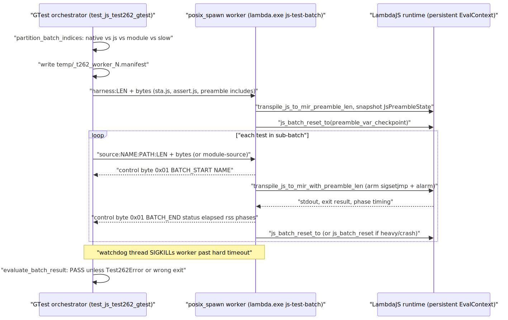

# LambdaJS — Testing & Conformance Infrastructure

> **Part of the [LambdaJS detailed-design set](JS_00_Overview.md).** This document covers how LambdaJS conformance and unit tests run: the test262 batch runner (GTest orchestrator → `posix_spawn` worker pool → persistent hot-reload process → wire protocol), batch execution phases and slowest-first dispatch, the three-layer crash recovery, batch-state reset, baseline management, the async/`$DONE` runner, diagnose mode, the Node.js official-test harness and shims, and the GTest unit suites.
>
> **Primary sources:** `test/test_js_test262_gtest.cpp` (orchestrator), `lambda/main.cpp` (`js-test-batch` worker + crash recovery), `lambda/js/js_runtime_state.cpp` (`js_batch_reset`/`js_batch_reset_to`), `test/test_node_gtest.cpp` + `lambda/js/test_shim/` (Node harness), `test/test_js_gtest.cpp`, `test/test_js_coerce_gtest.cpp`, `test/test_js_bt_regex_gtest.cpp`, `test/test_jsx_roundtrip{,_new}_gtest.cpp`, `test/test_js_transpile_timing_gtest.cpp`, baseline data under `test/js262/`.
> **Audience:** engine developers. **Convention:** `file:line` references drift; confirm against the symbol name.

---

## 1. Purpose & scope

LambdaJS validates correctness against three independent corpora: the **TC39 test262** suite (tens of thousands of spec-conformance tests, the primary gate), the **official Node.js parallel tests** (`ref/node/test/parallel/`, host-API compatibility), and a set of **focused GTest suites** for individual kernels (coercion, the backtracking regex matcher, JSX round-trip, transpile timing). The throughput-critical piece is the test262 runner, which compiles a shared harness once per batch and streams test sources to a long-lived worker — the preamble/batch entry points it depends on are defined in [JS_01 — Compilation Pipeline §3 and §8](JS_01_Compilation_Pipeline.md). This document owns the test *infrastructure*: process orchestration, the wire protocol, crash recovery, batch reset, and baseline gating. Lowering and runtime semantics that the tests exercise live in their owning docs.

The runner enforces a **zero-crash policy**: any crash or lost test is treated as a regression that blocks a baseline update (`test_js_test262_gtest.cpp:19`). Absolute pass counts in the baseline header are configuration-dependent (build type, opt level, interpreter vs JIT, host CPU count) and are not reproduced here.

---

## 2. test262 batch runner architecture

The runner is a GTest binary that orchestrates a pool of worker processes; it never executes JS in-process.

- **Orchestrator (parent).** `test_js_test262_gtest.cpp` discovers tests by walking fixed category tables — `language_cats` (`:655`), `builtin_cats`, and AnnexB cats (`:771`) — under `TEST262_ROOT` (`ref/test262`), skipping `_FIXTURE.js` helper modules (`:599`). Phase 1 parses each test's YAML frontmatter into a `Test262Prepared` record (`:956`) and `partition_batch_indices` (`:2659`) splits work into native-harness, JS-harness, module, and slow groups; JS groups are keyed by their special-preamble needs so heavy helpers compile once only for batches that need them.
- **Worker pool.** Each worker is `./lambda.exe js-test-batch`, launched via **`posix_spawn`** (`run_t262_sub_batch`, `:2547`) rather than `fork`+`exec`: with the parent holding ~1.3 GB of test sources, `fork` would copy page tables thousands of times (the comment at `:2515` cites ~500 s of avoided system time). Worker count is `cpu_count - 1` by default (`t262_target_worker_count`, `:1321`), overridable with `--jobs`. stdin is dup2'd from a per-worker reusable manifest file and stdout/stderr from a pipe; each worker reuses one `temp/_t262_worker_N.manifest`.
- **Persistent hot-reload process.** With hot-reload on (the default), the worker keeps **one** `EvalContext`, GC heap, nursery, and name pool across all tests in its sub-batch (`main.cpp:3416`), so each test hits the context-reuse fast path of `transpile_js_to_mir_core_len` (JS_01 §2 step 5) instead of re-initializing the runtime.
- **Wire protocol.** The manifest is a length-prefixed line protocol read on the worker's stdin (`main.cpp:3452`): `harness:<len>` (compile the shared harness as a preamble, once per batch), `source:<name>[:<path>]:<len>` (an ordinary test), and `module-source:<name>[:<path>]:<len>` (run through the ES-module entry). The worker emits results back on stdout framed by a **`\x01` control byte**: `BATCH_START <name>`, then captured stdout, then `BATCH_END <status> <elapsed_us> <rss…> <phase_us…>` (parsed by the parent at `:2599`); out-of-band diagnostics use `BATCH_EXIT`/`BATCH_DIAG`.
- **Preamble pre-compilation.** `assemble_harness_source` (`:988`) concatenates `sta.js` + `assert.js` + `PREAMBLE_INCLUDE_FILES` (`:940`) (+ any batch-local special includes from `special_premble.txt`) and sends it via `harness:`. The worker compiles it through `transpile_js_to_mir_preamble_len`, snapshotting harness module-vars into a `JsPreambleState`; each subsequent test compiles via `transpile_js_to_mir_with_preamble_len`, inheriting those bindings without recompiling the harness. This preamble mechanism is described from the compiler side in [JS_01 §3](JS_01_Compilation_Pipeline.md).

---

## 3. Execution phases, dispatch order & timeout quarantine

Execution is staged (`test_js_test262_gtest.cpp:37`):

- **Phase 1** — parse metadata, partition into CLEAN tests. Tests listed in the previous run's `t262_partial.txt` are re-included in CLEAN every run so the partial list is rebuilt from fresh results, never carried forward.
- **Phase 2** — execute CLEAN tests in batched workers (default 50 tests per process, `T262_BATCH_CHUNK_SIZE`). **Slowest-first dispatch:** before launching, the parent loads per-test timings from `temp/_t262_timing_o<N>.tsv`, sums them per batch, and sorts `dispatch_order` most-expensive-first (`:2691`–`:2740`) so long batches start early and don't become end-of-run stragglers; unknown tests get a 20 ms default.
- **Phase 2b** — retry any batch-lost tests individually, rescuing innocent bystanders that were co-batched with a crash point.
- **Phase 3** — evaluate results against expected outcomes (`evaluate_batch_result`, `:2920`).
- **Phase 4** (`--batch-only`) — retry regressions individually; a regression that passes in isolation is reclassified as a **batch interaction** (`PARTIAL`) rather than a real failure, and recorded in `t262_partial.txt`.

**Timeout quarantine.** Slow-but-correct tests are isolated rather than failed: entries in `t262_slow.txt` run **one test per batch** under a relaxed gate (`group_chunk_size = 1` for slow groups, `:2682`). At the worker level each test is bounded by an `alarm()` (`--timeout`, default 10 s); above that, the parent's per-worker **watchdog thread** sends `SIGKILL` once a batch exceeds `num_tests × hard_timeout_per_test_secs()` (min 30 s, `:2562`), which catches hangs the in-process alarm cannot interrupt (e.g. inside JIT codegen or the parser). A killed worker's collected results are kept; its unfinished tests fall to Phase 2b.

---

## 4. Three-layer crash recovery

Because one process runs many tests, a crash must not lose the rest of the batch. The worker arms three nested recovery points around every test (`main.cpp:3582`+) plus a parent-side watchdog:

1. **Hardware fault (SIGSEGV/SIGBUS, also SIGABRT/SIGTRAP).** Handlers are installed once for the whole loop (`:3441`) with `SA_ONSTACK` on a dedicated `sigaltstack` (`:3403`) so a stack-overflow fault can be handled without a double fault. `batch_crash_handler` (`:1073`) does `siglongjmp(batch_crash_jmp, sig)` back into the per-test `sigsetjmp` (`:3589`); the test is scored `128 + sig`. A crash *between* tests (in cleanup) exits the batch via `BATCH_EXIT between_test_crash` so the parent retries the remainder individually.
2. **MIR codegen error.** `batch_mir_error_handler` (`:1055`) is registered as MIR's error func; instead of `exit(1)` it does `longjmp(mir_error_jmp, 1)` (guarded by `mir_error_active`) into the protected region (`:3614`), scoring the test as a failure (result 1).
3. **Per-test timeout (SIGALRM).** `batch_alarm_handler` (`:1083`) does `siglongjmp(batch_timeout_jmp, 1)` (`:3615`); the test is scored 124.
4. **Parent watchdog** (§3) — the outermost layer, killing a worker that hangs below the signal layer entirely.

After each test the worker decides how to recover (`:3713`): on crash/timeout it does a **full** `js_batch_reset` + `heap_destroy` + `jm_cleanup_deferred_mir` / `jm_cleanup_active_mir` + preamble recompile, and increments `batch_crash_count`. To bound the per-crash leak (the `longjmp` path skips cleanup), the worker exits the batch once `batch_crash_count >= MAX_CRASH_COUNT` (10) or RSS exceeds `RSS_LIMIT` (4 GB) (`:3721`); memory-heavy *successful* tests above `RSS_RESET_LIMIT` (1 GB) or with large growth also trigger a heap recycle (`:3777`).

---

## 5. Batch-state reset

Two reset functions in `js_runtime_state.cpp` define what survives between tests:

- **`js_batch_reset_to(checkpoint_var_count)`** (`:388`) — the **light, per-test** path used in steady state. It restores module-vars to the preamble checkpoint, clears the pending exception and transient call state, re-creates the mutable global singletons that tests may have mutated (Math/JSON/console/Reflect/Atomics/`$262`, constructor prototypes, `globalThis`, DOM state), resets the event loop, regex caches, and every Node-module namespace cache, and clears strict mode. The **heap is left intact** — the harness is not recompiled.
- **`js_batch_reset()`** (`:271`) — the **heavy, crash-recovery** path. It does everything `..._to` does, **plus increments `js_heap_epoch`** (`:273`) and tears down more aggressively (module registry + module cache, function-pointer→`JsFunction` cache, builtin cache, `js_deep_batch_reset`, proto-snapshot invalidation). It is the path taken after a crash/timeout and at worker exit, paired with `heap_destroy` in `main.cpp`.

**`js_heap_epoch`** (`js_runtime_state.cpp:65`, exposed via `js_get_heap_epoch`) is the invalidation token for lazily-cached, heap-allocated singletons. Module-namespace getters in `js_runtime.cpp` cache an `Item` + an epoch and rebuild when `epoch != js_heap_epoch` (e.g. `async_hooks`, `vm`, `timers`, `worker_threads` at `:31399`+), so a `js_batch_reset` that bumps the epoch transparently invalidates ~30 such caches without touching each call site. What is **not** reset by either path: compiled MIR code for the harness preamble (retained until heap teardown), the OS-cached test source files, and process-global statics outside the registered reset surface (see §10).

---

## 6. Baseline management & intentional-exception taxonomy

Three data files under `test/js262/` carry expected state:

| File | Role |
|---|---|
| `test262_baseline.txt` | The auto-maintained set of **fully passing** tests (one sanitized name per line, header records commit/build/scope). A test in the baseline that later fails is a **regression**. `BASELINE_FILE`, `:120`. |
| `t262_partial.txt` | Tests that pass individually but fail/flake **in batch** (`PARTIAL`), tagged with their failure kind (e.g. `CRASH_139`). Rewritten from each run's results; never sticky. |
| `skip_list.txt` | Tests excluded with a documented reason (non-deterministic, Unicode-data-version mismatches, V8-specific quirks). Each entry carries a prose justification. |
| `t262_slow.txt` | Correct-but-slow tests run one-per-batch under the relaxed gate (§3). |
| `diagnose_list.txt` | `--diagnose` fast-path expectations (§8); TSV of `name⟶timing⟶expected_fast_paths⟶notes`. |
| `special_premble.txt` | Maps test-name/path selectors to batch-local heavy harness helpers (e.g. `testAtomics.js`). |
| `temp/_t262_timing_o<N>.tsv` | Per-opt-level per-test timing TSV consumed by slowest-first dispatch and written each run. |

**Update gating.** `--update-baseline` only rewrites `test262_baseline.txt` when **all four** conditions hold (`:3742`): batch-lost == 0, crash-exits == 0, regressions == 0, and fully-passing ≥ `STABLE_BASELINE_MIN` (`:1529`, a monotonic checkpoint). The gate counts live in `g_phase_batch_lost` / `g_phase_crash_exit`; on success `clean_partial_list_after_baseline_update` prunes partial entries now in the baseline (`:2132`). A run-lock file (`claim_test262_gtest_run_lock`, `:3784`) prevents concurrent runs from corrupting shared scratch output.

**Admission predicates.** Before a test can pass it must be admissible. `flags: [async, module, raw, noStrict, onlyStrict]` are gated (async needs `--run-async` + an allowlist, `:2294`); `UNSUPPORTED_FEATURES` (`:139`, an above-scope feature set) and `INTENTIONAL_ES2021_EXCEPTIONS` (`:132` — `tail-call-optimization`, `cross-realm`, `IsHTMLDDA`, `caller`) map to skip messages via `unsupported_feature_skip_message` (`:885`). Narrow allowlists admit specific newer tests, e.g. `is_js53_waitasync_admission_test` (`:851`) opening 20 `Atomics.waitAsync` tests.

---

## 7. Async test runner (`$DONE`)

Async-flagged tests rely on test262's `doneprintHandle.js` calling a host `$DONE`. `assemble_test_source` (and the module variant) synthesize a `$DONE` shim (`:1078`) that records completion in `globalThis.__lambda_test262_async_done`, throws `Test262Error` on a double call, and — after the body runs and the event loop drains — throws `"async test did not call $DONE"` if completion never fired (`:1102`). Async batches use a separate chunk size (`g_t262_async_chunk_size`) and are dispatched as their own group (`:2683`). The event-loop drain that lets a pending `$DONE` fire before scoring is the same `js_event_loop_drain` documented in [JS_09 — Async, Promises, Event Loop & Modules](JS_09_Async_Modules.md).

---

## 8. Diagnose mode & fast-path assertions

`--diagnose` (`g_diagnose_mode`, `:1456`) runs the `diagnose_list.txt` subset and passes `--diagnose` through to each worker, which enables the engine's `js-diagnose` instrumentation (it emits `fast-path-hit=<path>` / `fast-path-note=<path>` markers). After ordinary evaluation, the orchestrator checks that every expected path for a diagnosed test appears in its output via `diagnose_output_has_path` (`:1764`); a missing fast-path marker **downgrades a PASS to FAIL** (`:4306`). This guards against silent performance regressions where a test still passes but no longer takes the intended native fast path — a correctness check layered over the perf work in [JS_15 — Performance & Optimization](JS_15_Performance.md).

---

## 9. Node.js official-test harness, shims & GTest unit suites

**Node official runner** (`test_node_gtest.cpp`). Discovers `test-*.js` under `ref/node/test/parallel/` and assigns each to a module by filename prefix via `g_feature_modules` (`:104`) (`assert`, `buffer`, `fs`, `path`, `stream`, … plus a large `misc` catch-all). Unlike test262, each test runs as its **own** `lambda.exe js` subprocess via `popen` (`run_single_test`, `:461`), with a `timeout` and ASAN-related env vars stripped, executed inside `temp/node_test/`; there is no batch worker. A `skip_list.txt` (loaded at runtime, `:322`) excludes unsupported tests, `--modules=X,Y` narrows the set, and `--update-baseline` rewrites `test/node/official_baseline.txt` for regression tracking. The Node **harness shims** in `lambda/js/test_shim/` (`common_index.js`, `tmpdir.js`, `fixtures.js`, `package.json`) reimplement `ref/node/test/common/` against LambdaJS's runtime so the upstream tests' `require('../common')` resolves; Node-API semantics they cover are in [JS_14 — Node Compatibility](JS_14_Node_Compat.md).

**Focused GTest suites** — each targets one kernel and most drive the full JIT path by subprocess so they validate lowering, not just the C kernel:

| Suite | Drives | What it covers |
|---|---|---|
| `test_js_gtest.cpp` | `lambda.exe js` (+ its own mini `js-test-batch` runner, `:339`) and `--document` | Parameterized `.js` fixture pass/fail (`JsFileTest`, `:532`), REPL/command-interface checks, fuzz-regression cases. |
| `test_js_coerce_gtest.cpp` | subprocess `run_js` | The ToPrimitive/OrdinaryToPrimitive matrix for `js_coerce` — `@@toPrimitive` vs ordinary, each hint, primitive/object/non-callable/throws (`Coerce.*`, `:121`). |
| `test_js_bt_regex_gtest.cpp` | **direct C API** (includes `js_bt_regex.cpp`, `:17`) | The backtracking matcher: groups, named groups, the anti-DoS step budget, malformed-pattern fallback, stress inputs — behaviours RE2 cannot do. See [JS_11 — RegExp](JS_11_RegExp.md). |
| `test_jsx_roundtrip_gtest.cpp`, `test_jsx_roundtrip_new_gtest.cpp` | `input_from_source` + `format_data` | JSX parse→format round-trip equality after whitespace normalization (`JsxRoundtripTest`, `:29`). The two files are parallel parse→format harnesses over different fixture sets. |
| `test_js_transpile_timing_gtest.cpp` | `lambda.exe js` with `JS_TRANSPILE_TIMING=1` | Phase-timing/AST-counter measurement (`JSTranspileTiming.Phases`, `:129`). **Correctness-only:** a fixture passes if it reached the MIR phase (`mir_ms > 0`); it never asserts on timing thresholds or child exit code. |

---

## 10. Known Issues & Future Improvements

1. **Batch-vs-single-script divergence.** Tests that pass in isolation but fail/flake in a 50-test batch are a recurring class — the entire Phase 4 retry + `t262_partial.txt` mechanism exists to detect and quarantine them. Root causes are residual cross-test state (next item) rather than the tested feature; the batch interaction is recorded, not fixed.
2. **Residual unreset statics.** `js_batch_reset` / `js_batch_reset_to` enumerate dozens of module/global reset calls by hand (`js_runtime_state.cpp:271`/`:388`); any process-global static not on that list silently leaks across tests. The two functions are also large near-duplicates that must be kept in sync manually — a missed reset surfaces only as a batch-order-dependent flake.
3. **MIR JIT code-page leak on crash recovery.** Each SIGSEGV/SIGBUS/timeout `longjmp` "leaks ~55MB (MIR code pages, AST, temporaries that skip cleanup)" (`main.cpp:3700`); the worker compensates by capping at 10 crashes / 4 GB RSS and exiting the batch (`:3721`), trading completeness for bounded memory. The leaked code pages are unreachable after the eventual `heap_destroy`, but accumulate within a batch.
4. **`_FIXTURE` files require special-casing.** test262 `_FIXTURE.js` helper modules are not standalone tests and are skipped by suffix match in two places (`test_js_test262_gtest.cpp:599`, `:634`); special preamble helpers (e.g. `testTypedArray.js`) are intentionally kept per-test rather than as a shared preamble because preamble-exported lexical bindings are not visible to test modules (`special_premble.txt`).
5. **Config-dependent pass percentages.** Pass counts depend on build type, opt level (the timing TSV is per-`o<N>`), interpreter-vs-JIT mode, async/module admission flags, and host CPU count (which sets worker count and thus batch composition). The baseline header records the exact configuration; treat any absolute number as point-in-time.
6. **Heavyweight orchestrator.** `test_js_test262_gtest.cpp` is ~4600 lines with the full phase pipeline, two platform implementations of `run_t262_sub_batch`, and the protocol parser duplicated between the POSIX and Windows branches (`:2584` vs `:2447`) — a drift risk if the wire format changes.
7. **Negative-test scoring is coarse.** `evaluate_batch_result` passes a negative test if the output merely contains "Error"/"error" (`:2936`) rather than matching the declared `negative_type`/`negative_phase`, so a test expecting `SyntaxError` would pass on any thrown error.

---

## Appendix A — Source map

| File | Responsibility (this doc) |
|---|---|
| `test/test_js_test262_gtest.cpp` | test262 orchestrator: discovery, partition, `posix_spawn` pool, wire protocol, phases, dispatch, evaluation, baseline gate, diagnose mode. |
| `lambda/main.cpp` | `js-test-batch` worker: protocol read loop, preamble compile, three-layer `sigsetjmp`/`longjmp` crash recovery, per-test reset/recycle. |
| `lambda/js/js_runtime_state.cpp` | `js_batch_reset`, `js_batch_reset_to`, `js_heap_epoch`. |
| `test/test_node_gtest.cpp` | Node official-test runner: `g_feature_modules`, per-test subprocess, skip list, baseline. |
| `lambda/js/test_shim/` | Node harness shims (`common_index.js`, `tmpdir.js`, `fixtures.js`). |
| `test/test_js_gtest.cpp` | `.js` fixture suite + mini batch runner + REPL/fuzz checks. |
| `test/test_js_coerce_gtest.cpp` | ToPrimitive coercion matrix. |
| `test/test_js_bt_regex_gtest.cpp` | Backtracking regex matcher C-API tests. |
| `test/test_jsx_roundtrip{,_new}_gtest.cpp` | JSX parse→format round-trip. |
| `test/test_js_transpile_timing_gtest.cpp` | Compile-phase timing measurement (correctness-only). |
| `test/js262/*` | Baseline, partial, skip, slow, diagnose, special-preamble data + timing TSVs. |

## Appendix B — Related documents

- [JS_01 — Compilation Pipeline & Phase Model](JS_01_Compilation_Pipeline.md) — preamble entry points and `js-test-batch` CLI dispatch.
- [JS_09 — Async, Promises, Event Loop & Modules](JS_09_Async_Modules.md) — event-loop drain behind the `$DONE` runner.
- [JS_11 — RegExp](JS_11_RegExp.md) — the backtracking matcher exercised by `test_js_bt_regex_gtest`.
- [JS_14 — Node Compatibility](JS_14_Node_Compat.md) — Node-API semantics covered by the official-test harness.
- [JS_15 — Performance & Optimization](JS_15_Performance.md) — fast paths verified by diagnose mode; the `test/benchmark/` performance suites and the current as-shipped JS pass rate (≈83%, §7), an additional broad real-world correctness signal beyond test262/Node/GTest.
