# Lambda Core Runtime — Design Overview

> **This is the index and architecture map for the Lambda core-runtime detailed-design set.** It covers what the runtime is, how a script becomes running native code, how the codebase is organized into subsystems, the design themes that recur across them, and a synthesized view of the runtime's maturity and known-issue clusters. Each subsystem has its own document, linked in [§4](#4-the-document-set).
>
> **Scope:** the Lambda *core language runtime* — the value model, parser/AST, the two code-generation backends and the MIR JIT, memory and GC, the numeric/string/vector machinery, the runtime builtins, error handling, the Mark data API, and the procedural runtime. Out of scope (their own subsystems): the input parsers and output formatters (`lambda/input/`, `lambda/format/`), the schema validator (`lambda/validator/`), the embedded JavaScript engine (`lambda/js/`, see [doc/dev/js/](../js/JS_00_Overview.md)), the polyglot Jube runtimes (`bash/`, `py/`, `rb/`), and the Radiant layout engine (`radiant/`).
> **Audience:** engine developers. **Convention:** every doc cites `file:line` + exact symbol names rather than quoting code, since line numbers drift; confirm against the symbol names.

---

## 1. What the Lambda core runtime is, and its design goals

Lambda Script is a pure-functional, cross-platform scripting language for data processing and document presentation, implemented from scratch in C/C++ with JIT compilation. The *core runtime* is the part that turns Lambda source into running native code and provides the values, memory, and built-in operations that code executes against. Its defining choices:

- **JIT-only execution, no interpreter.** A script is always compiled — parsed by Tree-sitter, built into a typed AST, lowered to [MIR](https://github.com/vnmakarov/mir) intermediate representation, and JIT-generated to native code. There is no tree-walking evaluator; what looks like an "evaluator" (`lambda-eval.cpp`) is in fact the C-ABI *runtime support library* the generated code calls into ([LR_09](LR_09_Runtime_Builtins.md)).
- **A single 64-bit tagged value, `Item`.** Every value — scalar, container, document node, JIT temporary — is one tagged word, dispatched uniformly by `get_type_id` ([LR_03](LR_03_Value_and_Type_Model.md)). The same representation is shared with the embedded JavaScript engine and the document subsystems.
- **Two backends, one runtime.** The default backend lowers the AST straight to MIR ([LR_07](LR_07_MIR_Transpiler_JIT.md)); a legacy backend emits C source text and compiles it with c2mir ([LR_06](LR_06_C_Transpiler.md)). They share the value model, the runtime function set, and the JIT import resolver, and are meant to produce identical results.
- **Garbage collection with a non-moving heap.** Object structs never move (so tagged pointers stay valid across collections), while variable-size data buffers live in a compacting data nursery ([LR_08](LR_08_Memory_and_GC.md)).
- **Documents are first-class.** The `Element` type is simultaneously an ordered list of children and a keyed map of attributes, and the Mark API ([LR_11](LR_11_Mark_Data_API.md)) is the construction boundary every input parser builds through.

---

## 2. Architecture (C4)

### 2.1 System context

A developer drives the runtime through the CLI. The runtime depends on three external systems: Tree-sitter for parsing, the MIR library for IR generation and JIT, and the host OS for files, processes, and I/O.

### 2.2 Containers

Within the Lambda system the **core runtime engine** is one container among several that share it: the CLI/REPL, the Input/Output format layer, the schema validator, the LambdaJS engine, and the Radiant layout engine. LambdaJS in particular reuses the core's `Item` value model, GC, and MIR JIT wholesale.

### 2.3 Engine components

The engine decomposes into the front-end (parse + typed AST), the two transpilers and the JIT integration, the value/type model, memory and GC, the runtime builtins, the numeric/string/vector machinery, error handling, the Mark data API, and the procedural runtime. The component boundaries map one-to-one onto the documents in [§4](#4-the-document-set).

---

## 3. Compilation & execution at a glance

A run of `lambda script.ls` threads through these stages (full detail in [LR_01](LR_01_Compilation_Pipeline.md)):

1. **Dispatch.** `main` parses CLI args and selects the run path; `run_script_file` → `run_script_mir`.
2. **Load.** `load_script` reads the source, de-duplicates and circular-checks imports, and precompiles them in parallel.
3. **Parse.** Tree-sitter produces a CST; `parse.c` is the thin wrapper over the generated grammar ([LR_02](LR_02_Parsing_AST.md)).
4. **Build AST.** `build_script` walks the CST into a typed AST via `build_expr`, inferring expression types as it goes ([LR_02](LR_02_Parsing_AST.md)).
5. **Transpile.** `compile_script_as_mir_direct` lowers the AST to a MIR module — inline boxing, register-type tracking, GC-root-frame emission ([LR_07](LR_07_MIR_Transpiler_JIT.md)). The legacy `--c2mir` path emits C text instead ([LR_06](LR_06_C_Transpiler.md)).
6. **Link & generate.** `mir.c` resolves runtime-function imports, links the module, and runs `MIR_gen` to native code; module-level globals are registered as GC roots post-link.
7. **Run.** `execute_script_and_create_output` calls the generated `main_func(context)` under a stack-overflow guard; the result is printed by the canonical value serializer ([LR_11](LR_11_Mark_Data_API.md)).

---

## 4. The document set

### Part I — Front end

- **[LR_01 — Compilation Pipeline, CLI & REPL](LR_01_Compilation_Pipeline.md)** — end-to-end orchestration, CLI subcommand dispatch, the whole-history REPL, module/template resolution and parallel precompile.
- **[LR_02 — Parsing & AST Construction](LR_02_Parsing_AST.md)** — Tree-sitter grammar, the CST→AST dispatch, the AST node hierarchy, and build-time type inference.

### Part II — Data & types

- **[LR_03 — Value & Type Model](LR_03_Value_and_Type_Model.md)** — the tagged `Item`, the `TypeId` storage classes, boxing/unboxing, the `Container` family and map shapes, and the static `Type*` family.
- **[LR_04 — Numbers, Decimal & DateTime](LR_04_Numbers_Decimal_DateTime.md)** — the `INT`/`INT64`/`FLOAT`/`DECIMAL` numeric tower, overflow handling, libmpdec decimals/BigInt, and packed DateTime.
- **[LR_05 — Strings, Symbols & Vectors](LR_05_Strings_and_Vectors.md)** — UTF-8 strings, utf8proc normalization, and the `ArrayNum` vector machinery (auto-vectorization, broadcasting, mutable views, the image toolkit).

### Part III — Compilation backend

- **[LR_06 — The C Transpiler](LR_06_C_Transpiler.md)** — the legacy C2MIR backend: AST → C source text → c2mir → MIR, its codegen pattern, the embed header, and its workarounds.
- **[LR_07 — The MIR Direct Transpiler & JIT](LR_07_MIR_Transpiler_JIT.md)** — the default backend: AST → MIR IR, the immutable-register boxing strategy, the calling convention and inference, the JIT GC-root frame, and `mir.c` integration.

### Part IV — Runtime services

- **[LR_08 — Memory Management & Garbage Collection](LR_08_Memory_and_GC.md)** — the non-moving mark-sweep heap, the two distinct nurseries, three-tier string allocation, and the name/shape pools.
- **[LR_09 — Runtime Builtins & System Functions](LR_09_Runtime_Builtins.md)** — the C-ABI support library and the `sys_func_defs[]` registry that feeds both AST build and JIT linking.
- **[LR_10 — Error Handling](LR_10_Error_Handling.md)** — the two error representations, `GUARD_ERROR` propagation, error codes, and the manually-walked native stack traces.

### Part V — Data construction & procedural

- **[LR_11 — Mark Data API](LR_11_Mark_Data_API.md)** — building, reading, and editing Lambda data structures, plus the canonical value printer.
- **[LR_12 — Procedural Runtime](LR_12_Procedural_Runtime.md)** — `pn` procedures, `run`/`main()`, in-place mutation builtins, for-loops, and the safety analyzer.

---

## 5. Cross-cutting design themes

- **One tagged word, dispatched uniformly.** The high-byte `TypeId` scheme ([LR_03](LR_03_Value_and_Type_Model.md)) lets scalars, tagged pointers, and containers share a single `Item` and a single `get_type_id` dispatch; the same representation crosses into the JIT, the GC, and LambdaJS.
- **Native-when-provable, boxed-at-boundaries.** Both backends keep numerics in native registers when types are statically known and box only where a value escapes into a generic context. The reconciliation point (`transpile_box_item`) must mirror the producer exactly — a recurring source of subtlety ([LR_07](LR_07_MIR_Transpiler_JIT.md)).
- **The static type system is advisory, not load-bearing.** AST `Type*` annotations guide codegen but are distrusted where they can go stale (after mutation, across calls); `get_effective_type` is the live oracle ([LR_02](LR_02_Parsing_AST.md), [LR_07](LR_07_MIR_Transpiler_JIT.md)).
- **Non-moving GC shapes everything.** Because object structs never move, tagged pointers, JIT locals, and pool-held environments stay valid across collections; the cost is conservative stack scanning and a reliance on *honest* local typing for precise rooting ([LR_08](LR_08_Memory_and_GC.md)).
- **Tables as single sources of truth.** `sys_func_defs[]` ([LR_09](LR_09_Runtime_Builtins.md)) drives both AST-build metadata and JIT import resolution; the map-shape chain plus interned names ([LR_03](LR_03_Value_and_Type_Model.md)) drive field layout and lookup; `TypeBoxInfo` drives box/unbox emission ([LR_06](LR_06_C_Transpiler.md)).
- **C/C++ duality at the JIT boundary.** `lambda.h` is deliberately C-clean so MIR can compile it; richer machinery lives in the C++ headers, with the container ABI kept bit-identical across the two ([LR_03](LR_03_Value_and_Type_Model.md)).

---

## 6. Maturity & recurring known-issue themes

The runtime is mature and heavily tested, but the per-document Known Issues sections cluster around a few recurring themes worth reading as a whole:

- **MIR register immutability drives a large workaround surface.** A MIR register's type is fixed once declared, so the MIR Direct backend must truncate-or-box on type widening, force certain results (match, vectorized comparisons) to always-boxed, and carry guards like `emit_null_item_reg` and `push_l_safe`. This is the single densest known-issue cluster ([LR_07](LR_07_MIR_Transpiler_JIT.md)).
- **GC rooting depends on honest local typing.** Precise rooting requires the transpiler's belief about a register (native scalar vs heap Item) to match reality; where it doesn't, a use-after-free is latent (the historical DeltaBlue corruption). The current blanket-root-`INT64`+ policy is load-bearing but pessimistic, and the numeric nursery is never individually collected ([LR_08](LR_08_Memory_and_GC.md), [LR_07](LR_07_MIR_Transpiler_JIT.md)).
- **Equality and coercion are representation-sensitive.** `item_deep_equal` lacks cases for several types and falls back to pointer equality; numeric arrays compare by raw `memcmp` (robust value-equality is `sum(abs(a-b)) == 0`); `it2d`/`it2l`/`it2b` have poisoning and sentinel-collision sharp edges ([LR_03](LR_03_Value_and_Type_Model.md), [LR_05](LR_05_Strings_and_Vectors.md)).
- **Hard-coded caps with silent failure modes.** Fixed sizes recur — map hash table, shape-chain length 64, scope depth 64, loop stack 32, inference parameter arrays 16, `ndim` 32 — and several truncate or fall back silently rather than erroring ([LR_03](LR_03_Value_and_Type_Model.md), [LR_07](LR_07_MIR_Transpiler_JIT.md), [LR_11](LR_11_Mark_Data_API.md)).
- **Two parallel vocabularies and two backends to keep in sync.** The runtime `Type*` family and the validator's `TypeSchema` overlap and are bridged by hand; the MIR Direct and C2MIR backends (and their separate inference engines) must agree. Divergences are correctness hazards, not just maintenance cost ([LR_03](LR_03_Value_and_Type_Model.md), [LR_06](LR_06_C_Transpiler.md)).
- **Conservatism by default.** The safety analyzer always requests a stack check and disables TCO at the gate despite a full TCO analysis being implemented; param inference dropped speculative-INT after it truncated float arguments. These are deliberate trades of performance for correctness ([LR_12](LR_12_Procedural_Runtime.md), [LR_07](LR_07_MIR_Transpiler_JIT.md)).

None of these block normal use; they are the concrete future-improvement targets the set surfaces.

---

## 7. Diagrams & regeneration

Diagram sources live in `doc/dev/lambda/diagram/`. Flow, sequence, state, and class diagrams are Mermaid (`dNN_*.mmd`); the C4 architecture views are a Structurizr workspace (`architecture.dsl`, with view keys `c4_context`/`c4_container`/`c4_component` so each renders to the embedded filename). Regenerate everything with:

`bash utils/render_md_diagrams.sh doc/dev/lambda/diagram`

Mermaid rendering needs `npx`/mmdc; the C4 views additionally need a JDK and structurizr-cli (the script skips the `.dsl` with a notice if structurizr-cli is absent). After editing prose, run `python3 utils/reflow_md.py doc/dev/lambda/LR_*.md` as a soft-wrap safety net. Embeds use `` at each SVG's natural width capped at ~720px, not ``, so small diagrams are not stretched to full pane width.

---

## 8. Glossary

- **Item** — the 64-bit tagged value; high byte is the `TypeId`, low 56 bits an inline value or pointer ([LR_03](LR_03_Value_and_Type_Model.md)).
- **TypeId** — the runtime type tag (`EnumTypeId`); IDs at or above `LMD_TYPE_RANGE` are containers.
- **Boxing** — turning a native C value into a tagged `Item`; **unboxing** is the reverse ([LR_03](LR_03_Value_and_Type_Model.md)).
- **Container** — a heap object beginning with a `TypeId` (range, list/array, numeric array, map, object, element, vmap).
- **ShapeEntry / TypeMap** — the linked field chain and shape descriptor that lay out a map's packed `data` buffer.
- **MIR** — the intermediate representation and JIT (vnmakarov/mir) that both backends target.
- **MIR Direct** — the default backend that lowers AST straight to MIR; **C2MIR** is the legacy C-text backend.
- **Nursery** — *two distinct regions*: the GC data nursery (compacted each cycle) and the numeric-temporary nursery (never individually collected) ([LR_08](LR_08_Memory_and_GC.md)).
- **JIT root frame** — the thread-local stack of `Item` slots that keeps generated-code locals reachable across allocations ([LR_07](LR_07_MIR_Transpiler_JIT.md)).
- **Name pool** — the interning pool for structural identifiers, giving pointer-equality key comparison.
- **`pn` / proc** — a procedural function (mutation, I/O, statement loops), as opposed to a pure `fn` ([LR_12](LR_12_Procedural_Runtime.md)).
- **Mark API** — the builder/reader/editor API every input parser constructs Lambda data through ([LR_11](LR_11_Mark_Data_API.md)).
- **`ItemError` / `LambdaError`** — the bare error sentinel and the rich heap error object, bridged by `err2it`/`it2err` ([LR_10](LR_10_Error_Handling.md)).

---

## Appendix — Relationship to the previous docs

This set absorbs and supersedes two earlier hand-written notes, which remain in place for now:

- **[doc/dev/Lamdba_Runtime.md](../Lamdba_Runtime.md)** — "Lambda Runtime Data Management": the runtime data model, GC nursery, the two-transpiler architecture, MIR JIT workarounds, and a list of structuring suggestions. Its material is distributed across [LR_03](LR_03_Value_and_Type_Model.md), [LR_06](LR_06_C_Transpiler.md), [LR_07](LR_07_MIR_Transpiler_JIT.md), and [LR_08](LR_08_Memory_and_GC.md), updated where the code has since diverged (notably: the C2MIR path is now `#ifdef`-gated and MIR Direct is the live default).
- **[doc/dev/Lambda_Transpiler.md](../Lambda_Transpiler.md)** — the transpiler developer guide. Its material is folded into [LR_06](LR_06_C_Transpiler.md) and [LR_07](LR_07_MIR_Transpiler_JIT.md).

Where this set and those notes disagree, **this set reflects a fresh read of the current code** and should be treated as authoritative.
