# Lambda Runtime — Compilation Pipeline, CLI & REPL

> **Part of the [Lambda core-runtime detailed-design set](LR_00_Overview.md).** This document covers the end-to-end path from a `.ls` source file (or a REPL line) to a printed result: how `main()` dispatches CLI subcommands, how the default *functional* run path threads through `run_script_mir` → `load_script` → `transpile_script` → `execute_script_and_create_output`, how the *procedural* `run` path differs by a single flag, what the legacy `--c2mir` path compiles to (and why it is absent from a default build), how the REPL re-executes its whole history every turn, how module imports are resolved/deduplicated/precompiled in parallel and checked for cycles, and how the view/edit template registry and reactive template-state store are wired into the run.
>
> **Primary sources:** `lambda/main.cpp` (`main()` dispatch, `run_script_file`, `run_repl`, the bridge-script builders), `lambda/main-repl.cpp` (statement-completeness checking, prompts, readline wrappers), `lambda/runner.cpp` (`transpile_script`, `load_script`, `precompile_imports`, `runner_setup_context`, `execute_script_and_create_output`, `init_module_import`, `runtime_init`/`runtime_cleanup`/`runtime_reset_heap`, `lambda_home_*`), `lambda/transpile-mir.cpp` (`run_script_mir`, `compile_script_as_mir_direct`), `lambda/transpiler.hpp` (`Runtime`, `Runner`, `Heap`, function decls), `lambda/module_registry.cpp/.h`, `lambda/template_registry.cpp/.h`, `lambda/template_state.cpp/.h`, `lambda/target.cpp`.
> **Audience:** engine developers. **Convention:** `file:line` references drift; confirm against the cited symbol names. The C2MIR backend referenced throughout is compiled out by default — everything behind it is `#ifdef LAMBDA_C2MIR`.

---

## 1. Purpose & scope

This document owns the *orchestration* layer: the control flow that turns an invocation of the `lambda` binary into a transpiled, JIT-compiled, executed script and a printed result. It does **not** own the code generation itself — the AST → MIR lowering and the JIT mechanics belong to [LR_07 — The MIR Direct Transpiler & JIT](LR_07_MIR_Transpiler_JIT.md), the legacy C-text backend to [LR_06 — The C Transpiler](LR_06_C_Transpiler.md). The typed AST consumed here is produced by [LR_02 — Parsing & AST Construction](LR_02_Parsing_AST.md), the `Item`/`Container` values flowing through it are owned by [LR_03 — Value & Type Model](LR_03_Value_and_Type_Model.md), the GC heap the runner retains and roots is owned by [LR_08 — Memory Management & Garbage Collection](LR_08_Memory_and_GC.md), and the `run`-command procedural semantics are detailed in [LR_12 — The Procedural Runtime](LR_12_Procedural_Runtime.md).

One structural fact frames the rest: **MIR Direct is the only live code-generation path in a default build.** `transpile_script` (`runner.cpp:508`) branches on `runtime->use_mir_direct` (`runner.cpp:594`) and routes everything to `compile_script_as_mir_direct`; the entire C-generation arm beneath it (`runner.cpp:619`–`718`) is wrapped in `#ifdef LAMBDA_C2MIR` and is absent from the binary unless that macro is defined. Older design notes describe a "two JIT path" world that is now historical for normal builds.

---

## 2. Engine state: `Runtime`, `Runner`, `Heap`

`Runtime` (`transpiler.hpp:53`) is the top-level engine capsule, created and zeroed by `runtime_init` (`runner.cpp:1499`). It owns the loaded-`Script` list (`scripts`, an `ArrayList`), the shared Tree-sitter `parser`, the type-check `max_errors` threshold (default 10), the MIR `optimize_level` (default 2), the `use_mir_direct` flag, the `dry_run` flag (mirrored into the C-visible global `g_dry_run`, `transpiler.hpp:85`), and the unified-DOM fields `ui_mode`/`result_arena`/`dom_doc`. Crucially it also holds the **retained execution state** — `heap`, `name_pool`, `type_list` — which is created lazily on the first evaluation and reused across subsequent ones (`transpiler.hpp:65`–`72`); this is what lets the REPL and the reactive DOM run many evaluations without rebuilding the GC heap.

`Runner` (`transpiler.hpp:47`) is the per-execution wrapper: a back-pointer to its `Runtime`, the `Script*` being run, and an embedded `EvalContext context`. It is stack-allocated by every entry function (`run_script`, `run_script_with_run_main`, `run_script_mir`) and initialized by `runner_init` (`runner.cpp:1242`). Because the `EvalContext` lives on the runner's stack, any runtime error is *copied* into a thread-local `persistent_last_error` before the runner unwinds (`execute_script_and_create_output`, `runner.cpp:1407`–`1411`), so the CLI can print it after the fact via `get_persistent_last_error` (`main.cpp:721`).

`Heap` (`transpiler.hpp:10`) is the thin GC-heap wrapper — `pool`, `gc_heap*`, and a `result_root` GC slot that pins the current script result. `Script`/`Transpiler` are declared in `ast.hpp`; the `Transpiler` struct is **memcpy-compatible** with `Script` (`load_script` `memcpy`s one into the other at `runner.cpp:1199`–`1200`, and the C2MIR arm copies it back at `runner.cpp:711`). A `Script` carries `reference` (canonical path / synthetic id), `directory`, `source`, `ast_root`, `jit_context`, `main_func`, `const_list`, `type_list`, `index` (its slot in `runtime->scripts`), and the `is_loading`/`is_main` flags.

---

## 3. The functional run path (default)

`lambda script.ls` with no subcommand falls through `main()`'s `strcmp` ladder to the script-options parser (`main.cpp:4247`), defaulting `use_mir = true`. A bare (non-`-`) argument becomes `script_file` (`main.cpp:4324`), and `run_script_file(&runtime, script_file, use_mir, transpile_only=false, run_main=false)` is called (`main.cpp:4351`).

`run_script_file` (`main.cpp:696`) immediately calls `run_script_mir(runtime, nullptr, script_path, run_main=false)` (`main.cpp:700`); the C2MIR alternative (`run_script_with_run_main`) is `#ifdef`-gated (`main.cpp:702`–`704`).

`run_script_mir` (`transpile-mir.cpp:12807`) builds a `Runner`, force-sets `runtime->use_mir_direct = true` for the duration (restored afterward for reentrant callers, `:12820`/`:12829`), and calls `load_script` (with the `source` argument NULL for a file-based run, `:12826`).

`load_script` (`runner.cpp:1103`) is the heart of module loading. For the **main**, file-based, MIR-Direct script on non-Windows (i.e. `!is_import && !source && use_mir_direct && !tls_parser`, `:1110`) it first runs `precompile_imports` (§6). It then canonicalizes the path via `file_realpath` (`:1120`), scans `runtime->scripts` for an existing entry under a `scripts_mutex` (`:1127`–`1150`) — this is both the dedup cache and the circular-import check (`is_loading`, `:1134`) — and on a miss creates a stub `Script` with `is_loading = true`, appends it to `runtime->scripts`, assigns its `index`, reads the source, derives the import `directory`, and calls `transpile_script` (`:1207`). After transpilation it clears `is_loading`, prints any structured errors via `err_print` (`:1211`–`1219`), and conditionally registers the module in the cross-language registry (§7).

`transpile_script` (`runner.cpp:508`) runs the compile phases: `lambda_parse_source` produces the Tree-sitter CST (`:525`); `ts_node_has_error` plus `find_errors` collect structured parse errors (`:542`–`548`); a fresh `Input` base is allocated and copied into the `Transpiler` (`Script extends Input`, `:556`–`572`); `build_script` builds the typed AST (`:579`); and then — because `use_mir_direct` is set — `compile_script_as_mir_direct` (`transpile-mir.cpp:12564`) does import registration + `transpile_mir_ast()` + `MIR_link()` and stores `jit_context`/`main_func` on the script (`runner.cpp:594`–`617`). The internals of that call are owned by [LR_07](LR_07_MIR_Transpiler_JIT.md).

Back in `run_script_mir`, the AST is scanned for `AST_NODE_IMPORT` children (`:12862`–`12867`). If the script **has imports**, it sets up the context (`runner_setup_context`), registers BSS GC roots for *all* modules (`register_bss_gc_roots` for each `jit_context`, `:12876`–`12881`), runs every imported module's `main_func` in **reverse `runtime->scripts` order** so deepest transitive dependencies initialize first (`:12889`–`12897`), restores `context->consts`/`type_list` to the main script, and finally runs the main `main_func` under the `sigsetjmp` stack-overflow guard (`:12906`–`12922`), wrapping the result in a fresh-pool `Input` and calling `resolve_sys_paths_recursive` (`:12938`). If the script has **no imports**, it falls through to the shared `execute_script_and_create_output` (`:12952`).

`execute_script_and_create_output` (`runner.cpp:1350`) is the common executor: it calls `runner_setup_context`, registers BSS roots for the single script (`:1369`), sets `context->run_main`, arms `_lambda_recovery_armed` and runs `main_func(context)` inside the `sigsetjmp`/`siglongjmp` recovery frame (`:1380`–`1400`), copies any `last_error` into `persistent_last_error`, allocates a **fresh result pool** so the runner context can be torn down while the result survives on the retained GC heap (`:1416`), resolves `sys://` paths, and returns the `Input`.

Finally `run_script_file` prints the result with `print_root_item` (`main.cpp:738`–`749`) or routes an `LMD_TYPE_ERROR` result through the persistent-error printer (`main.cpp:716`–`736`).

---

## 4. The procedural `run` path

`lambda run script.ls` is dispatched at `main.cpp:4158`. It parses its own small option set (`--mir`, `--mir-interp`, `--no-log`, and under C2MIR `--c2mir`/`--transpile-dir`, `:4189`–`4220`), checks the file exists, and calls `run_script_file(&runtime, script_file, use_mir, false, /*run_main=*/true)` (`:4241`). The *only* mechanical difference from the functional path is `context->run_main = true`, which makes the transpiled code invoke the script's `main` procedure; the result is then sent to the debug log rather than stdout (`run_script_file`, `main.cpp:741`–`749`). There is **no separate procedural compiler** — `lambda-proc.cpp` only supplies dry-run / IO builtins; the lowering of procedural `main`/`pn` is the same MIR-Direct pipeline. The procedural semantics themselves are documented in [LR_12](LR_12_Procedural_Runtime.md).

---

## 5. CLI subcommand dispatch

All dispatch happens inside `main()` (`main.cpp:1309`) as a sequence of `strcmp(argv[1], ...)` checks, each returning through the single-exit helper `lambda_main_finish` (`main.cpp:333`):

- **Global pre-pass.** Before any logging, `--no-log` is stripped (`:1338`) and `--mem-dump[=PATH]` is recognized for an on-exit memory-context JSON snapshot (`:1352`).
- **Help.** `--help`/`-h` → `print_help` (`:1410`, body in `main-repl.cpp:184`).
- **Validation.** `validate` → `exec_validation` (`:1429`).
- **Polyglot / Jube runtimes.** `node` (`:1486`), `js` (`:1731`), `py` (`:1998`), `rb` (`:2059`), `bash`/auto-`.sh` (`:1366`/`:2122`), `ts` (`:2279`).
- **Conversion.** `convert` → `exec_convert` (dispatcher at `:2339`, implementation at `:865`).
- **Layout & render.** `layout` → `cmd_layout` (`:2383`); `math` (`:2443`); `render-batch` → `cmd_render_batch` (`:2450`); `render` → `render_html_to_output_target` (`:2457`).
- **Viewer.** `replay` (`:2818`), `view` (`:2890`).
- **Misc.** `serve` (`:3278`, a stub — see Known Issues), `fetch` (`:3370`), `test-batch` (`:3501`), `js-test-batch` (`:3614`), `--emit-sexpr` (`:4149`).
- **Procedural run.** `run` (`:4158`, §4).
- **Fallthrough.** Script-option parsing (`:4247`): `--mir`/`--mir-interp`, `--max-errors N`, `--optimize=N` and `-O0..-O3`, `--dry-run`; a bare file → `run_script_file` (`:4351`); otherwise → `run_repl` (`:4359`).

Several subcommands synthesize a small Lambda script and feed it back through the pipeline — e.g. `build_pdf_to_html_bridge_script` (`main.cpp:792`) and the inline LaTeX→HTML bridge (`main.cpp:1123`) construct Lambda source text into a fixed buffer and run it (see Known Issues for an escaping inconsistency between the two).

---

## 6. The REPL loop

`run_repl` (`main.cpp:547`) drives an interactive session. It initializes the line editor via `lambda_repl_init` → cmdedit `repl_init` (`main-repl.cpp:174`), selects a prompt with `get_repl_prompt` (UTF-8 `λ>` when `LANG`/`LC_ALL` looks UTF-8, else `>`, `main-repl.cpp:249`) and `get_continuation_prompt` (`.. `, `:167`), and maintains three buffers: a persistent `repl_history`, the current multi-line `pending_input`, and `last_output` for incremental display.

Top-of-input commands `quit`/`q`/`exit`, `help`/`h`, and `clear` are handled only when `pending_input` is empty (`:584`–`603`). Otherwise the line is appended to `pending_input` and `check_statement_completeness` (`main-repl.cpp:130`) classifies it: a quick lexical `has_unclosed_brackets` scan (`main-repl.cpp:40`, tracks strings/line-comments/block-comments and brace/paren/bracket depth) short-circuits to **INCOMPLETE**; otherwise a Tree-sitter parse decides — no error ⇒ **COMPLETE**, `has_missing_nodes` ⇒ **INCOMPLETE**, ERROR-without-MISSING ⇒ **ERROR** (input discarded, `:620`–`625`).

On **COMPLETE**, the just-finished `pending_input` is appended to `repl_history`, a synthetic `<repl-N>` path is built into a `char script_path[64]` (`:636`–`637`), and the **entire accumulated history** is re-run via `run_script_mir(runtime, repl_history->str, script_path, false)` (`:643`). This stateless re-execution model means every line replays all prior lines. On an `LMD_TYPE_ERROR` result the last input is **rolled back** by a raw byte-truncate of `repl_history` to its saved length (`:653`–`656`); on success the new output is shown as an incremental prefix diff against `last_output` (`:657`–`682`). The retained heap on `Runtime` is what keeps this affordable across turns, but the O(n²) replay and side-effect repetition are inherent (see Known Issues).

---

## 7. Module resolution, parallel precompile, and the registries

**Path resolution.** `resolve_module_path` (`runner.cpp:751`) maps an import token to a canonical absolute path: built-ins `math`/`io` and bare-URI (`'...'`) imports return NULL (skipped); a relative `.foo.bar` becomes `<import_dir>/foo/bar.ls`; an absolute `lambda.package.x` has its first segment replaced with `g_lambda_home`, dots turned to slashes, `.ls` appended; the result is canonicalized via `file_realpath`. `g_lambda_home` defaults to `./lambda` (dev) or `./lmd` (release) and is overridable by the `LAMBDA_HOME` env var, resolved once by `lambda_home_init` (`runner.cpp:57`).

**Dedup & circular detection.** `load_script` keys `runtime->scripts` by canonical path; a hit whose `is_loading` flag is still set is a circular import and is rejected (`runner.cpp:1134`–`1142`). The same structure serves as the compile cache.

**Parallel precompile.** `precompile_imports` (`runner.cpp:929`) runs only for the main script on non-Windows in MIR-Direct mode (gated at the `load_script` call site, `:1110`). It builds an import dependency graph by recursively Tree-sitter-scanning each module's `import` statements (`discover_imports_recursive`, `:809`), computes topological depth (`compute_depth`, `:892`, which also breaks cycles), and — only when there are **≥2 imports** (`:971`) — compiles level by level from leaves up, using a `lib/thread_pool` with 8MB worker stacks (`:1044`); a single-module level is compiled in-place without thread overhead (`:1034`–`1039`). Each worker installs a thread-local parser and calls `load_script(..., is_import=true)` (`compile_module_worker`, `:911`). Afterward it **reverses** the just-added slice of `runtime->scripts` and renumbers each `index` (`:1075`–`1081`) so that `run_script_mir`'s reverse-order initialization (§3) still visits the deepest dependency first — a coupling contract between two distant functions.

**Import linking.** `init_module_import` (`runner.cpp:341`) wires each `AST_NODE_IMPORT` to its compiled module: it locates the `m<index>` BSS `Mod` struct via `find_import` (`:351`), then **byte-walks** the struct (advancing by `sizeof()` of each field) to populate `_mod_main`, `_init_vars`, and one pointer per public function (plus a `_b` boxed wrapper when `needs_fn_call_wrapper` is true, `:477`). A parallel cross-language branch (`is_cross_lang`, `:361`) instead pulls function pointers out of a JS namespace via `module_get` + `js_property_get`. (Note: `init_module_import` is invoked from the C2MIR arm of `transpile_script` at `runner.cpp:706`; the MIR-Direct path performs its import wiring inside `compile_script_as_mir_direct`.)

**Cross-language module registry.** `module_registry.{cpp,h}` keys descriptors by absolute path (`ModuleDescriptor`, `module_registry.h:17`). `load_script` registers a non-main Lambda module only when `context && context->heap` already exist (`runner.cpp:1233`) — true for the JS→Lambda entry path but *not* during pure Lambda→Lambda precompile, an asymmetry noted below. `module_build_lambda_namespace` (`module_registry.cpp`, walks pub `AST_NODE_FUNC`/`PROC`, preferring the `_b` boxed wrapper, `:158`–`181`) exposes a module's public functions as a namespace `Map`. `create_js_import_script` (`module_registry.cpp:202`) does the reverse for Lambda→JS, fabricating synthetic `AstFuncNode`s from a JS namespace map's shape entries so the import system can bind them.

**Template registry.** `template_registry.{cpp,h}` collects `view`/`edit` template definitions at load time. `template_registry_match` (`template_registry.cpp:196`) selects the best template by specificity (`TMPL_SPEC_NAMED < ELMT_ATTR < ELMT_TAG < MAP_STRUCT < SIMPLE_TYPE < CATCHALL`, `template_registry.h:14`); ties break on more constraints, then later `definition_order` (last-match-wins, CSS-like — `template_compare`, `:153`–`166`). `fn_apply1`/`fn_apply2` (`:227`/`:264`) invoke the matched body function; in edit mode an unmatched target falls back to the view template (`:206`–`210`). The single process-global `g_template_registry` is created lazily in `runner_setup_context` (`runner.cpp:1316`).

**Template state.** `template_state.{cpp,h}` is a reactive store keyed by the triple `(model_item, template_ref, state_name)` (`TemplateStateKey`, `template_state.h:15`). `tmpl_state_get_or_init` is the primary view-body accessor; `tmpl_state_set` marks the render map dirty; and `tmpl_state_set_map` can adopt an external hashmap so the store unifies with Radiant's `DocState` when a document is live.

---

## 8. Lifecycle: setup, teardown, and the unified `Target`

`runner_setup_context` (`runner.cpp:1251`) builds the per-execution `EvalContext`: stack limit, pools, `type_list`, `consts`, decimal context, `schema_validator`, and the error/stack-trace fields. It then **reuses or creates** the GC heap and name pool: if `runtime->heap` already exists it is adopted (`:1291`–`1297`), otherwise fresh resources are created and stored back on the `Runtime` for the next evaluation (`:1298`–`1313`). It also lazily creates `g_template_registry`.

Teardown is asymmetric and ordering-sensitive. `runtime_reset_heap` (`runner.cpp:1515`) tears down the retained heap between independent batch evaluations; `runtime_cleanup` (`runner.cpp:1544`) does the full teardown — module registry, template registry, JS event loop / DOM, then the heap. In both, the `name_pool` must be released *before* `heap_destroy` because the `NamePool` struct itself is pool-allocated from the heap's pool (`:1524`–`1530`, `:1580`–`1586`), and a temporary `EvalContext` is installed so `heap_destroy` can read `context->heap` (`:1560`–`1565`). Finally every `Script` in `runtime->scripts` is freed, including `jit_cleanup` on each `jit_context` (`:1609`–`1625`).

`target.cpp` provides the unified I/O `Target` abstraction used by IO builtins and the `sys://` resolver. `item_to_target` (`target.cpp:147`) converts a string/symbol/`Path` Item into a `Target` carrying a `scheme` (`scheme_from_url`/`scheme_from_path`, `:77`/`:94`) and a precomputed `url_hash`; `target_is_local`/`target_is_remote` classify by scheme. `target_equal` (`target.cpp:491`) compares **by hash only**, with no string fallback (see Known Issues).

---

## Known Issues & Future Improvements

The orchestration layer carries a set of caps, fixed buffers, and ordering contracts that are part of the design record.

1. **`sys://` paths in maps/elements are never resolved.** `resolve_sys_paths_recursive` (`runner.cpp:1329`) traverses only `LMD_TYPE_PATH`, `LMD_TYPE_ARRAY`/list; Map and Element traversal is deliberately skipped because walking map data segfaulted on a csv test — a real correctness gap, marked `TODO: Investigate why map->data access crashes for some maps` (`runner.cpp:1345`).
2. **`serve` is a stub.** The `serve` subcommand exists but does nothing meaningful (`main.cpp:3342`, `TODO: Phase 5 — instantiate Server, configure, and run`).
3. **Unescaped LaTeX bridge filename.** The inline LaTeX→HTML bridge `snprintf`s the input filename directly into a Lambda string literal in a `char script_buf[4096]` **without escaping** (`main.cpp:1123`–`1137`); a path containing `"` or `\` yields broken or injectable Lambda source. The PDF bridge (`build_pdf_to_html_bridge_script`, `main.cpp:792`) *does* escape via `lambda_string_literal_escape` (`main.cpp:758`) — the two are inconsistent.
4. **`target_equal` compares hash-only.** Equality is `a->url_hash == b->url_hash` with no fallback string compare (`target.cpp:491`–`494`); a hash collision yields false-positive equality.
5. **Parallel-compile CPU cap is advisory only.** `ncpus` is clamped to `[1,8]` (`runner.cpp:987`–`989`) but is used only for the profiling row (`cpu_cap`); the per-level batch actually spawns `actual` threads regardless (`runner.cpp:1043`–`1044`), so a wide import level can over-subscribe cores. The worker stack is a hardcoded 8MB (`:1044`) sized for transpiler recursion depth; deeper programs could still overflow.
6. **Profiling has fixed caps.** `PROFILE_MAX_SCRIPTS`/`PROFILE_MAX_IMPORT_LEVELS` are 64 and `PROFILE_PATH_MAX` is 512 (`runner.cpp:100`–`102`); rows past the cap are silently dropped and longer paths are truncated.
7. **Fixed/static buffers.** The module BSS name uses a `char buf[256]` (`runner.cpp:350`); the REPL synthetic path is a `char script_path[64]` (`main.cpp:636`); the JS CLI thread stack is a 256MB `JS_CLI_STACK_SIZE` allocated per run (`main.cpp:136`); and there are non-reentrant `static char` message/name buffers in `main.cpp` (e.g. `:1251`, `:1533`).
8. **Stateless REPL re-execution.** The whole `repl_history` is re-transpiled and re-run every turn, with error rollback implemented as a raw byte-truncate (`main.cpp:655`–`656`). Growth is O(n²) and any non-idempotent side effect repeats each turn.
9. **`init_module_import` pointer-walk is layout-coupled.** It advances `mod_def` byte-by-byte over the `Mod` struct by `sizeof()` arithmetic mirroring the transpiler's implicit layout (`runner.cpp:359`–`496`); any change to that layout or to `needs_fn_call_wrapper` silently corrupts function-pointer binding, and the two parallel branches (Lambda vs cross-lang JS) must stay in lockstep.
10. **Precompile reversal coupling.** Correctness depends on `precompile_imports` reversing its added slice and renumbering `index` (`runner.cpp:1075`–`1081`) so `run_script_mir`'s reverse-order import init (`transpile-mir.cpp:12889`) initializes deepest-first — a fragile contract spanning two distant functions.
11. **Namespace export gaps.** `module_build_lambda_namespace` skips **pub vars** entirely ("addressed when we add live binding support", `module_registry.cpp:184`–`190`), so cross-language importers see only functions. `create_js_import_script` fabricates synthetic `TSNode.context[0]` byte offsets starting at 1,000,000 (`module_registry.cpp:240`, `:273`), relying on the internal fact that `ts_node_start_byte` reads `context[0]` — brittle against a Tree-sitter ABI change.
12. **Built-in skip list is hardcoded.** `resolve_module_path` recognizes only `math` and `io` by length+`strncmp` (`runner.cpp:755`–`757`); adding a built-in module requires editing this.
13. **Registry registration is entry-path-asymmetric.** `load_script` registers a module for cross-language import only when `context && context->heap` exists (`runner.cpp:1233`); during pure Lambda→Lambda precompile the context is not yet set up, so those modules are not registered — only the JS→Lambda path, which sets up context first, registers them.
14. **`g_template_registry` is a single process global** (`template_registry.cpp:13`); `template_registry_destroy` nulls it only if it matches the destroyed registry, so multiple concurrent runtimes would collide.
15. **Teardown ordering is load-bearing.** The name-pool-before-`heap_destroy` ordering and the temporary-`EvalContext` trick in `runtime_cleanup`/`runtime_reset_heap` are required and commented as such (`runner.cpp:1524`, `:1580`); they are not free to reorder.

---

## Appendix A — Source map

| File | Responsibility (this doc) |
|---|---|
| `lambda/main.cpp` | `main()` arg-parse + subcommand dispatch, `run_script_file`, `run_repl`, `lambda_main_finish`, bridge-script builders, result printing. |
| `lambda/main-repl.cpp` | Statement-completeness (`check_statement_completeness`, `has_unclosed_brackets`, `has_missing_nodes`), prompts, readline wrappers, `print_help`. |
| `lambda/runner.cpp` | Compile orchestration: `transpile_script`, `load_script`, `precompile_imports` + import graph, `init_module_import`, `runner_setup_context`, `execute_script_and_create_output`, `resolve_sys_paths_recursive`, `runtime_init`/`cleanup`/`reset_heap`, `lambda_home_*`, phase profiling. |
| `lambda/transpile-mir.cpp` | `run_script_mir` (the functional+procedural entry, import init loop, recovery frame) and `compile_script_as_mir_direct` (owned by LR_07). |
| `lambda/transpiler.hpp` | `Runtime`/`Runner`/`Heap` structs, `g_lambda_home`, and the pipeline function declarations. |
| `lambda/module_registry.cpp/.h` | Cross-language module registry, `module_build_lambda_namespace`, `create_js_import_script`, MIR-name helpers. |
| `lambda/template_registry.cpp/.h` | view/edit template registry, specificity-ranked `template_registry_match`, `fn_apply1`/`fn_apply2`, event handlers. |
| `lambda/template_state.cpp/.h` | Reactive `(model, template_ref, state_name)` state store, DocState unification. |
| `lambda/target.cpp` | Unified `Target` I/O abstraction: `item_to_target`, scheme detection, locality checks, hash-based equality. |

## Appendix B — Related documents

- [LR_00 — Overview](LR_00_Overview.md) — the doc set index and the runtime's high-level shape.
- [LR_02 — Parsing & AST Construction](LR_02_Parsing_AST.md) — `lambda_parse_source`, `build_script`, and the typed AST this pipeline transpiles.
- [LR_03 — Value & Type Model](LR_03_Value_and_Type_Model.md) — the `Item`/`Container` values produced and printed by the run.
- [LR_06 — The C Transpiler](LR_06_C_Transpiler.md) — the legacy C2MIR backend reached only when `LAMBDA_C2MIR` is defined.
- [LR_07 — The MIR Direct Transpiler & JIT](LR_07_MIR_Transpiler_JIT.md) — `compile_script_as_mir_direct`, the JIT, and BSS GC-root registration this pipeline invokes.
- [LR_08 — Memory Management & Garbage Collection](LR_08_Memory_and_GC.md) — the retained GC heap and root API used across evaluations.
- [LR_12 — The Procedural Runtime](LR_12_Procedural_Runtime.md) — the `run` command's `run_main` semantics and procedural builtins.
