# Lambda Runtime — Parsing & AST Construction

> **Part of the [Lambda core-runtime detailed-design set](LR_00_Overview.md).** This document covers the front end: how source text becomes a Tree-sitter concrete syntax tree (CST), and how `build_ast.cpp` walks that CST to produce a typed AST — a tree of `AstNode` structs where every node carries an inferred `Type*`. It owns the CST→AST dispatch, the concrete node hierarchy, the build-time (forward, local, structural) type inference, and the scope / namespace / closure-capture machinery. It does *not* own the `Type*` objects it stamps onto nodes — those belong to [LR_03 — Value & Type Model](LR_03_Value_and_Type_Model.md); nor the backends that consume the AST — [LR_06](LR_06_C_Transpiler.md) and [LR_07](LR_07_MIR_Transpiler_JIT.md).
>
> **Primary sources:** `lambda/parse.c` (the thin Tree-sitter wrapper), `lambda/tree-sitter-lambda/grammar.js` (the grammar that auto-generates `parser.c`), `lambda/ts-enum.h` (the auto-generated symbol/field id enums), `lambda/ast.hpp` (the `AstNode` hierarchy + scope/closure model), `lambda/build_ast.cpp` (the 8200-line CST→AST builder + inference), `lambda/emit_sexpr.cpp` (a read-only AST consumer for the formal-semantics bridge).
> **Audience:** engine developers. **Convention:** `file:line` references drift; confirm against the cited symbol names.

---

## 1. Purpose & scope

The Lambda front end is a two-stage pipeline. Stage one is **parsing**: a Tree-sitter grammar turns source text into a CST, a lossless tree whose nodes are tagged with numeric `TSSymbol` ids. Stage two is **AST construction**: `build_ast.cpp` walks the CST and emits a typed AST whose nodes are C++ structs derived from a common `AstNode` base, each annotated with the `Type*` that the builder infers for it on the way down. The backends never touch the CST — they lower the typed AST.

Three responsibilities live here and nowhere else: the central CST→AST **dispatch** (`build_expr` switching on the Tree-sitter symbol), the **build-time type inference** that stamps a `Type*` on every node (a forward, local, structural scheme — not a constraint solver), and **name resolution** — the scope chain, two-pass top-level build for forward references, closure-capture analysis, and module/import resolution. The `Type*` objects produced here are *owned* by [LR_03](LR_03_Value_and_Type_Model.md); this document only describes the inference rules that select and produce them. How the AST is then lowered to native code is [LR_06](LR_06_C_Transpiler.md) / [LR_07](LR_07_MIR_Transpiler_JIT.md); where this stage sits in the end-to-end run is [LR_01](LR_01_Compilation_Pipeline.md).

---

## 2. Parsing: `parse.c` and the generated grammar

### 2.1 The thin wrapper — `parse.c`

`parse.c` is 23 lines and does no AST work. `lambda_parser()` creates a `TSParser` and sets its language to `tree_sitter_lambda()` (the symbol exported by the generated `parser.c`); `lambda_parse_source()` runs `ts_parser_parse_string()` to produce a `TSTree`. That is the whole of stage one. The wrapper does **not** free trees or inspect parse errors itself — error recovery and error reporting are entirely downstream in `build_ast.cpp`, which reads the (possibly error-bearing) CST and records structured diagnostics.

### 2.2 The grammar — `grammar.js`

`grammar.js` (1132 lines, `name: "lambda"`, `grammar.js:107`) is the single source of truth for the parser. Running `make generate-grammar` feeds it to the Tree-sitter CLI, which emits `src/parser.c` (a table-driven GLR parser) — **never edit `parser.c` by hand** (CLAUDE.md rule 5). The grammar declares every CST node symbol, every named field, the operator-precedence table, and the GLR conflict set.

Top-level rules:

- **`document`** (`grammar.js:191`) — an optional leading import block then `content`, or just `content`. This is the parse root.
- **`content`** (`grammar.js:311`) — `repeat1(_statement)` plus an optional trailing content-expression; this same rule is the body of *every* `{ … }` block. `extras` (`grammar.js:109`) folds whitespace and `comment` out of the tree, and `word: $ => identifier` (`grammar.js:114`) drives keyword extraction.
- **`_statement`** (`grammar.js:293`) — `object_type`, `if_stam`, `match_expr`, `for_stam`, `while_stam`, `fn_stam`, `view_stam`, the loop-control statements, `var_stam`, `assign_stam`, `apply_stam`, and terminated content-expressions. `_expr_stam` (`grammar.js:280`) covers the `;`-terminated `let_stam` / `fn_expr_stam` / `type_stam`.
- **`_expr`** (`grammar.js:393`) — `primary_expr | unary_expr | binary_expr | let_expr | if_expr | match_expr | for_expr | raise_expr`. `primary_expr` (`grammar.js:410`, `prec 50`) covers literals, containers, `identifier`, `index_expr`, `path_expr`, `member_expr`, `parent_expr`, `call_expr`, `query_expr`, parenthesized forms, `fn_expr`, and `current_expr`.

The **operator precedence table** (`grammar.js:139`–`173`, tight→loose) is `call > index > member > parent > primary > unary > ** > * / div % > + ++ - > relational > == != > to > & > set-exclude(!) > | union > is/in > and > or > pipe(|> that) > if > match > for > let > assign > assign_stam`. All binary operators are `prec.left` except `**` (right). A separate **type sublanguage** (`grammar.js:888`–`1109`) mirrors the value grammar for type expressions — `array_type [T]`, `map_type {k:T}`, `fn_type`, `occurrence_type T?/+/*`, `binary_type` (`| & !`), `constrained_type T that (…)`, `object_type`, and the string/symbol pattern grammar that is reused for the regex-like pattern definitions.

Two deliberate symbol-count optimizations matter downstream: 30 type keywords are folded into a single `_base_type_kw` token, and `true`/`false`/`inf`/`nan` are folded into one `named_value` token — so the builder must re-discriminate them by source text. `string`/`symbol` literals are *single tokens* (escapes lexed inside) so that a `/*` inside a string is not mis-read as a comment. The grammar declares only five `conflicts` (`grammar.js:130`–`136`) and **no external scanner**; several validity checks are intentionally pushed into `build_ast.cpp` (e.g. `apply;` is only legal in view/edit bodies, rejected later by semantic analysis).

### 2.3 The symbol enums — `ts-enum.h`

`ts-enum.h` (295 lines) is auto-generated from the generated `parser.c` (by `update_ts_enum.sh`). It defines two enums: `ts_symbol_identifiers` (`ts-enum.h:4`, the `sym_*` / `anon_sym_*` / `aux_sym_*` node symbols) and `ts_field_identifiers` (`ts-enum.h:238`, the `field_*` ids). `ast.hpp` then `#define`s human-readable `SYM_*` / `FIELD_*` aliases over these enumerators (e.g. `SYM_INT` aliases `sym_integer`, `ast.hpp:11`–`124`). These aliases are exactly what `build_expr`'s switch cases test, so the dispatch is *numeric `TSSymbol` → `case SYM_X` → `build_x()`*. Because the enum values are regenerated whenever the grammar changes, the `SYM_*` switch is the contract that keeps builder and grammar in step.

---

## 3. CST → typed AST

### 3.1 Entry: `build_script`

`build_script` (`build_ast.cpp:8199`, declared `transpiler.hpp:102`) is the construction root, called from `runner.cpp:579` (the main transpile path) and `emit_sexpr.cpp:1989` (the s-expr dump). It allocates an `AstScript` node (tag `AST_SCRIPT`), then allocates the global `NameScope` and points both `tp->current_scope` and `AstScript::global_vars` at it (`build_ast.cpp:8202`). It iterates the named children of the `document` node: `SYM_IMPORT_MODULE` → `build_module_import`, `SYM_CONTENT` → `build_content(tp, child, /*flatten*/true, /*is_global*/true)`, `SYM_COMMENT` skipped (`build_ast.cpp:8210`–`8223`). Results are chained through `AstNode::next` into `AstScript::child`, and the script's own type is taken from its first child (`build_ast.cpp:8231`). (Note: the function returns `AstNode*`, although the object it allocates is an `AstScript`.)

### 3.2 Central dispatch: `build_expr`

`build_expr` (`build_ast.cpp:7378`) is the switch that turns one CST node into one AST node. It is recursion-guarded by a `lam::RecursionGuard` against `MAX_BUILD_DEPTH` (1000, `build_ast.cpp:21`); over-deep source returns `NULL` rather than overflowing the C stack (`build_ast.cpp:7381`–`7385`). It reads `TSSymbol symbol = ts_node_symbol(expr_node)` and `switch`es over the `SYM_*` constants to the matching `build_*` function (`build_ast.cpp:7389`–`7607`).

A few dispatch subtleties:

- **Wrapper unwrapping.** `SYM_EXPR` / `SYM_TYPE_EXPR` are pure grammar wrappers: the builder descends to their single named child and recurses (`build_ast.cpp:7391`–`7408`).
- **Inline literals.** Scalar literals have no dedicated node type — they are built inline in the switch. Unsuffixed integer literals must fit Lambda's semantic safe band ±(2⁵³−1); larger source literals are compile errors requiring an explicit `i64`, `u64`, `n`, `m`, or float spelling. The 56-bit physical payload does not enlarge the source-level `int` domain ([LR_03 §2](LR_03_Value_and_Type_Model.md)).
- **Object-literal routing.** The grammar parses object construction as an `element` shape, e.g. `<TypeName field: value>` or `<TypeName>`. `build_elmt` checks whether the tag name resolves to an object type and, if so, builds an `AstObjectLiteralNode` rather than a markup element (`build_ast.cpp:5703`–`5720`). The older `{TypeName}` empty-object pre-check still exists in the map builder, but current `map` grammar requires `key: expr` items, so `{TypeName}` is not accepted source syntax.
- **Field / cursor access.** Named children are fetched by `ts_node_child_by_field_id(node, FIELD_X)`; repeated fields (multi-dimensional `arr[i,j,k]`, import children) are gathered with a tree cursor (`ts_tree_cursor_*`, e.g. `build_field_expr` `1224`–`1246`, `build_module_import` `7758`–`7773`). Source text comes from `node_name_text` (`build_ast.cpp:716`), which strips surrounding quotes for `SYM_SYMBOL`; identifier and key text is interned into the `NamePool` via `name_pool_create_strview`, yielding pointer-equal `String*` that the scope lookups exploit.

`build_primary_expr` (`build_ast.cpp:2606`) is the second-tier dispatcher: it wraps a single child in an `AstPrimaryNode`, inferring scalar literal types inline and delegating compound forms (`SYM_IDENT` → `build_identifier`, plus arrays, maps, elements, member/index → path-or-field detection, calls, queries, parent/path/current expressions). `is_const` types are re-allocated to strip the const flag (`build_ast.cpp:2687`–`2690`).

`emit_sexpr.cpp` is a second, read-only consumer of the same AST: it calls `build_script` (`emit_sexpr.cpp:1989`) and walks the result to emit Redex-compatible s-expressions for the Racket formal-semantics bridge. It is off the JIT path entirely.

### 3.3 The `AstNode` hierarchy

Every AST node derives (via C++ struct inheritance) from `struct AstNode` (`ast.hpp:302`): `AstNodeType node_type`; `Type* type` (the inferred type — **every node carries one**); `AstNode* next` (sibling linked list); and `TSNode node` (a back-pointer to the CST node for source spans and error reporting). The node tags are the `AstNodeType` enum (`ast.hpp:223`–`300`), spanning `AST_NODE_NULL` through `AST_SCRIPT` (~75 tags).

The concrete node structs (tag → struct → key fields, `ast.hpp` line):

- `AST_NODE_PRIMARY` → `AstPrimaryNode` (`ast.hpp:359`): `AstNode* expr`.
- `AST_NODE_UNARY` / `AST_NODE_SPREAD` → `AstUnaryNode` (`ast.hpp:365`): `operand`, `StrView op_str`, `Operator op`.
- `AST_NODE_BINARY` / `AST_NODE_PIPE` → `AstBinaryNode` (`ast.hpp:371`): `left`, `right`, `op_str`, `op` (`AstPipeNode` is a typedef of `AstBinaryNode`, `ast.hpp:378`).
- `AST_NODE_INDEX_EXPR` / `AST_NODE_MEMBER_EXPR` → `AstFieldNode` (`ast.hpp:309`): `object`, `field`.
- `AST_NODE_QUERY_EXPR` → `AstQueryNode` (`ast.hpp:314`): `object`, `query`, `bool direct`.
- `AST_NODE_CALL_EXPR` → `AstCallNode` (`ast.hpp:320`): `function`, `argument`, `bool pipe_inject`, `bool propagate`, `bool can_raise`.
- `AST_NODE_PATH_EXPR` → `AstPathNode` (`ast.hpp:334`): `PathScheme scheme`, `int segment_count`, `AstPathSegment* segments`.
- `AST_NODE_PATH_INDEX_EXPR` → `AstPathIndexNode` (`ast.hpp:342`); `AST_NODE_PARENT_EXPR` → `AstParentNode` (`ast.hpp:348`, `object` + `int depth`); `AST_NODE_SYS_FUNC` → `AstSysFuncNode` (`ast.hpp:355`, `SysFuncInfo* fn_info`).
- `AST_NODE_ASSIGN` / `AST_NODE_KEY_EXPR` / `AST_NODE_PARAM` → `AstNamedNode` (`ast.hpp:388`): `String* name`, `AstNode* as`, `String* error_name` (for `a^err` error destructuring), `NameEntry* entry`.
- `AST_NODE_LOOP` → `AstLoopNode` (`ast.hpp:403`): `name`, `index_name`, `as`, `LoopKeyFilter key_filter` (ALL/INT/SYMBOL). **Its layout deliberately differs from `AstNamedNode`** — the extra `index_name` sits before `as`, so a careless `(AstNamedNode*)` cast reads the wrong offset; the capture code casts to `AstLoopNode*` explicitly and documents the hazard (`build_ast.cpp:556`–`559`).
- `AST_NODE_DECOMPOSE` → `AstDecomposeNode` (`ast.hpp:411`); `AST_NODE_IDENT` → `AstIdentNode` (`ast.hpp:418`, `String* name` + `NameEntry* entry`); `AST_NODE_IMPORT` → `AstImportNode` (`ast.hpp:423`, alias/module/`Script*`/relative/cross-lang flags).
- `AST_NODE_LET_STAM` / `PUB_STAM` / `TYPE_STAM` / `VAR_STAM` → `AstLetNode` (`ast.hpp:431`): `AstNode* declare`.
- `AST_NODE_FOR_EXPR` / `AST_NODE_FOR_STAM` → `AstForNode` (`ast.hpp:447`): `loop`, `let_clause`, `where`, `AstGroupClause* group`, `order`, `limit`, `offset`, `then`, `NameScope* vars` — the SQL-like comprehension clauses.
- `AST_NODE_IF_EXPR` → `AstIfNode` (`ast.hpp:459`, `cond`/`then`/`otherwise`); `AST_NODE_MATCH_EXPR` → `AstMatchNode` (`ast.hpp:472`, `scrutinee` + `AstMatchArm* first_arm`); `AST_NODE_WHILE_STAM` → `AstWhileNode` (`ast.hpp:479`); `AST_NODE_RETURN_STAM` → `AstReturnNode` (`ast.hpp:486`); `AST_NODE_RAISE_STAM` / `RAISE_EXPR` → `AstRaiseNode` (`ast.hpp:492`).
- `AST_NODE_ASSIGN_STAM` → `AstAssignStamNode` (`ast.hpp:497`, target/value + `NameEntry* target_entry`); `AST_NODE_INDEX_ASSIGN_STAM` / `MEMBER_ASSIGN_STAM` → `AstCompoundAssignNode` (`ast.hpp:505`, `object`/`key`/`value`).
- Containers: `AST_NODE_ARRAY` → `AstArrayNode` (`ast.hpp:511`, `item`); `AST_NODE_LIST` / `AST_NODE_CONTENT` → `AstListNode : AstArrayNode` (`ast.hpp:515`, + `declare`/`NameScope* vars`/`TypeList* list_type`); `AST_NODE_MAP` → `AstMapNode` (`ast.hpp:521`, `item`); `AST_NODE_ELEMENT` → `AstElementNode : AstMapNode` (`ast.hpp:525`, + `content`).
- `AST_NODE_OBJECT_TYPE` → `AstObjectTypeNode : AstNamedNode` (`ast.hpp:533`, field decls + base/content/methods/constraints); `AST_NODE_OBJECT_LITERAL` → `AstObjectLiteralNode : AstMapNode` (`ast.hpp:544`, `String* type_name`).
- `AST_NODE_FUNC` / `FUNC_EXPR` / `PROC` → `AstFuncNode` (`ast.hpp:605`): `String* name`, `AstNamedNode* param`, `body`, `NameScope* vars`, `CaptureInfo* captures`.
- Pattern nodes (`AST_NODE_STRING_PATTERN`, `PATTERN_RANGE`, `PATTERN_CHAR_CLASS`, `PATTERN_SEQ`), view nodes (`AST_NODE_VIEW`/`STATE_ENTRY`/`EVENT_HANDLER`), and `AST_SCRIPT` → `AstScript` (`ast.hpp:622`, `child` + `NameScope* global_vars`). Type-expression nodes reuse generic structs: `AstTypeNode` is a typedef of `AstNode` (`ast.hpp:363`), and `AST_NODE_BINARY_TYPE` / `UNARY_TYPE` reuse `AstBinaryNode` / `AstUnaryNode`.

The *semantic* type objects the nodes point at (`TypeInt`, `TypeFloat`, `TypeArray`, `TypeMap`, `TypeFunc`, `TypeObject`, `TypeBinary`, `TypeParam`, `TypePattern`, …) live in `lambda-data.hpp` and are owned by [LR_03](LR_03_Value_and_Type_Model.md). The AST only holds `Type*` pointers into them and registers compound types into `tp->type_list` with a back-index `type_index`.

---

## 4. Build-time type inference

Every node is assigned a `Type*` during construction. The scheme is **forward, local, structural** — single bottom-up pass, decisions made from immediate operand types, no full unification or Hindley-Milner. A recurring deliberate pattern is that a container *result* reuses an operand's existing `Type*` rather than allocating a fresh bare `Type`, specifically to preserve `TypeArray::nested` / `TypeMap::shape` / packed byte layout so downstream codegen picks the right accessor (e.g. `array_get` vs `array_num_get`) — see `build_binary_expr` `3295`–`3304`, `build_if_expr` `3477`, `build_identifier` `1886`, `build_field_expr` `1196`.

### 4.1 Literals

Literals get either a canonical singleton (`LIT_INT`, `LIT_BOOL`, `LIT_NULL`) or a freshly-allocated `TypeFloat` / `TypeString` / `TypeDecimal` / `TypeDateTime` carrying a `const_index` into `tp->const_list`. Sized suffixes preserve their explicit type; `n` builds the arbitrary-precision `integer` carrier and `m` builds decimal. Oversized unsuffixed integers are rejected rather than promoted implicitly.

### 4.2 Unary — `build_unary_expr`

`build_unary_expr` (`build_ast.cpp:2893`): `not` and `^` (is-error) → `LMD_TYPE_BOOL`; `+` / `-` preserve the operand type if it lies in the numeric band `LMD_TYPE_INT..LMD_TYPE_NUMBER`, else `LMD_TYPE_ANY`; `!` → type-negation (`build_type_negation_expr`); `*` → spread (`build_spread_expr`, same type as operand, with a warning on scalar spread, `build_ast.cpp:2983`).

### 4.3 Binary — `build_binary_expr`

`build_binary_expr` (`build_ast.cpp:3009`) parses the operator by string match (`build_ast.cpp:3028`); an **unrecognized operator silently defaults to `OPERATOR_ADD`** "to prevent crashes" (`build_ast.cpp:3052`–`3054`). The numeric rules:

- **`OPERATOR_DIV`** currently reports `LMD_TYPE_FLOAT` for the legacy `INT..FLOAT` band and otherwise `ANY`. The target is domain-selected: int/float division → float; `integer`/decimal division → decimal; compact sized operands enter int, and `i64/u64` enter integer. The AST and MIR inference must consume the same shared classifier ([LR_07 §5](LR_07_MIR_Transpiler_JIT.md)).
- **`OPERATOR_ADD`** → array+array is array-concat (reusing the operand type); two numerics promote via `std::max(left_type, right_type)` (`build_ast.cpp:3171`); else `ANY`.
- **`OPERATOR_SUB` / `OPERATOR_MUL`** → numeric promotion via `std::max` (`build_ast.cpp:3185`), else `ANY`. `IDIV` is always `INT`.
- **Comparisons** `== != is in` → `LMD_TYPE_BOOL`. But the **ordering** ops `< <= > >=` are *representation-sensitive* (`build_ast.cpp:3201`–`3216`): a numeric-array operand → `ARRAY_NUM` (an element-wise mask via `vec_cmp`), both-native-numeric → `BOOL`, anything else → `ANY` — this must stay in lockstep with the transpiler's native-vs-fallback codegen or consumers misread the result.
- **`AND` / `OR`** → `ANY` (the truthy idiom, not a plain boolean); **`TO`** → `RANGE`; **`PIPE`** / **`WHERE`** → the node becomes `AST_NODE_PIPE`, typed from the RHS (or `ARRAY` depending on `~` presence); file output is an explicit `output(...)` procedural call.

The current promotion code still relies on `TypeId` enum order and `std::max`, with decimal-result inference partly disabled. That mechanism cannot express the settled sized/non-sized entry map or distinguish the `integer` carrier from ordinary decimal. Replacing it with the shared type-directed result classifier is part of `vibe/Lambda_Impl_Numbers.md`. The builder also performs static rewrites such as `expr is nan` and chained comparisons.

### 4.4 If / branch unification — `build_if_expr`

`build_if_expr` (`build_ast.cpp:3398`) unifies the then- and else-branch types: if they share a type id it reuses the branch's `Type*` (preserving container layout); otherwise it falls to `std::max(then_type_id, else_type_id)` (`build_ast.cpp:3481`). Because an `if` with no `else` has divergent branch types, it generally collapses to `TYPE_ANY` — broad widening, by design.

### 4.5 Identifiers and calls

`build_identifier` (`build_ast.cpp:1812`) takes its type from the resolved `NameEntry->node->type`. Imports and params get special handling (preserving `TypeType` wrappers and `TypeParam::full_type` for direct struct access, `build_ast.cpp:1898`–`1910`; stripping `is_const`). Unresolved names are rewritten where possible: a bare name under a `that`-clause becomes `~.name` (`build_ast.cpp:1826`–`1840`), math-module constants `pi`/`e` resolve specially (`build_ast.cpp:1842`–`1863`), and otherwise the type degrades to `TYPE_ANY` (`build_ast.cpp:1864`).

`build_call_expr` (`build_ast.cpp:1358`) sets the return type from `SysFuncInfo::return_type` (system functions) or `TypeFunc::returned` (user functions); a `can_raise` callee yields `TYPE_ANY` because the error/value union is boxed. The resolution cascade is **builtin-module call → aliased-import call → sys-func → regular func-typed callee**, and crucially **user members/functions shadow sys-funcs** (user definitions are checked first, so user code can override built-ins). Pipe injection bumps the looked-up arg count via `tp->pipe_inject_args` and sets the `pipe_inject` flag. Argument/parameter compatibility is checked by `types_compatible` (`build_ast.cpp:254`): `ANY` accepts and passes everything, numeric coercions follow int→int64→float (with sized-int interplay), and a union type (`T | error`) matches either arm.

### 4.6 Bindings, params, functions

`build_assign_expr` (`build_ast.cpp:3632`) propagates the RHS type to the binding (or unwraps an explicit annotation, rebuilding named-map shapes for byte-offset stores, `build_ast.cpp:3756`–`3788`). `build_param_expr` (`build_ast.cpp:6424`) copies the annotation into a `TypeParam`, stashing `full_type` for complex types. `build_var_stam` / `build_assign_stam` implement **var widening**: a mutable var assigned an incompatible new type sets `NameEntry::type_widened` (widen to Item) unless it was annotated (`build_ast.cpp:6379`–`6417`). `build_func` (`build_ast.cpp:6526`) constructs a `TypeFunc` whose `returned` is inferred from the body when undeclared (for *nested* functions) or validated against a declared return type — but **undeclared global functions keep `returned = &TYPE_ANY`** for forward-reference soundness (`build_ast.cpp:7146`–`7148`; see §5.2).

---

## 5. Scope, namespaces & name resolution

### 5.1 Scope model and lookup

`NameScope` (`ast.hpp:216`) is a `first`/`last` linked list of `NameEntry` with a `parent` pointer and an `is_proc` flag (inside a procedural scope). It is allocated with `pool_calloc` and chained on its parent; `tp->current_scope` is the live cursor, which builders push/pop by saving and restoring. `NameEntry` (`ast.hpp:204`) holds the interned `String* name`, the defining `AstNode* node`, an optional `AstImportNode* import`, the defining `NameScope* scope` (used to decide closure locality), and the flags `is_mutable` / `has_type_annotation` / `type_widened`.

`push_name` (`build_ast.cpp:756`) appends a `NameEntry` for an `AstNamedNode` to `tp->current_scope`, emitting `ERR_DUPLICATE_DEFINITION` when `lookup_name_in_current_scope` (`build_ast.cpp:743`) already has it; `push_qualified_name` (`build_ast.cpp:7611`) registers `alias.name` entries for aliased imports. `lookup_name` (`build_ast.cpp:1771`) walks the `current_scope → parent` chain, linear-scanning each scope's entry list (interned-pointer fast path, memcmp fallback), with explicit infinite-loop guards (`entry_count > 1000`, `build_ast.cpp:1779`; self-parent cycle, `build_ast.cpp:1795`).

Which builders push a scope: lists (`build_list` / `build_let_block` / let-bearing `build_array`), functions (`build_func` and the global-function path in `build_content`), views and event handlers, `while`, `for`/apply (a synthetic loop scope), and object-type method bodies (a temporary field scope). **Maps and elements push no scope.** `is_proc` propagates out of `pn` functions and is inherited into nested blocks.

### 5.2 Two-pass top-level build — `build_content`

`build_content` (`build_ast.cpp:6928`) is single-pass for nested blocks but runs **two passes** when `is_global`, so any top-level name can be forward-referenced (mutual recursion between functions/object-types/views, without a separate resolver phase):

- **Pass 1** (`build_ast.cpp:6936`–`7025`) registers *placeholders*: a function gets a minimal `AstFuncNode` whose `TypeFunc::returned = &TYPE_ANY` (`build_ast.cpp:6957`); an object type gets an `AstObjectTypeNode` wrapping a placeholder `TypeType→TypeObject` carrying only `type_id` + `type_name` (`build_ast.cpp:6981`–`6988`); a named view gets a placeholder `AstViewNode`.
- **Pass 2** (`build_ast.cpp:7027`–`7362`) re-finds each placeholder via `lookup_name` and completes it *in place* — building params, return type, and body for functions (undeclared global return types stay `ANY`, `build_ast.cpp:7144`–`7148`), and resolving base type + fields + methods for objects (with an inner two-pass and a temporary field scope so methods can reference fields, `build_ast.cpp:7253`–`7308`).

The asymmetry — nested functions infer `returned` from their body, global functions do not — is the price of cheap forward references: a global return type cannot be inferred before its body is built without breaking mutual recursion, so it is left `ANY` (a precision loss; see §8).

### 5.3 Closure captures

`analyze_captures` (`build_ast.cpp:674`) drives `collect_captures_from_node` (`build_ast.cpp:497`), which walks a function body. A referenced `NameEntry` is captured iff it is not an import, not local to the function scope (`is_local_to_scope`, `build_ast.cpp:418`, an `entry->scope` ancestor walk), and not a global (`is_global_entry`, `build_ast.cpp:448`). Assignments to captured vars mark them mutable; nested functions propagate their own captures upward. The result is a `CaptureInfo` list (`ast.hpp:614`) hung on `AstFuncNode::captures`. The `AstLoopNode` cast hazard (§3.3) lives in exactly this walk (`build_ast.cpp:556`–`559`).

### 5.4 Namespaces & module imports

`NamespaceEntry` (`ast.hpp:662`) maps a `prefix` → `Target*` in a file-local linked list on `tp->namespaces`, managed by `add_namespace` / `lookup_namespace[_strview]`. A bare-URI import `import ns: 'url'` registers a namespace only (`build_ast.cpp:7806`–`7825`); `e.ns.attr` and `ns.value` desugar to qualified symbols / sub-map access in `build_field_expr` (`build_ast.cpp:1106`–`1214`).

`build_module_import` (`build_ast.cpp:7753`) resolves built-in modules (`math` / `io`, in three modes: implicit, `import math;` global, `import m:math;` aliased), relative `.x.y` paths, and absolute `lambda.*` paths against `g_lambda_home`. A failed `.ls` resolution falls back across languages (`.js` → `.py`, setting `is_cross_lang`). `declare_module_import` (`build_ast.cpp:7635`) then imports the module's public funcs/types/vars into the importing scope, re-registering object and alias types into the local `type_list`.

### 5.5 System-function registry

Two lazily-built hashmaps back system-function resolution: `sys_func_map` (name + arg_count → `SysFuncInfo*`, with a variadic fallback keyed at `arg_count == -1`) and `sys_func_name_set` (name → exists). The accessors are `get_sys_func_info` (`build_ast.cpp:169`), `get_sys_func_for_method` (`build_ast.cpp:199`, which also validates `is_method_eligible` and the first-param type), and `is_sys_func_name` (`build_ast.cpp:163`). The single source of truth is the `sys_func_defs[]` table in `sys_func_registry.cpp`, shared with both backends ([LR_09](LR_09_Runtime_Builtins.md)).

### 5.6 Error accumulation

Errors are accumulated, not fatal: `record_type_error` (`build_ast.cpp:330`) and `record_semantic_error` (`build_ast.cpp:360`) push a structured `LambdaError` into `tp->errors` and bump `error_count` against `max_errors` (default 10, `build_ast.cpp:354`). Offending builders return a `&TYPE_ERROR`-typed node and continue, so a single bad expression does not abort the whole build — the same philosophy as the `MAX_BUILD_DEPTH` cap and the lookup loop-guards.

---

## 6. Design decisions & rationale

- **Tree-sitter front end, generated parser.** The grammar is the single source of truth; the parser is regenerated, never hand-edited. GLR conflicts are resolved with `prec.dynamic` and a small explicit `conflicts` set, and validity checks that the GLR table cannot express are deferred to the semantic pass in `build_ast.cpp`.
- **The semantic int band is narrower than its payload.** `Item` has 56 payload bits, but unsuffixed integers are restricted to the ±(2⁵³−1) exact-float band. Oversized literals require explicit intent; arithmetic overflow, separately, promotes to float and may round.
- **Forward/local/structural inference, not a solver.** Decisions come from immediate operand types in one pass. Container results reuse an operand/source `Type*` rather than allocating a bare `Type`, precisely to preserve `nested` / `shape` / byte layout so downstream codegen selects the correct accessor — a recurring deliberate pattern.
- **Two-pass top-level build.** Enables mutual recursion and forward references among globals without a separate resolver, at the cost of leaving undeclared global return types `ANY`.
- **User definitions shadow sys-funcs.** Members and functions are checked before the registry, so user code can override built-ins.
- **Grammar minimizes `SYMBOL_COUNT`.** Folding `true`/`false`/`inf`/`nan` and 30 type keywords into single tokens, and using single-token string/symbol literals, are explicit performance/robustness choices — at the cost of re-discriminating those tokens in the builder.
- **Errors accumulate.** Structured diagnostics, depth caps, and loop-guards keep the builder robust against malformed or adversarial input.

---

## Known Issues & Future Improvements

The inference and resolution code carries a set of deliberate workarounds and latent hazards, discoverable only by reading the code.

1. **Unknown binary operator defaults to `OPERATOR_ADD`.** `build_binary_expr` (`build_ast.cpp:3052`–`3054`) silently treats an unrecognized operator string as `+` "to prevent crashes" — this masks any drift between the grammar's operator set and the builder's string match, producing silently-wrong code rather than an error.
2. **Numeric promotion relies on enum order instead of semantics.** `std::max(left_type, right_type)` assumes an ordering that cannot represent `float ∥ integer`, sized lane selection, or the compact/full-width entry split. Reordering the enum can also silently change results. This is replacement scope in `Lambda_Impl_Numbers.md`.
3. **Decimal/`integer` result inference is incomplete.** The builder cannot consistently distinguish arbitrary-precision integer results from ordinary decimal results because it often reduces types to `TypeId`; the new classifier must retain the full `Type*` numeric kind.
4. **Relational result type is representation-sensitive.** The `< <= > >=` result is `ARRAY_NUM` / `BOOL` / `ANY` depending on operand types (`build_ast.cpp:3201`–`3216`); it must stay in exact lockstep with the transpiler's vectorized-comparison codegen ([LR_07](LR_07_MIR_Transpiler_JIT.md)) or consumers misread the value.
5. **No-`else` `if` collapses to `TYPE_ANY`.** Whenever the branch types differ (`build_ast.cpp:3471`–`3476`), the result widens to `ANY` — broad, and a precision loss for a one-armed `if`.
6. **Undeclared global function returns stay `TYPE_ANY`.** Pass-1 and pass-2 force `TypeFunc::returned = &TYPE_ANY` for undeclared global functions (`build_ast.cpp:6957`, `7144`–`7148`) for forward-ref soundness — they are never inferred from the body, asymmetric with nested functions which are.
7. **`raise` is not scope-checked.** `build_raise_stam` (`build_ast.cpp:6178`–`6182`) allows `raise` in procedures but does *not* hard-fail outside `is_proc`; the inline `// TODO: Also allow in pure functions with error return type` records that proper function-error-type checking is unimplemented.
8. **`AstLoopNode` / `AstNamedNode` layout divergence.** `AstLoopNode` (`ast.hpp:403`) has an extra `index_name` before `as` versus `AstNamedNode` (`ast.hpp:388`); a wrong-type cast reads the wrong field offset. The capture code casts explicitly and documents it (`build_ast.cpp:556`–`559`), but any new code that handles loop nodes generically is exposed.
9. **Legacy empty-object pre-check.** Current source syntax constructs objects with `<TypeName ...>`, routed through `build_elmt`. The old `{TypeName}` → `AstObjectLiteralNode` map pre-check remains in `build_expr` / `build_primary_expr`, but the current grammar no longer accepts single-identifier maps, so this path is not user-facing syntax.
10. **`list` expressions forced to `&TYPE_ANY`.** `build_list` (`build_ast.cpp:3580`) forces the result type to `ANY` ("list returns Item, not List"), with an adjacent `// Fix scope restoration` comment (`build_ast.cpp:3622`) flagging a scope-restore rough edge.
11. **`match`-arm `~` references can be missed.** `has_current_item_ref` (`build_ast.cpp:3310`–`3377`) walks a match node's arm list but never inspects arm *bodies* (`build_ast.cpp:3332`–`3340`), so a `~` reference inside a match arm under a pipe may go undetected.
12. **Load-bearing guards as code smell.** The `MAX_BUILD_DEPTH = 1000` recursion cap (`build_ast.cpp:21`, returns `NULL` on over-deep source), the `entry_count > 1000` and self-parent-cycle guards in `lookup_name` (`build_ast.cpp:1779`/`1795`), and the "skip invalid node and continue — defensive recovery" arm in let/type-stam building (`build_ast.cpp:4044`) are safety nets that paper over the absence of stronger structural invariants.
13. **`parse.c` ignores parse errors.** The wrapper neither frees trees nor checks for parse errors (`parse.c`); all error recovery is downstream, so a malformed parse is only noticed when the builder trips over a missing or `ERROR` node.

---

## Appendix A — Source map

| File | Responsibility (this doc) |
|---|---|
| `lambda/parse.c` | Thin Tree-sitter wrapper: `lambda_parser`, `lambda_parse_source` → `TSTree`. No AST work, no error checks. |
| `lambda/tree-sitter-lambda/grammar.js` | Grammar source: top-level rules (`document`/`content`/`_statement`/`_expr`), precedence table, type sublanguage, conflicts. Auto-generates `src/parser.c`. |
| `lambda/ts-enum.h` | Auto-generated `ts_symbol_identifiers` / `ts_field_identifiers` enums; aliased to `SYM_*` / `FIELD_*` in `ast.hpp`. |
| `lambda/ast.hpp` | `AstNode` base + concrete node structs, `AstNodeType` enum, `NameScope`/`NameEntry`/`CaptureInfo`/`NamespaceEntry`, `AstScript`. |
| `lambda/build_ast.cpp` | The CST→AST builder: `build_script`, `build_expr` dispatch, per-construct `build_*`, type inference, scope/name resolution, import resolution, capture analysis. |
| `lambda/emit_sexpr.cpp` | Read-only AST consumer: builds the AST then emits Redex s-expressions for the formal-semantics bridge; off the JIT path. |

## Appendix B — Related documents

- [LR_00 — Overview](LR_00_Overview.md) — the core-runtime doc set index.
- [LR_01 — Compilation Pipeline, CLI & REPL](LR_01_Compilation_Pipeline.md) — where parsing + AST build sit in the end-to-end run.
- [LR_03 — Value & Type Model](LR_03_Value_and_Type_Model.md) — owner of the `Type*` objects this stage produces and the `TypeId` enum the inference depends on.
- [LR_06 — The C Transpiler](LR_06_C_Transpiler.md) / [LR_07 — The MIR Direct Transpiler & JIT](LR_07_MIR_Transpiler_JIT.md) — the backends that consume the typed AST (and sometimes second-guess its annotations).
