# Lambda Runtime — Value & Type Model

> **Part of the [Lambda core-runtime detailed-design set](LR_00_Overview.md).** This document covers how a Lambda value is represented at runtime: the 64-bit tagged `Item` layout, the `TypeId` enum and its three storage classes, the boxing/unboxing rules, the `Container` struct family (range, list/array, numeric array, map, object, element, vmap), the map *shape* machinery (`TypeMap`/`ShapeEntry`), and the static `Type*` family used for compile-time typing.
>
> **Primary sources:** `lambda/lambda.h` (C-mode `Item`, `EnumTypeId`, container structs, boxing macros, C-API), `lambda/lambda.hpp` (the real bit-field `struct Item`, C++ container structs, unbox helpers), `lambda/lambda-data.hpp` (`Type*` family, `ShapeEntry`/`TypeMap`, singletons), `lambda/lambda-data.cpp` (unbox implementations, `item_deep_equal`, type singletons), `lambda/lambda-data-runtime.cpp` (element access + boxing at the boundary), `lambda/vmap.cpp` (`VMap`).
> **Audience:** engine developers. **Convention:** `file:line` references drift; confirm against the cited symbol names.

---

## 1. Purpose & scope

Everything in the Lambda runtime — script values, parsed documents, JIT-produced temporaries — is a `Item`: a single 64-bit tagged word. This document is the map of that representation: how the type tag is packed, where each kind of value physically lives, how the JIT and the runtime move values in and out of their boxed forms, and how the container types are laid out so that one `get_type_id` dispatch handles all of them uniformly. The *memory* that backs these values (the GC heap, the bump nurseries, the name and shape pools) is owned by [LR_08 — Memory Management & Garbage Collection](LR_08_Memory_and_GC.md); the *code that emits* the boxing operations is owned by [LR_06 — The C Transpiler](LR_06_C_Transpiler.md) and [LR_07 — The MIR Direct Transpiler & JIT](LR_07_MIR_Transpiler_JIT.md); the numeric, string and vector *operations* over these values live in [LR_04 — Numbers, Decimal & DateTime](LR_04_Numbers_Decimal_DateTime.md) and [LR_05 — Strings, Symbols & Vectors](LR_05_Strings_and_Vectors.md).

One structural fact frames the rest: there are **two definitions of `Item` with one ABI**. The MIR JIT consumes a slim, C-clean header where `Item` is an opaque `typedef uint64_t Item` (`lambda.h:526`); the C++ runtime sees the real `struct Item`, a union of bit-fields (`lambda.hpp:88`). The two are bit-compatible by construction, so a value produced by JIT code and a value produced by the C++ runtime are interchangeable.

---

## 2. The `Item` tagged-value representation

`Item` is a 64-bit union. The **high byte `[63:56]` is the `TypeId` tag** (`_type_id:8`, `lambda.hpp:91`); the low 56 bits are either an inline value or a tagged pointer. The C++ struct overlays several bit-field views on the same word: a signed `int_val:56` for inline integers (`lambda.hpp:91`), a `bool_val:8` (`:95`), the tagged-pointer views `int64_ptr`/`double_ptr`/`decimal_ptr`/`string_ptr`/`symbol_ptr`/`datetime_ptr`/`binary_ptr`/`uint64_ptr` (`:100`–`138`), the `NUM_SIZED` layout (`num_value:32` in `[31:0]`, `num_type:8` in `[55:48]`, `:128`–`134`), and the direct container-pointer views (`container`/`range`/`array`/`array_num`/`map`/`vmap`/`element`/`object`/`type`/`function`/`path`, `:143`–`156`).

`Item::type_id()` (`lambda.hpp:159`) is the universal dispatch:

1. if the high byte `_type_id` is non-zero, return it — the value is a packed scalar or a tagged pointer;
2. else if the word is non-zero, it is a **direct container pointer**, so dereference it and read the `TypeId` stored at offset 0 (every `Container` begins with a `TypeId` field, `lambda.h:580`);
3. else the word is fully zero, which reads as `LMD_TYPE_NULL`.

`get_type_id(Item)` is the thin free-function wrapper (`lambda.hpp:293`); the C-API entry `item_type_id` simply forwards to it (`lambda-eval.cpp:2074`). This single rule — *high byte zero ⇒ container* — is why the enum keeps container TypeIds at the high end and scalars at the low end.

### The `TypeId` enum

`enum EnumTypeId` (`lambda.h:83`–`123`, with `typedef uint8_t TypeId` at `:124`) defines 27 active type IDs plus sentinels. The low IDs (`LMD_TYPE_NULL` … `LMD_TYPE_PATH`, 1–15) are scalars; from `LMD_TYPE_RANGE` (16) up they are containers, formalized by `#define LMD_TYPE_CONTAINER LMD_TYPE_RANGE` (`lambda.h:258`) — *every TypeId ≥ RANGE is a container*. Notable members: `LMD_TYPE_UNDEFINED` (2) is distinct from `LMD_TYPE_NULL` (1) for JS interop; `LMD_TYPE_NUM_SIZED` (4) packs the sub-word numerics; `LMD_TYPE_INT` (5) is a 56-bit inline integer despite the "32-bit-ish" name; `LMD_TYPE_DECIMAL` (9) doubles as the BigInt carrier; `LMD_TYPE_VMAP` (20) reports itself as `"map"` to scripts; `LMD_TYPE_OBJECT` (22) is a map plus a type name and methods. The `NUM_SIZED` sub-types (`NUM_INT8` … `NUM_FLOAT32`) live in a second enum, `EnumNumSizedType` (`lambda.h:129`–`140`), and occupy bits `[55:48]` of the word.

### Three storage classes

- **Packed immediate** — the value lives entirely in the word; the high-byte tag is non-zero. `NULL`/`UNDEFINED`, `BOOL` (`ITEM_TRUE`/`ITEM_FALSE`, `lambda.h:867`), `INT` (packed by `i2it` with an `INT56_MIN..INT56_MAX` range check, overflow → `ITEM_ERROR`, `lambda.h:879`), and `NUM_SIZED` (a 32-bit value packed by `NUM_SIZED_PACK`, `lambda.h:216`). These never touch the heap; unbox via `get_int56()` (sign-extends from bit 55, `lambda.hpp:240`) and the `get_num_sized_*` accessors (`:198`).
- **Tagged pointer** — the high byte is the tag, the low 56 bits are a heap (or nursery) pointer: `INT64`, `UINT64`, `FLOAT`, `DECIMAL`, `DTIME`, `STRING`, `SYMBOL`, `BINARY`, `PATH`, `ERROR`. Boxing macros `l2it`/`u2it`/`d2it`/`c2it`/`k2it`/`s2it`/`y2it`/`x2it` (`lambda.h:885`–`892`) OR the tag onto the pointer; each maps a NULL pointer to `ITEM_NULL`. The pointer is recovered by masking off the tag byte.
- **Direct container pointer** — the high byte is **zero** and the whole word *is* the pointer: `RANGE`, `ARRAY_NUM`, `ARRAY`, `MAP`, `VMAP`, `ELEMENT`, `OBJECT`, `TYPE`, `FUNC`. No masking; `it2map`/`it2arr`/etc. are bare casts (C macros `lambda.h:953`; C++ `lambda.hpp:436`), and the tag is read by dereferencing the object's first byte.

This is a **high-byte tag scheme, not NaN-boxing**. It works because user-space pointers fit in 48 bits, leaving the top byte free — `typemap_ptr_is_plausible` checks `<= 0x0000FFFFFFFFFFFF` (`lambda-data.hpp:320`). Keeping container pointers tag-free means a container `Item` is pointer-identical to its object, so the GC can scan it directly and pass-through is free.

---

## 3. Boxing & unboxing

Boxing is the act of turning a native C value (an `int64_t`, a `double`, a `String*`) into a tagged `Item`; unboxing is the reverse. The rules:

- **Inline scalars are never heap-allocated.** `bool` → `b2it` (`lambda.h:874`); `int` → `i2it` with a range check that degrades overflow to `ITEM_ERROR` (`:879`); sized numerics → the `*_to_item` `NUM_SIZED` packers (`:224`).
- **Numeric temporaries (int64, double, DateTime) are boxed into a bump nursery, not the GC heap.** `push_l`/`push_d`/`push_k` allocate from the numeric nursery and tag with `l2it`/`d2it`/`k2it` (`lambda-mem.cpp:574`–`646`). The rationale (comment at `lambda-data-runtime.cpp:128`) is that these values are transient and unreferenced, so a bump allocator is far cheaper than a ref-counted heap object. This numeric nursery is a distinct region from the GC data nursery; the distinction matters for collection semantics and is detailed in [LR_08](LR_08_Memory_and_GC.md).
- **Strings, symbols, decimals and datetimes** are heap- or pool-allocated and GC-managed; boxing is a pure tag-OR (`s2it`/`y2it`/`c2it`), and a NULL pointer always boxes to `ITEM_NULL`.
- **Containers never box or unbox** — the pointer *is* the Item (`p2it`, `it2map`, …); `type_id()` recovers the tag by dereferencing.
- **Double-box guards.** `push_l_safe`/`push_d_safe`/`push_k_safe` (`lambda-mem.cpp:597`–`663`) inspect the incoming high byte: if the value already carries the matching tag they pass it through (and `push_l_safe` re-boxes a packed `INT` as `INT64`). These exist solely because the MIR JIT may hand back an already-boxed Item where a native value was expected — see [LR_07 §Known Issues](LR_07_MIR_Transpiler_JIT.md#known-issues--future-improvements).

The JIT-facing scalar unbox entry points are `it2d` (`lambda-data.cpp:309`), `it2b` (JS-style truthiness, `:335`), `it2i` (`:358`), `it2l` (`:383`), and `it2s` (`:399`). Container element reads box at the boundary: `array_num_get` returns a fresh `push_l`/`push_d` per the array's `elem_type` (`lambda-data-runtime.cpp:198`,`373`), and map/object/element field reads box the stored native field on the way out (`:1176`). The coercion helpers `ensure_typed_array`/`ensure_sized_array` unbox each Item into a compact buffer (`:1934`). Error Items propagate *without* unboxing through the `GUARD_ERROR*` macros (`lambda.hpp:304`).

---

## 4. The `Container` struct family

All container types extend `struct Container` (`lambda.h:580`; C++ derivations in `lambda.hpp`). The shared header is: `TypeId type_id` at byte 0 (the dereference target for `type_id()`), a lifecycle-flags union (`is_content`/`is_spreadable`/`is_heap`/`is_data_migrated`/`is_static`, `:586`), a second `array_flags` union (`is_ndim`/`is_view`/`is_pinned`/`is_mutable_view`, `:595`), and a `uint8_t map_kind` byte that is **reused as `elem_type` for `ArrayNum`** (`ArrayNum::get_elem_type()`, `lambda.hpp:366`).

The concrete containers:

- **Range** (`lambda.h:609` / `lambda.hpp:339`) — `start`, `end`, `length`, all `int64_t`, inclusive bounds.
- **List / Array** (`typedef List Array`, `lambda.h:505`; struct `:619` / `lambda.hpp:345`) — `Item* items` with `length`, `extra`, `capacity`. `extra` counts items appended past the original `length` by the growable-array builtins (`push`/`splice`, [LR_12](LR_12_Procedural_Runtime.md)).
- **ArrayNum** (the unified numeric array; aliases `ArrayInt`/`ArrayInt64`/`ArrayFloat`, `lambda.h:507`; struct `:630` / `lambda.hpp:354`) — a union `{int64_t* items; double* float_items; void* data}` plus `length`/`extra`/`capacity`, with the element type stored in the `elem_type` byte and a per-element size table `ELEM_TYPE_SIZE[16]` (`lambda.h:175`). For n-dimensional and view arrays, `extra` holds an `ArrayNumShape*` side table (`lambda.h:714`) carrying `ndim`, contiguity flags, `offset`, `base`, and the `shape[ndim]`/`strides[ndim]` arrays. The numeric/vector operations over this type are owned by [LR_05](LR_05_Strings_and_Vectors.md).
- **Map** (`lambda.h:659` / `lambda.hpp:370`) — `void* type` (→ `TypeMap*`), `void* data` (a packed struct of field values), and `int data_cap`.
- **SparseArrayMap** (`lambda.h:670` / `lambda.hpp:380`) — a `Map base` (which must be first, because `arr->extra` is cast to `Map*`) plus a `hashmap* sparse_indices` and a `sparse_version`.
- **Object** (`lambda.h:676` / `lambda.hpp:417`) — laid out identically to Map (`type` → `TypeObject*`, `data`, `data_cap`) so that field-access codegen is shared, plus a type name and methods at the `TypeObject` level.
- **VMap** (`lambda.hpp:410`) — a `void* data` backing store behind a `VMapVtable*` (get/set/count/keys/key_at/value_at/destroy, `:400`); it reports the type name `"map"` to scripts (`get_type_name`, `lambda-data.cpp:114`), decoupling map *semantics* (hashmap, treemap) from the language surface (`vmap.cpp`).
- **Element** (`lambda.h:687` / `lambda.hpp:385`) — the **dual list+map node**. In C++ it is `struct Element : List`, so it inherits `items`/`length`/`extra`/`capacity` (its *child content list*) and adds `void* type` (→ `TypeElmt*`), `void* data`, and `data_cap` (its *attribute map*). One struct is therefore simultaneously an indexed list of children and a keyed map of attributes — exactly matching XML/HTML/Mark semantics. The element case in `item_deep_equal` (`lambda-data.cpp:1395`) compares tag, then attribute bytes, then children; the unified for-loop iterator yields attributes followed by children (`lambda-data-runtime.cpp:1759`).

### Map shape: `TypeMap` & `ShapeEntry`

A map's fields are described by its `TypeMap`, not stored inline as key/value pairs. `ShapeEntry` (`lambda-data.hpp:227`) carries `StrView* name`, `Type* type`, `int64_t byte_offset`, a `next` pointer, a namespace `Target* ns`, an optional `default_value`, a `name_id`, and `flags`. Fields form a **singly-linked shape chain** off `TypeMap::shape`/`last`; each field's value lives in the Map's packed `data` buffer at `byte_offset`, and the field's `type` says how to read those bytes. JS property attributes ride in `flags` via an inverse-bit encoding (`JSPD_*`, `lambda-data.hpp:205`), and `JSPD_IS_ACCESSOR` swaps the data slot for a `JsAccessorPair*` (`:220`).

`TypeMap` (`lambda-data.hpp:246`) holds `length`, `byte_size` (the packed-struct size), the shape chain, and — for fast lookup — an inline open-addressing hash table `field_index[TYPEMAP_HASH_CAPACITY]` with an optional pool-owned `field_index_dynamic` for large maps (`typemap_hash_lookup*`, `:457`). The **shape chain remains authoritative** (last-writer-wins) whenever the hash table is unpopulated or saturated. `TypeElmt : TypeMap` (`:482`) adds the element's local `name`, `content_length`, and namespace; `TypeObject : TypeMap` (`:501`) adds a `type_name`, a `base` for inheritance, a method list, and constraint hooks.

---

## 5. Static `Type*` vs runtime `TypeId`

The compile-time type of an expression is a `Type*`. The base `struct Type` (`lambda.h:495`) is `{ TypeId type_id; uint8_t kind:4; is_literal:1; is_const:1 }`. Crucially, the `type_id` field **reuses the same `EnumTypeId` values** as runtime Items, so a static type and a runtime value agree on their tag; `kind` is a `TypeKind` (`lambda.hpp:14`: SIMPLE / UNARY / BINARY / PATTERN / CONSTRAINED) that sub-classifies the several structs sharing one `type_id` (notably the `LMD_TYPE_TYPE` variants).

The `Type*` family (all in `lambda-data.hpp`):

- **Literal/const scalars** — `TypeConst` (+`const_index`) specialized as `TypeFloat`, `TypeInt64`, `TypeUint64`, `TypeNumSized` (`num_type` + `raw_bits`), `TypeDateTime`, `TypeDecimal`, `TypeString`/`TypeSymbol` (`:151`–`192`).
- **Containers** — `TypeArray`/`TypeList` (`nested`, `length`, `type_index`, `:194`), and the `TypeMap`/`TypeElmt`/`TypeObject` shapes above.
- **Type expressions** — `TypeBinary` (union / intersect / exclude via `left`/`right`/`op`, `:571`), `TypeUnary` (occurrence `?+*{n}` via `operand`/`op`/`min_count`/`max_count`, `:578`), `TypeConstrained` (`base where(...)` with a compiled `constraint_fn`, `:590`), `TypePattern` (a compiled RE2 regex, `:630`).
- **Functions** — `TypeFunc` (`param`/`returned`/`error_type` plus the `can_raise`/`is_proc`/`is_variadic` flags, `:604`), `TypeParam` (`:597`), `TypeSysFunc`.
- **Meta** — `TypeType` (`:622`) wraps a `Type*`: the type of a type value (`LMD_TYPE_TYPE`).

Every primitive has a singleton `TYPE_*` object and a `LIT_TYPE_*` reference, declared at `lambda-data.hpp:649`–`737` and wired up by `init_typetype()` (`lambda-data.cpp:195`). `base_type(TypeId)`/`const_type(idx)` (`lambda.h:1616`) and `fn_type(Item)` (`lambda-eval.cpp:1987`) bridge a runtime value back to its static `Type*`. The build-time inference that *produces* these `Type*` objects is owned by [LR_02 — Parsing & AST Construction](LR_02_Parsing_AST.md).

A **second, parallel type vocabulary** (a `TypeSchema`/`SchemaTypeId` "unified schema" model in a former `schema_ast.hpp`) once shadowed this one for the schema validator, but it was unreachable dead code and has been removed; the validator now uses the runtime `Type*` family directly ([LR_13 — Schema Validator](LR_13_Schema_Validator.md)). The `Type*` family described here is the runtime's single type vocabulary.

---

## 6. Design decisions & rationale

- **High-byte tagging over NaN-boxing.** Putting the `TypeId` in the top byte and the value/pointer in the low 56 bits keeps container Items pointer-identical (free pass-through, directly GC-scannable) and lets one `type_id()` rule cover scalars, tagged pointers, and containers. The cost is a hard reliance on 48-bit pointers and on container TypeIds sorting above `LMD_TYPE_RANGE`.
- **int56 inline integers.** The common integer range avoids any allocation; overflow degrades cleanly to a heap-boxed `INT64`, and the signed `int_val:56` bit-field preserves sign on unbox.
- **Nursery boxing for numeric temporaries.** Float/int64/datetime temporaries are transient and unreferenced, so a bump allocator beats ref-counted heap objects; the trade-off is that the numeric nursery is never individually collected ([LR_08](LR_08_Memory_and_GC.md)).
- **Element = List + Map in one struct.** Markup nodes act as both ordered children and keyed attributes without a wrapper, matching XML/HTML/Mark directly.
- **Shape chain + inline hash table.** The chain is the authoritative ordered field list (cheap to extend, last-writer-wins); the fixed hash table accelerates the overwhelmingly-common small-map lookup, with a pool-owned dynamic table for large maps. Interned names give pointer-equality fast paths.
- **VMap behind a vtable.** Alternate map representations are hidden from the language, which always sees `"map"`.
- **Dual C/C++ headers.** `lambda.h` is deliberately slim and C-clean so MIR can compile it; the richer machinery lives in `lambda.hpp`/`lambda-data.hpp`, with the container ABI kept identical between the two (explicit comments at `lambda.h:657`).

---

## Known Issues & Future Improvements

1. **Value equality is representation-sensitive.** `item_deep_equal` (`lambda-data.cpp:1360`) returns correct results for packed `BOOL`/`INT` via the `a.item == b.item` fast path, but has **no case for `DECIMAL`, `NUM_SIZED`, `UINT64`, `DTIME`, `RANGE`, `MAP`, `OBJECT`, `VMAP`, or `ArrayNum`** — all fall to a `default:` pointer-equality arm (`:1438`). Two equal-valued maps, decimals, or datetimes therefore compare unequal, and a packed `INT 1` versus a boxed `INT64 1` fails the `ta != tb` guard (`:1366`); `FLOAT` uses raw IEEE `==` so `-0.0`/`NaN` follow IEEE rather than value semantics. This is the in-code root of the MEMORY note that **`ArrayNum ==` is representation-sensitive**; the documented robust workaround for numeric arrays is `sum(abs(a-b)) == 0`.
2. **Hard-coded capacity caps.** `TYPEMAP_HASH_CAPACITY` and `TYPEMAP_HASH_DYNAMIC_MAX_CAPACITY` (`lambda-data.hpp:243`) bound the per-map hash table; on saturation, lookups silently fall back to the O(n) shape chain. `ArrayNumShape.ndim` is bounded 1..32 (`:715`) but several broadcast/stride helpers allocate fixed `[32]` stack buffers without re-checking it ([LR_05](LR_05_Strings_and_Vectors.md)). `NAME_POOL_SYMBOL_LIMIT` (`lambda.h:75`) and `LAMBDA_TCO_MAX_ITERATIONS` (`:81`) are likewise fixed.
3. **Explicit MIR-JIT workarounds embedded in the value model.** `_store_i64`/`_store_f64` are opaque stores that exist purely to stop the MIR SSA optimizer reordering swap-pattern assignments inside loops (`lambda-data.cpp:377`, `lambda.h:1283`); `push_l_safe`/`push_d_safe`/`push_k_safe` exist purely to undo double-boxing the JIT introduces (`lambda-mem.cpp:597`); `_barg` must accept both tagged Items and raw `int64_t` for bitwise ops (`lambda.h:1289`). These are intentional but uncomfortable couplings between the value model and the backend — see [LR_07](LR_07_MIR_Transpiler_JIT.md).
4. **Fragile sentinels and coercions.** `it2d` poisons unrecognized types to `NaN` rather than raising (`lambda-data.cpp:332`); `it2l` returns `INT64_MAX` as its error sentinel, which collides with a legitimate maximum int64 (`INT64_ERROR == INT64_MAX`, `lambda.h:830`); `it2b` omits `SYMBOL`/`INT64`/`NUM_SIZED`/`DECIMAL` from its explicit cases, so those fall through to an always-truthy tail (`:335`).
5. **Overloaded tags.** `BigInt` rides on `LMD_TYPE_DECIMAL`, distinguished only by `Decimal.unlimited == DECIMAL_BIGINT` (`lambda.h:859`); `JsAccessorPair` deliberately begins with `type_id == LMD_TYPE_FUNC`, so a slot value mis-reads as a function unless callers check `JSPD_IS_ACCESSOR` first — the header itself warns about this (`lambda-data.hpp:213`).
6. **~~Two parallel type vocabularies~~ (resolved).** A second `TypeSchema`/`SchemaTypeId` vocabulary in `schema_ast.hpp` once shadowed the runtime `Type*` family; it was dead code and has been removed ([LR_13](LR_13_Schema_Validator.md)), leaving `Type*` as the runtime's single type vocabulary.
7. **`vmap_from_array` dead branch.** The guard `type_id != LMD_TYPE_ARRAY && type_id != LMD_TYPE_ARRAY` (`vmap.cpp:271`) compares `LMD_TYPE_ARRAY` twice; the second clause is a no-op and almost certainly meant `LMD_TYPE_ARRAY_NUM`.
8. **Latent, not annotated.** The core value-model files carry no `TODO`/`FIXME`/`HACK`/`XXX` markers; the issues above are structural and discoverable only by reading the code, not by grepping for tags.

---

## Appendix A — Source map

| File | Responsibility (this doc) |
|---|---|
| `lambda/lambda.h` | C-mode `Item` typedef, `EnumTypeId`/`EnumNumSizedType`, C container structs, boxing/unboxing macros (`i2it`/`l2it`/`d2it`/`it2map`…), C-API surface. |
| `lambda/lambda.hpp` | The real bit-field `struct Item`, `Item::type_id()`, C++ container structs, unbox accessors, `GUARD_ERROR*`. |
| `lambda/lambda-data.hpp` | `Type*` family, `ShapeEntry`/`TypeMap`/`TypeElmt`/`TypeObject`, `JsAccessorPair`/JSPD flags, `TypeInfo`, type singleton externs. |
| `lambda/lambda-data.cpp` | Scalar unbox (`it2d`/`it2b`/`it2i`/`it2l`/`it2s`), type singletons + `init_typetype()`, `item_deep_equal`, push/splice. |
| `lambda/lambda-data-runtime.cpp` | Container element reads with boundary boxing (`array_num_get`, `map_get`, `elmt_get`), for-loop iterators, `ensure_typed_array`. |
| `lambda/lambda-mem.cpp` | Nursery boxing `push_l`/`push_d`/`push_k` and the `push_*_safe` double-box guards. |
| `lambda/vmap.cpp` | `VMap` vtable-backed virtual map. |

## Appendix B — Related documents

- [LR_02 — Parsing & AST Construction](LR_02_Parsing_AST.md) — build-time inference that produces the `Type*` objects.
- [LR_04 — Numbers, Decimal & DateTime](LR_04_Numbers_Decimal_DateTime.md) — the numeric tower and operations over `INT`/`INT64`/`FLOAT`/`DECIMAL`/`DTIME`.
- [LR_05 — Strings, Symbols & Vectors](LR_05_Strings_and_Vectors.md) — `String`/`Symbol` and the `ArrayNum` vector machinery.
- [LR_06 — The C Transpiler](LR_06_C_Transpiler.md) / [LR_07 — The MIR Direct Transpiler & JIT](LR_07_MIR_Transpiler_JIT.md) — where boxing/unboxing is emitted.
- [LR_08 — Memory Management & Garbage Collection](LR_08_Memory_and_GC.md) — the heap, nurseries, name and shape pools backing these values.
- [LR_11 — Mark Data API](LR_11_Mark_Data_API.md) — constructing and reading these container values programmatically.
