# Lambda Runtime — Numbers, Decimal & DateTime

> **Part of the [Lambda core-runtime detailed-design set](LR_00_Overview.md).** This document covers the numeric tower and the operations over it: the four-rank promotion order `INT < INT64 < FLOAT < DECIMAL`, the per-operator hand-coded type-pair ladders that implement promotion, integer-overflow handling, the Python-3 division split (`/` always float, `//` integer floor-div), the `Decimal` tri-state (fixed / unlimited / BigInt) backed by **libmpdec**, and the 64-bit packed `DateTime`. It owns the *operations*; the *value representation* (`Item` tagging, boxing macros) is owned by [LR_03 — Value & Type Model](LR_03_Value_and_Type_Model.md) and cross-linked rather than re-derived.
>
> **Primary sources:** `lambda/lambda-eval-num.cpp` (the `fn_*` numeric builtins: promotion ladders, overflow, conversions), `lambda/lambda-decimal.cpp` + `lambda/lambda-decimal.hpp` (all decimal/BigInt via mpdecimal), `lib/datetime.h` / `lib/datetime.c` (the packed `DateTime` word and its ops), with the numeric helper macros (`i2it`, `INT56_MIN/MAX`, `DATETIME_MAKE_ERROR`) in `lambda/lambda.h` and the datetime constructors in `lambda/lambda-eval.cpp`.
> **Audience:** engine developers. **Convention:** `file:line` references drift; confirm against the cited symbol names.

---

## 1. Purpose & scope

Lambda is **JIT-only** — there is no tree-walking interpreter ([LR_07](LR_07_MIR_Transpiler_JIT.md)). The numeric "tower" is therefore not an evaluator dispatch but a **runtime support library** of `fn_*` builtins that the MIR-generated native code calls directly: `fn_add`/`fn_sub`/`fn_mul`/`fn_div`/`fn_idiv`/`fn_mod`/`fn_pow`, the unary/reduction family, and the conversions. All of these live in `lambda/lambda-eval-num.cpp`, thread their runtime state through `__thread EvalContext* context` (`lambda-eval-num.cpp:15`), and delegate to `lambda/lambda-decimal.cpp` whenever a `DECIMAL` operand appears. This document maps how a value moves up the promotion ranks, where overflow turns into an error, and how the three non-machine numeric kinds — arbitrary-precision decimal, BigInt, and datetime — are represented and operated on.

The four scalar numeric ranks are `INT` (int56, packed inline), `INT64` (a tagged pointer to a nursery-boxed `int64_t`), `FLOAT` (a tagged pointer to a nursery-boxed `double`), and `DECIMAL` (a GC-heap `Decimal*`, which also carries BigInt). Two further tags, `NUM_SIZED` (the compact `i8`…`f32` sub-word numerics) and `UINT64`, are *not* first-class arithmetic ranks: they are folded into `INT64`/`FLOAT` by `normalize_sized` before any ladder runs (`lambda-eval-num.cpp:40`). The exact bit layout of each tag — how `INT` packs into 56 bits, how the tagged pointers are formed — is owned by [LR_03 §2](LR_03_Value_and_Type_Model.md); here we take it as given and describe the arithmetic.

---

## 2. The promotion tower and the per-op ladders

### 2.1 Rank order and the absence of a shared promoter

The promotion order is **`INT < INT64 < FLOAT < DECIMAL`**: a binary op widens both operands to the higher of their two ranks and computes there. There is, deliberately, **no shared promotion helper** — each binary op hand-codes an exhaustive `if/else` ladder over the cross-product of `{INT, INT64, FLOAT}`, with `DECIMAL` handled by a single delegating arm. `fn_add` (`lambda-eval-num.cpp:97`) is the canonical shape: `INT⊕INT` stays `INT` with an overflow check (`:114`), any `INT64` pairing widens to `INT64` via `push_l` (`:133`–`141`), any `FLOAT` pairing widens to `double` via `push_d` (`:142`–`156`), and either operand being `DECIMAL` delegates to `decimal_add` (`:158`). `fn_mul` (`:194`), `fn_sub` (`:298`), `fn_div` (`:390`), `fn_idiv` (`:514`), `fn_pow` (`:560`) and `fn_mod` (`:626`) each repeat this skeleton.

The common skeleton every binary op follows: (1) `GUARD_ERROR2` propagates an error Item from either operand without unboxing (`:98`, the macro lives in `lambda.hpp`, see [LR_10](LR_10_Error_Handling.md)); (2) **null propagation** — `null op x == null` for most ops (`fn_add:102`, `fn_div:395`); (3) vector dispatch — if either operand is a vector type (`IS_VECTOR_TYPE`, `:32`) it routes to the `vec_*` engine, owned by [LR_05](LR_05_Strings_and_Vectors.md); (4) `normalize_sized` on both operands (`:111`); (5) the type-pair ladder; (6) the `DECIMAL` delegate; (7) the same-type `ARRAY_NUM ⊕ ARRAY_NUM` element-wise fast path. A pairing that falls off the end of the ladder logs `"unknown <op> type"` and returns `ItemError` (`:188`).

### 2.2 `normalize_sized` — collapsing the sub-word ranks

`normalize_sized(Item&, TypeId&)` (`lambda-eval-num.cpp:40`) runs before every ladder and erases the two non-rank tags. A `NUM_SIZED` value whose sub-type is `NUM_FLOAT16`/`NUM_FLOAT32` is re-boxed to a `FLOAT` via `push_d` of `get_num_sized_as_double()` (`:44`); any other `NUM_SIZED` sub-type becomes an `INT64` via `push_l` of `get_num_sized_as_int64()` (`:47`); a `UINT64` becomes an `INT64` by a plain reinterpret-cast of the bits (`:51`) — note this is **lossy for values above `INT64_MAX`**, since the unsigned magnitude is silently reinterpreted as signed. After normalization the ladders only ever see `INT`, `INT64`, `FLOAT`, or `DECIMAL`.

### 2.3 Integer overflow → `ItemError`, never wrap

Integer arithmetic never wraps. The `INT⊕INT` arms use `__builtin_add_overflow`/`__builtin_sub_overflow`/`__builtin_mul_overflow` and *additionally* range-check the result against `INT56_MAX` (`0x007FFFFFFFFFFFFF`) / `INT56_MIN` (`lambda.h:871`–`872`), because an int56 can overflow long before an int64 does — `fn_add:118`–`130`, `fn_sub:319`, `fn_mul:215`. On overflow the op logs and returns `ItemError` (`:121`). The packing macro `i2it` (`lambda.h:879`) enforces the same window on every `INT` boxing: a value outside `[INT56_MIN, INT56_MAX]` packs to `ITEM_ERROR` rather than truncating. The `INT64⊕INT64` arms do *not* re-check overflow — `push_l(a + b)` (`:134`) can wrap at the int64 boundary, an accepted limitation (the documented escape hatch is to promote to `DECIMAL`/BigInt). The non-`__GNUC__` fallback at `:124` does a bare add then a manual range check, so a true int64-overflow there is undefined before the check; in practice only the builtin path is compiled.

### 2.4 Division is Python-3 split

True division `/` (`fn_div`, `lambda-eval-num.cpp:390`) **always promotes to `double`**, even for `INT/INT` — `(double)a / (double)b` via `push_d` (`:414`). Every arm first guards division-by-zero and returns `ItemError` on a zero divisor (`:409`). This is deliberately distinct from floor-division `//` (`fn_idiv`, `:514`), which **stays integer**: `INT/INT` → packed `INT` via `i2it(a/b)` (`:541`), any `INT64` pairing → `push_l` (`:543`). `fn_idiv` only handles the integer pairings — a `FLOAT` operand falls off its ladder to `ItemError` (`:554`), so `//` is genuinely integer-only. `fn_pow` (`:560`) always converts both operands to `double` and calls C `pow()` (`:623`) (unless either is `DECIMAL`, delegated at `:587`); it carries a defensive guard rejecting suspiciously small pointer values as corruption (`:566`). `fn_mod` (`:626`) uses native `%` for the integer pairings (zero-divisor → `ItemError`, `:652`) and switches to `fmod()` whenever **either** operand is `FLOAT` (`:682`).

### 2.5 Reductions and conversions

Reductions (`fn_sum`, `fn_avg`, `fn_min`/`fn_max`) accumulate in `double` or exact `int64`, then **narrow back** to a packed `INT` via `i2it` when the result fits the int56 window, else fall back to `push_l`. The conversions are explicit builtins: `fn_int` (`:1680`) truncates toward zero and prefers a packed int32 result, falling back to `push_l`/`push_d` only when the value escapes the int32 range (`:1696`, `:1711`); it also parses strings via `strtol` (`:1737`). `fn_int64` (`:1755`), `fn_float` (`:2107`), `fn_decimal` (`:1812`) and `fn_binary` (`:1862`) round out the set. Note `fn_int` returns an **int32-or-double**, not an int64 — a deliberate "small int preferred" policy that interacts with the JIT's packed-int fast paths.

---

## 3. Decimal — arbitrary precision via libmpdec

`lambda/lambda-decimal.cpp` is the **only** translation unit that includes `<mpdecimal.h>` (`:11`); everything else uses the slim `lambda-decimal.hpp` API with `mpd_t`/`mpd_context_t` forward-declared. A decimal value is a `struct Decimal { uint8_t unlimited; mpd_t* dec_val; }` (`lambda-data.hpp:110`) — a one-byte tri-state tag plus a pointer to the libmpdec number. There is **no reference-count field**: the struct is GC-owned, allocated by `decimal_create` (`lambda-decimal.cpp:325`) via `heap_alloc(..., LMD_TYPE_DECIMAL)`, and `decimal_retain`/`decimal_release` (`:338`/`:342`) are **no-ops** ("GC handles lifetime"). Any external note describing them as live ref-counting is stale.

### 3.1 The tri-state: fixed / unlimited / BigInt

The `unlimited` byte is a tri-state tag: **0 = fixed**, **1 = unlimited**, **2 = BigInt** (`DECIMAL_BIGINT`, `lambda.h:860`). Each state binds a different libmpdec context, lazily initialized:

- **Fixed** uses `g_fixed_ctx` = `mpd_defaultcontext`, **38 digits** (`decimal_init`, `lambda-decimal.cpp:29`; `DECIMAL_FIXED_PRECISION 38`, `lambda-decimal.hpp:28`), reached via `decimal_fixed_context()` (`:47`). This is the literal-`n` precision.
- **Unlimited** uses `g_unlimited_ctx` = `mpd_maxcontext` but with **`prec` forced down to 200** (`:34`–`35`), reached via `decimal_unlimited_context()` (`:52`). This is the literal-`N` precision.
- **BigInt** uses a separate `g_bigint_ctx` = `mpd_maxcontext` with **`prec = 2000`** (`bigint_context`, `:953`–`956`), integers only.

The 200-digit unlimited cap is a deliberate workaround, not a true "unlimited": the in-code comment (`:32`–`33`) notes that `mpd_maxcontext`'s native precision (~10^18) **crashes `mpd_pow`**, so 200 digits is used as a "far more than needed" stand-in. The name "unlimited" is therefore a misnomer (see §6).

### 3.2 Contagion and the operation set

The arithmetic ops (`decimal_add` `:480`, `decimal_sub`, `decimal_mul`, `decimal_div`, `decimal_mod`, `decimal_pow`, `decimal_neg`, `decimal_abs`) are all shaped alike: pick the context with `get_decimal_context` (`:469`), convert any non-decimal operand to a temporary `mpd_t` with `decimal_item_to_mpd` (`:350`), run the libmpdec op, free temporaries via `cleanup_temp` (`:474`), reject `mpd_isnan`/`mpd_isinfinite` results as `ItemError` (`:509`), and wrap the result with `decimal_push_result` (`:433`). **The unlimited flag is contagious**: `should_be_unlimited(a, b)` (`:455`) returns true if *either* operand is unlimited, and that flag is threaded into both the chosen context and the result's `unlimited` byte. Division and modulo additionally check `mpd_iszero` on the divisor and return `ItemError` on a zero divisor.

`decimal_item_to_mpd` (`:350`) converts a non-decimal `Item` into an `mpd_t`: `INT`/`INT64` go through `mpd_set_ssize` (exact, `:368`/`:371`), but a `FLOAT` is converted by formatting with `snprintf("%.17g")` and re-parsing with `mpd_qset_string` (`:376`) — a string round-trip that is lossy/fragile at the edges of the double range (see §6). For parser/input contexts where GC allocation is unsafe, an arena-backed family (`decimal_from_*_arena`, `decimal_deep_copy`, declared `lambda-decimal.hpp:84`–`90`) allocates the `Decimal` struct in an arena with a non-GC `mpd_t` inside.

### 3.3 Comparison and formatting

`decimal_cmp_items` (`:803`) picks an unlimited-or-fixed context from the operands and calls `decimal_cmp` (`:778`), which converts both sides and returns `mpd_cmp`. Critically, on a **conversion failure** `decimal_cmp` returns **`0` (equal)** (`:788`) — a silent error swallow that makes a malformed comparand compare equal to everything (§6). Formatting goes through `decimal_print` / `decimal_big_print` (declared `lambda-decimal.hpp:97`/`100`), both built on `mpd_to_sci` with no truncation.

### 3.4 BigInt

BigInt (`lambda-decimal.cpp:944`–`1549`) **reuses the same `Decimal` struct and the same `LMD_TYPE_DECIMAL` tag**, distinguished only by `unlimited == DECIMAL_BIGINT`. `bigint_push_result` (`:963`) sets the tag and encodes the tagged pointer inline. The full integer surface is here: `bigint_add`/`sub`/`mul`/`div`/`mod`/`pow`/`neg`/`inc`/`dec`, the ES-style two's-complement bitwise ops and shifts, and the constructors `bigint_from_int64`/`from_double`/`from_string`. Two caps matter: `bigint_from_string` (`:1010`) parses into a **4 KB stack buffer** (`buf[4096]`, `:1020`), silently capping literal length; and `bigint_to_cstring_radix` (`:1502`) has a **radix-10 fast path** (`mpd_to_sci`) but for **any non-10 radix, and for radix-10 values large enough to render in sci-notation, it falls back to `bigint_to_int64`** (`:1518`, `:1530`) — which truncates, so the rendered string is **lossy for genuinely large BigInts** (§6).

---

## 4. DateTime — a single packed 64-bit word

`struct DateTime` (`lib/datetime.h:18`) is a **union of bit-fields with a `uint64_t int64_val`** — exactly 64 bits, stored **inline** as an `LMD_TYPE_DTIME` Item with no heap allocation. The fields: `year_month:17` packs `(year + 4000) * 16 + month` (years −4000…+4191, `DATETIME_SET_YEAR_MONTH`/`DATETIME_GET_YEAR`/`GET_MONTH`, `:69`–`74`), then `day:5`, `hour:5`, `minute:6`, `second:6`, `millisecond:10`, `tz_offset_biased:11` (offset minutes + 1024 bias; **0 means "no timezone"**, `:83`–`90`), `precision:2`, and `format_hint:2` — summing to exactly 64.

**Precision** is a 4-value enum (`DateTimePrecision`, `:50`): `YEAR_ONLY`, `DATE_ONLY`, `TIME_ONLY`, `DATE_TIME`. **Format hint** (`DateTimeFormat`, `:58`) doubles as a UTC flag across its 4 values (`ISO8601`, `HUMAN`, `ISO8601_UTC`, `HUMAN_UTC`; `DATETIME_IS_UTC_FORMAT`, `:77`). The **parse formats** are a separate enum (`DateTimeParseFormat`, `:41`): ISO8601, ICS, RFC2822, LAMBDA (`YYYY-MM-DD hh:mm:ss` without the `t'…'` wrapper), and HUMAN, each with its own `datetime_parse_*` entry plus the dispatcher `datetime_parse` (`:126`).

The constructors live in `lambda/lambda-eval.cpp`: `fn_datetime0`/`fn_datetime1` (`:4392`/`:4417`) parse a string via `datetime_parse_lambda` or treat an integer argument as unix-milliseconds via `datetime_from_unix_ms` (`:4438`); `fn_date0`/`fn_date1`/`fn_date3` (`:4453`/`:4464`/`:4500`) and `fn_time0`/`fn_time1`/`fn_time3` (`:4531`/…) build date- or time-only values with field-range validation against the `DATETIME_MAX_*` macros (`lib/datetime.h:95`–`104`). The **error sentinel** is `DATETIME_MAKE_ERROR()` (`lambda.h:848`) — a reserved `int64_val` — and datetime-returning builtins guard with the `GUARD_DATETIME_ERROR*` macros. Ordered comparison is `datetime_compare` (`lib/datetime.c`), used by `fn_eq`/`fn_lt_scalar`/`fn_gt_scalar` (`lambda-eval.cpp:1149`/`1321`/`1375`); member access (`.year`, `.month`, `.unix`, …) reads the packed fields directly, with `datetime_to_unix_ms` for the unix views.

---

## 5. Design decisions & rationale

- **int56 packed inline, overflow promotes, never wraps.** Small integers need no allocation or GC; the `__builtin_*_overflow` + int56-window checks degrade overflow cleanly to `ItemError` rather than silently wrapping, which keeps arithmetic results trustworthy at the cost of an explicit error the caller must handle.
- **Hand-coded per-op ladders, no shared promoter.** Each op spells out the `{INT, INT64, FLOAT}` cross-product. This is verbose and a maintenance hazard (a fix to one ladder is easy to forget in another), but it lets each op apply the cheapest path per pairing (packed int, nursery int64, nursery double) and keep the common cases branch-predictable for the JIT-called hot path.
- **Python-3 division split.** `/` always yields a float (no surprising integer truncation), and `//` is the explicit integer floor-div — separating the two concerns cleanly and matching user expectation from Python.
- **Decimal contagion + capped "unlimited".** The unlimited flag spreads through every op so a single unlimited operand pins the whole computation to high precision; the 200-digit cap is a pragmatic workaround for `mpd_pow` crashing at `mpd_maxcontext`, and BigInt gets its own 2000-digit context tuned independently.
- **Decimal lifetime is GC-owned.** Ref counting was removed; `retain`/`release` are no-ops. This removes a class of leak/double-free bugs at the cost of relying entirely on the collector ([LR_08](LR_08_Memory_and_GC.md)).
- **DateTime in 64 bits.** Packing the whole timestamp (date, time, ms, tz, precision, format hint) into one word means a datetime is an inline `Item` — no allocation, directly comparable, and cheaply passed by value.

---

## Known Issues & Future Improvements

1. **"Unlimited" decimal is a 200-digit cap, not unlimited.** `g_unlimited_ctx.prec = 200` (`lambda-decimal.cpp:35`) is a workaround for `mpd_pow` crashing at `mpd_maxcontext` precision; the surface name "unlimited" overstates it. Computations needing more than 200 significant digits silently round.
2. **BigInt non-10 / large-value radix conversion is lossy.** `bigint_to_cstring_radix` (`:1502`) renders only radix-10 small values exactly; **any non-10 radix, and any radix-10 value large enough to hit sci-notation, falls back to `bigint_to_int64`** (`:1518`, `:1530`) and truncates — a real correctness gap for large BigInts in `toString(radix)`-style calls.
3. **Trapping `mpd_get_ssize` can SIGFPE.** `decimal_to_int64` (`:926`/`:939`), `decimal_mpd_to_int64` (`:394`), and the `bigint_pow` exponent extraction (`:1260`) use the **trapping** `mpd_get_ssize`, which can SIGFPE on overflow, whereas the shift paths use the quiet `mpd_qget_ssize` (`:1136`, `:1439`, `:1467`). The choice is inconsistent and the trapping calls are an unhandled-crash risk on out-of-range magnitudes.
4. **`decimal_cmp` swallows conversion failure as equality.** On a failed operand conversion, `decimal_cmp` returns `0` (`lambda-decimal.cpp:788`), so a malformed comparand compares **equal** rather than raising — a silent-wrong-answer path feeding `decimal_cmp_items`.
5. **Float↔decimal round-trip via `%.17g` is lossy/fragile.** `decimal_item_to_mpd` converts a `FLOAT` by `snprintf("%.17g")` then `mpd_qset_string` (`:376`), and `decimal_mpd_to_double` reverses it through `mpd_to_sci` + `strtod` (`:400`). `%.17g` is round-trip-safe for most doubles but fragile at subnormals/edge magnitudes, and the string detour is a hot-path cost.
6. **`normalize_sized` reinterprets `UINT64` as signed.** A `UINT64` above `INT64_MAX` is bit-cast to a negative `INT64` (`:51`) before any ladder runs — silent wrap for large unsigned values.
7. **`INT64⊕INT64` does not re-check overflow.** Unlike the `INT` arms, `push_l(a + b)` (`fn_add:134`, and peers) can wrap at the int64 boundary with no error; only int56 overflow is caught. The non-builtin fallback (`:124`) computes before checking, which is technically UB on signed overflow.
8. **`error_code`/sentinel coupling.** Division-by-zero, NaN/Inf decimal results, and out-of-int56-range packing all collapse to the same generic `ItemError` with no distinguishing code at this layer; the structured `LambdaError` codes are attached upstream in [LR_10](LR_10_Error_Handling.md), and the digest notes table/enum drift there (e.g. `ERR_UNHANDLED_ERROR` has no table row).
9. **DateTime range caps.** `year_month:17` bounds years to −4000…+4191 (`lib/datetime.h:22`, `DATETIME_MAX_YEAR 4191`), `tz_offset_biased:11` bounds the offset to ±1023 minutes (`:103`), and milliseconds are the finest precision (no microseconds). Out-of-range construction yields `DATETIME_MAKE_ERROR()`.
10. **No literal `TODO`/`FIXME` markers.** The caveats above are structural, expressed only as "for now" / "far more than needed" comments and discoverable by reading the code, not by grepping for tags.

---

## Appendix A — Source map

| File | Responsibility (this doc) |
|---|---|
| `lambda/lambda-eval-num.cpp` | The numeric tower: `fn_add`/`sub`/`mul`/`div`/`idiv`/`mod`/`pow`, unary/reduction ops, conversions (`fn_int`/`int64`/`float`/`decimal`/`binary`), `normalize_sized`, the per-op promotion ladders and overflow checks. |
| `lambda/lambda-decimal.cpp` | All decimal/BigInt via libmpdec: the three contexts, `decimal_create`/`push_result`, `decimal_item_to_mpd`, the arithmetic ops + `should_be_unlimited` contagion, `decimal_cmp`, and the full BigInt surface (`bigint_*`, `bigint_to_cstring_radix`). |
| `lambda/lambda-decimal.hpp` | The slim mpdecimal-free API: constants (`DECIMAL_FIXED_PRECISION`), context/parse/creation/format/arithmetic/comparison declarations, and the `extern "C"` BigInt block. |
| `lib/datetime.h` / `lib/datetime.c` | The packed `DateTime` bit-field word, precision/format/parse enums, field macros, `datetime_parse_*`, `datetime_compare`, unix conversions, calendar utilities. |
| `lambda/lambda.h` | Numeric helper macros: `i2it`, `INT56_MIN`/`INT56_MAX`, `INT64_ERROR`, `DECIMAL_BIGINT`, `DATETIME_MAKE_ERROR`, the decimal/datetime boxing macros (`c2it`/`k2it`). |
| `lambda/lambda-eval.cpp` | DateTime constructors `fn_datetime0/1`, `fn_date0/1/3`, `fn_time0/1/3`, and the `datetime_compare`-based ordering in `fn_eq`/`fn_lt_scalar`/`fn_gt_scalar`. |

## Appendix B — Related documents

- [LR_03 — Value & Type Model](LR_03_Value_and_Type_Model.md) — the tagged `Item` representation, the `INT`/`INT64`/`FLOAT`/`DECIMAL`/`DTIME` tags, boxing macros, and the `Decimal`/`DateTime` storage classes this doc operates over.
- [LR_05 — Strings, Symbols & Vectors](LR_05_Strings_and_Vectors.md) — the `ArrayNum` vector engine the numeric ops dispatch into for vector/scalar pairings.
- [LR_07 — The MIR Direct Transpiler & JIT](LR_07_MIR_Transpiler_JIT.md) — how the JIT keeps numerics native vs boxed, the INT64 double-box guard, and where `fn_*` numeric calls are emitted.
- [LR_09 — Runtime Builtins & System Functions](LR_09_Runtime_Builtins.md) — the `sys_func_defs[]` registration of these `fn_*` numeric/datetime builtins.
- [LR_10 — Error Handling](LR_10_Error_Handling.md) — the `ItemError` sentinel and the structured `LambdaError` codes that overflow/div-by-zero/NaN results collapse into.
