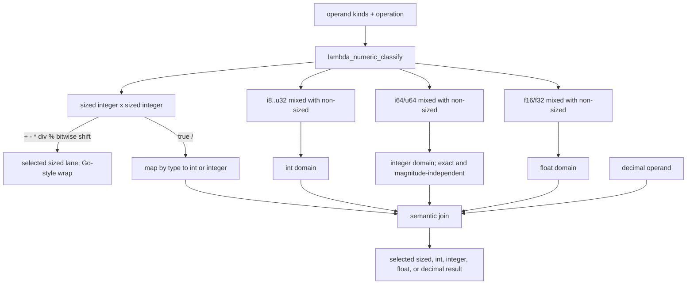

# Lambda Runtime — Numbers, Decimal & DateTime

> **Part of the [Lambda core-runtime detailed-design set](LR_00_Overview.md).** This document covers the semantic numeric tower, the shared type-directed classifier, sized-machine arithmetic, flex-`int` overflow, decimal/`integer` arithmetic backed by **libmpdec**, and GC-owned `DateTime`. It owns the *operations*; physical representation is owned by [LR_03 — Value & Type Model](LR_03_Value_and_Type_Model.md). The normative rules are [Lambda Formal Semantics §4](../../Lambda_Formal_Semantics.md#4-numerics) and `vibe/Lambda_Semantics_Number_Model.md`; `vibe/Lambda_Impl_Numbers.md` records the completed 2026-07-20 realignment.
>
> **Primary sources:** `lambda/lambda-number.hpp` (shared numeric kinds, operation families, joins, sized-lane selection, overflow policy), `lambda/lambda-number-types.hpp` and `lambda/lambda-number-runtime.hpp` (static/runtime adapters), `lambda/lambda-eval-num.cpp` (the `fn_*` execution paths and conversions), `lambda/lambda-decimal.cpp` + `lambda/lambda-decimal.hpp` (all decimal/BigInt via mpdecimal), and `lib/datetime.h` / `lib/datetime.c` plus `lambda/lambda-eval.cpp` (GC-owned datetime construction and operations).
> **Audience:** engine developers. **Convention:** `file:line` references drift; confirm against the cited symbol names.

---

## 1. Purpose & scope

Lambda is **JIT-only** — there is no tree-walking interpreter ([LR_07](LR_07_MIR_Transpiler_JIT.md)). Numeric operations are implemented by the `fn_*` runtime support library called from generated MIR: `fn_add`/`fn_sub`/`fn_mul`/`fn_div`/`fn_idiv`/`fn_mod`/`fn_pow`, the unary/reduction family, and conversions. These live in `lambda/lambda-eval-num.cpp`, use `__thread EvalContext* context`, and delegate decimal/`integer` work to `lambda/lambda-decimal.cpp`. AST inference, MIR lowering, runtime scalar execution, vectors, and reductions consume the same operation classification instead of reconstructing a promotion ladder from `TypeId` order or operand magnitude.

The semantic value tower is `int`, `integer`, `float`, `decimal`. `INT` is an inline value capped to ±(2⁵³−1); `integer` is the arbitrary-precision `DECIMAL_BIGINT` carrier; `FLOAT` uses canonical self-tagged binary64 with a number-home residue; and `decimal` is a GC-owned `Decimal*`. Sized storage types are orthogonal: compact `NUM_SIZED` values and full-width `INT64`/`UINT64` values remain machine lanes when both operands are sized, but enter the semantic tower by type when mixed with non-sized numbers. `INT64`/`UINT64` have no inline form and use the Stack API's number homes or destination-owned words. The exact physical representation is owned by [LR_03 §2](LR_03_Value_and_Type_Model.md).

---

## 2. The promotion tower and shared operation classification

### 2.1 Settled promotion model

The settled non-sized joins are `int + float → float`, `int + integer → integer`, and `integer + float → decimal`; decimal participation remains decimal. Sized×sized integer operations select a machine lane and wrap there. Sized×non-sized operations first map compact integer lanes to `int` and `i64/u64` to `integer`, irrespective of magnitude. True `/` uses the same entry mapping, with `int / int → float` and `integer / integer → decimal`.

`lambda-number.hpp` expresses this model as a C-compatible numeric-kind and operation-family classifier. `lambda-number-types.hpp` preserves the complete semantic `Type*`, including the `integer` carrier distinction that a bare `LMD_TYPE_DECIMAL` cannot express. `lambda-number-runtime.hpp` classifies complete `Item` values and provides exact integral consumers. Execution still uses specialized native, decimal, and vector kernels after the result domain and overflow policy are known.

### 2.2 Exact sized-domain entry

The retired `normalize_sized(Item&, TypeId&)` shortcut no longer exists. The operation pair is classified before either operand is converted. Sized×sized integral operations preserve their selected machine lane. A compact sized integer leaving that domain converts to `int`; every `i64/u64` converts exactly to the `integer` (`DECIMAL_BIGINT`) carrier, including `UINT64_MAX` through `bigint_from_uint64`; compact sized floats enter `float`. Ordinary decimal is not substituted for `integer`, even though both share `LMD_TYPE_DECIMAL` physically.

### 2.3 Overflow depends on the arithmetic domain

Flex-`int` `+`, `-`, and `*` compute through `__int128`: results inside ±(2⁵³−1) remain `int`; results outside the band become correctly rounded binary64 and may lose integer precision at boundary cases. That performance tradeoff is intentional. Sized integer arithmetic is different: it wraps deterministically in the selected fixed-width lane, including signed two's-complement overflow. `integer` arithmetic remains arbitrary precision. The implementation must never route one domain through another domain's overflow behavior merely because their physical payloads are both 64 bits.

### 2.4 True division is domain-selected

`/` is true division, but "always float" is over-generalized. `int / int`, `int / float`, and `float / float` produce float; `integer / integer`, `integer / float`, and any decimal participation produce decimal. Sized integer operands leave their machine lane first, so compact sized division enters the float route while `i64/u64` division enters the decimal route. Integral `div` and `%` stay in a selected sized lane when both operands are sized, or operate in the selected non-sized `int`/`integer` domain after a mixed expression. Scalar, vector, and reduction implementations now apply this distinction uniformly.

### 2.5 Reductions and conversions

Reductions and conversions use the same domains as scalar arithmetic. An `int` result remains compact only inside the safe band and otherwise becomes float; explicit `int64`/`uint64` conversions retain their sized type; explicit `integer` construction produces `DECIMAL_BIGINT`. Vector result containers are chosen from the classified result before execution, so full-width true division can materialize decimal Items while integral sized operations stay in compact homogeneous lanes.

---

## 3. Decimal — arbitrary precision via libmpdec

`lambda/lambda-decimal.cpp` is the **only** translation unit that includes `<mpdecimal.h>` (`:11`); everything else uses the slim `lambda-decimal.hpp` API with `mpd_t`/`mpd_context_t` forward-declared. A decimal value is a `struct Decimal { uint8_t unlimited; mpd_t* dec_val; }` (`lambda-data.hpp:110`) — a one-byte tri-state tag plus a pointer to the libmpdec number. There is **no reference-count field**: the struct is GC-owned, allocated by `decimal_create` (`lambda-decimal.cpp:325`) via `heap_alloc(..., LMD_TYPE_DECIMAL)`, and `decimal_retain`/`decimal_release` (`:338`/`:342`) are **no-ops** ("GC handles lifetime"). Any external note describing them as live ref-counting is stale.

### 3.1 The tri-state: fixed / extended / integer carrier

The `unlimited` byte is a tri-state tag: **0 = fixed decimal tier**, **1 = extended decimal tier**, **2 = integer carrier** (`DECIMAL_BIGINT`). Each state binds a different libmpdec context, lazily initialized:

- **Fixed** uses `g_fixed_ctx` = `mpd_defaultcontext`, **38 digits**, reached via `decimal_fixed_context()`. Lowercase `n` literals whose significant decimal digits fit this tier use it.
- **Extended** uses `g_unlimited_ctx` = `mpd_maxcontext` but with **`prec` forced down to 200**, reached via `decimal_unlimited_context()`. Lowercase `n` decimal literals that exceed the fixed tier use it; there is no source-level `N` suffix.
- **Integer carrier** uses a separate `g_bigint_ctx` = `mpd_maxcontext` with **`prec = 2000`** for integer-like `n` literals and exact integer results carried in Decimal storage.

The 200-digit extended cap is a deliberate runtime guard, not a source-level type distinction: `mpd_maxcontext`'s native precision (~10^18) can crash `mpd_pow`, so 200 digits is used as a practical extended tier.

### 3.2 Contagion and the operation set

The arithmetic ops (`decimal_add`, `decimal_sub`, `decimal_mul`, `decimal_div`, `decimal_mod`, `decimal_pow`, `decimal_neg`, `decimal_abs`) are all shaped alike: pick the context with `get_decimal_context`, convert any non-decimal operand to a temporary `mpd_t` with `decimal_item_to_mpd`, run the libmpdec op, free temporaries via `cleanup_temp`, reject `mpd_isnan`/`mpd_isinfinite` results as `ItemError`, and wrap the result with `decimal_push_result`. The extended tier is contagious for decimal arithmetic: `should_be_unlimited(a, b)` returns true if either operand needs the extended context, and that flag is threaded into both the chosen context and the result's `unlimited` byte. Exact integer `+`, `-`, `*`, `%`, unary negation, and `abs` preserve the integer carrier when both operands are integer carriers; `/` exits to decimal. Division and modulo additionally check `mpd_iszero` on the divisor and return `ItemError` on a zero divisor.

`decimal_item_to_mpd` (`:350`) converts a non-decimal `Item` into an `mpd_t`: `INT`/`INT64` go through `mpd_set_ssize` (exact, `:368`/`:371`), but a `FLOAT` is converted by formatting with `snprintf("%.17g")` and re-parsing with `mpd_qset_string` (`:376`) — a string round-trip that is lossy/fragile at the edges of the double range (see §6). For parser/input contexts where GC allocation is unsafe, an arena-backed family (`decimal_from_*_arena`, `decimal_deep_copy`, declared `lambda-decimal.hpp:84`–`90`) allocates the `Decimal` struct in an arena with a non-GC `mpd_t` inside.

### 3.3 Comparison and formatting

`decimal_cmp_items` picks an extended-or-fixed context from the operands and calls `decimal_cmp`, which converts both sides and returns `mpd_cmp`. Critically, on a **conversion failure** `decimal_cmp` returns **`0` (equal)** — a silent error swallow that makes a malformed comparand compare equal to everything (§6). Formatting goes through `decimal_print` / `decimal_big_print`, both built on `mpd_to_sci` with no truncation.

### 3.4 BigInt

BigInt (`lambda-decimal.cpp`, `bigint_*`) **reuses the same `Decimal` struct and the same `LMD_TYPE_DECIMAL` tag**, distinguished only by `unlimited == DECIMAL_BIGINT`. `bigint_push_result` sets the tag and encodes the tagged pointer inline. The full integer surface is here: `bigint_add`/`sub`/`mul`/`div`/`mod`/`pow`/`neg`/`inc`/`dec`, the ES-style two's-complement bitwise ops and shifts, and the constructors `bigint_from_int64`/`from_double`/`from_string`. BigInt parsing and arithmetic use precision-sized mpdecimal contexts rather than the default 2000-digit context when the operation can grow wider: long decimal/radix-prefixed strings allocate a heap copy and size the parse context from source length; wide shifts size the context from the requested bit count; non-decimal `toString(radix)` and scientific-notation decimal fallback extract digits by arbitrary-precision division instead of narrowing through `int64`.

---

## 4. DateTime — GC-owned object with a current 64-bit payload

`struct DateTime` (`lib/datetime.h`) currently uses a 64-bit bit-field payload, but every `LMD_TYPE_DTIME` Item points to a GC-owned object created through `push_k()`. Datetime never uses the number stack, a caller-donated numeric home, or destination scalar tails. This ownership rule deliberately leaves the object layout free to grow beyond 64 bits later. The current fields are `year_month:17`, `day:5`, `hour:5`, `minute:6`, `second:6`, `millisecond:10`, `tz_offset_biased:11`, `precision:2`, and `format_hint:2`.

**Precision** is a 4-value enum (`DateTimePrecision`, `:50`): `YEAR_ONLY`, `DATE_ONLY`, `TIME_ONLY`, `DATE_TIME`. **Format hint** (`DateTimeFormat`, `:58`) doubles as a UTC flag across its 4 values (`ISO8601`, `HUMAN`, `ISO8601_UTC`, `HUMAN_UTC`; `DATETIME_IS_UTC_FORMAT`, `:77`). The **parse formats** are a separate enum (`DateTimeParseFormat`, `:41`): ISO8601, ICS, RFC2822, LAMBDA (`YYYY-MM-DD hh:mm:ss` without the `t'…'` wrapper), and HUMAN, each with its own `datetime_parse_*` entry plus the dispatcher `datetime_parse` (`:126`).

The constructors live in `lambda/lambda-eval.cpp`: `fn_datetime0`/`fn_datetime1` (`:4392`/`:4417`) parse a string via `datetime_parse_lambda` or treat an integer argument as unix-milliseconds via `datetime_from_unix_ms` (`:4438`); `fn_date0`/`fn_date1`/`fn_date3` (`:4453`/`:4464`/`:4500`) and `fn_time0`/`fn_time1`/`fn_time3` (`:4531`/…) build date- or time-only values with field-range validation against the `DATETIME_MAX_*` macros (`lib/datetime.h:95`–`104`). The **error sentinel** is `DATETIME_MAKE_ERROR()` (`lambda.h:848`) — a reserved `int64_val` — and datetime-returning builtins guard with the `GUARD_DATETIME_ERROR*` macros. Ordered comparison is `datetime_compare` (`lib/datetime.c`), used by `fn_eq`/`fn_lt_scalar`/`fn_gt_scalar` (`lambda-eval.cpp:1149`/`1321`/`1375`); member access (`.year`, `.month`, `.unix`, …) reads the packed fields directly, with `datetime_to_unix_ms` for the unix views.

---

## 5. Design decisions & rationale

- **Safe-band `int`, float overflow.** Plain integers are inline inside ±(2⁵³−1); `+`/`-`/`*` overflow enters float and may round. Sized lanes instead wrap, and `integer` stays arbitrary precision.
- **One semantic promoter, specialized execution.** One shared type-directed classification drives AST, MIR, runtime, vectors, and reductions, while retaining per-domain native fast paths after classification.
- **Domain-selected true division.** `/` is float for the int/float domain and decimal for the integer/decimal domain; `div` remains the integral quotient operator.
- **Decimal contagion + capped "unlimited".** The unlimited flag spreads through every op so a single unlimited operand pins the whole computation to high precision; the 200-digit cap is a pragmatic workaround for `mpd_pow` crashing at `mpd_maxcontext`, and BigInt gets its own 2000-digit context tuned independently.
- **Decimal lifetime is GC-owned.** Ref counting was removed; `retain`/`release` are no-ops. This removes a class of leak/double-free bugs at the cost of relying entirely on the collector ([LR_08](LR_08_Memory_and_GC.md)).
- **DateTime is always GC-owned.** Its present payload is one word, but Item/lifetime semantics do not expose that size and permit future expansion.

---

## Known Issues & Future Improvements

1. **"Unlimited" decimal is a 200-digit cap, not unlimited.** `g_unlimited_ctx.prec = 200` (`lambda-decimal.cpp:35`) is a workaround for `mpd_pow` crashing at `mpd_maxcontext` precision; the surface name "unlimited" overstates it. Computations needing more than 200 significant digits silently round.
2. **BigInt still has practical caps.** Exact operations size their mpdecimal contexts as needed, but `bigint_precision_context` caps precision at 100000 digits and shift helpers reject counts above 100000 bits. Those are implementation guardrails, not mathematical limits in the surface model.
3. **Trapping `mpd_get_ssize` can SIGFPE.** `decimal_to_int64` (`:926`/`:939`) and `decimal_mpd_to_int64` (`:394`) use the **trapping** `mpd_get_ssize`, which can SIGFPE on overflow. BigInt shift/pow paths use quiet extraction before narrowing, but the decimal conversion helpers remain an unhandled-crash risk on out-of-range magnitudes.
4. **`decimal_cmp` swallows conversion failure as equality.** On a failed operand conversion, `decimal_cmp` returns `0` (`lambda-decimal.cpp:788`), so a malformed comparand compares **equal** rather than raising — a silent-wrong-answer path feeding `decimal_cmp_items`.
5. **Float↔decimal round-trip via `%.17g` is lossy/fragile.** `decimal_item_to_mpd` converts a `FLOAT` by `snprintf("%.17g")` then `mpd_qset_string` (`:376`), and `decimal_mpd_to_double` reverses it through `mpd_to_sci` + `strtod` (`:400`). `%.17g` is round-trip-safe for most doubles but fragile at subnormals/edge magnitudes, and the string detour is a hot-path cost.
6. **`error_code`/sentinel coupling.** Division-by-zero and invalid decimal results can still collapse to generic `ItemError`; the structured `LambdaError` codes are attached upstream in [LR_10](LR_10_Error_Handling.md).
7. **DateTime range caps.** `year_month:17` bounds years to −4000…+4191 (`lib/datetime.h:22`, `DATETIME_MAX_YEAR 4191`), `tz_offset_biased:11` bounds the offset to ±1023 minutes (`:103`), and milliseconds are the finest precision (no microseconds). Out-of-range construction yields `DATETIME_MAKE_ERROR()`.
8. **No literal `TODO`/`FIXME` markers.** The caveats above are structural, expressed only as "for now" / "far more than needed" comments and discoverable by reading the code, not by grepping for tags.

---

## Appendix A — Source map

| File | Responsibility (this doc) |
|---|---|
| `lambda/lambda-number.hpp` | Shared numeric kinds, operand-domain joins, sized-lane selection, result kind, and overflow policy. |
| `lambda/lambda-number-types.hpp` / `lambda/lambda-number-runtime.hpp` | Complete static `Type*` and runtime `Item` adapters, including semantic `integer` and exact integral consumers. |
| `lambda/lambda-eval-num.cpp` | Scalar execution, sized-lane kernels, unary/reduction ops, and explicit conversions after shared classification. |
| `lambda/lambda-decimal.cpp` | All decimal/BigInt via libmpdec: the three contexts, `decimal_create`/`push_result`, `decimal_item_to_mpd`, the arithmetic ops + `should_be_unlimited` contagion, `decimal_cmp`, and the full BigInt surface (`bigint_*`, `bigint_to_cstring_radix`). |
| `lambda/lambda-decimal.hpp` | The slim mpdecimal-free API: constants (`DECIMAL_FIXED_PRECISION`), context/parse/creation/format/arithmetic/comparison declarations, and the `extern "C"` BigInt block. |
| `lib/datetime.h` / `lib/datetime.c` | The packed `DateTime` bit-field word, precision/format/parse enums, field macros, `datetime_parse_*`, `datetime_compare`, unix conversions, calendar utilities. |
| `lambda/lambda.h` | Numeric helper macros: `i2it`, `INT56_MIN`/`INT56_MAX`, `INT64_ERROR`, `DECIMAL_BIGINT`, `DATETIME_MAKE_ERROR`, the decimal/datetime boxing macros (`c2it`/`k2it`). |
| `lambda/lambda-eval.cpp` | DateTime constructors `fn_datetime0/1`, `fn_date0/1/3`, `fn_time0/1/3`, and the `datetime_compare`-based ordering in `fn_eq`/`fn_lt_scalar`/`fn_gt_scalar`. |

## Appendix B — Related documents

- [LR_03 — Value & Type Model](LR_03_Value_and_Type_Model.md) — the tagged `Item` representation, the `INT`/`INT64`/`FLOAT`/`DECIMAL`/`DTIME` tags, boxing macros, and the `Decimal`/`DateTime` storage classes this doc operates over.
- [LR_05 — Strings, Symbols & Vectors](LR_05_Strings_and_Vectors.md) — the `ArrayNum` vector engine the numeric ops dispatch into for vector/scalar pairings.
- [LR_07 — The MIR Direct Transpiler & JIT](LR_07_MIR_Transpiler_JIT.md) — how the JIT keeps numerics native vs boxed, the INT64 double-box guard, and where `fn_*` numeric calls are emitted.
- [LR_09 — Runtime Builtins & System Functions](LR_09_Runtime_Builtins.md) — the `sys_func_defs[]` registration of these `fn_*` numeric/datetime builtins.
- [LR_10 — Error Handling](LR_10_Error_Handling.md) — the `ItemError` sentinel and the structured `LambdaError` codes that overflow/div-by-zero/NaN results collapse into.
