# Lambda Runtime — Strings, Symbols & Vectors

> **Part of the [Lambda core-runtime detailed-design set](LR_00_Overview.md).** This document covers two value families that live "next to" the numeric tower: UTF-8 **strings and symbols** (their flexible-array layout, three-tier allocation, `is_ascii` fast indexing, utf8proc normalization, and casefold-then-`memcmp` comparison), and the **`ArrayNum`** numeric-array / vector machine (the union-aliased storage, the 14 element types, the auto-vectorized contiguous kernels, NumPy-style N-D broadcasting, mutable views, and the image-processing toolkit built on top).
>
> **Primary sources:** `lambda/utf_string.cpp`/`utf_string.h` (utf8proc normalization + Unicode comparison), `lambda/lambda-vector.cpp` (the entire `ArrayNum` engine — kernels, broadcasting, views, image ops), `lambda/lambda.h` (the `String`/`Symbol`/`ArrayNum`/`ArrayNumShape` C structs, `ELEM_*` enum, `ELEM_TYPE_SIZE`), `lambda/lambda.hpp` (the C++ `ArrayNum` struct + `get_elem_type`/`set_elem_type`), `lambda/lambda-eval.cpp` (`array_num_eq`, scalar string comparison), `lambda/lambda-data-runtime.cpp` (`array_num_new`, `array_num_get`).
> **Audience:** engine developers. **Convention:** `file:line` references drift; confirm against the cited symbol names. The **`ArrayNum` struct layout itself is owned by [LR_03 — Value & Type Model](LR_03_Value_and_Type_Model.md)** (§4 "The `Container` struct family"); this document covers the *operations* over it. The numeric scalar tower these vectors fall back to is owned by [LR_04 — Numbers, Decimal & DateTime](LR_04_Numbers_Decimal_DateTime.md).

---

## 1. Purpose & scope

Strings and vectors are the two "bulk" value families in the Lambda runtime: a string is a flat run of UTF-8 bytes, and an `ArrayNum` is a flat run of homogeneous numbers. Both deliberately avoid per-element boxing — a string never stores `Item`s for its characters, and an `ArrayNum` never stores `Item`s for its elements — so that the hot paths (indexing, comparison, element-wise arithmetic) run over raw C buffers that the compiler can keep in registers and auto-vectorize. This document is the map of those operations.

It does **not** re-derive the struct layouts: `struct String`, `struct Symbol`, `struct ArrayNum`, and `struct ArrayNumShape` are defined and explained in [LR_03](LR_03_Value_and_Type_Model.md). The *memory* that backs these objects — the namepool, the parser arena, the GC heap, and the compaction that view-pinning defends against — is owned by [LR_08 — Memory Management & Garbage Collection](LR_08_Memory_and_GC.md). The string and collection *builtins* exposed to scripts (`fn_substring`, `fn_len`, `fn_split`, …) are catalogued in [LR_09 — Runtime Builtins](LR_09_Runtime_Builtins.md); this doc covers the representation and the algorithmic core, not the full surface.

---

## 2. The `String` and `Symbol` representation

`struct String` (`lambda.h:534`) is `{ uint32_t len; uint8_t is_ascii; char chars[]; }` — a **flexible array member** holding NUL-terminated UTF-8 bytes inline after the header, so a string is a single allocation with no indirection to its character data. `len` is the **byte** length (not a codepoint count); `is_ascii` is `1` when every byte is `< 0x80`. `Binary` is `typedef String` (`lambda.h:549`) — binary blobs reuse the same layout. `struct Symbol` (`lambda.h:544`) is parallel — `{ uint32_t len; Target* ns; char chars[]; }` — adding an optional namespace `Target*` so a symbol can be namespace-qualified (the `chars[]` flexible array is identical otherwise).

The `is_ascii` flag is the **O(1)-indexing pivot**. For an all-ASCII string, byte offset *equals* character offset, so `s[i]` is a direct `chars[i]` read; only when `is_ascii == 0` must indexing walk UTF-8 lead/continuation bytes. String constructors maintain the flag conservatively: `fn_strcat` (`lambda-eval.cpp:183`) ANDs the two operands' `is_ascii` bits, so a concatenation is ASCII only if both inputs were.

### Three-tier allocation

A `String` can be born in any of three regions, matching the three-tier scheme described in [LR_08](LR_08_Memory_and_GC.md):

- **Namepool** — interned identifiers and shape names; deduplicated, pointer-equality-comparable, never individually freed.
- **Arena** — strings produced by the input parsers (`lambda/input/`) and document construction; bulk-freed with the parse arena, never GC-traced.
- **GC heap** — runtime-produced strings; `heap_strcpy` (`lambda-mem.cpp:524`) calls `heap_alloc(..., LMD_TYPE_STRING)` so the object participates in collection. Boxing a `String*` into an `Item` is the pure tag-OR `s2it` (a NULL pointer boxes to `ITEM_NULL`); see [LR_03 §3](LR_03_Value_and_Type_Model.md).

Which tier a string lives in is not recorded in the `String` header itself — it is a property of the allocating call site, and it matters because **views and mutation are only legal on GC-heap objects** (the `is_heap` container flag), a constraint that resurfaces for `ArrayNum` views in §7.

---

## 3. UTF-8 normalization & Unicode comparison

All Unicode-aware string work routes through **[utf8proc](https://juliastrings.github.io/utf8proc/)** in `utf_string.cpp` (267 lines); the runtime carries no hand-rolled Unicode tables. `init_utf8proc_support`/`cleanup_utf8proc_support` (`:9`/`:13`) are intentionally empty — utf8proc needs no global setup.

The five normalizers are thin wrappers over one library call, `utf8proc_map`, distinguished only by the option flags:

- `normalize_utf8proc_nfc` (`:17`) — `UTF8PROC_STABLE | UTF8PROC_COMPOSE` (canonical composition, NFC).
- `normalize_utf8proc_nfd` (`:40`) — `STABLE | DECOMPOSE` (canonical decomposition, NFD).
- `normalize_utf8proc_nfkc` (`:221`) — `STABLE | COMPOSE | COMPAT` (compatibility composition, NFKC).
- `normalize_utf8proc_nfkd` (`:245`) — `STABLE | DECOMPOSE | COMPAT` (compatibility decomposition, NFKD).
- `normalize_utf8proc_casefold` (`:63`) — `STABLE | COMPOSE | CASEFOLD` (case-insensitive folding).

Each returns a freshly-allocated `char*` (utf8proc's own `raw_*` allocation) and writes the byte length through `out_len`; a `NULL` input or non-positive length yields `NULL` and `*out_len = 0`, and a negative utf8proc result code is mapped to the same empty failure. Callers own the returned buffer and free it with `raw_free` (flagged `RAWALLOC_OK` in the source because it is utf8proc-internal memory, §9).

### Casefold-then-`memcmp` comparison

`string_compare_unicode` (`:86`) is the comparison core. It **casefolds both operands** with `normalize_utf8proc_casefold`, then compares the folded byte sequences with `memcmp` over the shorter length, breaking ties by length (`:106`–`:122`). The result is one of `UTF8PROC_COMPARE_{EQUAL,LESS,GREATER,ERROR}` (`utf_string.h:11`). Both folded buffers are `raw_free`d before return (`:124`).

This is a **casefold-then-byte-compare ordering, not full UCA collation** — there is no Unicode Collation Algorithm, no locale tailoring, no weight tables. Two strings that differ only in case compare equal; accented vs. unaccented letters order by their *casefolded UTF-8 byte values*, which approximates but does not equal a locale-correct collation. The comment at `:91` aspires to "proper Unicode collation" but the implementation is the simpler casefold+`memcmp`.

The Item-level wrappers `equal_comp_unicode`/`less_comp_unicode`/`greater_comp_unicode`/`less_equal_comp_unicode`/`greater_equal_comp_unicode` (`:133`–`:218`) unbox both sides with `get_safe_string()`, return `BOOL_ERROR` on a NULL operand, and add fast paths: pointer identity (`a_str == b_str`) short-circuits, and `equal_comp_unicode` rejects on a length mismatch *before* folding (`:141`). Crucially these utf8proc comparators are a **separate code path** from the scalar comparison used by the generic ordered operators — `fn_lt_scalar`/`fn_gt_scalar` compare STRING/SYMBOL with a plain byte-order `strcmp` (`lambda-eval.cpp:1326`/`:1380`), so two string orderings coexist in the runtime (§9).

---

## 4. The `ArrayNum` storage model

`struct ArrayNum` (C in `lambda.h:630`, C++ in `lambda.hpp:354`) is the unified typed-numeric-array container — it is what the language calls a "vector" and what NumPy would call an `ndarray`. Its full layout is owned by [LR_03 §4](LR_03_Value_and_Type_Model.md); the parts this document relies on are:

- A **three-way union** `{ int64_t* items; double* float_items; void* data; }` (`lambda.h:636`). The three members alias the *same* pointer; which one is valid is decided by the element type. `items` serves `ELEM_INT`/`ELEM_INT64`, `float_items` serves `ELEM_FLOAT`, and `data` serves every compact width.
- The **element type lives in the `map_kind` byte**, accessed through `get_elem_type()`/`set_elem_type()` (`lambda.hpp:366`) — `ArrayNum` reuses the byte that `Map`/`Object`/`Element` use for their `MapKind` tag, because a numeric array has no `MapKind`.
- `length`, `extra`, `capacity` (`int64_t`). For plain 1-D arrays `extra` counts growable-append overflow; for N-D and view arrays `extra` instead holds an `ArrayNumShape*` side table.
- The `array_flags` bits `is_ndim`/`is_view`/`is_pinned`/`is_mutable_view` (`lambda.h:596`) drive the view machinery in §7.

### The 14 element types

`enum EnumArrayNumElemType` (`lambda.h:146`) defines 14 element kinds, **deliberately spaced by `0x10`**: `ELEM_INT` `0x00`, `ELEM_FLOAT` `0x10`, then the compact ints `ELEM_INT8`/`16`/`32`/`64` (`0x20`–`0x50`), the unsigned `ELEM_UINT8`/`16`/`32`/`64` (`0x60`–`0x90`), the compact floats `ELEM_FLOAT16`/`32`/`64` (`0xA0`–`0xC0`), and `ELEM_BOOL` `0xD0`. The `0x10` spacing means `et >> 4` is a dense 0..13 index into `ELEM_TYPE_SIZE[16]` (`lambda.h:175`), the per-element byte-size table — so element stride is a single table lookup, never a `switch`. `ELEM_BOOL` is kept distinct from `ELEM_UINT8` (same 1-byte storage) so that `any()`/`all()` and the comparison-mask producers (§6) have a true boolean element type to target.

Element read/write at the value boundary boxes per element type: `vector_get` (`:78`) and `array_num_get` (`lambda-data-runtime.cpp`) dispatch on `get_elem_type()` to produce the right `Item` (`i2it` for `ELEM_INT`, `push_l`/`push_d` for the 8-byte kinds, the `*_to_item` packers for compact widths, a GC-allocated box for `ELEM_UINT64`). The internal arithmetic paths instead use the **unboxed** helpers `compact_elem_to_double` (`:135`) and `read_arr_elem_as_double`/`write_arr_elem_from_double` (`:513`/`:532`), which convert any element type to/from `double` with rounding and per-type clamping — this is how a single code path can drive all 14 element kinds.

Construction is `array_num_new(elem_type, length)` (`lambda-data-runtime.cpp`) with a `checked_mul` overflow guard on `length * elem_size`, plus the typed shortcuts `array_int_new`/`array_int64_new`/`array_float_new`.

---

## 5. SIMD via pragmas: the contiguous kernels

Lambda's vectorization is **compiler auto-vectorization driven by pragmas and `__restrict`, not hand-written intrinsics**. The macro `LMD_VEC_LOOP` (`lambda-vector.cpp:18`) expands to `_Pragma("clang loop vectorize(enable) interleave(enable)")` under clang, `_Pragma("GCC ivdep")` under GCC, and nothing otherwise. There is no OpenMP runtime, no SSE/AVX/NEON intrinsic, and no ISA assumption in the source — the actual vector instructions come entirely from the **release build's `-O3 -march=native`** (per CLAUDE.md, performance work must use the release build; at debug `-O0` the pragma is a harmless hint). This keeps the kernels portable across x86-64 and ARM while still vectorizing on each.

The kernels (`:183`–`:232`) are **templated on element type `T` and a compile-time op code `OP`**, with the operator selected by `if constexpr` *inside* the loop body so the op-`switch` lives entirely *outside* the loop — the loop is then a single straight-line `__restrict` statement the vectorizer can lift:

- `k_vv<T,OP>` (`:183`) — element-wise `d[i] = a[i] OP b[i]` (vector ⊕ vector).
- `k_vs<T,OP>` (`:196`) — `d[i] = a[i] OP s` (vector ⊕ scalar).
- `k_sv<T,OP>` (`:208`) — `d[i] = s OP a[i]` (scalar ⊕ vector; a separate kernel because subtraction and division are not commutative).
- `k_vv_widen<T,OP>` (`:223`) — loads a small int/uint type, widens to `int64_t`, and stores `int64_t`, preserving Lambda's **non-wrapping integer-widening** semantics (a `+` of two `int8` arrays yields `int64`, not a wrapped `int8`).

Op encoding is `0=add 1=sub 2=mul 3=div`; only these four (and div only for floating types) are vectorizable kernels. `mod` and `pow` keep scalar loops at the call sites because they carry div-by-zero guards or call `fmod`/`pow`. The routers `vec_scalar_op` (`:252`) and `vec_vec_op` (`:725`) **branch-hoist by element type**: they detect `ELEM_INT64`/`ELEM_INT` (both in `items`), `ELEM_FLOAT32` (in `data`), and the double-storage `ELEM_FLOAT`/`ELEM_FLOAT64` (in `float_items`/`data`) and dispatch to the matching typed kernel; compact and heterogeneous cases fall through to a per-element `double` loop (`:367`, `:403`). Empty operands short-circuit to an empty array or list matching the input kind.

---

## 6. N-D broadcasting

When either operand carries shape metadata, the routers dispatch to `vec_broadcast_op` (`:590`), which implements **NumPy broadcasting** over the `ArrayNumShape` side table. The rules, documented at `:449`:

1. **Right-align** the two shapes; pad the shorter with leading `1`s.
2. At each axis, dims must be **equal, or one must be 1**.
3. A size-1 axis is "stretched" by setting its **effective stride to 0**, so the same element is re-read for every index along that axis.

`get_shape_strides` (`:462`) reads an array's `(shape, strides)` from its `ArrayNumShape` (or synthesizes `{length},{1}` for a plain 1-D array — strides are in **elements**, not bytes). `compute_broadcast_shape` (`:479`) applies the three rules, returning the output ndim and the per-operand effective strides (with `0` for stretched axes), or `-1` on an incompatible pair. The result buffer is allocated by `alloc_ndim_arraynum` (`:560`), which builds a fresh `ArrayNumShape` with row-major strides. The op then runs a **strided N-D walk** (`:618`): an `idx[32]` counter is incremented last-axis-fastest, each operand's flat offset is the dot product `Σ idx[axis] * eff_str[axis]`, the two elements are read as `double`, the op is applied, and the result is stored. The result is float when either operand is float or the op is div/pow, else `ELEM_INT64`.

`vec_scalar_op` feeds this path for N-D arrays by **wrapping the scalar as a 1-element `ArrayNum`** (`:277`) — the 1-element wrapper broadcasts to every position, so `mat + 10` preserves `mat`'s shape. The same wrap-and-broadcast trick handles array-vs-scalar comparison in `vec_cmp` (`:692`).

**Comparison kernels** parallel the arithmetic ones: `vec_cmp_broadcast` (`:668`) walks the broadcast shape applying `cmp_apply` (`:655`, op codes `0=EQ 1=NE 2=LT 3=LE 4=GT 5=GE`) and writes an `ELEM_BOOL` mask array — the boolean array then feeds mask-indexing (`fn_mask_index`, `:3587`). `vec_cmp` (`:692`) is the public dispatcher for `a OP b` where at least one operand is an `ArrayNum`.

---

## 7. Mutable views

A **view** is an `ArrayNum` that aliases another array's storage instead of owning it. Four constructors build views — `fn_subview` (`:2774`), `fn_reshape` (`:2843`), `fn_transpose` (`:3014`), and `fn_ravel` (`:3080`) — and they share one discipline:

- **The view aliases the base buffer.** `fn_subview` sets `view->data = base->data + start * elem_size` (`:2815`) — element 0 of the view is element `start` of the base; `reshape`/`transpose`/`ravel` keep `data = base->data` and re-describe it with new shape/strides. No element data is copied.
- **The view carries shape metadata.** It sets `is_ndim` and `is_view` (and `is_mutable_view`, `:2813`) and attaches an `ArrayNumShape` whose `base` field points back to the owning `Container` and whose `offset` records the element offset into the base (`:2826`).
- **The view pins its base against GC compaction.** Each constructor sets `base->is_pinned = 1` (`:2833`, `:2938`, `:3060`, `:3113`). Because the collector may relocate buffers, an un-pinned base could be moved out from under the view's aliased `data` pointer; pinning forbids that relocation while any view is live. This is detailed from the collector's side in [LR_08](LR_08_Memory_and_GC.md).
- **Arena-backed arrays are rejected.** Every constructor checks `base->is_heap` first and refuses with a "copy() first" error otherwise (`fn_subview:2783`, `fn_reshape:2852`). Arena memory is neither GC-relocatable nor pinnable, so it cannot safely back a view.

`is_mutable_view` marks a view as writable *through* to its base — procedural in-place element assignment on the view updates the underlying base buffer. `reshape` additionally requires the source to be **C-contiguous** (`:2857`): an owned 1-D array qualifies, but an existing non-contiguous view must be materialized with `copy()` first.

---

## 8. The image-processing toolkit

Layered on the N-D `ArrayNum` is a complete image toolkit (the "Typed_Array4" scope), where an image is just a 2-D `(H,W)` or 3-D `(H,W,C)` `ArrayNum` — usually `ELEM_UINT8` from `load`, or float in `[0,1]`. The categories:

- **Stencil engine.** `array_num_stencil` (`:3819`) is the shared neighborhood operator with ops `STENCIL_{DOT,MIN,MAX,MEDIAN,MEAN}` (`:3784`) and border handling. The convenience wrappers are `fn_convolve` (`:3911`, dot with an arbitrary kernel), and the box-kernel ops `fn_blur` (mean), `fn_erode` (min), `fn_dilate` (max), `fn_median_filter` (median), plus strided `fn_maxpool`/`fn_avgpool` (`:3921`–`:3927`).
- **I/O & dtype conversion.** `fn_load` (`:3968`) decodes any image to an `(H,W,4)` RGBA `ELEM_UINT8` array via the `lib/image.h` codec; `fn_save` (`:3988`) writes a PNG, scaling float `[0,1]` to `[0,255]`. `fn_as_float` (`:4018`) and `fn_as_ubyte` (`:4034`) convert between the `[0,255]` ubyte and `[0,1]` float representations through `array_num_convert` (`:3944`).
- **Point & geometric ops.** `fn_invert` (`:4080`), `fn_gamma` (`:4087`), `fn_threshold` (`:4096`), `fn_grayscale` (`:4104`, Rec.601 luma), `fn_flip` (`:4154`), `fn_rot90` (`:4173`), `fn_crop` (`:4198`). The point ops share `array_num_point_op` with a lambda, using `image_white()` to get the per-type white level.
- **Analysis.** `fn_histogram` (`:4229`, integer bincount or float linear bins), `fn_otsu` (`:4256`, fixed 256-bin between-class-variance threshold with a plateau-centering tie-break), and `fn_label` (`:4296`, 4-connected flood-fill connected-component labelling).
- **Resampling.** `fn_resize`/`fn_rotate`/`fn_affine_warp` (`:4375`/`:4394`/`:4414`) all gather through the shared `bilinear_gather` + `bilinear_sample` engine (`:4358`/`:4338`) — each output pixel maps back to a fractional source coordinate and is bilinearly interpolated, with edge-clamp (resize) or zero-fill (warp/rotate) outside the image.

---

## 9. Known Issues & Future Improvements

1. **`ArrayNum ==` is representation-sensitive (correctness bug).** `array_num_eq` (`lambda-eval.cpp:915`) is value-correct only for cross-element-type pairs (it promotes via `it2d`, `:923`) and for `ELEM_FLOAT` (element-wise, `:927`). For two same-`elem_type` arrays it falls to a single `memcmp(a->items, b->items, length * sizeof(int64_t))` (`:935`) — **hard-coded to `int64_t` width**. That is correct for `ELEM_INT`/`ELEM_INT64` but reads the **wrong byte width** for same-type compact arrays (`int8`/`uint16`/`float32`/`bool`), comparing past the actual buffer and/or mis-aligning elements. This is the in-code root of the MEMORY-index note that `==` on numeric arrays is unreliable; the documented robust workaround is **`sum(abs(a-b)) == 0`**.
2. **`ndim` cap of 32 is unchecked → stack overflow.** `ArrayNumShape.ndim` is a `uint8_t` bounded "1..32" by comment only (`lambda.h:715`), but the broadcast/stride helpers allocate fixed `[32]` stack buffers — `get_shape_strides` (`:462`) writes `shp[i]`/`str[i]` for `i < ndim`, and `vec_broadcast_op`/`vec_cmp_broadcast`/`fn_histogram`/`fn_otsu`/`fn_label` all declare `int64_t shp[32], str[32]` (`:591`, `:669`, `:4238`, `:4262`, `:4299`) — **with no bound re-check**. A shape with `ndim > 32` overruns these stack arrays.
3. **Two string orderings coexist.** The utf8proc casefold comparators in `utf_string.cpp` (`string_compare_unicode`, `:86`) are a separate code path from the scalar ordered operators, which compare STRING/SYMBOL with a plain byte-order `strcmp` (`lambda-eval.cpp:1326`/`:1380`). One path is case-insensitive Unicode-folded, the other is raw byte order — a latent inconsistency depending on which operator routes a given comparison.
4. **Not full UCA collation.** Even the utf8proc path is **casefold-then-`memcmp`** (§3), not the Unicode Collation Algorithm: no locale tailoring, no weight tables, no proper accent ordering. The `:91` comment overstates it as "proper Unicode collation."
5. **`index_to_item` truncates int64 → int.** `index_to_item` (`lambda-vector.cpp:1578`) does `i2it((int)index)` — it casts the `int64_t` index to a 32-bit `int` before boxing, so pipe `map`/`where` iteration over collections longer than 2³¹ produces a wrong/wrapped `~#` index.
6. **`fn_label` bypasses the GC with raw `malloc`/`free`.** The flood-fill stack in `fn_label` is allocated with raw `malloc` (`:4308`) and released with `free` (`:4332`), bypassing the runtime mempool/GC — contrary to the project rule to use `pool_*`/`arena_*`. It is leak-free on the success path but is untracked memory and would leak on an early-return inserted between the two.
7. **Fixed-size buffer truncation.** The median stencil uses a 4096-element stack `medbuf` capped by `STENCIL_MEDIAN_CAP` (`:3817`/`:3853`) and rejects larger median kernels; `fn_otsu` hard-codes 256 bins in a stack `int64_t h[256]` (`:4259`). These are silent ceilings on kernel/bin size.
8. **utf8proc allocation crosses the allocator boundary.** The normalizers return raw utf8proc-allocated buffers that callers must `raw_free` (`:124`); the `RAWALLOC_OK` annotations acknowledge this is outside the project's pool/GC discipline. A normalize failure mid-comparison frees both folded buffers and returns `UTF8PROC_COMPARE_ERROR`, which the Item wrappers surface as `BOOL_ERROR`.
9. **No `TODO`/`FIXME` markers.** None of the issues above are tagged in-source; they are structural and discoverable only by reading the code.

---

## Appendix A — Source map

| File | Responsibility (this doc) |
|---|---|
| `lambda/utf_string.cpp` / `utf_string.h` | utf8proc NFC/NFD/NFKC/NFKD/casefold normalizers; `string_compare_unicode` (casefold-then-`memcmp`); the `*_comp_unicode` Item-level comparators. |
| `lambda/lambda-vector.cpp` | The entire `ArrayNum` engine: `LMD_VEC_LOOP` + templated `k_vv`/`k_vs`/`k_sv`/`k_vv_widen` kernels; `vec_scalar_op`/`vec_vec_op` routers; `compute_broadcast_shape`/`vec_broadcast_op` N-D broadcasting; `vec_cmp` mask producers; `fn_subview`/`reshape`/`transpose`/`ravel` views; the image toolkit (stencil, I/O, point/geometry, histogram/otsu/label, resize/rotate/affine_warp). |
| `lambda/lambda.h` | `struct String`/`Symbol`/`ArrayNum`/`ArrayNumShape`; `ELEM_*` enum + `ELEM_TYPE_SIZE`; `is_ascii`; the `array_flags` view bits. |
| `lambda/lambda.hpp` | C++ `struct ArrayNum` + `get_elem_type`/`set_elem_type` (`map_kind`-byte reuse). |
| `lambda/lambda-eval.cpp` | `array_num_eq` (representation-sensitive); scalar STRING/SYMBOL `strcmp` comparison; `fn_strcat` `is_ascii` propagation. |
| `lambda/lambda-data-runtime.cpp` | `array_num_new`/`array_int_new`/… constructors; `array_num_get` element boxing. |
| `lambda/lambda-mem.cpp` | `heap_strcpy` GC-heap string allocation. |

## Appendix B — Related documents

- [LR_03 — Value & Type Model](LR_03_Value_and_Type_Model.md) — **owns** the `String`/`Symbol`/`ArrayNum`/`ArrayNumShape` struct layouts and the `Item` boxing of strings.
- [LR_04 — Numbers, Decimal & DateTime](LR_04_Numbers_Decimal_DateTime.md) — the scalar numeric tower these vectors fall back to element-wise.
- [LR_08 — Memory Management & Garbage Collection](LR_08_Memory_and_GC.md) — the namepool/arena/GC-heap three tiers and the compaction that view-pinning (`is_pinned`) defends against.
- [LR_09 — Runtime Builtins & System Functions](LR_09_Runtime_Builtins.md) — the string/collection/vector builtin surface (`fn_substring`, `fn_len`, `fn_sort`, the image functions) exposed to scripts.
