# Lambda Runtime — The C Transpiler (legacy C2MIR backend)

> **Part of the [Lambda core-runtime detailed-design set](LR_00_Overview.md).** This document covers the **legacy code-generation backend**: how the typed AST is lowered to **C source text** that is then handed to an embedded C compiler (c2mir) to produce MIR IR, which the JIT generator turns into native code. It owns the `Transpiler` struct and its `StrBuf` emission model, the per-node `transpile_*` family, the generated-C naming conventions, the `TypeBoxInfo` box/unbox table, the `lambda-embed.h` header-prepend trick, the `define_func`/`define_func_boxed` wrappers, the `_store_i64`/`_store_f64` SSA-reorder workaround, the `is_idiv_expr` unbox case, and the call-site parameter inference. The *default* backend — AST lowered directly to MIR with no C text — is a separate document, [LR_07 — The MIR Direct Transpiler & JIT](LR_07_MIR_Transpiler_JIT.md); this doc deliberately contrasts with it rather than repeating it.
>
> **Primary sources:** `lambda/transpile.cpp` (~8000 lines: the C-text emitter, all `transpile_*`/`define_*` node functions, call-site inference, loop-safety analysis), `lambda/transpile-call.cpp` (call-expression lowering split out of `transpile.cpp`), `lambda/transpile_shared.cpp` (naming/wrapper helpers shared with MIR Direct), `lambda/lambda-embed.h` (the bin2c dump of `lambda.h`), `lambda/mir.c` (`jit_compile_to_mir`, the c2mir entry).
> **Audience:** engine developers. **Convention:** `file:line` references drift; confirm against the cited symbol names. **Status warning:** this entire path is `#ifdef LAMBDA_C2MIR`-gated and is **not compiled into a default build** — it is the mature reference backend, kept for `--c2mir`, and is *stale relative to MIR Direct* in several places noted below.

---

## 1. Purpose & scope

Lambda is JIT-only, with two backends sharing one runtime. The **C2MIR** path documented here is the original: it walks the typed AST and emits C source text into a growable `StrBuf`, prepends the runtime API header, and feeds the whole thing to c2mir (the MIR project's embedded C compiler), which produces MIR IR; the MIR generator then emits native code. The **MIR Direct** path ([LR_07](LR_07_MIR_Transpiler_JIT.md)) skips the C-text and IR-from-C steps entirely, lowering the AST straight to MIR instructions. C2MIR remains the feature-complete reference (notably it has *full native typed-array support* that MIR Direct still lacks, §7), but it is slower to compile and is no longer the default.

Path selection is the `runtime->use_mir_direct` flag. `runner.cpp:594` routes the default to `compile_script_as_mir_direct`; the CLI `--c2mir` flag clears the flag (`main.cpp:3508`) and falls through to the C-text path, where `runner.cpp:668` skips past the embedded header and `runner.cpp:672` calls `jit_compile_to_mir`. Because the whole backend is compiled out by default (`jit_compile_to_mir` itself is `#ifdef LAMBDA_C2MIR` in `mir.c:149`), reading these files in a default checkout shows code that the build never links.

This doc owns the **AST → C-text → c2mir → MIR** lowering. The *value representation* the generated C manipulates is owned by [LR_03 — Value & Type Model](LR_03_Value_and_Type_Model.md); the *memory and GC* it allocates against by [LR_08 — Memory Management & Garbage Collection](LR_08_Memory_and_GC.md); the *runtime functions* it calls (`fn_*`, `array_*`, `push_*`, `it2*`) by [LR_09 — Runtime Builtins](LR_09_Runtime_Builtins.md); the *AST* it consumes by [LR_02 — Parsing & AST Construction](LR_02_Parsing_AST.md).

---

## 2. The `Transpiler` struct and the `StrBuf` emission model

`Transpiler` is defined in `ast.hpp` and **extends `Script`**; its central field is `StrBuf* code_buf`, the single output buffer into which all generated C is appended. Other state steers emission: `Runtime* runtime`, `current_closure` (non-null inside a closure body), `tco_func`/`in_tail_position` (TCO tracking), `temp_var_counter` (unique-temp counter), `method_owner` (non-null inside a method body), `while_depth` and the `loop_unsafe_vars`/`loop_unsafe_count` set (the swap-safe workaround, §6), plus error-tracking, namespace, and assignment-context fields.

All code generation is **string append**, never structured IR. The emit helpers are `strbuf_append_str` (literal), `strbuf_append_format` (printf-style), `strbuf_append_char`, `strbuf_append_int`, and `strbuf_append_str_n` (N bytes, used for names that are not NUL-terminated). A `transpile_*` function for a construct writes its C fragments directly: e.g. an `if` emits `"("`, recurses on the condition, emits `" ? "`, recurses on the then-branch, emits `" : "`, recurses on the else-branch, emits `")"` — producing a C ternary.

The model leans heavily on **GCC statement-expressions** `({ ...; v; })` for any construct that needs locals but must remain expression-valued: pipes, match, constrained-type checks, and inline collection builders all open a `({ ... })` block, declare internal temporaries, and yield a final expression as the block value. This is the C-text analogue of MIR Direct's register juggling, and it is the reason internal temp names must be chosen carefully (§4).

This is a fundamentally different shape from [LR_07](LR_07_MIR_Transpiler_JIT.md)'s `MirTranspiler`: there is no register/type tracking, no immutable-register constraint, no per-scope variable hashmap, and no JIT-root-frame emission. C variables can be freely reassigned and re-typed by the generated code, so the entire type-widening machinery of MIR Direct (truncate-in-loops / box-to-ANY) has no counterpart here — a C `Item` local can simply be reassigned.

---

## 3. Dispatch and the per-node `transpile_*` family

The central dispatch is `transpile_expr` (`transpile.cpp:7023`), a switch on `node->node_type` that delegates to one `transpile_*` per construct. The principal node functions are `transpile_primary_expr` (`:1254`), `transpile_binary_expr` (`:1613`), `transpile_unary_expr` (`:1539`), `transpile_if`, `transpile_match`/`transpile_match_stam` (`:3882`/`:3949`), `transpile_pipe_expr` (`:2742`), the collection builders `transpile_array_expr`/`transpile_list_expr`/`transpile_map_expr`/`transpile_object_expr`/`transpile_element` (`:4504`/`:4661`/`:5083`/`:5264`/`:5356`), the access forms `transpile_index_expr`/`transpile_member_expr` (`:5447`/`:6056`), and the statement forms `transpile_assign_stam`/`transpile_index_assign_stam`/`transpile_proc_content` (`:4114`/`:4267`/`:4805`).

Call-expression lowering is large enough that it lives in its own file, `transpile-call.cpp` (~1000 lines), split out of `transpile.cpp`: it handles function, sysfunc, method, and dynamic-call emission, argument boxing/coercion, and `fn_call*` dispatch. A direct call to a resolved function/proc reference emits a plain C call; everything else (index/member/call-expr callee, or an unresolved identifier) is a *dynamic dispatch* through the runtime `fn_call*` family, decided by the `is_dynamic_fn_call` predicate (`transpile.cpp:845`).

Function and module emission entry points are `define_func` (`:6313`), `define_func_boxed` (`:6709`, the `_b` wrapper variant, §5), `transpile_fn_expr` (closures), `define_ast_node`, and the top-level `transpile_ast_root` (`:7703`, §8). All nested and closure function definitions are *hoisted to global scope* in the generated C — C has no nested functions — so `transpile_ast_root` pre-defines closure environment structs and then emits every function at file scope.

---

## 4. Naming conventions in the generated C

User-defined Lambda variables are emitted with a leading `_` via `write_var_name` (`transpile_shared.cpp:95`): `let count = 10` becomes `Item _count = ...`. The hard rule this creates: **internal transpiler temporaries must never begin with `_`**, or they collide with a same-named user variable. Internal temps therefore use bare names like `idx`, `pipe_item`, `match_result`, `tco_count`, `self_item`, `cenv` — every one chosen to be `_`-free. (When MIR Direct was extracted, this naming logic was the part deliberately kept *shared*, in `transpile_shared.cpp`, precisely so the two backends agree on symbol names.)

Function names are emitted by `write_fn_name_ex` (`transpile_shared.cpp:72`): a leading `_`, then the function name (or `f` for anonymous functions), then an optional suffix (e.g. `_b`), then a **`_` + `ts_node_start_byte` byte-offset** so the name is unique across the script even when two functions share a base name. Imported functions get an `m<index>.` prefix (`m0._square_42`), keyed on the import script's `index`. `write_fn_name` is the no-suffix wrapper (`:91`).

Module-level statics use the `_` prefix and are **safe** despite the user-variable rule, because they live at C file scope and cannot collide with the always-function-local user variables: `_lambda_rt`, `_mod_consts`, `_mod_type_list`, the init functions `_init_mod_consts`/`_init_mod_types`, and the module-local redirection wrappers (`_mod_map`, `_mod_elmt`, `_mod_const_type`, …) all emitted by `transpile_ast_root` (`:7716`–`:7753`).

---

## 5. The `TypeBoxInfo` box/unbox table

The box/unbox machinery is **table-driven**. `type_box_table[]` (`transpile.cpp:76`) is the single source mapping each `TypeId` to its C type string, unbox function, box function, literal-box function, and zero value — for example `{LMD_TYPE_INT, "int64_t", "it2i", "i2it", NULL, "0"}`, `{LMD_TYPE_FLOAT, "double", "it2d", "push_d", "const_d2it", "0.0"}`, and the container row `{LMD_TYPE_MAP, "Map*", "it2map", NULL, NULL, "NULL"}`. `get_box_info` (`:103`) looks up a row; it returns NULL for `ANY`/`NULL`/`ERROR`/`NUMBER`, which have no fixed representation.

Three thin emitters consume the table: `emit_unbox_open` (`:116`) writes `it2i(`/`it2map(`/… and returns whether it emitted a wrapper; `emit_box_open` (`:129`) writes the `box_fn(` opener, or — for container rows where `box_fn` is NULL — emits a bare `(Item)(` cast, because a container pointer *is* its Item ([LR_03](LR_03_Value_and_Type_Model.md)); `emit_zero_value` (`:144`) writes the `zero_value` for a missing parameter. The container-unbox helper `get_container_unbox_fn` (`:46`) is the analogous Item→native-pointer map (`it2map`/`it2elmt`/`it2arr`/…).

The main boxing emitter is `transpile_box_item` (`:996`). It first **short-circuits** any expression that already yields an `Item`: a dynamic `fn_call*` dispatch (always returns Item), a binary that uses Item-returning runtime functions (`binary_already_returns_item`, `:884`), or a direct call returning Item — for these it just calls `transpile_expr` and skips boxing, avoiding a double-box. Otherwise `try_box_scalar` (`:963`) routes through the table: a captured/optional/closure-param reference is already an Item (emitted directly), a literal uses the `const_box_fn(const_index)` path, and a non-literal uses `box_fn(expr)`. The boxing decision tree thus mirrors the producer logic of `transpile_binary_expr`, exactly the same producer/gateway coupling that MIR Direct's `transpile_box_item` has — but here implemented over C strings rather than registers.

---

## 6. Two C2MIR-specific workarounds: swap-safe store and idiv unbox

**`_store_i64`/`_store_f64` (SSA-reorder guard).** MIR's SSA optimizer at optimization level ≥ 2 can reorder assignments inside a while loop, breaking swap patterns such as `temp = a + b; a = b; b = temp;` (the lost-copy bug). The fix routes those assignments through opaque external runtime functions that MIR cannot inline or reorder. `analyze_loop_var_safety` (`transpile.cpp:3000`) scans a while-loop body — via `collect_loop_assigns` into a fixed `LoopAssignInfo assigns[MAX_LOOP_ASSIGN]` array (`:3001`) — and marks a variable *unsafe* if any *other* assignment's RHS reads it (a cross-variable read dependency). `transpile_assign_stam` (`:4147`–`:4185`) then emits `_store_i64(&_var, value)` for `INT`/`INT64`/`BOOL` targets and `_store_f64(&_var, value)` for `FLOAT` targets when `while_depth > 0` *and* the variable is in the unsafe set; self-updating variables (`q = q + 1`) stay direct because their phi chains have no cross-dependency. `_store_i64`/`_store_f64` are defined in `lambda-data.cpp` and registered in `mir.c`'s import table. (These same opaque-store functions also serve MIR Direct's value model — see [LR_03 §Known Issues](LR_03_Value_and_Type_Model.md#known-issues--future-improvements).)

**`is_idiv_expr` unbox.** Integer division `fn_idiv` returns a *boxed* `Item` so it can carry a division-by-zero error, but the AST's static type for the expression says `INT`. When the result of such an idiv is assigned to a *native* scalar variable, the boxed Item must be explicitly unboxed. `is_idiv_expr` (`transpile.cpp:863`) returns true only when the boxed `fn_idiv()` path is used — i.e. when the operands are *not* both `INT`/`INT64` (both-int operands use `fn_idiv_i`, which already returns native `int64_t`). `transpile_assign_stam` (`:4205`) consults it and prepends `it2i(`/`it2d(`/`it2l(`/`it2b(` accordingly. This is the C-text counterpart of MIR Direct's `POST_PROCESS_INT64` unbox.

---

## 7. Functions, wrappers, call-site inference, and `lambda-embed.h`

**`define_func` / `define_func_boxed`.** `define_func` (`transpile.cpp:6313`) emits one complete C function: it picks the return type — `Item` for closures and methods (which are dispatched via `fn_call*`), `RetItem` for `can_raise` non-closure/non-method functions (the structured `{value, err}` pair), `Item` for functions with *all-untyped* params (their bodies use Item-level ops), and the native return type otherwise — then writes the name, the parameter list (with a hidden `self_ptr` for methods and `env_ptr` for closures), closure-env extraction, method field loads, optional TCO scaffolding, and the transpiled body. `define_func_boxed` (`:6709`) emits the `_b` **wrapper**: when a function has typed params or a `can_raise`/native-return ABI that `fn_call*` cannot call directly, it generates a `RetItem`-returning wrapper whose params are all `Item`, unboxes them, calls the real function, and re-boxes the result. `needs_fn_call_wrapper` (`transpile_shared.cpp:39`) and `has_typed_params` (`:14`) — both shared with MIR Direct — decide when a wrapper is required.

**Call-site parameter inference.** `infer_proc_param_types_from_callsites` (`transpile.cpp:3447`, invoked from `transpile_ast_root` at `:7778`) lets an all-untyped proc compile to native arithmetic when every call site passes consistently-typed arguments. It collects candidate procs (all-untyped params, not closures, not variadic, not `can_raise`) into a fixed `candidates[MAX_INFER_PROCS]` array, walks the AST to find every call site, intersects argument types per position across all sites, updates each `TypeParam` if they agree on a concrete scalar (`is_inferable_type`, `:3440`: `INT`/`INT64`/`FLOAT`/`BOOL`), and then runs `reinfer_body_types` (`:3099`) to re-propagate types bottom-up so boxed `fn_add`/`fn_ge` calls become native `+`/`>=`. The caps are `MAX_INFER_PROCS 32` and `MAX_INFER_CALL_SITES 64` (`:3053`–`:3054`); past them, candidates are silently dropped. This is **entirely separate code** from MIR Direct's `infer_param_type` — the two inference engines share no table.

**`lambda-embed.h` and the header prepend.** c2mir compiles isolated C text and so needs to *see* the runtime's type and function declarations. `lambda-embed.h` is a bin2c dump — `unsigned char lambda_lambda_h[]` (the raw bytes of `lambda.h`) plus `lambda_lambda_h_len` — `#include`d at `transpile.cpp:7697`. `transpile_ast_root` (`:7706`–`:7708`) writes `#define LAMBDA_C2MIR_RUNTIME 1` and an `extern memcpy` declaration (c2mir cannot parse `<string.h>` or `__builtin_memcpy`), then appends the entire header via `strbuf_append_str_n(code_buf, lambda_lambda_h, lambda_lambda_h_len)`, then `extern Context* _lambda_rt;` and `#define rt _lambda_rt`. The embedded `lambda.h` also carries MIR-friendly typedefs and `extern` libm math declarations guarded by `!defined(__cplusplus)`, since c2mir cannot parse `<math.h>`/`<cmath>`. After compilation, `runner.cpp:668` skips `lambda_lambda_h_len` bytes to find the start of the *real* generated code for debug dumping. **MIR Direct never touches `lambda-embed.h`** — it imports runtime functions via MIR proto/import and the `mir.c` resolver instead. (`temp/_transpiled*.c` is the C2MIR debug dump, the analogue of MIR Direct's `temp/mir_dump.txt`.)

**TCO.** Tail-recursive functions get a flat `goto` loop: `define_func` (`transpile.cpp:6508`) emits an `int tco_count = 0;`, a `tco_start:` label, and a guard `if (++tco_count > LAMBDA_TCO_MAX_ITERATIONS) { lambda_stack_overflow_error(...); return <typed-error>; }`, then rewrites each tail call into temp assignments followed by `goto tco_start`. The iteration ceiling `LAMBDA_TCO_MAX_ITERATIONS` is a hard cap shared with MIR Direct.

---

## 8. The two backends contrasted

| Aspect | C2MIR (`transpile.cpp`, this doc) | MIR Direct ([LR_07](LR_07_MIR_Transpiler_JIT.md)) |
|---|---|---|
| Output | C source text in a `StrBuf` | MIR IR instructions |
| Steps to native | C → MIR (c2mir) → native (2 stages) | AST → MIR → native (1 stage) |
| Boxing | table-driven C macros (`i2it`, `it2d`, `(Item)(ptr)`) | inline MIR (`emit_box_int`) + runtime `push_*` |
| Type widening | free — C locals reassign | truncate-in-loop / box-to-ANY (register types immutable) |
| Typed arrays | **full native** (`array_int_set`/`array_float_get`) | generic `Array*` only (no `array_int()` construction) |
| Embed header | yes — `lambda-embed.h` prepended | no |
| Param inference | `infer_proc_param_types_from_callsites` (call-site) | `infer_param_type` (evidence) — separate engine |
| GC rooting | via runtime/embed model | thread-local JIT root frame ([LR_07 §6](LR_07_MIR_Transpiler_JIT.md)) |
| Debug dump | `temp/_transpiled*.c` | `temp/mir_dump.txt` |
| Selection | `--c2mir`, `#ifdef LAMBDA_C2MIR` (legacy) | **default** (`use_mir_direct`) |

Both backends share `transpile_shared.cpp` (naming + wrapper helpers), the `sys_func_defs[]`/`SysFuncInfo` table and runtime function set, and the `mir.c` import resolver — so a runtime function added once is reachable from either path.

---

## 9. Design decisions & rationale

- **C text as IR.** Generating C and reusing c2mir gave Lambda a complete, debuggable backend cheaply: every construct is a few `strbuf_append_*` calls, the output is human-readable C (dumpable to `temp/_transpiled*.c`), and correctness is verifiable by eye. The cost is two compile stages and the embed-header dance; MIR Direct exists to remove both.
- **Embed the header rather than ship it.** Prepending the bin2c'd `lambda.h` makes the generated C self-contained — c2mir needs no include paths and no filesystem — at the cost of a fixed `lambda_lambda_h_len` offset that downstream code must skip past.
- **Table-driven boxing.** `type_box_table[]` keeps the C type string, box, unbox, literal-box, and zero value for each `TypeId` in one place, so the many emit sites stay consistent; container rows fall to a `(Item)(ptr)` cast because the pointer already *is* the Item.
- **`_`-prefix discipline.** A single rule — user vars get `_`, internal temps never do — prevents an entire class of name-collision bugs in generated C, and the rule is enforced by the shared `write_var_name`/`write_fn_name_ex` helpers.
- **Native-when-provable, box at boundaries.** Both backends keep numerics native when types are statically known; the C2MIR difference is that C locals widen for free, so there is no truncate/box machinery — only the targeted `_store_i64` SSA guard and the `is_idiv_expr` unbox.

---

## Known Issues & Future Improvements

1. **The whole path is `#ifdef LAMBDA_C2MIR`-gated and stale by default.** `jit_compile_to_mir` (`mir.c:151`), the `c2mir_init` in `jit_init` (`mir.c:131`), and the embed-header machinery are all compiled out of a default build. In a default checkout this backend is dead code; it is exercised only via `--c2mir`, and it has drifted behind MIR Direct in the typed-array area (#3).
2. **GROUP BY is not implemented.** `transpile_for`'s for-expression lowering bails on a `group` clause: `log_error("Error: GROUP BY clause not yet implemented")` and emits `ITEM_ERROR` (`transpile.cpp:2355`–`:2360`). The `has_group` branch is a hard stop.
3. **Typed-array support diverges from MIR Direct — but in C2MIR's favor.** Unusually, C2MIR is the *more* complete backend here: it emits native `array_int_set`/`array_float_get` and native typed-array construction, while MIR Direct always builds a generic `Array*`. The user-visible consequence is a runtime-type divergence in reductions like `fn_sum`/`fn_min`/`fn_max` between the two paths (documented in `doc/dev/Lamdba_Runtime.md`). Porting C2MIR's typed-array support *into* MIR Direct is the open item, not the reverse.
4. **`_store_i64`/`_store_f64` SSA-reorder workaround with a fixed cap.** The swap-safe stores (`transpile.cpp:4147`) exist only to defeat MIR's level-≥2 SSA reordering of in-loop swap patterns; the loop-safety analysis is bounded by `MAX_LOOP_ASSIGN` (`:3001`), and a loop with more assignments than the cap will not be fully analyzed. The mechanism is correct but is a backend-specific coupling between codegen and the optimizer.
5. **`is_idiv_expr` — boxed result, INT static type.** `fn_idiv` returns a boxed `Item` (to carry div-by-zero errors) while the AST types the expression `INT`, so every native-scalar assignment of an idiv must special-case an explicit unbox (`transpile.cpp:863`, used `:4205`). A cleaner fix would be a static error type on the idiv result rather than a per-assignment unbox patch.
6. **Inference caps are silent truncations.** Call-site inference drops candidates past `MAX_INFER_PROCS 32` and `MAX_INFER_CALL_SITES 64` (`transpile.cpp:3053`–`:3054`) with no diagnostic; large programs simply get less native arithmetic. The engine is also wholly separate from MIR Direct's `infer_param_type` — a shared inference table is a long-standing open suggestion.
7. **TCO iteration ceiling.** Tail-recursive loops raise a stack-overflow error past `LAMBDA_TCO_MAX_ITERATIONS` (`transpile.cpp:6511`), a hard-coded cap shared with MIR Direct.
8. **Documentation-vs-code divergence inherited from the runtime notes.** The older `doc/dev/Lamdba_Runtime.md` text states that bitwise operations go through `fn_band`/`fn_bor` runtime calls; that description is accurate for some C2MIR paths but **MIR Direct now lowers `band`/`bor`/`bxor` inline** ([LR_07 §Known Issues #10](LR_07_MIR_Transpiler_JIT.md#known-issues--future-improvements)). Cross-references that assume one calling convention for both backends are stale.
9. **Two compile stages, two failure surfaces.** A bug can surface either as malformed C text (caught by c2mir, reported via the `LAMBDA_C2MIR_DEBUG` capture in `mir.c:154`) or as bad MIR; the intermediate C is the diagnostic of record (`temp/_transpiled*.c`), which has no equivalent fidelity in MIR Direct's `mir_dump.txt`.

---

## Appendix A — Source map

| File | Responsibility (this doc) |
|---|---|
| `lambda/transpile.cpp` | The C-text emitter: `Transpiler`/`StrBuf` model, `transpile_expr` dispatch and all `transpile_*` node functions, `type_box_table[]`/`transpile_box_item`/`try_box_scalar`, `define_func`/`define_func_boxed`, TCO, `analyze_loop_var_safety` + `_store_i64`/`_store_f64`, `is_idiv_expr`, call-site inference, `transpile_ast_root` + the `lambda-embed.h` prepend, GROUP BY stub. |
| `lambda/transpile-call.cpp` | Call-expression lowering for the C2MIR path (function/sysfunc/method/dynamic emission, arg boxing/coercion, `fn_call*` dispatch). |
| `lambda/transpile_shared.cpp` | Naming + wrapper helpers shared with MIR Direct: `write_var_name`, `write_fn_name_ex`/`write_fn_name`, `has_typed_params`, `needs_fn_call_wrapper`. |
| `lambda/lambda-embed.h` | bin2c dump (`lambda_lambda_h[]` + `lambda_lambda_h_len`) of `lambda.h`, prepended to the generated C so c2mir sees runtime declarations. C2MIR-only. |
| `lambda/mir.c` | The c2mir entry `jit_compile_to_mir` (`#ifdef LAMBDA_C2MIR`) and the `c2mir_init` in `jit_init`; shared JIT integration (import resolver, `jit_gen_func`) is owned by [LR_07](LR_07_MIR_Transpiler_JIT.md). |

## Appendix B — Related documents

- [LR_00 — Overview](LR_00_Overview.md) — the core-runtime detailed-design set this document belongs to.
- [LR_02 — Parsing & AST Construction](LR_02_Parsing_AST.md) — the typed AST and `Type*` annotations this backend lowers.
- [LR_03 — Value & Type Model](LR_03_Value_and_Type_Model.md) — the tagged `Item` representation and the boxing macros this backend emits.
- [LR_07 — The MIR Direct Transpiler & JIT](LR_07_MIR_Transpiler_JIT.md) — the default backend this one preceded; shares naming helpers, the runtime function set, and the `mir.c` resolver.
- [LR_08 — Memory Management & Garbage Collection](LR_08_Memory_and_GC.md) — the heap and GC the generated code allocates against.
- [LR_09 — Runtime Builtins & System Functions](LR_09_Runtime_Builtins.md) — the `sys_func_defs[]` table and runtime functions the generated C calls.
