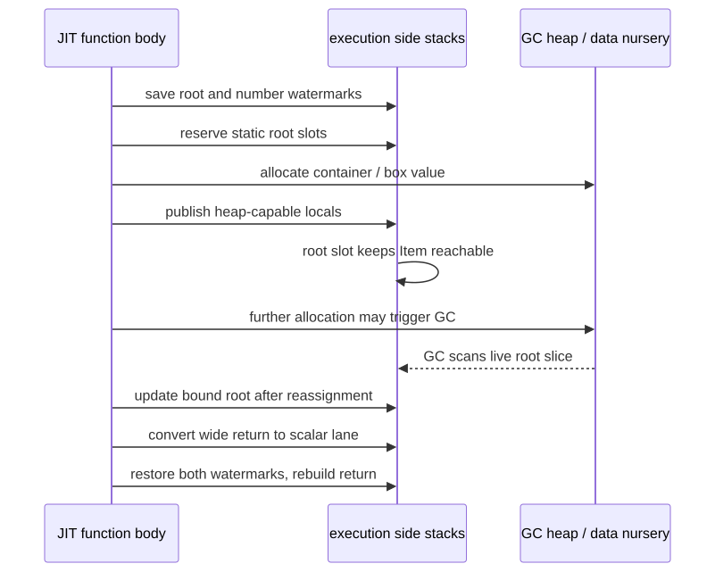

# Lambda Runtime — The MIR Direct Transpiler & JIT

> **Part of the [Lambda core-runtime detailed-design set](LR_00_Overview.md).** This document covers the supported code-generation backend: how the typed AST is lowered **directly to MIR IR** (no intermediate C text), how values are kept native or boxed under MIR's immutable-register constraint, the function calling convention and parameter-type inference, the root/number execution side frames, and the `mir.c` JIT integration that links and generates native code. The removed C-text backend is documented historically in [LR_06 — The C Transpiler](LR_06_C_Transpiler.md).
>
> **Primary sources:** `lambda/transpile-mir.cpp` (the `MirTranspiler`, all node lowerings, boxing, rooting, inference), `lambda/mir.c` (import resolution, `jit_init`/`jit_gen_func`, BSS root registration, debug table), `lambda/transpile_shared.cpp` (shared naming/wrapper helpers), `lambda/lambda.h` (the runtime C-API the generated code calls).
> **Audience:** engine developers. **Convention:** `file:line` references drift; confirm against the cited symbol names. This is the most workaround-dense area of the runtime; its issue list is correspondingly long and is part of the design record, not an afterthought — it now lives in the [central issue ledger](../../../vibe/Lambda_Issue_Ledger.md) as LR07-1 – LR07-14.

---

## 1. Purpose & scope

Lambda is **JIT-only** — there is no tree-walking interpreter. Supported builds lower the AST straight to [MIR](https://github.com/vnmakarov/mir) intermediate representation and hand it to the MIR generator. The old Lambda-side C2MIR sources have been removed; the vendored MIR dependency remains unchanged.

This doc owns the AST → MIR lowering and the JIT mechanics. The *value representation* the generated code manipulates is owned by [LR_03 — Value & Type Model](LR_03_Value_and_Type_Model.md); the *memory and GC* the rooting machinery protects is owned by [LR_08 — Memory Management & Garbage Collection](LR_08_Memory_and_GC.md); the *runtime functions* the generated code calls (`fn_*`, `array_*`, `push_*`) are owned by [LR_09 — Runtime Builtins](LR_09_Runtime_Builtins.md); the *AST* it consumes is produced by [LR_02 — Parsing & AST Construction](LR_02_Parsing_AST.md).

## 2. The `MirTranspiler` and its state

`MirTranspiler` (`transpile-mir.cpp:122`) is the per-compilation state. It holds the MIR context, module, and current function; several hashmaps (`import_cache`, `local_funcs`, `global_vars`, `native_func_info`, `infer_cache`); a 64-deep `var_scopes[]` array of per-scope variable hashmaps with a `scope_depth`; a 32-deep `loop_stack[]`; register and label counters; a set of pinned registers established in the function prologue (`rt_reg`, `gc_reg`, `consts_reg`, `type_list_reg`); per-module BSS handles (`consts_bss`, `type_list_bss`); the JIT-root cursor `jit_root_next`; and a bag of context flags that steer lowering (`in_user_func`, `in_proc`, `in_pipe`, `in_view_*`, `block_returned`, `native_return_tid`, the `tco_*` set, `current_closure`/`env_reg`, `method_owner`/`self_reg`).

Per-variable state is a `MirVarEntry` (`:105`): `{ reg, root_slot, mir_type, type_id, elem_type, env_offset, is_state_var, state_name_ptr }`. Variables are bound with `set_var` (`:458`) and resolved with `find_var` (`:496`), against the scope stack pushed/popped at `:445`/`:451`. Module-level (global) variables are BSS-backed instead of register-backed: `GlobalVarEntry` (`:288`), accessed via `load_global_var`/`store_global_var` (`:1217`/`:1238`), and created up front by `prepass_create_global_vars` (`:11448`).

---

## 3. Lowering: dispatch and representative nodes

The central dispatch is `transpile_expr` (`:8450`), a switch on `node->node_type`. The principal node lowerings are `transpile_primary` (`:1643`), `transpile_ident` (`:1758`), `transpile_binary` (`:2332`), `transpile_unary` (`:2889`), `transpile_spread` (`:2961`), `transpile_match` (`:3205`), the loop forms `transpile_for`/`transpile_while`, the collection builders `transpile_array`/`list`/`content`/`map`/`element` (`:4046`/`:4298`/`:4457`/`:4647`/`:5004`), `transpile_member`/`index` (`:5375`/`:5467`), `transpile_call` (`:6441`), `transpile_pipe` (`:7484`), `transpile_raise` (`:7805`), and the statement forms `transpile_assign_stam` (`:7926`) and `transpile_let_stam` (`:3670`).

A recurring subtlety: **statements have no value**, but every `transpile_expr` call must yield a valid MIR register. `let`/`var`/assignment/index-assignment/`break`/`continue` therefore synthesize a boxed-null register via `emit_null_item_reg` (`:348`) — the `MIR_T_I64` null moves at `:8504` — rather than returning the invalid sentinel register 0, which would crash the MIR generator with "undeclared reg 0".

---

## 4. Registers, types, and the boxing strategy

MIR registers are only `I64` or `D` (double): `type_to_mir` (`:310`) collapses pointer and float-of-other-width to `I64`, and `reg_type` (`:322`) does the same. **A register's type is immutable once declared** — this single constraint shapes the entire backend. Consequently every value in flight is either a *raw native* (an `I64` or `D`) or a *boxed `Item`* (always `I64`), and the transpiler must track which is which for every register.

The authoritative type oracle is `get_effective_type` (`:2070`). It deliberately **distrusts the AST's static type** in the cases where the AST is known to be stale: for identifiers it consults the live `MirVarEntry::type_id` rather than the AST node; it forces a `MATCH_EXPR` result to `ANY` (so it is always boxed); it forces a call returning NULL to `ANY` (so the result is rooted); and it resolves typed-array element types through `elem_type`.

Boxing is inline for cheap tags and a runtime call for the rest. `emit_box` (`:1058`) dispatches by `TypeId`:

- `emit_box_int` (`:829`) — inline INT53 range-check and tag, `ITEM_ERROR` on overflow.
- `emit_box_bool` (`:885`) — `UEXT8` to clear garbage upper bits, error-check, tag.
- `emit_box_float` routes through canonical `push_d`; `emit_box_int64` and the `uint64` sibling use the shared full-domain number-home boxers.
- String/symbol/decimal/binary boxing tags their owned pointers. Datetime boxing calls `push_k`, which creates a GC-owned object rather than a number home.
- `emit_box_container` (`:1011`) — an identity move; the `TypeId` is already in the object header.

Unboxing is the mirror: `emit_unbox` (`:1114`) emits `it2i`/`it2d`/`it2b`/`it2s`/`it2l` runtime calls, or `emit_unbox_container` (`:1096`, an AND-mask to strip the tag). Tying it together is `transpile_box_item` (`:8074`), the **smart gateway**: given a node, it decides whether `transpile_expr` already returned a boxed Item (return it unchanged) or a native value (box it), via a per-operator decision tree (`:8190`) that must *exactly mirror* the producer logic in `transpile_binary`/`transpile_unary`. Any divergence between producer and gateway is a latent double-box or type-confusion bug.

---

## 5. Functions, calls, and parameter inference

A user function is built by `transpile_func_def`: it creates the MIR function, loads the per-module `consts`/`type_list`/`gc` handles from BSS into pinned registers, brackets the body with a root/number side frame (§6), sets up the parameter scope, and handles closure environments (`env_reg`), methods (`self_reg`), proc multi-value returns, the native return type, and tail-call optimization.

Calls split by kind. A direct call to a known local or imported function is a `MIR_new_call_insn` against that MIR func item; functions with typed parameters or a native return get a `_w`/`_b` wrapper, decided by `needs_fn_call_wrapper` (`transpile_shared.cpp:39`). Indirect and closure calls go through the runtime `fn_call0_into`..`fn_call3_into` family for 0–3 arguments and `fn_call_into` for any higher arity (`:18132`ff); each argument is boxed and rooted through `create_gc_root_slot` before the call. The historical three-argument cap is retired ([LR07-R1](../../../vibe/Lambda_Issue_Ledger.md)).

**Parameter-type inference** lets untyped functions still compile to native arithmetic. `infer_param_type` gathers evidence and resolves it through the inference cache. The policy is deliberately conservative: a prior speculative-INT guess truncated float arguments at the call boundary, so weak arithmetic evidence stays `ANY`/boxed. The current rule treats every `OPERATOR_DIV` use as positive FLOAT evidence; that is stale because only int/float-domain true division is float, while `integer`/full-width sized division is decimal. `Lambda_Impl_Numbers.md` requires inference to consume the shared numeric-domain result classifier. The existing fixed parameter-count caps remain a separate known issue.

---

## 6. Precise roots and scoped numbers: execution side stacks

Because generated code allocates freely, every live GC-managed local must be reachable across a collection, while wide scalar temporaries need fast storage that can be reclaimed at return. Every context therefore owns two separate stable virtual regions: a precise Item root stack and a raw 64-bit number stack. Every Lambda MIR-Direct and LambdaJS function saves both watermarks and restores them through one epilogue.

- Root-slot counts are lowering-time facts. The prologue calls `lambda_side_stack_ensure`, saves `side_root_top`/`side_number_top`, and bumps the root top once; rooted assignments are inline frame-relative stores.
- Heap/pointer/ANY locals get root slots. Reassignment refreshes the slot, and helper-call boundaries publish all live values before the call. The collector scans only `[side_root_base, side_root_top)`.
- Full-width `INT64`/`UINT64` and out-of-band `FLOAT` payloads use `[side_number_base, side_number_top)`. Generated Item returns copy into a caller-donated canonical home before restoring the complete callee watermark; containers and closure environments own analogous scalar tails. `DTIME` is owner-backed and never enters this number extent: dynamic values are GC-owned and static Mark values are Input-arena-owned.
- All generated returns branch to one epilogue, including error, generator/async suspension, handler, and TCO-controlled paths. Batch crash-recovery boundaries restore an outer side-stack snapshot because a signal `longjmp` bypasses normal generated epilogues.
- Module-level BSS globals cannot use a per-call frame, so `register_bss_gc_roots` still registers them after linking.

The two transpilers emit through `mir_emitter_shared.hpp`; the old heap `JitGcRootFrame` block/cache machinery has no users and is deleted. Static frame telemetry is available through `LAMBDA_MIR_LOG_FRAME_SLOTS`. Runtime details are in [LR_08](LR_08_Memory_and_GC.md).

---

## 7. `mir.c` — JIT integration

`mir.c` (523 lines) is the thin C layer between the transpiler's MIR module and executable native code:

- **Import resolution (O(1)).** `init_func_map` (`:50`) builds a hashmap from the `sys_func_defs[]` table (each entry's `c_func`/`native_func`) and the `jit_runtime_imports[]` list. `import_resolver` (`:106`) consults a thread-local `dynamic_import_map` first (cross-module functions and variables, registered by `register_dynamic_import`, `:91`) and then the static map; a miss logs `failed to resolve native fn/pn`.
- **Init / teardown.** `jit_init` (`:128`) builds the map, calls `MIR_init`, then `MIR_gen_init` and sets the optimization level. The environment variable `JS_MIR_INTERP=1` or CLI `--mir-interp` selects the MIR *interpreter* instead of JIT-generating native code. Lambda follows LambdaJS's automatic selection policy as well: at O0, source at least `LAMBDA_JS_LARGE_INTERP_BYTES` (default 15000 bytes) starts in interpreter mode; after lowering, modules over 100000 executable MIR instructions use the interpreter, and document-context modules over 20000 instructions (or forced document mode) do too. `LAMBDA_JS_LARGE_INTERP=0` disables those automatic choices; an oversized module then retains native execution at optimization level 0. This preserves the single MIR Direct/interpreter execution model required by D8.1.1 while avoiding eager code generation for cold modules. `jit_cleanup` (`:345`) tears it down using the mode recorded at context initialization.
- **Codegen.** `jit_gen_func` (`:252`) loads each module, calls `MIR_link(ctx, MIR_set_gen_interface, import_resolver)` to bind imports, and runs `MIR_gen` on the target function to produce native code.
- **Symbol lookup & debug.** `find_func`/`find_func_prefix`/`find_import`/`find_data` (`:294`–`327`) locate generated symbols; `build_debug_info_table` (`:420`) collects function addresses, sorts them, and derives end addresses for native-stack symbolication (used by the error/stack-trace machinery in [LR_10](LR_10_Error_Handling.md)).

There is no Lambda-side C2MIR entry point and no supported build defines `LAMBDA_C2MIR`.

---

## 8. Level 1 module cache

MIR Direct has a process-local Level 1 module cache for long-lived `Runtime` instances, primarily `lambda.exe test-batch`. Main scripts are still compiled per batch entry, but cacheable Lambda imports retain their `Script`, AST pool, type list, MIR context, generated `main_func`, and direct-import list across per-script heap resets. On a later import of the same canonical file path, `load_script` returns the retained script instead of parsing, AST-building, lowering, linking, and generating it again.

The cache is intentionally narrow: it applies only to MIR Direct Lambda imports. JS and cross-language-tainted module subtrees are not retained. Runtime heap state is not retained; before each module init, module-level BSS globals are zeroed and registered as GC roots so cached code recomputes heap-backed values for the current script run. Execution uses the current main script's direct-import cone, not the whole registry, so unrelated cached modules are neither rooted nor initialized.

Invalidation is mtime/size based. A file-backed cache hit stats the canonical path; if the source changed, the stale script and retained dependents are retired from the index and the current load falls through to a fresh compile. The cache is enabled by default in both debug and release builds (`LAMBDA_MIR_CACHE_DEFAULT=1` unless a build opts out). `LAMBDA_DISABLE_MIR_CACHE=1` disables retained import caching for timing comparisons while keeping normal import deduplication and circular-import detection within a single compilation.

Design and rollout details live in [Level 1 MIR Cache — Implementation Plan](../../../vibe/impl/Lambda_Impl_MIR_Cache_L1.md).

---

## 9. Naming & the shared helpers

`transpile_shared.cpp` provides generated-identifier naming and wrapper predicates used by MIR Direct: `write_var_name` (the `_`-prefix for user variables), `write_fn_name_ex`/`write_fn_name` (name + `ts_node_start_byte` offset for uniqueness, with an `m<index>.` prefix for imported functions), plus `has_typed_params` and `needs_fn_call_wrapper`. The active backend also shares the `sys_func_defs[]` table, runtime function set, and `mir.c` import resolver.

---

## Known Issues & Future Improvements

Moved to the central ledger: **[Lambda Core Runtime — Central Issue Ledger](../../../vibe/Lambda_Issue_Ledger.md)**, entries **LR07-1 – LR07-14** (open/partial) and **LR07-R1 – LR07-R2** (resolved, Appendix A).

The ledger carries the verification status of each entry (OPEN / PARTIAL / RESOLVED) against the current source, re-resolved `file:line` anchors, and the cross-cutting clusters that group issues shared with other `LR_*` areas.

---
## Appendix A — Source map

| File | Responsibility (this doc) |
|---|---|
| `lambda/transpile-mir.cpp` | The `MirTranspiler`, all AST→MIR node lowerings, inline boxing/unboxing, `get_effective_type`, function/closure/method emission, parameter inference, side-frame emission, TCO. |
| `lambda/mir.c` | JIT integration: import-resolver hashmap, `jit_init`/`jit_gen_func`/`jit_cleanup`, symbol lookup, `register_bss_gc_roots`, `build_debug_info_table`, interpreter-mode switch. |
| `lambda/transpile_shared.cpp` | Generated-identifier naming and call-wrapper helpers used by MIR Direct. |
| `lambda/lambda.h` | The runtime C-API surface (`fn_*`, `array_*`, `push_*`, `it2*`) that generated MIR code imports and calls. |

## Appendix B — Related documents

- [LR_06 — The C Transpiler](LR_06_C_Transpiler.md) — historical design record for the removed C-text backend.
- [LR_03 — Value & Type Model](LR_03_Value_and_Type_Model.md) — the tagged `Item` representation and boxing macros the lowering manipulates.
- [LR_08 — Memory Management & Garbage Collection](LR_08_Memory_and_GC.md) — the non-moving collector and execution side-stack runtime the JIT feeds.
- [LR_09 — Runtime Builtins & System Functions](LR_09_Runtime_Builtins.md) — the `sys_func_defs[]` table and runtime functions resolved by `mir.c`.
- [LR_01 — Compilation Pipeline, CLI & REPL](LR_01_Compilation_Pipeline.md) — how `compile_script_as_mir_direct` and `run_script_mir` fit into the end-to-end run.
- [LR_02 — Parsing & AST Construction](LR_02_Parsing_AST.md) — the typed AST and its (sometimes stale) `Type*` annotations that `get_effective_type` second-guesses.
