# Lambda Runtime — Memory Management & Garbage Collection

> **Part of the [Lambda core-runtime detailed-design set](LR_00_Overview.md).** This document covers how the runtime allocates and reclaims memory: the dual-zone non-moving mark-and-sweep collector in `lib/gc/`, the glue in `lambda-mem.cpp` that drives it, the root set (registered slots, root ranges, per-call JIT root frames, and a conservative C-stack scan), the precise per-`TypeId` heap tracing, the two distinct "nurseries" (a *collected* data nursery and a *never-collected* numeric-temporary nursery), the three-tier string allocation strategy, the name- and shape-interning pools, the memory-context registry, and the signal-based C-stack-overflow guard.
>
> **Primary sources:** `lib/gc/gc_heap.c`/`.h` (the collector engine: collect, mark, compact, sweep, allocators, root registries), `lib/gc/gc_object_zone.h` (the non-moving size-class allocator), `lib/gc/gc_nursery.c`/`.h` (the numeric-temporary bump pool), `lambda/lambda-mem.cpp` (allocation entry points, `heap_gc_collect`, JIT root-frame stack, numeric boxing), `lambda/name_pool.cpp`/`.hpp` (identifier interning), `lambda/shape_pool.cpp`/`.hpp` (map/element shape dedup), `lambda/mem_factory_rt.cpp`/`.h` (allocator registry), `lambda/lambda-stack.cpp`/`.h` (stack-overflow guard), `lib/mempool.h` (backing `Pool`/`Arena`).
> **Audience:** engine developers. **Convention:** `file:line` references drift; confirm against the cited symbol names. The collector itself is in `lib/gc/` — `lambda-mem.cpp` is *glue*, not the engine.

---

## 1. Purpose & scope

Every GC-managed Lambda value — strings, containers, boxed numerics, shapes — is backed by one of a small set of memory regions, and this document is the map of those regions and the collector that reclaims them. The *value representation* that lives in this memory (the tagged `Item`, the `Container` struct family) is owned by [LR_03 — Value & Type Model](LR_03_Value_and_Type_Model.md); the *string and vector machinery* allocated here is owned by [LR_05 — Strings, Symbols & Vectors](LR_05_Strings_and_Vectors.md); the *emission* of the GC-rooting calls in JIT'd code is owned by [LR_07 — The MIR Direct Transpiler & JIT](LR_07_MIR_Transpiler_JIT.md), which this document is the runtime counterpart to.

One structural fact frames everything: the collector is **non-moving for objects but moving for data buffers**. Tagged `Item` pointers must stay stable, so the fixed-size structs they point at never move; the variable-size buffers those structs *own* carry no external aliases, so they are copy-compacted on every cycle. This split is the central design idea, and most of the machinery below exists to serve it.

---

## 2. The collector: dual-zone non-moving mark-and-sweep

The header (`gc_heap.h:7`) names the design "Phase 5 Architecture: Dual-Zone Non-Moving Mark-and-Sweep". It is single-threaded, conservative on the C stack, precise on the heap, and reclaims via mark-and-sweep — with a semispace-style copy compaction of one zone bolted on. Generation tag bits exist (`GC_GEN_NURSERY`/`GC_GEN_TENURED`, `gc_heap.h:37`–`38`), but the collector is effectively single-generation over the `all_objects` list; "tenuring" applies only to *data buffers* (copied nursery→tenured), never to objects.

The state lives in `gc_heap_t` (`gc_heap.h:138`): the `all_objects` intrusive list (newest-first), the `bump_cursor`/`bump_end`/`bump_blocks`, the `object_zone`, the `data_zone` and `tenured_data` instances, the `mark_stack`, the `root_slots[]`/`root_ranges[]`/`large_objects[]` registries, the `gc_threshold`, the `collecting` re-entrancy guard, the VMap/error trace and destroy callbacks, and a `mem_node` for the memory-context registry (§7). The wrapping `Heap` struct holds this `gc_heap_t*`, a `pool` alias, and the `result_root`.

Each GC allocation is prefixed by a 16-byte `gc_header_t` (`gc_heap.h:50`–`56`): `next`, `type_tag` (the `TypeId`), `gc_flags`, `marked`, and `alloc_size`; the user pointer is `header + 1`, recovered by `gc_get_header` (`gc_heap.h:378`). Arena, name-pool, and const-pool pointers carry *no* header and are invisible to the collector (`gc_is_managed`, `gc_heap.c:622`).

Objects live in one of four sub-regions, but all are reclaimed by one collector:

- **Object zone** (`gc_object_zone`) — fixed-size structs (String, Map, Array, Element, Function, boxed numerics) allocated from per-class free lists across 7 size classes (16/32/48/64/96/128/256 B, `gc_object_zone.h:16`,`42`). These are **never moved**, so the tagged `Item` pointers that reference them stay stable; sweep returns dead slots to the per-class free lists, and a sorted range table gives O(log n) ownership lookup.
- **Bump region** (`gc_heap_bump_alloc`, `gc_heap.c:521`) — the JIT hot path: 4 MB→64 MB doubling blocks (`GC_BUMP_BLOCK_INITIAL_SIZE`/`MAX_SIZE`, `gc_heap.h:135`–`136`). Objects are flagged `GC_FLAG_BUMP` (`gc_heap.h:34`); their block memory is pool-owned and reclaimed only at teardown, but dead slots are recycled through free lists on the next `bump_alloc`.
- **Large objects** (>256 B) — `malloc`'d, flagged `GC_FLAG_LARGE` (`gc_heap.h:33`), tracked in a sorted `large_objects[]` array for binary-search ownership (`gc_heap.c:75`–`131`).
- **Data zone** (variable buffers: `items[]`, map `data`, `closure_env`) — a nursery `gc_data_zone_t` plus a `tenured_data` instance, both bump-allocated in 4 MB blocks. This is the *moving* zone (§4).

`item_to_ptr` (`gc_heap.c:770`) decodes a tagged `Item` to a candidate heap pointer; `gc_is_managed` decides whether that pointer is one the collector owns. The whole scheme rests on the high-byte-zero pointer assumption shared with the value model ([LR_03](LR_03_Value_and_Type_Model.md) §2).

---

## 3. `lambda-mem.cpp` — the glue, not the engine

`lambda-mem.cpp` is the runtime-facing layer that wires `lib/gc/` into the Lambda heap. It owns the allocation entry points the rest of the runtime and the JIT call: `heap_alloc`/`heap_calloc`/`heap_calloc_class` (object-zone and bump allocations, with `heap_calloc_class` taking a compile-time size class so the JIT skips class lookup) and `heap_data_alloc` (data-zone buffers). `heap_calloc` stamps `is_heap` on containers but deliberately skips `LMD_TYPE_FUNC`/`TYPE` because their byte-1 layout differs (`lambda-mem.cpp:469`).

It owns the **GC driver** `heap_gc_collect` (`lambda-mem.cpp:259`), the callback `gc_data_alloc` invokes when the data zone crosses its threshold. The driver does the work the engine cannot do from inside `lib/gc/`: it issues a `setjmp` to flush callee-saved registers onto the C stack so the conservative scan can see register-resident roots, reads the stack bounds from `_lambda_stack_base` (`:270`, shared with the stack guard, §8), registers the active JIT root frames (`:284`–`287`), and then calls `gc_collect`.

It owns the **JIT GC-root frame stack** (`lambda-mem.cpp:22`–`444`) and the root-registration wrappers around `gc_register_root`/`gc_register_root_range` (§5–§6). It owns **numeric boxing** — `push_l`/`push_d`/`push_k` and their `_safe` double-box-guarding variants (`lambda-mem.cpp:574`–`663`) — which allocate from the numeric nursery (§4), and the interned single-char ASCII table `ascii_char_table` (`:184`). Finally it owns teardown finalization: `gc_finalize_all_objects` (`:708`) walks every surviving object and runs external finalizers at context end.

Several exported symbols here are **dead stubs** kept only for API compatibility — `free_item`, `free_container`, `frame_start`, `frame_end` (`lambda-mem.cpp:759`–`776`) are no-ops; all reclamation is mark-and-sweep or teardown, not per-frame.

---

## 4. The two nurseries — a critical distinction

The word "nursery" names two unrelated regions with opposite collection semantics, and confusing them is the single most common error in reasoning about this runtime.

**The data nursery** is part of the GC data zone (`gc_data_zone_t`, `lib/gc/gc_data_zone.c`). It holds variable-size buffers — array `items[]`, map `data`, closure environments. It **is collected**: on each cycle, `gc_compact_data` (`gc_heap.c:1217`) copies the buffers of surviving objects from the nursery into the `tenured_data` zone and rewrites each owning object's data pointer to the new location (embedded inline numerics inside `items[]` are rebased by `gc_fixup_embedded_pointers`, `gc_heap.c:1187`); then `gc_data_zone_reset` (`gc_heap.c:1689`) resets the nursery wholesale. This is what makes the collector "moving for data": the buffers move, but the objects that own them do not.

**The numeric-temporary nursery** is `gc_nursery` (`lib/gc/gc_nursery.c`/`.h`), a bump allocator for *boxed numeric temporaries* — int64, double, DateTime produced by `push_l`/`push_d`/`push_k`. It is malloc-backed (32 KB blocks, `gc_nursery.h:17`) and **never collected**: `gc_nursery_alloc_slot` only ever appends blocks, nothing resets `used`, and the header states it plainly — "Values allocated from the nursery persist until nursery_destroy() — no frame-based reset" (`gc_nursery.h:15`). Every boxed numeric temporary lives until `gc_nursery_destroy` at context teardown (`runner.cpp:1537`). This region is the closest thing in the runtime to a structural leak (§9), and its name is misleading: it is not generationally collected at all. The rationale is that numeric temporaries are transient and abundant, so a per-value GC header would be wasteful — but the trade-off is unbounded growth within a single long-running context.

The boxing entry points that feed this region — `push_l`/`push_d`/`push_k` and the `push_*_safe` guards that undo JIT double-boxing — are described from the value-model side in [LR_03](LR_03_Value_and_Type_Model.md) §3.

---

## 5. The collection cycle

A cycle is **triggered** from `gc_data_alloc` (`gc_heap.c:601`) when nursery data-zone usage reaches `gc_threshold` (default `GC_DATA_ZONE_THRESHOLD`, 75% of a 4 MB block, `gc_heap.h:101`) and `gc->collecting` is clear. Object-zone-only or bump-only allocation (no data-zone use) does **not** trigger a collection — only data-zone pressure does. The callback path runs through `heap_gc_collect` (§3) into `gc_collect` (`gc_heap.c:1595`), which sets `gc->collecting` to guard re-entrancy.

**Mark.** Roots are gathered (§6), then `gc_mark_item` pushes each onto the `mark_stack` and `gc_trace_object` (`gc_heap.c:888`) traces the graph. Tracing is **precise per `TypeId`**: it walks Array/Element `items[]`, follows Map/Element shape chains, reads the `Function` `closure_env`, and traces a `VMap` through the registered callback — falling back to a conservative `gc_trace_data_words` scan over the whole data buffer for anything it cannot decode structurally. The per-type walks read struct fields at **hard-coded byte offsets** (Array items @+8, Map data @+16, Element data @+48, ShapeEntry walk, `gc_heap.c:929`–`1145`), which is fast but layout-fragile (§9).

**Compact.** `gc_compact_data` copies live data buffers nursery→tenured and rewrites owner pointers (§4), then resets the nursery.

**Sweep.** `gc_sweep` (`gc_heap.c:1423`) walks `all_objects`: it finalizes dead externals via `gc_finalize_dead_object` (`gc_heap.c:1383`), unlinks dead nodes, returns object-zone slots to their free lists, frees large objects, unlinks bump objects, and clears `marked` on the survivors.

**Adapt.** After sweeping, an **adaptive threshold** (`gc_heap.c:1695`–`1720`) tunes future cycles: if the cycle freed <40% it grows the threshold 4×, <75% grows it 2×, capped at 256 MB — so unproductive collections are spread further apart rather than thrashing the cache.

---

## 6. Roots

The root set is gathered at the top of `gc_collect` from five sources:

1. **Registered root slots** — `uint64_t*` pointers to single boxed Items: BSS module-level globals (each module-level `let`) and `context->heap->result_root` (`lambda-mem.cpp:215`). Registered via `gc_register_root`.
2. **Registered root ranges** — contiguous `Item[]` arrays (JS closure environments), via `gc_register_root_range`.
3. **JIT root frames** — the per-call, heap-backed slot blocks described below, snapshotted and registered by `heap_gc_collect` (`lambda-mem.cpp:284`–`287`).
4. **Caller-supplied `extra_roots`** — passed through to `gc_collect`.
5. **Conservative C-stack scan** — `gc_scan_stack` (`gc_heap.c:1554`) reads every aligned 8-byte word from the stack pointer up to `stack_base`, interprets each through `item_to_ptr`, and marks it if it lands on a GC object (ASan-poisoned words are skipped). This is the catch-all that pairs with the `setjmp` register flush in `heap_gc_collect`.

The **JIT root frames** are the mechanism that makes register-resident heap values survivable. They form a thread-local stack of `JitGcRootFrame` (`lambda-mem.cpp:22`–`444`), each holding a chain of `JitGcRootBlock` of `JIT_GC_ROOT_BLOCK_SLOTS` (64) slots. The transpiler brackets every function body with frame enter/exit calls and publishes each rooted local into a slot, re-reading it after any collection point — the *emission* of those calls is owned by [LR_07](LR_07_MIR_Transpiler_JIT.md) §6, which also documents `should_gc_root_var` (the rule for which locals get a slot). On the runtime side, each block's `slots[]` is registered as a GC root *range* when the block is created (`jit_gc_root_frame_get_block`, `lambda-mem.cpp:336`) and unregistered on free; during a collection, `jit_gc_root_register_active_ranges`/`jit_gc_root_snapshot_active` (`:127`,`:140`) snapshot all active frames into `extra_roots`. Frames are pooled (cache up to `JIT_GC_ROOT_FRAME_CACHE_MAX` = 256, `lambda-mem.cpp:23`).

The correctness of the whole scheme hinges on *honest static typing* in the JIT: a heap Item parked in a local the transpiler believes is a packed scalar gets no root slot and can be swept while live. This is the most serious latent hazard and is detailed in §9 and in [LR_07](LR_07_MIR_Transpiler_JIT.md) §Known-Issues #9.

---

## 7. Three-tier string allocation, name pool & shape pool

Identifiers, content strings, and parser output have very different lifetimes and churn profiles, so each gets its own allocation tier — and a fourth, static tier for single-char ASCII strings.

| Tier | Entry point | Backing | Lifetime | Use |
|---|---|---|---|---|
| **Name pool (interned)** | `heap_create_name` → `name_pool_create_len` (`lambda-mem.cpp:541`, `name_pool.cpp:102`) | backing `Pool` | until pool ref-count → 0 / Pool destroy | Structural identifiers (map keys, element tags, attr names); same content ⇒ same `String*` ⇒ identity compare. |
| **GC heap** | `heap_strcpy` (`lambda-mem.cpp:524`), `heap_create_symbol` (`:556`) | object zone / large object | GC-managed (mark-sweep) | User content strings, text, symbols — each a tracked GC object. |
| **Arena** | input parsers via `MarkBuilder` / `arena_alloc` | `Arena` | until arena reset/destroy (document scope) | Parser-built doc data; ShapeEntry chains (`shape_pool.cpp:159`). Not GC-tracked, no header. |
| **Static ASCII** | `get_ascii_char_string` | `ascii_char_table` (`lambda-mem.cpp:184`) | process lifetime | 128 pre-allocated single-char `String*`, never freed. |

The rationale: structural identifiers are highly repetitive and benefit from interning plus identity comparison; user content is transient and churny, so GC suits it; parser output is bulk-freed at document scope, so an arena avoids per-object frees and keeps it out of GC pressure entirely.

**The name pool** (`name_pool.cpp`) is a hashmap keyed by `StrView` (content + length) via `HASHMAP_DEFINE_LENSTRKEY`. `name_pool_create_strview` (`name_pool.cpp:112`) checks the parent chain, then the current pool, then interns via `string_from_strview` into the backing `Pool`. Pools are **hierarchical** (parent retained on create, so a child schema/document sees the parent's interned names) and **ref-counted**: at ref-count 0 the pool releases its `mem_node`, recursively releases its parent, and frees its hashmap — but the `NamePool` struct and the interned strings themselves live in the backing `Pool` and are reclaimed only when that `Pool` is destroyed. Symbols up to `NAME_POOL_SYMBOL_LIMIT` are interned; longer ones are allocated un-interned (`name_pool.cpp:215`).

**The shape pool** (`shape_pool.cpp`) dedups map/element `ShapeEntry` chains so structurally identical maps share one shape. A `ShapeSignature` is `{hash, length, byte_size}` (`shape_pool.hpp:16`), the hash mixing field names and types (`calculate_shape_hash`, `shape_pool.cpp:51`). `shape_pool_get_map_shape`/`get_element_shape` (`:214`,`:271`) build the signature, look it up across the current and parent pools, and on a miss build a `ShapeEntry` chain from the **arena** and cache a `CachedShape` in the backing `Pool`. Dedup compares the JS property `flags` per entry (`shape_pool_shapes_equal`, `:380`); element shapes include the element name in the signature but not in the chain (the name lives in `TypeElmt.name`). Pools are hierarchical and ref-counted like the name pool. The chain length is capped at `SHAPE_POOL_MAX_CHAIN_LENGTH` = 64 fields (`shape_pool.hpp:13`) — a map/element with more than 64 fields silently returns a NULL shape after a `log_warn` (§9). The `ShapeEntry`/`TypeMap` structures these pools populate are owned by [LR_03](LR_03_Value_and_Type_Model.md) §4.

---

## 8. The memory-context registry & the stack-overflow guard

**Memory-context registry** (`mem_factory_rt.cpp`). A thin factory layer creates each runtime allocator (the gc_heap, a NamePool, a ShapePool) and registers a `MemNode` in the central `MemContext` tracking registry via `mem_register`, with the parent set to the backing pool's node, so memory usage is observable through `mem-stat`. Stat functions report bytes and object counts (`heap_stat_fn`, `name_pool_stat_fn`, `shape_pool_stat_fn`); the name/shape pools report 0 bytes (their storage is counted under the backing `Pool` node) and expose only object counts. `ensure_rt_release_hooks` lazily installs a shared `rt_release_node` hook on each allocator type so destroy/release auto-unregisters the node (for ref-counted pools, only at ref-count 0); a NULL `ctx` resolves to the process-global root context. This factory is compiled only into the main build — not the lib-only unit tests — to avoid pulling in the gc dependency chain (per the header comment); the numeric nursery is created separately via the lib-level `mem_nursery_create` (`runner.cpp:1300`), not through this registry.

**Stack-overflow guard** (`lambda-stack.cpp`). This is a C-stack guard, not a Lambda value stack, with zero per-call overhead — it relies on the OS guard page. Per-thread bounds are cached in `_lambda_stack_base`/`_limit` by `init_stack_bounds` (platform-specific: macOS `pthread_get_stackaddr_np`, Linux `pthread_getattr_np`, Windows `GetCurrentThreadStackLimits`). On macOS/Linux it installs `sigaltstack` plus a `SIGSEGV` (and Linux `SIGBUS`) handler with `SA_ONSTACK` so the handler runs on a 64 KB alternate stack even when the main stack is exhausted (`install_signal_handler`, `lambda-stack.cpp:194`). The handler `stack_overflow_signal_handler` (`:162`) disambiguates a genuine overflow from a null deref — `is_stack_overflow_fault` (`:125`) rejects fault addresses below 64 KB and checks proximity to the stack guard region — and `siglongjmp`s to `_lambda_recovery_point` *only if* `_lambda_recovery_armed` is set (otherwise it re-raises to the default handler for a clean crash, since jumping into a zero-initialized `jmp_buf` is undefined behavior). Recovery surfaces a catchable `ERR_STACK_OVERFLOW` via `lambda_stack_overflow_error` (`:323`). `LAMBDA_STACK_SAFETY_MARGIN` and `LAMBDA_ALT_STACK_SIZE` are both 64 KB. Windows uses SEH `EXCEPTION_STACK_OVERFLOW` plus `_resetstkoflw`. The same `_lambda_stack_base` is consumed by the GC stack scanner (§6). The catchable error this raises is handled by the machinery in [LR_10 — Error Handling](LR_10_Error_Handling.md).

---

## Known Issues & Future Improvements

The memory subsystem carries a set of structural risks and hard-coded caps; several are flagged in the code, others are emergent invariants discoverable only by reading it.

1. **Decimal `mpd_t` leak (in-code TODO).** `gc_finalize_dead_object` does **nothing** for `LMD_TYPE_DECIMAL` because the `mpd_t` from libmpdec cannot be freed from this C file (`gc_heap.c:1383`–`1388`): the comment says dead decimals "will have their mpd_t leaked until context end. TODO: Add a finalization callback mechanism." Mid-execution collections therefore leak `mpd_t` for every dead Decimal; the storage is reclaimed only by `gc_finalize_all_objects` at teardown (`lambda-mem.cpp:708`). This is a real per-cycle leak in decimal-heavy long-running scripts.
2. **The numeric nursery is never collected → unbounded growth.** `gc_nursery` only ever appends blocks (`gc_nursery.h:15`); every boxed int64/double/DateTime temporary lives until `gc_nursery_destroy`. A long-running script or REPL session that boxes many numerics grows this region without bound within a single context — the closest thing to a structural leak in the runtime.
3. **JIT rooting hinges on honest static types (latent use-after-free).** The collector trusts the JIT's `should_gc_root_var` decision, which trusts each local's static `type_id`. A heap Item travelling through a local whose type is statically mislabeled as a packed scalar is **not** rooted and can be swept while live — the historical DeltaBlue corruption. There is no runtime assertion guarding this; any future inference hole reintroduces the UAF. Cross-link: [LR_07](LR_07_MIR_Transpiler_JIT.md) §Known-Issues #9.
4. **`should_gc_root_var` excluding `LMD_TYPE_FLOAT` is safe *only* because the numeric nursery is never collected.** Boxed floats are nursery pointers (`push_d`), yet the JIT does not root float locals. A swept-float UAF cannot happen today solely because nursery slots are never reclaimed (#2). This is an implicit, undocumented coupling: making the nursery collectable would turn every unrooted float (and nursery-resident int64) local into a use-after-free.
5. **Conservative stack scan over-retains.** Any stack word that happens to look like a tagged `Item` pins an object (false roots → delayed collection). Under-retention is avoided only because objects are non-moving *and* the `setjmp` register flush plus the JIT frames cover live pointers — a value held only in a callee-saved register that the compiler fails to spill, and not in a root frame, would still be missed; the `setjmp` is the mitigation but relies on the compiler spilling.
6. **Hard-coded struct byte offsets in tracing/compaction.** `gc_trace_object` and `gc_compact_data` read fields at fixed offsets (Array items @+8, Map data @+16, Element data @+48, ShapeEntry walk, `gc_heap.c:929`–`1145`,`1233`–`1366`). Any change to `Container`/`Map`/`Element`/`TypeMap`/`ShapeEntry`/`Function` layout silently corrupts tracing or compaction; the `TypeId` enum aliasing defends the *enum values* but not the *offsets*. `item_to_ptr` (`gc_heap.c:770`) likewise assumes high-byte-zero heap pointers, a documented-but-unenforced platform assumption.
7. **`SHAPE_POOL_MAX_CHAIN_LENGTH` = 64 silently returns NULL.** Maps/elements with more than 64 fields get no pooled shape (`shape_pool.cpp:220`,`:285`) — only a `log_warn`, with a possible NULL-deref downstream depending on caller handling.
8. **JIT root-frame caps and recursion growth.** `JIT_GC_ROOT_BLOCK_SLOTS` = 64 and `JIT_GC_ROOT_FRAME_CACHE_MAX` = 256 (`lambda-mem.cpp:22`–`23`). The cache cap is benign (excess frames are freed), but deep recursion still allocates one frame plus N/64 blocks per live frame on the heap — the exact mechanism that hung the StackOverflow test before the rooting fix; it is now bounded only by the C-stack guard firing first.
9. **Dead stubs.** `free_item`, `free_container`, `frame_start`, `frame_end` (`lambda-mem.cpp:759`–`776`) are no-op API-compat relics — harmless but dead code.
10. **Re-entrant allocation during GC silently skips collection.** `gc_collect` guards with `gc->collecting`, and `gc_data_alloc` checks `!gc->collecting` before triggering, so an allocation made *during* tracing or finalize callbacks (vmap_trace, error_trace) that hits the data zone simply skips collecting rather than asserting. Acceptable, but unguarded against pathological growth inside a callback.
11. **Fixed compile-time sizes.** Object size classes 16/32/48/64/96/128/256 B with a `malloc` large-object path above (`gc_object_zone.h:42`); data-zone blocks 4 MB; bump blocks 4 MB→64 MB; numeric-nursery blocks 32 KB; adaptive-threshold cap 256 MB. All are compile-time, none configurable at runtime.

---

## Appendix A — Source map

| File | Responsibility (this doc) |
|---|---|
| `lib/gc/gc_heap.c` / `.h` | The collector engine: `gc_collect`, mark (`gc_mark_item`/`gc_trace_object`/`gc_scan_stack`), compact (`gc_compact_data`), sweep (`gc_sweep`), allocators (`gc_heap_alloc`/`gc_heap_bump_alloc`/`gc_data_alloc`), root slot/range registries, adaptive threshold, finalization. |
| `lib/gc/gc_object_zone.h` | Non-moving size-class free-list allocator for fixed object structs; sorted range table for ownership. |
| `lib/gc/gc_data_zone.h` | Bump allocator for variable-size data buffers; nursery + tenured instances, reset/compact. |
| `lib/gc/gc_nursery.c` / `.h` | Bump allocator for boxed numeric temporaries (int64/double/DateTime) — malloc-backed, never collected. |
| `lambda/lambda-mem.cpp` | Allocation entry points, `heap_gc_collect` driver, JIT GC-root-frame stack, root-registration wrappers, numeric boxing (`push_l/d/k` + `_safe`), teardown finalization, ASCII char table, dead stubs. |
| `lambda/name_pool.cpp` / `.hpp` | StrView-keyed, parent-chained, ref-counted identifier interning. |
| `lambda/shape_pool.cpp` / `.hpp` | `ShapeSignature`-keyed `ShapeEntry`-chain dedup; arena-built chains; 64-field cap. |
| `lambda/mem_factory_rt.cpp` / `.h` | Factory that registers gc_heap / NamePool / ShapePool in the `MemContext` registry and installs release hooks. |
| `lambda/lambda-stack.cpp` / `.h` | Signal/SEH-based C-stack-overflow guard; stack bounds also feed the GC scanner. |
| `lib/mempool.h` | Backing `Pool`/`Arena` allocators used as stores by the pools and the GC blocks. |

## Appendix B — Related documents

- [LR_03 — Value & Type Model](LR_03_Value_and_Type_Model.md) — the tagged `Item`, `Container` family, and `ShapeEntry`/`TypeMap` that this memory backs.
- [LR_05 — Strings, Symbols & Vectors](LR_05_Strings_and_Vectors.md) — the `String`/`Symbol` objects and `ArrayNum` buffers allocated across these tiers.
- [LR_07 — The MIR Direct Transpiler & JIT](LR_07_MIR_Transpiler_JIT.md) — emission of the JIT root-frame calls and `should_gc_root_var`; the producer side of the rooting machinery here.
- [LR_10 — Error Handling](LR_10_Error_Handling.md) — handling of the catchable `ERR_STACK_OVERFLOW` raised by the stack guard.
- [LR_00 — Overview](LR_00_Overview.md) — the core-runtime detailed-design set index.
