# Lambda Runtime — Runtime Builtins & System Functions

> **Part of the [Lambda core-runtime detailed-design set](LR_00_Overview.md).** This document covers the runtime **support library** that JIT-produced native code calls into, and the system-function registry that wires script-level builtins to that library. It frames the central architectural fact — Lambda is **JIT-only**, with no tree-walking interpreter — and then maps the C-ABI surface: the thread-local `EvalContext`, the `fn_*` comparison/indexing/string/datetime/error helpers in `lambda-eval.cpp`, the `GUARD_ERROR*` error-propagation discipline, and the static `sys_func_defs[]` table that serves simultaneously as AST metadata and as the JIT import map.
>
> **Primary sources:** `lambda/lambda-eval.cpp` (the `fn_*` runtime support library: comparison, indexing/member access, `fn_len`, string ops, datetime constructors, `fn_call`/`fn_input`, `fn_error`/`set_runtime_error`), `lambda/sys_func_registry.c` + `lambda/sys_func_registry.h` (the `SysFuncInfo` struct and the `sys_func_defs[]`/`jit_runtime_imports[]` tables), `lambda/lambda-data.hpp` (`EvalContext`), `lambda/lambda.hpp` (`GUARD_ERROR*`), `lambda/build_ast.cpp` (registry consumption at AST-build time), `lambda/mir.c` (registry consumption at JIT time), `lambda/lambda-proc.cpp` (procedural `pn_*` I/O builtins, owned in detail by LR_12).
> **Audience:** engine developers. **Convention:** `file:line` references drift; confirm against the cited symbol names.

---

## 1. Purpose & scope

This document owns the *runtime builtin library* and the *system-function registry*. The library is the set of C functions that JIT-generated native code calls to do the work that cannot be inlined as MIR instructions: structural comparison, container indexing, string manipulation, datetime construction, and error raising. The registry is the single static table that lets a script identifier like `len` or `math_sqrt` reach the right C function at both compile time and run time.

One architectural fact frames everything: **Lambda is JIT-only — there is no tree-walking interpreter.** Every script is transpiled to MIR ([LR_07 — The MIR Direct Transpiler & JIT](LR_07_MIR_Transpiler_JIT.md)) and JIT-compiled; the generated native code makes direct calls into the `fn_*`/`pn_*` runtime builtins. Despite its name, `lambda-eval.cpp` is **not** an evaluator that walks the AST at run time — it is the C-ABI support library the JIT calls into. The only `eval_*`-named symbol in the file is the context accessor `eval_context_get_pool` (`lambda-eval.cpp:48`); the AST traversal that *does* drive lowering (`build_expr`/`transpile_expr`) runs at compile time and is owned by [LR_02 — Parsing & AST Construction](LR_02_Parsing_AST.md) and [LR_07](LR_07_MIR_Transpiler_JIT.md), not here.

What is *not* owned here: the numeric tower (`fn_add`/`fn_div`/promotion) lives in `lambda-eval-num.cpp` and is owned by [LR_04 — Numbers, Decimal & DateTime](LR_04_Numbers_Decimal_DateTime.md); the string/vector *operation semantics* (UTF-8 normalization, `ArrayNum` SIMD kernels) are owned by [LR_05 — Strings, Symbols & Vectors](LR_05_Strings_and_Vectors.md); the value representation the builtins manipulate is owned by [LR_03 — Value & Type Model](LR_03_Value_and_Type_Model.md); the error *model* (`LambdaError`, codes, `?`/`^err`) is owned by [LR_10 — Error Handling](LR_10_Error_Handling.md); the procedural `pn_*` runtime is owned by [LR_12 — Procedural Runtime](LR_12_Procedural_Runtime.md). This doc covers the *surface* these depend on and the registry that unifies them.

---

## 2. `EvalContext` — the thread-local runtime state

Every runtime builtin reaches its allocators, its GC heap, and its error slot through a single thread-local pointer: `extern __thread EvalContext* context` (`lambda-eval.cpp:33`; the numeric and other sibling TUs declare the same `__thread` symbol). There is no context argument threaded through the `fn_*` signatures — the builtins are pure C-ABI functions of their `Item` arguments, and the ambient state is the thread-local.

`EvalContext` (`lambda-data.hpp:77`) extends the slim `struct Context` (`lambda.h:1177`, which carries `pool`, `arena`, `consts`, `type_list`, `cwd`, `stack_limit`, `ui_mode`) with the runtime-only fields:

- `Heap* heap` (`:78`) — the GC heap that backs strings, decimals, datetimes, errors, and containers; reached by the builtins via `heap_alloc`/`heap_strcpy` and by the JIT prologue via the `heap->gc` offset ([LR_07 §Known Issues #14](LR_07_MIR_Transpiler_JIT.md#known-issues--future-improvements)).
- `gc_nursery_t* nursery` (`:81`) — the bump-pointer region for numeric temporaries (`int64`, `double`, `DateTime`) into which `push_l`/`push_d`/`push_k` box; distinct from the GC data nursery ([LR_03](LR_03_Value_and_Type_Model.md), [LR_08](LR_08_Memory_and_GC.md)).
- `mpd_context_t* decimal_ctx` (`:84`) — the libmpdec context used by decimal arithmetic ([LR_04](LR_04_Numbers_Decimal_DateTime.md)).
- `void* type_info` (`:82`) and `Item result` (`:83`) — the base-type metadata and the final execution result.
- `ArrayList* debug_info` (`:88`), `const char* current_file` (`:89`), `LambdaError* last_error` (`:90`) — the error/stack-trace state. `set_runtime_error` (`lambda-eval.cpp:75`) builds a `LambdaError` against `current_file`, captures a native stack trace via `err_capture_stack_trace(context->debug_info, 32)`, frees any prior `last_error`, and stores the new one. The stack-trace machinery is detailed in [LR_10](LR_10_Error_Handling.md).
- `SchemaValidator* validator` (`:85`) — used by the validation builtins (out of scope here).

Keeping this state thread-local (rather than passing a context pointer into every builtin) keeps the `fn_*` calling convention uniform and lets the JIT emit calls without an extra register, while still supporting per-thread runtimes.

---

## 3. `lambda-eval.cpp` as the C-ABI support library

`lambda-eval.cpp` (~5400 lines) is a flat collection of `fn_*` functions, each a leaf the JIT can call. They fall into the categories below. The *semantics* of the arithmetic/string/vector ops are documented in LR_04/LR_05; this section documents the *dispatch surface* and the comparison/indexing logic that is genuinely owned here.

### 3.1 Comparison

Equality is structural and recursive. `fn_eq` (`:1266`) forwards to `fn_eq_depth` (`:1074`), which dispatches per-container to `list_eq` (`:903`), `array_num_eq` (`:915`), `map_eq` (`:939`), `element_eq` (`:988`), and `vmap_eq` (`:1015`), each recursing through `fn_eq_depth` on their elements. `fn_eq` returns a raw `Bool`, not a boxed Item, so callers (e.g. the membership scans at `:1654`–`:1736`) compare against `BOOL_TRUE` directly.

Ordered comparison has a two-tier shape. The public wrappers `fn_lt`/`fn_gt`/`fn_le`/`fn_ge` (`:1391`–`:1417`) return an **Item**: if either operand is an `ArrayNum`, they dispatch to the vectorized `vec_cmp` ([LR_05](LR_05_Strings_and_Vectors.md)) producing an element-wise boolean mask, with op codes LT=2, LE=3, GT=4, GE=5 (operator minus `OPERATOR_EQ`); otherwise they fall through to the scalar `fn_lt_scalar` (`:1279`) / `fn_gt_scalar` (`:1333`) and box the resulting `Bool`. `fn_le` is implemented as `!(a > b)` and `fn_ge` as `!(a < b)` via the scalar helpers (`:1408`, `:1415`). The scalar comparators handle numbers by promotion, datetimes via `datetime_compare`, and strings/symbols via byte-wise `strcmp` — a path that diverges from the casefold-Unicode comparators in `utf_string.cpp` ([§Known Issues](#known-issues--future-improvements), [LR_05](LR_05_Strings_and_Vectors.md)).

### 3.2 Indexing & member access

`fn_index` (`:2505`) is the unified `a[i]` entry point. It null/error-guards the container (`null[i]`/`error[i]` → `ItemNull`, `:2510`), then switches on the *index*'s type: `INT`/`INT64`/integral `FLOAT` → `item_at(item, index)` (`:2568`); `STRING`/`SYMBOL` index → `fn_member` (`:2535`); a `TYPE`-valued index → `fn_child_query` (`:2540`); a `RANGE` index → `fn_slice` with inclusive→exclusive end adjustment (`:2546`); an `ArrayNum` boolean-mask index → `fn_mask_index` (`:2554`); and a `VMap` container with an arbitrary-typed key → the vtable `get` (`:2560`). `fn_member` (`:2571`) handles `a.field` and resolves `sys.*` paths first. `fn_len` (referenced from comparison at `:311`, registered as `C_RET_INT64`) returns a raw `int64_t` length.

### 3.3 Strings, datetime, calls, errors

String builtins (`fn_substring` `:2961`, plus trim/split/replace/upper/lower/join/index_of) GC-allocate their results via `heap_strcpy`; their UTF-8/normalization semantics are owned by [LR_05](LR_05_Strings_and_Vectors.md). DateTime constructors `fn_datetime0/1` (`:4417`), `fn_date0/1/3` (`:4453`+), and `fn_time0/1/3` (`:4531`+) parse or validate into the packed 64-bit `DateTime` Item ([LR_04](LR_04_Numbers_Decimal_DateTime.md)). `fn_call` (`:534`) is the indirect/closure call dispatcher (capped at 8 args; the JIT-side closure path caps lower — [LR_07 §Known Issues #3](LR_07_MIR_Transpiler_JIT.md#known-issues--future-improvements)). `fn_error` (`:131`) raises `ERR_USER_ERROR`, sets `context->last_error`, and returns a boxed heap `LambdaError`; `set_runtime_error` (`:75`) is the internal raiser used across the library.

### 3.4 Error propagation: the `GUARD_ERROR*` discipline

Because Lambda errors are tagged `Item`s ([LR_03](LR_03_Value_and_Type_Model.md), [LR_10](LR_10_Error_Handling.md)), error propagation through the builtin library is a *convention*, not a control-flow mechanism: every `fn_*` early-returns an incoming error Item before doing any work. The primitive is the `GUARD_ERROR*` macro family (`lambda.hpp:304`–`337`): `GUARD_ERROR1/2/3` return the error Item itself when an argument's `get_type_id == LMD_TYPE_ERROR`; the return-convention variants `GUARD_ERROR_RI1/2` return `item_to_ri(a)` for `RetItem`-returning functions, `GUARD_BOOL_ERROR1/2` return `BOOL_ERROR`, and `GUARD_DATETIME_ERROR1/2/3` return `DATETIME_MAKE_ERROR()`. The variant chosen per function must match that function's C-level return convention (the `c_ret_type` recorded in the registry, §4) — a guard returning the wrong sentinel type is a latent bug. This is the runtime half of error handling; the compile-time half (`?` propagation, `^err` destructuring) lives in the transpiler and is owned by [LR_10](LR_10_Error_Handling.md).

---

## 4. The system-function registry — `sys_func_defs[]`

The bridge between a script-level builtin name and its C implementation is a **single static data table**, not a runtime-built structure. `sys_func_defs[]` (`sys_func_registry.c:265`) holds 174 entries (`sys_func_def_count`, computed from `sizeof` at `:948`), each a `SysFuncInfo`. The file's header comment (`:1`–`12`) states the design intent: it consolidates what used to be three separate tables (`sys_funcs[]` in `build_ast.cpp`, the `func_list[]` JIT pointers in `mir.c`, and the native-math optimization lists in `transpile.cpp`), so **adding a builtin now means editing only this file**.

### 4.1 The `SysFuncInfo` row

`SysFuncInfo` (`sys_func_registry.h:48`) carries, for each builtin, both the AST metadata and the JIT pointers:

- **AST metadata** — `SysFunc fn` (the enum id), `const char* name`, `int arg_count` (`-1` = variadic), `Type* return_type`, and the flags `is_proc`, `is_overloaded`, `is_method_eligible` (callable as `obj.method()`), `TypeId first_param_type`, and `can_raise` (whether the function has a `T^` error return).
- **C-level ABI** — `CRetType c_ret_type` (`sys_func_registry.h:28`: `C_RET_ITEM` default, plus `C_RET_RETITEM`, `C_RET_INT64`, `C_RET_DOUBLE`, `C_RET_BOOL`, `C_RET_STRING`, `C_RET_SYMBOL`, `C_RET_DTIME`, `C_RET_TYPE_PTR`, `C_RET_CONTAINER`) and `CArgConvention c_arg_conv` (`:42`: `C_ARG_ITEM` default, or `C_ARG_NATIVE` for the bitwise ops).
- **JIT pointers** — `const char* c_func_name` (the emitted symbol, e.g. `"fn_len"`, `"pn_print"`), the `fn_ptr func_ptr` itself, and the optional native-math-optimization quartet `native_c_name`/`native_func_ptr`/`native_returns_float`/`native_arg_count` (e.g. `math_sqrt` carries `"sqrt"`/`NPTR(sqrt)`/`true`/`1`, `:642`).

All pointers are stored through the `FPTR()`/`NPTR()` macros (`sys_func_registry.h:18`–`25`). The macros deliberately erase each function's real signature to the uniform `fn_ptr` so heterogeneous functions can share one table; the per-row `c_ret_type`/`c_arg_conv` records the true ABI so MIR calls through the correct prototype. The cast-function-type warning this provokes (~952 here) is suppressed only for the registry tables (`:255`–`263`).

### 4.2 `LAMBDA_STATIC` stubbing

Under `LAMBDA_STATIC` — the dylib/input-parser builds that link the registry for its AST metadata but not the full JIT runtime — `FPTR()`/`NPTR()` resolve every pointer to a single `_sys_func_dummy` stub (`sys_func_registry.h:18`–`21`). The same table therefore links cleanly in both the library build (metadata only) and the main executable (real pointers), which is the whole reason it can be the single source of truth.

### 4.3 Categories

The table is sectioned by comment (`sys_func_registry.c`):

- **Type/conversion** (`:267`) — `len`, `type`, `name`, `int`, `int64`, `float`, `decimal`, `binary`, `number`, `string`, `symbol`; all method-eligible. (`number` is registered with a `NULL` `func_ptr` — unimplemented, `:294`.)
- **DateTime** (`:306`) — `datetime`, `date`, `time`, `justnow`, overloaded by arity (`C_RET_DTIME`).
- **Collection** (`:336`) — `set`, `slice`, `subview`, `is_view`, `reshape`, `shape`, `ndim`, `transpose`, `flatten`, `ravel`, `matmul`, `concat`, `stack`.
- **Procedural growable-array** (`:379`) — `push` (`SYSPROC_PUSH`) and `splice` (`SYSPROC_SPLICE`); their implementations (`pn_push`/`pn_splice`) live in `lambda-data.cpp` ([LR_12](LR_12_Procedural_Runtime.md)).
- **Image/array ops** — `convolve`, `blur`, `erode`, `dilate`, `median_filter`, `maxpool`, `avgpool`, `load`, `save`, `as_float`, `as_ubyte`, `invert`, `gamma`, `threshold`, `grayscale`, `flip`, `rot90`, `crop`, etc. ([LR_05](LR_05_Strings_and_Vectors.md)).
- **Aggregation** (`:463`) and **math, native-optimized** (`:477`, `:639`) — `math_sqrt`/`math_sin`/`math_log`/… each pairing a boxed `fn_math_*` with a native libc function (`sqrt`/`sin`/`log`) so the JIT can call the libc routine directly on proven-float operands.
- **I/O** (`:501`, `can_raise`) — `input`, `format`, `error`; `input`/`format` return `C_RET_RETITEM`/`C_RET_STRING`.
- **String** (`:519`) — `normalize`, and the trim/split/replace/case/join family.
- **Vector / stat / element-wise math** (`:585`, `:621`, `:639`), **vector manipulation** (`:723`), **parse-string** (`:756`), **variadic param access** (`:768`).
- **Procedural side-effect funcs** (`:777`) and **IO module procedures** (`:807`, `can_raise`) — the `pn_*` family ([LR_12](LR_12_Procedural_Runtime.md)).
- **Bitwise** (`:862`) — `band`, `bor`, `bxor`, `bnot`, `shl`, `shr`; the only rows with `C_ARG_NATIVE` (`:865`+), reflecting that they take raw `int64_t` rather than boxed Items.
- **VMap** (`:883`) — `map`/`map(arr)`/`set`, all with `NULL` `func_ptr` because they are lowered by **special transpiler paths** (`transpile_call`, `transpile-mir.cpp:6455`+) to `vmap_new`/`vmap_from_array`/`vmap_set` rather than resolved as ordinary imports.
- **View/edit template apply + edit-bridge version control** (`:905`, `:914`) — `apply`, `undo`, `redo`, `commit`, plus the procedures `emit`/`set_selection` ([LR_12](LR_12_Procedural_Runtime.md)).
- **PDF package natives** (`:936`) — `pdf_parse_content_stream`, `pdf_register_svg_image_resolver`.

### 4.4 The second table: `jit_runtime_imports[]`

`jit_runtime_imports[]` (`sys_func_registry.c:952`+, guarded `#ifndef LAMBDA_STATIC`) maps the *non-sys-func* runtime symbols the transpiler emits calls to but which have no AST metadata: operators, the `fn_call_boxed_*` trampolines, JS runtime helpers (`js_*`), `array_push`, the `*_mir` RetItem wrappers, and the ruby/bash polyglot bridges. It is `{name, func_ptr}` only — no metadata — and exists purely for MIR import resolution.

---

## 5. How the registry is consumed

The one table feeds two unrelated consumers.

**At AST-build time** (`build_ast.cpp`), `init_sys_func_maps` (`:122`) builds two hashmaps from `sys_func_defs[]`: `sys_func_map` keyed by the composite `(name, arg_count)` → `SysFuncInfo*` (`:127`, `:137`), and `sys_func_name_set`, a name-only set for reserved-name checks (`:130`, `:146`). `is_sys_func_name` (`:163`) consults the set; `get_sys_func_info` (`:169`) looks up by `(name, arg_count)` and falls back to the variadic `arg_count == -1` row (`:185`); `get_sys_func_for_method` (`:199`) adds 1 to the arg count (for the receiver) and validates method-eligibility and first-param type. The resolved `SysFuncInfo*` is stored on the `AstSysFuncNode` so its `return_type`, `can_raise`, and `is_proc` flags drive AST typing and the `?`/`^err` requirement ([LR_02](LR_02_Parsing_AST.md), [LR_10](LR_10_Error_Handling.md)).

**At JIT time**, two things consume it. The transpiler reads `sys->fn_info` (`transpile-mir.cpp:6447`, `:7505`) to decide the call shape: VMap and bitwise builtins take special inline paths keyed on `info->fn`, while ordinary builtins emit a call to `c_func_name` whose return is interpreted per `c_ret_type`. Separately, `mir.c`'s `init_func_map` (`:50`) builds the import hashmap by walking `sys_func_defs[]` and inserting `c_func_name → func_ptr` plus `native_c_name → native_func_ptr` for every row that has them (`:64`–`72`), then appending `jit_runtime_imports[]` (`:75`). `import_resolver` (`mir.c:106`) binds each emitted call against a thread-local dynamic map first and this static map second, so a builtin added once to `sys_func_defs[]` is reachable from the JIT with no further wiring. The import-resolution mechanics are owned by [LR_07 §7](LR_07_MIR_Transpiler_JIT.md).

---

## 6. Design decisions & rationale

- **JIT-only, library-not-interpreter.** Keeping `lambda-eval.cpp` a flat set of leaf `fn_*` calls (rather than a dispatch loop) keeps the hot path native; the file is the C-ABI boundary the MIR-generated code calls across, and the `__thread context` removes the need for a per-call context argument.
- **Single static registry.** One compile-time `sys_func_defs[]` table is the source of truth for AST metadata *and* JIT pointers, eliminating the prior three-table drift; `LAMBDA_STATIC` stubbing lets the identical table link in both the dylib (metadata) and the executable (live pointers).
- **Per-row ABI tags.** Because the table erases all signatures to `fn_ptr`, the `c_ret_type`/`c_arg_conv` fields carry the true ABI so the JIT can call each function through the correct prototype; this is what makes a heterogeneous registry sound.
- **Native-math optimization as data.** The `native_c_name`/`native_func_ptr` quartet lets the JIT bypass the boxed `fn_math_*` wrapper and call libc `sqrt`/`sin`/… directly on proven-float operands, without special-casing each math function in the transpiler.
- **Error propagation as a return-convention.** Errors are values, so `GUARD_ERROR*` short-circuits at the top of each builtin; the per-convention guard variants keep the propagated sentinel type-correct for every C return convention.
- **Special paths for VMap/bitwise.** A few builtins (`map`/`set`, the bitwise ops) carry `NULL`/`C_ARG_NATIVE` rows and are lowered inline by the transpiler rather than resolved as imports — a pragmatic exception that §Known Issues flags as the cost of the registry lacking a richer argument-convention vocabulary.

---

## Known Issues & Future Improvements

1. **Commented-out replace-in-file procedures (key collision).** The sed-like `pn_replace_file3`/`pn_replace_file4` procedures are present but **commented out** in the table (`sys_func_registry.c:895`–`902`) because their `("replace", 3)` key collides with the existing `SYSFUNC_REPLACE` row; the composite `(name, arg_count)` map in `build_ast.cpp` cannot disambiguate them. Enabling them requires `first_param_type`-based disambiguation (one is `LMD_TYPE_PATH`) in `get_sys_func_info`, which does not yet exist. Documented but unimplemented.
2. **`SysFuncInfo` lacks a data-driven native-argument convention beyond a single flag.** `c_arg_conv` is a coarse `C_ARG_ITEM`/`C_ARG_NATIVE` boolean (`sys_func_registry.h:42`). Because there is no per-argument convention, the bitwise ops (`band`/`bor`/`bxor`/`bnot`/`shl`/`shr`) are special-cased *inline* in the transpiler ahead of generic dispatch ([LR_07 §Known Issues #10](LR_07_MIR_Transpiler_JIT.md#known-issues--future-improvements)) rather than driven from the table; the registry knows they are `C_ARG_NATIVE` but the transpiler still hard-codes their lowering.
3. **String-comparison inconsistency.** Scalar ordered comparison (`fn_lt_scalar`/`fn_gt_scalar`, `lambda-eval.cpp:1279`/`:1333`) compares `STRING`/`SYMBOL` with byte-wise `strcmp`, while `utf_string.cpp` provides casefold-Unicode comparators on a separate code path ([LR_05](LR_05_Strings_and_Vectors.md)). Two orderings therefore coexist; equality (`fn_eq`) and ordered comparison can disagree about which collation applies.
4. **Scalar comparison paths are narrow.** The scalar comparators enumerate numeric/datetime/string cases explicitly; types not covered fall through to weak defaults. This compounds the representation-sensitive equality problem documented in [LR_03 §Known Issues](LR_03_Value_and_Type_Model.md#known-issues--future-improvements) (`item_deep_equal`/`array_num_eq` having no value-correct case for several compound types) — the comparison surface as a whole is not uniformly value-semantic.
5. **`fn_index` swallows invalid indices.** A non-integral `FLOAT` index, an out-of-range index, or an unrecognized index type returns `ItemNull` with only a `log_debug` (`lambda-eval.cpp:2530`, `:2563`) rather than raising — the comment `// todo: push error` (`:2530`) marks the intended fix. Out-of-bounds semantics also differ between integer and float index fast paths at the JIT layer ([LR_07 §Known Issues #12](LR_07_MIR_Transpiler_JIT.md#known-issues--future-improvements)).
6. **`NULL`-pointer registry rows.** Several rows carry a `NULL` `func_ptr`: `number` is genuinely unimplemented (`:294`), while the VMap rows (`:885`–`892`) are `NULL` by design because they are lowered inline. A `NULL` that *should* have been a real pointer would surface only as a JIT import-resolution miss (`mir.c` logs `failed to resolve native fn`), not as a build error.
7. **`set_runtime_error` buffer cap.** The error message is formatted into a fixed 1024-byte stack buffer (`lambda-eval.cpp:78`) and silently truncated past that; the stack-trace depth is hard-coded to 32 frames (`:93`). These caps are shared with the broader error machinery documented in [LR_10](LR_10_Error_Handling.md).
8. **No tags in source.** None of the registry caveats are marked with `TODO`/`FIXME`/`HACK`; they are discoverable only by reading the comments (the commented-out block, the "transpiler special case" notes) and the `NULL` pointers — they will not surface in a grep for tags.

---

## Appendix A — Source map

| File | Responsibility (this doc) |
|---|---|
| `lambda/lambda-eval.cpp` | The `fn_*` C-ABI support library: comparison (`fn_eq`/`fn_eq_depth`/`fn_lt`/`fn_gt`/scalar comparators), indexing/member (`fn_index`/`fn_member`/`fn_len`/`item_at`), string ops, datetime constructors, `fn_call`/`fn_input`, `fn_error`/`set_runtime_error`. |
| `lambda/sys_func_registry.h` | `SysFuncInfo` struct, `CRetType`/`CArgConvention` enums, `FPTR()`/`NPTR()` and `LAMBDA_STATIC` stubbing, table externs. |
| `lambda/sys_func_registry.c` | The 174-row `sys_func_defs[]` table (AST metadata + JIT pointers) and the `jit_runtime_imports[]` table. |
| `lambda/lambda-data.hpp` | `EvalContext` (the `__thread` runtime state: heap/nursery/decimal_ctx/last_error/debug_info). |
| `lambda/lambda.hpp` | The `GUARD_ERROR*`/`GUARD_BOOL_ERROR*`/`GUARD_DATETIME_ERROR*` propagation macros. |
| `lambda/build_ast.cpp` | Registry consumption at AST-build time: `init_sys_func_maps`, `get_sys_func_info`, `get_sys_func_for_method`, `is_sys_func_name`. |
| `lambda/mir.c` | Registry consumption at JIT time: `init_func_map` building the import hashmap from `c_func_name`/`native_c_name`, and `import_resolver`. |
| `lambda/lambda-proc.cpp` | The procedural `pn_*` I/O builtins referenced by the registry (owned in detail by LR_12). |

## Appendix B — Related documents

- [LR_03 — Value & Type Model](LR_03_Value_and_Type_Model.md) — the tagged `Item` and `Container` representation the builtins operate on; representation-sensitive equality.
- [LR_04 — Numbers, Decimal & DateTime](LR_04_Numbers_Decimal_DateTime.md) — the numeric tower (`fn_add`/`fn_div`/promotion), decimal, and the `DateTime` packed Item the constructors build.
- [LR_05 — Strings, Symbols & Vectors](LR_05_Strings_and_Vectors.md) — UTF-8/normalization string semantics and the `ArrayNum`/`vec_cmp` vector engine the comparison wrappers dispatch into.
- [LR_07 — The MIR Direct Transpiler & JIT](LR_07_MIR_Transpiler_JIT.md) — how `transpile_call` reads `fn_info` and how `mir.c`'s `import_resolver` binds emitted calls to `func_ptr`.
- [LR_10 — Error Handling](LR_10_Error_Handling.md) — the `LambdaError` model, error codes, stack traces, and the compile-time `?`/`^err` half of error handling.
- [LR_12 — Procedural Runtime](LR_12_Procedural_Runtime.md) — the `pn_*` family (`pn_print`/`pn_output`/`pn_fetch`/IO procedures) and the `push`/`splice` growable-array builtins registered here.
