# Lambda Runtime — Error Handling

> **Part of the [Lambda core-runtime detailed-design set](LR_00_Overview.md).** This document covers how errors are represented, raised, propagated, formatted and traced at runtime: the two bridged `LMD_TYPE_ERROR` representations (the bare `ItemError` sentinel versus a rich heap `LambdaError*` boxed through `err2it`/`it2err`), the `LambdaErrorCode` range scheme and its string tables, the `GUARD_ERROR*` family that is the actual propagation primitive, the `fn_error` raise path and `set_runtime_error`/`context->last_error`, the GC hooks that keep heap errors alive, the manual frame-pointer stack-trace walker, and the tree-sitter `find_errors` syntax-diagnostic pass. The language-level `T^E` error type, the `?` propagation operator and `let a^err =` destructuring are *compile-time* constructs and are owned by [LR_02 — Parsing & AST Construction](LR_02_Parsing_AST.md) and [LR_07 — The MIR Direct Transpiler & JIT](LR_07_MIR_Transpiler_JIT.md); this document covers only the runtime they lower onto.
>
> **Primary sources:** `lambda/lambda-error.h` (`LambdaErrorCode`, `SourceLocation`, `StackFrame`, `LambdaError`, `FuncDebugInfo`, the API), `lambda/lambda-error.cpp` (code tables, creation/enrichment, FP-walk capture, formatting, GC hooks, `find_errors`), `lambda/lambda.h` (`ItemError`, `err2it`/`it2err`, `DATETIME_MAKE_ERROR`, `RetItem`/`item_to_ri`), `lambda/lambda.hpp` (the `GUARD_ERROR*` macros), `lambda/lambda-eval.cpp` (`fn_error`, `set_runtime_error`, `is_truthy`), `lambda/lambda-mem.cpp` (GC-hook registration), `lambda/mir.c` (`build_debug_info_table`).
> **Audience:** engine developers. **Convention:** `file:line` references drift; confirm against the cited symbol names. The `Item`/`LMD_TYPE_ERROR` tag itself is owned by [LR_03 — Value & Type Model](LR_03_Value_and_Type_Model.md); this doc owns only what the tag *carries* and how it flows.

---

## 1. Purpose & scope

An error in Lambda is a first-class `Item` with the `LMD_TYPE_ERROR` tag, so it travels through the same 64-bit word as every other value and needs no separate channel, exception table, or `longjmp`. This is the design that makes errors composable in a JIT-only runtime: there is no tree-walking interpreter to thread a status code through ([LR_07](LR_07_MIR_Transpiler_JIT.md) §1), so the JIT-generated native code and the `fn_*` runtime builtins agree on one rule — *if a value is an error Item, stop and hand it back* — and that single convention does the work an exception mechanism would.

This document covers the runtime half of the story: the in-memory error representations, the propagation primitive, raising, formatting, GC integration and stack traces. The *surface syntax* that produces those runtime calls — the `T^E` return-type annotation, the `?` propagation operator, `let a^err = expr` destructuring, and the `ERR_UNHANDLED_ERROR` "must be handled" rule — is lowered entirely at compile time and is documented where that lowering lives ([LR_02](LR_02_Parsing_AST.md) for the AST, [LR_07](LR_07_MIR_Transpiler_JIT.md) for the emitted MIR). The language-level semantics for the scripter are in `doc/Lambda_Error_Handling.md`.

---

## 2. Two bridged error representations

Every error Item carries the same high byte (`LMD_TYPE_ERROR`, value 14, `lambda.h:119`), but the low 56 bits distinguish two representations that the runtime treats as interchangeable for *propagation* purposes and distinct only when rich detail is wanted.

**The bare sentinel** is `ItemError` — defined as `ITEM_ERROR == ((uint64_t)LMD_TYPE_ERROR << 56)` (`lambda.h:861`) with a zero low-56-bit payload, and surfaced to C++ as the `Item ItemError`/`Item ItemNull` globals (`lambda-data.hpp:740`). This is the cheap, allocation-free "an error happened here" value that the overwhelming majority of `fn_*` builtins return on failure. It carries no message of its own; the descriptive detail lives out-of-band in `context->last_error` (§5). Passing the sentinel through `it2err` (`lambda.h:975`) returns `NULL`, because masking off the tag leaves a zero pointer.

**The rich heap representation** is a `LambdaError*` boxed into the same tagged word by `err2it(LambdaError*)` (`lambda.h:969`), which ORs the `LMD_TYPE_ERROR` tag onto the pointer; `it2err(Item)` (`lambda.h:975`) recovers it by checking the tag and masking with `0x00FFFFFFFFFFFFFF`. A `LambdaError` (`lambda-error.h:180`) is a full diagnostic record: `code`, an `is_heap` flag, an owned `message` string, a `SourceLocation`, a `StackFrame*` chain, optional `help`/`details`, and a chained `cause`. So an `LMD_TYPE_ERROR` Item is *either* the null-pointer sentinel *or* a tagged pointer to one of these structs, and `it2err` returning `NULL` is exactly the test that tells the two apart.

The two representations share one ABI byte, which is what lets `GUARD_ERROR*` (§4) propagate either kind without inspecting the payload, and lets `is_truthy` treat both as falsy (§4). The choice of which to produce is made at the raise site: `fn_error` returns the boxed rich form when a GC heap is available and falls back to the bare sentinel otherwise (§5).

---

## 3. Error codes and their string tables

`LambdaErrorCode` (`lambda-error.h:40`) is a ranged enum partitioned into five hundreds-bands, each with a base constant and a category predicate: **1xx syntax** (`ERR_SYNTAX_BASE` 100, `ERR_IS_SYNTAX`), **2xx semantic/compilation** (`ERR_SEMANTIC_BASE` 200, `ERR_IS_SEMANTIC`), **3xx runtime** (`ERR_RUNTIME_BASE` 300, `ERR_IS_RUNTIME`), **4xx I/O** (`ERR_IO_BASE` 400, `ERR_IS_IO`), and **5xx internal** (`ERR_INTERNAL_BASE` 500, `ERR_IS_INTERNAL`) — the predicates are simple half-open range checks (`lambda-error.h:30`–`34`). `ERR_OK` is 0. The runtime-facing members that the engine actually raises include `ERR_DIVISION_BY_ZERO` (304), `ERR_OVERFLOW` (305), `ERR_INDEX_OUT_OF_BOUNDS` (302), `ERR_KEY_NOT_FOUND` (303), `ERR_STACK_OVERFLOW` (308) and `ERR_USER_ERROR` (318, the code `fn_error` raises). The 1xx/2xx bands are produced mostly at compile time (`find_errors` and the AST validator, §7) rather than at runtime.

The human-readable name and message for a code come from `error_code_table[]` (`lambda-error.cpp:75`), a static array of `{code, name, message}` triples. Lookup is a **linear scan**: `err_code_name` (`:177`) and `err_code_message` (`:186`) loop over all rows and return `"UNKNOWN_ERROR"`/`"Unknown error"` on a miss; `err_category_name` (`:195`) instead computes the band from the numeric value with the `ERR_IS_*` predicates, so it never misses. The linear scan is acceptable because the table is small and lookups happen only when an error is formatted, not on the hot path. Two enum members have *no* table row and therefore degrade to `"UNKNOWN_ERROR"`: `ERR_UNHANDLED_ERROR` (228) and `ERR_RETURN_OUTSIDE_FUNCTION` (227) are present in the enum but absent from `error_code_table[]` — a code/table drift noted in §8.

---

## 4. Propagation — the `GUARD_ERROR*` primitive

Lambda has no unwinding. Propagation is done explicitly, in C, by the `GUARD_ERROR*` macro family (`lambda.hpp:304`–`337`), and this is *the* mechanism — every numeric, comparison, indexing and string builtin opens with one. `GUARD_ERROR1(a)` expands to `if (get_type_id(a) == LMD_TYPE_ERROR) return (a)`; `GUARD_ERROR2`/`GUARD_ERROR3` chain the same test over two or three operands (`lambda.hpp:306`,`:309`). The effect is that an error Item handed into any builtin is returned *unchanged and unboxed* before any real work runs, so it walks back up the native call chain one `return` at a time until it reaches the script boundary. Because the macro returns the original Item, a boxed rich error keeps its payload all the way up; a bare sentinel stays a bare sentinel.

The family has return-type-specific variants for builtins that do not return a plain `Item`, because each must yield an error in *its own* return representation: `GUARD_BOOL_ERROR1/2` return `BOOL_ERROR` (`lambda.hpp:322`,`:324`), used by comparison and boolean ops whose result is a `Bool`; `GUARD_DATETIME_ERROR1/2/3` return `DATETIME_MAKE_ERROR()` (`lambda.hpp:329`–`337`), the in-band datetime error sentinel (`lambda.h:848`); and `GUARD_ERROR_RI1/2` return `item_to_ri(a)` (`lambda.hpp:315`,`:317`) for the `RetItem`-returning `can_raise` calling convention. These sentinels are themselves recognized as errors downstream: `b2it` collapses any `bool_val >= BOOL_ERROR` to `ITEM_ERROR` (`lambda.h:875`), and `op_and`/`op_or` short-circuit to `ITEM_ERROR` when either input is `>= BOOL_ERROR` (`lambda-eval.cpp:168`,`:172`), so a `BOOL_ERROR` re-boxes back into the unified error Item when it crosses back into Item-space.

**Errors are falsy.** `is_truthy` (`lambda-eval.cpp:154`) returns `BOOL_FALSE` for `LMD_TYPE_ERROR` (`:158`) just as it does for `LMD_TYPE_NULL`. This is the runtime basis for the scripter's `if (^e) { ... }` idiom: the compile-time `^` lowering produces a value that, when fed to a condition, reads as false exactly when no error occurred. The comment at `:159` records the intent verbatim.

The `RetItem` path deserves one note: `item_to_ri` (`lambda.h:1139`) splits an Item into a `{value, err}` pair and, when the value is a *pointer-less* error sentinel (`it2err` returns `NULL`), sets `.err` to the non-NULL placeholder `(LambdaError*)1` so that callers checking `ri.err != NULL` still see an error even though there is no rich payload to point at. This is the bridge that lets the typed `can_raise` convention (`RetBool`/`RetInt64`/`RetFloat`/… , `lambda.h:989`) coexist with the bare sentinel.

---

## 5. Raising — `fn_error`, `set_runtime_error`, `last_error`

There are two ways an error enters the system at runtime: an engine-internal failure (division by zero, index out of bounds, overflow) and an explicit script-level `error(msg)` call.

Engine-internal failures funnel through `set_runtime_error(code, fmt, ...)` (`lambda-eval.cpp:75`). It formats the message into a fixed 1024-byte buffer, builds an arena `LambdaError` via `err_create` with the current `context->current_file` as the source location, captures a native stack trace (`err_capture_stack_trace(context->debug_info, 32)`, §6), frees any previous `context->last_error`, and stores the new one. The *call site* that detected the failure then simply returns the bare `ItemError` sentinel; the rich detail lives in `context->last_error` for the top-level printer to pick up. A trace-free variant, `set_runtime_error_no_trace` (`:108`), exists for callers in low-stack situations (e.g. the stack-overflow guard) where walking the frame chain would itself be unsafe.

The script-level raise is `fn_error(message)` (`lambda-eval.cpp:131`). It extracts the message string (defaulting to `"Error"`), calls `set_runtime_error(ERR_USER_ERROR, ...)` to populate `context->last_error` — *and then*, if and only if a GC heap is live (`context && context->heap && context->heap->gc`), it additionally allocates a **heap** `LambdaError` via `err_create_heap`, attaches a freshly captured stack trace, and returns it boxed with `err2it` (`:148`). When no GC heap exists it falls back to returning the plain `ItemError` sentinel (`:151`). So `fn_error` is the canonical producer of the rich boxed representation from §2, and `set_runtime_error` is the canonical producer of the sentinel-plus-`last_error` representation; both forms describe the same failure, differing only in whether the detail rides in the Item or beside it.

The thread-local `EvalContext* context` (`lambda-eval-num.cpp:15`) threads the surrounding state these functions need: the `last_error` slot, the `current_file` for locations, the `debug_info` table for traces, and the `heap`/`gc` that decides sentinel-vs-boxed.

---

## 6. Creation, GC ownership and lifecycle

`LambdaError` objects are minted by one of three constructors that differ only in *where* the struct lives. `err_create` (`lambda-error.cpp:278`) uses `mem_calloc` (arena/system memory) and sets `is_heap = false`. `err_create_heap` (`:283`) calls the registered `g_heap_alloc_fn` — the Lambda GC allocator, installed by `err_set_heap_allocator(heap_calloc)` (`lambda-mem.cpp:226`) — and sets `is_heap = true`, tagging the allocation with `LMD_TYPE_ERROR` so the collector knows its type. `err_createf` (`:289`) is the printf-style helper, formatting into a 1024-byte buffer before delegating to `err_create`. All three route through `err_init` (`:263`), which `err_strdup`s the message (falling back to the code's default message when none is given) and copies the location. Enrichment is layered on afterward: `err_set_location`, `err_add_help`, `err_set_cause`, `err_set_stack_trace` (`:307`–`328`).

GC ownership is the crux of the lifecycle. When a `LambdaError` is heap-allocated, the collector owns it, and two hooks bridge it into the GC's tracing and finalization. `err_gc_trace(data, gc)` (`:974`) marks a chained `cause` that is itself heap-owned — it re-boxes the cause pointer into an `LMD_TYPE_ERROR` Item and calls `gc_mark_item`, so an error keeping another error alive does not become a dangling pointer. `err_gc_destroy(data)` (`:982`) runs `err_release_payload` when the heap error is collected, freeing the owned `message`/`help`/`stack_trace`/non-heap `cause`. Both hooks are wired into the GC at context setup (`context->heap->gc->error_trace = err_gc_trace` / `error_destroy = err_gc_destroy`, `lambda-mem.cpp:224`–`225`), and they are registered specifically for the `LMD_TYPE_ERROR` type so the collector dispatches to them when it encounters a tagged error pointer. Correspondingly, `err_free` (`:966`) is a deliberate **no-op for heap errors** (it returns immediately when `is_heap`) and only frees arena-allocated ones; freeing a GC-owned error manually would double-free against the collector.

---

## 7. Stack traces — manual frame-pointer walking

Lambda cannot use libc `backtrace()`, and the reasons are recorded in the source comment at `lambda-error.cpp:419`: JIT-generated code carries no DWARF/`eh_frame` unwind information, and on macOS the code-signing of JIT memory breaks the unwinder over those pages. The runtime therefore walks the native frame-pointer chain by hand.

`err_capture_stack_trace(debug_info_list, max_frames)` (`lambda-error.cpp:493`) reads the current frame pointer through inline assembly — `mov %0, x29` on ARM64 and `mov %%rbp, %0` on x86-64 (`get_frame_pointer`, `:440`/`:449`) — then follows the saved-FP/saved-LR convention the MIR prologue establishes: the return address sits at `frame_ptr[1]` and the previous frame pointer at `frame_ptr[0]` (`:536`,`:539`). Each step is validated against the thread's stack bounds (obtained via `pthread_get_stackaddr_np` on macOS / `pthread_getattr_np` on Linux, `get_stack_bounds` `:470`), checked for 8-byte alignment, and required to move toward higher addresses, so a corrupt chain terminates the walk rather than reading wild memory.

For each return address, `lookup_debug_info(debug_info_list, addr)` (`:232`) does a **binary search** (`binsearch_range` with `debug_info_range_cmp`, `:221`) over an address-sorted table of `FuncDebugInfo` records. That table is built once after JIT linking by `build_debug_info_table` (in `mir.c:420`, because it needs MIR APIs that only link into the main executable): it collects each compiled function's native start address and user-facing Lambda name, sorts by address, and computes each function's end as the next function's start. The cross-link to the JIT side of this is [LR_07](LR_07_MIR_Transpiler_JIT.md). When an address falls in a Lambda function, the frame records the Lambda name, source file and line; on a miss, the walker falls back to `dladdr` and keeps only `fn_*` runtime builtins, deliberately filtering out the error machinery itself (`set_runtime_error`, `err_*`, `:582`) so traces are not polluted by their own capture path. Frames are formatted into the diagnostic output by `err_format_with_context` (`:664`) and `err_print` (`:786`), and serialized for tooling by `err_format_json` (`:836`).

The companion compile-time diagnostic pass is `find_errors` (`lambda-error.cpp:1354`), which is *not* a stack trace but a syntax-error walk: it recurses the tree-sitter CST and, on hitting an `ERROR` or `MISSING` node, calls `diagnose_error_node`/`diagnose_missing_node` (`:1049`/`:1314`). Those run a ladder of heuristic pattern matches — stray `...` spread, `fn` missing a body arrow, `=` used where `==` was meant, unterminated string/symbol literals, `for`/`if`/`while` missing braces, unclosed delimiters located by scanning back for the matching opener — and produce `LambdaError`s with targeted `help` text and accurate `SourceLocation` spans. This is how syntax errors get their friendly messages before any code is generated; it runs in the parse stage owned by [LR_02](LR_02_Parsing_AST.md).

---

## 8. Design decisions & rationale

- **Errors are values, not exceptions.** A JIT-only runtime with no interpreter loop has nowhere natural to thread an exception; making the error an `LMD_TYPE_ERROR` Item lets it ride the existing value ABI, so the only machinery needed is one early-return convention.
- **Two representations, one tag.** The bare sentinel keeps the common failure path allocation-free and lets `GUARD_ERROR*` propagate without ever dereferencing; the boxed `LambdaError*` is paid for only when rich detail (message, location, trace, cause) is actually wanted — typically at an explicit `error()` raise or a top-level report.
- **`GUARD_ERROR*` over a runtime check.** Putting the guard in a macro at the head of each builtin keeps the test inlined and branch-predictable, and lets each return-type family (Item, Bool, DateTime, RetItem) emit the error in its own representation without a conversion layer.
- **Detail beside the value via `last_error`.** Returning the sentinel and parking the rich error in `context->last_error` avoids allocating on every internal failure while still giving the top-level printer everything it needs.
- **GC owns heap errors; hooks bridge tracing.** Registering `err_gc_trace`/`err_gc_destroy` for `LMD_TYPE_ERROR` means error chains participate in normal collection, and the deliberate `err_free` no-op for heap errors avoids fighting the collector.
- **Manual FP walking over `backtrace()`.** It is the only option that works against unsigned JIT code with no DWARF; the cost is per-arch inline asm and a hand-built address table.

---

## Known Issues & Future Improvements

1. **`total_frames_found` asymmetric guard — does NOT break release (verified).** In `err_capture_stack_trace` the counter `total_frames_found` is declared only under `#ifndef NDEBUG` (`lambda-error.cpp:513`–`515`) and incremented under the same guard (`:563`,`:600`), yet the final `log_info("err_capture_stack_trace: captured %d frames ...", total_frames_found)` at `:627` references it with **no surrounding guard**. This *looks* like a hard compile error in release builds, but it is not: under `NDEBUG` (and without `LOG_IMPL`) `lib/log.h:144`–`147` defines `log_info(...)` as `((void)0)`, a variadic macro that textually discards its arguments. The preprocessed release output therefore never mentions `total_frames_found`, so it compiles cleanly. The asymmetry is nonetheless fragile — it depends entirely on `log_info` staying macro-elided; if that line were ever converted to a real call (or `log.h` changed) under `NDEBUG`, it would become an undeclared-identifier error. The clean fix is to move the declaration/increment out of the `#ifndef NDEBUG` (or guard the log line to match). Flagged as latent, not active.
2. **Error code / table drift.** `ERR_UNHANDLED_ERROR` (228) and `ERR_RETURN_OUTSIDE_FUNCTION` (227) exist in the `LambdaErrorCode` enum (`lambda-error.h:98`,`:99`) but have no row in `error_code_table[]` (`lambda-error.cpp:75`), so `err_code_name(228)`/`err_code_message(228)` linear-scan to a miss and return `"UNKNOWN_ERROR"`/`"Unknown error"`. Any new code must be added in two places; there is no compile-time check that the enum and table agree.
3. **`err_free_stack_trace` leaks strdup'd native frame names.** `err_capture_stack_trace` `err_strdup`s the `function_name` for `dladdr`-resolved native frames (`:592`), but `err_free_stack_trace` (`:943`) frees only the `StackFrame` node and never the name — the comment at `:946` acknowledges ownership is untracked. Lambda-JIT frames point at table-owned names (no leak), but every native `fn_*` frame leaks its duplicated name string.
4. **Hard-coded 64 KB last-function span.** `build_debug_info_table` computes each function's end address as the next function's start, but the *last* function has no successor and is given a fixed 64 KB span (`info->native_addr_end = native_addr_start + 65536`, `mir.c:515`). A JIT function larger than 64 KB placed last in address order will mis-attribute return addresses past that boundary, silently dropping or mislabeling the deepest frame.
5. **Fixed error buffers truncate silently.** `err_createf`/`set_runtime_error` format into 1024-byte stack buffers (`lambda-error.cpp:290`, `lambda-eval.cpp:78`), `err_format` into 4096 (`:638`), `err_format_with_context` into 8192 (`:667`), `err_format_json` into 4096 (`:839`), and the caret span is capped at 20 characters (`:726`). All truncate without signaling; a long message or a wide multi-line span is quietly cut.
6. **`it2l` error sentinel collides with a legitimate value.** Although owned by [LR_03](LR_03_Value_and_Type_Model.md), it bears on error handling: `it2l` returns `INT64_MAX` as its failure sentinel (`INT64_ERROR == INT64_MAX`, `lambda.h:830`), which is indistinguishable from a real maximum int64 result — a latent ambiguity for any caller that uses the sentinel to detect conversion failure.
7. **Two stack-trace capture depths and a trace-free path.** `set_runtime_error` and `fn_error` both pass `max_frames = 32` (`lambda-eval.cpp:93`,`:147`) while `err_capture_stack_trace` defaults to 64 when passed `<= 0` (`:494`); `set_runtime_error_no_trace` captures nothing. Deep recursion (the very case where a trace is most wanted) is silently truncated at 32 frames.
8. **No source-level markers.** The error files carry no `TODO`/`FIXME`/`HACK` tokens; every issue above is structural and discoverable only by reading the code, not by grepping for tags.

---

## Appendix A — Source map

| File | Responsibility (this doc) |
|---|---|
| `lambda/lambda-error.h` | `LambdaErrorCode` enum + bands, `SourceLocation`, `StackFrame`, `LambdaError` struct, `FuncDebugInfo`, the full error API surface. |
| `lambda/lambda-error.cpp` | `error_code_table[]` + linear-scan lookups, `err_create`/`err_create_heap`/`err_createf`, enrichment, `err_capture_stack_trace` (FP walk), `lookup_debug_info`, formatting (`err_format*`), GC hooks (`err_gc_trace`/`err_gc_destroy`), `find_errors` CST diagnostics. |
| `lambda/lambda.h` | `ItemError`/`ITEM_ERROR`, `err2it`/`it2err`, `DATETIME_MAKE_ERROR`, `INT64_ERROR`, the `Ret*` structs and `item_to_ri`. |
| `lambda/lambda.hpp` | The `GUARD_ERROR*` / `GUARD_BOOL_ERROR*` / `GUARD_DATETIME_ERROR*` / `GUARD_ERROR_RI*` propagation macros. |
| `lambda/lambda-eval.cpp` | `fn_error` (raise), `set_runtime_error`/`set_runtime_error_no_trace`, `is_truthy` (errors falsy), `op_and`/`op_or` error collapse. |
| `lambda/lambda-mem.cpp` | GC-hook registration (`error_trace`/`error_destroy`) and `err_set_heap_allocator(heap_calloc)`. |
| `lambda/mir.c` | `build_debug_info_table` — the address-sorted `FuncDebugInfo` table the trace walker binary-searches. |

## Appendix B — Related documents

- [LR_02 — Parsing & AST Construction](LR_02_Parsing_AST.md) — where the `T^E` type, `?` operator, `let a^err =` destructuring and the `ERR_UNHANDLED_ERROR` "must be handled" rule are lowered at compile time, and where `find_errors` runs in the parse stage.
- [LR_03 — Value & Type Model](LR_03_Value_and_Type_Model.md) — owner of the `LMD_TYPE_ERROR` tag, the `Item` boxing rules, and the `it2l`/`INT64_ERROR` sentinel.
- [LR_07 — The MIR Direct Transpiler & JIT](LR_07_MIR_Transpiler_JIT.md) — emission of the guarded `fn_*` calls and the error-name binding, plus the JIT side of `build_debug_info_table`.
- [LR_08 — Memory Management & Garbage Collection](LR_08_Memory_and_GC.md) — the GC heap that backs `err_create_heap` and the collector that calls `err_gc_trace`/`err_gc_destroy`.
- [LR_09 — Runtime Builtins](LR_09_Runtime_Builtins.md) — the `fn_*` library whose every member opens with a `GUARD_ERROR*` and whose failures raise via `set_runtime_error`.
- `doc/Lambda_Error_Handling.md` — the language-level error-handling guide for scripters.
