# Lambda Runtime — The Mark Data API & Value Serialization

> **Part of the [Lambda core-runtime detailed-design set](LR_00_Overview.md).** This document covers the programmatic API for *building*, *reading*, and *editing* Lambda container values — the `MarkBuilder` family that every input parser constructs through, the pool-free `MarkReader` family that traverses built data, the dual-mode `MarkEditor` (inline mutation plus immutable copy-on-write versioning), the `edit_bridge` C surface that JIT-emitted edit handlers call, the `ShapeBuilder`/`ShapePool` shape-construction primitive, the `render_map` reactive reconciliation table, and the canonical value serializer in `print.cpp`. The Item/Container *layouts* these APIs manipulate are owned by [LR_03 — Value & Type Model](LR_03_Value_and_Type_Model.md); the arenas, pools and shape pool that back them are owned by [LR_08 — Memory Management & Garbage Collection](LR_08_Memory_and_GC.md).
>
> **Primary sources:** `lambda/mark_builder.hpp`/`.cpp` (construction boundary, deep copy), `lambda/mark_reader.hpp`/`.cpp` (pool-free readers, `ArrayNumView`), `lambda/mark_editor.hpp`/`.cpp` (inline + immutable editing, shape rebuild, version chain), `lambda/edit_bridge.h`/`.cpp` (flat C wrappers + `EditSession`), `lambda/shape_builder.hpp`/`.cpp` (field accumulation → pooled `ShapeEntry`), `lambda/render_map.h`/`.cpp` (reactive reconciliation), `lambda/print.cpp` (canonical serializer, AST/TS dumps), `lambda/pack.cpp` (growable allocator).
> **Audience:** engine developers. **Convention:** `file:line` references drift; confirm against the cited symbol names.

---

## 1. Purpose & scope

A Lambda value is a tagged `Item`, but very little code constructs one by hand. The input parsers (`lambda/input/`), the schema/document machinery, and the reactive document editor all go through one of three façades over the same `Item`/`Container` representation: `MarkBuilder` to *construct*, `MarkReader` to *traverse*, and `MarkEditor` to *mutate*. This document is the map of those façades — what each allocates where, how they preserve the map/element *shape* invariants, and how the canonical printer turns the result back into text. The bit layout of the things they pass around (`Item`, `Container`, `Map`, `Element`, `TypeMap`/`ShapeEntry`) is owned by [LR_03](LR_03_Value_and_Type_Model.md); the pooled `ShapeEntry` deduplication store and its cross-cutting role are owned by [LR_08](LR_08_Memory_and_GC.md); the procedural in-place builtins `push`/`splice` that *also* mutate arrays live in [LR_12 — The Procedural Runtime](LR_12_Procedural_Runtime.md), not here.

One framing fact: the three façades are not peers in lifetime. `MarkBuilder` and `MarkReader` are **stack-allocated value/RAII types** that own nothing — readers allocate *no* heap at all — while `MarkEditor` carries a version chain and an owned `MarkBuilder*`, and `edit_bridge` wraps a single **global** `MarkEditor` so the JIT can call flat C functions. The split between arena (bump, bulk-freed with the `Input`) and pool (`pool_free`-able resize buffers) runs through all of them and is the source of the sharpest hazards in §Known Issues.

---

## 2. MarkBuilder — the construction boundary

`MarkBuilder` (`mark_builder.hpp:43`) is the construction boundary for all input parsers. It is stack-allocated, RAII, and deliberately non-copyable and non-movable (`mark_builder.hpp:67`–`72`). Its constructor caches `input_`, `pool_`, `arena_`, `name_pool_`, `type_list_` from the `Input` plus a `ui_mode_` flag (`mark_builder.cpp:54`–`68`); its destructor does nothing, because arena data outlives the builder and lives until the `Input`'s arena is reset or destroyed (`mark_builder.cpp:70`). An audited heap-factory pair `mark_builder_create`/`mark_builder_destroy` (`mark_builder.cpp:79`,`87`) exists for the rare caller that needs a heap builder, marked `NEW_DELETE_OK`.

### 2.1 The string strategy (three tiers)

The header comment (`mark_builder.cpp:1`–`18`) describes three string tiers, and the construction methods enforce them:

- `createName()` (`mark_builder.cpp:97`–`110`) is **always pooled** through the `NamePool` (`name_pool_create_len`/`name_pool_create_strview`). It is used for *structural identifiers* — map keys, element tags, attribute names — so identical names share one pointer and compare by identity. `MapBuilder::put` and `ElementBuilder::attr` route their key strings here (`mark_builder.cpp:529`,`400`).
- `createString()` (`mark_builder.cpp:139`–`154`) is **never pooled**; it is a plain `arena_alloc` of a `String` header plus chars, setting `is_ascii` via `str_is_ascii`. It is for user *content* — text values, attribute string values — where deduplication is not worth a hash lookup.
- `createSymbol()` (`mark_builder.cpp:116`–`129`) allocates a `Symbol` struct from the arena with `ns = NULL`. **The header comment claims "Conditionally pooled (only if ≤32 chars, otherwise arena)" (`mark_builder.cpp:12`), but the code is unconditional arena allocation** — there is no pooling branch. This divergence is recorded in §Known Issues #8 and is load-bearing for anyone reasoning about symbol identity.
- `createDomTextString()` (`mark_builder.cpp:161`–`181`) is the ui_mode variant: it `arena_calloc`s one contiguous `[DomText][String][chars...]` fat block so that text content *is* a layout `DomText` node, returning the embedded `String*` offset by `sizeof(DomText)` from the `DomText` header.

Scalar item helpers sit alongside: `createInt` packs an int56 inline; `createLong`/`createFloat` arena-allocate an `int64_t`/`double`; and `createDateTime` copies a static parser value into the `Input` arena. The latter deliberately does not call the dynamic-runtime `push_k()` GC allocator. `createBool`/`createNull`, `createRange`, and `createType`/`createMetaType` complete the scalar helpers. Note `createNameItem` actually builds a `Symbol` and tags it `y2it`, despite its name.

### 2.2 The fluent sub-builders

The three sub-builders are returned **by value** and rely on C++17 guaranteed copy elision (each is non-copyable/non-movable, `mark_builder.hpp:357`):

- **`ElementBuilder`** (`mark_builder.hpp:338`). Its constructor (`mark_builder.cpp:349`) allocates a `DomElement` (ui_mode) or a bare `elmt_arena` element, attaches a fresh `TypeElmt` via `alloc_type`, appends it to `input->type_list` with a `type_index`, and sets the pooled tag name into `TypeElmt::name` (`:370`–`382`). `attr(...)` overloads pool the key via `createName` and delegate to `putToElement` → the legacy `elmt_put` (`:397`,`337`). `child()`/`text()`/`children()` `array_append` onto the element-as-list; in ui_mode `child()` re-wraps a plain `String` child as a fat `DomText` (`:447`–`461`). `final()` (`:485`) sets `TypeElmt::content_length` from the child count and calls `elmt_finalize_shape` for shape-pool dedup.
- **`MapBuilder`** (`mark_builder.hpp:463`). Its constructor `arena_calloc`s a `Map` with the `&EmptyMap` placeholder type, replaced on first `put` (`mark_builder.cpp:509`–`521`). `put(...)` overloads route to `putToMap` → `map_put` (`:341`), caching the resolved `TypeMap*`. `final()` (`:592`) calls `map_finalize_shape`.
- **`ArrayBuilder`** (`mark_builder.hpp:566`). Its constructor `array_arena`s an `Array` (`mark_builder.cpp:608`); `append(...)` calls `array_append`; `final()` just wraps the pointer.

The whole-object convenience entries `createElement`/`createMap`/`createArray` (`mark_builder.cpp:243`–`265`) are `element(tag).final()`-style one-liners. The build flow is: `MarkBuilder b(input); b.element("p").attr(...).child(...).final();` — and the arena-allocated result outlives the builder.

### 2.3 Shape finalize

`final()` on a map or element does not just return the pointer; it canonicalizes the *shape*. `elmt_finalize_shape`/`map_finalize_shape` push the just-built `ShapeEntry` chain through the `ShapePool` so that structurally identical maps and elements share one `ShapeEntry`/`TypeMap`. This is what makes structural typing cheap downstream and what the immutable editor's "same shape" fast path (§4.2) depends on. The shape-construction primitive itself is `ShapeBuilder` (§5), and the pool is owned by [LR_08](LR_08_Memory_and_GC.md).

### 2.4 Ownership-aware deep copy

The datetime arm routes through `createDateTime`, so copying a dynamically
GC-owned source into static Mark data produces an Input-arena-owned value and
does not retain or create a runtime GC allocation.

`deep_copy(Item)` (`mark_builder.cpp:798`) moves an external value into this builder's `Input` arena, but skips the copy when the value is already owned. `is_in_arena` (`:686`) classifies by `TypeId`: inline scalars are always reusable; pointer types are checked against the arena chain by `is_pointer_in_arena_chain` (`:667`), which walks `Input->parent` so a child `Input` can share a parent's data without copying; symbols additionally consult the `NamePool` by chars (`:698`–`709`). The recursive copy is dispatched through `lam::visit` + `DeepCopyVisitor` (`mark_builder.hpp:300`, `mark_builder.cpp:1034`): `deep_copy_typed<Tag>` (`:815`) has explicit per-tag arms for every container and scalar (decimals go through `decimal_deep_copy`, `:849`; element copies attributes then children), with `deep_copy_unknown` (`:1028`) as the fallthrough. The `LMD_TYPE_PATH` arm (`:1005`–`1019`) is a known sharp edge — see §Known Issues #6.

---

## 3. MarkReader — pool-free traversal

The reader family (`mark_reader.hpp`) is the read mirror of the builder: `MarkReader`, `ItemReader`, `MapReader`, `ArrayReader`, `ElementReader`. **Every reader is a stack-allocated value type that allocates no heap at all** (`mark_reader.hpp:13`–`44`) — traversal and formatting never touch an allocator. A `Pool*` is needed only when *extracting* text into a caller-provided `StringBuf` (`mark_reader.hpp:39`).

`ItemReader` (`mark_reader.cpp:85`) caches the `Item` and its `TypeId`, and carries an optional `ArrayNumView` (`mark_reader.hpp:59`). `ArrayNumView` is an internal stack descriptor of a typed-array (`ArrayNum`) slab — either a whole 1-D array or one axis-level of an N-D tensor — recording `{base, offset, axis}`. Because `ItemReader`/`ArrayReader` carry it by value, a typed numeric array traverses *exactly like a generic array* (`isArray()`/`asArray()`) with zero boxing and zero heap allocation; the view is never surfaced to consumers. `ItemReader`'s integer/float predicates fold `INT`, `INT64` and the sized `NUM_SIZED` sub-types together (`mark_reader.cpp:115`–`118`, with `num_sized_is_float` at `:98`).

`MapReader` exposes `KeyIterator`/`ValueIterator`/`EntryIterator`; `ArrayReader` exposes an `Iterator`; `ElementReader` (a two-pointer `{element_, element_type_}` read-only wrapper) exposes `ChildIterator`/`ElementChildIterator` plus tag/attribute access and text extraction (`textContent`/`allText` into a caller `StringBuf`). For the rare case where a reader must outlive its scope, heap factories `mark_reader_create`/`mark_reader_destroy` exist. Two traversal facilities are stubs: the `MarkReader::ElementIterator` destructor has a `// TODO: Free traversal state` leak (`mark_reader.cpp:50`) and `next()` only linear-scans direct children with a `// TODO: Implement proper tree traversal for nested elements` (`mark_reader.cpp:57`) — §Known Issues #2.

---

## 4. MarkEditor — inline mutation & immutable versioning

`MarkEditor` (`mark_editor.hpp:47`) edits built structures in one of two modes selected at construction (`mark_editor.hpp:70`): `EDIT_MODE_INLINE` mutates in place, `EDIT_MODE_IMMUTABLE` produces copy-on-write versions threaded on an `EditVersion` doubly-linked chain (`mark_editor.hpp:24`). It owns `pool_`/`arena_`/`name_pool_`/`shape_pool_`/`type_list_`, a `MarkBuilder*` for creating new structures, the `current_version_`/`version_head_` chain, and a `ui_mode_` flag that triggers DOM relinking (`mark_editor.hpp:48`–`64`). The operation surface covers maps (`map_update`/`map_update_batch`/`map_delete`/`map_rename`/`map_insert`), elements (`elmt_update_attr*`, `elmt_delete_attr`, child insert/delete/replace/append, `elmt_rename`), arrays (`array_set`/`insert`/`delete`/`append`), and version control (`commit`/`undo`/`redo`/`current`/`get_version`/`list_versions`). An audited `mark_editor_create`/`mark_editor_destroy` pair mirrors the builder's (`mark_editor.hpp:364`).

### 4.1 The inline / immutable split

Each operation dispatches by mode into an `_inline` or `_immutable` helper — e.g. `map_update_inline` vs `map_update_immutable` (`mark_editor.cpp:653`). When the edit does **not** change the shape (same key, same value `TypeId`), the work is minimal: inline writes the new value at the field's `byte_offset` in the existing data buffer; immutable allocs a new `Map`, `memcpy`s the data buffer, **shares the `TypeMap`** unchanged, and writes the one changed field (`mark_editor.cpp:664`–`685`). This shared-shape fast path is exactly what §2.3 shape dedup buys.

### 4.2 Shape changes via ShapeBuilder + rebuild

When the edit *does* change the shape (new field, deleted field, type change), it routes through `map_rebuild_with_new_shape` (`mark_editor.cpp:~545`–`651`). The flow: build the new field set with a `ShapeBuilder` (importing the old shape, §5), `alloc_type` a new `TypeMap`, allocate a new packed `data` buffer, then walk the new shape chain and `memcpy` each field that survives from the old `byte_offset` to the new one, sizing each by `type_info[...].byte_size` (`:560`–`590`). Immutable mode allocates a fresh `Map` (`:594`–`602`) and a new `TypeMap`, building its hash table with `typemap_hash_build` and appending to `type_list_` (`:604`–`622`); inline mode mutates the existing `TypeMap` in place (`:623`–`635`). The `map_update_immutable` different-shape branch (`mark_editor.cpp:687`+) drives the same rebuild.

The **arena-provenance landmine** lives in the inline free at `mark_editor.cpp:638`–`644`: after migration, inline mode frees the old data buffer with `pool_free` — **except in `ui_mode_`**, where that buffer was `arena`-allocated by the JIT (`context->arena`) and `pool_free`ing it would corrupt rpmalloc. Any future path that flips `ui_mode_` incorrectly silently corrupts the heap (§Known Issues #4). When children change in ui_mode, `dom_relink_children` re-threads the DOM linked list so the layout view stays consistent (`mark_editor.hpp:64`). Batch operations cap at `MAX_BATCH_UPDATES = 64` (`mark_editor.cpp:12`) using stack arrays `UpdateEntry updates[64]`/`AttrUpdate updates[64]` (`:750`,`:1254`) and **error out** above the cap rather than degrading (`:746`).

---

## 5. ShapeBuilder & ShapePool

`ShapeBuilder` (`shape_builder.hpp:23`) is the C primitive that both the parser (`map_finalize_shape`) and the editor (`map_rebuild_with_new_shape`) use to construct a deduplicated shape. It is a flat struct holding parallel `field_names[]`/`field_types[]` arrays capped at `SHAPE_BUILDER_MAX_FIELDS = 64` (`shape_builder.hpp:6`,`25`), a `field_count`, and the element-vs-map discriminator. `shape_builder_init_map`/`shape_builder_init_element` (`shape_builder.hpp:43`,`48`) set it up; `add_field` (`:60`) appends and replaces on name collision (returning false past the cap); `remove_field`/`has_field`/`get_field_type` query it; `import_shape` (`:99`) imports an existing `ShapeEntry` chain (silently truncating past 64, §Known Issues #5); `clear` resets it.

`shape_builder_finalize` (`shape_builder.hpp:121`, impl `shape_builder.cpp:158`) delegates to `shape_pool_get_map_shape`/`shape_pool_get_element_shape`, returning a **pool-owned, deduplicated** `ShapeEntry*` that the caller must not free. This is the single source of structural sharing — identical maps and elements end up pointing at the same `ShapeEntry`/`TypeMap`, which is what makes the immutable editor's shared-shape path and the runtime's structural typing cheap. The `ShapePool` itself, and how shapes interact with the GC and name pool, are owned by [LR_08 — Memory Management & Garbage Collection](LR_08_Memory_and_GC.md).

---

## 6. edit_bridge — flat C surface & EditSession

The JIT cannot easily call C++ methods on a per-call editor, so `edit_bridge.h` exposes **flat `extern "C"` functions over a single global `MarkEditor`**. The lifecycle is `edit_bridge_init(input)`/`edit_bridge_destroy()`/`edit_bridge_active()` (`edit_bridge.h:17`–`21`); the operations are direct one-to-one wrappers — `edit_map_update`/`edit_map_delete`, `edit_elmt_update_attr`/`edit_elmt_insert_child`/`edit_elmt_delete_child`/`edit_elmt_replace_child`, `edit_array_set`/`insert`/`delete`/`append`, and version control `edit_commit`/`edit_undo`/`edit_redo`/`edit_current` (`edit_bridge.h:64`–`112`). JIT-compiled edit handlers emit calls to these instead of mutating directly (the transpiler's Phase-4 edit path).

Above the flat bridge sits `EditSession` (`edit_bridge.h:29`+), a rich-text editing layer: it is created over a root and optional `EditSchema` (`edit_session_new`/`edit_session_new_with_input`, `:49`–`50`), dispatches named commands via `edit_session_exec` (`:52`, covering map/array/element/block command families), models a selection as `SourcePos`/`SourcePath` anchor/head pairs (`:32`–`40`,`:55`–`57`), and supports change/selection event subscriptions through `EditCallback` (`:47`,`:58`). Source paths are capped at `EDIT_SOURCE_PATH_MAX = 32` (`edit_bridge.h:27`); `edit_session_copy_pos` fails with `log_error("source path too deep")` past that (§Known Issues #5).

---

## 7. render_map — reactive reconciliation

`render_map.h`/`.cpp` is an observer/reconciliation table for reactive templates — a virtual-DOM-style diff keyed by source data. It maintains a global forward hashmap `s_render_map` keyed by `(source_item, template_ref)` → `RenderMapEntry` (carrying `result_node`, `parent_result`, `child_index`, and a `dirty` flag, `render_map.h:22`–`28`), built with `HASHMAP_DEFINE_FIELD2_KEY`/`HASHMAP_DEFINE_INTKEY` (`render_map.cpp:74`,`88`), plus a reverse map `s_reverse_map` (`result_node` → source) for event dispatch (`render_map_reverse_lookup`, `render_map.h:90`).

The update is two-phase (`render_map.h:3`–`5`): after a state/model mutation, `render_map_mark_dirty` (`render_map.h:41`) flags affected entries; then `render_map_retransform`/`render_map_retransform_with_results` (`:52`,`:66`) re-execute only the dirty template bodies and replace their results, the `_with_results` variant filling a `RetransformResult[]` so radiant can do an incremental DOM rebuild. A source-document path bridge (`render_map_set_path_recorder`/`render_map_record_source_path`, `:123`,`:134`) lets the editor map a source node to its child-index path while keeping the lambda layer radiant-agnostic — lambda holds only a function pointer, the recorder itself lives in `radiant/source_pos_bridge.cpp`. A `DocState` can inject an external hashmap via `render_map_set_map` (`:75`). The retransform loop guards against the hashmap being mutated by `apply()` calls during iteration (`render_map.cpp:223`,`259`) — an iterate-while-mutate pattern flagged in §Known Issues #3.

---

## 8. print.cpp — the canonical value serializer

`print.cpp` is the canonical Lambda value serializer — the test-output printer and the engine's `format_item`. The entry point `print_item(StrBuf*, Item, depth, indent)` (`print.cpp:798`) dispatches through `lam::visit` + a `PrintItemVisitor`; `print_root_item` (`:811`) handles a top-level content array (`is_content`) by printing one item per line without brackets, and special-cases typed `ArrayNum` content by element type (float/int/compact) (`:824`–`844`). The serializer is exported to the rest of the runtime as `extern "C" format_item` (`:859`). The tagged-switch variant `print_typeditem` (`print.cpp:381`) handles `TypedItem`s including `NUM_SIZED`/`UINT64`. Helpers include `print_double` (`:186`), `print_decimal` (`:220`), and `print_named_items` (`:230`, for map fields and element attributes, gated by an `is_attrs` flag). To avoid a cross-lib dependency on `array_num_get`, compact sized-array elements are read inline by `read_compact_elem` (`:11`).

Recursion and width are bounded: `MAX_DEPTH = 2000` and `MAX_FIELD_COUNT = 10000` (`print.cpp:28`–`29`); past the depth limit it emits the literal `[MAX_DEPTH_REACHED]` (`:800`) and wide structures are clamped. The same file also carries the debug dumps `print_ts_node` (the Tree-sitter CST as an s-expr, `:34`) and `print_ast_node` (the typed AST, `:1002`), which are debugging facilities, not part of the value-serialization contract.

`pack.cpp` is a supporting growable allocator (`Pack`) that starts heap-backed and lazily converts to a virtual-memory reserve/commit region on growth, so a growing buffer never has to copy. It backs serialization and other buffer-accumulation paths and is otherwise orthogonal to the Mark API.

---

## 9. Design decisions & rationale

- **Arena vs pool split.** Builder value structs, strings, and static datetimes are arena-allocated (bump, O(1), bulk-freed with the `Input`); only the dynamic resize buffers behind `map_put`/`elmt_put` use a `Pool` because they need `pool_free` on growth. Mark construction does not allocate value payloads in the runtime GC heap. This is fast for the common parse-once case but is the root of the editor's ui_mode free hazard (§4.2).
- **Three-tier string interning.** Pooled structural names (identity-comparable, deduplicated across the whole document and across schema/instance via parent `NamePool` inheritance) vs arena content strings vs arena symbols. Names get the hash cost; content does not.
- **Pool-free readers.** Readers are pure value types so traversal and formatting never allocate, and `ArrayNumView` lets typed numeric arrays masquerade as generic arrays without boxing.
- **Shape deduplication.** `ShapePool` + `shape_builder_finalize` give identical maps/elements a shared `ShapeEntry`/`TypeMap`, enabling cheap structural typing and the immutable editor's shared-shape fast path.
- **One editor, two modes.** Immutable mode shares unchanged data (structural sharing) and keeps an undo/redo chain; inline mode mutates in place; the ui_mode guard avoids freeing JIT-arena data through the wrong allocator.
- **Global editor behind a flat C bridge.** JIT-emitted handlers call flat `extern "C"` functions on one global `MarkEditor` so codegen stays simple; `EditSession` layers commands/selection/events on top for the reactive editor.
- **Two-phase reconciliation.** `render_map` dirty-tracks template invocations to re-run only what changed, mirroring a virtual-DOM diff, with a reverse map for event→source dispatch.

---

## Known Issues & Future Improvements

1. **Stale `.bak` in tree.** `lambda/mark_editor.cpp.bak` is a checked-in backup of the editor that should not ship; several sibling `.bak` files exist elsewhere in the tree. These drift from the live source and confuse greps.
2. **Reader traversal is stubbed.** `MarkReader::ElementIterator`'s destructor leaks `state_` (`mark_reader.cpp:50`, `// TODO: Free traversal state`), and `next()` only linear-scans *direct* children (`mark_reader.cpp:57`, `// TODO: Implement proper tree traversal for nested elements`) — there is no real descendant/CSS-like matching, so any caller expecting deep selection gets silently wrong results.
3. **render_map iterates while it mutates.** The retransform loop calls `apply()` inside the iteration, and `apply()` can `hashmap_set` and resize the very map being iterated (`render_map.cpp:223`,`259`). The current code re-reads after the call, but this iterate-while-mutate pattern is fragile and easy to break with any future change to retransform ordering.
4. **The ui_mode arena-provenance landmine.** Inline `map_rebuild_with_new_shape` must **not** `pool_free` the old data buffer in `ui_mode_`, because in ui_mode that buffer was arena-allocated by the JIT (`context->arena`), and `pool_free`ing it through the editor's pool would corrupt rpmalloc (`mark_editor.cpp:638`–`644`). The guard is correct today, but any path that flips `ui_mode_` incorrectly corrupts the heap with no diagnostic.
5. **Hard-coded caps with mixed failure modes.** `SHAPE_BUILDER_MAX_FIELDS = 64` (`shape_builder.hpp:6`) — `shape_builder_import_shape` **silently truncates** shapes wider than 64 fields (only a `log_warn`), so maps/elements with >64 fields cannot be edited correctly; `MAX_BATCH_UPDATES = 64` (`mark_editor.cpp:12`) — batch updates **error out** above 64; `print.cpp` `MAX_DEPTH = 2000`/`MAX_FIELD_COUNT = 10000` (`:28`–`29`) clamp deep/wide structures; `EDIT_SOURCE_PATH_MAX = 32` (`edit_bridge.h:27`) fails source paths deeper than 32. The truncate-vs-error inconsistency is itself a hazard.
6. **`deep_copy` of `PATH` is shallow.** For non-sys `LMD_TYPE_PATH` values, `deep_copy_typed` returns the item as-is (shallow), and `sys://` paths are copied only if already resolved (`mark_builder.cpp:1005`–`1019`); the code comment warns the result "may reference external memory" — a latent dangling-reference path if the source `Input` outlives nothing.
7. **Conservative safety analysis (adjacent).** The static safety analyzer that gates stack checks and TCO is wired conservatively (`function_needs_stack_check` always true, `function_is_tail_recursive` always false), so even though the TCO machinery exists it is not enabled — a deliberate correctness-over-precision choice tracked with the GC-root issue in [LR_07](LR_07_MIR_Transpiler_JIT.md) and [LR_08](LR_08_Memory_and_GC.md).
8. **`createSymbol` pooling-comment divergence.** The `mark_builder.cpp:12` header comment and the API doc-comment claim symbols ≤32 chars are pooled, but `createSymbol` (`mark_builder.cpp:121`) is **unconditional arena allocation** — no pooling branch exists. Anyone relying on symbol pointer-identity for short symbols will be surprised.
9. **`push`/`splice` are not here.** A reader scanning the editor surface might expect the in-place growable-array mutators, but `push`/`splice` are runtime builtins in `lambda/lambda-data.cpp` (registered as `SYSPROC_PUSH`/`SYSPROC_SPLICE`) and are documented in [LR_12](LR_12_Procedural_Runtime.md), not in the Mark editor.

---

## Appendix A — Source map

| File | Responsibility (this doc) |
|---|---|
| `lambda/mark_builder.hpp`/`.cpp` | `MarkBuilder` construction boundary; `ElementBuilder`/`MapBuilder`/`ArrayBuilder`; three-tier string strategy; `final()` shape finalize; ownership-aware `deep_copy`. |
| `lambda/mark_reader.hpp`/`.cpp` | Pool-free 24-byte readers (`MarkReader`/`ItemReader`/`MapReader`/`ArrayReader`/`ElementReader`); `ArrayNumView` zero-alloc typed-array traversal; iterators; text extraction. |
| `lambda/mark_editor.hpp`/`.cpp` | Inline + immutable (COW) editing; `map_rebuild_with_new_shape`/data migration; version chain (`commit`/`undo`/`redo`); ui_mode DOM relink and the pool_free guard. |
| `lambda/edit_bridge.h`/`.cpp` | Flat `extern "C"` wrappers over a global `MarkEditor` for JIT edit handlers; `EditSession` commands/selection/events. |
| `lambda/shape_builder.hpp`/`.cpp` | `(name,type)` accumulation (cap 64) → pooled, deduplicated `ShapeEntry*` via `ShapePool`. |
| `lambda/render_map.h`/`.cpp` | `(source_item, template_ref)` → `result_node` reactive reconciliation; dirty-tracking two-phase retransform; reverse lookup; source-path bridge. |
| `lambda/print.cpp` | Canonical value serializer (`print_item`/`print_root_item`, exported `format_item`); `print_named_items`/`print_double`/`print_decimal`; depth/field caps; AST/TS debug dumps. |
| `lambda/pack.cpp` | `Pack` growable allocator (heap → reserve/commit virtual memory on growth) backing serialization buffers. |

## Appendix B — Related documents

- [LR_03 — Value & Type Model](LR_03_Value_and_Type_Model.md) — the `Item`/`Container`/`Map`/`Element` and `TypeMap`/`ShapeEntry` layouts these APIs construct, read, and mutate.
- [LR_08 — Memory Management & Garbage Collection](LR_08_Memory_and_GC.md) — the arenas, pools, `NamePool` and `ShapePool` that back the builder/reader/editor, and the GC interaction.
- [LR_12 — The Procedural Runtime](LR_12_Procedural_Runtime.md) — the `pn_*` procedural builtins, including the in-place `push`/`splice` array mutators that complement the editor.
- [LR_07 — The MIR Direct Transpiler & JIT](LR_07_MIR_Transpiler_JIT.md) — where edit handlers are lowered to `edit_bridge` calls and where the rooting/safety-analysis context lives.
- [LR_00 — Overview](LR_00_Overview.md) — index to the full core-runtime detailed-design set.
