# Lambda Runtime — The Procedural Runtime

> **Part of the [Lambda core-runtime detailed-design set](LR_00_Overview.md).** This document covers the *procedural* half of Lambda: the `pn` procedure flavour, the `run script.ls` / `main()` entry path, and the three machinery clusters that make procedural scripts possible on top of an otherwise pure-functional, JIT-compiled language — the IO/side-effect builtins in `lambda-proc.cpp`, the in-place growable-array mutation builtins `push()`/`splice()`, the for-*statement* loop form (`for i in a to b { arr[i] = v }`), and the static `safety_analyzer` that decides which functions get a stack-overflow guard. It explains what distinguishes procedural code from functional code at the language and codegen level, and where the procedural-specific lowering lives.
>
> **Primary sources:** `lambda/lambda-proc.cpp` (the `pn_*` IO/side-effect builtins: `pn_print`/`pn_output*`/`pn_fetch`/`pn_cmd*`/`pn_io_*`/`pn_clock`), `lambda/concurrency.cpp` / `.h` (tasks, scopes, scheduler, mailboxes, suspension and async file I/O), `lambda/concurrency_js.cpp` / `.h` (Promise membrane), `lambda/lambda-data.cpp` (the mutation builtins `pn_push`/`pn_splice`), `lambda/build_ast.cpp` (`build_for_stam` and concurrency analysis), `lambda/transpile-mir.cpp` (`transpile_for`, resumable procedure lowering, the `AST_NODE_INDEX_ASSIGN_STAM` lowering, `emit_null_item_reg`), `lambda/safety_analyzer.cpp`/`.hpp` (the conservative stack-check gate and the unwired TCO analysis), `lambda/sys_func_registry.c` (the `SYSPROC_*` table rows).
> **Audience:** engine developers. **Convention:** `file:line` references drift; confirm against the cited symbol names.

---

## 1. Purpose & scope

Lambda is a **pure functional** language by default: a script is an expression, `fn` defines a pure function, and the runtime is JIT-only ([LR_07](LR_07_MIR_Transpiler_JIT.md)). The *procedural* runtime is the bounded set of features that let a script perform ordered, effectful work — print to stdout, read and write files, shell out, mutate an array in place, and drive imperative `for`/`while` loops with assignment bodies. This document owns those features and the codegen that distinguishes them from functional code; it does not re-cover the value model ([LR_03](LR_03_Value_and_Type_Model.md) owns the `Item`/`Array`/`ArrayNum` layout), the MIR lowering of the loop and assignment forms ([LR_07](LR_07_MIR_Transpiler_JIT.md) owns register allocation, boxing, and `transpile_for`'s general structure), the run/CLI dispatch ([LR_01](LR_01_Compilation_Pipeline.md) owns `run_script_file`/`run_script_mir`/`execute_script_and_create_output`), or the runtime stack-overflow guard itself ([LR_08](LR_08_Memory_and_GC.md) owns the GC and the guard's runtime side).

What makes a function *procedural* is a single bit threaded from the parser to the backend. The parser marks a procedure body as a proc scope (`NameScope::is_proc`, inherited by nested scopes — see `build_for_stam`, `build_ast.cpp:5994`); the MIR transpiler carries it as `MirTranspiler::in_proc` (`transpile-mir.cpp:211`), set while lowering a `pn` body. The `in_proc` flag is what unlocks statement semantics: `transpile-mir.cpp:4466` treats `var`/assignment/`if`/`while`/`for` as *side-effect statements* rather than value-producing expressions, multi-value proc returns are enabled at `:4500`, and `infer_param_type` is given a weaker numeric-inference policy for `pn` parameters (`is_proc`, `:9865`). The system-function registry mirrors the split at the call boundary: a `SysFuncInfo` with `is_proc` set is emitted as a `pn_`-prefixed call, an ordinary one as `fn_` (`transpile-mir.cpp:6653`, `:7511`).

The CLI entry decides which path runs. `lambda script.ls` runs the script as a functional expression (`run_main = false`); `lambda run script.ls` runs the `main()` procedure (`run_main = true`), threaded into the context at `runner.cpp:1373` and selected by `run_script_file` (`main.cpp:696`). Both go through the same MIR Direct compile (`compile_script_as_mir_direct`); the distinction is which entry is invoked and whether proc statements are present — see [LR_01](LR_01_Compilation_Pipeline.md) for the end-to-end run.

---

## 2. The procedural / IO builtins (`lambda-proc.cpp`)

`lambda-proc.cpp` is the home of the `pn_*` builtins — the procedures a script reaches through `print`, `output`, `fetch`, `cmd`, the `io.*` module, and `clock`. They are registered as `SYSPROC_*` / side-effect rows in `sys_func_defs[]` (`sys_func_registry.c`), most flagged `can_raise` and returning a `RetItem` so an IO failure propagates as an error through the `T^E` return machinery ([LR_10 — Error Handling]). The whole file is gated for testing by a single global `g_dry_run` (`lambda-proc.cpp:23`): when set, each IO procedure returns a fabricated result (`dry_run_fabricated_output`/`_fetch`/`_cmd`, `:36`–`:52`) instead of touching the filesystem or network, so fuzz/test runs still exercise the result-processing code paths without side effects.

- **`pn_print`** (`:56`) — the procedural `print()`: stringifies the Item via `fn_string` and writes it to stdout. It is the one sanctioned `printf` in the runtime (annotated `PRINTF_OK`, `:61`), an explicit exception to the project's `log_*`-only rule, because `print` *is* the user-facing output channel. Returns `ItemNull`.
- **`pn_emit`** (`:72`) / **`pn_set_selection`** (`:81`) — dispatch a custom event / push a selection back to the live DOM, delegating to `dispatch_emit`/`dispatch_set_selection` in `radiant/event.cpp`; these are the procedural hooks for the reactive document editor, not general scripting primitives.
- **`pn_clock`** (`:85`) — returns a monotonic wall-clock double (`clock_gettime(CLOCK_MONOTONIC)`), typed `C_RET_DOUBLE` in the registry so it returns a native `D` register; the benchmark suite uses it for timing.
- **`output`** — `pn_output2`/`pn_output3`/`pn_output_append` (`:540` and siblings) all funnel into `pn_output_internal` (`:137`): validate the target is a String/Symbol/Path, resolve it to a local path through `item_to_target`/`target_to_local_path`, reject remote URLs, create parent dirs, then write with optional format conversion, append, and atomic (temp-file-then-rename) modes. Returns a bytes-written count or `ItemError`.
- **`pn_fetch`** (`:564`) — HTTP fetch with a JS-`fetch`-style options map; the response is turned into an Item by `fetch_response_to_item` (`:547`), which today returns the body as a bare String (see §6, the `:551` TODO).
- **`pn_cmd1`/`pn_cmd2`** (`:844`/`:849`) — shell-execute a command string and capture its output as a String; `pn_cmd1` forwards to `pn_cmd2` with null args.
- **The `io.*` module** — `pn_io_copy`/`move`/`delete`/`mkdir`/`touch`/`symlink`/`chmod`/`rename`/`fetch1`/`fetch2` (`:938`–`:1282`), each a `RetItem`/`can_raise` filesystem procedure.

These builtins are *the* reason a script must be procedural to do IO: they have observable side effects and ordered semantics, which a pure-functional `fn` body is not permitted to express.

### 2.1 Cooperative concurrency runtime

The procedural runtime also owns Lambda's level-1 concurrency substrate. The
front end recognizes contextual `start pn_call(...)` and computes a fixed-point
`may_await` closure from async registry entries and procedure call edges;
indirect `pn` calls are conservative. Only procedures needing task context are
lowered to the resumable MIR convention. Their suspension points store state
and live Items in heap-backed `LambdaAsyncFrame`s, so parked work remains
ordinary GC-rooted data instead of a native stack.

`concurrency.cpp` implements `LambdaScheduler`, `LambdaTask`, opaque VMap task
handles, the 1024-entry default FIFO mailbox, wait/select links, libuv timers,
completion observers, structured scopes, cancellation masking, and async
`io.read`. Each `EvalContext` owns one scheduler attached to the process's
unified libuv loop. Scheduler checkpoints are macrotasks: libuv first flushes JS
microtasks, then drains ready Lambda tasks. Completion is published only after a
task's final successful mailbox send.

`start` records the child in the current lexical task scope. The generic MIR
exit-edge helper emits join on normal exits and cancel-then-join on error exits,
including `return`, `break`, `continue`, and propagated-error edges. Returning a
handle marks it escaped; sending or copying the handle does not transfer its
scope ownership. The analyzer rejects a started procedure that captures a
mutable outer `var`, because a resumed child must never borrow shared mutable
state.

`concurrency_js.cpp` is the JS membrane. A JavaScript Promise can park a Lambda
task through `wait`; its rejection is converted to a Lambda error. A Lambda
handle can be observed as a Promise through `toPromise`, and module namespaces
wrap every exported `pn` as a Promise-returning JavaScript function. Both sides
share the same scheduler and libuv loop; no exception representation crosses
the boundary.

---

## 3. In-place mutation: `push()` and `splice()`

Functional Lambda has no mutable arrays — a collection is a value. The procedural runtime adds exactly two in-place, amortized-O(1) growable-array primitives, and despite their `pn_` naming they live in **`lambda-data.cpp`, not `lambda-proc.cpp`** (the digest flagged this; they sit with the `Array`/`ArrayNum` layout they mutate). Both are registered as `SYSPROC_PUSH` / `SYSPROC_SPLICE` (`sys_func_registry.c:379`/`:385`) and both return the *same array pointer* they were handed, so a caller holding that array — including through a map field — sees the mutation and `len(arr)` reflects the new size. Together with `len`, they replace the old "chunked vector + `.sz` size-tracking" workaround recorded in the MEMORY index.

- **`pn_push(arr, value)`** (`lambda-data.cpp:629`) — appends `value` to a **generic `Array` only** (`LMD_TYPE_ARRAY`). It delegates to `array_push`, which grows via `expand_list`'s capacity doubling and is **GC-aware**: it registers the array as a root across the allocation so a collection mid-grow cannot free it (the [LR_08](LR_08_Memory_and_GC.md) non-moving collector requires this). The `Array::extra` field counts the items pushed past the original `length` ([LR_03](LR_03_Value_and_Type_Model.md) §4).
- **`pn_splice(arr, start, count)`** (`lambda-data.cpp:652`) — removes `count` elements starting at `start`, **in place, with no reallocation**, then shrinks `length`. `start` may be negative (counts from the end, like `slice`); `start`/`count` are clamped to the valid range. It accepts both a generic `Array` and an `ArrayNum`. For `ArrayNum` it shifts the tail with a single raw **`memmove`** over the contiguous buffer (`:685`), using `ELEM_TYPE_SIZE[elem_type >> 4]` for the per-element byte stride — but it first **rejects views and N-D arrays** (`is_view`/`is_ndim`, `:669`), pointing the user at `copy()`/`ravel()`. That guard exists because an `ArrayNum` view's buffer is shared/strided; the comment ties it to the `LAMBDA_STATIC`-guarded `array_num_get` path it deliberately avoids by doing a byte move instead of element-wise gets. For a generic `Array` it instead shifts `Item*` slots element-by-element (`:702`). These two implementations give `pop` (`splice(v, len(v)-1, 1)`), `dequeue` (`splice(v, 0, 1)`), and middle-removal — all documented in the docstring at `:647`.

Crucially, the *result* of an index-assignment or a `push`/`splice` is a statement with no value, which is where the codegen subtlety of the next section comes in.

---

## 4. For-statement loops and the index-assign reg-0 fix

Procedural Lambda adds a **for-*statement*** distinct from the functional for-*expression*: `for i in a to b { arr[i] = v }` iterates for its side effects rather than building a result list. The AST node is built by `build_for_stam` (`build_ast.cpp:5988`), which creates an `AstForNode` (`AST_NODE_FOR_STAM`), inherits the proc context into its scope (`vars->is_proc`, `:5994`), builds the loop/let/where clauses via `build_for_clauses`, builds the `then` body, and types the whole thing `&TYPE_ANY` (`:6005`). The MIR lowering is `transpile_for` (`transpile-mir.cpp:3274`, dispatched at `:8475`) — its general loop structure (collection eval, `item_keys`, header/back-edge) is owned by [LR_07](LR_07_MIR_Transpiler_JIT.md); what matters here is the *body*.

The body of such a loop is typically an **index-assignment**, lowered at `AST_NODE_INDEX_ASSIGN_STAM` (`transpile-mir.cpp:8526`). It dispatches three ways: a multi-dimensional `arr[i,j,k] = v` builds an index buffer and calls `array_num_set_nd` (`:8556`); a mask/range/`ANY` key routes through the runtime helper `fn_index_assign` (`:8574`); and the common single-int case takes a **fast path** — for a compile-time-known int `ArrayNum` with a native int index and value it emits a bounds-checked **inline store to `items[idx]`** (`:8659`), falling back to `fn_array_set` otherwise.

The load-bearing fix lives in how the result of these statements is represented. **A statement has no value, but `transpile_expr` must always return a valid MIR register.** Every index-assign arm therefore ends in **`emit_null_item_reg`** (`transpile-mir.cpp:348`), which synthesizes a register holding a boxed `LMD_TYPE_NULL` Item (`:8561`, `:8578`) rather than returning the invalid sentinel register 0. Returning reg 0 — which is exactly what an earlier version did for the value-less body — crashes the MIR generator with **"undeclared reg 0"**. This is the engine fix recorded in the MEMORY index (`for-stam-pn-codegen`, `issue5-splice-push-done`): `for i in a to b { arr[i] = v }` statement loops in `pn` previously failed with that MIR error (from boxing a void body result), and `fn_index_assign` previously rejected generic arrays; both are now fixed, and the `emit_null_item_reg` sentinel is the mechanism. The same boxed-null technique is used throughout the backend for value-less `let`/`var`/`break`/`continue` — cross-referenced as Known Issue #2 in [LR_07](LR_07_MIR_Transpiler_JIT.md#known-issues--future-improvements).

---

## 5. The static safety analyzer

`safety_analyzer.cpp`/`.hpp` answers two questions about every user function: does it need a runtime **stack-overflow check**, and is it **tail-recursive** (eligible for tail-call optimization that turns recursion into a loop)? The runtime guard it feeds — the actual stack-depth check and the `sigsetjmp`-based overflow recovery — is owned by [LR_08](LR_08_Memory_and_GC.md); this analyzer is purely the *static gate* that decides who gets one.

**The shipped behaviour is deliberately conservative.** `analyze_function_safety` (`:39`) does no real analysis and just logs that the conservative approach is in use. The two gate functions are hard-coded: **`function_needs_stack_check` always returns `true`** (`:46`) — every user function gets a stack check — and **`function_is_tail_recursive` always returns `false`** (`:52`) — TCO is disabled at the gate. The `SafetyAnalyzer` class methods agree: `get_safety` returns `UNSAFE` for everything (`:524`), `is_safe` returns `false` (`:530`), `is_tail_recursive` returns `false` (`:535`). The header self-describes this as the "Conservative approach" (`safety_analyzer.hpp:10`). The rationale, matching the GC-rooting story in [LR_07](LR_07_MIR_Transpiler_JIT.md#known-issues--future-improvements) (#9) and the MEMORY notes, is correctness over precision: blanket stack checks are sound while the precise per-function analysis (and honest local typing it depends on) is unfinished.

**Yet the full TCO analysis is implemented — it is simply not wired in.** The file carries a complete, dead-code-reachable analysis: `is_recursive_call` (`:65`, matches a callee by resolved AST entry or by name), `has_tail_call` (`:107`, walks `if`/`match`/`list`/`content`/`return` bodies to find a recursive call in tail position), `should_use_tco` (`:197`, gates on having a name, not being a closure, and having a tail call), `has_any_recursive_call` (`:231`), `has_non_tail_recursive_call` (`:361`, distinguishes tail from non-tail position so a function with non-tail recursion still gets a check), and `is_tco_function_safe` (`:486`, true only when *all* recursion is tail recursion). The `SafetyAnalyzer` singleton is created through an audited heap-factory boundary `safety_analyzer_create` (`:26`, intentionally process-leaked) and tracks higher-order callback sys-funcs in a static `callback_sys_funcs_[]` table (`:510`) for future use. So the gate is hard-`true`/`false` while the machinery behind it is real — flipping the gate to consult `should_use_tco`/`is_tco_function_safe` is the intended path to enabling precise stack checks and TCO.

---

## 6. Design decisions & rationale

- **One `is_proc` bit, threaded end-to-end.** Procedural semantics are not a separate compiler — they are a flag (`NameScope::is_proc` → `MirTranspiler::in_proc` → `SysFuncInfo::is_proc`) that unlocks statements, mutation, multi-value returns, and `pn_`-prefixed call emission. This keeps one AST, one transpiler, and one runtime table for both flavours.
- **IO is procedure-only and dry-runnable.** Side effects are confined to `pn_*` builtins flagged `can_raise`/`RetItem`, and a single `g_dry_run` global makes every effectful path testable without touching the world.
- **Mutation lives with the data, not the IO.** `pn_push`/`pn_splice` are in `lambda-data.cpp` next to the `Array`/`ArrayNum` structs they mutate; they return the same pointer for in-place semantics, grow GC-aware, and use a raw `memmove` for contiguous typed arrays — explicitly refusing views/N-D arrays rather than silently corrupting a shared buffer.
- **Statements still yield a register.** Because MIR demands a valid result register from every lowering, value-less statements synthesize a boxed-null via `emit_null_item_reg` rather than returning reg 0 — the fix that made for-statement assignment loops compile.
- **Conservative safety, full analysis kept warm.** The analyzer ships hard-conservative (every function checked, no TCO) for correctness, but retains a complete tail-position analysis so the gate can be flipped without rewriting the analysis.

---

## Known Issues & Future Improvements

1. **`fetch_response_to_item` returns a bare String, not a structured response.** The TODO at `lambda-proc.cpp:551` — *"Implement proper map structure when the complex type system is working"* — means `pn_fetch` hands back only the response body as a String; status, headers, and metadata are dropped. A proper `{status, headers, body}` map is pending type-system work.
2. **Mutation builtins swallow type errors.** `pn_push` (`lambda-data.cpp:631`) silently returns its input unchanged (only a `log_error`) when handed a non-`LMD_TYPE_ARRAY` value, and `pn_splice` likewise returns unchanged on a wrong-type array, a non-integer `start`/`count`, or a view/N-D `ArrayNum`. None of these propagate an error Item to the script, so a mis-typed `push`/`splice` fails invisibly — the script sees an unmodified array with no signal.
3. **Safety gate hard-coded, TCO disabled despite being implemented.** `function_needs_stack_check` is hard-`true` and `function_is_tail_recursive` is hard-`false` (`safety_analyzer.cpp:46`/`:52`), so *every* user function pays for a stack check and *no* function gets tail-call optimization — even though `should_use_tco`/`has_tail_call`/`is_tco_function_safe` are fully implemented and would correctly classify many functions. This is sound but pessimistic; it is the static-analysis side of the GC-rooting/honest-typing issue tracked in [LR_07](LR_07_MIR_Transpiler_JIT.md#known-issues--future-improvements) #9 and [LR_08](LR_08_Memory_and_GC.md).
4. **`push` is generic-`Array`-only.** `pn_push` rejects `ArrayNum`, so there is no in-place append for typed numeric arrays (only `splice` removal is supported on `ArrayNum`); growing a typed array still requires a rebuild.
5. **`splice` cannot touch views or N-D arrays.** The `is_view`/`is_ndim` guard (`lambda-data.cpp:669`) is correct but a usability cap: in-place removal on a strided/shared typed buffer requires an explicit `copy()`/`ravel()` first.
6. **`g_dry_run` is a process-global.** It gates all IO procedures from a single non-thread-local flag (`lambda-proc.cpp:23`); concurrent compilation/execution that wants per-run dry-run semantics has no per-context override.
7. **The procedural surface is thin and ad hoc.** IO procedures are a hand-curated set in one file with bespoke validation per procedure; there is no general effect/capability system, so adding (e.g.) a network-write or process-spawn procedure means another bespoke `pn_*` plus a registry row.

---

## Appendix A — Source map

| File | Responsibility (this doc) |
|---|---|
| `lambda/lambda-proc.cpp` | The `pn_*` IO/side-effect builtins: `pn_print`, `pn_emit`/`pn_set_selection`, `pn_clock`, `pn_output_internal`/`pn_output2/3`/`pn_output_append`, `pn_fetch`/`fetch_response_to_item`, `pn_cmd1/2`, the `pn_io_*` filesystem procedures, and the `g_dry_run` gate. |
| `lambda/concurrency.cpp` / `.h` | Cooperative task scheduler, VMap handles, bounded FIFO mailboxes, structured task scopes, cancellation, async frames, wait/select/sleep, completion observers, and libuv-backed `io.read`. |
| `lambda/concurrency_js.cpp` / `.h` | Lambda task-handle to JS Promise adaptation and JS Promise to parked-Lambda-task reactions. |
| `lambda/lambda-data.cpp` | The in-place growable-array mutation builtins `pn_push` (`:629`) and `pn_splice` (`:652`, generic-`Array` shift and `ArrayNum` `memmove` with the view/N-D guard). |
| `lambda/build_ast.cpp` | `build_for_stam` (`:5988`): the for-*statement* AST node, proc-scope inheritance, clause/body construction. |
| `lambda/transpile-mir.cpp` | `transpile_for` (`:3274`), the `AST_NODE_INDEX_ASSIGN_STAM` lowering (`:8526`, multi-dim / mask-range / fast-path / `fn_array_set`), and `emit_null_item_reg` (`:348`) — the reg-0 "undeclared reg 0" fix. The `in_proc` flag (`:211`) and its statement/inference effects. |
| `lambda/safety_analyzer.cpp` / `.hpp` | The conservative gate (`function_needs_stack_check` hard-`true`, `function_is_tail_recursive` hard-`false`) and the implemented-but-unwired TCO analysis (`should_use_tco`, `has_tail_call`, `has_non_tail_recursive_call`, `is_tco_function_safe`). |
| `lambda/sys_func_registry.c` | The `SYSPROC_PUSH`/`SYSPROC_SPLICE` rows (`:379`/`:385`) and the `is_proc`/`can_raise` flags that route procedural calls to `pn_`-prefixed emission. |

## Appendix B — Related documents

- [LR_00 — Overview](LR_00_Overview.md) — the core-runtime detailed-design set this document belongs to.
- [LR_01 — Compilation Pipeline, CLI & REPL](LR_01_Compilation_Pipeline.md) — `lambda run script.ls`, `run_main`, `run_script_file`/`execute_script_and_create_output`; how the procedural entry is dispatched.
- [LR_03 — Value & Type Model](LR_03_Value_and_Type_Model.md) — the `Item`, `Array` (`items`/`length`/`extra`/`capacity`), and `ArrayNum` layouts that `push`/`splice` mutate.
- [LR_07 — The MIR Direct Transpiler & JIT](LR_07_MIR_Transpiler_JIT.md) — `transpile_for`, `get_effective_type`, the boxing strategy, `emit_null_item_reg` as Known Issue #2, and the GC-rooting/honest-typing issue (#9) that motivates the conservative safety gate.
- [LR_08 — Memory Management & Garbage Collection](LR_08_Memory_and_GC.md) — the GC-aware array growth `push` relies on, and the runtime stack-overflow guard the safety analyzer feeds.
- [LR_11 — Mark Data API](LR_11_Mark_Data_API.md) — the `MarkBuilder`/`MarkEditor` construction and editing API that the procedural runtime sits alongside.
