# Lambda Runtime — Schema Validator

> **Part of the [Lambda core-runtime detailed-design set](LR_00_Overview.md).** This document covers the schema validator: how a Lambda `type` definition becomes a validation schema, how a runtime `Item` is checked against it, the per-kind validation dispatch (primitives, maps/elements, arrays, occurrence, union/reference, regex patterns), the error-collection and reporting layer, and the "did you mean" suggestion machinery. It also documents a significant structural fact — the validator runs on the runtime `Type*` family, while the parallel `TypeSchema`/`Schema*` model and its builder are dead code.
>
> **Primary sources:** `lambda/validator/validator.hpp` / `validator_internal.hpp` (the `SchemaValidator` class, `ValidationResult`/`ValidationError`, options), `lambda/validator/validate.cpp` (the core `validate_against_type` dispatch), `lambda/validator/validate_pattern.cpp` (occurrence + union + regex), `lambda/validator/doc_validator.cpp` (`SchemaValidator::load_schema`, document validation), `lambda/validator/ast_validate.cpp` (CLI driver + `.ls` syntactic validation), `lambda/validator/error_reporting.cpp`, `lambda/validator/suggestions.cpp`, `lambda/validator/validate_helpers.cpp`, plus `lambda/schema_ast.hpp` and `lambda/schema_builder.cpp` (the parallel, unused schema model).
> **Audience:** engine developers. **Convention:** `file:line` references drift; confirm against the cited symbol names.

---

## 1. Purpose & scope

The validator answers one question: does a runtime value conform to a declared shape? Schemas are written as ordinary Lambda `type Name = …` definitions (the same type sublanguage parsed by the front end, [LR_02](LR_02_Parsing_AST.md)), so a schema file is just a Lambda script whose top-level type definitions describe the expected structure. The CLI entry is `lambda validate data.json -s schema.ls`, which parses the data through the shared input parsers into an `Item` and walks it against the schema's type.

The central design fact — and the thing most likely to surprise a reader coming from the vibe notes — is that **the validator operates on the runtime `Type*` family** (`TypeMap`, `TypeArray`, `TypeElmt`, `TypeUnary`, `TypeBinary`, `TypePattern`; see [LR_03 — Value & Type Model](LR_03_Value_and_Type_Model.md)), *not* on the `TypeSchema`/`Schema*` "unified schema" model the vibe notes describe. That second model and its builder (`schema_ast.hpp`, `schema_builder.cpp`) were unreachable dead code and have since been removed ([§7](#7-the-removed-parallel-schema-model)); this document describes the path that actually runs.

---

## 2. From `.ls` schema to a validatable type

The CLI dispatches at `main.cpp:1429` into `exec_validation` (`ast_validate.cpp:425`), which parses argv, auto-detects the input format, and resolves a default schema when `-s` is omitted. `run_ast_validation` (`ast_validate.cpp:163`) then chooses between two modes: a *syntactic* `.ls` check (parse-only) and a *document-versus-schema* validation, and for the latter it picks the schema's root type — currently by a fragile text-scan of the schema source (`:240`–`311`, see [§8](#known-issues--future-improvements)).

Schema loading is `SchemaValidator::load_schema` (`doc_validator.cpp:202`). It does **not** use a bespoke schema parser; it parses the `.ls` schema through the real Lambda transpiler/AST pipeline and harvests each `type Name = …` definition into a `Type*` hashmap keyed by name. Each harvested entry is a `TypeDefinition` (declared in `validator/validator.hpp`) whose vestigial `schema_type` slot is always left `nullptr`, confirming the validator works purely on runtime `Type*` ([§7](#7-the-removed-parallel-schema-model)). Once loaded, the data `Item` is validated by `validate_document` → `validate_against_type`.

---

## 3. The validation engine

The core is `validate_against_type` (`validate.cpp:440`), a switch on the schema `Type`'s `type_id`. Validation state lives on the `SchemaValidator` instance rather than a separate context struct: a current path, a depth counter, the accumulating result, and the loaded type table. Two RAII guards — `PathScope` and `DepthScope` — push/pop the current field path and depth as the walk recurses, so an error can report exactly where it occurred and the walk is bounded by `max_depth`, a timeout, and a `max_errors` cap.

Per-kind handling:

- **Primitives** — `int`/`float`/`string`/`bool`/`decimal`/`datetime` are checked by comparing the `Item`'s `get_type_id` against the schema primitive, with the numeric tower's promotions respected ([LR_04](LR_04_Numbers_Decimal_DateTime.md)).
- **Maps & elements** — the schema's field list is the `ShapeEntry` chain of its `TypeMap`/`TypeElmt` ([LR_03](LR_03_Value_and_Type_Model.md)); each field is looked up in the data map and recursively validated, with optional-field and null handling per the field's occurrence/type. Element validation additionally checks the tag name and validates children.
- **Arrays & lists** — element-count constraints followed by per-element recursion against the element type.
- **Occurrence** — `TypeUnary` carries the `?`/`+`/`*`/`[n]` occurrence operators; `validate_pattern.cpp` implements the count semantics for repeated content.
- **Union / intersection / exclusion** — `TypeBinary` is resolved in `validate_pattern.cpp`: a value validates against a union if it matches any member (bounded by `MAX_UNION_TYPES = 32`, `validate_pattern.cpp:406`).
- **Type references** — a named-type reference resolves through the loaded type table; a `visited_nodes` hashmap detects and breaks circular references so a recursive schema terminates.
- **Regex patterns** — `TypePattern` (a compiled RE2 regex, [LR_03](LR_03_Value_and_Type_Model.md)) is matched by `pattern_full_match_chars` in `validate_against_pattern_type` (`validate.cpp:8`), a full-string match.

---

## 4. `ast_validate.cpp` versus `doc_validator.cpp`

These two files are easy to conflate. `ast_validate.cpp` is the **CLI driver plus syntactic `.ls` validation**: it owns `exec_validation`/`run_ast_validation`, argv handling, format detection, default-schema resolution, and the parse-only path that reports Tree-sitter `ERROR`/`MISSING` nodes in a Lambda source file (a syntax check, not a schema check). `doc_validator.cpp` owns the **`SchemaValidator` class and schema-driven document validation** — `load_schema`, `validate_document`, and the option handling. The dispatch in [§3](#3-the-validation-engine) lives in `validate.cpp`/`validate_pattern.cpp`, which `doc_validator.cpp` drives.

---

## 5. Error collection & reporting

Validation errors accumulate as a linked list on `ValidationResult` (`validator.hpp`), each `ValidationError` carrying a path, an expected/actual description, and a code. `error_reporting.cpp` formats the result in both human-readable text and JSON. Reporting is bounded: the path is rendered from a fixed `PathSegment* segments[100]` array (`error_reporting.cpp:313`,`386`), so paths deeper than 100 segments truncate, and `format_type_name` returns `"unknown"` for any `TypeId` outside the `type_info[]` table of size 32 (`error_reporting.cpp:24`,`350`).

---

## 6. Suggestions ("did you mean")

`suggestions.cpp` implements Levenshtein-distance field-name and type-name suggestion: `generate_field_suggestions` ranks candidate names by edit distance (cap distance ≤ 3, top 3, `max_suggestions = 10`, with a 64-wide stack cap in the distance routine, `suggestions.cpp:54`,`129`,`140`,`159`). The machinery is complete and self-contained — but it is **not wired into the validation engine**: the error paths never populate `error->suggestions`, and `error_reporting.cpp`'s own `suggest_corrections`/`suggest_similar_names` are `nullptr` stubs (`error_reporting.cpp:37`–`50`). The feature exists in code but does not reach output ([§8](#known-issues--future-improvements)).

---

## 7. The removed parallel schema model

The former `schema_ast.hpp` declared a self-contained "unified schema IR" — `TypeSchema` (embedding a `Type base`), a `SchemaTypeId` extending `EnumTypeId` past `LMD_TYPE_ERROR`, the `Schema*` node family (`SchemaPrimitive`/`Union`/`Array`/`Map`/`Element`/`Occurrence`/`Literal`/`Reference`), a `TypeRegistry`, and the bridge functions `schema_to_runtime_type`/`runtime_to_schema_type` — built by `schema_builder.cpp` (452 lines). None of it had a live caller: the validator harvests runtime `Type*` directly in `load_schema`, and `TypeDefinition::schema_type` was always `nullptr`. The whole model was the concrete origin of the "two parallel type vocabularies" hazard flagged in [LR_03](LR_03_Value_and_Type_Model.md) — aspirational scaffolding the vibe notes described as if it were live. **Both files were removed in a follow-up cleanup.** The only two structs still in use, `TypeDefinition` and `TypeRegistryEntry`, were relocated into `validator/validator.hpp` (the schema loader's type table), with the now-typeless `schema_type` slot retained as an always-null `void*`. The runtime `Type*` family is now the validator's sole type vocabulary.

---

## Known Issues & Future Improvements

1. **Resolved — the dead unified-schema model has been removed.** `schema_builder.cpp` (which could not even compile — it referenced an undefined `VariableMemPool` and was excluded from every build target) and `schema_ast.hpp` were deleted in a follow-up cleanup, along with their three stale `exclude_source_files` entries and the leftover `schema_builder.cpp.bak`. The two surviving structs (`TypeDefinition`, `TypeRegistryEntry`) moved to `validator/validator.hpp` ([§7](#7-the-removed-parallel-schema-model)). This retires the "two parallel type vocabularies" hazard. The `TODO` it carried (map fields → runtime shape) is gone with it.
2. **Suggestions are built but never surfaced.** `generate_field_suggestions` (`suggestions.cpp`) is complete but unreferenced from any error path; `error_reporting.cpp:37`–`50` `suggest_*` are `nullptr` stubs. Wiring it in is a small, high-value fix.
3. **Inconsistent `max_depth` defaults.** `SchemaValidator::create()` sets 1024 (`doc_validator.cpp:181`), the CLI sets 100 (`ast_validate.cpp:443`), and `default_options()` sets 100 (`doc_validator.cpp:814`) — three different ceilings for the same bound.
4. **Fragile root-type selection.** The schema root type is chosen by raw `strstr`/`strncmp` text-scanning of the schema source plus a hard-coded filename map (`ast_validate.cpp:240`–`311`), with fixed `char[1024]`/`[1200]` path buffers that truncate (`:324`,`:333`).
5. **Hard-coded caps with silent truncation.** `MAX_UNION_TYPES = 32` silently drops members of larger unions (`validate_pattern.cpp:406`); the reporting path array is `[100]` (`error_reporting.cpp:313`); `type_info[]` is assumed size 32 so any `TypeId ≥ 32` renders `"unknown"` (`validate_helpers.cpp:48`,`69`).
6. **Unenforced options.** `strict_mode`, `allow_unknown_fields`/`--allow-unknown`, and `allow_empty_elements` are largely not acted on; the fixed-length array check is commented out (`validate.cpp:255`–`262`); warning merging is a no-op and no code path ever emits a warning (`doc_validator.cpp:510`–`513`).
7. **Placeholder helpers.** `extract_type_from_ast_node` (`doc_validator.cpp:308`), `is_item_compatible_with_type` (`:463`), and `format_type_name` (returns `"unknown"`, `error_reporting.cpp:350`) are stubs or near-stubs.
8. **`printf`/emoji output in production paths.** Contrary to the project logging rule ([LR_10](LR_10_Error_Handling.md) uses the logging facility), `ast_validate.cpp` (e.g. `:110`,`:165`,`:388`–`417`) and `error_reporting.cpp` write directly to stdout with `printf` and emoji rather than through `log_*`. Also `error->actual.item` truthiness treats a `0`/null actual as "absent" (`error_reporting.cpp:105`,`113`), which can misreport a legitimately-null value.

---

## Appendix A — Source map

| File | Responsibility (this doc) |
|---|---|
| `lambda/validator/validator.hpp` | Public `SchemaValidator` API, `ValidationResult`/`ValidationError`, options. |
| `lambda/validator/validator_internal.hpp` | Internal structs, `PathScope`/`DepthScope` RAII, helpers. |
| `lambda/validator/validate.cpp` | Core `validate_against_type` dispatch; primitive/map/element/array validation; RE2 pattern entry. |
| `lambda/validator/validate_pattern.cpp` | Occurrence (`?`/`+`/`*`/`[n]`) and union/intersection/exclusion resolution. |
| `lambda/validator/doc_validator.cpp` | `SchemaValidator::load_schema` (harvest `Type*` from a parsed `.ls`), `validate_document`, options. |
| `lambda/validator/ast_validate.cpp` | CLI driver (`exec_validation`/`run_ast_validation`), format detection, default-schema + root-type resolution, parse-only `.ls` syntactic validation. |
| `lambda/validator/error_reporting.cpp` | Text/JSON error formatting; path rendering; `format_type_name`. |
| `lambda/validator/suggestions.cpp` | Levenshtein field/type suggestion (built but unwired). |
| `lambda/validator/validate_helpers.cpp` | Type-name and small shared helpers. |
| `lambda/validator/validator.hpp` (`TypeDefinition`, `TypeRegistryEntry`) | The schema loader's type-table structs, relocated here when the dead `schema_ast.hpp`/`schema_builder.cpp` model was removed. |

## Appendix B — Related documents

- [LR_03 — Value & Type Model](LR_03_Value_and_Type_Model.md) — the runtime `Type*` family the validator walks, and the `TypeSchema` parallel-vocabulary hazard.
- [LR_02 — Parsing & AST Construction](LR_02_Parsing_AST.md) — the type sublanguage and transpiler pipeline that parses a `.ls` schema.
- [LR_04 — Numbers, Decimal & DateTime](LR_04_Numbers_Decimal_DateTime.md) — numeric promotions respected during primitive checks.
- [LR_10 — Error Handling](LR_10_Error_Handling.md) — the runtime error model and logging conventions the reporting layer diverges from.
- [LR_01 — Compilation Pipeline, CLI & REPL](LR_01_Compilation_Pipeline.md) — how the `validate` subcommand is dispatched alongside the other CLI commands.
