# Radiant Engine — Design Overview

> **The index and architectural summary for the Radiant detailed-design set.** Radiant is Lambda's HTML/CSS layout, rendering, and interaction engine — the subsystem that turns a parsed document into a laid-out, painted, and (optionally) interactive page. It shares the Lambda runtime (the `Item` value model, GC, MIR JIT, `MarkBuilder`, and the input parsers/formatters) rather than bridging to it, and it hosts the LambdaJS engine for page scripting.
> **Audience:** engine developers. **Scope:** everything under `radiant/` — the view/DOM model, CSS computed-style resolution, the layout engine (block, inline/text, flex, grid, table, positioned, intrinsic sizing), the rendering pipeline (paint IR, display list, painters, raster/PDF/SVG export), vector graphics, and the interaction layers (events, animation, editing, forms, interaction state, the application shell, JS scripting, media, embedded webview, and WebDriver). **Convention:** the detailed docs cite `file:line` + symbol names; line numbers drift, so confirm against the symbol. This document supersedes `doc/dev/Radiant_Layout_Design.md` and `doc/dev/Radiant_View_Design.md`, whose content has been absorbed and reorganized into the set below.

---

## 1. What Radiant is, and its design goals

Radiant loads a document into a DOM tree, resolves CSS onto it, lays it out with browser-compatible algorithms, and paints it to a window surface, a PNG/JPEG, a PDF, or an SVG. On top of that static pipeline it layers a full interactive stack — events, editing, animation, and an application/browsing shell — so the same engine drives `lambda layout`, `lambda render`, `lambda view`, and `lambda webdriver`. Four design decisions recur across the set:

- **The DOM node *is* the view.** There is no parallel layout tree; a parsed `DomNode` carries its own geometry and is tagged in place during layout. This removes a whole allocation-and-sync layer. See [RAD_01 — View & DOM Model](RAD_01_View_and_DOM_Model.md).
- **Radiant consumes the shared CSS engine, it does not reimplement it.** Parsing and the cascade live in `lambda/input/css/`; Radiant performs only the used/computed-value step onto the view tree. See [RAD_02 — CSS Style Resolution](RAD_02_CSS_Style_Resolution.md).
- **Browser-spec fidelity where it counts.** Flex follows CSS Flexbox §9, grid is a C+ port of the Rust Taffy track-sizing algorithm, and tables implement the CSS 2.1 §17 auto/fixed algorithms — each with a measurement/multipass structure feeding a shared intrinsic-sizing engine.
- **Reuse over reimplementation.** The `Item`/Mark data model, the GC, the MIR JIT, the font engine (`lib/font/`), and the input parsers are shared Lambda subsystems; page JavaScript runs on the embedded LambdaJS engine ([doc/dev/js/](../js/JS_00_Overview.md)).

---

## 2. Architecture (C4)

### 2.1 System context

Radiant lives inside the Lambda software system; developers drive it through the CLI, and it reaches the host OS for windowing, GPU/vector rasterization, native WebView embedding, and fonts.

### 2.2 Containers

The CLI dispatches into the Radiant engine, which sits on the shared Lambda runtime (Item model, GC, MIR JIT, Mark data, input parsers, `lib/font`) and drives the LambdaJS engine for page scripts.

### 2.3 Radiant components

Inside the engine, the view/DOM model is the substrate; CSS resolution writes computed style onto it; the layout engine tags and positions views; rendering walks the laid-out tree; and the interaction, scripting, and shell components feed input, mutate the tree, and schedule repaints. Each component maps to one or more documents in [§4](#4-the-document-set).

> The C4 diagrams are authored as a Structurizr DSL workspace (`diagram/architecture.dsl`) and rendered to SVG; see [§7](#7-diagrams--regeneration).

---

## 3. The document lifecycle at a glance

Source → document loading normalizes any input format into a `DomDocument` → the unified `DomNode` tree → CSS resolution fills computed style onto each node → layout tags views and computes geometry → paint recording produces the Paint IR / display list → the render walk (or a PDF/SVG backend) produces pixels or an exported document. Interaction runs as a loop over the same tree: platform input flows through event dispatch into interaction state, editing, and page scripts, which mark the tree dirty and trigger incremental relayout and repaint, paced by the frame clock. The static half is [RAD_03](RAD_03_Layout_Driver_Block_BFC.md)–[RAD_14](RAD_14_SVG_Vector_Graph.md); the interactive half is [RAD_15](RAD_15_Events_Input.md)–[RAD_23](RAD_23_WebDriver_Automation.md).

---

## 4. The document set

The set is organized in five parts. Read RAD_01–RAD_03 first for the foundations; the rest can be read on demand.

### Part I — Foundations

| Doc | Covers |
|---|---|
| [RAD_01 — View & DOM Model](RAD_01_View_and_DOM_Model.md) | The unified `DomNode`-is-`View` tree, the zero-field wrapper hierarchy, in-place view tagging, the arena+pool memory model, incremental relayout, the source-position bridge. |
| [RAD_02 — CSS Style Resolution](RAD_02_CSS_Style_Resolution.md) | The seam with `lambda/input/css/`, the computed-style property structs, the two-pass font-first resolution, the property-dispatch switch, value resolvers, UA/presentational styles. |

### Part II — Layout

| Doc | Covers |
|---|---|
| [RAD_03 — Layout Driver, Block Layout & BFC](RAD_03_Layout_Driver_Block_BFC.md) | The `layout_flow_node` driver, the block four-function pipeline, `BlockContext`, floats, margin collapse, RAII scopes, fuzzer guards. |
| [RAD_04 — Box Model, Containing Blocks & the Layout Cache](RAD_04_Box_Model_Containing_Blocks.md) | Box math, `RunMode`/`SizingMode`/`AvailableSpace`, the 9-slot layout cache, `LayoutMeasureScope`, containing-block/percentage resolution, the abs-child driver. |
| [RAD_05 — Intrinsic Sizing](RAD_05_Intrinsic_Sizing.md) | The min/max/fit-content `ComputeSize` engine, text measurement, per-mode width accumulation, the width-only cache. |
| [RAD_06 — Inline & Text Layout](RAD_06_Inline_and_Text_Layout.md) | The streaming line-breaker, `Linebox`, `BreakKind`, the Latin fast path, vertical alignment, the render re-measure seam. |
| [RAD_07 — Fonts](RAD_07_Fonts.md) | The Radiant CSS→font bridge, `@font-face`, and the boundary to the `lib/font/` engine (rasterization, kerning, fallback, WOFF2, COLR/CBDT). |
| [RAD_08 — Flexbox Layout](RAD_08_Flexbox_Layout.md) | The three-file measurement/multipass pipeline, the ten-phase §9 algorithm, §9.7 flexible-length resolution, alignment, grid-item reuse. |
| [RAD_09 — Grid Layout](RAD_09_Grid_Layout.md) | The legacy/Taffy two-layer split and adapter seam, placement/auto-placement, the §11 track-sizing algorithm, the multipass driver. |
| [RAD_10 — Table Layout](RAD_10_Table_Layout.md) | The zero-field table views, the `TableMetadata` scratch grid, structure analysis, and the `table_auto_layout` §17.5 orchestrator. |
| [RAD_11 — Positioned, Floats, Multi-column, Lists & Counters](RAD_11_Positioned_Float_Multicol_Lists.md) | Relative/sticky/absolute/fixed positioning, floats/clear in the BFC, simplified multicol fragmentation, list markers, the counter engine. |

### Part III — Rendering

| Doc | Covers |
|---|---|
| [RAD_12 — Paint IR, Display List & Backend Abstraction](RAD_12_Paint_IR_Display_List.md) | The two-level retained IR, record→replay, tiled/retained incremental replay, the `RenderBackend` vtable, clip/transform state. |
| [RAD_13 — Render Walk, Painters & Export](RAD_13_Render_Walk_Painters.md) | The shared render walk, per-feature painters (bg/border/text/image/clip/effects/filter/composite), the raster driver, and PDF export. |
| [RAD_14 — SVG, Vector Graphics & Diagram Layout](RAD_14_SVG_Vector_Graph.md) | The `RdtVector` dual backend (ThorVG/CoreGraphics), inline-SVG rendering, the view→SVG-text serializer, and the Dagre-inspired graph layout. |

### Part IV — Interaction

| Doc | Covers |
|---|---|
| [RAD_15 — Events & Input Dispatch](RAD_15_Events_Input.md) | The `handle_event` funnel, hit-testing, mouse/keyboard/IME/scroll/context-menu, the `event_sim` replay harness, the JSONL log. |
| [RAD_16 — Animation & Frame Scheduling](RAD_16_Animation_Frame_Scheduling.md) | The frame clock wake source, the render-loop tie-in, the animation scheduler, the CSS `@keyframes` runtime, the UI-thread threading model. |
| [RAD_17 — Interaction State](RAD_17_Interaction_State.md) | `DocState`, the stateless validating state machine, the schema tables, the reactive core, the event-cascade consistency boundary, the Mark dump. |
| [RAD_18 — Editing, Selection & DOM Ranges](RAD_18_Editing_Selection_Ranges.md) | The WHATWG editing model, `DomRange`/`DomSelection`, the intent taxonomy, and the `beforeinput`/JS Stage-4B seam that retired native rich-text editing. |
| [RAD_19 — Form Controls & Text-Control Editing](RAD_19_Form_Controls.md) | The still-native form path: control layout/render, the text-control value/selection IDL, the undo ring, IME, validation. |

### Part V — Shell & Integration

| Doc | Covers |
|---|---|
| [RAD_20 — Application Shell, Browsing & Document Loading](RAD_20_Application_Shell_Browsing.md) | The global `UiContext`, the main loop, the browsing session, and the DOM-backed per-format document-loading architecture. |
| [RAD_21 — JS Scripting Integration](RAD_21_JS_Scripting_Integration.md) | The `script_runner` driver: script extraction, the browser-global preamble, the transpile-and-run scheduler under a signal watchdog, inline handlers. |
| [RAD_22 — Media & Embedded Webview](RAD_22_Media_Webview.md) | The external-content-into-surface pattern: GIF/Lottie/video players and native WKWebView/WebKitGTK embedding, with the frame-ready wake loop. |
| [RAD_23 — WebDriver Automation](RAD_23_WebDriver_Automation.md) | The W3C WebDriver HTTP server, headless per-session `UiContext`, element location via the CSS matcher, and interaction by synthesized events. |

---

## 5. Cross-cutting design themes

A handful of decisions recur across the set and are worth knowing before diving in:

- **One tree, tagged in place.** Every subsystem reads and writes the same `DomNode` tree; "building the view tree" is an in-place `set_view` tag during layout, and view wrapper classes add methods but never fields. This is what makes CSS/layout/render/events/editing interoperate without marshalling. ([RAD_01](RAD_01_View_and_DOM_Model.md))
- **Float dimensions everywhere.** All layout positions/sizes are `float` (lint-enforced), and a Taffy-derived `RunMode`/`SizingMode`/`AvailableSpace` vocabulary unifies real layout with side-effect-free measurement across block, flex, and grid. ([RAD_04](RAD_04_Box_Model_Containing_Blocks.md))
- **Measure-then-place multipass.** Flex, grid, and table each resolve a chicken-and-egg (item sizes need content sizes, but content layout needs box sizes) via a measurement pass plus caches feeding the shared intrinsic-sizing engine. ([RAD_05](RAD_05_Intrinsic_Sizing.md), [RAD_08](RAD_08_Flexbox_Layout.md), [RAD_09](RAD_09_Grid_Layout.md), [RAD_10](RAD_10_Table_Layout.md))
- **Two-level record→replay rendering.** A semantic, backend-neutral Paint IR lowers to a raster-only display list that is recorded once and replayed — enabling tiled multi-threaded replay, retained incremental repaint, and shared PDF/SVG export from the same IR. ([RAD_12](RAD_12_Paint_IR_Display_List.md), [RAD_13](RAD_13_Render_Walk_Painters.md))
- **A single event funnel over one UI thread.** All platform input enters `handle_event`, hit-tests the view tree, and fans out to native actions, the JS bridge, and editing; the frame clock only *wakes* the loop, and all animation sampling runs on the UI thread. ([RAD_15](RAD_15_Events_Input.md), [RAD_16](RAD_16_Animation_Frame_Scheduling.md))
- **A validating state boundary, not a store.** `DocState` is direct mutable state; the "state machine" holds nothing and instead derives FSM states on demand and asserts ~21 invariants at a single per-event cascade checkpoint. ([RAD_17](RAD_17_Interaction_State.md))
- **The editor is migrating C++→JS at the `beforeinput` seam.** For rich (`contenteditable`) hosts, Radiant now fires `beforeinput` to script and returns without native mutation; the native rich-text engine is retired, while form controls stay native. ([RAD_18](RAD_18_Editing_Selection_Ranges.md), [RAD_19](RAD_19_Form_Controls.md))
- **DOM-backed everything.** Every input format — HTML, markdown, XML, images, source text, PDF, `.ls`, LaTeX — normalizes into a `DomDocument` so layout, rendering, and interaction are shared regardless of source. ([RAD_20](RAD_20_Application_Shell_Browsing.md))

---

## 6. Maturity & recurring known-issue themes

Each detailed doc ends with a code-grounded **Known Issues & Future Improvements** section. The recurring themes across the set:

- **Layout coverage is broad and browser-shaped, with known approximations.** Block/inline/flex/grid/table/positioned/multicol/lists all work; the notable gaps are text-level — no Unicode bidi reordering (UAX #9) and no complex-script/GSUB shaping (no HarfBuzz), so RTL and complex scripts are only partially handled ([RAD_06](RAD_06_Inline_and_Text_Layout.md)). Multi-column fragmentation is explicitly "simplified" ([RAD_11](RAD_11_Positioned_Float_Multicol_Lists.md)).
- **Several source files are very large monoliths.** `resolve_css_style.cpp` (~726k), `layout_table.cpp` / `table_auto_layout` (~501k / one ~2900-line function), `layout_block.cpp` (~488k), `event.cpp` (~440k), `state_store.cpp` (~338k), `intrinsic_sizing.cpp`'s ~3100-line measurement function, and `dom_range.cpp` (~4551 lines) are the prime split candidates. Debt in these is structural rather than TODO-marked.
- **Duplicated representations and code paths.** Grid keeps a legacy struct layer and a Taffy layer bridged by a per-pass adapter, with a "pure" track-sizing driver that skips §11.5 and is effectively dead ([RAD_09](RAD_09_Grid_Layout.md)); the flex `has_flex_item_prop` helper is copied across three files ([RAD_08](RAD_08_Flexbox_Layout.md)); selection/caret has a canonical model plus a legacy `state_store` projection ([RAD_17](RAD_17_Interaction_State.md), [RAD_18](RAD_18_Editing_Selection_Ranges.md)); the render layer has a legacy list-bullet path alongside the `::marker` path; and the paint op/payload definitions are triple-mirrored across PaintIR, the display list, and the vector layer ([RAD_12](RAD_12_Paint_IR_Display_List.md)).
- **Hard-coded caps that fail silently.** Fixed-capacity arrays (grid `MAX_GRID_TRACKS=64`/`MAX_GRID_ITEMS=256`, flex's 1000-entry measurement cache, the render walk's 256-slot z-order stacks, the ThorVG 8-deep clip stack) drop overflow without erroring; several float-stepping loops truncate at an iteration cap; and various magic-number fallbacks (a 366px flex width, a 100px float width, 300×150 replaced defaults) stand in for real computation.
- **Incomplete or unwired features.** CSS transitions are declared but not wired (only `@keyframes` create animation instances, [RAD_16](RAD_16_Animation_Frame_Scheduling.md)); `content:` counters/attr/url, `clip: rect()`, and named colors are unimplemented in resolution ([RAD_02](RAD_02_CSS_Style_Resolution.md)); the OS clipboard has only in-memory + GLFW plain-text backends ([RAD_18](RAD_18_Editing_Selection_Ranges.md)); WebDriver has many stub endpoints and `strstr`-based JSON parsing ([RAD_23](RAD_23_WebDriver_Automation.md)); webview↔runtime IPC is TODO on all platforms and there is no Linux/Windows video ([RAD_22](RAD_22_Media_Webview.md)).
- **Fragile invariants worth a compile-time guard.** The zero-field view invariant and the `unsafe_*` casts it licenses are convention-enforced ([RAD_01](RAD_01_View_and_DOM_Model.md)); a never-root-caused table-height corruption is masked by a global workaround (`g_layout_table_height`, [RAD_03](RAD_03_Layout_Driver_Block_BFC.md)); intrinsic height is an admitted estimation recomputed every call ([RAD_05](RAD_05_Intrinsic_Sizing.md)); and incremental relayout correctness rests on an unasserted `layout_height_contribution` recompute.

---

## 7. Diagrams & regeneration

Diagram sources live beside the docs in `doc/dev/radiant/diagram/` and are compiled to the SVGs embedded throughout the set:

- **Mermaid** (`*.mmd`) — flow, sequence, state, and class diagrams (one per doc's `radNN_*` prefix).
- **Structurizr DSL** (`architecture.dsl`) — the C4 system-context / container / component views in [§2](#2-architecture-c4).

Regenerate everything with `bash utils/render_md_diagrams.sh doc/dev/radiant/diagram` (Mermaid → SVG via `npx mmdc`; Structurizr DSL → per-view SVG). The `.dsl` path needs a JDK (`JAVA_HOME`) and `structurizr-cli` (`STRUCTURIZR_CLI`); the script prints a skip notice if they are absent. `render_md_diagrams.sh doc/dev/radiant/diagram <name>` re-renders specific diagrams. Embed widths are each SVG's natural width capped at ~720px via `` (never ``, which stretches to the pane). Two Mermaid gotchas hit this set: `Note over` in sequence diagrams is rejected (use plain messages), and a participant id that collides with a keyword (e.g. `Loop`) breaks the parser — rename it.

---

## 8. Glossary

- **View / `DomNode`** — the single node that is simultaneously a DOM node and its layout/render view; `typedef DomNode View`.
- **View tagging** — stamping a node's `view_type` and geometry in place during layout, in lieu of building a separate tree.
- **BFC** — block formatting context; the float/margin-collapse scope carried by `BlockContext`.
- **RunMode / SizingMode / AvailableSpace** — the vocabulary that unifies real layout with min/max/fit-content measurement.
- **Intrinsic sizing** — min-content/max-content/fit-content measurement performed without committing a layout.
- **Paint IR** — the semantic, backend-neutral paint representation; lowers to the raster **display list**.
- **Display list** — the raster-only, record-once/replay-many op list enabling tiled and incremental rendering.
- **`RdtVector`** — the immediate-mode vector-graphics abstraction over ThorVG/CoreGraphics.
- **`DocState`** — the per-document mutable interaction-state struct (focus/hover/selection/IME/scroll/…).
- **Cascade boundary** — the begin→settle→end checkpoint where state invariants are asserted per input event.
- **`beforeinput` seam** — the point where rich-text editing hands off from native code to page scripts.
- **`UiContext`** — the global that owns the window, surface, fonts, document, browsing session, and webview manager.

---

## Appendix — Relationship to the previous docs

This set replaces two earlier documents whose material it absorbs and reorganizes:

- `doc/dev/Radiant_Layout_Design.md` (master layout design) → distributed across this overview, [RAD_01](RAD_01_View_and_DOM_Model.md) (the unified tree), [RAD_03](RAD_03_Layout_Driver_Block_BFC.md) (block/BFC), and [RAD_08](RAD_08_Flexbox_Layout.md)/[RAD_09](RAD_09_Grid_Layout.md)/[RAD_10](RAD_10_Table_Layout.md).
- `doc/dev/Radiant_View_Design.md` (the `lambda view` document-loading architecture) → mainly [RAD_20](RAD_20_Application_Shell_Browsing.md), with the unified-tree parts into [RAD_01](RAD_01_View_and_DOM_Model.md).

Where the old docs and the code disagreed, the new set follows the code — for example, extension dispatch happens in `load_html_doc_no_redirect` (not `load_html_doc`), and the graph layout is Dagre-*inspired*, not a faithful Dagre port. The many `vibe/radiant/*.md` notes are development history and were mined but not treated as authoritative.
